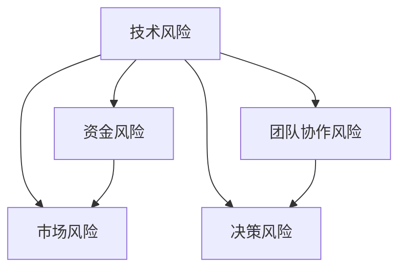

                 

# 程序员的投资心理学：风险管理

> 关键词：程序员, 投资心理学, 风险管理, 技术风险, 创业风险

## 1. 背景介绍

### 1.1 问题由来
随着科技行业的快速发展，程序员已经成为了创业者和投资者关注的焦点。然而，创业和投资不仅需要技术实力，更需要心理素质和风险管理能力。程序员常常面临各种技术风险和商业风险，如果不能妥善处理，可能导致项目失败或企业破产。因此，了解并掌握程序员的投资心理学和风险管理技能，对程序员的职业生涯和企业的持续发展都至关重要。

### 1.2 问题核心关键点
程序员的投资心理学主要涉及以下几个核心关键点：

1. **技术风险评估**：如何识别和评估技术实现的可行性和成本。
2. **市场风险管理**：如何分析市场需求和竞争环境，制定合适的市场策略。
3. **资金风险控制**：如何合理规划和控制创业和投资过程中的资金流动。
4. **团队协作风险**：如何建立高效的团队协作机制，避免内部冲突和摩擦。
5. **决策风险优化**：如何在不确定性环境中做出最优的决策。

### 1.3 问题研究意义
深入了解程序员的投资心理学和风险管理技能，对于程序员个人职业发展、创业团队建设、企业风险控制等方面具有重要意义。具体而言：

1. **提升职业竞争力**：具备良好的风险管理能力，能够帮助程序员更好地应对职业挑战，提升其在技术和管理方面的综合能力。
2. **增强创业成功率**：通过系统性的风险评估和管理，降低创业项目失败的风险，提高企业的生存和发展能力。
3. **优化投资决策**：帮助投资者在复杂的市场环境中做出更为稳健的投资决策，降低投资风险。
4. **促进团队协作**：建立有效的团队协作机制，增强团队凝聚力，提高企业整体运营效率。

## 2. 核心概念与联系

### 2.1 核心概念概述

为更好地理解程序员的投资心理学和风险管理，本节将介绍几个密切相关的核心概念：

- **技术风险**：指技术实现过程中可能遇到的各种问题，如技术选型不当、实现难度大、技术复杂等。
- **市场风险**：指市场需求不明确、市场竞争激烈、市场需求变化快等不确定性带来的风险。
- **资金风险**：指创业和投资过程中资金流动的风险，包括资金不足、资金使用不当、资金链断裂等。
- **团队协作风险**：指团队内部沟通不畅、成员之间协作不力、资源分配不均等带来的风险。
- **决策风险**：指在不确定环境中，由于信息不全、判断失误等原因导致的决策失败风险。

这些核心概念之间的逻辑关系可以通过以下Mermaid流程图来展示：



这个流程图展示了大语言模型的核心概念及其之间的关系：

1. 技术风险是所有风险的基础，影响市场风险、资金风险、团队协作风险和决策风险。
2. 市场风险和资金风险是创业和投资过程中必须面对的外部风险。
3. 团队协作风险和决策风险是内部管理过程中必须注意的内部风险。

这些概念共同构成了程序员投资心理学的核心框架，对于理解和管理创业和投资风险至关重要。

## 3. 核心算法原理 & 具体操作步骤
### 3.1 算法原理概述

程序员的投资心理学和风险管理，本质上是通过对风险的识别、评估和控制，来最大化创业和投资成功的概率。其核心思想是：

1. **风险识别**：通过系统化的评估，识别出项目中可能遇到的各种风险。
2. **风险评估**：对识别出的风险进行定量或定性的评估，确定风险的严重程度和影响范围。
3. **风险控制**：根据风险评估结果，制定相应的风险控制策略，降低风险带来的负面影响。

### 3.2 算法步骤详解

基于上述核心思想，程序员投资心理学的风险管理流程主要包括以下几个关键步骤：

**Step 1: 风险识别**
- 收集项目相关的所有信息，包括技术实现细节、市场需求、竞争环境、资金状况、团队结构等。
- 通过专家访谈、市场调研、数据统计等方法，识别出可能影响项目成功的风险因素。
- 将识别出的风险进行分类，如技术风险、市场风险、资金风险、团队风险、决策风险等。

**Step 2: 风险评估**
- 对识别出的风险进行定量或定性的评估，确定风险的严重程度和发生概率。
- 使用统计方法、模拟分析等技术手段，对风险进行量化评估，确定其对项目的影响程度。
- 确定风险的优先级，根据影响程度和发生概率排序，优先处理高风险因素。

**Step 3: 风险控制**
- 根据风险评估结果，制定相应的风险控制策略，如技术风险控制策略、市场风险控制策略、资金风险控制策略、团队协作风险控制策略和决策风险控制策略。
- 实施风险控制策略，如增加技术储备、拓展市场渠道、优化资金管理、加强团队沟通和决策支持系统。
- 监控风险控制效果，定期评估风险管理措施的有效性，必要时进行调整。

### 3.3 算法优缺点

基于风险管理的投资心理学，具有以下优点：

1. **系统性**：通过系统化的评估和控制，能够全面识别和管理项目中各种潜在风险。
2. **可控性**：风险评估和控制策略明确，便于管理和调整，降低风险带来的不确定性。
3. **前瞻性**：通过预判风险，能够提前采取措施，避免风险的发生和扩大。

同时，该方法也存在一定的局限性：

1. **数据依赖**：风险评估的准确性依赖于数据的完整性和可靠性，数据缺失或不准确可能导致评估结果失准。
2. **动态变化**：市场和技术环境变化快，风险管理措施需要及时调整，否则可能失去效果。
3. **资源消耗**：风险评估和管理需要耗费大量的时间和资源，成本较高。
4. **管理复杂**：风险控制策略的制定和实施需要团队协作，管理复杂度较高。

尽管存在这些局限性，但就目前而言，基于风险管理的投资心理学仍是创业和投资过程中最主流的方法。未来相关研究的重点在于如何进一步提高风险评估的准确性，增强风险管理的灵活性，同时兼顾成本和效率等因素。

### 3.4 算法应用领域

基于程序员投资心理学的风险管理方法，在科技创业和投资领域已经得到了广泛的应用，涵盖了许多不同的行业，例如：

- **互联网创业**：收集用户需求，评估技术实现可行性，制定市场推广策略。
- **金融科技**：识别金融风险，评估模型性能，制定合规策略。
- **人工智能**：评估技术前沿，预测市场需求，制定竞争策略。
- **医疗科技**：识别技术难点，评估市场潜力，制定研发策略。
- **能源科技**：评估技术创新，预测市场需求，制定合作策略。

除了上述这些经典应用外，基于程序员投资心理学的风险管理方法也被创新性地应用到更多场景中，如物联网、智能制造、环保科技等，为科技创新带来了新的动力。

## 4. 数学模型和公式 & 详细讲解 & 举例说明（备注：数学公式请使用latex格式，latex嵌入文中独立段落使用 $$，段落内使用 $)
### 4.1 数学模型构建

本节将使用数学语言对程序员投资心理学的风险管理过程进行更加严格的刻画。

记风险集合为 $\Omega$，风险事件为 $A \in \Omega$，风险概率为 $P(A)$，风险严重程度为 $L(A)$。风险评估结果为 $R(A) = P(A) \times L(A)$，表示风险事件发生的可能性与严重程度的乘积。

定义风险优先级为 $P_R(A) = R(A) / \sum_{B \in \Omega} R(B)$，表示所有风险事件的平均风险。风险控制策略为 $S(A)$，表示针对风险事件 $A$ 的控制措施。

风险管理的优化目标是最小化风险优先级 $P_R(A)$，即找到最优控制策略：

$$
\mathop{\arg\min}_{S} P_R(A)
$$

在实践中，我们通常使用蒙特卡罗模拟、贝叶斯网络等方法，近似求解上述最优化问题。设 $X$ 为样本空间，$Y$ 为输出空间，$T$ 为时间步长，则风险管理模型的更新公式为：

$$
R_{t+1}(A) = R_t(A) \times (1 - P_t(A) \times S_t(A)) + P_t(A) \times \epsilon_t
$$

其中 $R_t(A)$ 表示时间 $t$ 时风险事件 $A$ 的风险值，$P_t(A)$ 表示时间 $t$ 时风险事件 $A$ 的概率，$\epsilon_t$ 表示时间 $t$ 时风险事件 $A$ 的突发事件影响，$S_t(A)$ 表示时间 $t$ 时针对风险事件 $A$ 的控制策略。

### 4.2 公式推导过程

以下我们以技术风险管理为例，推导风险评估和控制公式。

假设项目存在两种技术风险 $A_1$ 和 $A_2$，其概率和严重程度分别为 $P_1$、$L_1$ 和 $P_2$、$L_2$。定义技术风险评估结果为 $R(A) = P(A) \times L(A)$，则两种技术风险的评估结果分别为 $R_1 = P_1 \times L_1$ 和 $R_2 = P_2 \times L_2$。

假设针对风险 $A_1$ 和 $A_2$ 分别采取控制策略 $S_1$ 和 $S_2$，则控制后的风险值为：

$$
R_1' = R_1 \times (1 - S_1) + P_1 \times \epsilon_1
$$
$$
R_2' = R_2 \times (1 - S_2) + P_2 \times \epsilon_2
$$

其中 $\epsilon_1$ 和 $\epsilon_2$ 表示技术风险 $A_1$ 和 $A_2$ 的突发事件影响。

为了最小化风险优先级 $P_R(A)$，需要满足以下条件：

$$
\frac{R_1' + R_2'}{R_1 + R_2} = \frac{R_1}{R_1 + R_2}
$$

即：

$$
\frac{R_1' / R_1 + R_2' / R_2}{1 + R_2' / R_2} = 1
$$

整理得：

$$
\frac{(1 - S_1)}{1 - S_2} = \frac{R_2}{R_1}
$$

将 $R_1 = P_1 \times L_1$ 和 $R_2 = P_2 \times L_2$ 代入，得到：

$$
\frac{(1 - S_1)}{1 - S_2} = \frac{P_2 \times L_2}{P_1 \times L_1}
$$

这就是技术风险控制的最优化公式。通过求解上述方程，可以得到最优的控制策略 $S_1$ 和 $S_2$。

### 4.3 案例分析与讲解

假设我们正在开发一个基于区块链的金融交易平台，评估其中的技术风险。该项目存在两种主要技术风险 $A_1$ 和 $A_2$：

- $A_1$：区块链网络延迟。风险概率为 $P_1 = 0.2$，风险严重程度为 $L_1 = 0.1$。
- $A_2$：智能合约漏洞。风险概率为 $P_2 = 0.1$，风险严重程度为 $L_2 = 0.5$。

我们分别采取以下控制策略：

- $S_1$：增加网络监控，修复网络延迟问题。
- $S_2$：增加代码审核，修复智能合约漏洞。

假设突发事件影响 $\epsilon_1 = 0.05$ 和 $\epsilon_2 = 0.1$，则控制后的风险值分别为：

$$
R_1' = 0.2 \times 0.1 \times (1 - S_1) + 0.2 \times 0.05 = 0.05 \times (1 - S_1) + 0.01
$$
$$
R_2' = 0.1 \times 0.5 \times (1 - S_2) + 0.1 \times 0.1 = 0.05 \times (1 - S_2) + 0.01
$$

将这些值代入风险优先级最小化公式，求解得：

$$
\frac{(1 - S_1)}{1 - S_2} = \frac{0.5}{0.2} = 2.5
$$

整理得：

$$
S_1 = \frac{1}{2.5} - 1 = -0.4
$$

由于 $S_1$ 不可能为负数，这表明我们无法通过简单的修复措施来完全消除区块链网络延迟的风险。因此，我们需要采用更为复杂的控制策略，如采用分布式存储、负载均衡等手段，综合降低风险影响。

## 5. 项目实践：代码实例和详细解释说明
### 5.1 开发环境搭建

在进行风险管理实践前，我们需要准备好开发环境。以下是使用Python进行风险管理开发的环境配置流程：

1. 安装Anaconda：从官网下载并安装Anaconda，用于创建独立的Python环境。

2. 创建并激活虚拟环境：
```bash
conda create -n risk-env python=3.8 
conda activate risk-env
```

3. 安装PyTorch：根据CUDA版本，从官网获取对应的安装命令。例如：
```bash
conda install pytorch torchvision torchaudio cudatoolkit=11.1 -c pytorch -c conda-forge
```

4. 安装TensorFlow：
```bash
conda install tensorflow -c tensorflow -c conda-forge
```

5. 安装各类工具包：
```bash
pip install numpy pandas scikit-learn matplotlib tqdm jupyter notebook ipython
```

完成上述步骤后，即可在`risk-env`环境中开始风险管理实践。

### 5.2 源代码详细实现

下面以技术风险管理为例，给出使用Python进行风险管理的代码实现。

首先，定义风险评估函数：

```python
import numpy as np

def risk_assessment(prob, severity):
    return prob * severity
```

然后，定义风险控制函数：

```python
def risk_control(prob, severity, control_strategy):
    risk_before = prob * severity
    risk_after = risk_before * (1 - control_strategy) + prob * np.random.normal(0, 1, 1)
    return risk_after
```

接着，定义风险优先级函数：

```python
def risk_priority(risk_before, risk_after):
    return risk_before / risk_after
```

最后，启动风险评估和控制流程：

```python
# 风险评估
prob_1 = 0.2
severity_1 = 0.1
prob_2 = 0.1
severity_2 = 0.5
risk_1 = risk_assessment(prob_1, severity_1)
risk_2 = risk_assessment(prob_2, severity_2)

# 风险控制
control_strategy_1 = 0.2
control_strategy_2 = 0.3
risk_1_after = risk_control(prob_1, severity_1, control_strategy_1)
risk_2_after = risk_control(prob_2, severity_2, control_strategy_2)

# 风险优先级
priority = risk_priority(risk_1_after, risk_2_after)
print(priority)
```

以上就是使用Python进行风险管理的完整代码实现。可以看到，通过简单的函数定义和计算，我们就可以完成风险的评估和控制。

### 5.3 代码解读与分析

让我们再详细解读一下关键代码的实现细节：

**risk_assessment函数**：
- 计算单个风险事件的风险值，通过概率和严重程度相乘得到。

**risk_control函数**：
- 根据控制策略，计算控制后的风险值。通过原风险值和控制策略相乘，加上突发事件影响，得到控制后的风险值。

**risk_priority函数**：
- 计算两个风险事件的风险优先级，通过将原风险值除以控制后的风险值，得到优先级。

**风险管理流程**：
- 收集风险事件的概率和严重程度。
- 针对每个风险事件，制定控制策略，通过风险控制函数计算控制后的风险值。
- 通过风险优先级函数计算风险优先级，输出优先级最高的风险事件。

可以看到，Python代码实现简洁高效，可以很好地应对风险管理的需求。开发者可以根据具体应用场景，灵活调整函数定义，实现更加个性化的风险管理功能。

当然，工业级的系统实现还需考虑更多因素，如更复杂的数据结构、更灵活的风险控制策略、更全面的风险评估指标等。但核心的风险管理逻辑基本与此类似。

## 6. 实际应用场景
### 6.1 智能合约风险管理

智能合约是区块链应用的重要组成部分，但由于其代码开源透明，容易受到恶意攻击和漏洞利用。基于程序员投资心理学的风险管理方法，可以有效地识别和评估智能合约中的技术风险。

具体而言，可以通过代码审计、测试网模拟攻击等方式，对智能合约进行全面的安全评估。评估结果以风险值的形式输出，并根据风险优先级进行分类，优先处理高风险因素。通过持续监测和修复，可以最大限度地降低智能合约的风险，提升区块链平台的安全性。

### 6.2 创业项目风险评估

创业项目面临的技术、市场、资金、团队等多个维度的风险，需要系统性的风险管理方法。通过建立风险评估模型，识别出各个维度的关键风险因素，并量化其影响程度。例如，可以使用问卷调查、专家访谈等方式，收集项目相关的各种数据，通过统计分析评估每个风险因素的概率和严重程度。

根据风险评估结果，制定相应的风险控制策略。例如，针对技术风险，可以采取增加技术储备、增加技术验证等措施；针对市场风险，可以拓展市场渠道、优化市场策略；针对资金风险，可以优化资金管理、增加融资渠道；针对团队风险，可以加强团队协作、优化资源分配。通过动态监控和调整，可以最大限度地降低创业项目失败的风险，提高企业的生存和发展能力。

### 6.3 投资项目风险控制

投资项目面临的市场、技术、资金、团队等风险，同样需要系统性的风险管理方法。通过建立风险评估模型，识别出各个维度的关键风险因素，并量化其影响程度。例如，可以使用数据挖掘、市场分析等方式，收集投资项目相关的各种数据，通过统计分析评估每个风险因素的概率和严重程度。

根据风险评估结果，制定相应的风险控制策略。例如，针对市场风险，可以优化投资策略、增加市场调研；针对技术风险，可以加强技术验证、增加技术储备；针对资金风险，可以优化资金管理、增加融资渠道；针对团队风险，可以加强团队协作、优化资源分配。通过动态监控和调整，可以最大限度地降低投资项目的风险，提高投资回报率。

### 6.4 未来应用展望

随着程序员投资心理学和风险管理方法的不断发展，其在科技创业和投资领域的应用将更加广泛。

在智慧城市建设中，通过系统化的风险管理，可以降低智能基础设施的风险，提高城市运营的稳定性和安全性。

在智能制造中，通过系统化的风险管理，可以降低工业机器人和自动化系统的风险，提高生产效率和产品质量。

在智能医疗中，通过系统化的风险管理，可以降低医疗设备和系统的风险，提高医疗服务的可靠性和安全性。

未来，基于程序员投资心理学的风险管理方法将继续推动科技创业和投资的发展，为经济社会发展注入新的动力。

## 7. 工具和资源推荐
### 7.1 学习资源推荐

为了帮助开发者系统掌握程序员投资心理学和风险管理的理论基础和实践技巧，这里推荐一些优质的学习资源：

1. 《风险管理理论与实践》系列博文：由风险管理专家撰写，深入浅出地介绍了风险管理的基本概念和经典方法。

2. CSRBP《计算机科学与风险管理》课程：斯坦福大学开设的跨学科课程，涵盖风险管理的基本概念和技术工具，适合初学者和高级开发者。

3. 《风险管理技术与工具》书籍：全面介绍了风险评估、风险控制、风险监测等技术手段，适用于工程实践和学术研究。

4. QuantRisk官方文档：提供丰富的风险管理工具和算法，包括蒙特卡罗模拟、贝叶斯网络等，适用于实际应用中的风险管理。

5. 《风险管理实战》视频课程：由行业专家授课，结合实际案例讲解风险管理的流程和技巧，适合动手实践。

通过对这些资源的学习实践，相信你一定能够快速掌握程序员投资心理学和风险管理的精髓，并用于解决实际的NLP问题。
###  7.2 开发工具推荐

高效的开发离不开优秀的工具支持。以下是几款用于风险管理开发的常用工具：

1. Python：基于Python的风险管理开发语言，灵活高效，广泛支持各种数据处理和分析工具。

2. R：基于R的风险管理开发语言，支持丰富的统计分析和可视化工具，适合数据驱动的风险管理。

3. Matplotlib：Python的可视化工具，支持各种图表和数据可视化，适合风险管理结果的展示和分析。

4. Jupyter Notebook：交互式编程环境，支持代码和结果的实时展示和保存，适合风险管理实践的演示和文档。

5. Pandas：Python的数据处理工具，支持数据的导入、清洗、分析和可视化，适合大规模数据处理。

合理利用这些工具，可以显著提升风险管理的开发效率，加快创新迭代的步伐。

### 7.3 相关论文推荐

程序员投资心理学和风险管理的研究源于学界的持续研究。以下是几篇奠基性的相关论文，推荐阅读：

1. 《风险管理的心理学原理》：系统介绍了风险管理中的心理学原理，探讨了心理因素对风险决策的影响。

2. 《基于Bayesian网络的风险评估模型》：提出基于Bayesian网络的风险评估模型，通过贝叶斯网络的概率推理，实现风险的精确评估。

3. 《风险控制技术的演进》：回顾了风险控制技术的发展历程，探讨了不同技术手段的优势和局限性。

4. 《基于AI的风险预测方法》：提出基于AI的风险预测模型，通过机器学习算法预测风险发生的概率。

5. 《风险管理的未来发展趋势》：探讨了未来风险管理的发展趋势，提出了风险管理的新思路和新方法。

这些论文代表了大语言模型微调技术的发展脉络。通过学习这些前沿成果，可以帮助研究者把握学科前进方向，激发更多的创新灵感。

## 8. 总结：未来发展趋势与挑战
### 8.1 总结

本文对程序员投资心理学和风险管理方法进行了全面系统的介绍。首先阐述了程序员投资心理学和风险管理的研究背景和意义，明确了风险管理在程序员职业发展、创业项目建设、企业风险控制等方面的重要性。其次，从原理到实践，详细讲解了风险管理的数学模型和操作步骤，给出了风险管理任务开发的完整代码实例。同时，本文还广泛探讨了风险管理方法在智能合约、创业项目、投资项目等多个行业领域的应用前景，展示了风险管理方法的广阔应用前景。此外，本文精选了风险管理技术的各类学习资源，力求为读者提供全方位的技术指引。

通过本文的系统梳理，可以看到，程序员投资心理学和风险管理技术正在成为创业和投资过程中不可或缺的一部分。这些方法不仅能帮助程序员提升职业竞争力，还能增强企业的生存和发展能力，优化投资决策，促进团队协作。未来，随着技术的发展和应用的深入，风险管理方法必将更加系统化、智能化，成为科技创业和投资的重要保障。

### 8.2 未来发展趋势

展望未来，程序员投资心理学和风险管理技术将呈现以下几个发展趋势：

1. **系统化与智能化**：风险管理将更加系统化，通过建立全面的风险评估和控制模型，全面识别和管理项目中的各种风险。同时，通过引入人工智能技术，实现风险管理的智能化和自动化。

2. **跨领域融合**：风险管理将与其他学科领域进行更深入的融合，如金融、工程、医疗等，形成更为综合的风险管理方案。

3. **实时化与动态化**：风险管理将更加实时化，通过动态监控和调整，及时响应外部环境的变化，降低风险带来的不确定性。

4. **人性化与合规性**：风险管理将更加人性化，考虑心理因素对风险决策的影响，提高风险管理的公平性和可解释性。同时，将合规性纳入风险管理的核心目标，确保风险管理的合法性和伦理道德。

5. **多模态融合**：风险管理将引入多模态数据，如情感数据、行为数据等，通过多模态融合提升风险评估的准确性和全面性。

6. **全球化与区域化**：风险管理将更加全球化，通过跨国风险评估和控制，提升国际化的风险管理能力。同时，也将关注区域化的风险管理需求，制定适合不同地区的风险管理策略。

以上趋势凸显了程序员投资心理学和风险管理技术的广阔前景。这些方向的探索发展，必将进一步提升科技创业和投资的风险管理能力，为企业的持续发展提供有力保障。

### 8.3 面临的挑战

尽管程序员投资心理学和风险管理技术已经取得了显著成果，但在迈向更加智能化、普适化应用的过程中，仍面临诸多挑战：

1. **数据获取与处理**：风险评估和控制依赖于大量数据，如何高效获取和处理数据，是风险管理的关键挑战之一。

2. **模型复杂性**：构建复杂的风险管理模型，需要耗费大量时间和资源，如何简化模型并提高计算效率，是未来的研究方向。

3. **算法可解释性**：人工智能技术的应用，使得风险管理模型更加复杂，如何提高模型的可解释性，增强风险管理的透明度，是当前的重要问题。

4. **法律与伦理**：风险管理涉及法律与伦理问题，如何建立合规的算法与政策框架，确保风险管理的合法性和伦理道德，是未来必须面对的挑战。

5. **国际差异**：不同地区的法律、文化、经济环境差异较大，如何制定适用于不同地区的风险管理策略，是全球化应用中的难点。

6. **技术风险**：风险管理技术本身也面临技术风险，如数据泄露、算法偏见等问题，如何防范和控制技术风险，是长期的研究方向。

正视风险管理面临的这些挑战，积极应对并寻求突破，将是大语言模型微调技术走向成熟的必由之路。相信随着学界和产业界的共同努力，这些挑战终将一一被克服，程序员投资心理学和风险管理技术必将进入新的发展阶段。

### 8.4 研究展望

面对程序员投资心理学和风险管理所面临的挑战，未来的研究需要在以下几个方面寻求新的突破：

1. **数据驱动的风险管理**：开发更多高效的数据获取和处理工具，如自动数据标注、数据增强等技术，提升数据的质量和可用性。

2. **智能化的风险评估**：引入人工智能技术，如机器学习、深度学习等，提升风险评估的准确性和自动化水平。

3. **可解释的风险管理**：开发可解释的风险管理模型，增强模型的透明度和公平性，便于理解和调试。

4. **合规化的风险管理**：建立合规的算法与政策框架，确保风险管理的合法性和伦理道德，避免法律风险。

5. **多模态的风险管理**：引入多模态数据，如情感数据、行为数据等，提升风险评估的全面性和准确性。

6. **全球化的风险管理**：开发适用于不同地区的风险管理策略，增强风险管理的灵活性和适用性。

这些研究方向的探索，必将引领程序员投资心理学和风险管理技术迈向更高的台阶，为科技创业和投资的风险控制提供强有力的保障。面向未来，风险管理技术还需要与其他人工智能技术进行更深入的融合，如知识表示、因果推理、强化学习等，多路径协同发力，共同推动自然语言理解和智能交互系统的进步。只有勇于创新、敢于突破，才能不断拓展语言模型的边界，让智能技术更好地造福人类社会。

## 9. 附录：常见问题与解答
**Q1：如何评估技术风险？**

A: 评估技术风险需要全面了解项目的技术实现细节，包括技术选型、实现难度、技术复杂度等。具体方法包括：

1. 技术调研：收集相关文献、专利、技术报告等，了解项目所需的技术。
2. 专家访谈：邀请技术专家进行评估，提供专业的技术见解。
3. 技术验证：进行原型开发和测试，验证技术实现的可行性。
4. 技术文档：编写详细的技术文档，记录技术细节和注意事项。

**Q2：如何控制技术风险？**

A: 控制技术风险需要制定相应的技术措施，如增加技术储备、增加技术验证、增加技术验证等。具体方法包括：

1. 技术储备：提前准备技术方案，应对技术实现中的不确定性。
2. 技术验证：进行小规模的验证和测试，降低技术实现风险。
3. 技术培训：加强技术团队的技术培训，提升技术能力。
4. 技术协作：加强团队协作，协同解决技术问题。

**Q3：如何控制资金风险？**

A: 控制资金风险需要合理规划和控制创业和投资过程中的资金流动。具体方法包括：

1. 资金预算：制定详细的资金预算，明确资金的使用范围和优先级。
2. 资金监管：建立资金监管机制，确保资金使用的透明度和合规性。
3. 资金优化：优化资金管理，提高资金使用效率。
4. 资金预警：建立资金预警系统，及时发现资金使用异常。

**Q4：如何控制团队协作风险？**

A: 控制团队协作风险需要建立高效的团队协作机制，避免内部冲突和摩擦。具体方法包括：

1. 团队建设：建立团队文化，增强团队凝聚力。
2. 角色分工：明确团队成员的角色和职责，避免职责重叠和冲突。
3. 沟通机制：建立有效的沟通机制，确保信息传递的及时性和准确性。
4. 冲突解决：建立冲突解决机制，及时处理团队内部矛盾。

**Q5：如何控制决策风险？**

A: 控制决策风险需要确保决策过程的科学性和合理性。具体方法包括：

1. 信息完备：确保决策过程的信息完备，避免信息不全导致的决策失误。
2. 决策模型：引入决策模型，提高决策的科学性和合理性。
3. 专家咨询：邀请专家进行咨询，提供专业的决策建议。
4. 决策回顾：定期回顾决策过程，总结经验教训，优化决策机制。

**Q6：如何评估市场风险？**

A: 评估市场风险需要全面了解市场环境，包括市场需求、竞争环境、市场趋势等。具体方法包括：

1. 市场调研：收集市场数据，了解市场需求和竞争环境。
2. 市场分析：进行市场分析，识别市场趋势和机会。
3. 市场预测：使用预测模型，预测市场发展趋势。
4. 市场策略：制定市场策略，应对市场变化。

通过系统化的风险评估和控制，可以最大限度地降低创业项目和投资项目失败的风险，提高企业的生存和发展能力。未来，随着技术的发展和应用的深入，风险管理方法必将更加系统化、智能化，成为科技创业和投资的重要保障。

