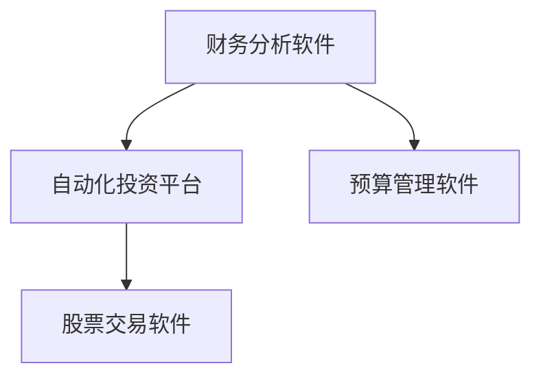

                 

# 程序员的理财工具箱：软件推荐

> 关键词：理财软件、财务分析、自动化投资、预算管理、股票交易

## 1. 背景介绍

程序员通常面临繁重的工作压力和复杂的职业发展路径，理财成为了许多人关注的问题。然而，尽管科技界人士具备广泛的知识和技能，他们在理财管理方面往往缺乏专业背景和经验。本博文旨在为程序员提供一套简单易用的理财工具箱，包含几款能够显著提升个人财务管理效率的软件推荐。

## 2. 核心概念与联系

### 2.1 核心概念概述

本文将介绍几款关键理财软件，它们通过技术手段帮助用户实现财务管理和投资优化。

- **财务分析软件（Financial Analysis Software）**：帮助用户跟踪收入、支出、债务，并根据历史数据进行财务分析的软件。
- **自动化投资平台（Automated Investment Platforms）**：利用算法和AI技术，为用户自动选择和买卖股票、基金等投资工具的平台。
- **预算管理软件（Budgeting Software）**：通过设置预算、追踪支出，帮助用户合理规划和管理个人财务的软件。
- **股票交易软件（Stock Trading Software）**：提供实时市场数据、交易分析，并支持各种投资策略的软件。

这些核心概念间的关系可以用以下Mermaid流程图表示：



该图展示了这些软件之间的相互依赖关系：财务分析软件提供了数据基础，预算管理软件和自动化投资平台基于财务分析进行决策，而股票交易软件则提供具体的交易执行和市场信息。

## 3. 核心算法原理 & 具体操作步骤

### 3.1 算法原理概述

理财软件的核心算法通常基于以下几个原理：

- **历史数据分析**：通过分析历史财务数据，预测未来的收入和支出趋势。
- **风险评估**：基于用户的风险偏好和市场数据，评估不同投资组合的风险。
- **优化策略**：利用数学优化算法，如线性规划和整数规划，优化投资组合。
- **学习算法**：应用机器学习算法，如决策树、神经网络，进行更精准的财务预测和决策。

### 3.2 算法步骤详解

以财务分析软件为例，常见的财务分析步骤包括：

1. **数据收集**：从银行账户、信用卡、投资账户等渠道，收集财务数据。
2. **数据清理**：处理缺失值、异常值，保证数据的质量。
3. **数据可视化**：利用图表展示财务数据，帮助用户理解现状。
4. **趋势分析**：通过历史数据分析，预测未来的财务状况。
5. **建议生成**：根据分析结果，生成优化建议。

### 3.3 算法优缺点

财务分析软件的主要优点包括：

- **自动化**：无需手动输入数据，算法自动计算并提供财务分析结果。
- **精确性**：基于大数据和先进算法，分析结果更为精准。

缺点主要包括：

- **复杂性**：算法复杂，可能难以理解。
- **数据隐私**：需要提供详细的财务数据，存在隐私泄露风险。

### 3.4 算法应用领域

财务分析软件广泛应用于企业财务分析、个人财务管理等多个场景。它帮助企业做出更有信息量的投资决策，同时为个人理财提供数据支持和决策建议。

## 4. 数学模型和公式 & 详细讲解 & 举例说明

### 4.1 数学模型构建

本节通过一个简单的线性回归模型来讲解财务分析软件背后的数学原理。假设我们有$n$个历史财务数据点$(x_i,y_i)$，其中$x_i$为自变量（如时间），$y_i$为因变量（如收入），模型的目标是找到一条直线$\hat{y}=w_0+w_1x$，使其最小化预测误差$\epsilon_i=y_i-\hat{y}_i$。

### 4.2 公式推导过程

根据最小二乘法，我们希望最小化平方误差$\sum_{i=1}^n\epsilon_i^2$，即求解：

$$
\min_{w_0,w_1} \frac{1}{2n}\sum_{i=1}^n(y_i-w_0-w_1x_i)^2
$$

通过求解这个最优化问题，可以得到最优的回归系数：

$$
\begin{cases}
w_1=\frac{\sum_{i=1}^n(x_iy_i-\bar{x}\bar{y})}{\sum_{i=1}^n(x_i^2-\bar{x}^2)} \\
w_0=\bar{y}-w_1\bar{x}
\end{cases}
$$

其中$\bar{x}=\frac{1}{n}\sum_{i=1}^nx_i$，$\bar{y}=\frac{1}{n}\sum_{i=1}^ny_i$。

### 4.3 案例分析与讲解

假设某用户的历史数据如下：

| 时间（月） | 收入（美元） |
|------------|--------------|
| 1          | 5000         |
| 2          | 5500         |
| 3          | 6000         |
| ...        | ...          |
| 12         | 6500         |

通过求解上述线性回归模型，可以得到收入的线性预测模型，进而预测未来收入趋势。

## 5. 项目实践：代码实例和详细解释说明

### 5.1 开发环境搭建

在开始编码前，需要安装Python及其相关的科学计算库，如NumPy、Pandas、Matplotlib等。以下是一个简单的Python开发环境搭建步骤：

```bash
conda create -n finance-env python=3.8
conda activate finance-env
pip install numpy pandas matplotlib seaborn
```

### 5.2 源代码详细实现

以下是一个简单的Python代码示例，用于读取数据、进行线性回归分析并绘制图形：

```python
import numpy as np
import pandas as pd
import matplotlib.pyplot as plt
from sklearn.linear_model import LinearRegression

# 数据
data = pd.read_csv('income.csv')

# 创建模型
model = LinearRegression()
X = data['time'].values.reshape(-1, 1)
y = data['income'].values.reshape(-1, 1)
model.fit(X, y)

# 预测并绘图
future_time = np.array(range(1, 13))  # 未来1-12个月
future_income = model.predict(future_time)

plt.plot(data['time'], data['income'], 'o', label='Data')
plt.plot(future_time, future_income, label='Prediction')
plt.xlabel('Time')
plt.ylabel('Income')
plt.legend()
plt.show()
```

### 5.3 代码解读与分析

上述代码中，首先导入了必要的库，并从CSV文件中读取数据。然后使用线性回归模型，拟合历史数据并生成未来预测。最后通过绘图展示结果。

### 5.4 运行结果展示

运行上述代码后，将会生成一个包含历史数据和未来预测的图表，展示了收入随时间的变化趋势。

## 6. 实际应用场景

### 6.1 个人理财规划

某程序员希望通过软件预测未来一年的收入和支出，进行合理规划。使用上述代码，该程序员能够获得准确的收入趋势预测，从而更好地制定预算和储蓄计划。

### 6.2 企业投资决策

某初创公司需要评估其未来几个月的资金流状况，以便调整运营策略。使用财务分析软件，公司可以精确预测未来的现金流和财务状况，并据此制定有效的投资策略。

## 7. 工具和资源推荐

### 7.1 学习资源推荐

1. **Python数据分析教程**：通过数据驱动的方法，掌握Python在财务分析中的应用。
2. **金融工程课程**：涵盖金融工程的核心概念和方法，如衍生品定价、风险管理等。
3. **财务建模书籍**：如《期权、期货及其他衍生品》（Paul Wilmott著），深入讲解金融衍生品模型。
4. **量化投资博客**：如QuantStart，提供大量实际案例和量化策略。

### 7.2 开发工具推荐

1. **Python**：简单易学，适合进行财务分析和模型开发。
2. **Jupyter Notebook**：交互式编程环境，方便代码调试和数据可视化。
3. **Rapidminer**：数据挖掘和机器学习工具，提供可视化分析界面。

### 7.3 相关论文推荐

1. **《金融时间序列分析》**（Ruey Tsay著）：讲解时间序列分析和预测方法。
2. **《应用随机过程》**（Walter S. Stoker著）：介绍随机过程在金融中的应用。
3. **《机器学习在金融中的应用》**（Gareth James, Daniela Witten, Trevor Hastie, Robert Tibshirani著）：讲解机器学习在金融数据分析中的应用。

## 8. 总结：未来发展趋势与挑战

### 8.1 研究成果总结

本文介绍了几款常用理财软件及其背后的数学模型，通过实践示例展示了如何使用Python进行财务分析。这些软件利用先进的算法和数据分析技术，帮助程序员更加轻松地进行理财管理和投资决策。

### 8.2 未来发展趋势

理财软件未来发展趋势包括：

- **智能化升级**：通过引入更多AI算法，如强化学习、深度学习，提升预测和决策的准确性。
- **跨平台集成**：支持多设备、多平台，增强用户便利性。
- **个性化服务**：利用大数据和机器学习，提供更加个性化的理财建议。

### 8.3 面临的挑战

理财软件面临的挑战包括：

- **数据隐私保护**：确保用户数据安全和隐私保护。
- **算法复杂性**：算法模型的可解释性，避免"黑盒"问题。
- **市场波动**：在市场不稳定时，算法输出的稳健性。

### 8.4 研究展望

未来的研究应集中在以下几个方面：

- **算法优化**：提升算法的效率和准确性。
- **模型解释性**：开发易于解释和理解的模型。
- **跨领域融合**：与金融、经济、心理学等领域的深度融合，提供全面的理财支持。

## 9. 附录：常见问题与解答

**Q1：如何选择合适的理财软件？**

A: 应根据个人需求选择合适的软件，如关注自动化投资、财务分析或预算管理。可以考虑软件的易用性、安全性、准确性和隐私保护等方面。

**Q2：如何使用Python进行财务分析？**

A: 使用Python的Pandas和Scikit-learn库，可以轻松进行数据清理、数据分析和模型训练。通过编写代码，实现自定义的财务分析功能。

**Q3：理财软件有哪些注意事项？**

A: 使用理财软件时，应注意数据隐私保护、选择合适的算法模型、定期更新软件以适应最新的财务数据。

**Q4：如何提升理财软件的稳定性？**

A: 通过引入更多的金融模型和数据验证方法，提高理财软件在市场波动情况下的稳定性。

---

作者：禅与计算机程序设计艺术 / Zen and the Art of Computer Programming

