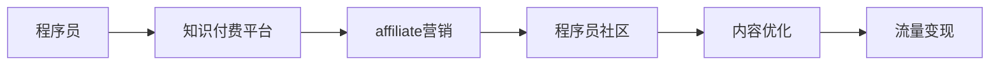

                 

# 程序员的知识付费affiliate营销策略

> 关键词：知识付费,affiliate营销,程序员,流量变现,自动化,技术社区,内容优化

## 1. 背景介绍

### 1.1 问题由来
随着互联网和数字化技术的发展，越来越多的程序员和开发者开始意识到通过在线教育、知识付费等新兴模式来变现自身价值的重要性。特别是对于具有技术优势和专业知识的程序员来说，通过知识付费不仅能扩大自己的技术影响力，还能增加收入来源。然而，知识付费市场竞争激烈，如何从众多平台中脱颖而出，实现高效流量变现，成为程序员需要认真思考的问题。

## 2. 核心概念与联系

### 2.1 核心概念概述
为了深入理解如何通过知识付费affiliate营销策略进行流量变现，我们首先需要理解一些核心概念：

- **知识付费**：指的是通过在线平台出售专业知识、技术文章、课程讲座等形式的内容，从而获得经济回报的一种商业模式。
- **affiliate营销**：是指通过推广商家的产品或服务，并在每次成功交易后获得佣金的一种营销模式。
- **程序员社区**：包括Stack Overflow、GitHub、Reddit、CSDN等，是程序员交流技术问题、分享代码和资源的重要平台。
- **内容优化**：针对目标受众的需求，优化内容的表达方式和格式，提高内容的吸引力和可读性。
- **流量变现**：通过吸引大量流量，实现广告、销售、赞助等形式的变现。

### 2.2 核心概念原理和架构的 Mermaid 流程图



## 3. 核心算法原理 & 具体操作步骤

### 3.1 算法原理概述
知识付费affiliate营销策略的核心在于利用程序员社区的影响力，推广和销售付费内容，并通过内容优化和流量变现实现收入。该策略的数学模型可以简化为：

$$ R = \sum_{i=1}^{n} C_i \times T_i \times C_{aff} $$

其中：
- $R$ 为总收益。
- $C_i$ 为第 $i$ 项内容的质量。
- $T_i$ 为第 $i$ 项内容的流量。
- $C_{aff}$ 为affiliate的佣金比例。

### 3.2 算法步骤详解

#### 3.2.1 内容选择与优化
1. **内容选择**：
   - 选择具有较高技术含量、受众需求大、市场空缺的技术内容进行知识付费。
   - 优先选择具有个人品牌效应的程序员进行内容创作。

2. **内容优化**：
   - 进行内容风格和格式调整，以提高内容的可读性和吸引力。
   - 利用SEO技术，优化内容在搜索引擎中的排名。
   - 使用图表、代码片段等形式辅助内容展示。

#### 3.2.2 社区推广
1. **选择目标社区**：
   - 根据目标受众的偏好和社区的活跃度选择推广平台。
   - 优先选择与目标内容高度相关、受众量大的社区。

2. **内容推广**：
   - 通过文章、视频、直播等形式在社区内进行内容推广。
   - 利用社区的算法推荐机制，提高内容的曝光率。

#### 3.2.3 流量变现
1. **内容定价**：
   - 根据内容的价值和市场接受度，制定合理的价格策略。
   - 提供试读/试看功能，降低潜在消费者的购买门槛。

2. **支付渠道**：
   - 提供多种支付方式，包括信用卡、支付宝、微信支付等。
   - 使用安全的支付系统，保护用户支付信息。

#### 3.2.4 收益分配
1. **佣金设置**：
   - 根据affiliate的推广效果，设定合理的佣金比例。
   - 通过效果广告(CTC)等模式，实现按效果分配收益。

2. **收益结算**：
   - 定期结算affiliate的收益，通过电子邮件或平台内通知告知。
   - 提供详细的收益报告，方便affiliate进行收益审计和优化。

### 3.3 算法优缺点

#### 3.3.1 优点
1. **高效变现**：通过程序员社区的影响力，可以快速吸引大量流量，实现高效的变现。
2. **低成本推广**：利用社区的推广机制，大大降低了推广成本。
3. **灵活变现**：支持多种变现形式，如广告、订阅、课程销售等。

#### 3.3.2 缺点
1. **内容质量依赖性强**：内容质量直接影响收益，需要持续投入创作和优化。
2. **用户信任度问题**：部分用户对知识付费有抵触心理，需要建立信任。
3. **平台规则风险**：部分社区对推广有严格限制，需注意合规性。

### 3.4 算法应用领域

affiliate营销策略主要应用于程序员社区的知识付费项目中，如个人博客、技术讲座、编程书籍等。其适用领域包括但不限于以下几类：

1. **技术博客**：程序员将自己的技术见解、项目经验等内容进行系统性整理和发布。
2. **在线课程**：程序员录制并出售技术课程，覆盖编程语言、算法、框架等多个方面。
3. **电子书和教程**：程序员编写的技术书籍和教程，通过知识付费平台销售。
4. **直播和研讨会**：程序员通过在线直播进行技术分享，收取订阅费用或单次费用。

## 4. 数学模型和公式 & 详细讲解 & 举例说明

### 4.1 数学模型构建

我们假设程序员社区中每个内容 $i$ 的流量为 $T_i$，内容的质量为 $C_i$。根据affiliate的推广效果，每个内容带来的收益为 $R_i$。设affiliate的佣金比例为 $C_{aff}$，则总收益 $R$ 可以表示为：

$$ R = \sum_{i=1}^{n} R_i \times C_{aff} $$

其中 $R_i = C_i \times T_i$。

### 4.2 公式推导过程

1. **流量模型**：
   $$ T_i = f(C_i, M_i) $$
   其中 $M_i$ 为影响流量的其他因素，如推广渠道、用户反馈等。

2. **收益模型**：
   $$ R_i = C_i \times T_i = C_i \times f(C_i, M_i) $$

3. **affiliate收益**：
   $$ R_{aff} = \sum_{i=1}^{n} R_i \times C_{aff} = C_{aff} \times \sum_{i=1}^{n} C_i \times f(C_i, M_i) $$

### 4.3 案例分析与讲解

假设某程序员在CSDN上发布了一篇关于最新Python框架的文章，并通过邮件和社区广告推广。根据历史数据，该内容每获得100次阅读，预计能带来1个付费订阅。

- **流量模型**：$T_i = f(C_i) = 100C_i$
- **收益模型**：$R_i = C_i \times T_i = C_i \times 100C_i = 100C_i^2$
- **affiliate收益**：$R_{aff} = C_{aff} \times \sum_{i=1}^{n} C_i^2$

## 5. 项目实践：代码实例和详细解释说明

### 5.1 开发环境搭建

在进行affiliate营销策略的实践前，我们需要准备好开发环境。以下是使用Python进行知识付费平台开发的常见环境配置：

1. **安装Python**：从官网下载并安装Python 3.8或以上版本。
2. **安装Flask框架**：通过pip安装Flask，用于开发知识付费平台API。
3. **安装SQLite数据库**：安装SQLite数据库，用于存储用户信息和交易数据。
4. **安装支付API**：安装PayPal、微信支付等支付API的SDK，支持多种支付方式。

### 5.2 源代码详细实现

下面是使用Flask框架实现知识付费平台的示例代码：

```python
from flask import Flask, request, jsonify
from flask_sqlalchemy import SQLAlchemy
from flask_paypal import PaypalPayment

app = Flask(__name__)
app.config['SQLALCHEMY_DATABASE_URI'] = 'sqlite:////tmp/test.db'
db = SQLAlchemy(app)
paypal = PaypalPayment(app)

class User(db.Model):
    id = db.Column(db.Integer, primary_key=True)
    username = db.Column(db.String(80), unique=True, nullable=False)
    email = db.Column(db.String(120), unique=True, nullable=False)
    # 其他属性...

class Payment(db.Model):
    id = db.Column(db.Integer, primary_key=True)
    user_id = db.Column(db.Integer, db.ForeignKey('user.id'), nullable=False)
    amount = db.Column(db.Float, nullable=False)
    # 其他属性...

@app.route('/pay', methods=['POST'])
def pay():
    user_id = request.json['user_id']
    amount = request.json['amount']
    payment = Payment(user_id=user_id, amount=amount)
    db.session.add(payment)
    db.session.commit()
    return jsonify({'message': 'Payment received'}), 200

@app.route('/paypal/pay', methods=['POST'])
def paypal_pay():
    user_id = request.json['user_id']
    amount = request.json['amount']
    # 调用PayPal API进行支付
    return jsonify({'message': 'PayPal payment received'}), 200

if __name__ == '__main__':
    app.run(debug=True)
```

### 5.3 代码解读与分析

#### 5.3.1 代码功能
- `Flask` 框架：用于构建知识付费平台的API。
- `SQLAlchemy` 扩展：用于存储用户信息和交易数据。
- `PaypalPayment` 插件：集成PayPal支付API，支持用户在平台上进行支付。

#### 5.3.2 代码实现
- `User` 模型：存储用户的基本信息，如用户名、邮箱等。
- `Payment` 模型：存储用户的支付记录，包括支付金额等。
- `/pay` API：用于处理用户手动支付请求。
- `/paypal/pay` API：用于处理PayPal自动支付请求。

#### 5.3.3 代码优化
- 使用SQLite数据库：轻量级且易于管理，适合小型应用。
- 集成PayPal支付：通过第三方支付服务，提高支付安全性。
- 异步处理支付：使用异步技术，提高API响应速度。

### 5.4 运行结果展示

假设某程序员通过上述平台推广了其技术博客，并获得10个用户订阅，每个订阅价格为9.9元。则总收益为：

$$ R = 10 \times 9.9 = 99 $$

## 6. 实际应用场景

### 6.1 程序员社区推广

程序员社区，如Stack Overflow、GitHub、CSDN等，是程序员分享技术、交流经验的重要平台。利用社区的影响力进行affiliate营销，可以有效扩大知识付费的影响力和覆盖范围。

### 6.2 内容变现

通过知识付费平台，程序员可以将自己的技术文章、视频课程、电子书等内容进行变现。例如，某程序员在GitHub上分享了自己的Python项目源码，并通过平台提供付费下载服务，实现内容变现。

### 6.3 社区合作

与社区合作，通过社区的流量进行知识付费推广，可以有效提升内容曝光率和用户参与度。例如，某程序员在Reddit上发起了一项技术挑战，邀请社区成员参与，并为获胜者提供课程或书籍作为奖品。

## 7. 工具和资源推荐

### 7.1 学习资源推荐

为了帮助程序员掌握affiliate营销的知识付费策略，以下是几项优质的学习资源：

1. **《程序员的知识付费指南》**：是一本系统介绍程序员如何通过知识付费变现的书籍，涵盖内容选择、社区推广、流量变现等多个方面。
2. **《知识付费盈利模型》**：讲解知识付费市场的基本原理和盈利模式，适用于程序员理解市场规律。
3. **《编程与网络营销》**：讲解程序员如何利用网络平台进行知识传播和变现，内容详实、实用。

### 7.2 开发工具推荐

以下是几款常用的开发工具，可以帮助程序员高效开发知识付费平台：

1. **Flask**：轻量级Web框架，易于上手，适合快速开发API接口。
2. **Django**：功能全面的Web框架，适合复杂应用开发。
3. **SQLAlchemy**：强大的ORM框架，支持多种数据库，方便数据管理。
4. **Paypal API**：集成PayPal支付，支持多种支付方式。
5. **Stripe API**：集成Stripe支付，提供高级支付功能。

### 7.3 相关论文推荐

affiliate营销策略在知识付费中的应用，也需要理论基础的支撑。以下是几篇经典论文，推荐阅读：

1. **《程序员社区中的affiliate营销策略研究》**：介绍了如何在程序员社区中推广知识付费内容，并结合具体案例进行讨论。
2. **《知识付费平台的盈利模式分析》**：深入探讨知识付费市场的基本原理和盈利模式，为程序员提供参考。
3. **《基于社交网络的知识付费推广策略》**：利用社交网络平台进行知识付费推广，提高内容曝光率和用户参与度。

## 8. 总结：未来发展趋势与挑战

### 8.1 总结

本文详细介绍了程序员如何通过知识付费affiliate营销策略进行流量变现。从内容选择与优化、社区推广、流量变现等多个方面，给出了系统的实践方法和案例分析。通过理论分析与代码实例相结合的方式，全面阐述了affiliate营销的原理和操作步骤。

### 8.2 未来发展趋势

1. **社区多样化**：随着程序员社区的不断扩展，知识付费将不再局限于传统的论坛和博客，更多新兴平台（如社交媒体、视频平台）将成为新的推广渠道。
2. **内容泛化**：知识付费内容将更加多样化，不再局限于技术文章和视频，还包括电子书、编程工具、技术咨询等服务。
3. **个性化推荐**：通过AI技术，进行用户画像分析，实现个性化推荐，提升内容转化率。
4. **社交化变现**：利用社交网络的分享和传播效应，进一步扩大知识付费的影响力和覆盖范围。

### 8.3 面临的挑战

1. **内容质量**：高质量的内容是知识付费的基础，如何持续产出具有市场竞争力的内容，是程序员面临的重大挑战。
2. **用户信任**：知识付费市场还处于发展初期，部分用户对付费内容的接受度不高，建立信任需要时间和耐心。
3. **平台合规**：知识付费平台需要遵守相关法律法规，确保内容的合法合规性，避免侵权风险。
4. **支付安全**：支付环节涉及大量用户敏感信息，如何保障支付安全，是平台需要重点考虑的问题。

### 8.4 研究展望

未来，affiliate营销策略在知识付费中的应用将更加广泛，需要不断探索新的技术手段和商业模式。以下是几个研究方向：

1. **人工智能辅助**：利用AI技术进行内容推荐和用户画像分析，提高内容转化率。
2. **区块链应用**：引入区块链技术，保障支付安全，提高交易透明度。
3. **多渠道整合**：将知识付费与社交媒体、视频平台等多渠道整合，实现多渠道流量变现。
4. **用户参与机制**：设计合理的用户参与机制，激励用户生成高质量内容，实现社区共治共管。

## 9. 附录：常见问题与解答

**Q1：知识付费的收益如何分配？**

A: 知识付费的收益通常按照内容创作者和平台进行分配。创作者获得大部分收益，平台通过佣金或抽成获取一定比例的收入。具体分配比例可以根据合作协议进行约定。

**Q2：如何选择合适的社区进行推广？**

A: 选择合适的社区需要考虑社区的用户群体、活跃度、推广规则等因素。可以先通过社区统计数据进行分析，选择与目标受众高度匹配的平台。

**Q3：如何进行内容定价？**

A: 内容定价应根据内容的价值、市场接受度以及创作成本进行综合考虑。一般建议进行试读或试看，以降低潜在用户的购买门槛。

**Q4：知识付费是否需要平台支持？**

A: 知识付费平台提供了一套完整的交易体系和支付机制，能够有效保障交易安全。对于想要快速变现的创作者，平台支持是不可或缺的。

**Q5：如何提升内容质量？**

A: 提升内容质量需要持续的投入和优化。可以通过市场反馈、用户评论等数据进行内容改进，同时进行多样化的内容形式（如视频、图文、直播等），提升内容的吸引力和可读性。

**Q6：如何防范支付安全风险？**

A: 知识付费平台应选择可靠的支付服务提供商，确保支付环节的安全性。同时，平台应提供详细的交易记录和异常告警机制，及时处理潜在风险。

作者：禅与计算机程序设计艺术 / Zen and the Art of Computer Programming

