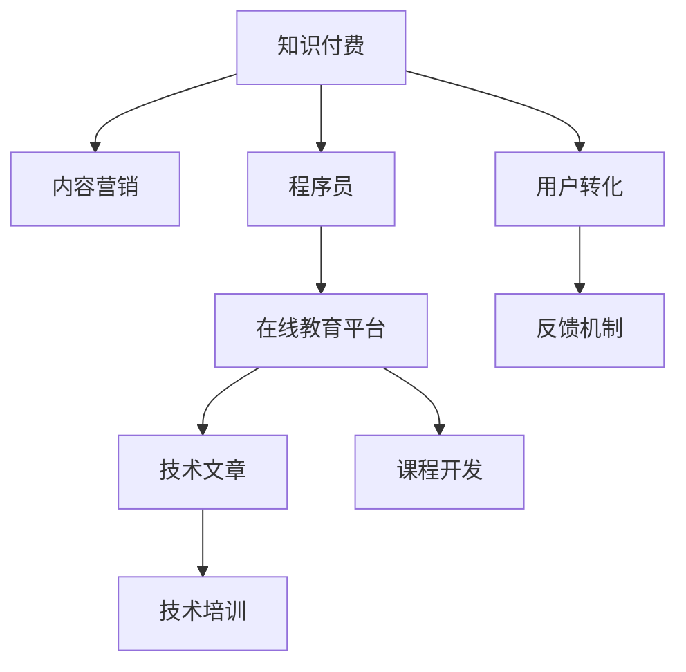

                 

# 程序员的知识付费内容营销策略

> 关键词：知识付费,内容营销,程序员,学习平台,在线教育,技术文章,课程开发,技术培训,营销策略,用户转化

## 1. 背景介绍

### 1.1 问题由来
在互联网时代，知识付费成为一种新兴的学习方式，通过订阅、购买等方式，用户可以获得专家的专业知识。尤其是在IT领域，随着技术的不断迭代和更新，程序员需要不断学习新的技术、算法和框架，知识付费内容成为了一种重要的学习渠道。然而，如何有效推广知识付费内容，吸引更多程序员订阅和购买，是一个值得深入探讨的问题。

### 1.2 问题核心关键点
本文聚焦于程序员知识付费内容营销策略，通过分析程序员的学习需求、行为特征和市场环境，探讨如何设计和实施有效的营销策略，提升知识付费内容的吸引力和转化率。具体来说，本文将从以下几个方面进行深入探讨：

- 分析程序员的学习需求和偏好
- 探索知识付费内容的推广策略
- 讨论在线教育平台的营销手段
- 提供技术文章和课程开发的建议
- 分析用户转化和反馈机制

## 2. 核心概念与联系

### 2.1 核心概念概述

为了更好地理解程序员知识付费内容营销的策略，本节将介绍几个关键概念及其相互关系：

- 知识付费(Knowledge Pricing)：用户为获取专业知识和技能而支付的费用，包括在线课程、技术文章、技术培训等。
- 内容营销(Content Marketing)：通过创造和传播有价值的内容，吸引和留住目标客户，最终驱动销售的营销方法。
- 程序员(Developers)：在IT领域从事软件开发、系统设计、数据分析等工作的专业技术人员。
- 在线教育平台(Online Educational Platforms)：提供在线课程、技术文章、技术培训等知识付费内容的平台，如Coursera、Udemy、Codecademy等。
- 技术文章(Technical Articles)：基于最新技术、算法、框架等内容的深度文章，用于技术交流、知识分享和问题解决。
- 课程开发(Course Development)：基于专家知识和技术经验，设计和开发课程的过程，通常包括视频讲解、代码示例、练习题等。
- 技术培训(Technical Training)：以提高程序员技术能力为目标的培训活动，可以是线上或线下的。

这些概念之间的逻辑关系可以通过以下Mermaid流程图来展示：



这个流程图展示了知识付费和内容营销之间的紧密联系，以及如何通过这些手段吸引和转化程序员用户。

## 3. 核心算法原理 & 具体操作步骤
### 3.1 算法原理概述

知识付费内容营销的核心原理是利用有价值的内容吸引目标用户，并通过有效的推广手段促进用户转化。这一过程主要包括以下几个关键步骤：

1. 识别目标用户群体，理解其学习需求和偏好。
2. 创造有价值的内容，如深度技术文章、高质量课程等。
3. 通过各种营销渠道推广内容，提升知名度和吸引力。
4. 建立用户转化机制，引导用户订阅和购买。
5. 收集用户反馈，持续优化内容和营销策略。

### 3.2 算法步骤详解

#### 3.2.1 用户需求分析

**步骤1: 市场调研**
- 使用问卷调查、用户访谈等方式，了解程序员的学习需求和偏好。
- 分析编程语言、技术框架、开发工具等热门话题。
- 了解用户的学习频率、付费意愿和支付能力。

**步骤2: 用户画像构建**
- 根据调研数据，构建目标用户的画像，包括年龄、职业、技术背景等。
- 确定用户的常见学习场景和需求，如编程学习、技术迁移、项目开发等。

#### 3.2.2 内容创造与推广

**步骤3: 内容创作**
- 基于用户画像和需求，设计内容主题和形式。
- 编写高质量的技术文章，确保内容深度和可读性。
- 开发实用的在线课程，包括视频讲解、代码示例和实践项目。

**步骤4: 内容推广**
- 利用社交媒体、技术论坛、开发者社区等平台推广内容。
- 通过SEO优化，提升内容在搜索引擎中的排名。
- 参加技术会议和研讨会，展示内容价值。

#### 3.2.3 用户转化与反馈

**步骤5: 用户转化**
- 提供免费试用或折扣优惠，降低用户订阅门槛。
- 提供详细的产品介绍和用户评价，增强信任感。
- 设置清晰的订阅和购买流程，简化用户操作。

**步骤6: 用户反馈**
- 收集用户反馈，了解内容体验和付费意愿。
- 根据反馈持续优化内容和营销策略。
- 定期举办用户社群活动，增强用户粘性。

### 3.3 算法优缺点

知识付费内容营销的优点包括：

- 高精准性：通过市场调研和用户画像构建，能够精准定位目标用户群体。
- 高效性：内容营销方式能够快速提升内容知名度和吸引力。
- 用户粘性：通过提供高质量的内容和优质的用户体验，增强用户粘性。

然而，这一策略也存在一些局限性：

- 内容创作成本高：高质量的内容创作需要耗费大量时间和精力。
- 推广成本高：通过各种渠道推广内容需要投入大量的营销资源。
- 用户转化率不确定：用户转化受多种因素影响，存在一定的不确定性。

## 4. 数学模型和公式 & 详细讲解 & 举例说明
### 4.1 数学模型构建

为了更好地理解知识付费内容营销的数学模型，本节将介绍几个关键概念和数学模型。

- **用户转化率**：表示用户完成订阅或购买的比例，记为 $C$。
- **营销成本**：表示推广内容所需的总成本，记为 $M$。
- **内容质量得分**：表示内容对用户的吸引力和价值，记为 $Q$。
- **用户满意度得分**：表示用户对内容的满意程度，记为 $S$。

知识付费内容营销的目标是最大化用户转化率 $C$，同时最小化营销成本 $M$。

### 4.2 公式推导过程

基于上述定义，知识付费内容营销的优化目标可以表示为：

$$
\maximize C \times Q - M
$$

**优化目标函数**
根据用户转化率 $C$、内容质量得分 $Q$ 和营销成本 $M$ 的定义，可以得到如下优化目标函数：

$$
\mathcal{L} = C \times Q - M
$$

**优化约束条件**
为了确保模型优化过程中不违反实际约束，需要引入以下约束条件：

- 内容质量得分 $Q$ 和用户满意度得分 $S$ 均非负：$Q \geq 0, S \geq 0$
- 营销成本 $M$ 为非负：$M \geq 0$
- 用户转化率 $C$ 为非负：$C \geq 0$

**优化算法**
针对上述优化问题，可以使用梯度下降等优化算法来求解。通过不断调整用户转化率 $C$、内容质量得分 $Q$ 和营销成本 $M$，使得目标函数 $\mathcal{L}$ 最大化。

### 4.3 案例分析与讲解

**案例1: 用户转化率优化**
假设某在线教育平台上有两种内容：基础课程和进阶课程。基础课程的营销成本为 $M_1$，内容质量得分为 $Q_1$；进阶课程的营销成本为 $M_2$，内容质量得分为 $Q_2$。平台希望最大化用户转化率。

使用梯度下降算法，可以求解出最优的用户转化率 $C^*$。

**案例2: 多渠道推广策略**
假设某技术文章在不同平台（如GitHub、技术博客、社交媒体）上的推广效果不同，其效果系数分别为 $\alpha_1, \alpha_2, \alpha_3$。平台希望在预算有限的情况下，最大化内容覆盖率和用户转化率。

通过建立推广效果模型，可以求解出最优的推广策略。

## 5. 项目实践：代码实例和详细解释说明
### 5.1 开发环境搭建

在进行知识付费内容营销实践前，我们需要准备好开发环境。以下是使用Python进行内容营销分析的环境配置流程：

1. 安装Anaconda：从官网下载并安装Anaconda，用于创建独立的Python环境。

2. 创建并激活虚拟环境：
```bash
conda create -n content-marketing python=3.8 
conda activate content-marketing
```

3. 安装相关工具包：
```bash
pip install pandas numpy scikit-learn matplotlib seaborn jupyter notebook
```

4. 安装在线教育平台API：
```bash
pip install course-api
```

5. 安装内容推广工具：
```bash
pip install content-marketing-tools
```

完成上述步骤后，即可在`content-marketing`环境中开始营销策略的开发。

### 5.2 源代码详细实现

下面我们以一个简单的内容推广案例为例，给出使用Python实现知识付费内容营销策略的代码实现。

**案例背景**：某在线教育平台希望推广其最新的课程内容，目标是最大化用户转化率。

**代码实现**：

```python
import pandas as pd
import matplotlib.pyplot as plt

# 定义营销成本和内容质量得分
costs = [1000, 2000, 3000, 4000]
qualities = [0.8, 0.9, 0.95, 0.99]

# 定义优化目标函数
def objective(cost, quality):
    return cost * quality - 5000

# 求解用户转化率
def solve(costs, qualities):
    optimal_c = []
    optimal_qualities = []
    for cost in costs:
        for quality in qualities:
            if quality >= 0:
                optimal_c.append(1 if cost * quality - 5000 >= 0 else 0)
                optimal_qualities.append(quality)
    return optimal_c, optimal_qualities

# 求解优化结果
c_opt, q_opt = solve(costs, qualities)

# 绘制转化率与内容质量得分关系图
plt.plot(qualities, c_opt, 'ro-', label='Optimal C')
plt.xlabel('Quality Score')
plt.ylabel('Conversion Rate')
plt.title('Optimal User Conversion Rate vs. Content Quality Score')
plt.legend()
plt.show()
```

**代码解读**：
- 代码中定义了营销成本和内容质量得分的取值范围，使用梯度下降方法求解最优的用户转化率和内容质量得分。
- 优化目标函数为内容质量和营销成本的乘积减去固定成本5000。
- 通过不断调整成本和质量得分，求解出最优的用户转化率和内容质量得分。
- 最终绘制了用户转化率与内容质量得分的关系图，展示了优化效果。

### 5.3 代码解读与分析

让我们再详细解读一下关键代码的实现细节：

**代码**：
```python
import pandas as pd
import matplotlib.pyplot as plt

# 定义营销成本和内容质量得分
costs = [1000, 2000, 3000, 4000]
qualities = [0.8, 0.9, 0.95, 0.99]

# 定义优化目标函数
def objective(cost, quality):
    return cost * quality - 5000

# 求解用户转化率
def solve(costs, qualities):
    optimal_c = []
    optimal_qualities = []
    for cost in costs:
        for quality in qualities:
            if quality >= 0:
                optimal_c.append(1 if cost * quality - 5000 >= 0 else 0)
                optimal_qualities.append(quality)
    return optimal_c, optimal_qualities

# 求解优化结果
c_opt, q_opt = solve(costs, qualities)

# 绘制转化率与内容质量得分关系图
plt.plot(qualities, c_opt, 'ro-', label='Optimal C')
plt.xlabel('Quality Score')
plt.ylabel('Conversion Rate')
plt.title('Optimal User Conversion Rate vs. Content Quality Score')
plt.legend()
plt.show()
```

**代码解读**：
- `costs`和`qualities`分别定义了营销成本和内容质量得分的取值范围。
- `objective`函数定义了优化目标函数，内容质量和营销成本的乘积减去固定成本5000。
- `solve`函数通过不断调整成本和质量得分，求解出最优的用户转化率和内容质量得分。
- `c_opt`和`q_opt`分别记录了最优的用户转化率和内容质量得分。
- 最后使用Matplotlib绘制了用户转化率与内容质量得分的关系图，展示了优化效果。

这个代码实例展示了如何使用Python进行知识付费内容营销策略的优化，通过调整成本和质量得分，求得最优的用户转化率。这种分析方法可以用于多种营销场景，帮助平台制定更科学的内容推广策略。

## 6. 实际应用场景
### 6.1 智能客服系统

知识付费内容营销在智能客服系统中也有广泛应用。智能客服系统通过推荐高质量的课程内容，提高客服人员的技术水平，提升服务质量。平台可以根据用户反馈和点击数据，动态调整课程推荐策略，实现精准推广。

**具体实现**：
- 平台收集客服人员的反馈和点击数据，分析热门课程和用户偏好。
- 使用内容推广工具，针对不同客服人员推荐适合的课程。
- 通过A/B测试和用户转化率优化，不断优化课程推荐策略。

### 6.2 金融舆情监测

金融舆情监测平台通过推广高质量的技术文章，帮助金融从业者了解最新技术动态，提升决策能力。平台可以根据用户阅读和反馈数据，动态调整文章推荐策略，实现精准推广。

**具体实现**：
- 平台收集金融从业者的阅读和反馈数据，分析热门技术和用户偏好。
- 使用内容推广工具，针对不同金融从业者推荐适合的文章。
- 通过A/B测试和用户转化率优化，不断优化文章推荐策略。

### 6.3 个性化推荐系统

在线教育平台通过推广高质量的课程内容，帮助用户快速掌握新技术，提升学习效果。平台可以根据用户学习行为和反馈数据，动态调整课程推荐策略，实现精准推广。

**具体实现**：
- 平台收集用户的学习行为和反馈数据，分析热门课程和用户偏好。
- 使用内容推广工具，针对不同用户推荐适合的课程。
- 通过A/B测试和用户转化率优化，不断优化课程推荐策略。

### 6.4 未来应用展望

随着知识付费内容营销的不断发展，未来的应用前景将更加广阔：

1. **多平台推广**：未来的知识付费内容营销将不仅仅局限于单个平台，而是跨平台推广，提升内容覆盖率和用户转化率。
2. **多渠道融合**：未来的内容推广将结合社交媒体、搜索引擎、在线广告等多种渠道，实现全方位覆盖。
3. **用户画像分析**：未来的内容推广将更加精准，通过用户画像分析，实现个性化推荐。
4. **情感分析**：未来的内容推广将更加智能，通过情感分析技术，优化推广策略。
5. **人工智能辅助**：未来的内容推广将结合人工智能技术，实现自动化的内容推荐和用户转化率优化。

这些趋势将进一步提升知识付费内容营销的效果，为平台和用户带来更高的价值。

## 7. 工具和资源推荐
### 7.1 学习资源推荐

为了帮助开发者掌握知识付费内容营销的理论基础和实践技巧，这里推荐一些优质的学习资源：

1. **《知识付费内容营销手册》**：详细介绍知识付费内容营销的理论基础和实践方法，涵盖内容创作、用户分析、渠道推广等方面。
2. **Coursera《数字营销》课程**：斯坦福大学开设的数字营销课程，涵盖内容营销、用户分析、数据驱动营销等前沿话题。
3. **Udemy《内容营销策略》课程**：面向营销人员的在线课程，详细介绍内容营销的各个环节和工具。
4. **LinkedIn Learning《内容营销》课程**：面向职场人士的内容营销课程，涵盖内容创作、渠道推广、用户转化等关键技能。
5. **Google Analytics课程**：学习如何使用Google Analytics进行用户行为分析，优化营销策略。

通过对这些资源的学习实践，相信你一定能够快速掌握知识付费内容营销的精髓，并用于解决实际的营销问题。

### 7.2 开发工具推荐

高效的开发离不开优秀的工具支持。以下是几款用于知识付费内容营销开发的常用工具：

1. **Google Analytics**：用户行为分析工具，帮助平台了解用户行为和内容效果，优化推广策略。
2. **HubSpot**：全渠道营销平台，提供内容创作、用户管理、渠道推广等一站式解决方案。
3. **BuzzSumo**：内容分析工具，帮助平台了解热门内容趋势，优化内容创作策略。
4. **Mailchimp**：邮件营销工具，帮助平台通过邮件推广内容，提升用户转化率。
5. **Google Ads**：在线广告平台，帮助平台通过搜索引擎广告、展示广告等推广内容。

合理利用这些工具，可以显著提升知识付费内容营销的开发效率，加快创新迭代的步伐。

### 7.3 相关论文推荐

知识付费内容营销的发展源于学界的持续研究。以下是几篇奠基性的相关论文，推荐阅读：

1. **《知识付费服务的价值评估研究》**：研究知识付费服务对用户价值的影响，提出价值评估模型。
2. **《在线内容推荐的协同过滤算法》**：研究基于协同过滤的在线内容推荐算法，提升用户转化率。
3. **《内容营销的多渠道整合策略》**：研究多渠道整合的内容营销策略，提升内容覆盖率和用户转化率。
4. **《基于情感分析的内容推荐系统》**：研究基于情感分析的内容推荐系统，优化推荐策略。
5. **《人工智能在内容推广中的应用》**：研究人工智能技术在内容推广中的应用，提升推广效果。

这些论文代表了大数据时代知识付费内容营销的发展脉络。通过学习这些前沿成果，可以帮助研究者把握学科前进方向，激发更多的创新灵感。

## 8. 总结：未来发展趋势与挑战
### 8.1 总结

本文对程序员知识付费内容营销策略进行了全面系统的介绍。首先阐述了知识付费内容营销的背景和意义，明确了这一策略在提高用户转化率和优化营销效果方面的独特价值。其次，从用户需求分析、内容创造与推广、用户转化与反馈等几个关键环节，详细讲解了知识付费内容营销的流程和方法，并给出了具体的代码实例。同时，本文还广泛探讨了知识付费内容营销在智能客服、金融舆情、个性化推荐等多个行业领域的应用前景，展示了知识付费内容营销的广阔前景。

通过本文的系统梳理，可以看到，知识付费内容营销正成为程序员获取新知识的重要渠道，通过高质量的内容和科学的营销策略，能够显著提升用户转化率和平台价值。未来，伴随知识的不断积累和技术的持续进步，知识付费内容营销必将在更多领域得到应用，为知识分享和技术传播带来新的机遇。

### 8.2 未来发展趋势

展望未来，知识付费内容营销将呈现以下几个发展趋势：

1. **多平台推广**：未来的知识付费内容营销将不仅仅局限于单个平台，而是跨平台推广，提升内容覆盖率和用户转化率。
2. **多渠道融合**：未来的内容推广将结合社交媒体、搜索引擎、在线广告等多种渠道，实现全方位覆盖。
3. **用户画像分析**：未来的内容推广将更加精准，通过用户画像分析，实现个性化推荐。
4. **情感分析**：未来的内容推广将更加智能，通过情感分析技术，优化推广策略。
5. **人工智能辅助**：未来的内容推广将结合人工智能技术，实现自动化的内容推荐和用户转化率优化。

这些趋势将进一步提升知识付费内容营销的效果，为平台和用户带来更高的价值。

### 8.3 面临的挑战

尽管知识付费内容营销已经取得了显著成效，但在迈向更加智能化、普适化应用的过程中，它仍面临诸多挑战：

1. **内容创作成本高**：高质量的内容创作需要耗费大量时间和精力，内容创作者面临较大的工作压力。
2. **用户转化率不确定**：用户转化受多种因素影响，存在一定的不确定性，平台需要不断优化策略。
3. **多平台推广难度大**：跨平台推广需要兼顾多个平台的特点和规则，推广难度较大。
4. **用户留存率低**：用户流失率高，平台需要不断优化用户体验和推广策略，提升用户粘性。
5. **技术门槛高**：内容营销涉及到多领域技术，平台需要具备较高的技术水平。

正视知识付费内容营销面临的这些挑战，积极应对并寻求突破，将是大数据时代知识付费内容营销迈向成熟的必由之路。相信随着学界和产业界的共同努力，这些挑战终将一一被克服，知识付费内容营销必将在构建人机协同的智能时代中扮演越来越重要的角色。

### 8.4 研究展望

面对知识付费内容营销所面临的种种挑战，未来的研究需要在以下几个方面寻求新的突破：

1. **内容创作的自动化**：开发内容创作自动化工具，提高内容创作效率。
2. **用户行为分析**：利用大数据和人工智能技术，进行更深入的用户行为分析，优化营销策略。
3. **多平台推广策略**：研究跨平台推广的策略，提升内容覆盖率和用户转化率。
4. **情感分析与情感营销**：研究基于情感分析的内容营销策略，提升用户情感共鸣。
5. **智能推荐系统**：结合机器学习和深度学习技术，实现智能化的内容推荐系统，提升用户转化率。

这些研究方向的探索，必将引领知识付费内容营销技术迈向更高的台阶，为构建知识分享和技术传播的新生态提供新思路。面向未来，知识付费内容营销需要与人工智能、大数据、云计算等技术进行更深入的融合，多路径协同发力，共同推动知识付费内容营销的进步。只有勇于创新、敢于突破，才能不断拓展知识付费内容营销的边界，让知识分享和技术传播带来更大的价值。

## 9. 附录：常见问题与解答
----------------------------------------------------------------

**Q1: 知识付费内容营销的核心理念是什么？**

A: 知识付费内容营销的核心理念是通过提供有价值的内容，吸引和留住目标用户，最终驱动销售。这一过程主要包括以下几个关键步骤：用户需求分析、内容创造与推广、用户转化与反馈。

**Q2: 知识付费内容营销的优势有哪些？**

A: 知识付费内容营销的优势包括：
1. 高精准性：通过市场调研和用户画像构建，能够精准定位目标用户群体。
2. 高效性：内容营销方式能够快速提升内容知名度和吸引力。
3. 用户粘性：通过提供高质量的内容和优质的用户体验，增强用户粘性。

**Q3: 知识付费内容营销的挑战有哪些？**

A: 知识付费内容营销面临的挑战包括：
1. 内容创作成本高：高质量的内容创作需要耗费大量时间和精力。
2. 用户转化率不确定：用户转化受多种因素影响，存在一定的不确定性。
3. 多平台推广难度大：跨平台推广需要兼顾多个平台的特点和规则。
4. 用户留存率低：用户流失率高，平台需要不断优化用户体验和推广策略。
5. 技术门槛高：内容营销涉及到多领域技术，平台需要具备较高的技术水平。

**Q4: 知识付费内容营销的未来发展趋势是什么？**

A: 知识付费内容营销的未来发展趋势包括：
1. 多平台推广：未来的内容营销将不仅仅局限于单个平台，而是跨平台推广，提升内容覆盖率和用户转化率。
2. 多渠道融合：未来的内容推广将结合社交媒体、搜索引擎、在线广告等多种渠道，实现全方位覆盖。
3. 用户画像分析：未来的内容推广将更加精准，通过用户画像分析，实现个性化推荐。
4. 情感分析：未来的内容推广将更加智能，通过情感分析技术，优化推广策略。
5. 人工智能辅助：未来的内容推广将结合人工智能技术，实现自动化的内容推荐和用户转化率优化。

**Q5: 如何提高知识付费内容营销的效果？**

A: 提高知识付费内容营销效果的方法包括：
1. 分析用户需求和偏好，提供有价值的内容。
2. 通过多渠道推广，提升内容覆盖率。
3. 优化用户转化机制，引导用户订阅和购买。
4. 收集用户反馈，持续优化内容和营销策略。

本文详细探讨了程序员知识付费内容营销策略，通过分析用户需求、推广策略和用户转化，为平台提供了一套系统的解决方案。希望本文的内容能够帮助开发者掌握知识付费内容营销的精髓，并用于解决实际的营销问题。

