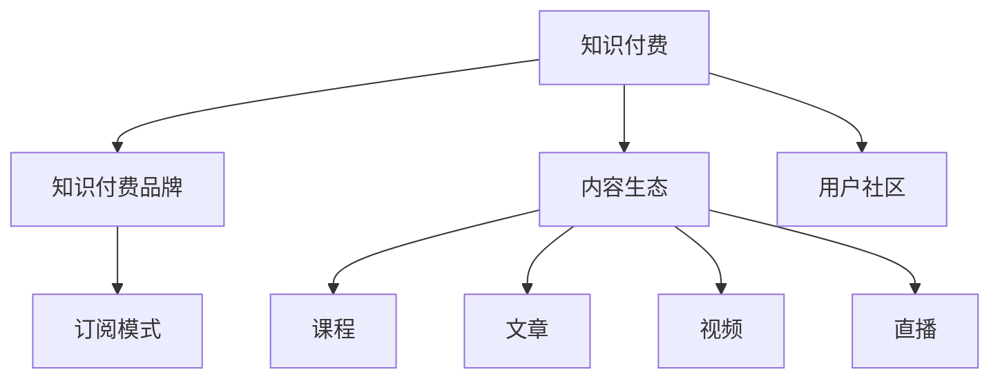

                 

# 程序员的知识付费品牌建设与维护

> 关键词：知识付费, 品牌建设, 程序员社区, 内容营销, 用户教育, 订阅模式

## 1. 背景介绍

### 1.1 问题由来
随着互联网和信息技术的发展，知识付费逐渐成为了新兴的教育和商业模式。在程序员社区，知识付费已经不是新鲜事物。许多程序员通过订阅平台，获取最新技术资讯、编程经验分享、线上线下培训等知识服务。这种模式，不仅帮助程序员提升技能，也为内容创作者提供了变现机会。然而，如何建立一个有影响力的知识付费品牌，吸引并留住优质内容消费者，是一个值得深思的问题。

### 1.2 问题核心关键点
当前程序员知识付费领域，品牌建设主要面临以下几个核心挑战：

- 如何打造专业、权威的品牌形象，赢得用户的信任和认可？
- 如何构建丰富的内容生态，满足用户多样化、个性化的需求？
- 如何运营用户社区，提升用户黏性，实现内容的持续传播？
- 如何实现有效的付费转化，确保平台的可持续经营？

本文将聚焦于这些核心问题，介绍如何从品牌建设、内容运营、用户管理、收入模式等多个维度，全面提升程序员知识付费平台的影响力和吸引力。

## 2. 核心概念与联系

### 2.1 核心概念概述

为更好地理解知识付费平台品牌建设与维护的策略和方法，本节将介绍几个密切相关的核心概念：

- 知识付费：通过付费方式获取知识和技能服务的模式。涵盖线上线下的培训、课程、咨询等多种形式，旨在帮助用户提升专业能力和职业发展。

- 知识付费品牌：指在知识付费领域形成独特、专业的品牌形象，通过高质量内容和优质的用户体验，赢得用户信赖和忠诚的知名平台。

- 内容生态：指由多样化的知识产品和服务组成的内容网络，包括课程、文章、视频、直播等多种形式，满足不同用户的知识需求。

- 用户社区：指围绕知识付费平台形成的用户群体，通过交流互动，增强用户黏性和社区认同感。

- 订阅模式：用户定期支付固定费用，获取平台提供的所有内容和服务，无需额外付费的模式。

这些核心概念之间的逻辑关系可以通过以下Mermaid流程图来展示：



这个流程图展示了知识付费平台的核心组成部分及其相互关系：

1. 知识付费是平台的基础，通过提供有价值的内容和技能服务，满足用户需求。
2. 知识付费品牌则通过构建专业、权威的声誉，吸引用户，提升平台影响力。
3. 内容生态为平台提供多样化的内容形式，丰富用户的选择和体验。
4. 用户社区则是用户交流互动的场所，增强社区认同感和黏性。
5. 订阅模式作为平台的收入来源，确保平台的持续运营和发展。

## 3. 核心算法原理 & 具体操作步骤
### 3.1 算法原理概述

知识付费平台的品牌建设与维护，本质上是一个系统的、多维度的运营过程。其核心思想是通过精心构建和持续优化，打造一个专业、权威、有吸引力的品牌形象，同时确保内容丰富、质量高，用户社区活跃，订阅模式可持续。

具体来说，知识付费品牌建设与维护的目标是：

- 提高平台在目标用户中的知名度和美誉度，建立品牌信任。
- 通过高质量的内容生态，满足用户多样化、个性化的知识需求。
- 强化用户社区建设，提升用户参与度和忠诚度。
- 实现有效的付费转化，确保平台的可持续经营。

### 3.2 算法步骤详解

构建一个有影响力的知识付费品牌，主要包括以下几个关键步骤：

**Step 1: 市场定位和品牌塑造**
- 进行市场调研，分析目标用户群体的特点、需求和行为。
- 确定品牌的核心价值和定位，设计品牌的标志、口号、标语等。
- 制定品牌传播策略，包括线上线下活动、媒体合作、内容推广等。

**Step 2: 内容生态建设**
- 筛选并邀请行业专家、资深开发者、教育机构等，作为内容创作者。
- 设计并推出多样化、高质量的知识产品和服务，如课程、文章、视频、直播等。
- 建立内容审核机制，确保内容质量符合平台标准。

**Step 3: 用户社区运营**
- 建立社区平台，提供交流讨论、分享展示的功能。
- 设计互动活动，如技术挑战、编程比赛、开源项目合作等，增强用户参与度。
- 定期收集用户反馈，调整和优化内容和服务。

**Step 4: 用户教育和转化**
- 通过数据分析，识别潜在用户，进行精准营销。
- 提供免费试用、体验课等形式，降低用户付费门槛。
- 设计合理的订阅套餐，满足不同用户需求，同时实现收入最大化。

**Step 5: 收入模式优化**
- 建立收费模型，明确不同类型内容和服务的定价策略。
- 提供多样化的付费渠道，如单次购买、月度/年度订阅、课程包等。
- 引入推荐和分发机制，提高内容的曝光度和转化率。

### 3.3 算法优缺点

知识付费平台的品牌建设与维护方法，具有以下优点：

- 通过专业、权威的品牌形象，可以迅速赢得用户信任，提升平台的市场竞争力。
- 丰富多样的内容生态，可以满足用户多样化、个性化的需求，增加用户黏性。
- 活跃的用户社区，可以增强用户互动和交流，提升平台的活跃度和影响力。
- 可持续的订阅模式，可以确保平台的长期稳定运营，实现商业目标。

同时，该方法也存在一定的局限性：

- 内容生态建设需要大量时间和资源，初期投入较大。
- 用户社区运营和管理需要持续的运营维护，难度较大。
- 用户教育和付费转化过程中，面临着高投入、低回报的风险。
- 品牌塑造和市场推广需要综合考虑多方面因素，难以短期内见效。

尽管存在这些局限性，但就目前而言，这种多维度运营的策略仍然是知识付费平台品牌建设的主流方法。未来相关研究的重点在于如何进一步提升运营效率，优化内容生态，降低用户教育和转化的成本，同时兼顾品牌形象和商业利益。

### 3.4 算法应用领域

知识付费平台的品牌建设与维护方法，在多个行业领域都有广泛应用，例如：

- 编程与软件开发：提供编程语言、框架、工具等技能培训，帮助开发者提升技术能力。
- 数据科学与人工智能：提供机器学习、深度学习、大数据等知识服务，帮助专业人士提升技能。
- 设计技术与创意产业：提供UI/UX设计、产品开发、创意写作等技能培训，帮助从业者提升创造力。
- 项目管理与运维：提供敏捷开发、DevOps、云计算等技能培训，帮助企业提升运维管理能力。
- 商业与市场分析：提供市场营销、商业策略、数据分析等知识服务，帮助企业提升竞争力。

除了上述这些典型领域外，知识付费平台还在更多场景中得到应用，如教育培训、健康管理、个人成长、娱乐休闲等，为各行各业的知识普及和技能提升提供了新的解决方案。

## 4. 数学模型和公式 & 详细讲解 & 举例说明
### 4.1 数学模型构建

构建知识付费品牌，主要通过以下几个关键指标进行量化评估和优化：

- **品牌知名度（Brand Awareness）**：指用户对品牌的认知和印象。可以通过调研问卷、网站访问量等数据进行量化。
- **用户参与度（User Engagement）**：指用户在平台上的活跃度和互动情况。包括登录次数、内容访问量、社区讨论量等。
- **内容质量（Content Quality）**：指内容的实用性、权威性和原创性。可以通过用户评分、专家认证等方式进行量化。
- **付费转化率（Conversion Rate）**：指用户从免费试用转变为付费用户的比例。可以通过用户留存率、订阅续费率等数据进行量化。

通过以上指标，可以构建数学模型，对平台运营效果进行分析和优化：

$$
\text{Brand Awareness} = \alpha \times \text{Web Traffic} + \beta \times \text{Survey Score}
$$

$$
\text{User Engagement} = \gamma \times \text{Daily Login Rate} + \delta \times \text{Content Access}
$$

$$
\text{Content Quality} = \epsilon \times \text{Expert Certification} + \zeta \times \text{User Rating}
$$

$$
\text{Conversion Rate} = \theta \times \text{Free to Paid Rate} + \phi \times \text{Renewal Rate}
$$

其中 $\alpha, \beta, \gamma, \delta, \epsilon, \zeta, \theta, \phi$ 为模型参数，需根据实际数据进行拟合和优化。

### 4.2 公式推导过程

以 **品牌知名度（Brand Awareness）** 的计算为例，进行公式推导：

设 $T$ 为平台的总访问量，$S$ 为调研问卷中提及品牌的用户数，$\eta$ 为品牌在用户心目中的权重，$\lambda$ 为调研问卷的权重。则品牌知名度的计算公式为：

$$
\text{Brand Awareness} = \eta \times \frac{S}{T} + \lambda \times \text{Survey Score}
$$

其中，$\eta$ 和 $\lambda$ 可以根据实际情况进行调节。

通过上述公式，可以量化品牌的知名度和用户对品牌的认知程度，从而指导品牌建设的方向和策略。

### 4.3 案例分析与讲解

假设某知识付费平台，通过调研问卷和网站分析发现：

- 调研问卷中提及品牌的用户数为 5000 人，总访问量为 10000 人。
- 调研问卷的权重为 0.5，用户对品牌的认知程度为 0.3。

代入上述公式，计算品牌知名度：

$$
\text{Brand Awareness} = 0.3 \times \frac{5000}{10000} + 0.5 \times 0.3 = 0.27
$$

这表明该平台在用户心目中的品牌知名度为 27%，还有提升空间。通过进一步优化品牌传播策略，提升用户在平台上的活跃度和互动情况，可以逐步提升品牌知名度和用户认知度。

## 5. 项目实践：代码实例和详细解释说明
### 5.1 开发环境搭建

在进行知识付费平台品牌建设与维护的实践前，我们需要准备好开发环境。以下是使用Python进行Flask开发的环境配置流程：

1. 安装Anaconda：从官网下载并安装Anaconda，用于创建独立的Python环境。

2. 创建并激活虚拟环境：
```bash
conda create -n flask-env python=3.8 
conda activate flask-env
```

3. 安装Flask：从官网获取Flask库的安装命令。例如：
```bash
pip install flask
```

4. 安装相关依赖：
```bash
pip install flask-login flask-wtf flask-sqlalchemy flask-migrate
```

5. 安装数据库：
```bash
pip install mysql-connector-python
```

6. 安装邮箱发送模块：
```bash
pip install Flask-Mail
```

完成上述步骤后，即可在`flask-env`环境中开始实践。

### 5.2 源代码详细实现

下面以建立用户注册和登录系统为例，给出使用Flask开发的代码实现。

首先，定义用户模型：

```python
from flask_login import UserMixin
from flask_sqlalchemy import SQLAlchemy

db = SQLAlchemy()

class User(UserMixin, db.Model):
    id = db.Column(db.Integer, primary_key=True)
    username = db.Column(db.String(50), unique=True, nullable=False)
    email = db.Column(db.String(120), unique=True, nullable=False)
    password = db.Column(db.String(255), nullable=False)
```

然后，定义用户注册和登录视图：

```python
from flask import render_template, request, redirect, url_for, flash
from flask_login import login_user, logout_user, login_required

@app.route('/register', methods=['GET', 'POST'])
def register():
    if request.method == 'POST':
        username = request.form.get('username')
        email = request.form.get('email')
        password = request.form.get('password')
        user = User(username=username, email=email, password=hash_password(password))
        db.session.add(user)
        db.session.commit()
        flash('Account created successfully!', 'success')
        return redirect(url_for('login'))
    return render_template('register.html')
```

最后，启动应用并进行测试：

```python
if __name__ == '__main__':
    app.run(debug=True)
```

以上就是使用Flask对用户注册和登录系统进行开发的完整代码实现。可以看到，Flask框架的灵活性和可扩展性，使得开发者可以轻松实现复杂的用户管理功能。

### 5.3 代码解读与分析

让我们再详细解读一下关键代码的实现细节：

**User模型**：
- 定义了用户的基本信息，包括用户名、邮箱、密码等字段，并通过SQLAlchemy进行数据库管理。

**register视图**：
- 对用户注册请求进行解析，从表单中获取用户名、邮箱和密码，创建User模型实例。
- 使用`hash_password`方法对密码进行加密，避免明文存储安全风险。
- 将新用户加入数据库，并展示注册成功提示信息，重定向至登录页面。

**login视图**：
- 对用户登录请求进行解析，验证用户名和密码，并登录用户。
- 使用`login_user`方法将用户登录状态保存，跳转到主页。

**logout视图**：
- 对用户注销请求进行解析，使用`logout_user`方法清除用户登录状态，跳转到主页。

通过上述代码，可以简单地实现用户注册、登录、注销等基本功能，为后续的课程推荐、内容订阅等高级功能打下基础。

## 6. 实际应用场景
### 6.1 编程学习平台

知识付费平台的核心应用场景之一是编程学习平台。在编程学习中，用户通过订阅各类编程课程，获取最新技术资讯和编程实践经验。平台通过邀请资深开发者、教育机构等作为内容创作者，提供高质量的课程和培训。通过持续优化内容生态和用户社区，平台可以不断提升用户体验和黏性，实现商业目标。

例如，某编程学习平台通过邀请GitHub顶级开发者，提供高质量的编程课程，并建立活跃的编程社区，吸引大量技术爱好者。平台还提供免费试用、每日推荐课程、课程包等增值服务，使用户在免费试用阶段就能体验平台优势，增加付费转化率。

### 6.2 数据科学培训

在数据科学领域，知识付费平台通过提供机器学习、深度学习、大数据等课程，帮助专业人士提升技能。平台邀请行业专家和学者，提供高质量的培训课程，并通过建立社区、组织技术交流活动，增强用户参与度和黏性。

例如，某数据科学平台通过与知名大学合作，提供高质量的数据科学课程，并通过建立在线社区，组织数据科学竞赛，吸引大量从业者。平台还提供数据科学工具包、研究论文等资源，满足用户多样化需求。

### 6.3 商业管理培训

在商业管理领域，知识付费平台通过提供市场营销、商业策略、数据分析等课程，帮助企业提升竞争力。平台邀请资深商业专家和咨询机构，提供高质量的培训课程，并通过建立商业管理社区，组织商业交流活动，增强用户参与度和黏性。

例如，某商业管理平台通过邀请知名咨询公司和行业专家，提供高质量的商业管理课程，并通过建立商业管理社区，组织商业交流活动，吸引大量企业管理者。平台还提供商业管理工具、案例分析等资源，满足用户多样化需求。

### 6.4 未来应用展望

随着知识付费平台的发展，未来的应用场景将更加多样和广泛。以下是几个可能的未来应用方向：

1. **教育培训**：知识付费平台在教育领域的应用将进一步扩展，涵盖K12教育、职业培训、专业认证等，成为教育和职业发展的有力助手。

2. **健康管理**：知识付费平台在健康领域的应用将包括健身、饮食、心理健康等，通过提供专业健康知识，帮助用户提升健康水平和生活质量。

3. **个人成长**：知识付费平台在个人成长领域的应用将包括时间管理、财务管理、心理调节等，通过提供实用技能，帮助用户提升个人综合素质和幸福感。

4. **娱乐休闲**：知识付费平台在娱乐领域的应用将包括电影、音乐、艺术等，通过提供专业知识和深度解读，提升用户文化素养和艺术修养。

## 7. 工具和资源推荐
### 7.1 学习资源推荐

为了帮助开发者系统掌握知识付费平台品牌建设与维护的理论基础和实践技巧，这里推荐一些优质的学习资源：

1. **《知识付费平台设计与运营》**：由知名产品经理撰写，系统介绍了知识付费平台的设计、运营和用户增长策略。

2. **《内容运营》**：介绍内容运营的基本原理和策略，涵盖内容创作、社区管理、流量运营等。

3. **《用户心理学》**：介绍用户行为和心理特征，帮助开发者深入了解用户需求和行为模式。

4. **《数据科学实战》**：介绍数据分析和机器学习实战案例，帮助开发者提升数据分析能力。

5. **《Web开发与设计》**：介绍前端开发和UI/UX设计的基础知识，帮助开发者提升技术能力和设计能力。

6. **《项目管理与敏捷》**：介绍项目管理与敏捷开发的基本原理和实践，帮助开发者提升项目管理和团队协作能力。

7. **《知识付费营销》**：介绍知识付费平台的营销策略和用户转化方法，帮助开发者提升平台影响力和用户增长速度。

通过对这些资源的学习实践，相信你一定能够全面掌握知识付费平台品牌建设与维护的精髓，并用于解决实际的NLP问题。

### 7.2 开发工具推荐

高效的开发离不开优秀的工具支持。以下是几款用于知识付费平台品牌建设与维护开发的常用工具：

1. **Flask**：基于Python的轻量级Web框架，简单易用，适合快速开发Web应用。

2. **SQLAlchemy**：Python ORM框架，支持多数据库，提供便捷的数据库操作功能。

3. **Flask-Login**：用于管理用户认证和登录状态的扩展，简单易用。

4. **Flask-WTF**：用于处理表单验证和数据绑定，提供丰富的表单字段和验证规则。

5. **Flask-Mail**：用于发送邮件的扩展，支持多种邮件服务提供商。

6. **MySQL**：作为关系型数据库，适合存储和管理用户信息、课程信息等数据。

7. **GitHub**：全球最大的开源社区，提供代码托管、协作、版本控制等功能，适合知识付费平台的内容管理。

合理利用这些工具，可以显著提升知识付费平台的开发效率，加速创新迭代的步伐。

### 7.3 相关论文推荐

知识付费平台的品牌建设与维护技术，源于学界的持续研究。以下是几篇奠基性的相关论文，推荐阅读：

1. **《知识付费平台的用户行为研究》**：研究用户在知识付费平台上的行为模式和需求，提出针对性的运营策略。

2. **《知识付费平台的内容推荐算法》**：研究内容推荐算法的设计和实现，提升用户的内容获取效率和满意度。

3. **《知识付费平台的营销策略》**：研究知识付费平台的营销策略和用户转化方法，提出提升平台影响力和用户增长速度的策略。

4. **《知识付费平台的社区建设》**：研究知识付费平台社区的管理和运营，提升用户参与度和社区活力。

5. **《知识付费平台的用户教育》**：研究用户教育的策略和方法，提升用户对平台的认知和信任。

这些论文代表了大语言模型微调技术的发展脉络。通过学习这些前沿成果，可以帮助研究者把握学科前进方向，激发更多的创新灵感。

## 8. 总结：未来发展趋势与挑战
### 8.1 总结

本文对知识付费平台品牌建设与维护方法进行了全面系统的介绍。首先阐述了知识付费平台的背景和意义，明确了品牌建设在平台运营中的核心地位。其次，从品牌塑造、内容生态、用户社区、付费转化等多个维度，详细讲解了品牌建设的方法和步骤，给出了完整的代码实例和详细解释。最后，本文还探讨了知识付费平台在多个领域的应用前景，并提出未来发展的方向和挑战。

通过本文的系统梳理，可以看到，知识付费平台的品牌建设与维护，是平台运营的核心环节，通过精心设计和持续优化，可以打造一个专业、权威、有吸引力的品牌形象。这不仅有助于提升平台的市场竞争力，还能增强用户黏性和平台影响力，实现商业目标。

### 8.2 未来发展趋势

展望未来，知识付费平台的品牌建设与维护技术将呈现以下几个发展趋势：

1. **个性化推荐**：通过数据分析和机器学习，实现个性化推荐，提升用户体验和满意度。

2. **AI驱动的内容生成**：利用AI技术，生成高质量的内容，提升内容创作效率和质量。

3. **多平台整合**：将知识付费平台与其他社交媒体、教育平台等整合，提升平台的综合价值和服务能力。

4. **用户教育和互动**：通过课程、直播、社区等形式，增强用户教育和互动，提升用户黏性和社区活力。

5. **AI辅助运营**：引入AI技术，优化运营流程，提高平台运营效率和用户管理能力。

6. **全球化运营**：面向全球市场，建立本地化运营策略，提升平台国际影响力。

这些趋势将推动知识付费平台在技术、业务、市场等多个方面进行创新和升级，为知识付费领域带来新的发展机遇。

### 8.3 面临的挑战

尽管知识付费平台的品牌建设与维护技术已经取得了一定的进展，但在迈向更加智能化、普适化应用的过程中，仍面临诸多挑战：

1. **内容质量**：高质量内容的制作和维护需要大量时间和资源，如何提高内容生产效率和质量，仍是一个难题。

2. **用户教育**：通过内容教育和互动，增强用户对平台的认知和信任，需要持续的运营和推广。

3. **用户转化**：通过各种策略和手段，将潜在用户转化为付费用户，仍面临高投入、低回报的风险。

4. **品牌形象**：如何打造专业、权威的品牌形象，赢得用户的信任和认可，是一个长期且复杂的过程。

5. **市场竞争**：面对激烈的市场竞争，如何保持品牌的独特性和竞争力，是平台运营中的重要挑战。

6. **法规和伦理**：面对法规和伦理问题，如何确保平台的合规性和用户隐私安全，是平台运营中的重要挑战。

7. **技术更新**：如何跟上技术发展的步伐，持续提升平台的技术水平和用户体验，是平台运营中的重要挑战。

### 8.4 研究展望

面对知识付费平台品牌建设与维护所面临的诸多挑战，未来的研究需要在以下几个方面寻求新的突破：

1. **内容生态优化**：通过优化内容生产机制，引入更多优质的内容创作者和内容形式，提升平台内容的丰富度和多样性。

2. **AI辅助运营**：利用AI技术，优化运营流程，提高平台运营效率和用户管理能力。

3. **多平台整合**：将知识付费平台与其他社交媒体、教育平台等整合，提升平台的综合价值和服务能力。

4. **个性化推荐**：通过数据分析和机器学习，实现个性化推荐，提升用户体验和满意度。

5. **用户教育与互动**：通过课程、直播、社区等形式，增强用户教育和互动，提升用户黏性和社区活力。

6. **全球化运营**：面向全球市场，建立本地化运营策略，提升平台国际影响力。

这些研究方向将引领知识付费平台在技术、业务、市场等多个方面进行创新和升级，推动知识付费领域的发展和普及。

## 9. 附录：常见问题与解答

**Q1：知识付费平台的核心竞争力是什么？**

A: 知识付费平台的核心竞争力主要体现在以下几方面：

- 高质量、专业化的内容。平台通过邀请行业专家和学者，提供高质量的培训课程，满足用户多样化需求。
- 优质的用户社区和互动。平台通过建立活跃的社区，增强用户参与度和黏性。
- 高效的付费转化策略。平台通过免费试用、每日推荐课程、课程包等增值服务，使用户在免费试用阶段就能体验平台优势，增加付费转化率。
- 专业的技术和服务。平台通过优化技术架构和用户体验，提供稳定的服务保障。

**Q2：如何优化知识付费平台的课程推荐系统？**

A: 优化知识付费平台的课程推荐系统，主要通过以下策略：

- 用户行为数据分析：通过分析用户的行为数据，如浏览历史、点击率、课程评分等，提取用户兴趣点和需求。
- 内容质量评估：通过专家评审、用户评分等方式，评估课程的质量和实用性。
- 多维度推荐算法：引入协同过滤、内容推荐、混合推荐等多种推荐算法，提升推荐的准确性和多样性。
- 实时动态调整：根据用户反馈和行为变化，实时调整推荐结果，提升用户体验和满意度。

**Q3：知识付费平台的盈利模式有哪些？**

A: 知识付费平台的盈利模式主要包括以下几种：

- 订阅费：用户支付固定的月度或年度费用，获取平台提供的所有内容和服务。
- 单次购买：用户支付单次费用，获取特定课程或内容。
- 增值服务：提供额外的增值服务，如直播课、专属导师、社群服务等，增加盈利渠道。
- 广告收入：平台通过广告展示和点击，获取广告收入。

通过多样化的盈利模式，知识付费平台可以实现长期的稳定经营，增强平台的可持续性。

**Q4：知识付费平台如何进行用户行为分析？**

A: 用户行为分析是知识付费平台的重要手段，主要通过以下方法进行：

- 数据收集：通过日志、用户行为记录等方式，收集用户的浏览、点击、购买等行为数据。
- 数据分析：利用数据挖掘、机器学习等技术，分析用户行为数据，提取用户兴趣点和需求。
- 用户画像：根据用户行为数据，构建用户画像，进行用户分群和细分。
- 行为预测：通过预测模型，预测用户行为变化，指导平台运营和内容推荐。

通过对用户行为数据的深入分析，平台可以更好地理解用户需求和行为模式，提升用户体验和满意度。

**Q5：知识付费平台的社区运营策略有哪些？**

A: 知识付费平台的社区运营策略主要包括以下几点：

- 建立社区平台：提供交流讨论、分享展示的功能，增强用户互动和交流。
- 设计互动活动：组织技术挑战、编程比赛、开源项目合作等活动，提升用户参与度和黏性。
- 定期内容更新：定期发布高质量的内容和活动，保持社区活跃度和吸引力。
- 用户反馈收集：通过用户调查、反馈机制等方式，收集用户意见和建议，持续优化社区运营。

通过以上策略，平台可以建立活跃的社区，增强用户参与度和黏性，提升平台影响力和用户忠诚度。

---

作者：禅与计算机程序设计艺术 / Zen and the Art of Computer Programming

