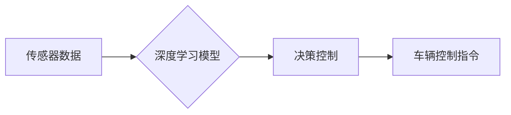

> 自动驾驶, 端到端学习, 社会接受度, 伦理问题, 安全性, 监管政策, 公共认知

## 1. 背景介绍

自动驾驶技术作为未来交通运输的重要发展方向，近年来取得了显著进展。从早期感知、决策、控制的模块化设计，到如今的端到端学习方法，自动驾驶系统不断朝着更智能、更安全的方向发展。然而，尽管技术水平不断提升，自动驾驶的社会接受度仍然面临诸多挑战。

公众对自动驾驶技术的认知和信任度仍然不足，对安全性和伦理问题的担忧也日益凸显。政府监管政策的制定和完善，以及公众对自动驾驶技术的理解和接受，都是影响自动驾驶技术普及的关键因素。

## 2. 核心概念与联系

端到端自动驾驶是指利用深度学习等机器学习算法，将感知、决策、控制等多个环节整合在一起，实现从传感器数据到车辆控制指令的完整流程学习。

**Mermaid 流程图:**



端到端学习方法相比于传统模块化设计，具有以下优势：

* **学习能力更强:** 可以直接从原始数据中学习复杂的驾驶策略，无需人工设计复杂的规则和模型。
* **系统性能更优:** 可以更好地整合不同模块之间的信息，提高系统的整体性能。
* **开发效率更高:** 可以减少人工设计和调试模块的时间，提高开发效率。

然而，端到端学习方法也存在一些挑战：

* **数据需求量大:** 需要大量的真实驾驶数据进行训练，数据标注成本高。
* **模型解释性差:** 深度学习模型的决策过程难以解释，难以让人理解和信任。
* **安全性和可靠性:** 模型在面对复杂和未知场景时，可能出现错误或意外情况。

## 3. 核心算法原理 & 具体操作步骤

### 3.1  算法原理概述

端到端自动驾驶的核心算法是深度神经网络，其中常用的网络结构包括卷积神经网络（CNN）、循环神经网络（RNN）和强化学习算法。

* **CNN:** 用于处理图像数据，例如摄像头采集的图像，可以提取图像中的特征，例如道路、车辆、行人等。
* **RNN:** 用于处理序列数据，例如车辆速度、方向等，可以学习时间序列中的模式和趋势。
* **强化学习:** 用于训练车辆的决策策略，通过奖励和惩罚机制，让车辆学习最优的驾驶行为。

### 3.2  算法步骤详解

端到端自动驾驶算法的训练过程可以概括为以下步骤：

1. **数据采集:** 收集大量的真实驾驶数据，包括摄像头图像、雷达数据、激光雷达数据等。
2. **数据预处理:** 对采集到的数据进行清洗、格式化和标注，例如将图像标注为道路、车辆、行人等。
3. **模型训练:** 使用深度学习算法训练模型，例如CNN、RNN和强化学习算法，将预处理后的数据作为训练样本。
4. **模型评估:** 使用测试数据评估模型的性能，例如准确率、召回率、平均位移误差等。
5. **模型调优:** 根据评估结果，调整模型参数和训练策略，提高模型性能。
6. **模型部署:** 将训练好的模型部署到自动驾驶系统中，实现自动驾驶功能。

### 3.3  算法优缺点

**优点:**

* 学习能力强，可以学习复杂的驾驶策略。
* 系统性能优，可以更好地整合不同模块的信息。
* 开发效率高，可以减少人工设计和调试模块的时间。

**缺点:**

* 数据需求量大，需要大量的真实驾驶数据进行训练。
* 模型解释性差，难以让人理解和信任。
* 安全性和可靠性，模型在面对复杂和未知场景时，可能出现错误或意外情况。

### 3.4  算法应用领域

端到端学习方法在自动驾驶领域有着广泛的应用，例如：

* **路径规划:** 规划车辆行驶的最佳路径。
* **车道保持:** 保持车辆在车道内行驶。
* **避障:** 避开障碍物，例如车辆、行人、树木等。
* **交通信号灯识别:** 识别交通信号灯的颜色和状态。
* **自动泊车:** 自动完成车辆的泊车操作。

## 4. 数学模型和公式 & 详细讲解 & 举例说明

### 4.1  数学模型构建

端到端自动驾驶的数学模型通常基于深度神经网络，其结构可以根据具体任务进行设计。例如，路径规划任务可以使用卷积神经网络（CNN）提取道路特征，然后使用循环神经网络（RNN）预测车辆未来的行驶轨迹。

### 4.2  公式推导过程

深度神经网络的训练过程基于梯度下降算法，其核心公式为：

$$
\theta = \theta - \alpha \frac{\partial L}{\partial \theta}
$$

其中：

* $\theta$ 是模型参数。
* $\alpha$ 是学习率。
* $L$ 是损失函数，用于衡量模型预测结果与真实值的差异。
* $\frac{\partial L}{\partial \theta}$ 是损失函数对模型参数的梯度。

### 4.3  案例分析与讲解

例如，在车道保持任务中，可以使用CNN提取道路边缘特征，然后使用RNN预测车辆未来的行驶轨迹。损失函数可以定义为车辆与车道边缘的距离误差，梯度下降算法可以用来更新模型参数，使车辆能够更好地保持在车道内行驶。

## 5. 项目实践：代码实例和详细解释说明

### 5.1  开发环境搭建

自动驾驶项目开发环境通常需要包含以下软件：

* **操作系统:** Linux 或 Windows
* **编程语言:** Python
* **深度学习框架:** TensorFlow 或 PyTorch
* **仿真平台:** CARLA 或 Gazebo
* **硬件平台:** GPU 和高性能CPU

### 5.2  源代码详细实现

由于篇幅限制，这里只提供一个简单的端到端自动驾驶代码示例，用于演示模型训练的基本流程：

```python
import tensorflow as tf

# 定义模型结构
model = tf.keras.models.Sequential([
    tf.keras.layers.Conv2D(32, (3, 3), activation='relu', input_shape=(64, 64, 3)),
    tf.keras.layers.MaxPooling2D((2, 2)),
    tf.keras.layers.Conv2D(64, (3, 3), activation='relu'),
    tf.keras.layers.MaxPooling2D((2, 2)),
    tf.keras.layers.Flatten(),
    tf.keras.layers.Dense(10, activation='softmax')
])

# 定义损失函数和优化器
model.compile(loss='categorical_crossentropy', optimizer='adam', metrics=['accuracy'])

# 训练模型
model.fit(x_train, y_train, epochs=10)

# 评估模型
loss, accuracy = model.evaluate(x_test, y_test)
print('Loss:', loss)
print('Accuracy:', accuracy)
```

### 5.3  代码解读与分析

这段代码定义了一个简单的卷积神经网络模型，用于分类任务。模型包含两个卷积层、两个最大池化层、一个全连接层和一个softmax输出层。

损失函数为交叉熵损失，优化器为Adam优化器。模型使用训练数据进行训练，训练完成后使用测试数据进行评估。

### 5.4  运行结果展示

训练完成后，可以查看模型的损失值和准确率，评估模型的性能。

## 6. 实际应用场景

端到端自动驾驶技术在多个实际应用场景中得到应用，例如：

* **自动驾驶汽车:** 实现车辆的自动驾驶功能，例如自动行驶、自动泊车、自动变道等。
* **无人配送:** 实现无人驾驶车辆的配送服务，例如快递配送、食品配送等。
* **智能交通:** 优化交通流量，提高道路通行效率。
* **物流运输:** 实现无人驾驶卡车的物流运输，提高运输效率和安全性。

### 6.4  未来应用展望

未来，端到端自动驾驶技术将应用于更多领域，例如：

* **公共交通:** 实现无人驾驶公交车、地铁等公共交通工具。
* **农业机械:** 实现无人驾驶拖拉机、收割机等农业机械。
* **医疗服务:** 实现无人驾驶救护车、医疗器械等医疗服务。

## 7. 工具和资源推荐

### 7.1  学习资源推荐

* **书籍:**
    * Deep Learning by Ian Goodfellow, Yoshua Bengio, and Aaron Courville
    * Hands-On Machine Learning with Scikit-Learn, Keras & TensorFlow by Aurélien Géron
* **在线课程:**
    * TensorFlow Tutorials: https://www.tensorflow.org/tutorials
    * PyTorch Tutorials: https://pytorch.org/tutorials/
* **博客和论坛:**
    * Towards Data Science: https://towardsdatascience.com/
    * Reddit: https://www.reddit.com/r/MachineLearning/

### 7.2  开发工具推荐

* **深度学习框架:** TensorFlow, PyTorch
* **仿真平台:** CARLA, Gazebo
* **数据标注工具:** LabelImg, CVAT

### 7.3  相关论文推荐

* **End to End Learning for Self-Driving Cars** by Bojarski et al. (2016)
* **Learning to Drive with Deep Reinforcement Learning** by Schulman et al. (2015)
* **Deep Reinforcement Learning for Autonomous Driving** by Wang et al. (2018)

## 8. 总结：未来发展趋势与挑战

### 8.1  研究成果总结

端到端自动驾驶技术取得了显著进展，模型性能不断提升，应用场景不断拓展。

### 8.2  未来发展趋势

未来，端到端自动驾驶技术将朝着以下方向发展：

* **更强大的模型:** 开发更深、更复杂的深度神经网络模型，提高模型的学习能力和泛化能力。
* **更丰富的传感器融合:** 融合更多类型的传感器数据，例如激光雷达、毫米波雷达、超声波传感器等，提高感知能力和安全性。
* **更智能的决策:** 开发更智能的决策算法，例如强化学习算法，使车辆能够更好地应对复杂和未知场景。
* **更安全的系统:** 加强安全性和可靠性测试，确保自动驾驶系统能够安全可靠地运行。

### 8.3  面临的挑战

端到端自动驾驶技术仍然面临一些挑战：

* **数据安全:** 自动驾驶系统需要收集和处理大量用户数据，数据安全和隐私保护是一个重要问题。
* **伦理问题:** 自动驾驶系统在面对紧急情况时，如何做出道德决策是一个需要认真思考的问题。
* **监管政策:** 政府监管政策的制定和完善，对于自动驾驶技术的普及至关重要。
* **公众认知:** 公众对自动驾驶技术的认知和信任度仍然不足，需要加强宣传和教育。

### 8.4  研究展望

未来，我们需要继续加强对端到端自动驾驶技术的研发和应用，解决技术难题，完善相关政策法规，提高公众认知，推动自动驾驶技术安全、可靠、可持续地发展。

## 9. 附录：常见问题与解答

**常见问题:**

* **端到端自动驾驶和传统自动驾驶有什么区别？**

**解答:** 端到端自动驾驶采用深度学习方法，将感知、决策、控制等多个环节整合在一起，实现从传感器数据到车辆控制指令的完整流程学习。而传统自动驾驶则采用模块化设计，将不同功能模块独立开发，然后通过规则和算法进行整合。

* **端到端自动驾驶技术有哪些优势？**

**解答:** 端到端自动驾驶技术具有学习能力强、系统性能优、开发效率高等优势。

* **端到端自动驾驶技术有哪些挑战？**

**解答:** 端到端自动驾驶技术面临数据安全、伦理问题、监管政策和公众认知等挑战。

* **端到端自动驾驶技术何时能够普及？**

**解答:** 端到端自动驾驶技术的普及需要解决技术难题、完善相关政策法规和