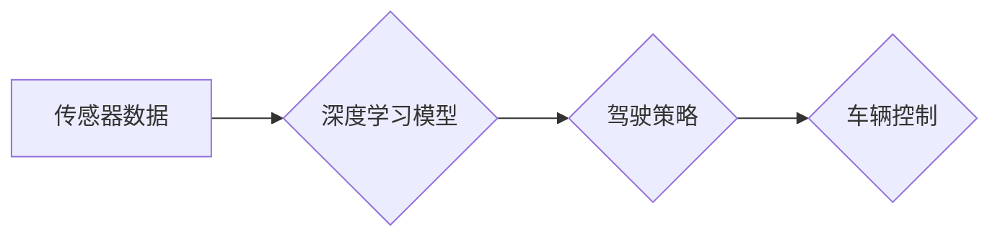

> 自动驾驶, 端到端学习, 深度学习, 计算机视觉, 传感器融合, 资源分配, 迭代优化

## 1. 背景介绍

自动驾驶技术作为未来交通运输的重要发展方向，近年来取得了显著进展。从早期基于规则的控制系统到如今的深度学习驱动的端到端自动驾驶，技术演进速度惊人。端到端自动驾驶，顾名思义，是指将感知、决策和控制等多个模块整合在一起，通过深度学习模型直接从传感器数据中学习驾驶策略，实现车辆的自主驾驶。

这种端到端学习的架构具有许多优势，例如：

* **简化系统设计:**  将多个模块融合为一个整体，减少了模块之间的接口和依赖关系，简化了系统设计和开发。
* **提高学习效率:**  模型能够直接从原始数据中学习驾驶策略，无需人工设计复杂的特征工程，提高了学习效率。
* **增强鲁棒性:**  端到端学习的模型能够更好地理解复杂的驾驶场景，并学习应对各种突发情况的策略，提高了系统的鲁棒性。

然而，端到端自动驾驶也面临着诸多挑战，其中资源分配和迭代优化尤为关键。

## 2. 核心概念与联系

端到端自动驾驶的核心概念包括：

* **传感器数据:**  自动驾驶系统依赖于各种传感器，例如摄像头、雷达、激光雷达等，获取车辆周围的环境信息。
* **深度学习模型:**  深度学习模型是端到端自动驾驶的核心，用于从传感器数据中学习驾驶策略。常见的深度学习模型包括卷积神经网络（CNN）、循环神经网络（RNN）和强化学习算法等。
* **驾驶策略:**  驾驶策略是指车辆在不同场景下采取的行动，例如加速、减速、转向等。

**核心概念架构:**



## 3. 核心算法原理 & 具体操作步骤

### 3.1  算法原理概述

端到端自动驾驶的核心算法是深度学习算法，其中最常用的算法是基于CNN的图像识别和预测算法。这些算法通过多层神经网络结构，学习从图像数据中提取特征，并预测车辆周围环境的信息，例如行人、车辆、道路边界等。

### 3.2  算法步骤详解

1. **数据采集:**  首先需要收集大量的驾驶场景数据，包括图像、激光雷达点云、传感器数据等。
2. **数据预处理:**  对采集到的数据进行预处理，例如图像裁剪、增强、标注等，以提高模型训练的效率和精度。
3. **模型训练:**  使用深度学习框架，例如TensorFlow或PyTorch，训练CNN模型。模型训练过程包括输入预处理后的数据，计算模型输出，并根据输出与真实标签之间的误差进行参数更新。
4. **模型评估:**  在训练完成后，使用测试数据集评估模型的性能，例如识别精度、预测准确率等。
5. **模型部署:**  将训练好的模型部署到自动驾驶系统中，用于实时感知和决策。

### 3.3  算法优缺点

**优点:**

* **高精度:**  深度学习算法能够学习复杂的特征，实现高精度的图像识别和预测。
* **自动化:**  模型训练过程可以自动化，减少了人工干预。
* **可扩展性:**  深度学习模型可以很容易地扩展到新的场景和任务。

**缺点:**

* **数据依赖:**  深度学习算法需要大量的训练数据，数据质量直接影响模型性能。
* **计算资源:**  训练深度学习模型需要大量的计算资源，成本较高。
* **可解释性:**  深度学习模型的决策过程难以解释，缺乏透明度。

### 3.4  算法应用领域

端到端自动驾驶算法广泛应用于自动驾驶汽车、无人机、机器人等领域。

## 4. 数学模型和公式 & 详细讲解 & 举例说明

### 4.1  数学模型构建

端到端自动驾驶的数学模型通常基于深度学习框架，例如TensorFlow或PyTorch。模型结构由多个神经网络层组成，每层都包含多个神经元。神经元之间通过权重连接，并使用激活函数进行非线性变换。

### 4.2  公式推导过程

深度学习模型的训练过程基于梯度下降算法。目标函数是模型输出与真实标签之间的误差，梯度下降算法通过迭代更新模型参数，最小化目标函数值。

**损失函数:**

$$
L = \frac{1}{N} \sum_{i=1}^{N} \left\| y_i - \hat{y}_i \right\|^2
$$

其中：

* $L$ 是损失函数值
* $N$ 是样本数量
* $y_i$ 是真实标签
* $\hat{y}_i$ 是模型预测值

**梯度下降算法:**

$$
\theta = \theta - \alpha \nabla L(\theta)
$$

其中：

* $\theta$ 是模型参数
* $\alpha$ 是学习率
* $\nabla L(\theta)$ 是损失函数对参数的梯度

### 4.3  案例分析与讲解

例如，在图像识别任务中，模型的输出是一个包含多个类别的概率分布。损失函数可以是交叉熵损失函数，用于衡量模型预测结果与真实标签之间的差异。梯度下降算法可以用来更新模型参数，使模型预测结果更加接近真实标签。

## 5. 项目实践：代码实例和详细解释说明

### 5.1  开发环境搭建

端到端自动驾驶项目通常需要使用Python语言和深度学习框架，例如TensorFlow或PyTorch。还需要安装一些必要的库，例如NumPy、OpenCV等。

### 5.2  源代码详细实现

以下是一个简单的端到端自动驾驶代码示例，使用TensorFlow框架实现图像识别任务：

```python
import tensorflow as tf

# 定义模型结构
model = tf.keras.models.Sequential([
    tf.keras.layers.Conv2D(32, (3, 3), activation='relu', input_shape=(64, 64, 3)),
    tf.keras.layers.MaxPooling2D((2, 2)),
    tf.keras.layers.Conv2D(64, (3, 3), activation='relu'),
    tf.keras.layers.MaxPooling2D((2, 2)),
    tf.keras.layers.Flatten(),
    tf.keras.layers.Dense(10, activation='softmax')
])

# 编译模型
model.compile(optimizer='adam',
              loss='sparse_categorical_crossentropy',
              metrics=['accuracy'])

# 训练模型
model.fit(x_train, y_train, epochs=10)

# 评估模型
loss, accuracy = model.evaluate(x_test, y_test)
print('Loss:', loss)
print('Accuracy:', accuracy)
```

### 5.3  代码解读与分析

这段代码定义了一个简单的卷积神经网络模型，用于图像识别任务。模型包含两个卷积层、两个最大池化层、一个全连接层和一个输出层。模型使用Adam优化器、交叉熵损失函数和准确率作为评估指标。

### 5.4  运行结果展示

训练完成后，模型可以用来预测新的图像数据。预测结果是一个包含多个类别的概率分布，可以根据概率分布选择最可能的类别。

## 6. 实际应用场景

端到端自动驾驶技术已在自动驾驶汽车、无人机、机器人等领域得到广泛应用。

### 6.1  自动驾驶汽车

自动驾驶汽车利用传感器数据和深度学习模型，实现车辆的自主驾驶。

### 6.2  无人机

无人机可以利用端到端自动驾驶技术，实现自主飞行和任务执行。

### 6.3  机器人

机器人可以利用端到端自动驾驶技术，实现自主导航和环境感知。

### 6.4  未来应用展望

端到端自动驾驶技术未来将应用于更多领域，例如：

* **智能交通系统:**  实现车辆之间的协同控制，提高交通效率和安全性。
* **物流配送:**  实现无人驾驶物流车辆，降低物流成本和提高效率。
* **医疗服务:**  实现无人驾驶医疗设备，提高医疗服务效率和质量。

## 7. 工具和资源推荐

### 7.1  学习资源推荐

* **书籍:**  《深度学习》、《自动驾驶汽车》
* **在线课程:**  Coursera、edX、Udacity
* **开源项目:**  OpenAI、TensorFlow、PyTorch

### 7.2  开发工具推荐

* **深度学习框架:**  TensorFlow、PyTorch
* **计算机视觉库:**  OpenCV、Dlib
* **机器人操作系统:**  ROS

### 7.3  相关论文推荐

* **端到端自动驾驶论文:**  "End to End Learning for Self-Driving Cars"
* **深度学习论文:**  "Deep Learning"

## 8. 总结：未来发展趋势与挑战

### 8.1  研究成果总结

端到端自动驾驶技术取得了显著进展，但仍面临着许多挑战。

### 8.2  未来发展趋势

未来端到端自动驾驶技术将朝着以下方向发展：

* **更强大的模型:**  开发更强大的深度学习模型，提高自动驾驶系统的性能和鲁棒性。
* **更丰富的传感器融合:**  利用多种传感器数据，构建更全面的环境感知模型。
* **更安全的驾驶策略:**  开发更安全的驾驶策略，确保自动驾驶系统的安全性。

### 8.3  面临的挑战

端到端自动驾驶技术面临着以下挑战：

* **数据安全:**  自动驾驶系统需要收集大量的传感器数据，数据安全是一个重要的挑战。
* **伦理问题:**  自动驾驶系统可能会面临一些伦理问题，例如事故责任归属。
* **法律法规:**  自动驾驶技术的法律法规尚不完善，需要进一步完善。

### 8.4  研究展望

未来研究将重点关注以下方面：

* **模型可解释性:**  提高自动驾驶模型的可解释性，帮助人们理解模型的决策过程。
* **数据效率:**  提高自动驾驶模型的数据效率，减少对大量训练数据的依赖。
* **安全性和可靠性:**  进一步提高自动驾驶系统的安全性和可靠性，确保其在复杂环境下的安全运行。

## 9. 附录：常见问题与解答

### 9.1  常见问题

* **端到端自动驾驶和传统自动驾驶有什么区别？**
* **端到端自动驾驶的训练数据有哪些？**
* **端到端自动驾驶的安全性如何保证？**

### 9.2  解答

* **端到端自动驾驶和传统自动驾驶的区别:**  传统自动驾驶系统通常采用规则-基于的控制策略，需要人工设计复杂的规则和逻辑。而端到端自动驾驶系统则利用深度学习模型直接从传感器数据中学习驾驶策略，无需人工设计规则。
* **端到端自动驾驶的训练数据:**  端到端自动驾驶的训练数据包括图像、激光雷达点云、传感器数据等。这些数据通常来自模拟环境和真实道路测试。
* **端到端自动驾驶的安全性:**  端到端自动驾驶系统的安全性是一个重要的挑战。为了提高安全性，需要采用多种技术手段，例如冗余传感器、安全驾驶策略、模型验证等。

作者：禅与计算机程序设计艺术 / Zen and the Art of Computer Programming


<end_of_turn>