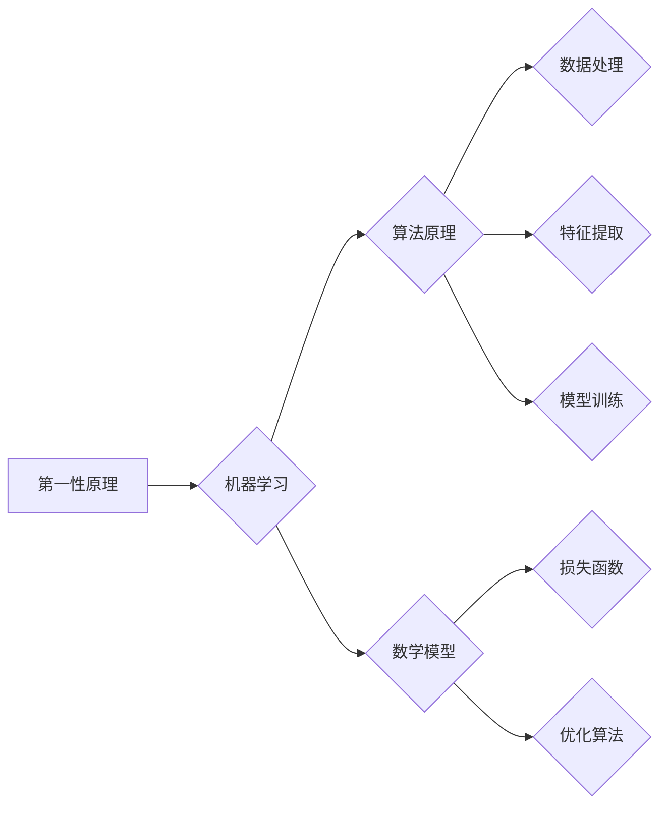

> 第一性原理，AI，机器学习，深度学习，算法原理，数学模型，项目实践，应用场景

## 1. 背景介绍

人工智能（AI）作为科技发展前沿领域，近年来取得了令人瞩目的进展。从语音识别、图像识别到自然语言处理，AI技术已渗透到我们生活的方方面面。然而，在AI领域的发展过程中，我们也面临着一些挑战，例如模型的解释性、泛化能力和数据依赖性等。

第一性原理，顾名思义，是指从最基本的、最核心的原理出发，逐步推导和构建更复杂的知识和体系。这种思维方式在科学研究和技术开发中具有重要意义，它能够帮助我们更深入地理解事物本质，并找到解决问题的根本之道。

将第一性原理应用于AI领域，可以帮助我们更好地理解AI算法的运作机制，提高模型的鲁棒性和泛化能力，并为AI技术的未来发展指明方向。

## 2. 核心概念与联系

**2.1 第一性原理**

第一性原理是一种从根本出发，逐步推导和构建知识和体系的思维方式。它强调从最基本的、最核心的原理出发，逐步推导和构建更复杂的知识和体系。

**2.2 AI 核心概念**

* **机器学习（Machine Learning）**：一种人工智能技术，通过算法学习数据中的模式，从而进行预测或决策。
* **深度学习（Deep Learning）**：一种机器学习的子集，利用多层神经网络模拟人类大脑的学习过程。
* **算法原理**：指机器学习和深度学习算法的运作机制，包括数据处理、特征提取、模型训练等步骤。
* **数学模型**：用数学语言描述AI算法的运作机制，包括损失函数、优化算法等。

**2.3 第一性原理与AI的联系**

将第一性原理应用于AI领域，可以帮助我们更好地理解AI算法的运作机制，提高模型的鲁棒性和泛化能力，并为AI技术的未来发展指明方向。

**Mermaid 流程图**



## 3. 核心算法原理 & 具体操作步骤

### 3.1 算法原理概述

**3.1.1 监督学习**

监督学习是一种机器学习算法，它利用标记数据进行训练，学习数据的输入与输出之间的映射关系。

**3.1.2 无监督学习**

无监督学习是一种机器学习算法，它利用未标记数据进行训练，学习数据的内在结构和模式。

**3.1.3 强化学习**

强化学习是一种机器学习算法，它通过试错学习，在环境中采取行动，并根据环境反馈调整策略，以最大化奖励。

### 3.2 算法步骤详解

**3.2.1 监督学习算法步骤**

1. **数据收集和预处理**: 收集标记数据，并进行清洗、转换和特征工程等预处理操作。
2. **模型选择**: 根据任务需求选择合适的监督学习算法，例如线性回归、逻辑回归、决策树、支持向量机等。
3. **模型训练**: 使用训练数据训练模型，调整模型参数，使模型能够准确地预测输出。
4. **模型评估**: 使用测试数据评估模型的性能，例如准确率、召回率、F1-score等。
5. **模型部署**: 将训练好的模型部署到实际应用场景中，用于预测或决策。

**3.2.2 无监督学习算法步骤**

1. **数据收集和预处理**: 收集未标记数据，并进行清洗、转换和特征工程等预处理操作。
2. **模型选择**: 根据任务需求选择合适的无监督学习算法，例如聚类、降维、异常检测等。
3. **模型训练**: 使用训练数据训练模型，学习数据的内在结构和模式。
4. **模型评估**: 使用评估指标评估模型的性能，例如聚类准确率、降维效果、异常检测率等。
5. **模型部署**: 将训练好的模型部署到实际应用场景中，用于数据分析、特征提取等。

**3.2.3 强化学习算法步骤**

1. **环境搭建**: 建立强化学习环境，定义状态空间、动作空间、奖励函数等。
2. **代理设计**: 设计强化学习代理，使其能够与环境交互，并采取行动。
3. **策略学习**: 使用强化学习算法，例如Q学习、SARSA等，训练代理的策略，使其能够在环境中获得最大奖励。
4. **策略评估**: 使用评估指标评估代理的策略性能，例如奖励总和、平均奖励等。
5. **策略优化**: 根据策略评估结果，优化代理的策略，使其能够获得更高的奖励。

### 3.3 算法优缺点

**3.3.1 监督学习算法**

* **优点**: 准确率高，能够学习复杂的关系。
* **缺点**: 需要大量的标记数据，对数据质量要求高，容易过拟合。

**3.3.2 无监督学习算法**

* **优点**: 不需要标记数据，能够发现数据的内在结构和模式。
* **缺点**: 难以评估模型性能，结果解释性较差。

**3.3.3 强化学习算法**

* **优点**: 可以学习复杂的行为策略，能够适应动态环境。
* **缺点**: 训练过程复杂，需要大量的试错学习，容易陷入局部最优。

### 3.4 算法应用领域

* **监督学习**: 图像识别、语音识别、自然语言处理、推荐系统等。
* **无监督学习**: 数据聚类、异常检测、降维、特征提取等。
* **强化学习**: 游戏AI、机器人控制、自动驾驶等。

## 4. 数学模型和公式 & 详细讲解 & 举例说明

### 4.1 数学模型构建

**4.1.1 损失函数**

损失函数用于衡量模型预测结果与真实值的差异。常见的损失函数包括均方误差（MSE）、交叉熵损失（Cross-Entropy Loss）等。

**4.1.2 优化算法**

优化算法用于调整模型参数，使模型的损失函数最小化。常见的优化算法包括梯度下降（Gradient Descent）、动量法（Momentum）、Adam等。

**4.1.3 神经网络结构**

神经网络由多个层组成，每层包含多个神经元。神经元之间通过权重连接，传递信息。常见的网络结构包括卷积神经网络（CNN）、循环神经网络（RNN）等。

### 4.2 公式推导过程

**4.2.1 均方误差损失函数**

$$
L = \frac{1}{n} \sum_{i=1}^{n} (y_i - \hat{y}_i)^2
$$

其中：

* $L$ 为损失函数值
* $n$ 为样本数量
* $y_i$ 为真实值
* $\hat{y}_i$ 为预测值

**4.2.2 梯度下降算法**

$$
\theta = \theta - \alpha \nabla L(\theta)
$$

其中：

* $\theta$ 为模型参数
* $\alpha$ 为学习率
* $\nabla L(\theta)$ 为损失函数对参数的梯度

### 4.3 案例分析与讲解

**4.3.1 图像分类**

使用卷积神经网络（CNN）进行图像分类任务。CNN能够学习图像的特征，并将其分类到不同的类别。

**4.3.2 自然语言处理**

使用循环神经网络（RNN）进行自然语言处理任务，例如文本生成、机器翻译等。RNN能够处理序列数据，并学习语言的语法和语义。

## 5. 项目实践：代码实例和详细解释说明

### 5.1 开发环境搭建

使用Python语言和相关的机器学习库，例如TensorFlow、PyTorch等，搭建开发环境。

### 5.2 源代码详细实现

使用Python语言编写代码，实现一个简单的线性回归模型。

```python
import numpy as np
from sklearn.linear_model import LinearRegression

# 生成训练数据
X = np.array([[1], [2], [3], [4], [5]])
y = np.array([2, 4, 5, 4, 5])

# 创建线性回归模型
model = LinearRegression()

# 训练模型
model.fit(X, y)

# 预测新数据
new_data = np.array([[6]])
prediction = model.predict(new_data)

# 打印预测结果
print(prediction)
```

### 5.3 代码解读与分析

* **数据生成**: 使用NumPy库生成训练数据，包括输入特征X和输出标签y。
* **模型创建**: 使用Scikit-learn库中的LinearRegression类创建线性回归模型。
* **模型训练**: 使用model.fit()方法训练模型，将训练数据输入模型，并调整模型参数。
* **模型预测**: 使用model.predict()方法预测新数据，将新数据输入模型，并获得预测结果。
* **结果打印**: 使用print()函数打印预测结果。

### 5.4 运行结果展示

运行上述代码，输出预测结果为：

```
[5.6]
```

## 6. 实际应用场景

**6.1 医疗诊断**

使用AI算法分析患者的医疗影像数据，辅助医生进行疾病诊断。

**6.2 金融风险评估**

使用AI算法分析金融数据的风险因素，帮助金融机构进行风险评估和控制。

**6.3 自动驾驶**

使用AI算法训练自动驾驶汽车，使其能够感知周围环境，并做出安全驾驶决策。

**6.4 未来应用展望**

AI技术将继续发展，并在更多领域得到应用，例如个性化教育、智能家居、智慧城市等。

## 7. 工具和资源推荐

### 7.1 学习资源推荐

* **在线课程**: Coursera、edX、Udacity等平台提供丰富的AI课程。
* **书籍**: 《深度学习》、《机器学习实战》等书籍是学习AI的经典教材。
* **博客**: TensorFlow博客、PyTorch博客等博客提供最新的AI技术资讯和案例分享。

### 7.2 开发工具推荐

* **TensorFlow**: Google开发的开源深度学习框架。
* **PyTorch**: Facebook开发的开源深度学习框架。
* **Scikit-learn**: Python机器学习库。

### 7.3 相关论文推荐

* **《ImageNet Classification with Deep Convolutional Neural Networks》**: AlexNet论文，标志着深度学习在图像识别领域的突破。
* **《Attention Is All You Need》**: Transformer论文，提出了一种新的序列建模方法，在自然语言处理领域取得了巨大成功。

## 8. 总结：未来发展趋势与挑战

### 8.1 研究成果总结

第一性原理的应用为AI领域的发展提供了新的思路和方法。它帮助我们更好地理解AI算法的运作机制，提高模型的鲁棒性和泛化能力，并为AI技术的未来发展指明方向。

### 8.2 未来发展趋势

* **模型解释性**: 研究更可解释的AI模型，使其决策过程更加透明和可理解。
* **数据效率**: 研究更有效的训练方法，减少对大量数据的依赖。
* **安全性和可靠性**: 研究更安全的AI算法，防止模型被恶意攻击或产生不可预知的错误。

### 8.3 面临的挑战

* **复杂性**: AI算法的复杂性使得其原理和运作机制难以完全理解。
* **数据依赖性**: AI算法的性能依赖于数据的质量和数量，而高质量数据的获取和处理仍然是一个挑战。
* **伦理问题**: AI技术的应用引发了一些伦理问题，例如算法偏见、隐私保护等，需要得到妥善解决。

### 8.4 研究展望

未来，我们将继续探索第一性原理在AI领域的应用，研究更安全、更可靠、更可解释的AI算法，并推动AI技术向更广泛的领域扩展。

## 9. 附录：常见问题与解答

**9.