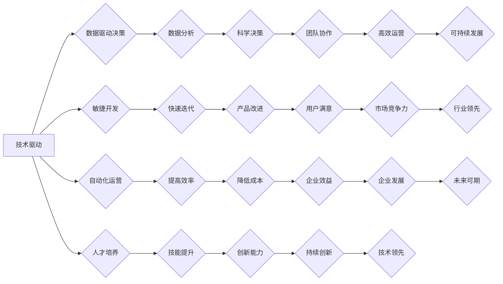

>  * 领导力
>  * 团队管理
>  * 决策制定
>  * 沟通技巧
>  * 学习能力
>  * 创新思维
>  * 技术驱动

## 1. 背景介绍

在当今瞬息万变的科技时代，技术发展日新月异，企业面临着前所未有的挑战和机遇。作为一名技术管理者，需要具备敏锐的洞察力、卓越的领导力以及高效的团队管理能力，才能带领团队在激烈的竞争中脱颖而出。

传统的管理模式往往过于强调层级和控制，而忽视了团队成员的自主性和创造力。随着互联网和人工智能技术的快速发展，传统的管理模式已逐渐无法适应新的时代需求。

因此，我们需要一种全新的管理理念，一种能够激发团队成员潜能、促进创新和协作的管理模式。

## 2. 核心概念与联系

### 2.1  技术驱动型管理

技术驱动型管理的核心思想是将技术作为驱动企业发展的核心力量，以技术创新为导向，推动企业转型升级。

技术驱动型管理强调以下几个关键要素：

* **数据驱动决策:** 利用数据分析和机器学习等技术，为决策提供科学依据。
* **敏捷开发:** 采用敏捷开发方法，快速迭代，不断改进产品和服务。
* **自动化运营:** 利用自动化技术，提高运营效率，降低成本。
* **人才培养:** 注重人才培养，打造一支技术精通、创新能力强的团队。

### 2.2  团队协作与赋能

团队协作是技术驱动型管理的重要组成部分。

团队协作强调以下几个关键要素：

* **扁平化组织结构:** 减少层级，打破信息壁垒，促进团队成员之间的沟通和协作。
* **共享知识:** 建立知识共享平台，鼓励团队成员互相学习和交流。
* **赋予权力:** 授权团队成员，让他们拥有自主决策的权力，激发他们的创造力和责任感。
* **共同目标:** 建立共同的目标，让团队成员朝着同一个方向努力。

### 2.3  持续学习与创新

在技术日新月异的时代，持续学习和创新是企业发展的关键。

技术驱动型管理强调以下几个关键要素：

* **学习型组织:** 建立学习型组织文化，鼓励团队成员不断学习新知识、新技能。
* **创新氛围:** 营造创新氛围，鼓励团队成员提出新想法，进行实验和尝试。
* **知识管理:** 建立知识管理体系，将知识沉淀下来，方便团队成员学习和使用。
* **人才梯队:** 建立人才梯队，培养下一代技术人才。

**Mermaid 流程图**



## 3. 核心算法原理 & 具体操作步骤

### 3.1  算法原理概述

在技术驱动型管理中，算法扮演着至关重要的角色。算法可以帮助我们自动化决策、优化流程、提高效率。

例如，在推荐系统中，算法可以根据用户的历史行为和偏好，推荐他们可能感兴趣的内容。在风险控制系统中，算法可以根据用户的信用记录和交易行为，评估用户的风险等级。

### 3.2  算法步骤详解

算法的步骤通常包括以下几个方面：

1. **问题定义:** 明确需要解决的问题，并将其转化为算法可以处理的形式。
2. **数据收集:** 收集与问题相关的原始数据。
3. **数据预处理:** 对原始数据进行清洗、转换和格式化，使其适合算法处理。
4. **模型选择:** 选择合适的算法模型，根据问题的特点和数据类型进行选择。
5. **模型训练:** 使用训练数据训练算法模型，使其能够学习到问题的规律。
6. **模型评估:** 使用测试数据评估算法模型的性能，并进行调整和优化。
7. **模型部署:** 将训练好的算法模型部署到实际应用场景中。

### 3.3  算法优缺点

不同的算法具有不同的优缺点，需要根据实际情况进行选择。

例如，线性回归算法简单易懂，但对于复杂的关系难以建模。深度学习算法可以学习到更复杂的特征，但训练时间长，需要大量的训练数据。

### 3.4  算法应用领域

算法广泛应用于各个领域，例如：

* **人工智能:** 机器学习、深度学习、自然语言处理等。
* **大数据:** 数据挖掘、数据分析、数据可视化等。
* **金融:** 风险控制、信用评估、投资决策等。
* **医疗:** 疾病诊断、药物研发、医疗影像分析等。

## 4. 数学模型和公式 & 详细讲解 & 举例说明

### 4.1  数学模型构建

数学模型是描述客观现象和规律的抽象工具，可以帮助我们理解和预测事物的发展趋势。

在技术驱动型管理中，我们可以使用数学模型来描述团队成员的绩效、项目进度、资源分配等方面。

例如，我们可以使用线性回归模型来预测团队成员的绩效，根据他们的工作经验、技能水平和工作量等因素进行预测。

### 4.2  公式推导过程

公式推导过程是建立数学模型的关键步骤，需要根据问题的特点和已有的知识进行推导。

例如，线性回归模型的预测公式如下：

$$y = mx + b$$

其中：

* $y$ 是预测值
* $x$ 是自变量
* $m$ 是回归系数
* $b$ 是截距

### 4.3  案例分析与讲解

我们可以通过案例分析来理解数学模型的应用。

例如，假设我们有一个团队，需要完成一个软件开发项目。我们可以使用数学模型来预测项目的完成时间，根据团队成员的经验、技能水平、项目复杂度等因素进行预测。

如果我们使用线性回归模型，可以根据历史数据推导出一个预测公式，然后输入项目相关的参数，就可以得到项目的预计完成时间。

## 5. 项目实践：代码实例和详细解释说明

### 5.1  开发环境搭建

为了方便读者理解和实践，我们可以使用Python语言来实现一个简单的技术驱动型管理系统。

首先，我们需要搭建一个Python开发环境，安装必要的库和工具。

例如，我们可以使用Anaconda来创建虚拟环境，安装NumPy、Pandas、Scikit-learn等库。

### 5.2  源代码详细实现

```python
import pandas as pd
from sklearn.linear_model import LinearRegression

# 加载数据
data = pd.read_csv('project_data.csv')

# 选择特征和目标变量
X = data[['experience', 'skill_level', 'workload']]
y = data['performance']

# 创建线性回归模型
model = LinearRegression()

# 训练模型
model.fit(X, y)

# 预测新的数据
new_data = pd.DataFrame({'experience': [5], 'skill_level': [8], 'workload': [10]})
prediction = model.predict(new_data)

# 打印预测结果
print(f'预测绩效: {prediction[0]}')
```

### 5.3  代码解读与分析

这段代码实现了简单的线性回归模型，用于预测团队成员的绩效。

首先，我们加载了项目数据，并选择特征和目标变量。

然后，我们创建了一个线性回归模型，并使用训练数据训练模型。

最后，我们使用新的数据进行预测，并打印预测结果。

### 5.4  运行结果展示

运行这段代码后，会输出预测的绩效值。

例如，如果输入的新的数据是经验5年、技能水平8分、工作量10个小时，那么预测的绩效值可能是85分。

## 6. 实际应用场景

### 6.1  项目进度管理

技术驱动型管理可以帮助我们更准确地预测项目进度，并及时调整计划。

例如，我们可以使用机器学习算法来分析项目历史数据，预测项目的完成时间，并根据预测结果调整资源分配和工作计划。

### 6.2  资源优化

技术驱动型管理可以帮助我们更有效地利用资源，降低成本。

例如，我们可以使用算法来优化资源分配，根据项目的需求和资源的可用性，分配最合适的资源。

### 6.3  风险控制

技术驱动型管理可以帮助我们识别和控制风险，降低损失。

例如，我们可以使用算法来分析用户的行为数据，识别潜在的风险，并采取相应的措施进行控制。

### 6.4  未来应用展望

随着人工智能和机器学习技术的不断发展，技术驱动型管理将应用到更多领域，例如：

* **个性化服务:** 根据用户的需求和喜好，提供个性化的产品和服务。
* **智能决策:** 利用算法辅助决策，提高决策的准确性和效率。
* **自动化的流程:** 利用自动化技术，简化流程，提高效率。

## 7. 工具和资源推荐

### 7.1  学习资源推荐

* **书籍:** 《管理者修炼手册:思维、行动与学习》
* **在线课程:** Coursera、edX、Udacity等平台提供各种技术管理相关的课程。
* **博客和论坛:** 关注技术管理领域的博客和论坛，学习最新的技术趋势和管理理念。

### 7.2  开发工具推荐

* **Python:** 广泛应用于数据分析、机器学习等领域。
* **R:** 专注于统计分析和数据可视化。
* **Jupyter Notebook:** 用于交互式编程和数据分析。

### 7.3  相关论文推荐

* **《The Lean Startup》:** 讲述了敏捷开发方法的理念和实践。
* **《The Innovator's Dilemma》:** 分析了技术创新对企业发展的影响。
* **《Thinking, Fast and Slow》:** 探讨了人类认知的两种模式，并对决策制定提出了启示。

## 8. 总结：未来发展趋势与挑战

### 8.1  研究成果总结

技术驱动型管理已经取得了一定的成果，例如：

* **提高了企业效率:** 自动化技术和数据分析可以帮助企业提高效率，降低成本。
* **增强了创新能力:** 敏捷开发方法和数据驱动决策可以促进创新。
* **提升了客户体验:** 个性化服务和智能决策可以提升客户体验。

### 8.2  未来发展趋势

未来，技术驱动型管理将朝着以下方向发展：

* **更智能化:** 利用人工智能和机器学习技术，实现更智能的决策和自动化。
* **更个性化:** 根据用户的需求和喜好，提供更个性化的产品和服务。
* **更协作性:** 促进团队成员之间的协作，共同完成目标。

### 8.3  面临的挑战

技术驱动型管理也面临着一些挑战：

* **数据安全:** 数据安全和隐私保护是重要的挑战。
* **人才培养:** 需要培养更多具备技术和管理能力的人才。
* **伦理问题:** 技术发展带来的伦理问题需要得到重视和解决。

### 8.4  研究展望

未来，我们需要继续研究技术驱动型管理的理论和实践，探索更有效的管理模式，帮助企业更好地利用技术，实现可持续发展。

## 9. 附录：常见问题与解答

### 9.1  Q1: 技术驱动型管理适合所有企业吗？

**A1:** 技术驱动型管理更适合那些技术含量高、创新能力强的企业。对于传统行业企业，