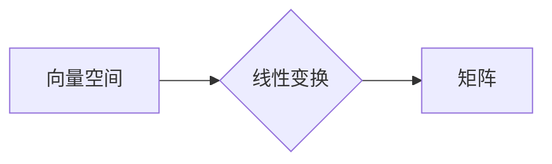

> 线性代数，矩阵，向量，线性变换，特征值，特征向量，应用场景，算法原理，代码实现

## 1. 背景介绍

线性代数作为数学领域的基础分支，在计算机科学、人工智能、数据科学等领域有着广泛的应用。它为我们提供了处理高维数据、进行图像处理、机器学习建模等任务的强大工具。

从本质上讲，线性代数研究的是向量空间、线性变换和矩阵之间的关系。向量空间是具有加法和标量乘法的元素集合，线性变换是将向量空间映射到另一个向量空间的规则，而矩阵则提供了高效的线性变换表示方法。

## 2. 核心概念与联系

### 2.1 向量空间

向量空间是一个集合，其中元素称为向量，并满足以下两个条件：

* **封闭性:** 向量加法和标量乘法运算的结果仍然属于该集合。
* **结合律、交换律、分配律:** 向量加法和标量乘法运算满足相应的结合律、交换律和分配律。

常见的向量空间包括 R^n (n维实数向量空间) 和 C^n (n维复数向量空间)。

### 2.2 线性变换

线性变换是一种将向量空间映射到另一个向量空间的规则，它满足以下两个性质：

* **加性:** T(u + v) = T(u) + T(v) 对于任意向量 u 和 v。
* **齐次性:** T(cu) = cT(u) 对于任意向量 u 和标量 c。

线性变换可以表示为矩阵乘法，这使得我们可以利用矩阵运算来高效地进行线性变换。

### 2.3 矩阵

矩阵是一种用于表示线性变换的二维数组。矩阵的元素可以是实数、复数或其他类型的数。

**Mermaid 流程图:**



## 3. 核心算法原理 & 具体操作步骤

### 3.1 算法原理概述

线性代数算法的核心是利用矩阵和向量之间的关系来解决各种问题。常见的线性代数算法包括：

* **矩阵加法和减法:** 将两个相同维度的矩阵对应元素相加或相减。
* **矩阵乘法:** 将两个矩阵相乘，需要满足一定的条件。
* **矩阵转置:** 将矩阵的行和列交换。
* **矩阵逆:** 找到一个矩阵，使其与原矩阵相乘等于单位矩阵。
* **特征值和特征向量:** 寻找矩阵的特殊向量和标量，满足特定的关系。

### 3.2 算法步骤详解

以下以矩阵乘法为例，详细说明算法步骤：

1. **输入:** 两个矩阵 A 和 B，满足 A 的列数等于 B 的行数。
2. **输出:** 矩阵 C，其维度为 A 的行数和 B 的列数。
3. **步骤:**
    * 对于 C 中的每个元素 c<sub>ij</sub>，计算其值为 A 的第 i 行与 B 的第 j 列对应元素的乘积之和。
    * 公式：c<sub>ij</sub> = Σ<sub>k=1</sub><sup>n</sup> a<sub>ik</sub>b<sub>kj</sub>，其中 n 是 A 的列数 (等于 B 的行数)。

### 3.3 算法优缺点

**优点:**

* **高效性:** 矩阵乘法算法可以利用计算机的并行计算能力进行优化，实现高效的计算。
* **通用性:** 矩阵乘法是线性代数的基础运算，广泛应用于各种算法和应用场景。

**缺点:**

* **计算复杂度:** 对于大型矩阵，矩阵乘法的计算复杂度较高。

### 3.4 算法应用领域

* **图像处理:** 图像可以表示为矩阵，矩阵乘法可以用于图像旋转、缩放、滤波等操作。
* **机器学习:** 许多机器学习算法，例如线性回归、支持向量机，都依赖于矩阵运算。
* **数据科学:** 数据分析和挖掘经常涉及到矩阵操作，例如数据降维、特征提取。

## 4. 数学模型和公式 & 详细讲解 & 举例说明

### 4.1 数学模型构建

线性代数的核心数学模型是向量空间和线性变换。

* **向量空间:** V 是一个集合，其中元素称为向量，并满足以下两个条件：
    * **封闭性:** 对于任意向量 u, v ∈ V，u + v ∈ V。
    * **标量乘法:** 对于任意向量 u ∈ V 和标量 c，cu ∈ V。

* **线性变换:** T: V → W 是一个映射，满足以下两个性质：
    * **加性:** T(u + v) = T(u) + T(v) 对于任意向量 u, v ∈ V。
    * **齐次性:** T(cu) = cT(u) 对于任意向量 u ∈ V 和标量 c。

### 4.2 公式推导过程

**矩阵乘法公式:**

设 A 是 m × n 矩阵，B 是 n × p 矩阵，则它们的乘积 C 是 m × p 矩阵，其元素 c<sub>ij</sub> 为：

$$c_{ij} = \sum_{k=1}^{n} a_{ik}b_{kj}$$

其中，a<sub>ik</sub> 是 A 的第 i 行第 k 列元素，b<sub>kj</sub> 是 B 的第 k 行第 j 列元素。

**证明:**

矩阵乘法公式的推导基于线性变换的性质。

* A 可以表示为从 n 维向量空间到 m 维向量空间的线性变换。
* B 可以表示为从 m 维向量空间到 p 维向量空间的线性变换。
* 因此，AB 可以表示为将 n 维向量空间映射到 p 维向量空间的线性变换。
* 矩阵乘法公式反映了这种线性变换的具体计算过程。

### 4.3 案例分析与讲解

**示例:**

设 A = [[1, 2], [3, 4]]，B = [[5, 6], [7, 8]]，则 AB = [[19, 22], [43, 50]]。

**解释:**

* AB 的第 1 行第 1 列元素 c<sub>11</sub> = 1*5 + 2*7 = 19。
* AB 的第 1 行第 2 列元素 c<sub>12</sub> = 1*6 + 2*8 = 22。
* AB 的第 2 行第 1 列元素 c<sub>21</sub> = 3*5 + 4*7 = 43。
* AB 的第 2 行第 2 列元素 c<sub>22</sub> = 3*6 + 4*8 = 50。

## 5. 项目实践：代码实例和详细解释说明

### 5.1 开发环境搭建

* **操作系统:** Linux, macOS, Windows
* **编程语言:** Python
* **库:** NumPy

### 5.2 源代码详细实现

```python
import numpy as np

# 定义矩阵 A 和 B
A = np.array([[1, 2], [3, 4]])
B = np.array([[5, 6], [7, 8]])

# 计算矩阵乘积 AB
AB = np.dot(A, B)

# 打印结果
print("矩阵 A:")
print(A)
print("矩阵 B:")
print(B)
print("矩阵 AB:")
print(AB)
```

### 5.3 代码解读与分析

* **导入 NumPy 库:** `import numpy as np` 导入 NumPy 库，并使用别名 `np` 简化引用。
* **定义矩阵 A 和 B:** 使用 `np.array()` 函数创建两个 NumPy 数组，分别表示矩阵 A 和 B。
* **计算矩阵乘积 AB:** 使用 `np.dot()` 函数计算矩阵 A 和 B 的乘积，结果存储在变量 `AB` 中。
* **打印结果:** 使用 `print()` 函数打印矩阵 A、B 和 AB 的值。

### 5.4 运行结果展示

```
矩阵 A:
[[1 2]
 [3 4]]
矩阵 B:
[[5 6]
 [7 8]]
矩阵 AB:
[[19 22]
 [43 50]]
```

## 6. 实际应用场景

### 6.1 图像处理

* **图像旋转:** 使用旋转矩阵将图像旋转一定角度。
* **图像缩放:** 使用缩放矩阵将图像放大或缩小。
* **图像滤波:** 使用卷积核矩阵对图像进行滤波操作，例如锐化、模糊等。

### 6.2 机器学习

* **线性回归:** 使用矩阵运算求解线性回归模型的参数。
* **支持向量机:** 使用矩阵运算求解支持向量机模型的决策边界。
* **主成分分析:** 使用矩阵运算进行数据降维。

### 6.3 数据科学

* **数据分析:** 使用矩阵运算进行数据聚类、关联规则挖掘等分析。
* **数据可视化:** 使用矩阵运算生成数据可视化图表。

### 6.4 未来应用展望

随着人工智能和机器学习的发展，线性代数在更广泛的领域将发挥越来越重要的作用。例如：

* **自然语言处理:** 使用线性代数模型进行文本分类、情感分析等任务。
* **计算机视觉:** 使用线性代数模型进行目标检测、图像识别等任务。
* **推荐系统:** 使用线性代数模型进行用户行为预测、商品推荐等任务。

## 7. 工具和资源推荐

### 7.1 学习资源推荐

* **书籍:**
    * 《线性代数及其应用》 - Gilbert Strang
    * 《线性代数及其应用》 - David C. Lay
* **在线课程:**
    * MIT OpenCourseWare 线性代数课程
    * Coursera 线性代数课程

### 7.2 开发工具推荐

* **NumPy:** Python 的数值计算库，提供高效的矩阵运算功能。
* **SciPy:** Python 的科学计算库，包含 NumPy 的扩展功能，例如线性代数求解器。
* **Pandas:** Python 的数据分析库，提供数据结构和数据处理功能，可以与 NumPy 和 SciPy 结合使用。

### 7.3 相关论文推荐

* **Eigenvalues and Eigenvectors:** https://en.wikipedia.org/wiki/Eigenvalue_and_eigenvector
* **Singular Value Decomposition:** https://en.wikipedia.org/wiki/Singular_value_decomposition
* **Linear Regression:** https://en.wikipedia.org/wiki/Linear_regression

## 8. 总结：未来发展趋势与挑战

### 8.1 研究成果总结

线性代数已经发展成为一个成熟的数学分支，在计算机科学、人工智能、数据科学等领域有着广泛的应用。

### 8.2 未来发展趋势

* **更高效的算法:** 研究更快速、更节省内存的线性代数算法，以应对大规模数据处理的需求。
* **更广泛的应用:** 将线性代数应用于更多新的领域，例如生物信息学、金融建模等。
* **理论研究:** 深入研究线性代数的理论基础，探索新的应用方向。

### 8.3 面临的挑战

* **计算复杂度:** 对于大型矩阵，线性代数算法的计算复杂度仍然是一个挑战。
* **数据规模:** 随着数据规模的不断增长，线性代数算法需要能够处理海量数据。
* **理论理解:** 对于一些复杂的线性代数问题，理论理解仍然不够深入。

### 8.4 研究展望

未来，线性代数研究将继续朝着更高效、更广泛、更深入的方向发展，为人工智能、数据科学等领域提供更强大的工具和方法。

## 9. 附录：常见问题与解答

### 9.1 矩阵乘法的交换律是否成立？

矩阵乘法一般不满足交换律，即 AB ≠ BA。

### 9.2 矩阵的逆矩阵是否存在？

并非所有矩阵都有逆矩阵。只有方阵且行列式不为零的矩阵才有逆矩阵。

### 9.3 如何求解矩阵的特征值和特征向量？

可以使用特征值方程求解矩阵的特征值，然后将特征值代