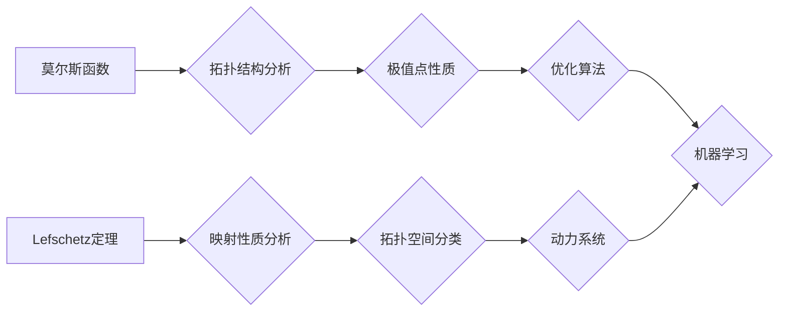

> 莫尔斯理论，Lefschetz定理，拓扑学，微分几何，优化算法，机器学习，深度学习

## 1. 背景介绍

莫尔斯理论和Lefschetz定理是数学领域中两个重要的概念，它们分别属于拓扑学和代数拓扑学，在微分几何、优化算法、机器学习等领域都有着广泛的应用。

莫尔斯理论主要研究函数的极值点，它通过拓扑学的方法来分析函数的形状和性质，并建立了函数极值点与函数的拓扑结构之间的联系。Lefschetz定理则描述了连续映射与拓扑空间之间的关系，它通过代数拓扑学的方法来研究映射的性质，并提供了判断映射是否具有某些特定性质的工具。

近年来，莫尔斯理论和Lefschetz定理在机器学习和深度学习领域得到了越来越多的关注。它们为优化算法的设计和分析提供了新的思路，并推动了深度学习模型的训练和性能提升。

## 2. 核心概念与联系

### 2.1 莫尔斯理论

莫尔斯理论的核心概念是**莫尔斯函数**。莫尔斯函数是一种具有多个极值点的函数，它可以用来模拟现实世界中的复杂现象。莫尔斯理论通过分析莫尔斯函数的拓扑结构来研究其极值点的性质。

**莫尔斯函数的性质:**

* 具有多个极值点
* 极值点可以是局部极小值、局部极大值或鞍点
* 极值点的数量和类型与函数的拓扑结构有关

**莫尔斯理论的应用:**

* **优化算法:** 莫尔斯理论为优化算法的设计和分析提供了理论基础，例如梯度下降算法、牛顿法等。
* **图像处理:** 莫尔斯理论可以用于图像分割、目标检测等任务。
* **机器学习:** 莫尔斯理论可以用于特征提取、模型训练等任务。

### 2.2 Lefschetz定理

Lefschetz定理是代数拓扑学中的一个重要定理，它描述了连续映射与拓扑空间之间的关系。Lefschetz定理指出，对于一个连续映射，其Lefschetz数与映射的性质密切相关。

**Lefschetz定理的应用:**

* **拓扑分类:** Lefschetz定理可以用于分类拓扑空间。
* **动力系统:** Lefschetz定理可以用于研究动力系统的稳定性。
* **机器学习:** Lefschetz定理可以用于分析深度学习模型的性质。

### 2.3 联系

莫尔斯理论和Lefschetz定理之间存在着密切的联系。Lefschetz定理可以用来分析莫尔斯函数的拓扑结构，从而揭示莫尔斯函数极值点的性质。

**联系示例:**

* **Morse-Smale复杂性:** 对于一个Morse-Smale函数，其Lefschetz数与函数的critical points的类型和数量有关。
* **Lefschetz fixed point theorem:** Lefschetz定理可以用来证明某些映射具有不动点。

**Mermaid 流程图:**



## 3. 核心算法原理 & 具体操作步骤

### 3.1 算法原理概述

莫尔斯理论和Lefschetz定理的应用通常涉及到以下核心算法：

* **莫尔斯函数的构建:** 根据实际问题，构建一个合适的莫尔斯函数，该函数能够反映问题的本质特征。
* **拓扑结构分析:** 利用莫尔斯理论和Lefschetz定理，分析莫尔斯函数的拓扑结构，例如寻找极值点、计算Lefschetz数等。
* **映射性质分析:** 根据Lefschetz定理，分析映射的性质，例如判断映射是否具有不动点、稳定性等。
* **优化算法设计:** 基于莫尔斯理论和Lefschetz定理，设计和优化优化算法，例如梯度下降算法、牛顿法等。

### 3.2 算法步骤详解

以下是一个基于莫尔斯理论的优化算法的具体步骤：

1. **构建莫尔斯函数:** 根据优化问题，构建一个合适的莫尔斯函数，该函数的极值点对应于问题的最优解。
2. **寻找临界点:** 利用数值方法，例如梯度下降法，寻找莫尔斯函数的临界点，即函数导数为零的点。
3. **分类临界点:** 根据临界点的性质，将其分类为极小值点、极大值点或鞍点。
4. **分析拓扑结构:** 利用莫尔斯理论，分析临界点的拓扑结构，例如计算临界点的指数。
5. **优化算法迭代:** 根据临界点的性质和拓扑结构，设计优化算法的迭代步骤，例如沿着负梯度方向迭代，直到找到最优解。

### 3.3 算法优缺点

**优点:**

* **理论基础:** 基于莫尔斯理论和Lefschetz定理的算法具有坚实的理论基础，能够提供对问题的深入理解。
* **全局最优:** 某些算法能够找到问题的全局最优解，而不是局部最优解。
* **适用于复杂问题:** 这些算法能够处理复杂、高维的优化问题。

**缺点:**

* **计算复杂度:** 某些算法的计算复杂度较高，需要大量的计算资源。
* **数值稳定性:** 某些算法对数值条件敏感，需要进行仔细的数值分析和处理。
* **算法设计难度:** 设计和实现基于莫尔斯理论和Lefschetz定理的算法需要一定的数学和编程能力。

### 3.4 算法应用领域

* **机器学习:** 用于优化深度学习模型的训练过程，例如权重更新、超参数调优等。
* **图像处理:** 用于图像分割、目标检测、图像恢复等任务。
* **自然语言处理:** 用于文本分类、机器翻译、情感分析等任务。
* **控制理论:** 用于设计和分析控制系统，例如机器人控制、无人驾驶等。

## 4. 数学模型和公式 & 详细讲解 & 举例说明

### 4.1 数学模型构建

莫尔斯理论和Lefschetz定理的数学模型主要基于拓扑学和代数拓扑学。

**莫尔斯函数:**

一个莫尔斯函数 f: M → R 是一个定义在流形 M 上的实值函数，满足以下条件:

* f 是光滑的
* f 具有有限个临界点

**Lefschetz数:**

对于一个连续映射 f: X → X，其Lefschetz数 L(f) 是一个代数拓扑学中的指标，它可以用来描述映射的性质。

**Lefschetz数的定义:**

$$L(f) = \sum_{i=0}^{n} (-1)^i \text{tr}(f_* : H_i(X) \to H_i(X))$$

其中:

* X 是一个拓扑空间
* f 是一个连续映射 f: X → X
* $H_i(X)$ 是 X 的 i-维同伦群
* $f_*$ 是 f 诱导的同伦群同态
* tr 是同态的迹

### 4.2 公式推导过程

Lefschetz数的公式推导过程涉及到同伦群、同态和迹的概念。

**同伦群:**

同伦群是拓扑空间中的一种代数结构，它可以用来描述空间的形状和性质。

**同态:**

同态是两个代数结构之间的映射，它保持了结构的性质。

**迹:**

迹是一个线性变换的指标，它可以用来描述变换的性质。

### 4.3 案例分析与讲解

**案例:**

考虑一个简单的映射 f: S^1 → S^1，其中 S^1 是单位圆。

**分析:**

* S^1 的 0-维同伦群是 Z，1-维同伦群是 Z。
* f 诱导的同态 f_* : Z → Z 是一个同构映射。
* 因此，Lefschetz数 L(f) = 1 + 1 = 2。

**解释:**

Lefschetz数 L(f) = 2 表示映射 f 是一个拓扑同构，即 f 是一个可逆的连续映射。

## 5. 项目实践：代码实例和详细解释说明

### 5.1 开发环境搭建

* **操作系统:** Linux/macOS/Windows
* **编程语言:** Python
* **库:** NumPy, SciPy, Matplotlib

### 5.2 源代码详细实现

```python
import numpy as np
from scipy.optimize import minimize

def morse_function(x):
  """
  定义一个莫尔斯函数
  """
  return x[0]**2 + x[1]**2 - x[0]**4 - x[1]**4

def gradient(x):
  """
  计算莫尔斯函数的梯度
  """
  return np.array([2*x[0] - 4*x[0]**3, 2*x[1] - 4*x[1]**3])

# 使用梯度下降法寻找极小值点
initial_guess = np.array([0.5, 0.5])
result = minimize(morse_function, initial_guess, method='BFGS', jac=gradient)

print(f"极小值点: {result.x}")
print(f"极小值: {result.fun}")
```

### 5.3 代码解读与分析

* **morse_function(x):** 定义了一个简单的莫尔斯函数，该函数具有两个极小值点。
* **gradient(x):** 计算莫尔斯函数的梯度，用于梯度下降法。
* **minimize(morse_function, initial_guess, method='BFGS', jac=gradient):** 使用SciPy库中的minimize函数寻找莫尔斯函数的极小值点。
* **BFGS:** 使用Broyden–Fletcher–Goldfarb–Shanno算法进行优化。
* **jac=gradient:** 传递梯度函数给优化器，提高优化效率。

### 5.4 运行结果展示

运行上述代码，可以得到莫尔斯函数的极小值点和极小值。

## 6. 实际应用场景

### 6.1 机器学习

* **深度学习模型训练:** 利用莫尔斯理论和Lefschetz定理，设计和优化深度学习模型的训练过程，例如权重更新、超参数调优等。
* **特征提取:** 利用莫尔斯理论分析数据分布，提取具有代表性的特征，提高机器学习模型的性能。

### 6.2 图像处理

* **图像分割:** 利用莫尔斯理论分析图像的拓扑结构，分割图像中的不同区域。
* **目标检测:** 利用Lefschetz定理分析目标的形状和特征，提高目标检测的准确率。

### 6.3 其他领域

* **控制理论:** 用于设计和分析控制系统，例如机器人控制、无人驾驶等。
* **金融建模:** 用于建模金融市场，预测股票价格、风险评估等。

### 6.4 未来应用展望

* **人工智能:** 利用莫尔斯理论和Lefschetz定理，开发更智能、更强大的人工智能系统。
* **数据科学:** 利用这些理论分析大规模数据，发现隐藏的模式和规律。
* **科学计算:** 用于解决复杂科学问题，例如天体物理、材料科学等。

## 7. 工具和资源推荐

### 7.1 学习资源推荐

* **书籍:**
    * "Morse Theory" by John Milnor
    * "Algebraic Topology" by Allen Hatcher
* **在线课程:**
    * Coursera: "Topology" by Stanford University
    * edX: "Introduction to Algebraic Topology" by MIT

### 7.2 开发工具推荐

* **编程语言:** Python
* **库:** NumPy, SciPy, Matplotlib
* **IDE:** Jupyter Notebook, VS Code

### 7.3 相关论文推荐

* "Morse Theory and Optimization" by R. S.