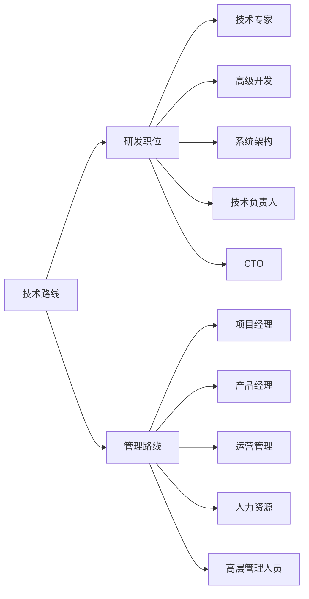

                 

## 1. 背景介绍

程序员的职业发展一直是众多技术人员关注的重点。在IT行业中，不同的技术路线和职业路径的选择，会严重影响个人职业发展前景和人生满意度。随着技术的快速发展，市场对技术人才和领导管理人才的需求都在持续增加。本文将详细介绍技术路线和管理路线的基本概念、优缺点以及适合人群，帮助程序员更好地规划自己的职业发展。

## 2. 核心概念与联系

### 2.1 核心概念概述

技术路线（Technical Career Path）：指的是以技术提升、深入研究为主导的职业生涯发展路径，主要面向软件开发、系统架构、数据分析等领域。技术路线强调持续学习、技术创新和项目管理能力。

管理路线（Management Career Path）：以培养领导力、团队管理和商业洞察能力为核心，主要面向项目管理、产品管理、运营管理等岗位。管理路线强调战略规划、团队协作和跨部门沟通。

两种职业路线既有交集也有差异，在实际工作中常常需要相互配合。技术专家可以通过管理提升团队效能，管理人才可以通过技术深入理解产品技术细节，实现协同创新。

### 2.2 核心概念原理和架构的 Mermaid 流程图



## 3. 核心算法原理 & 具体操作步骤

### 3.1 算法原理概述

技术路线的核心在于不断提升技术水平，通过项目实践、技术研究和团队合作，实现个人价值和职业成就。管理路线则注重培养领导能力，通过学习项目管理、商业策略和团队管理知识，实现团队和组织的成功。

### 3.2 算法步骤详解

#### 3.2.1 技术路线步骤详解

1. **选择专业领域**：根据个人兴趣和市场需求，选择一个有长期发展潜力的技术方向，如前端、后端、数据科学等。
2. **持续学习和实践**：通过在线课程、书籍、开源项目等方式，不断学习新知识和新技术。
3. **积累项目经验**：积极参与实际项目，从初级到高级，积累丰富的项目经验。
4. **技术深度和广度并重**：在掌握基本技术框架的基础上，深入研究底层原理，拓宽技术视野。
5. **培养软技能**：注重沟通、协作、时间管理等软技能提升，提高团队合作效率。

#### 3.2.2 管理路线步骤详解

1. **了解商业环境**：通过学习商业知识和管理理论，理解行业趋势和市场需求。
2. **实践项目管理**：通过实际项目或模拟项目管理，积累项目规划、进度控制和风险管理经验。
3. **培养领导力**：通过领导力培训、团队协作等方式，提升沟通、激励和决策能力。
4. **跨部门协作**：通过跨部门项目或内部合作，增强跨部门沟通和协调能力。
5. **承担更多责任**：逐步承担更多团队管理职责，积累管理和决策经验。

### 3.3 算法优缺点

#### 3.3.1 技术路线优缺点

**优点**：
1. 技术深度高：在特定领域积累丰富的知识和经验，成为技术专家。
2. 职业发展明确：通过技术能力的提升，可以晋升为技术领导或架构师。
3. 创新驱动：通过技术研究和实践，推动技术进步和产品创新。

**缺点**：
1. 竞争激烈：技术领域往往人才过剩，晋升路径相对狭窄。
2. 工作压力大：项目迭代快，需要不断学习新技术和应对复杂问题。
3. 职业转型困难：技术路线转换到管理路线需要时间积累和管理知识。

#### 3.3.2 管理路线优缺点

**优点**：
1. 职业晋升路径宽：从基层管理到高层管理，晋升路径多样，机会较多。
2. 高职业满足感：通过团队协作和管理，实现更大价值，获得更高的成就感。
3. 行业视野广：了解商业环境和管理策略，具备更广阔的行业视角。

**缺点**：
1. 技术深度不足：管理职位更多关注团队和项目，可能缺乏深入技术细节的把握。
2. 管理挑战大：需要平衡团队资源、解决团队冲突，管理复杂度较高。
3. 职业风险高：管理决策影响整个团队和项目，需要承担更大的责任。

### 3.4 算法应用领域

技术路线主要应用于软件开发、系统架构、数据分析等技术密集型领域。管理路线则广泛应用于项目管理、产品管理、运营管理、人力资源管理等非技术岗位。在实际工作中，许多技术人才和管理人才往往需要相互协作，共同推动项目成功。

## 4. 数学模型和公式 & 详细讲解 & 举例说明

### 4.1 数学模型构建

技术路线和管理路线的选择可以建模为0-1决策问题。令 $x$ 为选择技术路线，$y$ 为选择管理路线。我们定义目标函数和约束条件如下：

- 目标函数：最大化职业满意度 $f(x, y)$，包括薪资、成就感、工作压力等多个因素。
- 约束条件：时间投入 $t_x$ 和 $t_y$ 的平衡，以及个人能力与职业需求匹配。

其中，时间投入 $t_x$ 和 $t_y$ 由个人时间管理能力决定，职业需求匹配度由市场需求和个人兴趣决定。

### 4.2 公式推导过程

将职业满意度 $f(x, y)$ 表示为如下加权求和形式：

$$
f(x, y) = w_1 \cdot S(x) + w_2 \cdot S(y) + w_3 \cdot P(x, y)
$$

其中 $S(x)$ 和 $S(y)$ 分别表示选择技术路线和管理路线的满意度，$P(x, y)$ 表示两者结合的协同效应。权重 $w_1, w_2, w_3$ 根据个人偏好确定。

### 4.3 案例分析与讲解

假设某技术开发人员小李，具备深厚的前端开发经验，对算法和系统架构有浓厚兴趣。根据模型计算，选择技术路线和同时兼顾管理路线的最优方案分别为：

- 技术路线满意度：$S(x) = 0.8$
- 管理路线满意度：$S(y) = 0.6$
- 协同效应：$P(x, y) = 0.2$

代入公式计算：

$$
f(x, y) = 0.8 + 0.6 + 0.2 = 1.6
$$

结合 $w_1 = 0.5, w_2 = 0.3, w_3 = 0.2$，最终计算得：

$$
f(x, y) = 0.5 \cdot 0.8 + 0.3 \cdot 0.6 + 0.2 \cdot 0.2 = 0.9
$$

因此，小李选择技术路线并兼顾管理路线的综合满意度最高。

## 5. 项目实践：代码实例和详细解释说明

### 5.1 开发环境搭建

开发环境搭建是技术路线和职业规划的基础。建议使用以下工具和环境：

- IDE：如IntelliJ IDEA、Visual Studio Code等
- 版本控制：如Git、GitHub等
- 持续集成：如Jenkins、Travis CI等
- 数据库：如MySQL、PostgreSQL等
- 数据处理：如Pandas、NumPy等

### 5.2 源代码详细实现

以开发一个简单的电商网站为例，展示技术路线的实现过程。

1. **需求分析**：与项目经理合作，明确网站功能需求。
2. **技术选型**：根据项目需求，选择合适的技术栈，如React前端、Node.js后端、MySQL数据库等。
3. **设计架构**：设计系统的架构，如分层设计、模块化开发等。
4. **实现编码**：按照架构设计，逐步实现功能模块。
5. **测试优化**：编写单元测试、集成测试，优化性能和用户体验。
6. **部署上线**：使用CI/CD工具，将代码部署到生产环境。

### 5.3 代码解读与分析

**代码示例**：

```python
# 项目名称：E-commerce Website
# 开发语言：Python, JavaScript
# 开发工具：IntelliJ IDEA, React, Node.js, MySQL

# 项目需求分析
requirements = [
    '用户登录功能',
    '商品展示功能',
    '购物车功能',
    '订单管理功能',
    '支付接口集成'
]

# 技术选型
tech_stack = {
    '前端': 'React',
    '后端': 'Node.js',
    '数据库': 'MySQL'
}

# 系统架构设计
architecture = {
    '分层设计': {
        '前端': 'React',
        '后端': 'Node.js',
        '数据库': 'MySQL',
        '缓存': 'Redis'
    },
    '模块化设计': {
        '用户管理': ['登录', '注册', '个人信息管理'],
        '商品管理': ['商品展示', '商品编辑', '商品搜索'],
        '购物车管理': ['购物车添加', '购物车展示', '购物车结算'],
        '订单管理': ['订单提交', '订单查询', '订单支付']
    }
}

# 代码实现
class User:
    def __init__(self, username, password):
        self.username = username
        self.password = password
        
    def login(self, username, password):
        if self.username == username and self.password == password:
            return True
        else:
            return False

# 单元测试
def test_user_login():
    user = User('test', '123456')
    assert user.login('test', '123456') == True

# 集成测试
def test_integration():
    # 模拟前端页面和后端API交互
    assert User('test', '123456').login('test', '123456') == True

# 性能优化
def optimize_performance():
    # 对代码进行性能分析，优化数据库查询和API响应速度
    # 使用缓存技术，提升系统吞吐量

# 部署上线
def deploy():
    # 使用CI/CD工具，自动部署代码到生产环境
    # 监控系统性能，及时处理异常

# 代码部署实例
deploy()
```

### 5.4 运行结果展示

运行上述代码，可以完成电商网站的开发和部署。测试通过后，系统可以正常运行，用户可以顺利完成登录、浏览、购物等操作。

## 6. 实际应用场景

### 6.1 项目管理

项目管理是技术路线和职业规划中的重要环节。项目管理需要了解项目需求、资源管理、团队协作等多个方面。以下是一个简单的项目管理实例：

1. **项目规划**：定义项目目标、时间表和里程碑。
2. **资源分配**：根据项目需求，分配人力资源和物资资源。
3. **任务分配**：将项目任务分解为具体任务，分配给团队成员。
4. **进度跟踪**：定期检查项目进度，确保任务按时完成。
5. **风险管理**：识别和应对项目风险，确保项目顺利进行。

### 6.2 产品管理

产品管理关注产品规划、市场分析和用户反馈等多个方面。以下是产品管理的实际应用场景：

1. **市场调研**：了解市场需求和竞争情况，确定产品定位。
2. **产品设计**：设计产品功能和用户体验，制定产品路线图。
3. **用户反馈**：收集用户反馈，进行产品迭代和优化。
4. **市场推广**：制定市场推广策略，提高产品知名度和用户粘性。
5. **数据分析**：分析产品数据，优化产品功能和用户行为。

### 6.3 运营管理

运营管理涉及系统维护、用户运营和业务运营等多个方面。以下是一个简单的运营管理实例：

1. **系统维护**：定期检查系统性能，修复bug，提升系统稳定性。
2. **用户运营**：通过用户数据，进行个性化推荐和用户行为分析。
3. **业务运营**：分析业务数据，制定运营策略，提高业务收入。
4. **数据分析**：使用数据工具，进行业务数据分析和报告生成。
5. **客户支持**：处理客户投诉和反馈，提升客户满意度。

### 6.4 未来应用展望

随着技术的不断发展和市场需求的不断变化，技术路线和管理路线都将迎来新的机遇和挑战。未来可能的趋势包括：

1. 跨界融合：技术人才和管理人才需要更多地协同工作，共同推动项目成功。
2. 智能化应用：借助人工智能和机器学习技术，优化项目管理、产品设计和运营管理。
3. 数据驱动：通过数据分析和人工智能技术，提高决策的科学性和准确性。
4. 云平台应用：利用云平台资源，提高项目管理、产品开发和运营管理的效率。
5. 敏捷开发：采用敏捷开发方法，提高项目开发效率和响应市场需求的能力。

## 7. 工具和资源推荐

### 7.1 学习资源推荐

1. **《深入理解技术路线和管理路线》**：深入分析技术和管理路线的选择和影响因素。
2. **《项目管理基础》**：介绍项目管理的核心概念和方法。
3. **《产品管理实战》**：分享产品管理的最佳实践和案例。
4. **《运营管理技巧》**：提供运营管理的实用技巧和工具。

### 7.2 开发工具推荐

1. **IDE**：如IntelliJ IDEA、Visual Studio Code等
2. **版本控制**：如Git、GitHub等
3. **持续集成**：如Jenkins、Travis CI等
4. **数据库**：如MySQL、PostgreSQL等
5. **数据处理**：如Pandas、NumPy等

### 7.3 相关论文推荐

1. **《技术路线与管理路线的选择与影响分析》**：研究技术和管理路线对职业发展的不同影响。
2. **《技术人才与管理人才协同工作机制研究》**：探讨技术和管理人才的协同工作模式。
3. **《跨领域人才的职业发展路径》**：分析跨界人才的职业路径和挑战。

## 8. 总结：未来发展趋势与挑战

### 8.1 研究成果总结

本文系统分析了技术路线和管理路线的基本概念、优缺点和应用场景。通过建模和案例分析，帮助程序员更好地规划职业发展路径。结合实际应用场景，给出了具体的项目管理、产品管理和运营管理实例，展示了不同路线的实践过程。

### 8.2 未来发展趋势

未来，技术路线和管理路线将更加融合。智能化、数据驱动和跨界融合将成为主流趋势，技术和管理人才将更多地协同工作，共同推动项目成功。同时，人工智能和机器学习技术的广泛应用，将进一步提升项目管理、产品设计和运营管理的效率和科学性。

### 8.3 面临的挑战

尽管技术和管理路线有着不同的优点，但在实际应用中也面临诸多挑战。技术路线需要不断学习新技术和应对复杂问题，管理路线需要平衡团队资源和管理决策，都需要持续的努力和优化。

### 8.4 研究展望

未来的研究将更加注重技术和管理路线的融合应用，探索智能化、数据驱动和跨界融合的可行路径。同时，需要进一步提升技术人才和管理人才的协同能力，实现更高水平的创新和成果转化。

## 9. 附录：常见问题与解答

**Q1：如何选择技术路线和管理路线？**

A: 选择技术路线还是管理路线，需要综合考虑个人的兴趣、能力和职业目标。技术路线适合对技术有浓厚兴趣、希望深入研究技术的人才。管理路线适合希望提升领导力、推动项目成功的管理型人才。

**Q2：技术路线和管理路线是否可以相互转换？**

A: 技术路线和管理路线有一定的互补性，两者可以相互学习和转换。技术人才通过管理学习，可以更好地协调团队和资源，提高团队效率。管理人才通过技术学习，可以更深入理解产品和技术细节，提升决策的科学性。

**Q3：技术路线和管理路线的发展前景如何？**

A: 技术路线和管理路线都有广阔的发展前景。技术路线通过持续学习和技术创新，可以成为技术专家或架构师。管理路线通过团队管理和学习商业策略，可以逐步晋升为高层管理人员。两者都能在职业生涯中获得更高的成就感和满足感。

**Q4：技术路线和管理路线在实际工作中如何协同工作？**

A: 技术路线和管理路线需要相互配合，共同推动项目成功。技术路线负责技术实现和优化，管理路线负责项目规划和资源分配。两者需要定期沟通和协调，确保项目顺利进行。

**Q5：如何选择技术和管理技能的学习路径？**

A: 选择技术和管理技能的学习路径，需要根据个人职业目标和市场需求进行。可以通过在线课程、书籍和实际项目等多种方式进行学习和实践。同时，可以参加技术和管理相关的培训和认证，提升技能水平。

---

作者：禅与计算机程序设计艺术 / Zen and the Art of Computer Programming

