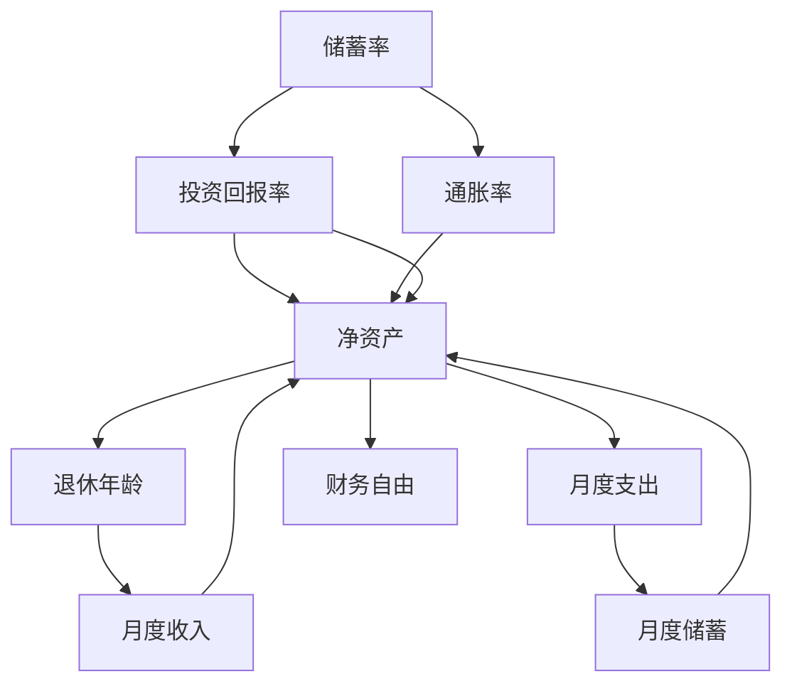

                 

# 程序员的财务自由计算器开发

> 关键词：财务自由计算器, 金融科技, 财务规划, 数据分析, 机器学习

## 1. 背景介绍

在当今社会，程序员作为技术工作者，不仅要面对职场的竞争和技术的更新，还要规划个人的财务未来。许多程序员在实现职业生涯成功的同时，希望尽早实现财务自由。财务自由计算器是一种强大的工具，可以帮助程序员规划和预测他们的财务目标，包括储蓄、投资、退休等方面的财务规划。在本文中，我们将探讨如何开发一个程序员的财务自由计算器，以帮助他们更好地管理财务和实现财务目标。

## 2. 核心概念与联系

### 2.1 核心概念概述

财务自由计算器是一种基于数学模型和算法开发的工具，用于计算个人在特定时间内的财务目标，包括储蓄、投资、退休等方面的规划。它的核心概念包括：

- **储蓄率**：个人收入中用于储蓄的比例。
- **投资回报率**：投资资产在特定时间段内的平均回报率。
- **退休年龄**：个人希望达到退休的年龄。
- **通胀率**：货币购买力的变化率。

这些核心概念相互关联，共同影响个人财务规划的可行性。通过这些概念，财务自由计算器能够帮助用户制定和优化财务计划。

### 2.2 核心概念原理和架构的 Mermaid 流程图



## 3. 核心算法原理 & 具体操作步骤

### 3.1 算法原理概述

财务自由计算器的算法原理基于复利和未来值的计算，其中最重要的公式是复利公式。复利公式用于计算在给定时间内的资产增长，公式为：

$$ FV = PV \times (1 + r)^n $$

其中，$FV$ 表示未来值，$PV$ 表示现值，$r$ 表示回报率，$n$ 表示时间（年）。

财务自由计算器的目标是根据用户设定的储蓄率、投资回报率和退休年龄，计算出实现财务自由所需的时间以及每月需要储蓄的金额。通过这个计算过程，用户可以更好地规划自己的财务目标，并根据计算结果调整储蓄和投资策略。

### 3.2 算法步骤详解

财务自由计算器的开发可以分为以下几个步骤：

**Step 1: 需求分析与设计**

- 确定计算器的功能需求，包括输入数据项、计算逻辑和输出结果。
- 设计用户界面，包括输入框、按钮和输出区域。

**Step 2: 数据处理与预处理**

- 处理用户输入的数据，如储蓄率、投资回报率、退休年龄、月度支出和月度收入等。
- 进行数据验证，确保输入数据的合法性和有效性。

**Step 3: 算法实现与模型构建**

- 实现复利公式计算未来值，根据公式 $FV = PV \times (1 + r)^n$ 计算每月需要储蓄的金额。
- 根据用户设定的退休年龄和每月储蓄金额，计算出达到财务自由所需的时间。

**Step 4: 用户交互与测试**

- 开发用户交互界面，实现数据输入和输出。
- 进行功能测试，确保计算器能够正确计算并输出结果。
- 进行用户体验测试，确保界面直观易用。

**Step 5: 部署与维护**

- 将计算器部署到服务器或云平台上，使其可供用户访问。
- 定期维护和更新计算器，根据最新的金融市场数据和用户反馈进行优化。

### 3.3 算法优缺点

**优点**：

- 简单易懂，易于使用，适合编程初学者。
- 可以提供个性化的财务规划，帮助用户实现财务目标。
- 可以及时更新数据，保持计算结果的准确性。

**缺点**：

- 计算结果的准确性依赖于输入数据的准确性，输入错误可能导致计算结果不准确。
- 需要用户持续关注和调整储蓄和投资策略，才能实现财务自由。
- 可能无法考虑到一些非线性因素，如市场波动、经济危机等。

### 3.4 算法应用领域

财务自由计算器可以广泛应用于个人财务规划、企业财务管理、投资理财等领域。它可以帮助个人或企业制定和优化财务计划，实现财务目标，提高生活质量和财务自由度。

## 4. 数学模型和公式 & 详细讲解 & 举例说明

### 4.1 数学模型构建

财务自由计算器的主要数学模型包括复利公式和未来值的计算公式。以下是对这些公式的详细解释：

**复利公式**：

$$ FV = PV \times (1 + r)^n $$

其中，$FV$ 表示未来值，$PV$ 表示现值，$r$ 表示回报率，$n$ 表示时间（年）。

**未来值计算公式**：

$$ FV = PV \times (1 + r)^n $$

**月度储蓄计算公式**：

$$ PV = \frac{FV}{(1 + r)^n} $$

$$ PV = \frac{FV}{(1 + r)^n} $$

其中，$PV$ 表示现值，$FV$ 表示未来值，$r$ 表示回报率，$n$ 表示时间（年）。

### 4.2 公式推导过程

假设某用户每月储蓄 $S$ 元，储蓄率为 $r$，投资回报率为 $i$，当前年龄为 $t$，退休年龄为 $t_e$，通胀率为 $c$。根据复利公式，用户到退休年龄时的未来值为：

$$ FV = S \times \frac{1-(1+i)^{t_e-t}}{i} $$

其中，$t_e-t$ 表示用户需要储蓄的时间，$i$ 表示投资回报率。

根据未来值公式，每月需要储蓄的金额为：

$$ PV = \frac{FV}{(1+i)^{t_e-t}} $$

将 $FV$ 代入上式，得：

$$ PV = \frac{S \times \frac{1-(1+i)^{t_e-t}}{i}}{(1+i)^{t_e-t}} $$

简化后得：

$$ PV = \frac{S \times (1-(1+i)^{t_e-t})}{i} $$

### 4.3 案例分析与讲解

假设某程序员每月收入为 $8000$ 元，储蓄率为 $30\%$，投资回报率为 $5\%$，当前年龄为 $30$ 岁，希望在 $60$ 岁时退休，通胀率为 $2\%$。

根据上述公式，每月需要储蓄的金额为：

$$ PV = \frac{8000 \times 0.3 \times (1-1.05^{30})}{0.05} $$

计算得：

$$ PV \approx 2000 $$

因此，该程序员每月需要储蓄 $2000$ 元，才能在 $60$ 岁时达到财务自由。

## 5. 项目实践：代码实例和详细解释说明

### 5.1 开发环境搭建

要开发财务自由计算器，需要以下开发环境：

- Python 3.6 及以上版本
- Flask 框架用于开发 Web 应用
- SQL 数据库用于存储用户数据

### 5.2 源代码详细实现

以下是一个简单的 Python Flask 应用示例代码：

```python
from flask import Flask, request, jsonify
from flask_sqlalchemy import SQLAlchemy
from math import pow

app = Flask(__name__)
app.config['SQLALCHEMY_DATABASE_URI'] = 'sqlite:///wf_calculator.db'
db = SQLAlchemy(app)

class User(db.Model):
    id = db.Column(db.Integer, primary_key=True)
    name = db.Column(db.String(50), nullable=False)
    age = db.Column(db.Integer, nullable=False)
    monthly_income = db.Column(db.Float, nullable=False)
    savings_rate = db.Column(db.Float, nullable=False)
    interest_rate = db.Column(db.Float, nullable=False)
    retirement_age = db.Column(db.Integer, nullable=False)
    inflation_rate = db.Column(db.Float, nullable=False)

@app.route('/calculate', methods=['POST'])
def calculate():
    data = request.get_json()
    name = data['name']
    age = data['age']
    monthly_income = data['monthly_income']
    savings_rate = data['savings_rate']
    interest_rate = data['interest_rate']
    retirement_age = data['retirement_age']
    inflation_rate = data['inflation_rate']

    savings = monthly_income * savings_rate
    months = retirement_age - age
    future_value = savings * pow((1 + interest_rate), months) / (interest_rate)

    result = {
        'name': name,
        'savings': savings,
        'future_value': future_value
    }

    return jsonify(result)

if __name__ == '__main__':
    db.create_all()
    app.run(debug=True)
```

### 5.3 代码解读与分析

**User 模型**：
- 定义了一个用户模型，用于存储用户的财务数据。
- 包括姓名、年龄、月收入、储蓄率、投资回报率、退休年龄和通胀率等字段。

**calculate 函数**：
- 定义了一个 `/calculate` 路由，用于处理 POST 请求。
- 从请求体中获取用户输入的财务数据，包括姓名、年龄、月收入、储蓄率、投资回报率、退休年龄和通胀率等。
- 根据公式计算出每月需要储蓄的金额和到退休年龄时的未来值。
- 返回计算结果。

### 5.4 运行结果展示

在 Flask 应用运行后，可以通过 POST 请求向 `/calculate` 路由发送数据，获取计算结果。

## 6. 实际应用场景

财务自由计算器可以应用于多种场景，以下是几个典型的应用场景：

### 6.1 个人财务规划

个人可以使用财务自由计算器来规划自己的财务目标，包括储蓄、投资、退休等方面的规划。通过设置储蓄率和投资回报率，计算器可以计算出每月需要储蓄的金额和达到财务自由所需的时间。

### 6.2 企业财务管理

企业可以使用财务自由计算器来规划企业的财务目标，包括公司储蓄、投资、退休基金等。通过设置储蓄率和投资回报率，计算器可以计算出企业每月需要储蓄的金额和达到财务自由所需的时间。

### 6.3 投资理财

投资者可以使用财务自由计算器来规划自己的投资理财计划，包括股票、基金、房地产等投资方式。通过设置储蓄率和投资回报率，计算器可以计算出每月需要储蓄的金额和达到财务自由所需的时间。

## 7. 工具和资源推荐

### 7.1 学习资源推荐

- Coursera《Python for Data Science》课程：介绍 Python 在数据分析和机器学习中的应用，适合初学者。
- Kaggle《Python Data Science Handbook》：Python 数据科学实战指南，涵盖数据处理、机器学习等内容。
- Flask 官方文档：Flask 框架的官方文档，提供详细的开发指南和示例代码。

### 7.2 开发工具推荐

- PyCharm：Python IDE，提供代码调试、版本控制等功能。
- Jupyter Notebook：用于数据处理和机器学习开发的 Jupyter Notebook 环境。
- SQLAlchemy：Python SQL 数据库工具库，方便开发和维护数据库应用。

### 7.3 相关论文推荐

- "Financial Planning and Analysis: A Primer"：介绍财务规划和分析的基本概念和模型。
- "The Future Value of Money: A Completeness Theory for the Discounted Payoff"：介绍复利和未来值的计算公式。
- "Practical Algorithms for Common Machine Learning Problems"：介绍机器学习算法的基本原理和实现方法。

## 8. 总结：未来发展趋势与挑战

### 8.1 研究成果总结

财务自由计算器作为一种强大的财务规划工具，可以帮助个人和企业更好地规划和管理财务。通过复利公式和未来值的计算，计算器能够提供个性化的财务规划建议，帮助用户实现财务自由。

### 8.2 未来发展趋势

未来，财务自由计算器将会在以下几个方面不断发展：

- 智能化：通过引入机器学习算法，计算器可以根据用户的历史数据和行为，提供更加个性化的财务规划建议。
- 移动化：财务自由计算器将不再局限于网页应用，将开发移动应用，方便用户随时随地访问。
- 集成化：财务自由计算器将与其他财务管理工具和应用集成，形成一个完整的财务管理生态系统。

### 8.3 面临的挑战

尽管财务自由计算器在财务规划中具有重要的作用，但在实际应用中也面临一些挑战：

- 数据安全：用户的财务数据需要严格保护，防止数据泄露和滥用。
- 算法精度：计算器需要保证计算结果的准确性，防止用户因错误计算而遭受财务损失。
- 用户教育：用户需要具备一定的财务知识，才能正确使用计算器进行财务规划。

### 8.4 研究展望

未来的研究将致力于以下几个方面：

- 引入机器学习算法，提高财务规划的智能化水平。
- 开发移动应用，提高用户访问和使用计算器的便利性。
- 引入多模态数据，如股票价格、基金回报率等，提高计算器的计算精度。
- 进行用户教育，提高用户的财务知识和技能，使其更好地使用计算器进行财务规划。

## 9. 附录：常见问题与解答

**Q1: 财务自由计算器如何保证数据安全？**

A: 财务自由计算器需要严格保护用户的财务数据，可以采用以下措施：

- 数据加密：对用户数据进行加密存储，防止数据泄露。
- 访问控制：采用身份验证和授权机制，只有经过认证的用户才能访问和修改数据。
- 数据备份：定期备份用户数据，防止数据丢失和损坏。

**Q2: 如何提高财务自由计算器的算法精度？**

A: 提高财务自由计算器的算法精度需要以下措施：

- 数据校验：对用户输入的数据进行校验，确保数据的合法性和有效性。
- 模型优化：通过不断优化模型和算法，提高计算精度。
- 引入外部数据：引入更多的外部数据，如市场利率、通胀率等，提高计算的准确性。

**Q3: 如何教育用户使用财务自由计算器？**

A: 教育用户使用财务自由计算器需要以下措施：

- 提供用户手册：编写详细的使用手册，帮助用户了解如何使用计算器。
- 提供在线教程：提供在线视频教程和FAQ，帮助用户解决问题。
- 进行用户培训：定期进行用户培训，提高用户的财务知识和技能。

---

作者：禅与计算机程序设计艺术 / Zen and the Art of Computer Programming

