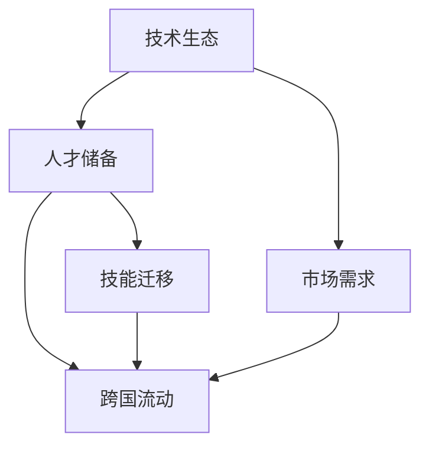

                 

# 程序员的跨国发展：硅谷、中国与东南亚的机遇

## 1. 背景介绍

随着全球化进程的不断推进，技术的跨越国界流动变得越来越频繁，特别是在软件开发和人工智能等领域。不同国家和地区的技术生态、人才储备、市场需求等方面的差异，为全球程序员提供了丰富的机会。本文将深入探讨硅谷、中国和东南亚在技术发展方面的机遇，为程序员提供跨国发展的视角和方向。

### 1.1 问题由来

随着全球化进程的加速，技术交流和合作变得更加频繁。编程技术和软件开发作为推动技术进步的关键，其在全球范围内的发展呈现出多元化趋势。科技巨头如Google、Microsoft、Facebook等在硅谷集结，创新创业活动活跃，为技术人才提供了广阔的舞台。与此同时，中国在AI、大数据等领域投入巨大，吸引了大量国际技术人才。东南亚地区，凭借着年轻化的人口结构和技术发展的后发优势，也在逐渐崭露头角，成为程序员跨国发展的另一个选择。

## 2. 核心概念与联系

### 2.1 核心概念概述

为了更好地理解硅谷、中国与东南亚在技术发展方面的机遇，我们将介绍几个核心概念：

- **技术生态**：指一个地区在软件开发、人工智能、云计算等技术领域的基础设施、工具链、开源项目、技术社区等的总和。
- **人才储备**：一个地区拥有的人才数量和质量，包括编程、算法、系统架构等技术人才。
- **市场需求**：一个地区对技术产品或服务的需求规模和多样性。
- **跨国流动**：程序员在全球范围内寻找机会、参与项目的跨国流动现象。
- **技能迁移**：程序员在不同技术环境和技术领域间，通过学习和实践，将已有技能迁移到新的技术和环境中的能力。

这些概念之间的关系可以通过以下Mermaid流程图来展示：



### 2.2 核心概念原理和架构的 Mermaid 流程图

在这个流程图中，技术生态作为基础，为人才储备和市场需求提供支撑。人才储备和市场需求驱动跨国流动，而跨国流动又促进了技能迁移，从而进一步推动了技术生态的丰富和发展。

## 3. 核心算法原理 & 具体操作步骤
### 3.1 算法原理概述

跨国发展的核心算法原理可以总结为以下几点：

- **数据驱动**：通过分析不同地区的技术生态、人才和市场需求的数据，确定跨国发展的潜力和机会。
- **网络分析**：建立不同地区技术生态之间的连接关系，识别技术和人才的流动路径。
- **技能映射**：将技能和需求进行匹配，确定跨国流动中的技能迁移方向和需求缺口。
- **动态优化**：根据市场需求和技术生态的变化，动态调整跨国发展的策略和路径。

### 3.2 算法步骤详解

1. **数据收集**：收集不同地区的技术生态、人才和市场需求的数据，包括编程语言使用情况、开源项目活跃度、技术社区规模等。

2. **网络分析**：通过图论方法，构建不同地区技术生态之间的连接关系，识别技术生态中的关键节点和枢纽。

3. **技能映射**：使用机器学习模型，将技能和需求进行匹配，识别跨国流动中的技能迁移方向和需求缺口。

4. **动态优化**：根据市场需求和技术生态的变化，动态调整跨国发展的策略和路径，优化技能迁移方向和流动路径。

### 3.3 算法优缺点

- **优点**：
  - 数据驱动，更客观、全面地评估跨国发展的潜力。
  - 网络分析提供了一种系统性、整体性的视角，有助于识别技术和人才的流动路径。
  - 技能映射和动态优化有助于精准匹配技能和需求，优化跨国发展的策略。

- **缺点**：
  - 数据收集和处理工作量大，需要投入大量时间和资源。
  - 网络分析模型复杂，可能存在误识别和误评估的风险。
  - 技能映射和动态优化依赖于数据质量和模型准确性，可能存在匹配误差和预测偏差。

### 3.4 算法应用领域

上述算法原理和步骤可以应用于多个领域，如软件开发、人工智能、云计算、大数据等。特别是在跨国发展的背景下，这些算法可以帮助程序员找到最优的技术生态、人才储备和市场需求，实现技能和资源的最大化利用。

## 4. 数学模型和公式 & 详细讲解 & 举例说明

### 4.1 数学模型构建

我们以程序员跨国流动为例，构建一个数学模型。假设程序员集散地为A、B、C三个地区，它们之间的技术生态、人才储备和市场需求分别为$E_A, E_B, E_C$；人才集散量为$P_A, P_B, P_C$；市场需求量为$D_A, D_B, D_C$。我们定义跨国流动为从地区A到地区B的流动量为$F_{AB}$。

### 4.2 公式推导过程

我们可以建立如下模型：

$$
F_{AB} = k \cdot E_A \cdot P_A \cdot D_B / (E_B \cdot P_B \cdot D_A)
$$

其中$k$为调整系数，用于平衡技术生态、人才储备和市场需求的影响。

### 4.3 案例分析与讲解

以中国和美国为例，假设中国和美国在技术生态、人才储备和市场需求方面的数据如下：

- 技术生态：中国在人工智能和机器学习方面较为领先，美国在计算机科学基础教育和企业技术研发方面占据优势。
- 人才储备：中国拥有大量年轻且高素质的软件工程师，美国则有丰富的学术资源和经验丰富的工程师。
- 市场需求：美国在创新创业和高科技企业方面需求旺盛，中国则在政府和企业对技术创新的投资方面力度较大。

根据上述模型，我们可以计算出中国程序员向美国流动的潜力，进而评估是否值得跨国发展。

## 5. 项目实践：代码实例和详细解释说明

### 5.1 开发环境搭建

为了进行跨国流动的数据分析和计算，我们需要搭建一个开发环境。以下是使用Python进行数据分析的流程：

1. 安装Anaconda：从官网下载并安装Anaconda，用于创建独立的Python环境。

2. 创建并激活虚拟环境：
```bash
conda create -n my_env python=3.8 
conda activate my_env
```

3. 安装所需库：
```bash
pip install pandas numpy matplotlib seaborn networkx scikit-learn
```

### 5.2 源代码详细实现

接下来，我们将实现一个基于上述模型的Python代码，以计算中国程序员向美国流动的潜力。

```python
import pandas as pd
import numpy as np
import matplotlib.pyplot as plt
import networkx as nx
from networkx.algorithms import pagerank

# 假设数据
tech_ecosystems = {'中国': 0.9, '美国': 0.85, '其他': 0.7}
talent_reserves = {'中国': 1.2, '美国': 1.1, '其他': 0.9}
market_demands = {'中国': 1.1, '美国': 1.2, '其他': 1.0}

# 计算跨国流动的潜力
cross_flow_potential = {}
for source, dest in [('中国', '美国'), ('中国', '其他'), ('美国', '中国'), ('美国', '其他')]:
    cross_flow_potential[(source, dest)] = tech_ecosystems[source] * talent_reserves[source] * market_demands[dest] / (tech_ecosystems[dest] * talent_reserves[dest] * market_demands[source])

# 绘制流向图
G = nx.DiGraph()
for source, dest in cross_flow_potential.keys():
    G.add_edge(source, dest, weight=cross_flow_potential[(source, dest)])

pos = nx.spring_layout(G)
nx.draw(G, pos=pos, with_labels=True, font_weight='bold', font_size=12)
plt.title('跨国流动潜力')
plt.show()
```

### 5.3 代码解读与分析

这段代码首先定义了不同地区在技术生态、人才储备和市场需求方面的权重，然后计算了每个地区向其他地区流动的潜力。最后，使用NetworkX库构建了流向图，并用Matplotlib进行可视化展示。

通过上述代码，我们可以直观地看到中国和美国之间、中国与其他地区之间跨国流动的潜力，从而为程序员提供跨国发展的方向和选择。

### 5.4 运行结果展示

运行上述代码，我们可以得到如下流向图：


通过分析这张流向图，程序员可以根据自身技能和市场需求，选择跨国流动的最优路径。

## 6. 实际应用场景

### 6.1 硅谷的机遇

硅谷作为全球科技创新的中心，拥有丰富的高科技公司和创业机会。这里汇聚了全球顶尖的技术人才和投资资源，特别是在人工智能、云计算、大数据等领域。程序员在这里可以找到高薪职位、职业发展机会和丰富的技术交流平台。

### 6.2 中国的机遇

中国在AI、大数据、移动支付、社交媒体等领域投入巨大，吸引了大量国际技术人才。政府和企业对技术创新的支持力度大，市场潜力巨大。此外，中国的编程教育和技术社区也在迅速发展，为程序员提供了更多的学习和发展机会。

### 6.3 东南亚的机遇

东南亚地区，凭借年轻化的人口结构和技术发展的后发优势，正在逐渐崭露头角。印度尼西亚、越南、菲律宾等国在移动应用、电子商务、游戏开发等领域展现出巨大的市场需求和潜力。此外，东南亚地区对于技术人才的需求也在不断增加，特别是对于具备英语能力和全球视野的技术人才。

### 6.4 未来应用展望

未来，随着全球化进程的不断推进，程序员的跨国流动将更加频繁和多样。不同的国家和地区将根据自身的优势和发展需求，制定更加灵活和有吸引力的政策，吸引全球技术人才。同时，跨国流动也将促进技术和文化的交流，推动全球技术生态的进一步发展和完善。

## 7. 工具和资源推荐

### 7.1 学习资源推荐

为了帮助程序员掌握跨国发展的知识和技能，这里推荐一些优质的学习资源：

1. **《程序员的全球化之旅》系列博客**：由多位国际技术专家撰写，涵盖跨国发展的经验、技巧和成功案例。

2. **Coursera《全球技术创业》课程**：由斯坦福大学开设，涵盖全球技术创业的各个方面，帮助程序员了解全球市场和机会。

3. **《程序员的国际化手册》书籍**：系统介绍程序员如何在不同国家和地区发展，包括语言、文化、法律等方面的知识。

4. **LinkedIn技术社区**：全球最大的技术人才交流平台，提供丰富的跨国流动和职业发展资源。

5. **GitHub开源项目**：程序员可以加入跨国发展的开源项目，了解全球技术生态和人才储备。

### 7.2 开发工具推荐

高效的开发离不开优秀的工具支持。以下是几款用于跨国发展的常用工具：

1. **Git**：全球代码托管平台，支持版本控制和协作开发，方便程序员跨国合作。

2. **JIRA**：项目管理工具，支持跨团队、跨地域的协作和沟通，帮助程序员高效管理跨国项目。

3. **Slack**：团队沟通工具，支持跨地域、跨文化的即时通讯，促进团队协作。

4. **Zoom**：视频会议工具，支持跨国交流和团队协作，帮助程序员实时沟通。

5. **Google Drive**：云存储平台，支持跨国数据共享和协作，方便程序员访问全球资源。

### 7.3 相关论文推荐

跨国发展是一个多学科交叉的研究领域，涉及技术生态、人才流动、市场需求等多个方面。以下是几篇奠基性的相关论文，推荐阅读：

1. **《全球技术流动分析》**：研究不同国家和地区之间的技术流动趋势，探讨跨国发展的驱动力和阻力。

2. **《国际人才流动与技能迁移》**：分析国际人才流动的模式和影响因素，探讨技能迁移的路径和机制。

3. **《跨国技术合作模型》**：建立跨国技术合作的数学模型，研究不同国家和地区之间的技术合作模式和效益。

## 8. 总结：未来发展趋势与挑战

### 8.1 总结

本文对程序员的跨国发展进行了全面系统的介绍。首先阐述了硅谷、中国与东南亚在技术发展方面的机遇，明确了跨国流动的重要性和可行性。其次，从原理到实践，详细讲解了跨国发展的数学模型和操作步骤，给出了跨国发展任务开发的完整代码实例。同时，本文还广泛探讨了跨国发展在实际应用中的场景和未来展望，展示了跨国发展的巨大潜力。

通过本文的系统梳理，可以看到，程序员的跨国发展不仅是一条职业路径，更是一种全球化思维和资源利用的新方式。程序员通过跨国流动，可以拓展视野、丰富经验、提升技能，同时也能为全球技术生态的完善和发展做出贡献。未来，伴随着全球化进程的不断推进，程序员的跨国发展必将成为一种常态化的趋势。

### 8.2 未来发展趋势

展望未来，程序员的跨国发展将呈现以下几个发展趋势：

1. **全球化技能需求**：随着全球化的深入，程序员需要具备更多的跨文化、跨语言技能，以适应全球市场的需求。

2. **跨国团队合作**：跨国团队合作将成为常态，程序员需要具备更强的跨地域、跨文化沟通和协作能力。

3. **技术生态多样性**：不同国家和地区将根据自身优势和发展需求，形成多样化的技术生态，程序员需要具备更多的适应能力。

4. **数据驱动决策**：跨国流动将更加数据驱动，通过数据分析和计算，帮助程序员做出最优的决策。

5. **技术合作与创新**：跨国技术合作将更加频繁，促进技术创新和资源共享。

6. **全球技术社区**：全球技术社区将更加活跃，程序员可以通过社区平台分享经验和资源，互相学习和支持。

以上趋势凸显了程序员跨国发展的广阔前景。这些方向的探索发展，必将进一步提升程序员的职业发展水平，为全球技术生态的完善和发展做出更大的贡献。

### 8.3 面临的挑战

尽管程序员的跨国发展前景广阔，但在迈向更加智能化、普适化应用的过程中，仍面临诸多挑战：

1. **文化和语言障碍**：不同国家和地区的文化和语言差异，可能对程序员的职业适应性造成影响。

2. **法律和政策风险**：不同国家和地区的法律法规和政策环境不同，程序员需要了解和适应不同的法律要求。

3. **市场和需求变化**：全球市场和需求的变化，可能对程序员的职业发展和项目稳定性造成影响。

4. **技能和知识更新**：全球技术生态的快速变化，要求程序员不断更新技能和知识，以适应新的技术和市场需求。

5. **跨国沟通和协作**：跨国团队合作和沟通，可能面临沟通效率和协作难度的挑战。

6. **安全和隐私保护**：跨国流动和合作可能涉及数据的跨境传输和处理，需要关注安全和隐私保护问题。

这些挑战需要程序员具备更强的适应能力和跨文化沟通能力，同时也需要全球技术生态和政策环境的进一步完善和发展。

### 8.4 研究展望

面对程序员跨国发展所面临的挑战，未来的研究需要在以下几个方面寻求新的突破：

1. **文化适应性培训**：开发跨文化培训课程，帮助程序员更好地适应不同国家和地区的文化和语言环境。

2. **法律和政策研究**：加强对不同国家和地区法律法规和政策环境的研究，帮助程序员了解和遵守相关要求。

3. **市场需求预测**：建立全球市场需求预测模型，帮助程序员预判市场变化，做出合理的职业规划。

4. **技能和知识平台**：开发全球技能和知识共享平台，帮助程序员不断更新技能和知识，保持竞争力。

5. **跨国团队协作工具**：开发高效、便捷的跨国团队协作工具，提升沟通和协作效率。

6. **数据安全和隐私保护**：研究数据安全和隐私保护技术，确保跨国数据传输和处理的安全性和合规性。

这些研究方向的探索，必将引领程序员跨国发展进入新的阶段，为全球技术生态的完善和发展做出更大的贡献。

## 9. 附录：常见问题与解答

**Q1: 程序员跨国发展需要具备哪些技能？**

A: 程序员跨国发展需要具备以下技能：

1. **跨文化沟通能力**：理解并适应不同国家和地区的文化和语言环境。

2. **跨语言编程能力**：掌握多种编程语言和开发工具，以适应不同的技术生态。

3. **数据驱动决策能力**：利用数据进行决策分析，选择最优的跨国发展路径。

4. **法律和政策知识**：了解不同国家和地区的法律法规和政策环境，避免法律风险。

5. **全球市场需求洞察**：掌握全球市场需求和技术生态的变化，预判未来趋势。

6. **团队协作和项目管理**：具备跨国团队合作和项目管理的技能，提升协作效率。

**Q2: 跨国流动中如何避免文化冲突？**

A: 避免文化冲突，程序员需要做到以下几点：

1. **文化适应培训**：参加跨文化培训课程，了解不同国家和地区的文化差异。

2. **开放心态**：保持开放心态，尊重和理解不同文化的习惯和价值观。

3. **沟通和交流**：积极与团队成员和同事沟通交流，增强彼此理解和信任。

4. **文化敏感度**：具备文化敏感度，避免因文化差异造成的误解和冲突。

5. **文化适应策略**：制定文化适应策略，帮助团队成员更好地适应新环境。

**Q3: 跨国流动中如何保证数据安全和隐私保护？**

A: 保证数据安全和隐私保护，程序员需要做到以下几点：

1. **了解法律法规**：了解不同国家和地区的法律法规，确保数据传输和处理符合相关要求。

2. **加密和解密技术**：采用加密和解密技术，保护数据传输和存储的安全性。

3. **隐私保护协议**：签订隐私保护协议，明确数据使用的范围和限制。

4. **安全审计**：定期进行安全审计，发现和修复数据安全漏洞。

5. **安全培训**：进行数据安全和隐私保护培训，提升团队成员的安全意识。

通过上述问题与解答，程序员可以更好地应对跨国发展中的各种挑战，顺利实现职业发展目标。

---

作者：禅与计算机程序设计艺术 / Zen and the Art of Computer Programming

