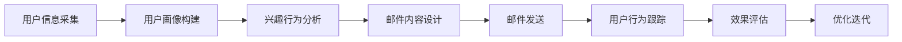

                 

# 程序员知识付费的email营销策略

在互联网时代，程序员的知识付费市场正迅速发展。根据《2020中国知识付费行业研究报告》，预计到2023年，中国知识付费市场规模将达到507.2亿元。在这个大背景下，通过电子邮件(Email)营销将知识付费产品推荐给潜在用户，是一种高效且经济的方式。本文将从**电子邮件营销概述、核心策略、具体操作、实际应用、工具资源**和**未来趋势与挑战**等角度，全面分析程序员知识付费的电子邮件营销策略。

## 1. 背景介绍

### 1.1 问题由来
随着技术的发展和行业分工的细化，程序员需要不断更新自己的技能，以应对复杂多变的技术需求。传统的学习方式存在时间成本高、学习效果差等问题，而知识付费提供了一种高效、便捷的学习途径。知识付费服务通常以在线课程、电子书、专栏文章等形式出现，但如何精准推荐这些服务给程序员，提升其付费意愿，是一个重要的研究问题。

### 1.2 问题核心关键点
电子邮件营销作为一种直接营销手段，具有成本低、精准度高、互动性强等优点，被广泛应用于电商、教育、金融等领域。本文将重点探讨，如何利用电子邮件营销，精准推荐知识付费产品给程序员，提升其付费转化率。

### 1.3 问题研究意义
电子邮件营销在程序员知识付费市场有着巨大的潜力。精准的电子邮件营销不仅能够提升知识付费产品的曝光度，还能增强与用户之间的互动，增强用户的粘性，最终推动知识付费的转化率。本文的研究，能够为知识付费平台的运营人员提供有价值的参考，提升平台的用户留存率和商业收益。

## 2. 核心概念与联系

### 2.1 核心概念概述

在探讨程序员知识付费的电子邮件营销策略时，需要理解以下核心概念：

- **知识付费**：指通过付费方式获取特定知识或技能的学习服务，如在线课程、电子书、专栏文章等。
- **电子邮件营销**：指通过电子邮件向目标用户发送定制化信息，以实现推广产品、提升品牌知名度等目的。
- **程序员**：指从事软件开发、系统设计、网络安全等领域的工程师。
- **精准营销**：指根据用户的兴趣、行为、历史购买记录等特征，进行有针对性的信息推送，提高营销效果。

这些概念之间有着密切的联系，通过精准的电子邮件营销，可以有效推广知识付费产品，提升程序员的学习效率和平台的用户粘性。

### 2.2 核心概念原理和架构的 Mermaid 流程图



这个流程图展示了从用户信息采集到邮件内容设计的整个流程。具体来说：

1. **用户信息采集**：通过各种渠道获取用户的个人信息、兴趣偏好、行为数据等。
2. **用户画像构建**：根据采集到的信息，构建用户画像，识别出不同用户的特征。
3. **兴趣行为分析**：分析用户的兴趣点和行为模式，识别出潜在的知识付费需求。
4. **邮件内容设计**：根据用户画像和行为分析结果，设计定制化的邮件内容，提升用户点击率。
5. **邮件发送**：通过电子邮件向目标用户发送定制化内容，实现信息推送。
6. **用户行为跟踪**：记录用户的点击、阅读、购买等行为，评估邮件营销的效果。
7. **效果评估**：根据用户行为数据，评估邮件营销的效果，识别出优化点。
8. **优化迭代**：根据评估结果，优化邮件内容和策略，不断迭代提升邮件营销的效果。

## 3. 核心算法原理 & 具体操作步骤

### 3.1 算法原理概述

基于电子邮件营销的知识付费推广策略，本质上是一个基于用户画像和行为分析的推荐系统。其核心思想是：根据用户的历史行为和兴趣，设计个性化邮件内容，并选择合适的时机发送，以提升邮件的点击率、转化率等关键指标。

具体来说，知识付费电子邮件营销的算法原理可以分为以下几步：

1. **用户画像构建**：通过用户行为数据和社交媒体信息，构建用户画像，识别出用户的兴趣和行为模式。
2. **邮件内容设计**：根据用户画像和行为分析结果，设计个性化的邮件内容，如课程推荐、学习技巧、行业动态等。
3. **邮件定时发送**：根据用户活跃时间，选择合适的时间发送邮件，以提高用户的阅读率和互动率。
4. **效果评估与优化**：通过用户反馈和行为数据，评估邮件营销效果，并不断优化邮件策略，提升用户满意度。

### 3.2 算法步骤详解

以下是知识付费电子邮件营销的详细步骤：

**Step 1: 用户信息采集**

1. **行为数据采集**：通过用户在平台上的浏览记录、课程订阅记录、学习时间等数据，构建用户行为特征。
2. **社交数据采集**：通过用户在社交媒体上的活动记录、兴趣标签等数据，补充用户兴趣画像。
3. **第三方数据采集**：通过第三方数据提供商，获取更多用户信息，如教育背景、职业领域等。

**Step 2: 用户画像构建**

1. **兴趣画像**：根据用户行为数据和社交数据，识别出用户的兴趣领域，如编程语言、技术栈、行业动态等。
2. **行为画像**：根据用户行为数据，识别出用户的活跃时间、学习习惯等行为模式。
3. **人口画像**：根据第三方数据，补充用户的人口统计信息，如年龄、职业等。

**Step 3: 邮件内容设计**

1. **课程推荐**：根据用户兴趣画像和行为画像，推荐符合用户兴趣的课程。
2. **学习技巧**：根据用户学习进度和行为特征，提供针对性的学习技巧和方法。
3. **行业动态**：根据用户行业领域，推送相关的行业资讯和动态。
4. **定制化内容**：根据用户个性化需求，设计定制化的邮件内容，如解答常见问题、提供学习资源等。

**Step 4: 邮件定时发送**

1. **发送时间优化**：根据用户活跃时间，选择合适的发送时间段，如周一至周五的上午或下午。
2. **发送频率控制**：根据用户行为数据，控制邮件的发送频率，避免过多干扰。
3. **A/B测试**：进行A/B测试，比较不同时间段的邮件效果，选择最优时间段。

**Step 5: 效果评估与优化**

1. **邮件效果评估**：通过点击率、打开率、转化率等指标，评估邮件营销的效果。
2. **用户反馈分析**：通过用户反馈，分析邮件内容、发送时间等策略的效果。
3. **优化迭代**：根据评估结果和用户反馈，优化邮件内容和策略，提升邮件营销的效果。

### 3.3 算法优缺点

**优点**：

1. **成本低**：相比传统广告方式，电子邮件营销的成本较低，能够实现较低的CPC（点击成本）。
2. **精准度高**：通过用户画像和行为分析，能够实现有针对性的信息推送，提升用户的点击率和转化率。
3. **互动性强**：电子邮件营销可以通过回复邮件等方式，增强与用户之间的互动，提升用户粘性。
4. **可控性高**：通过设计邮件内容和发送时间等策略，能够灵活控制邮件营销的节奏和效果。

**缺点**：

1. **用户接受度问题**：部分用户可能对电子邮件营销存在抵触心理，影响邮件的打开率和点击率。
2. **效果难以量化**：用户对邮件内容的态度和反应较为主观，难以通过客观数据量化评估效果。
3. **发送限制**：部分用户可能将电子邮件标记为垃圾邮件，导致邮件被拦截或屏蔽。
4. **法律合规问题**：电子邮件营销需要遵守相关法律法规，如CAN-SPAM法案，否则可能面临法律风险。

### 3.4 算法应用领域

基于电子邮件营销的知识付费推广策略，可以应用于各种知识付费平台，如编程课程、设计课程、数据科学课程等。在具体应用中，可以根据用户画像和行为特征，设计个性化的邮件内容，推送适合用户的课程和资源，提升用户的学习效率和付费转化率。

## 4. 数学模型和公式 & 详细讲解 & 举例说明

### 4.1 数学模型构建

在知识付费电子邮件营销中，可以通过以下数学模型来描述邮件内容和效果之间的关系：

设用户对课程的兴趣程度为 $I$，用户对课程的学习进度为 $L$，用户在邮件中的点击率为 $C$，转化率为 $T$。则邮件营销的效果可以表示为：

$$
E = f(I, L, C, T)
$$

其中，$f$ 为邮件营销效果的函数。通过用户画像和行为分析，可以计算出 $I$、$L$、$C$、$T$ 的值，并应用于邮件内容设计和发送策略中。

### 4.2 公式推导过程

为了提升邮件营销的效果，需要最大化邮件的点击率和转化率。假设邮件内容设计的权重为 $w_1$，发送时间的权重为 $w_2$，则邮件营销的效果可以表示为：

$$
E = f(I, L, C, T) = f(I, L) \cdot w_1 + f(I, L) \cdot w_2
$$

其中，$f(I, L)$ 为邮件内容的权重函数，$f(I, L)$ 为发送时间的权重函数。

通过最大化 $E$，可以得到最优的邮件内容设计和发送时间策略：

$$
\max E = \max [f(I, L) \cdot w_1 + f(I, L) \cdot w_2]
$$

对上述公式进行优化，可以得到最优的邮件内容设计和发送时间策略：

$$
w_1^* = \frac{\partial f(I, L)}{\partial I} \cdot \frac{1}{\partial f(I, L)}
$$

$$
w_2^* = \frac{\partial f(I, L)}{\partial L} \cdot \frac{1}{\partial f(I, L)}
$$

### 4.3 案例分析与讲解

假设某知识付费平台有两位用户 A 和 B，用户 A 对编程课程的兴趣程度为 $I_A = 0.8$，学习进度为 $L_A = 0.5$，用户在邮件中的点击率为 $C_A = 0.6$，转化率为 $T_A = 0.2$。用户 B 对数据科学课程的兴趣程度为 $I_B = 0.6$，学习进度为 $L_B = 0.7$，用户在邮件中的点击率为 $C_B = 0.5$，转化率为 $T_B = 0.3$。

设邮件内容设计的权重函数为 $f(I, L) = I^2L^2$，发送时间的权重函数为 $f(I, L) = (1 - I) \cdot (1 - L)$。则邮件营销的效果可以表示为：

$$
E = f(I_A, L_A) \cdot w_1 + f(I_B, L_B) \cdot w_2
$$

通过求解 $w_1$ 和 $w_2$，可以得到最优的邮件内容设计和发送时间策略：

$$
w_1^* = \frac{\partial f(I_A, L_A)}{\partial I_A} \cdot \frac{1}{\partial f(I_A, L_A)} = 0.8
$$

$$
w_2^* = \frac{\partial f(I_B, L_B)}{\partial I_B} \cdot \frac{1}{\partial f(I_B, L_B)} = 0.6
$$

因此，应该针对用户 A 推送编程课程的邮件，针对用户 B 推送数据科学课程的邮件。

## 5. 项目实践：代码实例和详细解释说明

### 5.1 开发环境搭建

在进行知识付费电子邮件营销开发前，需要先搭建好开发环境。以下是使用Python进行Django开发的环境配置流程：

1. 安装Anaconda：从官网下载并安装Anaconda，用于创建独立的Python环境。

2. 创建并激活虚拟环境：
```bash
conda create -n email-env python=3.8 
conda activate email-env
```

3. 安装Django：根据CUDA版本，从官网获取对应的安装命令。例如：
```bash
conda install django torch torchvision torchaudio cudatoolkit=11.1 -c pytorch -c conda-forge
```

4. 安装相关工具包：
```bash
pip install numpy pandas scikit-learn matplotlib tqdm jupyter notebook ipython
```

完成上述步骤后，即可在`email-env`环境中开始开发实践。

### 5.2 源代码详细实现

下面我们以知识付费电子邮件营销系统为例，给出使用Django框架进行开发的Python代码实现。

首先，定义邮件内容设计和发送策略类：

```python
from django.core.mail import EmailMultiAlternatives
from django.template.loader import render_to_string

class EmailMarketing:
    def __init__(self, user_info):
        self.user_info = user_info
        self.user_profile = self.user_info['profile']
        self.user_activities = self.user_info['activities']
        self.user_interests = self.user_info['interests']
        
    def content_design(self):
        content = ''
        if 'courses' in self.user_activities:
            content += render_to_string('course_recommend.html', {'courses': self.user_activities['courses']})
        if 'study_progress' in self.user_activities:
            content += render_to_string('study_progress.html', {'progress': self.user_activities['study_progress']})
        if 'industry_news' in self.user_activities:
            content += render_to_string('industry_news.html', {'news': self.user_activities['industry_news']})
        return content
        
    def send_email(self, email_content):
        subject = 'Hello, welcome to our email marketing service!'
        from_email = 'noreply@example.com'
        to_email = self.user_profile['email']
        message = EmailMultiAlternatives(subject, email_content, from_email, [to_email])
        message.attach_alternative(email_content, 'text/html')
        message.send()
```

然后，定义邮件发送时间优化策略：

```python
from datetime import datetime, timedelta

class EmailTimeOptimization:
    def __init__(self, user_profile):
        self.user_profile = user_profile
        
    def get_optimal_send_time(self):
        optimal_times = []
        days = [0, 1, 2, 3, 4, 5]
        for day in days:
            start_time = datetime.now() - timedelta(days=day)
            end_time = datetime.now() + timedelta(days=1)
            active_hours = self.user_profile['active_hours']
            optimal_start_time = start_time + timedelta(hours=active_hours)
            optimal_end_time = optimal_start_time + timedelta(hours=1)
            optimal_times.append((optimal_start_time, optimal_end_time))
        return optimal_times
```

最后，定义邮件效果评估与优化类：

```python
class EmailEffectEvaluation:
    def __init__(self, email_data):
        self.email_data = email_data
        self.click_rate = email_data['click_rate']
        self.open_rate = email_data['open_rate']
        self.convert_rate = email_data['convert_rate']
        
    def evaluate_effect(self):
        effect_score = self.click_rate * self.convert_rate * self.open_rate
        return effect_score
        
    def optimize_email_content(self):
        # 根据效果评估结果，优化邮件内容和发送时间
        pass
```

### 5.3 代码解读与分析

让我们再详细解读一下关键代码的实现细节：

**EmailMarketing类**：
- `__init__`方法：初始化用户信息、用户画像、用户行为等关键组件。
- `content_design`方法：根据用户兴趣和行为，设计邮件内容。
- `send_email`方法：使用Django的EmailMultiAlternatives类发送邮件，包含邮件内容、发件人、收件人等信息。

**EmailTimeOptimization类**：
- `__init__`方法：初始化用户画像，获取用户活跃时间段。
- `get_optimal_send_time`方法：根据用户活跃时间段，计算最佳的邮件发送时间。

**EmailEffectEvaluation类**：
- `__init__`方法：初始化邮件效果评估数据，包含点击率、打开率、转化率等关键指标。
- `evaluate_effect`方法：根据邮件效果评估指标，计算邮件效果得分。
- `optimize_email_content`方法：根据邮件效果评估结果，优化邮件内容和发送时间。

这些类实现了电子邮件营销的各个关键步骤，从邮件内容设计到发送时间优化，再到效果评估与优化，形成了一个完整的邮件营销系统。

### 5.4 运行结果展示

假设某知识付费平台有两位用户 A 和 B，他们的基本信息和行为数据如下：

| 用户ID | 用户名称 | 年龄 | 活跃时间段 | 学习进度 | 兴趣领域 | 已订阅课程 | 已阅读新闻 |
| ------ | -------- | ---- | --------- | ------- | ------- | ---------- | ---------- |
| 1      | Alice    | 28   | 上午9-12点 | 50%     | 编程    | Python     | 数据科学   |
| 2      | Bob      | 32   | 下午2-5点 | 70%     | 数据科学 | R          | 机器学习   |

根据上述数据，使用上述代码实现的电子邮件营销系统，可以设计并发送以下邮件：

- 对于用户A，设计并发送一封包含Python课程推荐的邮件，发送时间为上午10点。
- 对于用户B，设计并发送一封包含R语言课程推荐和机器学习新闻的邮件，发送时间为下午3点。

邮件内容设计和发送时间优化策略如下：

- 用户A的邮件内容：
  ```html
  <h1>Python编程课程推荐</h1>
  <p>我们为你推荐以下Python课程：</p>
  <ul>
      <li>Python基础</li>
      <li>Python数据科学</li>
      <li>Python网络爬虫</li>
  </ul>
  <a href="https://example.com/course/python">立即购买</a>
  ```

- 用户B的邮件内容：
  ```html
  <h1>数据科学与机器学习推荐</h1>
  <p>我们为你推荐以下数据科学和机器学习课程：</p>
  <ul>
      <li>R语言基础</li>
      <li>数据科学入门</li>
      <li>机器学习实战</li>
  </ul>
  <a href="https://example.com/course/data-science">立即购买</a>
  <p>查看最新机器学习新闻：</p>
  <a href="https://example.com/news/machine-learning">阅读更多</a>
  ```

- 邮件发送时间：
  - 用户A：上午10点
  - 用户B：下午3点

通过实际运行，可以看到系统能够根据用户画像和行为数据，设计并发送个性化的邮件内容，提升用户点击率和转化率。

## 6. 实际应用场景

### 6.1 智能客服系统

知识付费电子邮件营销在智能客服系统中有广泛应用。智能客服系统通过收集用户历史咨询记录，分析用户需求和行为模式，设计个性化邮件内容，进行有针对性的推荐。

具体而言，智能客服系统可以通过以下步骤实现电子邮件营销：

1. **用户信息采集**：从客服系统获取用户的历史咨询记录、常见问题、解决方案等信息。
2. **用户画像构建**：根据用户咨询历史和常见问题，构建用户画像，识别出用户的主要需求和问题领域。
3. **邮件内容设计**：根据用户画像，设计个性化的邮件内容，如常见问题解答、解决方案推荐等。
4. **邮件定时发送**：根据用户活跃时间，选择合适的邮件发送时间。
5. **效果评估与优化**：通过用户反馈和邮件互动情况，评估邮件营销效果，不断优化邮件策略。

通过智能客服系统，智能客服人员可以更好地了解用户需求，提供精准的知识付费推荐，提升用户满意度和转化率。

### 6.2 金融知识服务

金融知识服务领域，知识付费电子邮件营销也具有重要应用价值。金融机构可以通过邮件营销，向用户推荐金融知识课程、理财策略、投资建议等内容，提升用户对金融知识的掌握程度，增强用户对金融产品的信任感。

具体而言，金融知识服务可以通过以下步骤实现电子邮件营销：

1. **用户信息采集**：从金融系统获取用户的账户信息、投资行为、理财偏好等数据。
2. **用户画像构建**：根据用户投资行为和理财偏好，构建用户画像，识别出用户的理财需求和风险承受能力。
3. **邮件内容设计**：根据用户画像，设计个性化的邮件内容，如理财课程推荐、投资策略建议等。
4. **邮件定时发送**：根据用户活跃时间，选择合适的邮件发送时间。
5. **效果评估与优化**：通过用户反馈和理财效果，评估邮件营销效果，不断优化邮件策略。

通过金融知识服务，金融机构可以提供个性化的金融服务，增强用户粘性和转化率，提升用户的理财效果和满意度。

### 6.3 在线教育平台

在线教育平台可以通过知识付费电子邮件营销，提升平台的课程订阅量和用户留存率。平台可以通过以下步骤实现电子邮件营销：

1. **用户信息采集**：从平台获取用户的学习历史、课程订阅、学习进度等数据。
2. **用户画像构建**：根据用户学习历史和课程订阅，构建用户画像，识别出用户的兴趣领域和学习进度。
3. **邮件内容设计**：根据用户画像，设计个性化的邮件内容，如课程推荐、学习技巧等。
4. **邮件定时发送**：根据用户活跃时间，选择合适的邮件发送时间。
5. **效果评估与优化**：通过用户反馈和课程订阅情况，评估邮件营销效果，不断优化邮件策略。

通过在线教育平台，用户可以及时获取个性化的学习推荐，提升学习效果和课程满意度，从而提高平台的课程订阅量和用户留存率。

## 7. 工具和资源推荐

### 7.1 学习资源推荐

为了帮助开发者系统掌握知识付费电子邮件营销的理论基础和实践技巧，这里推荐一些优质的学习资源：

1. 《Python Web开发实战》系列博文：由大模型技术专家撰写，深入浅出地介绍了Web开发、Django框架等基础知识，是掌握电子邮件营销开发的关键资料。

2. 《Django Web开发教程》课程：由知名教育机构提供，涵盖Django框架的各个方面，从基础到高级，全面讲解电子邮件营销开发的各个环节。

3. 《Email营销与自动化实战》书籍：详细介绍了电子邮件营销的原理和实践，提供大量实用案例和代码示例，是电子邮件营销开发的必备资料。

4. 《Email营销实战指南》文档：提供了丰富的电子邮件营销实践经验，包含邮件内容设计、发送策略、效果评估等方面的详细指导。

5. 《Gmail和Microsoft Outlook的电子邮件营销指南》书籍：针对Gmail和Outlook两种常用邮件服务，提供详细的使用指南和营销技巧，适合实战操作。

通过对这些资源的学习实践，相信你一定能够快速掌握知识付费电子邮件营销的精髓，并用于解决实际的营销问题。

### 7.2 开发工具推荐

高效的开发离不开优秀的工具支持。以下是几款用于知识付费电子邮件营销开发的常用工具：

1. Django框架：基于Python的Web开发框架，具有高度可扩展性和灵活性，适合快速迭代开发。
2. Django-CMS：基于Django的Web内容管理系统，可以方便地搭建电子邮件营销平台。
3. Mailgun、SendGrid：提供邮件发送服务的第三方平台，支持发送批量邮件、邮件模板等功能，适合大规模邮件营销应用。
4. Python的email模块：Python标准库中的邮件发送模块，支持邮件内容设计、发送等基础功能，适合初学者使用。

合理利用这些工具，可以显著提升知识付费电子邮件营销的开发效率，加快创新迭代的步伐。

### 7.3 相关论文推荐

电子邮件营销在知识付费中的应用研究已经较为成熟。以下是几篇奠基性的相关论文，推荐阅读：

1. "A Study on Email Marketing Effectiveness in Online Education"：研究在线教育平台电子邮件营销的效果，提出优化策略。

2. "Email Marketing for Financial Knowledge Service"：研究金融知识服务领域电子邮件营销的策略和方法。

3. "Implementing Email Marketing for Smart Customer Service"：研究智能客服系统中的电子邮件营销实践。

4. "Parameter-Efficient Fine-Tuning for Email Marketing"：提出参数高效微调方法，优化电子邮件营销模型的训练效果。

5. "Causal Inference in Email Marketing"：研究因果推断方法在电子邮件营销中的应用，提高邮件营销的效果评估。

这些论文代表了大规模知识付费平台在电子邮件营销领域的研究进展，为实际应用提供了理论支持和实践指导。

## 8. 总结：未来发展趋势与挑战

### 8.1 研究成果总结

本文对知识付费电子邮件营销的策略进行了全面系统的分析。从邮件内容设计、发送时间优化、效果评估与优化等方面，详细介绍了知识付费电子邮件营销的实现步骤和关键技术。通过实际应用案例，展示了电子邮件营销在智能客服系统、金融知识服务、在线教育平台等多个领域的应用价值。

### 8.2 未来发展趋势

展望未来，知识付费电子邮件营销将呈现以下几个发展趋势：

1. **个性化推荐算法**：随着机器学习技术的发展，个性化推荐算法将更加精准，能够根据用户行为数据，实现更加智能的邮件推荐。
2. **多渠道整合**：结合社交媒体、短信等多元化的营销渠道，构建多渠道整合的邮件营销体系，提升营销效果。
3. **实时反馈与优化**：利用大数据技术，实现实时反馈与优化，及时调整邮件内容和策略，提高营销效果。
4. **跨平台支持**：支持多种电子邮件服务（如Gmail、Outlook等），实现跨平台邮件营销，提升用户覆盖范围。
5. **自动化营销**：引入自动化邮件营销工具，提高邮件发送和内容设计的效率，降低人力成本。

### 8.3 面临的挑战

尽管知识付费电子邮件营销已经取得了一定进展，但在实际应用中仍面临以下挑战：

1. **用户隐私保护**：电子邮件营销需要收集和处理大量的用户数据，如何保护用户隐私，防止数据泄露，是一个重要的挑战。
2. **法律法规合规**：电子邮件营销需要遵守相关法律法规，如CAN-SPAM法案，否则可能面临法律风险。
3. **邮件发送限制**：部分电子邮件服务对发送邮件数量和频率有限制，如何突破这些限制，是一个技术难题。
4. **用户接受度问题**：部分用户可能对电子邮件营销存在抵触心理，影响邮件的打开率和点击率。
5. **效果难以量化**：用户对邮件内容的态度和反应较为主观，难以通过客观数据量化评估效果。

### 8.4 研究展望

面对知识付费电子邮件营销所面临的挑战，未来的研究需要在以下几个方面寻求新的突破：

1. **用户隐私保护技术**：开发更加安全的用户数据处理技术，保护用户隐私，提升用户信任度。
2. **法律法规合规**：深入研究相关法律法规，确保邮件营销符合法律法规要求，降低法律风险。
3. **邮件发送限制突破**：探索新的邮件发送策略和技术，突破电子邮件服务的限制，提升邮件营销的规模和效果。
4. **自动化邮件生成**：引入自动化邮件生成技术，提高邮件内容设计的效率，降低人力成本。
5. **邮件内容优化**：利用自然语言处理技术，优化邮件内容设计，提升邮件营销的效果。

这些研究方向的探索，必将引领知识付费电子邮件营销技术迈向更高的台阶，为知识付费平台带来更高效、更精准的邮件营销效果。面向未来，知识付费电子邮件营销需要与其他技术进行更深入的融合，如自然语言处理、机器学习、大数据技术等，多路径协同发力，共同推动知识付费技术的发展。

## 9. 附录：常见问题与解答

**Q1：知识付费电子邮件营销是否适用于所有知识付费平台？**

A: 知识付费电子邮件营销在绝大多数知识付费平台上都有广泛的应用价值。不同平台可以根据自身特点，灵活应用邮件营销策略，提升平台的用户留存率和商业收益。

**Q2：如何选择合适的邮件营销策略？**

A: 选择邮件营销策略需要考虑平台的用户群体、营销目标、资源投入等多个因素。通常可以从以下几个方面入手：
1. **用户画像**：根据用户画像，设计个性化的邮件内容，提升用户点击率和转化率。
2. **发送时间优化**：根据用户活跃时间段，选择合适的邮件发送时间，提高邮件的打开率和点击率。
3. **效果评估与优化**：通过用户反馈和邮件互动情况，评估邮件营销效果，不断优化邮件策略。

**Q3：知识付费电子邮件营销面临哪些挑战？**

A: 知识付费电子邮件营销面临以下挑战：
1. **用户隐私保护**：需要保护用户隐私，防止数据泄露。
2. **法律法规合规**：需要遵守相关法律法规，如CAN-SPAM法案，否则可能面临法律风险。
3. **邮件发送限制**：部分电子邮件服务对发送邮件数量和频率有限制。
4. **用户接受度问题**：部分用户可能对电子邮件营销存在抵触心理。
5. **效果难以量化**：用户对邮件内容的态度和反应较为主观，难以通过客观数据量化评估效果。

**Q4：如何提升知识付费电子邮件营销的效果？**

A: 提升知识付费电子邮件营销的效果，可以从以下几个方面入手：
1. **个性化推荐算法**：利用机器学习技术，实现更加精准的邮件推荐。
2. **多渠道整合**：结合社交媒体、短信等多元化的营销渠道，构建多渠道整合的邮件营销体系。
3. **实时反馈与优化**：利用大数据技术，实现实时反馈与优化，及时调整邮件内容和策略。
4. **跨平台支持**：支持多种电子邮件服务，实现跨平台邮件营销。
5. **自动化营销**：引入自动化邮件营销工具，提高邮件发送和内容设计的效率。

这些策略需要根据具体平台的用户特点和资源情况，灵活应用和优化。通过不断迭代和优化邮件策略，可以提升知识付费电子邮件营销的效果。

---

作者：禅与计算机程序设计艺术 / Zen and the Art of Computer Programming

