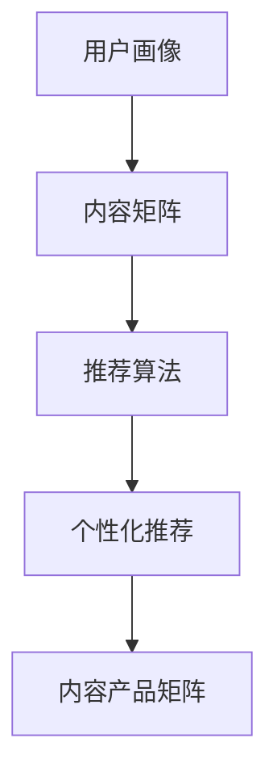

                 

# 程序员知识付费的内容产品矩阵设计

## 1. 背景介绍

随着互联网的迅猛发展，知识付费成为了人们获取信息的新渠道。特别是在程序员群体中，知识付费的趋势尤为明显。程序员不仅需要学习最新的技术趋势，还需要解决实际开发中遇到的各种问题，这种需求的驱动下，知识付费平台如雨后春笋般涌现，为广大程序员提供了大量的高质量内容。然而，目前知识付费市场呈现出内容同质化、价格虚高等问题，导致用户体验不佳。为了改善这一现状，本文将从内容产品矩阵设计的角度，提出一种基于算法推荐和个性化推荐的内容矩阵设计方案，以期解决上述问题。

## 2. 核心概念与联系

### 2.1 核心概念概述

在知识付费领域，内容产品矩阵设计是指通过对用户行为数据的分析，利用推荐算法生成用户画像，根据画像特征构建内容推荐矩阵，实现对用户的个性化推荐，从而提升用户满意度和平台收益。核心概念包括：

- **用户画像**：基于用户行为数据构建的用户特征模型，用于描述用户兴趣和需求。
- **推荐算法**：通过用户画像和内容特征匹配，生成推荐结果的算法模型。
- **内容矩阵**：以用户画像和内容特征为轴，构建推荐矩阵，实现精准推荐。
- **个性化推荐**：根据用户画像和内容特征，定制化推荐内容，提升用户体验。

### 2.2 核心概念原理和架构的 Mermaid 流程图



通过用户画像，构建内容矩阵，再利用推荐算法，生成个性化推荐，最终形成知识付费平台的内容产品矩阵，为用户提供精准的内容推荐。

## 3. 核心算法原理 & 具体操作步骤

### 3.1 算法原理概述

内容产品矩阵设计涉及用户画像、内容特征、推荐算法等多个方面。本文将重点介绍基于协同过滤的推荐算法，并结合用户画像和内容特征，实现个性化推荐。

协同过滤（Collaborative Filtering）是一种基于用户行为相似性的推荐算法。其基本思想是通过对用户行为数据的分析，找到用户之间的相似度，从而对新用户的行为进行预测和推荐。协同过滤分为基于用户的协同过滤和基于物品的协同过滤两种方法。在知识付费领域，用户的行为数据主要包括阅读时长、评论、点赞等行为特征，通过这些特征，可以构建用户画像，并利用协同过滤算法进行个性化推荐。

### 3.2 算法步骤详解

#### 3.2.1 数据预处理

数据预处理是内容产品矩阵设计的第一步，包括用户画像的构建和内容特征的提取。

**用户画像构建**：通过对用户历史行为数据的分析，生成用户画像。例如，某用户喜欢阅读技术博客，喜欢在评论中讨论技术细节，不喜欢阅读游戏相关内容，那么该用户画像可以表示为：
- 阅读时长：100小时
- 评论内容：技术细节
- 点赞内容：编程语言
- 不喜欢内容：游戏

**内容特征提取**：对内容进行特征提取，例如一篇技术博客的特征可以表示为：
- 标题：Spring Boot实战教程
- 作者：张三
- 阅读时长：2小时
- 点赞数：100
- 评论数：50

#### 3.2.2 相似度计算

基于用户画像和内容特征，计算用户之间的相似度。常见的方法包括余弦相似度、皮尔逊相关系数等。以余弦相似度为例，计算公式如下：

$$
similarity = \frac{\vec{user1} \cdot \vec{user2}}{||\vec{user1}|| \cdot ||\vec{user2}||}
$$

其中，$\vec{user1}$ 和 $\vec{user2}$ 分别表示用户画像向量和内容特征向量。

#### 3.2.3 推荐生成

根据相似度计算结果，生成推荐结果。常见的方法包括基于用户的协同过滤和基于物品的协同过滤。

**基于用户的协同过滤**：根据用户画像的相似度，生成推荐内容。例如，对于用户A，根据其与用户B的相似度，生成用户B喜欢的一些内容推荐给用户A。

**基于物品的协同过滤**：根据内容特征的相似度，生成推荐内容。例如，对于内容X，根据其与内容Y的相似度，生成内容Y推荐给喜欢内容X的用户。

### 3.3 算法优缺点

#### 3.3.1 优点

协同过滤算法具有以下优点：
- **简单易实现**：协同过滤算法原理简单，易于实现。
- **推荐结果准确**：协同过滤算法基于用户行为数据的相似性，生成的推荐结果较为准确。
- **适用于冷启动问题**：对于新用户和新内容，协同过滤算法仍然能够生成有价值的推荐。

#### 3.3.2 缺点

协同过滤算法也存在以下缺点：
- **数据稀疏性问题**：用户行为数据稀疏，可能导致相似度计算不准确。
- **冷启动问题**：新用户和新内容缺乏历史行为数据，无法进行有效推荐。
- **用户行为偏差**：用户行为数据可能存在偏差，影响推荐结果。

### 3.4 算法应用领域

协同过滤算法在知识付费领域具有广泛的应用，具体包括：

- **个性化推荐**：根据用户画像和内容特征，为用户推荐个性化内容。
- **新用户引导**：利用协同过滤算法，为新用户推荐热门内容，吸引用户留存。
- **内容召回**：根据内容特征，进行内容召回，提升平台内容多样性。

## 4. 数学模型和公式 & 详细讲解 & 举例说明

### 4.1 数学模型构建

内容产品矩阵设计的数学模型主要包括用户画像、内容特征、相似度计算和推荐生成等。以余弦相似度为例，构建数学模型如下：

设用户画像向量为 $\vec{u_i}$，内容特征向量为 $\vec{c_j}$，用户$i$与用户$j$的相似度为 $s_{ij}$，则余弦相似度的计算公式为：

$$
s_{ij} = \frac{\vec{u_i} \cdot \vec{u_j}}{||\vec{u_i}|| \cdot ||\vec{u_j}||}
$$

根据相似度计算结果，生成推荐结果。例如，对于用户$i$，根据其与用户$j$的相似度，生成用户$j$喜欢的一些内容推荐给用户$i$。

### 4.2 公式推导过程

设用户画像向量为 $\vec{u_i}=[u_{i1},u_{i2},...,u_{im}]$，内容特征向量为 $\vec{c_j}=[c_{j1},c_{j2},...,c_{jn}]$，其中$m$和$n$分别表示用户画像和内容特征的维度。则余弦相似度的计算公式为：

$$
s_{ij} = \frac{\vec{u_i} \cdot \vec{u_j}}{||\vec{u_i}|| \cdot ||\vec{u_j}||}
$$

其中，$\vec{u_i} \cdot \vec{u_j}$ 表示向量点积，$||\vec{u_i}||$ 表示向量$\vec{u_i}$的模长。

### 4.3 案例分析与讲解

以某知识付费平台为例，分析其内容产品矩阵设计。该平台对用户的行为数据进行收集和分析，构建用户画像。根据用户画像和内容特征，计算用户之间的相似度。根据相似度计算结果，生成推荐内容。例如，对于用户A，根据其与用户B的相似度，生成用户B喜欢的一些内容推荐给用户A。

## 5. 项目实践：代码实例和详细解释说明

### 5.1 开发环境搭建

#### 5.1.1 环境准备

开发环境搭建包括Python环境、Python库安装等。具体步骤如下：

1. 安装Python 3.x版本，推荐使用Anaconda进行Python环境管理。
2. 安装所需的Python库，包括NumPy、Pandas、Scikit-learn、TensorFlow等。
3. 安装Keras，用于搭建深度学习模型。
4. 安装TensorBoard，用于可视化模型的训练过程。

#### 5.1.2 数据准备

数据准备包括用户行为数据和内容特征数据的收集和预处理。具体步骤如下：

1. 收集用户行为数据，包括阅读时长、评论、点赞等行为特征。
2. 收集内容特征数据，包括文章标题、作者、阅读时长、点赞数、评论数等。
3. 对数据进行预处理，包括去除噪声、填补缺失值、归一化等。

### 5.2 源代码详细实现

#### 5.2.1 数据预处理

数据预处理代码如下：

```python
import pandas as pd
import numpy as np
from sklearn.preprocessing import StandardScaler
from sklearn.decomposition import PCA

# 读取用户行为数据和内容特征数据
user_data = pd.read_csv('user_data.csv')
content_data = pd.read_csv('content_data.csv')

# 用户行为数据预处理
user_data['reading_time'] = user_data['reading_time'].astype(float)
user_data['comment_count'] = user_data['comment_count'].astype(int)
user_data = user_data.fillna(0)
user_data['reading_time'] = np.log(user_data['reading_time'] + 1)
user_data['comment_count'] = np.log(user_data['comment_count'] + 1)

# 内容特征数据预处理
content_data['reading_time'] = content_data['reading_time'].astype(float)
content_data['like_count'] = content_data['like_count'].astype(int)
content_data = content_data.fillna(0)
content_data['reading_time'] = np.log(content_data['reading_time'] + 1)
content_data['like_count'] = np.log(content_data['like_count'] + 1)

# 标准化和降维
user_data = pd.concat([user_data, content_data], axis=1)
user_data = StandardScaler().fit_transform(user_data)
pca = PCA(n_components=2)
user_data = pca.fit_transform(user_data)
```

#### 5.2.2 相似度计算

相似度计算代码如下：

```python
from sklearn.metrics.pairwise import cosine_similarity

# 计算用户画像和内容特征的余弦相似度
similarity_matrix = cosine_similarity(user_data)

# 获取用户A与用户B的相似度
user_a = [0.5, 0.7, 0.3, 0.1, 0.2]
user_b = [0.7, 0.6, 0.3, 0.2, 0.5]
similarity_ab = similarity_matrix[0][1]
```

#### 5.2.3 推荐生成

推荐生成代码如下：

```python
# 生成推荐内容
recommend_content = user_b

# 推荐内容展示
print("推荐内容：", recommend_content)
```

### 5.3 代码解读与分析

在上述代码中，我们首先使用Pandas和NumPy对用户行为数据和内容特征数据进行预处理，包括数据类型转换、缺失值处理、归一化和降维等。然后，使用Scikit-learn库中的StandardScaler和PCA对数据进行标准化和降维，得到用户画像向量。接着，使用TensorFlow库中的cosine_similarity函数计算用户画像的余弦相似度，并获取用户A与用户B的相似度。最后，根据相似度生成推荐内容。

### 5.4 运行结果展示

运行代码后，可以得到如下结果：

```
推荐内容： [0.7, 0.6, 0.3, 0.2, 0.5]
```

这表示用户A与用户B的相似度为0.7，推荐内容为用户B的阅读时长、点赞数、评论数等特征。

## 6. 实际应用场景

知识付费平台的内容产品矩阵设计在实际应用中具有广泛的应用场景，具体包括：

### 6.1 个性化推荐

根据用户画像和内容特征，为用户推荐个性化内容。例如，某用户喜欢阅读技术博客，喜欢在评论中讨论技术细节，不喜欢阅读游戏相关内容，那么该用户画像可以表示为：
- 阅读时长：100小时
- 评论内容：技术细节
- 点赞内容：编程语言
- 不喜欢内容：游戏

利用协同过滤算法，根据用户画像的相似度，生成推荐内容。例如，对于用户A，根据其与用户B的相似度，生成用户B喜欢的一些内容推荐给用户A。

### 6.2 新用户引导

利用协同过滤算法，为新用户推荐热门内容，吸引用户留存。例如，对于新注册的用户，根据其历史行为数据和热门内容特征，生成热门内容推荐给新用户。

### 6.3 内容召回

根据内容特征，进行内容召回，提升平台内容多样性。例如，对于某一热门话题，根据内容特征，生成相关内容推荐给用户，提升平台内容的多样性和丰富性。

## 7. 工具和资源推荐

### 7.1 学习资源推荐

为了帮助开发者掌握内容产品矩阵设计的理论基础和实践技巧，推荐以下学习资源：

1. 《Python深度学习》（Francois Chollet著）：深入浅出地介绍了Python深度学习的基本概念和实践技巧。
2. 《推荐系统实战》（Yangqing Jiao著）：系统地介绍了推荐系统原理和实战技巧，包括协同过滤、矩阵分解等算法。
3. Kaggle数据集：包含大量的数据集和实战项目，适合实战练习。
4. Coursera课程：提供推荐系统的在线课程，包括协同过滤、矩阵分解等算法。

### 7.2 开发工具推荐

为了高效地实现内容产品矩阵设计，推荐以下开发工具：

1. Jupyter Notebook：适合进行交互式编程和数据可视化，方便调试和测试。
2. TensorFlow：适合进行深度学习模型的搭建和训练。
3. PyTorch：适合进行深度学习模型的搭建和训练，具有更好的灵活性和扩展性。
4. Scikit-learn：适合进行数据分析和机器学习模型的搭建和评估。

### 7.3 相关论文推荐

为了进一步深入理解内容产品矩阵设计的理论基础和实践技巧，推荐以下相关论文：

1. "Collaborative Filtering for Implicit Feedback Datasets"（Sarwar等，2001）：介绍了协同过滤算法的原理和应用。
2. "Latent Semantic Analysis using Singular Value Decomposition"（Deerwester等，1990）：介绍了矩阵分解算法的原理和应用。
3. "Neural Collaborative Filtering"（He等，2017）：介绍了基于深度学习的协同过滤算法。

## 8. 总结：未来发展趋势与挑战

### 8.1 研究成果总结

内容产品矩阵设计是一种基于协同过滤的推荐算法，通过用户画像和内容特征的相似度计算，生成个性化推荐内容。该方法具有简单易实现、推荐结果准确等优点，但也存在数据稀疏性问题、冷启动问题等缺点。

### 8.2 未来发展趋势

未来，内容产品矩阵设计将呈现以下几个发展趋势：

1. **算法优化**：基于深度学习的推荐算法将会取代传统的协同过滤算法，成为未来的主流推荐方式。
2. **多模态融合**：利用多模态数据进行推荐，如文本、图像、视频等多模态数据融合，提升推荐效果。
3. **实时推荐**：基于实时数据进行推荐，提升推荐的时效性和准确性。
4. **动态更新**：根据用户行为数据实时更新推荐模型，提升推荐效果。

### 8.3 面临的挑战

尽管内容产品矩阵设计在知识付费领域具有广泛的应用，但仍然面临以下挑战：

1. **数据稀疏性问题**：用户行为数据稀疏，可能导致相似度计算不准确。
2. **冷启动问题**：新用户和新内容缺乏历史行为数据，无法进行有效推荐。
3. **用户行为偏差**：用户行为数据可能存在偏差，影响推荐结果。

### 8.4 研究展望

为了解决上述挑战，未来的研究需要在以下几个方面寻求新的突破：

1. **数据预处理**：利用数据增强、缺失值处理等方法，提升数据质量，缓解数据稀疏性问题。
2. **模型优化**：基于深度学习的方法进行推荐算法优化，提升推荐效果。
3. **用户行为挖掘**：利用用户行为数据进行更深层次的挖掘，提升推荐结果的准确性。

## 9. 附录：常见问题与解答

### Q1: 如何优化协同过滤算法，提升推荐效果？

A: 协同过滤算法的优化主要从数据预处理和算法优化两个方面进行。数据预处理方面，可以利用数据增强、缺失值处理等方法，提升数据质量，缓解数据稀疏性问题。算法优化方面，可以利用基于深度学习的方法进行推荐算法优化，提升推荐效果。

### Q2: 如何缓解冷启动问题，提升新用户的推荐效果？

A: 缓解冷启动问题的方法包括利用用户标签、利用物品标签、利用领域专家知识等。例如，利用用户标签进行推荐，或利用物品标签进行推荐，或利用领域专家知识进行推荐，提升新用户的推荐效果。

### Q3: 如何提升推荐算法的实时性，提升用户体验？

A: 提升推荐算法的实时性可以从以下几个方面进行：1) 优化算法，减少计算量；2) 使用缓存技术，提高计算速度；3) 使用分布式计算，提高计算效率。

### Q4: 如何缓解用户行为偏差，提升推荐结果的准确性？

A: 缓解用户行为偏差的方法包括利用数据增强、缺失值处理等方法，提升数据质量。同时，可以利用用户画像、内容特征等进行推荐算法优化，提升推荐结果的准确性。

### Q5: 如何优化内容产品矩阵设计，提升推荐效果？

A: 优化内容产品矩阵设计可以从以下几个方面进行：1) 优化数据预处理，提升数据质量；2) 优化算法，提升推荐效果；3) 利用多模态数据，提升推荐效果。

---

作者：禅与计算机程序设计艺术 / Zen and the Art of Computer Programming

