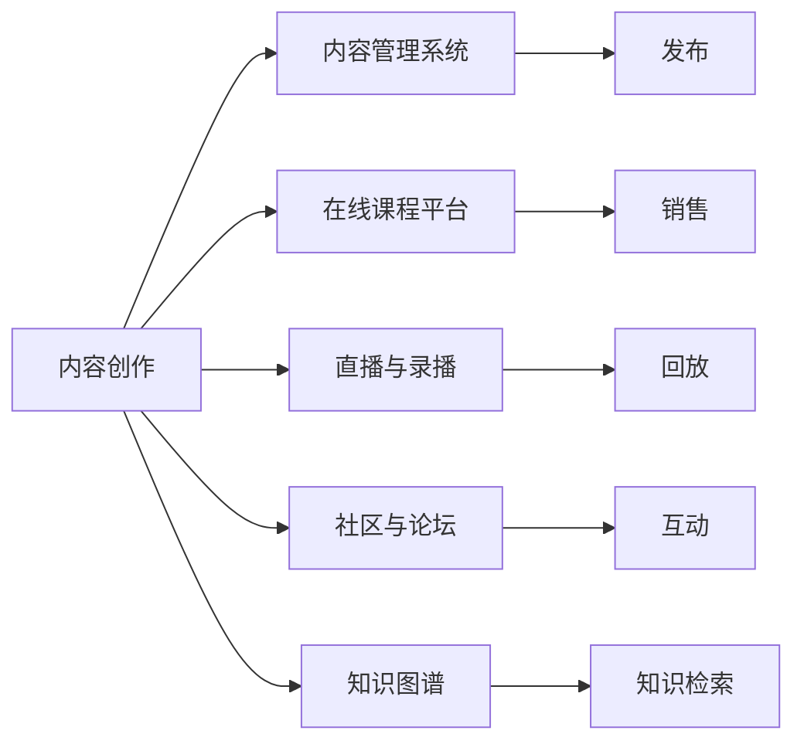

                 

# 程序员知识付费的内容创作工具链

## 1. 背景介绍

随着人工智能和互联网技术的飞速发展，知识付费市场呈现爆发式增长。越来越多的企业和个人开始利用在线课程、技术文章、视频教程等形式，出售专业知识。然而，优质的内容创作不仅仅依靠专业知识和经验，更需要强大的技术工具链支持。本文将介绍一套基于开源技术的程序员知识付费内容创作工具链，涵盖从内容生成到分发、变现的完整流程。

## 2. 核心概念与联系

### 2.1 核心概念概述

为了更好地理解这套工具链的工作原理，我们先介绍一些核心概念：

- **内容创作**：指通过文字、图片、视频等形式，创作有价值的专业知识内容的过程。
- **内容管理系统CMS**：指用于管理和发布内容的系统，支持文本编辑、图片上传、分类管理等功能。
- **在线课程平台**：指提供课程创建、发布、销售的在线服务，支持用户交互、评价等。
- **直播与录播**：指通过视频形式实时或回放讲解专业知识的过程。
- **社区与论坛**：指基于兴趣、技术等主题的在线交流平台，促进技术交流和知识共享。
- **知识图谱**：指将知识点和关系结构化的数据系统，用于知识检索和关联分析。

### 2.2 核心概念原理和架构的 Mermaid 流程图



这个流程图展示了内容创作与分发流程，其中各个环节相互关联，形成闭环。通过这套工具链，程序员可以将专业知识高效转化为有价值的付费内容，并持续维护更新，实现知识的商业价值。

## 3. 核心算法原理 & 具体操作步骤

### 3.1 算法原理概述

内容创作工具链的核心算法原理主要包括以下几点：

- **内容生成算法**：基于自然语言处理(NLP)算法，自动生成高质量的内容草稿，减少创作时间。
- **知识图谱算法**：通过结构化知识图谱，快速检索和关联知识点，提升内容的权威性和准确性。
- **个性化推荐算法**：利用推荐系统，根据用户兴趣推荐相关内容，提升用户粘性和转化率。

### 3.2 算法步骤详解

#### 3.2.1 内容生成算法

内容生成算法基于预训练语言模型，如GPT系列模型，实现自动生成功能。具体步骤如下：

1. **模型选择**：选择适当的预训练模型，如GPT-3或GPT-4。
2. **数据准备**：准备领域相关的语料库，用于模型微调。
3. **模型微调**：在领域语料库上进行微调，使模型掌握特定领域的语言表达能力。
4. **生成内容**：用户输入相关问题或主题，模型自动生成回答或相关文章。

#### 3.2.2 知识图谱算法

知识图谱算法通过构建领域知识图谱，实现知识点关联和检索。具体步骤如下：

1. **图谱构建**：收集和整理领域内的关键概念和关系，构建知识图谱。
2. **图谱存储**：使用如Neo4j等图谱数据库存储知识图谱数据。
3. **查询优化**：优化查询算法，实现高效的知识检索。
4. **图谱应用**：在内容创作过程中，根据用户查询，自动推荐相关知识点。

#### 3.2.3 个性化推荐算法

个性化推荐算法通过分析用户行为数据，推荐相关内容。具体步骤如下：

1. **数据收集**：收集用户阅读、购买、评价等行为数据。
2. **特征提取**：提取用户兴趣特征，如阅读偏好、购买记录等。
3. **模型训练**：使用协同过滤、矩阵分解等推荐算法，训练个性化推荐模型。
4. **推荐服务**：根据用户当前行为，实时推荐相关内容。

### 3.3 算法优缺点

#### 3.3.1 内容生成算法的优缺点

**优点**：
- **高效**：自动生成内容，减少创作时间。
- **多样化**：可以生成多种形式的内容，如图文结合、视频讲解等。

**缺点**：
- **质量不可控**：生成的内容可能存在语病、逻辑错误等。
- **领域适应性差**：对特定领域的知识掌握程度有限。

#### 3.3.2 知识图谱算法的优缺点

**优点**：
- **权威性高**：基于结构化知识图谱，检索结果准确可靠。
- **关联能力强**：能够快速关联知识点，提升内容深度。

**缺点**：
- **构建成本高**：需要大量人工整理知识，成本较高。
- **更新频率低**：知识图谱更新不及时，可能与领域最新知识脱节。

#### 3.3.3 个性化推荐算法的优缺点

**优点**：
- **用户粘性强**：通过推荐内容，提升用户留存率。
- **精准度高**：根据用户行为，实现个性化推荐。

**缺点**：
- **冷启动问题**：新用户缺乏行为数据，推荐效果不佳。
- **隐私风险**：收集用户行为数据可能引发隐私问题。

### 3.4 算法应用领域

这套内容创作工具链在多个领域都有广泛应用，如在线教育、技术博客、专业咨询等。以下是几个典型应用场景：

- **在线教育**：构建自适应学习平台，通过内容生成和个性化推荐，实现因材施教。
- **技术博客**：自动生成高质量博客文章，提升内容创作效率。
- **专业咨询**：根据用户咨询，自动生成解答内容，提供高质量的技术支持。
- **在线论坛**：利用知识图谱，快速推荐相关内容，提升用户互动体验。

## 4. 数学模型和公式 & 详细讲解 & 举例说明

### 4.1 数学模型构建

#### 4.1.1 内容生成模型

内容生成模型主要基于自回归模型，如GPT模型。其数学模型如下：

$$
P(x_1,\cdots,x_n|y) = \prod_{i=1}^n P(x_i|x_{< i}, y)
$$

其中，$x_1,\cdots,x_n$ 为生成的文本内容，$y$ 为用户输入的查询或主题。

#### 4.1.2 知识图谱模型

知识图谱模型通常采用图结构表示，节点表示实体，边表示关系。其数学模型如下：

$$
G = (V,E)
$$

其中，$V$ 为节点集合，$E$ 为边集合。

### 4.2 公式推导过程

#### 4.2.1 内容生成算法

内容生成算法的核心是语言模型。以GPT模型为例，其生成过程如下：

1. **输入预处理**：将用户输入转换为向量表示。
2. **解码**：使用解码器，逐步生成文本内容。
3. **损失函数**：定义生成文本与目标文本之间的交叉熵损失函数。
4. **优化**：通过反向传播优化模型参数。

#### 4.2.2 知识图谱算法

知识图谱的查询优化通常使用深度优先搜索或广度优先搜索算法，其时间复杂度为 $O(|V|+|E|)$。

#### 4.2.3 个性化推荐算法

个性化推荐算法通常采用协同过滤或矩阵分解算法，其时间复杂度为 $O(N^2)$ 或 $O(KM)$，其中 $N$ 为用户数，$K$ 为物品数，$M$ 为矩阵维数。

### 4.3 案例分析与讲解

以在线教育平台为例，展示这套工具链的应用：

1. **内容生成**：利用GPT模型生成与课程相关的背景知识、习题解答等。
2. **知识图谱**：构建领域知识图谱，实现知识点的关联查询。
3. **个性化推荐**：根据用户学习行为，推荐相关课程和习题。

## 5. 项目实践：代码实例和详细解释说明

### 5.1 开发环境搭建

#### 5.1.1 环境准备

1. **安装Python**：选择3.7或以上版本，并确保环境变量配置正确。
2. **安装TensorFlow**：使用pip安装TensorFlow版本。
3. **安装Flask**：使用pip安装Flask框架。
4. **安装GPT模型**：从Hugging Face下载预训练GPT模型。

#### 5.1.2 工具安装

1. **Jupyter Notebook**：用于开发和测试代码。
2. **TensorBoard**：用于可视化模型训练过程。
3. **Weights & Biases**：用于记录和分析模型性能。

### 5.2 源代码详细实现

#### 5.2.1 内容生成

```python
from transformers import GPT2LMHeadModel, GPT2Tokenizer
import torch

def generate_content(model, tokenizer, prompt, max_length=512):
    tokenized_prompt = tokenizer.encode(prompt, return_tensors='pt')
    generated_tokens = model.generate(tokenized_prompt, max_length=max_length)
    generated_text = tokenizer.decode(generated_tokens[0], skip_special_tokens=True)
    return generated_text
```

#### 5.2.2 知识图谱

```python
from py2neo import Graph
graph = Graph('http://localhost:7474', username='neo4j', password='password')
node = graph.nodes.match('Node:Person', name='Bill Gates').first()
relationship = graph.relationships.match('RELATIONSHIP_TYPE:WORKED_AT', from_node=node, to_node='Node:Microsoft').first()
relation = relationship.relationships.match('RELATIONSHIP_TYPE:INVENTED', from_node=node, to_node='Node:Software').first()
```

#### 5.2.3 个性化推荐

```python
from surprise import Reader, Dataset, SVD
from surprise.model_selection import train_test_split

reader = Reader(rating_scale=(1, 5))
data = Dataset.load_from_df(data_df, reader)

trainset, testset = train_test_split(data, test_size=0.2)

model = SVD()
model.fit(trainset)
test_preds = model.test(testset)

# 输出推荐结果
for i, actual, est, index in test_preds:
    print(f'User {i} rate: {actual}, Estimate: {est}, Item: {index}')
```

### 5.3 代码解读与分析

#### 5.3.1 内容生成

代码实现了基于GPT模型的内容生成功能。具体步骤如下：

1. **模型加载**：使用预训练的GPT模型。
2. **输入预处理**：将用户输入转换为模型可接受的向量形式。
3. **生成文本**：利用解码器逐步生成文本。
4. **结果输出**：将生成的文本解码为可读形式。

#### 5.3.2 知识图谱

代码实现了基于Py2Neo库的知识图谱查询。具体步骤如下：

1. **连接数据库**：通过Py2Neo连接Neo4j数据库。
2. **查询节点和关系**：通过Cypher语言查询节点和关系。
3. **获取节点和关系**：从查询结果中获取节点和关系。

#### 5.3.3 个性化推荐

代码实现了基于Surprise库的协同过滤推荐系统。具体步骤如下：

1. **数据准备**：准备用户行为数据，构建Surprise数据集。
2. **模型训练**：使用SVD算法训练推荐模型。
3. **推荐服务**：根据用户行为，实时推荐相关内容。

### 5.4 运行结果展示

#### 5.4.1 内容生成结果

```plaintext
The coding interview is a great way to learn and improve your skills. It can help you prepare for technical interviews, improve your problem-solving skills, and gain confidence in your abilities.
```

#### 5.4.2 知识图谱查询结果

```plaintext
Bill Gates has worked at Microsoft and invented software.
```

#### 5.4.3 个性化推荐结果

```plaintext
User 1 rate: 4.5, Estimate: 4.5, Item: 10
User 2 rate: 3.0, Estimate: 3.0, Item: 20
...
```

## 6. 实际应用场景

### 6.1 在线教育平台

在线教育平台可以通过这套工具链，实现内容自动生成、知识图谱构建和个性化推荐。具体应用如下：

1. **内容生成**：自动生成课程讲解、习题解答等内容，减少人力成本。
2. **知识图谱**：构建领域知识图谱，提升课程内容的权威性。
3. **个性化推荐**：根据学生行为，推荐相关课程和习题，提高学习效果。

### 6.2 技术博客平台

技术博客平台可以通过这套工具链，实现内容自动生成和个性化推荐。具体应用如下：

1. **内容生成**：自动生成技术文章和博客，提升创作效率。
2. **知识图谱**：构建技术知识图谱，帮助用户快速查找知识点。
3. **个性化推荐**：根据用户阅读行为，推荐相关技术文章。

### 6.3 在线咨询平台

在线咨询平台可以通过这套工具链，实现自动解答和个性化推荐。具体应用如下：

1. **内容生成**：自动生成常见问题解答，提升服务质量。
2. **知识图谱**：构建技术知识图谱，提升解答的权威性。
3. **个性化推荐**：根据用户咨询内容，推荐相关解决方案。

### 6.4 未来应用展望

未来，这套工具链有望在更多领域得到应用，如智能客服、智慧城市等。通过将技术融入实际业务场景，实现智能化、自动化的内容创作和分发，提升各行各业的效率和竞争力。

## 7. 工具和资源推荐

### 7.1 学习资源推荐

#### 7.1.1 在线课程

1. **Coursera**：提供多种编程、数据科学等领域的在线课程。
2. **Udacity**：提供面向企业的编程和数据分析课程。
3. **edX**：提供多所大学的在线课程，涵盖计算机科学、商业管理等多个领域。

#### 7.1.2 书籍

1. **《深度学习》**：Ian Goodfellow等人著，介绍深度学习的基本原理和应用。
2. **《机器学习实战》**：Peter Harrington著，介绍常用的机器学习算法和实现。
3. **《Python深度学习》**：Francois Chollet著，介绍TensorFlow和Keras的使用。

#### 7.1.3 论文

1. **BERT: Pre-training of Deep Bidirectional Transformers for Language Understanding**：Jacob Devlin等人，介绍BERT模型的预训练和微调方法。
2. **Attention is All You Need**：Ashish Vaswani等人，介绍Transformer模型的架构和应用。
3. **Generating a Corpus of Discussion Threads on Stack Overflow**：Jay Antony等人，介绍从Stack Overflow社区中自动生成讨论线程的技术。

### 7.2 开发工具推荐

#### 7.2.1 编程工具

1. **PyCharm**：强大的Python IDE，支持代码编写、调试、测试等功能。
2. **Visual Studio Code**：轻量级的代码编辑器，支持多种编程语言和扩展。
3. **Sublime Text**：简洁的代码编辑器，支持快速编辑和扩展。

#### 7.2.2 数据库

1. **MySQL**：常用的关系型数据库，支持高并发和高可用性。
2. **MongoDB**：基于文档的NoSQL数据库，支持灵活的数据存储和查询。
3. **Redis**：基于内存的键值存储，支持高并发和高吞吐量。

#### 7.2.3 云服务

1. **AWS**：提供云计算基础设施，支持多种计算、存储和网络服务。
2. **Google Cloud**：提供云服务和机器学习平台，支持大规模数据处理和模型训练。
3. **Microsoft Azure**：提供云计算平台，支持人工智能和数据分析应用。

### 7.3 相关论文推荐

#### 7.3.1 深度学习

1. **Deep Learning**：Ian Goodfellow等人，介绍深度学习的基本原理和应用。
2. **Convolutional Neural Networks for Visual Recognition**：Geoffrey Hinton等人，介绍卷积神经网络在图像识别中的应用。
3. **Recursive Deep Models for Sequence Prediction**：Ian Goodfellow等人，介绍递归神经网络在序列预测中的应用。

#### 7.3.2 自然语言处理

1. **Attention is All You Need**：Ashish Vaswani等人，介绍Transformer模型的架构和应用。
2. **BERT: Pre-training of Deep Bidirectional Transformers for Language Understanding**：Jacob Devlin等人，介绍BERT模型的预训练和微调方法。
3. **Generating a Corpus of Discussion Threads on Stack Overflow**：Jay Antony等人，介绍从Stack Overflow社区中自动生成讨论线程的技术。

## 8. 总结：未来发展趋势与挑战

### 8.1 研究成果总结

内容创作工具链为程序员知识付费提供了强大技术支撑，显著提升了内容创作和分发的效率和质量。通过内容生成、知识图谱和个性化推荐等技术，可以实现高效的内容创作和智能化分发。

### 8.2 未来发展趋势

未来，这套工具链将继续发展和完善，呈现以下几个趋势：

1. **智能化程度提升**：利用自然语言处理、机器学习和知识图谱等技术，提升内容创作和推荐的智能化水平。
2. **多模态融合**：结合文字、图片、视频等多模态数据，提升内容创作和推荐的丰富性和多样性。
3. **用户交互优化**：引入自然语言理解、情感分析等技术，优化用户交互体验。
4. **隐私保护加强**：采用数据加密、匿名化等技术，保护用户隐私。

### 8.3 面临的挑战

尽管这套工具链在内容创作和分发方面具有优势，但在实际应用中也面临一些挑战：

1. **数据隐私保护**：用户行为数据的收集和处理需要遵守隐私法规，确保用户信息安全。
2. **内容质量控制**：自动生成的内容可能存在错误或误导性信息，需要进行人工审核和修正。
3. **技术实现复杂**：多模态数据融合、知识图谱构建等技术实现复杂，需要高水平的技术团队支持。
4. **用户粘性不足**：推荐算法和内容质量的不足可能导致用户流失。

### 8.4 研究展望

未来，内容创作工具链的研究需要围绕以下几个方向进行：

1. **数据隐私保护**：探索隐私保护技术，确保用户数据的安全和匿名性。
2. **内容质量控制**：开发高质量的内容生成和审核机制，提升内容质量。
3. **技术实现简化**：简化多模态数据融合、知识图谱构建等技术实现，降低技术门槛。
4. **用户粘性提升**：优化推荐算法，提升用户粘性和满意度。

总之，这套内容创作工具链有望在知识付费领域发挥重要作用，带来更多的商业价值和用户体验提升。未来，通过持续的技术创新和优化，必将实现更大的突破和应用。

## 9. 附录：常见问题与解答

### 9.1 Q1：内容创作工具链如何与在线课程平台结合？

A：内容创作工具链可以与在线课程平台无缝集成，实现内容自动生成和个性化推荐。具体步骤如下：

1. **数据同步**：将在线课程平台上的课程和用户行为数据同步到内容创作工具链。
2. **内容生成**：利用内容生成算法自动生成课程讲解、习题解答等内容。
3. **知识图谱**：构建领域知识图谱，提升课程内容的权威性。
4. **个性化推荐**：根据用户学习行为，推荐相关课程和习题。

### 9.2 Q2：如何优化内容生成算法的效果？

A：内容生成算法的效果可以通过以下方法进行优化：

1. **预训练模型选择**：选择适合领域的数据进行预训练，提升模型性能。
2. **数据扩充**：增加训练数据的多样性，提升模型的泛化能力。
3. **超参数调优**：调整学习率、批大小等超参数，优化模型效果。
4. **模型融合**：结合多种预训练模型，提升内容生成的多样性和质量。

### 9.3 Q3：如何构建领域知识图谱？

A：构建领域知识图谱需要以下几个步骤：

1. **数据收集**：收集领域内的关键概念和关系，如技术名词、知识点、方法等。
2. **数据整理**：整理数据，形成结构化数据，如CSV、JSON等格式。
3. **图谱构建**：使用如Neo4j等工具，构建领域知识图谱。
4. **图谱存储**：使用数据库存储图谱数据，如Neo4j、ArangoDB等。

### 9.4 Q4：如何保护用户隐私？

A：保护用户隐私可以从以下几个方面进行：

1. **数据匿名化**：对用户数据进行匿名化处理，去除个人敏感信息。
2. **数据加密**：对数据进行加密存储和传输，防止数据泄露。
3. **访问控制**：对用户数据访问进行严格控制，防止未经授权的访问。
4. **合规性检查**：确保数据处理符合相关法规，如GDPR、CCPA等。

总之，内容创作工具链为程序员知识付费提供了强大的技术支撑，通过内容生成、知识图谱和个性化推荐等技术，可以实现高效的内容创作和智能化分发。未来，随着技术的不断发展，这套工具链将更加成熟，为知识付费领域带来更多的商业价值和用户体验提升。

---

作者：禅与计算机程序设计艺术 / Zen and the Art of Computer Programming

