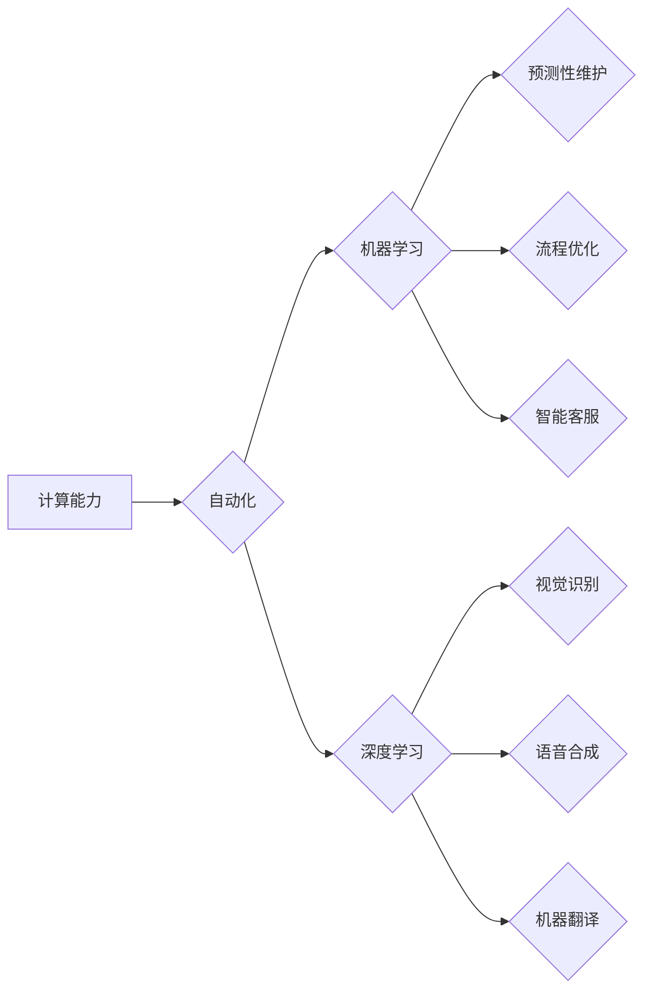

> 计算能力、自动化、机器学习、深度学习、人工智能、算法、效率、成本

## 1. 背景介绍

自动化一直是人类追求的目标，从工业革命的机械化生产到现代信息技术的智能化应用，自动化不断改变着我们的生活和工作方式。而计算能力的飞速发展，特别是近年来人工智能（AI）的蓬勃兴起，为自动化领域带来了前所未有的机遇和挑战。

随着摩尔定律的持续演进，计算机处理器性能不断提升，存储容量和网络带宽也得到显著扩展。这些计算资源的丰富，为训练和部署复杂的AI模型提供了坚实的基础。同时，机器学习和深度学习算法的不断进步，使得机器能够从海量数据中学习，并自动完成越来越复杂的决策和任务。

## 2. 核心概念与联系

### 2.1 计算能力与自动化

计算能力是自动化领域的基础。自动化任务的核心在于通过算法和程序实现对特定过程的控制和优化。而计算能力决定了算法的复杂度、数据处理速度和模型训练效率。

随着计算能力的提升，我们可以训练更复杂的AI模型，处理更庞大的数据，并实现更精细化的自动化控制。例如，传统的自动化系统主要依赖于预先定义的规则和流程，而AI驱动的自动化系统则能够根据实时数据和环境变化进行动态调整，实现更灵活和智能化的自动化。

### 2.2 机器学习与自动化

机器学习是AI领域的重要分支，它赋予机器学习能力，能够从数据中发现模式和规律，并根据这些模式进行预测和决策。机器学习算法广泛应用于自动化领域，例如：

* **预测性维护：** 利用机器学习算法分析设备运行数据，预测设备故障风险，并提前进行维护，降低设备故障率和维护成本。
* **流程优化：** 通过机器学习算法分析业务流程数据，识别流程中的瓶颈和冗余环节，并提出优化方案，提高流程效率和资源利用率。
* **智能客服：** 利用机器学习算法训练聊天机器人，能够理解用户自然语言，并提供智能化的客服服务，提高客户满意度和服务效率。

### 2.3 深度学习与自动化

深度学习是机器学习的一个子领域，它利用多层神经网络结构，能够学习更复杂的特征和模式。深度学习算法在图像识别、语音识别、自然语言处理等领域取得了突破性进展，也为自动化领域带来了新的可能性。

例如，深度学习算法可以用于：

* **视觉识别：** 实现对图像和视频的自动识别和分类，例如自动驾驶汽车的场景识别、工业生产线的缺陷检测等。
* **语音合成：** 生成逼真的语音，用于语音助手、虚拟客服等应用。
* **机器翻译：** 实现对不同语言的自动翻译，提高跨语言沟通效率。

**Mermaid 流程图**



## 3. 核心算法原理 & 具体操作步骤

### 3.1 算法原理概述

机器学习算法的核心在于从数据中学习，并根据学习到的知识进行预测或决策。常见的机器学习算法包括：

* **监督学习：** 利用标记数据训练模型，例如分类和回归问题。
* **无监督学习：** 从未标记数据中发现模式和结构，例如聚类和降维。
* **强化学习：** 通过试错学习，在环境中获得最大奖励。

### 3.2 算法步骤详解

以监督学习为例，其基本步骤如下：

1. **数据收集和预处理：** 收集相关数据，并进行清洗、转换和特征工程等预处理操作。
2. **模型选择：** 根据具体任务选择合适的机器学习模型，例如线性回归、逻辑回归、决策树、支持向量机等。
3. **模型训练：** 利用标记数据训练模型，调整模型参数，使模型能够准确地预测或分类。
4. **模型评估：** 利用测试数据评估模型的性能，例如准确率、召回率、F1-score等。
5. **模型部署：** 将训练好的模型部署到实际应用场景中，用于预测或决策。

### 3.3 算法优缺点

不同的机器学习算法具有不同的优缺点，需要根据具体任务选择合适的算法。例如：

* **线性回归：** 算法简单易懂，训练速度快，但对非线性关系的拟合能力较弱。
* **逻辑回归：** 用于二分类问题，效果较好，但对多分类问题适用性较差。
* **决策树：** 能够处理非线性关系，解释性强，但容易过拟合。
* **支持向量机：** 对高维数据处理能力强，但训练时间较长。

### 3.4 算法应用领域

机器学习算法广泛应用于各个领域，例如：

* **医疗保健：** 疾病诊断、药物研发、患者风险评估等。
* **金融服务：** 欺诈检测、信用评分、投资决策等。
* **电商：** 商品推荐、用户画像、价格预测等。
* **制造业：** 质量控制、设备故障预测、生产优化等。

## 4. 数学模型和公式 & 详细讲解 & 举例说明

### 4.1 数学模型构建

机器学习算法通常基于数学模型，例如线性回归模型、逻辑回归模型、决策树模型等。这些模型通过数学公式来描述数据之间的关系，并进行预测或分类。

### 4.2 公式推导过程

以线性回归模型为例，其目标是找到一条直线，能够最佳地拟合数据点。线性回归模型的数学公式如下：

$$y = w_0 + w_1x_1 + w_2x_2 + ... + w_nx_n$$

其中：

* $y$ 是预测值
* $w_0, w_1, w_2, ..., w_n$ 是模型参数
* $x_1, x_2, ..., x_n$ 是输入特征

模型参数的求解可以通过最小二乘法来实现。最小二乘法旨在找到一条直线，使得所有数据点到直线的距离之和最小。

### 4.3 案例分析与讲解

假设我们有一组数据，包含房屋面积和房屋价格的信息。我们想要建立一个线性回归模型，预测房屋价格。

我们可以将房屋面积作为输入特征，房屋价格作为输出目标。通过最小二乘法，我们可以找到最佳的模型参数，从而建立一个能够预测房屋价格的线性回归模型。

## 5. 项目实践：代码实例和详细解释说明

### 5.1 开发环境搭建

为了实现机器学习项目，我们需要搭建相应的开发环境。常用的开发环境包括：

* **Python:** Python 是机器学习领域最常用的编程语言，拥有丰富的机器学习库和工具。
* **Jupyter Notebook:** Jupyter Notebook 是一个交互式编程环境，方便进行机器学习代码的编写和调试。
* **机器学习库:** Scikit-learn 是 Python 中最常用的机器学习库，提供了各种机器学习算法的实现。

### 5.2 源代码详细实现

以下是一个使用 Scikit-learn 库实现线性回归模型的 Python 代码示例：

```python
from sklearn.linear_model import LinearRegression
from sklearn.model_selection import train_test_split
import numpy as np

# 生成示例数据
np.random.seed(0)
X = np.random.rand(100, 1) * 10
y = 2 * X + 1 + np.random.randn(100, 1)

# 将数据划分为训练集和测试集
X_train, X_test, y_train, y_test = train_test_split(X, y, test_size=0.2, random_state=42)

# 创建线性回归模型
model = LinearRegression()

# 训练模型
model.fit(X_train, y_train)

# 预测测试集数据
y_pred = model.predict(X_test)

# 评估模型性能
print('Coefficients:', model.coef_)
print('Intercept:', model.intercept_)
```

### 5.3 代码解读与分析

这段代码首先生成了一些示例数据，然后将数据划分为训练集和测试集。接着，创建了一个线性回归模型，并使用训练集数据训练模型。最后，使用测试集数据预测模型输出，并评估模型性能。

### 5.4 运行结果展示

运行这段代码后，会输出模型的系数和截距，以及模型预测结果与实际值的误差。

## 6. 实际应用场景

### 6.1 自动化制造

在自动化制造领域，机器学习算法可以用于：

* **质量控制：** 利用机器视觉识别产品缺陷，提高产品质量。
* **设备故障预测：** 分析设备运行数据，预测设备故障风险，提前进行维护。
* **生产流程优化：** 分析生产数据，识别流程中的瓶颈和冗余环节，提高生产效率。

### 6.2 自动化物流

在自动化物流领域，机器学习算法可以用于：

* **货物分类和识别：** 利用机器视觉识别货物的种类和数量，提高物流效率。
* **路径规划和调度：** 分析物流网络数据，优化货物运输路径和调度方案，降低物流成本。
* **自动驾驶叉车：** 利用传感器数据和机器学习算法，实现叉车的自动驾驶，提高物流效率和安全性。

### 6.3 自动化客服

在自动化客服领域，机器学习算法可以用于：

* **智能客服机器人：** 利用自然语言处理技术，训练聊天机器人，能够理解用户自然语言，并提供智能化的客服服务。
* **客户情绪分析：** 分析客户的文本和语音数据，识别客户的情绪状态，提供更精准的客服服务。
* **客户关系管理：** 利用机器学习算法分析客户数据，识别潜在客户和高价值客户，提高客户关系管理效率。

### 6.4 未来应用展望

随着计算能力的持续提升和人工智能技术的不断发展，自动化领域将迎来更加广泛的应用场景。例如：

* **自动驾驶汽车：** 利用机器学习算法实现自动驾驶汽车的感知、决策和控制，提高交通安全和效率。
* **智能医疗：** 利用机器学习算法辅助医生诊断疾病、制定治疗方案，提高医疗效率和准确性。
* **个性化教育：** 利用机器学习算法分析学生的学习数据，提供个性化的学习方案，提高学习效果。

## 7. 工具和资源推荐

### 7.1 学习资源推荐

* **在线课程：** Coursera、edX、Udacity 等平台提供丰富的机器学习和人工智能课程。
* **书籍：** 《机器学习》 (周志华)、《深度学习》 (Ian Goodfellow) 等书籍是机器学习和深度学习领域的经典教材。
* **博客和论坛：** 机器学习和人工智能领域有很多优秀的博客和论坛，例如机器之心、AI 算法等。

### 7.2 开发工具推荐

* **Python:** Python 是机器学习领域最常用的编程语言，拥有丰富的机器学习库和工具。
* **Jupyter Notebook:** Jupyter Notebook 是一个交互式编程环境，方便进行机器学习代码的编写和调试。
* **Scikit-learn:** Scikit-learn 是 Python 中最常用的机器学习库，提供了各种机器学习算法的实现。
* **TensorFlow:** TensorFlow 是 Google 开发的开源机器学习框架，支持深度学习模型的训练和部署。
* **PyTorch:** PyTorch 是 Facebook 开发的开源机器学习框架，以其灵活性和易用性而闻名。

### 7.3 相关论文推荐

* **《ImageNet Classification with Deep Convolutional Neural Networks》:** Alex Krizhevsky, Ilya Sutskever, Geoffrey E. Hinton (2012)
* **《Attention Is All You Need》:** Ashish Vaswani, Noam Shazeer, Niki Parmar, Jakob Uszkoreit, Llion Jones, Aidan N. Gomez, Łukasz Kaiser, Illia Polosukhin (2017)
* **《BERT: Pre-training of Deep Bidirectional Transformers for Language Understanding