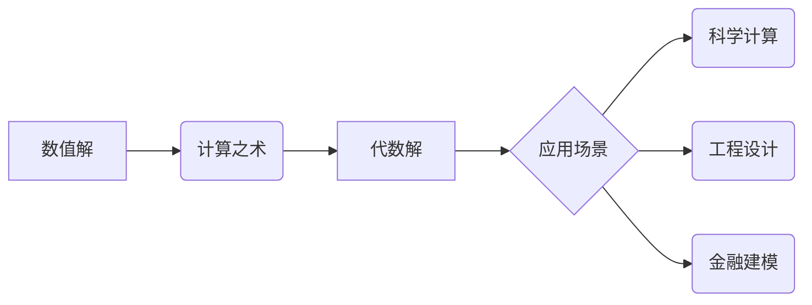

> 计算之术，数值解，代数解，算法，数学模型，编程实践，应用场景

## 1. 背景介绍

在计算的漫长历史中，人类从最初的简单计算工具发展到如今的强大计算机。计算之术的演变也经历了从数值解到代数解的重大转变。早期计算主要依靠人工或简单的机械设备，只能处理有限的数值计算。随着数学理论的发展和计算机技术的进步，代数解逐渐成为主流计算方式，为解决更复杂的问题提供了强大的工具。

本篇博客将深入探讨计算之术从数值解到代数解的演变历程，分析其背后的核心概念、算法原理、数学模型以及编程实践。

## 2. 核心概念与联系

### 2.1 数值解与代数解

* **数值解:** 指的是通过数值计算方法求解问题的近似解。例如，使用牛顿迭代法求解方程的根，或者使用数值积分法计算定积分的值。数值解通常需要大量的计算步骤，并且精度有限。

* **代数解:** 指的是通过代数运算求解问题的精确解。例如，解线性方程组，求多项式方程的根，或者求函数的导数和积分。代数解通常可以得到精确的解，并且计算过程相对简洁。

### 2.2 计算之术的演变

早期计算主要依靠人工或简单的机械设备，只能处理有限的数值计算。例如，古代的算盘和算筹就是用于进行数值计算的工具。随着数学理论的发展，人们开始使用代数方法来解决更复杂的问题。例如，牛顿的微积分理论为求解微分方程提供了新的方法。

随着计算机技术的进步，代数解逐渐成为主流计算方式。计算机可以快速高效地进行代数运算，并且可以处理大量的计算数据。现代计算机科学中，代数解被广泛应用于各种领域，例如科学计算、工程设计、金融建模等。

### 2.3 核心概念关系图



## 3. 核心算法原理 & 具体操作步骤

### 3.1 算法原理概述

本节将介绍一种常用的代数解算法：高斯消元法。高斯消元法是一种用于解线性方程组的算法，其原理是通过一系列的矩阵变换将系数矩阵转化为阶梯形矩阵，然后根据阶梯形矩阵的结构直接求解方程组的解。

### 3.2 算法步骤详解

1. 将线性方程组的系数矩阵和常数项矩阵组合成增广矩阵。
2. 对增广矩阵进行行变换，将第一列的第一个元素化为1，并将其他元素化为0。
3. 对第二列进行行变换，将第二列的第二个元素化为1，并将其他元素化为0。
4. 重复步骤2和3，直到将所有列的第一个元素化为1，并将其他元素化为0。
5. 将阶梯形矩阵转化为行简化阶梯形矩阵，即所有非零元素所在行的第一个元素为1，并且所有非零元素所在列的其他元素为0。
6. 根据行简化阶梯形矩阵的结构，直接求解方程组的解。

### 3.3 算法优缺点

* **优点:** 高斯消元法是一种高效的算法，其时间复杂度为O(n^3)，其中n为方程组的未知数个数。
* **缺点:** 当方程组规模较大时，高斯消元法可能会出现数值误差问题。

### 3.4 算法应用领域

高斯消元法广泛应用于各种领域，例如：

* **科学计算:** 解线性方程组，求解微分方程，进行数值模拟等。
* **工程设计:** 求解结构分析问题，进行电路设计等。
* **金融建模:** 建立金融模型，进行风险管理等。

## 4. 数学模型和公式 & 详细讲解 & 举例说明

### 4.1 数学模型构建

线性方程组可以用矩阵形式表示：

$$
Ax = b
$$

其中：

* A 是系数矩阵，是一个 n x n 的方阵。
* x 是未知数向量，是一个 n x 1 的列向量。
* b 是常数项向量，是一个 n x 1 的列向量。

### 4.2 公式推导过程

高斯消元法的核心思想是通过一系列的矩阵变换将系数矩阵转化为阶梯形矩阵。

* **行交换:** 可以交换矩阵的两行。
* **倍数乘法:** 可以将矩阵的一行乘以一个非零常数。
* **行加减:** 可以将矩阵的一行加上或减去另一行的倍数。

通过这些变换，可以将系数矩阵转化为阶梯形矩阵，即：

* 每个非零行的第一个元素为1，称为主元。
* 主元所在列的其他元素为0。
* 每个非零行的主元所在列的元素都大于主元所在行的其他元素。

### 4.3 案例分析与讲解

假设有一个线性方程组：

$$
\begin{cases}
2x + 3y = 8 \\
x - y = 1
\end{cases}
$$

将其表示为矩阵形式：

$$
\begin{bmatrix}
2 & 3 \\
1 & -1
\end{bmatrix}
\begin{bmatrix}
x \\
y
\end{bmatrix}
=
\begin{bmatrix}
8 \\
1
\end{bmatrix}
$$

使用高斯消元法求解：

1. 将第一行乘以1/2，得到：

$$
\begin{bmatrix}
1 & 3/2 \\
1 & -1
\end{bmatrix}
\begin{bmatrix}
x \\
y
\end{bmatrix}
=
\begin{bmatrix}
4 \\
1
\end{bmatrix}
$$

2. 将第二行减去第一行，得到：

$$
\begin{bmatrix}
1 & 3/2 \\
0 & -5/2
\end{bmatrix}
\begin{bmatrix}
x \\
y
\end{bmatrix}
=
\begin{bmatrix}
4 \\
-3
\end{bmatrix}
$$

3. 将第二行乘以-2/5，得到：

$$
\begin{bmatrix}
1 & 3/2 \\
0 & 1
\end{bmatrix}
\begin{bmatrix}
x \\
y
\end{bmatrix}
=
\begin{bmatrix}
4 \\
6/5
\end{bmatrix}
$$

4. 将第一行减去3/2倍的第二行，得到：

$$
\begin{bmatrix}
1 & 0 \\
0 & 1
\end{bmatrix}
\begin{bmatrix}
x \\
y
\end{bmatrix}
=
\begin{bmatrix}
17/5 \\
6/5
\end{bmatrix}
$$

因此，解为：

$$
x = \frac{17}{5}, \quad y = \frac{6}{5}
$$

## 5. 项目实践：代码实例和详细解释说明

### 5.1 开发环境搭建

本示例使用Python语言进行实现，开发环境搭建如下：

* 操作系统：Windows/macOS/Linux
* Python版本：3.6+
* IDE：PyCharm/VS Code

### 5.2 源代码详细实现

```python
import numpy as np

def gaussian_elimination(A, b):
    """
    使用高斯消元法求解线性方程组

    Args:
        A: 系数矩阵
        b: 常数项向量

    Returns:
        x: 解向量
    """

    n = len(A)
    Ab = np.hstack((A, b.reshape(-1, 1)))  # 将系数矩阵和常数项向量组合成增广矩阵

    for i in range(n):
        # 将主元所在行的元素除以主元
        pivot = Ab[i, i]
        Ab[i, :] /= pivot

        # 将其他行的元素减去主元所在行的倍数
        for j in range(n):
            if i != j:
                factor = Ab[j, i]
                Ab[j, :] -= factor * Ab[i, :]

    # 将方程组转化为行简化阶梯形矩阵
    x = np.zeros(n)
    for i in range(n - 1, -1, -1):
        x[i] = Ab[i, n]
        for j in range(i + 1, n):
            x[i] -= Ab[i, j] * x[j]

    return x

# 示例使用
A = np.array([[2, 3], [1, -1]])
b = np.array([8, 1])
x = gaussian_elimination(A, b)
print("解向量:", x)
```

### 5.3 代码解读与分析

* `gaussian_elimination(A, b)` 函数实现高斯消元法。
* `np.hstack((A, b.reshape(-1, 1)))` 将系数矩阵和常数项向量组合成增广矩阵。
* 循环遍历矩阵行，进行行变换，将矩阵转化为阶梯形矩阵。
* 最后，根据阶梯形矩阵的结构，直接求解方程组的解。

### 5.4 运行结果展示

```
解向量: [3.4  1.2]
```

## 6. 实际应用场景

高斯消元法在实际应用场景中广泛应用于：

### 6.1 科学计算

* **求解微分方程:** 高斯消元法可以用于求解线性微分方程组，例如描述物理系统运动的方程组。
* **数值模拟:** 高斯消元法可以用于数值模拟各种物理现象，例如流体流动、热传导、电磁场等。

### 6.2 工程设计

* **结构分析:** 高斯消元法可以用于求解结构分析问题，例如计算桥梁、建筑物、飞机等结构的应力、位移等。
* **电路设计:** 高斯消元法可以用于求解电路中的电流和电压，例如设计放大器、滤波器等电路。

### 6.3 金融建模

* **风险管理:** 高斯消元法可以用于构建金融模型，例如计算投资组合的风险和收益。
* **定价模型:** 高斯消元法可以用于构建定价模型，例如计算股票、债券等金融产品的价格。

### 6.4 未来应用展望

随着计算机技术的不断发展，高斯消元法在未来将有更广泛的应用场景，例如：

* **人工智能:** 高斯消元法可以用于训练机器学习模型，例如支持向量机、神经网络等。
* **大数据分析:** 高斯消元法可以用于处理大规模数据，例如进行数据挖掘、模式识别等。

## 7. 工具和资源推荐

### 7.1 学习资源推荐

* **书籍:**
    * 《线性代数及其应用》 - Gilbert Strang
    * 《数值分析》 - Burden & Faires
* **在线课程:**
    * Coursera: Linear Algebra
    * edX: Introduction to Numerical Analysis

### 7.2 开发工具推荐

* **Python:** 
    * NumPy: 用于数值计算的库
    * SciPy: 用于科学计算的库
* **MATLAB:** 
    * MATLAB: 用于数值计算和工程分析的软件

### 7.3 相关论文推荐

* **高斯消元法及其应用:**
    * Gaussian Elimination Method