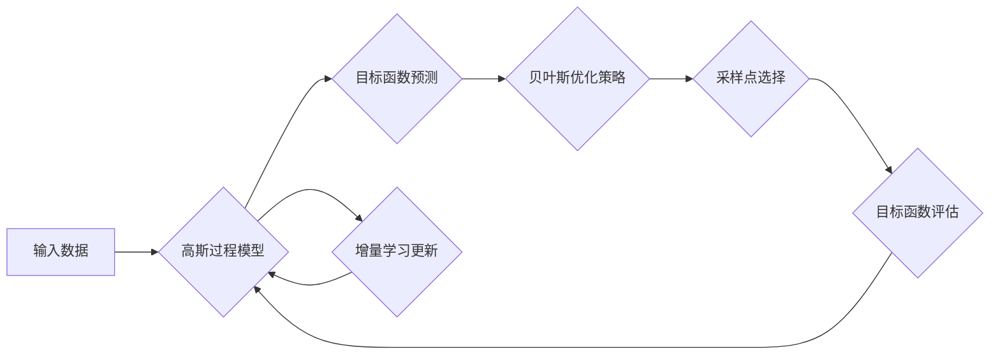

> 贝叶斯优化, 高斯过程, 增量学习, 机器学习, 优化算法

## 1. 背景介绍

在机器学习领域，优化问题是至关重要的，它涉及寻找最优参数或决策变量，以最大化或最小化目标函数。传统优化算法，例如梯度下降，通常需要大量的计算资源和时间，并且可能陷入局部最优解。贝叶斯优化 (Bayesian Optimization) 是一种基于贝叶斯理论的优化算法，它能够有效地探索和利用已有的知识，从而加速优化过程。

高斯过程 (Gaussian Process) 是一种强大的机器学习模型，它能够对函数进行非参数估计。增量学习 (Incremental Learning) 是一种学习方法，它允许模型在不断接收新数据时进行更新和改进。将贝叶斯优化和增量高斯过程相结合，可以构建出一种高效、灵活的优化算法，能够在面对不断变化的环境和数据时保持良好的性能。

## 2. 核心概念与联系

### 2.1 贝叶斯优化

贝叶斯优化是一种基于概率的优化算法，它利用贝叶斯理论来建模目标函数，并通过选择最优的采样点来进行探索和利用。其核心思想是：

* **构建概率模型：** 使用高斯过程等模型来建模目标函数的分布。
* **选择采样点：** 根据模型的预测和不确定性，选择最有可能找到全局最优解的采样点。
* **更新模型：** 收集新的数据后，更新模型的参数，以反映新的知识。

### 2.2 高斯过程

高斯过程是一种强大的非参数回归模型，它假设函数输出服从多元高斯分布。其核心特点是：

* **非参数性：** 不需要事先假设函数的形式。
* **全局性：** 可以捕捉函数的全局结构。
* **概率性：** 提供了函数输出的不确定性估计。

### 2.3 增量学习

增量学习是一种学习方法，它允许模型在不断接收新数据时进行更新和改进。其核心思想是：

* **保持旧知识：** 在更新模型时，保留旧数据的知识。
* **适应新数据：** 调整模型参数以适应新数据的分布。
* **避免灾难性遗忘：** 尽量避免旧知识被新数据所覆盖。

### 2.4 贝叶斯优化与增量高斯过程的结合

将贝叶斯优化与增量高斯过程相结合，可以构建出一种高效、灵活的优化算法，它能够在面对不断变化的环境和数据时保持良好的性能。

**流程图：**



## 3. 核心算法原理 & 具体操作步骤

### 3.1 算法原理概述

增量贝叶斯优化算法的基本原理是：

1. **初始化高斯过程模型：** 使用初始数据训练一个高斯过程模型，用于估计目标函数的分布。
2. **贝叶斯优化策略：** 使用贝叶斯优化策略，例如 Expected Improvement (EI) 或 Probability of Improvement (PI)，选择最有可能找到全局最优解的采样点。
3. **目标函数评估：** 在选定的采样点处评估目标函数的值。
4. **增量学习更新：** 将新的数据和目标函数值添加到高斯过程模型中，并更新模型的参数。
5. **重复步骤 2-4：** 直到达到预设的迭代次数或目标精度。

### 3.2 算法步骤详解

1. **初始化：**
    * 选择一个初始数据集，用于训练高斯过程模型。
    * 设置贝叶斯优化策略参数，例如 EI 或 PI 的阈值。
    * 设置迭代次数和目标精度。

2. **迭代优化：**
    * 使用高斯过程模型预测目标函数在所有采样点处的值。
    * 根据贝叶斯优化策略，选择最有可能找到全局最优解的采样点。
    * 在选定的采样点处评估目标函数的值。
    * 将新的数据和目标函数值添加到高斯过程模型中，并更新模型的参数。

3. **终止条件：**
    * 当达到预设的迭代次数或目标精度时，停止迭代。

### 3.3 算法优缺点

**优点：**

* **高效性：** 贝叶斯优化能够有效地探索和利用已有的知识，从而加速优化过程。
* **全局性：** 高斯过程能够捕捉函数的全局结构，从而提高找到全局最优解的概率。
* **灵活性和适应性：** 增量学习允许模型在不断接收新数据时进行更新和改进，从而提高模型的适应性。

**缺点：**

* **计算复杂度：** 高斯过程模型的训练和预测需要大量的计算资源。
* **超参数调优：** 贝叶斯优化算法需要调优一些超参数，例如 EI 或 PI 的阈值。
* **数据依赖性：** 高斯过程模型的性能依赖于训练数据的质量和数量。

### 3.4 算法应用领域

增量贝叶斯优化算法在许多领域都有广泛的应用，例如：

* **机器学习模型调参：** 优化机器学习模型的参数，以提高模型的性能。
* **药物发现：** 优化药物分子结构，以提高药物的疗效和安全性。
* **材料科学：** 优化材料的性能，例如强度、导电性和耐热性。
* **控制系统设计：** 优化控制器的参数，以提高系统的稳定性和性能。

## 4. 数学模型和公式 & 详细讲解 & 举例说明

### 4.1 数学模型构建

假设我们有一个目标函数 $f(x)$，其中 $x$ 是输入变量，我们需要找到 $x$ 的最优值。

高斯过程模型假设 $f(x)$ 的输出服从多元高斯分布，其均值和协方差矩阵分别为 $m(x)$ 和 $k(x, x')$。

* $m(x)$ 是高斯过程模型对 $f(x)$ 的预测值。
* $k(x, x')$ 是高斯过程模型对 $f(x)$ 和 $f(x')$ 之间的协方差。

### 4.2 公式推导过程

贝叶斯优化策略的目标是选择最有可能找到全局最优解的采样点。常用的贝叶斯优化策略包括 Expected Improvement (EI) 和 Probability of Improvement (PI)。

**Expected Improvement (EI)：**

$$EI(x) = \left[ \max(0, m(x) - f^*) \right] \cdot \phi \left( \frac{m(x) - f^*}{\sigma(x)} \right) + \sigma(x) \cdot \phi' \left( \frac{m(x) - f^*}{\sigma(x)} \right)$$

其中：

* $f^*$ 是当前已知的最佳目标函数值。
* $\sigma(x)$ 是高斯过程模型对 $f(x)$ 的标准差。
* $\phi(x)$ 和 $\phi'(x)$ 分别是标准正态分布的概率密度函数和累积分布函数。

**Probability of Improvement (PI)：**

$$PI(x) = P(f(x) > f^*)$$

其中：

* $f^*$ 是当前已知的最佳目标函数值。

### 4.3 案例分析与讲解

假设我们有一个目标函数 $f(x) = sin(x)$，我们需要使用增量贝叶斯优化算法找到其最优值。

1. **初始化：** 使用初始数据集 $\{x_1, f(x_1), x_2, f(x_2), ..., x_n, f(x_n)\}$ 训练高斯过程模型。
2. **迭代优化：** 使用 EI 或 PI 策略选择最有可能找到全局最优解的采样点 $x_{n+1}$。
3. **目标函数评估：** 在 $x_{n+1}$ 处评估目标函数的值 $f(x_{n+1})$。
4. **增量学习更新：** 将新的数据 $(x_{n+1}, f(x_{n+1}))$ 添加到高斯过程模型中，并更新模型的参数。
5. **重复步骤 2-4：** 直到达到预设的迭代次数或目标精度。

## 5. 项目实践：代码实例和详细解释说明

### 5.1 开发环境搭建

* Python 3.6+
* scikit-learn
* GPyOpt

### 5.2 源代码详细实现

```python
from gpyopt import BayesianOptimization

# 定义目标函数
def objective_function(x):
    return -np.sin(x)

# 设置搜索空间
bounds = [(0, 2*np.pi)]

# 创建贝叶斯优化对象
optimizer = BayesianOptimization(
    f=objective_function,
    pbounds=bounds,
    acquisition_type='EI',
    n_initial_points=5,
    verbose=2
)

# 执行优化
optimizer.run(n_iter=20)

# 获取最优解
print(optimizer.x_opt)
print(optimizer.fx_opt)
```

### 5.3 代码解读与分析

* `objective_function(x)`: 定义需要优化的目标函数。
* `bounds`: 设置搜索空间的上下界。
* `BayesianOptimization()`: 创建贝叶斯优化对象，并设置参数，例如：
    * `acquisition_type`: 选择贝叶斯优化策略，例如 EI 或 PI。
    * `n_initial_points`: 设置初始采样点的数量。
    * `verbose`: 设置输出信息的详细程度。
* `optimizer.run(n_iter=20)`: 执行优化，迭代次数为 20 次。
* `optimizer.x_opt`: 获取最优解的输入变量值。
* `optimizer.fx_opt`: 获取最优解的目标函数值。

### 5.4 运行结果展示

运行代码后，会输出最优解的输入变量值和目标函数值。

## 6. 实际应用场景

增量贝叶斯优化算法在许多实际应用场景中都表现出优异的性能，例如：

* **机器学习模型调参：** 优化机器学习模型的参数，例如决策树、支持向量机和神经网络的参数，以提高模型的性能。
* **药物发现：** 优化药物分子结构，以提高药物的疗效和安全性。
* **材料科学：** 优化材料的性能，例如强度、导电性和耐热性。
* **控制系统设计：** 优化控制器的参数，以提高系统的稳定性和性能。

### 6.4 未来应用展望

随着机器学习和人工智能技术的不断发展，增量贝叶斯优化算法的应用场景将会更加广泛。未来，它可能被应用于：

* **自动驾驶：** 优化自动驾驶系统的控制策略。
* **个性化推荐：** 优化个性化推荐系统的参数，以提高推荐的准确性和用户体验。
* **金融风险管理：** 优化金融风险管理模型的参数，以降低风险和提高收益。

## 7. 工具和资源推荐

### 7.1 学习资源推荐

* **书籍：**
    * Gaussian Processes for Machine Learning by Carl Edward Rasmussen and Christopher K. I. Williams
    * Bayesian Optimization: A Practical Guide by Jasper Snoek, Oren Rippel, and Kevin Swersky
* **在线课程：**
    * Bayesian Optimization with Python by Coursera
    * Gaussian Processes by Udacity

### 7.2 开发工具推荐

* **GPyOpt:** 一个用于贝叶斯优化的 Python 库。
* **scikit-learn:** 一个用于机器学习的 Python 库。
* **NumPy:** 一个用于数值计算的 Python 库。
* **Matplotlib:** 一个用于数据可视化的 Python 库。

### 7.3 相关论文推荐

* **