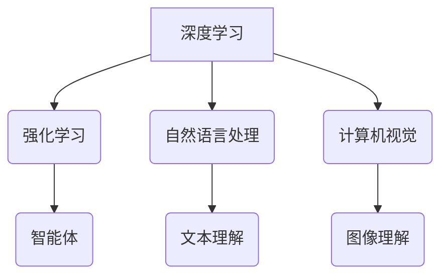

> 人工智能，深度学习，强化学习，自然语言处理，计算机视觉，伦理问题，未来趋势

## 1. 背景介绍

人工智能（AI）正以惊人的速度发展，从简单的规则系统到复杂的深度学习模型，AI已经渗透到我们生活的方方面面。从自动驾驶汽车到智能语音助手，从医疗诊断到金融交易，AI正在改变着世界。然而，我们距离真正的人工智能，即能够像人类一样思考、学习和解决问题的人工智能，还有很长的路要走。

本篇文章将探讨超越当前人工智能局限性的关键技术和挑战，展望人工智能的未来发展趋势。我们将深入探讨深度学习、强化学习、自然语言处理和计算机视觉等核心领域，并分析其背后的数学模型和算法原理。此外，我们将探讨人工智能的伦理问题和社会影响，并展望人工智能在未来可能带来的机遇和挑战。

## 2. 核心概念与联系

**2.1 深度学习**

深度学习是机器学习的一个子领域，它利用多层神经网络来模拟人类大脑的学习过程。深度学习模型能够从海量数据中自动提取特征，并学习复杂的模式和关系。

**2.2 强化学习**

强化学习是一种基于奖励机制的机器学习方法。在强化学习中，一个智能体通过与环境交互，并根据环境反馈的奖励或惩罚，学习最优的策略。

**2.3 自然语言处理**

自然语言处理（NLP）是人工智能的一个重要分支，它致力于使计算机能够理解、处理和生成人类语言。NLP技术广泛应用于机器翻译、文本摘要、情感分析和对话系统等领域。

**2.4 计算机视觉**

计算机视觉是人工智能的一个重要领域，它致力于使计算机能够“看”和理解图像和视频。计算机视觉技术广泛应用于图像识别、物体检测、场景理解和视频分析等领域。

**2.5 核心概念联系**

深度学习、强化学习、自然语言处理和计算机视觉都是人工智能的重要组成部分，它们之间相互关联，共同推动着人工智能的发展。例如，深度学习可以用于训练强化学习算法，而强化学习可以用于优化深度学习模型的性能。自然语言处理可以用于理解图像和视频中的文本信息，而计算机视觉可以用于分析自然语言中的视觉线索。



## 3. 核心算法原理 & 具体操作步骤

### 3.1 算法原理概述

深度学习算法的核心是多层神经网络。神经网络由许多相互连接的神经元组成，每个神经元接收来自其他神经元的输入，并根据这些输入进行计算，输出到其他神经元。

深度学习算法通过训练神经网络来学习数据中的模式和关系。训练过程涉及调整神经网络的权重和偏差，使网络能够准确地预测输出。

### 3.2 算法步骤详解

1. **数据预处理:** 将原始数据转换为深度学习模型可以理解的格式。这可能包括数据清洗、特征工程和数据归一化。
2. **网络结构设计:** 根据任务需求设计神经网络的结构，包括神经元的数量、连接方式和激活函数。
3. **模型训练:** 使用训练数据训练神经网络，调整网络的权重和偏差，使网络能够准确地预测输出。
4. **模型评估:** 使用测试数据评估模型的性能，并根据评估结果进行模型调优。
5. **模型部署:** 将训练好的模型部署到实际应用场景中。

### 3.3 算法优缺点

**优点:**

* 能够学习复杂的模式和关系。
* 自动提取特征，无需人工特征工程。
* 性能优于传统机器学习算法。

**缺点:**

* 需要大量的训练数据。
* 训练时间长，计算资源消耗大。
* 模型解释性差，难以理解模型的决策过程。

### 3.4 算法应用领域

* **图像识别:** 人脸识别、物体检测、图像分类。
* **自然语言处理:** 机器翻译、文本摘要、情感分析、对话系统。
* **语音识别:** 语音转文本、语音助手。
* **医疗诊断:** 病理图像分析、疾病预测。
* **金融分析:** 风险评估、欺诈检测。

## 4. 数学模型和公式 & 详细讲解 & 举例说明

### 4.1 数学模型构建

深度学习模型的核心是神经网络，神经网络可以看作是一个复杂的数学模型。每个神经元可以看作是一个简单的数学函数，该函数接收来自其他神经元的输入，并根据这些输入进行计算，输出到其他神经元。

神经网络的输出可以表示为：

$$
y = f(W x + b)
$$

其中：

* $y$ 是神经网络的输出。
* $f$ 是激活函数。
* $W$ 是权重矩阵。
* $x$ 是输入向量。
* $b$ 是偏差向量。

### 4.2 公式推导过程

深度学习模型的训练过程是通过调整权重和偏差来最小化模型的损失函数。损失函数衡量模型的预测结果与真实结果之间的差异。常用的损失函数包括均方误差（MSE）和交叉熵损失（Cross-Entropy Loss）。

**均方误差（MSE）:**

$$
MSE = \frac{1}{n} \sum_{i=1}^{n} (y_i - \hat{y}_i)^2
$$

其中：

* $n$ 是样本数量。
* $y_i$ 是真实值。
* $\hat{y}_i$ 是模型预测值。

**交叉熵损失（Cross-Entropy Loss）:**

$$
Cross-Entropy Loss = - \sum_{i=1}^{n} y_i \log(\hat{y}_i)
$$

其中：

* $n$ 是样本数量。
* $y_i$ 是真实值（one-hot编码）。
* $\hat{y}_i$ 是模型预测值（概率分布）。

### 4.3 案例分析与讲解

**图像分类:**

假设我们有一个图像分类任务，目标是将图像分类为不同的类别，例如猫、狗、鸟。我们可以使用卷积神经网络（CNN）来解决这个问题。CNN可以自动学习图像特征，并将其用于分类。

训练CNN模型的过程包括：

1. 使用大量图像数据训练模型。
2. 使用损失函数衡量模型的性能。
3. 使用优化算法调整模型的权重和偏差，以最小化损失函数。

## 5. 项目实践：代码实例和详细解释说明

### 5.1 开发环境搭建

* Python 3.x
* TensorFlow 或 PyTorch
* Jupyter Notebook

### 5.2 源代码详细实现

```python
import tensorflow as tf

# 定义模型结构
model = tf.keras.models.Sequential([
    tf.keras.layers.Conv2D(32, (3, 3), activation='relu', input_shape=(28, 28, 1)),
    tf.keras.layers.MaxPooling2D((2, 2)),
    tf.keras.layers.Conv2D(64, (3, 3), activation='relu'),
    tf.keras.layers.MaxPooling2D((2, 2)),
    tf.keras.layers.Flatten(),
    tf.keras.layers.Dense(10, activation='softmax')
])

# 编译模型
model.compile(optimizer='adam',
              loss='sparse_categorical_crossentropy',
              metrics=['accuracy'])

# 训练模型
model.fit(x_train, y_train, epochs=5)

# 评估模型
loss, accuracy = model.evaluate(x_test, y_test)
print('Test loss:', loss)
print('Test accuracy:', accuracy)
```

### 5.3 代码解读与分析

这段代码定义了一个简单的卷积神经网络模型，用于图像分类任务。

* `tf.keras.models.Sequential` 创建了一个顺序模型，即层级结构。
* `tf.keras.layers.Conv2D` 定义了一个卷积层，用于学习图像特征。
* `tf.keras.layers.MaxPooling2D` 定义了一个最大池化层，用于降维和提高模型的鲁棒性。
* `tf.keras.layers.Flatten` 将多维特征转换为一维向量。
* `tf.keras.layers.Dense` 定义了一个全连接层，用于分类。
* `model.compile` 编译模型，指定优化器、损失函数和评价指标。
* `model.fit` 训练模型，使用训练数据进行训练。
* `model.evaluate` 评估模型，使用测试数据评估模型的性能。

### 5.4 运行结果展示

训练完成后，我们可以使用测试数据评估模型的性能。输出结果会显示测试集上的损失值和准确率。

## 6. 实际应用场景

### 6.1 自动驾驶

深度学习算法被广泛应用于自动驾驶汽车中，用于图像识别、物体检测、路径规划和决策控制等方面。

### 6.2 医疗诊断

深度学习算法可以用于分析医学图像，例如X光片、CT扫描和MRI扫描，辅助医生进行疾病诊断。

### 6.3 金融分析

深度学习算法可以用于金融风险评估、欺诈检测和投资预测等方面。

### 6.4 未来应用展望

人工智能技术将继续发展，并在更多领域得到应用。例如，人工智能可以用于个性化教育、智能家居、精准医疗和科学研究等方面。

## 7. 工具和资源推荐

### 7.1 学习资源推荐

* **书籍:**
    * 深度学习 (Deep Learning) - Ian Goodfellow, Yoshua Bengio, Aaron Courville
    * 人工智能：一种现代方法 (Artificial Intelligence: A Modern Approach) - Stuart Russell, Peter Norvig
* **在线课程:**
    * Coursera: 深度学习 Specialization
    * Udacity: 
    * fast.ai: Practical Deep Learning for Coders

### 7.2 开发工具推荐

* **TensorFlow:** 开源深度学习框架
* **PyTorch:** 开源深度学习框架
* **Keras:** 高级深度学习API

### 7.3 相关论文推荐

* **ImageNet Classification with Deep Convolutional Neural Networks** - Alex Krizhevsky, Ilya Sutskever, Geoffrey E. Hinton
* **Attention Is All You Need** - Ashish Vaswani, Noam Shazeer, Niki Parmar, Jakob Uszkoreit, Llion Jones, Aidan N. Gomez, Łukasz Kaiser, Illia Polosukhin

## 8. 总结：未来发展趋势与挑战

### 8.1 研究成果总结

近年来，人工智能取得了显著的进展，特别是深度学习领域。深度学习算法在图像识别、自然语言处理、语音识别等领域取得了突破性的成果。

### 8.2 未来发展趋势

* **更强大的模型:** 研究人员正在开发更强大的深度学习模型，例如Transformer模型和生成对抗网络（GAN）。
* **更广泛的应用:** 人工智能技术将应用于更多领域，例如医疗保健、教育、金融和制造业。
* **更强的解释性:** 研究人员正在开发更具解释性的深度学习模型，以便更好地理解模型的决策过程。

### 8.3 面临的挑战

* **数据隐私和安全:** 人工智能模型需要大量数据进行训练，这可能会导致数据隐私和安全问题。
* **算法偏见:** 人工智能模型可能会学习到数据中的偏见，从而导致不公平的结果。
* **伦理问题:** 人工智能技术的发展引发了许多伦理问题，例如人工智能的责任和人工智能的控制。

### 8.4 研究展望

未来，人工智能研究将继续探索更强大的模型、更广泛的应用和更强的解释性。同时，研究人员也将致力于解决人工智能面临的挑战，确保人工智能技术能够安全、公平地发展。

## 9. 附录：常见问题与解答

**Q1: 深度学习和机器学习有什么区别？**

**A1:** 机器学习是人工智能的一个子领域，它旨在让计算机从数据中学习，而无需明确编程。深度学习是机器学习的一个子领域，它