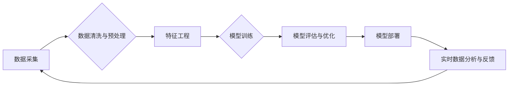

> 数据驱动，软件架构，机器学习，深度学习，人工智能，数据分析，云计算

## 1. 背景介绍

软件行业正处于一个前所未有的变革时期。传统的软件开发模式，以人为中心，依赖于人工设计和编码，正在被数据驱动的新模式所取代。随着大数据、云计算、人工智能等技术的蓬勃发展，软件的开发、部署和维护都开始依赖于海量数据。

数据驱动软件的时代，软件不再仅仅是代码的集合，而是一个能够从数据中学习、进化和自适应的智能系统。它能够根据用户行为、市场趋势和环境变化，自动调整自身功能和性能，从而提供更加个性化、智能化和高效的服务。

## 2. 核心概念与联系

### 2.1 数据驱动

数据驱动是指利用数据来指导软件的开发、设计和运营。在数据驱动软件中，数据是至关重要的资源，它可以用来：

* **了解用户需求:** 通过分析用户行为数据，软件可以更好地理解用户的需求和偏好，从而开发出更符合用户期望的软件。
* **优化软件性能:** 通过监控软件运行数据，可以及时发现性能瓶颈，并进行优化，从而提高软件的效率和稳定性。
* **预测未来趋势:** 通过分析历史数据，软件可以预测未来的趋势，例如用户行为变化、市场需求变化等，从而帮助企业做出更明智的决策。

### 2.2 软件架构

软件架构是指软件系统的高层结构设计，它定义了软件系统的主要组件、它们的相互关系以及它们之间的通信方式。在数据驱动软件时代，软件架构需要更加灵活、可扩展和可维护，以适应不断变化的数据流和业务需求。

### 2.3 机器学习

机器学习是人工智能的一个分支，它通过算法训练模型，使模型能够从数据中学习并做出预测或决策。在数据驱动软件中，机器学习算法可以用来：

* **个性化推荐:** 根据用户的历史行为数据，推荐用户可能感兴趣的内容或服务。
* **欺诈检测:** 通过分析用户行为数据，识别潜在的欺诈行为。
* **故障预测:** 通过分析软件运行数据，预测软件可能出现的故障，并采取预防措施。

### 2.4 深度学习

深度学习是机器学习的一个子领域，它使用多层神经网络来模拟人类大脑的学习过程。深度学习算法能够处理更复杂的数据，并取得更优异的性能。在数据驱动软件中，深度学习算法可以用来：

* **图像识别:** 从图像中识别物体、场景或人物。
* **自然语言处理:** 理解和生成人类语言。
* **语音识别:** 将语音转换为文本。

**数据驱动软件架构流程图**



## 3. 核心算法原理 & 具体操作步骤

### 3.1 算法原理概述

数据驱动软件的核心算法原理是利用机器学习和深度学习算法从数据中学习，并根据学习到的知识做出预测或决策。这些算法可以分为监督学习、无监督学习和强化学习三大类。

* **监督学习:** 利用标记数据训练模型，使模型能够根据输入数据预测输出结果。例如，分类问题（判断数据属于哪个类别）和回归问题（预测连续数值）。
* **无监督学习:** 利用未标记数据训练模型，使模型能够发现数据中的隐藏模式或结构。例如，聚类问题（将数据分成若干个类别）和降维问题（将高维数据降维到低维）。
* **强化学习:** 利用奖励机制训练模型，使模型能够在环境中学习最优策略。例如，游戏AI和机器人控制。

### 3.2 算法步骤详解

以下以监督学习为例，详细说明其算法步骤：

1. **数据收集:** 收集与目标任务相关的训练数据。
2. **数据预处理:** 对收集到的数据进行清洗、转换和特征工程，使其适合模型训练。
3. **模型选择:** 根据任务类型和数据特点选择合适的机器学习模型。
4. **模型训练:** 利用训练数据训练模型，调整模型参数，使其能够准确预测输出结果。
5. **模型评估:** 利用测试数据评估模型的性能，例如准确率、召回率、F1-score等。
6. **模型优化:** 根据评估结果，调整模型参数或选择其他模型，提高模型性能。
7. **模型部署:** 将训练好的模型部署到实际应用环境中，用于预测或决策。

### 3.3 算法优缺点

**优点:**

* **自动化:** 机器学习算法能够自动从数据中学习，无需人工干预。
* **精准度:** 机器学习算法能够根据数据特征，做出更加精准的预测或决策。
* **可扩展性:** 机器学习算法能够处理海量数据，并随着数据量的增加而提高性能。

**缺点:**

* **数据依赖:** 机器学习算法的性能依赖于训练数据的质量和数量。
* **黑盒效应:** 一些机器学习算法的内部工作机制难以理解，难以解释其决策结果。
* **计算资源:** 训练复杂的机器学习模型需要大量的计算资源。

### 3.4 算法应用领域

机器学习和深度学习算法在各个领域都有广泛的应用，例如：

* **医疗保健:** 疾病诊断、药物研发、患者个性化治疗。
* **金融服务:** 欺诈检测、风险评估、投资决策。
* **电商:** 商品推荐、用户画像、精准营销。
* **交通运输:** 自动驾驶、交通流量预测、物流优化。

## 4. 数学模型和公式 & 详细讲解 & 举例说明

### 4.1 数学模型构建

在数据驱动软件中，数学模型是描述数据关系和预测结果的工具。常见的数学模型包括线性回归模型、逻辑回归模型、支持向量机模型、决策树模型等。

**线性回归模型**

线性回归模型假设数据之间存在线性关系，可以用以下公式表示：

$$y = w_0 + w_1x_1 + w_2x_2 + ... + w_nx_n + \epsilon$$

其中：

* $y$ 是预测结果
* $w_0, w_1, w_2, ..., w_n$ 是模型参数
* $x_1, x_2, ..., x_n$ 是输入特征
* $\epsilon$ 是误差项

**举例说明:**

假设我们要预测房屋价格，输入特征包括房屋面积、房间数量、地理位置等。我们可以使用线性回归模型建立一个数学模型，将这些特征与房屋价格进行关联。

### 4.2 公式推导过程

模型参数的求解可以通过最小二乘法等优化算法实现。最小二乘法目标是找到一组参数，使得模型预测结果与实际结果之间的误差最小。

### 4.3 案例分析与讲解

通过对实际案例的分析，可以更好地理解数学模型的应用和局限性。例如，在预测房价的案例中，如果数据存在非线性关系，线性回归模型的预测结果可能不准确。此时，需要使用更复杂的模型，例如决策树模型或神经网络模型。

## 5. 项目实践：代码实例和详细解释说明

### 5.1 开发环境搭建

数据驱动软件的开发环境通常包括以下组件：

* **编程语言:** Python、Java、C++等
* **机器学习库:** scikit-learn、TensorFlow、PyTorch等
* **数据存储:** 数据库、文件系统、云存储等
* **云计算平台:** AWS、Azure、GCP等

### 5.2 源代码详细实现

以下是一个使用Python和scikit-learn库实现线性回归模型的代码示例：

```python
from sklearn.linear_model import LinearRegression
from sklearn.model_selection import train_test_split
import numpy as np

# 生成示例数据
X = np.array([[1], [2], [3], [4], [5]])
y = np.array([2, 4, 5, 4, 5])

# 将数据分成训练集和测试集
X_train, X_test, y_train, y_test = train_test_split(X, y, test_size=0.2)

# 创建线性回归模型
model = LinearRegression()

# 训练模型
model.fit(X_train, y_train)

# 预测测试集结果
y_pred = model.predict(X_test)

# 打印预测结果
print(y_pred)
```

### 5.3 代码解读与分析

这段代码首先生成了一些示例数据，然后将数据分成训练集和测试集。接着，创建了一个线性回归模型，并使用训练集训练模型。最后，使用训练好的模型预测测试集结果，并打印预测结果。

### 5.4 运行结果展示

运行这段代码后，会输出测试集结果的预测值。

## 6. 实际应用场景

### 6.1 个性化推荐系统

数据驱动软件在个性化推荐系统中发挥着重要作用。例如，电商平台可以根据用户的浏览历史、购买记录和评分等数据，推荐用户可能感兴趣的商品。

### 6.2 欺诈检测系统

金融机构可以使用数据驱动软件构建欺诈检测系统，通过分析用户的交易行为、账户信息和设备信息等数据，识别潜在的欺诈行为。

### 6.3 智能客服系统

数据驱动软件可以用于构建智能客服系统，通过自然语言处理技术，理解用户的咨询需求，并提供自动化的回复。

### 6.4 未来应用展望

随着数据量的不断增长和人工智能技术的不断发展，数据驱动软件将在未来发挥更加重要的作用。例如，在医疗保健领域，数据驱动软件可以帮助医生进行更精准的诊断和治疗；在交通运输领域，数据驱动软件可以帮助实现自动驾驶和智能交通管理。

## 7. 工具和资源推荐

### 7.1 学习资源推荐

* **书籍:**
    * 《Python机器学习》
    * 《深度学习》
    * 《数据科学实战》
* **在线课程:**
    * Coursera
    * edX
    * Udacity

### 7.2 开发工具推荐

* **编程语言:** Python
* **机器学习库:** scikit-learn、TensorFlow、PyTorch
* **数据存储:** MySQL、MongoDB、Redis
* **云计算平台:** AWS、Azure、GCP

### 7.3 相关论文推荐

* **机器学习:**
    * 《Support Vector Machines》
    * 《Deep Learning》
* **深度学习:**
    * 《ImageNet Classification with Deep Convolutional Neural Networks》
    * 《Attention Is All You Need》

## 8. 总结：未来发展趋势与挑战

### 8.1 研究成果总结

数据驱动软件的开发和应用取得了显著的成果，在各个领域都发挥着越来越重要的作用。机器学习和深度学习算法的不断发展，为数据驱动软件的应用提供了强大的技术支撑。

### 8.2 未来发展趋势

* **模型更加智能化:** 未来，数据驱动软件的模型将更加智能化，能够更好地理解和处理复杂数据，并做出更精准的预测或决策。
* **应用场景更加广泛:** 数据驱动软件的应用场景将更加广泛，覆盖更多领域，例如医疗保健、教育、金融等。
* **数据安全和隐私保护:** 随着数据驱动软件的应用越来越广泛，数据安全和隐私保护将成为更加重要的挑战。

### 8.3 面临的挑战

* **数据质量:** 数据驱动软件的性能依赖于数据质量，如何保证数据的准确性和完整性是一个重要的挑战。
* **算法解释性:** 一些机器学习算法的内部工作机制难以理解，如何提高算法的解释性是一个重要的研究方向。
* **数据伦理:** 数据驱动软件的应用可能会带来一些伦理问题，例如算法偏见、数据滥用等，需要认真思考和解决。

### 8.4 研究展望

未来，数据驱动软件的研究将继续朝着更加智能化、自动化和可解释的方向发展。同时，还需要关注数据安全、隐私保护和伦理问题，确保数据驱动软件的健康发展。

##