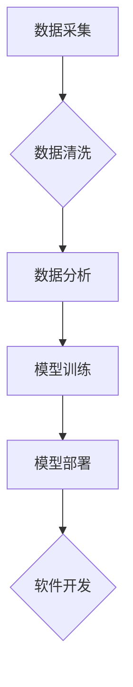

> 数据驱动开发，机器学习，深度学习，人工智能，软件架构，软件工程，数据分析

## 1. 背景介绍

软件开发行业正经历着前所未有的变革。传统的软件开发模式，以人为中心，依赖于程序员的经验和手工编码，在面对海量数据和复杂业务场景时显得越来越捉襟见肘。数据驱动开发 (Data-Driven Development) 应运而生，它将数据作为核心驱动力，利用机器学习和人工智能等技术，实现软件开发的自动化、智能化和高效化。

数据驱动开发的核心思想是：

* **以数据为中心：** 将数据视为软件开发的基石，从数据收集、清洗、分析到模型训练和应用，贯穿整个软件开发生命周期。
* **自动化开发：** 利用机器学习和人工智能技术，自动生成代码、测试用例和文档，减少人工干预，提高开发效率。
* **智能化决策：** 基于数据分析和模型预测，为软件设计、开发和维护提供数据支持，实现更智能化的决策。

## 2. 核心概念与联系

数据驱动开发的核心概念包括：

* **数据采集：** 从各种数据源收集相关数据，包括用户行为数据、传感器数据、市场数据等。
* **数据清洗：** 对收集到的数据进行清洗和预处理，去除噪声、缺失值和重复数据，保证数据质量。
* **数据分析：** 利用统计学、机器学习等方法对数据进行分析，挖掘数据中的潜在规律和价值。
* **模型训练：** 基于数据分析结果，构建机器学习模型，例如分类模型、回归模型、推荐模型等。
* **模型部署：** 将训练好的模型部署到软件系统中，实现数据驱动的功能。

数据驱动开发的流程可以概括为以下步骤：



## 3. 核心算法原理 & 具体操作步骤

### 3.1  算法原理概述

数据驱动开发的核心算法主要包括机器学习和深度学习算法。

* **机器学习算法：** 是一种通过学习数据样本，建立预测模型的算法。常见的机器学习算法包括线性回归、逻辑回归、决策树、支持向量机、k近邻算法等。

* **深度学习算法：** 是一种基于多层神经网络的机器学习算法，能够学习更复杂的特征和模式。常见的深度学习算法包括卷积神经网络 (CNN)、循环神经网络 (RNN)、生成对抗网络 (GAN) 等。

### 3.2  算法步骤详解

**机器学习算法的步骤：**

1. **数据预处理：** 对数据进行清洗、转换和特征工程，使其适合机器学习算法的训练。
2. **模型选择：** 根据具体任务选择合适的机器学习算法。
3. **模型训练：** 利用训练数据训练模型，调整模型参数，使其能够准确预测目标变量。
4. **模型评估：** 利用测试数据评估模型的性能，例如准确率、召回率、F1-score 等。
5. **模型调优：** 根据模型评估结果，调整模型参数或选择其他算法，提高模型性能。
6. **模型部署：** 将训练好的模型部署到软件系统中，实现数据驱动的功能。

**深度学习算法的步骤：**

1. **数据预处理：** 对数据进行清洗、转换和特征工程，使其适合深度学习算法的训练。
2. **网络结构设计：** 根据具体任务设计深度神经网络的结构，包括层数、节点数、激活函数等。
3. **模型训练：** 利用训练数据训练深度神经网络，调整网络参数，使其能够准确预测目标变量。
4. **模型评估：** 利用测试数据评估模型的性能，例如准确率、召回率、F1-score 等。
5. **模型调优：** 根据模型评估结果，调整网络结构或训练参数，提高模型性能。
6. **模型部署：** 将训练好的深度神经网络部署到软件系统中，实现数据驱动的功能。

### 3.3  算法优缺点

**机器学习算法：**

* **优点：** 算法相对简单，易于理解和实现，训练速度较快。
* **缺点：** 难以学习复杂特征，对数据质量要求较高，模型解释性较差。

**深度学习算法：**

* **优点：** 能够学习复杂特征，对数据质量要求相对较低，模型性能优异。
* **缺点：** 算法复杂，训练时间长，对硬件资源要求高，模型解释性较差。

### 3.4  算法应用领域

机器学习和深度学习算法广泛应用于软件开发领域，例如：

* **代码生成：** 利用机器学习算法自动生成代码，提高开发效率。
* **代码修复：** 利用机器学习算法自动修复代码错误，提高代码质量。
* **测试用例生成：** 利用机器学习算法自动生成测试用例，提高测试覆盖率。
* **软件缺陷预测：** 利用机器学习算法预测软件缺陷，提高软件可靠性。
* **软件推荐：** 利用机器学习算法推荐合适的软件，提高用户体验。

## 4. 数学模型和公式 & 详细讲解 & 举例说明

### 4.1  数学模型构建

数据驱动开发的核心是构建数学模型，将数据和业务逻辑映射到可预测的输出。常见的数学模型包括：

* **线性回归模型：** 用于预测连续变量，假设目标变量与输入变量之间存在线性关系。

* **逻辑回归模型：** 用于预测分类变量，假设目标变量与输入变量之间存在逻辑关系。

* **决策树模型：** 用于分类或回归，通过一系列决策规则将数据划分为不同的类别或预测不同的值。

* **支持向量机模型：** 用于分类，通过寻找最佳超平面将数据划分为不同的类别。

### 4.2  公式推导过程

**线性回归模型的公式：**

$$
y = \beta_0 + \beta_1x_1 + \beta_2x_2 + ... + \beta_nx_n + \epsilon
$$

其中：

* $y$ 是目标变量
* $x_1, x_2, ..., x_n$ 是输入变量
* $\beta_0, \beta_1, \beta_2, ..., \beta_n$ 是模型参数
* $\epsilon$ 是误差项

**逻辑回归模型的公式：**

$$
p(y=1|x) = \frac{1}{1 + e^{-( \beta_0 + \beta_1x_1 + \beta_2x_2 + ... + \beta_nx_n )}}
$$

其中：

* $p(y=1|x)$ 是给定输入变量 $x$ 时，目标变量 $y$ 为 1 的概率
* $\beta_0, \beta_1, \beta_2, ..., \beta_n$ 是模型参数

### 4.3  案例分析与讲解

**案例：预测房价**

假设我们想要预测房屋的价格，可以使用线性回归模型。输入变量包括房屋面积、房间数、楼层数等，目标变量是房屋价格。

我们可以收集大量房屋数据，并使用线性回归模型训练出一个预测模型。然后，我们可以输入新的房屋信息，例如面积、房间数、楼层数等，模型就可以预测该房屋的价格。

## 5. 项目实践：代码实例和详细解释说明

### 5.1  开发环境搭建

数据驱动开发项目可以使用 Python 语言和相关的机器学习库，例如 scikit-learn、TensorFlow、PyTorch 等。

### 5.2  源代码详细实现

以下是一个使用 scikit-learn 库实现线性回归模型的代码示例：

```python
from sklearn.linear_model import LinearRegression
from sklearn.model_selection import train_test_split
from sklearn.metrics import mean_squared_error

# 加载数据
data = ...

# 将数据分为特征和目标变量
X = data[['面积', '房间数', '楼层数']]
y = data['价格']

# 将数据分为训练集和测试集
X_train, X_test, y_train, y_test = train_test_split(X, y, test_size=0.2)

# 创建线性回归模型
model = LinearRegression()

# 训练模型
model.fit(X_train, y_train)

# 预测测试集数据
y_pred = model.predict(X_test)

# 计算模型性能
mse = mean_squared_error(y_test, y_pred)
print(f'Mean Squared Error: {mse}')
```

### 5.3  代码解读与分析

* **数据加载：** 首先需要加载数据，例如从 CSV 文件中读取数据。
* **特征和目标变量分离：** 将数据分为特征和目标变量，特征用于训练模型，目标变量用于评估模型性能。
* **数据分割：** 将数据分为训练集和测试集，训练集用于训练模型，测试集用于评估模型性能。
* **模型创建：** 创建线性回归模型实例。
* **模型训练：** 使用训练集数据训练模型，调整模型参数。
* **模型预测：** 使用训练好的模型预测测试集数据。
* **模型性能评估：** 使用测试集数据评估模型性能，例如计算均方误差 (MSE)。

### 5.4  运行结果展示

运行上述代码后，会输出模型的均方误差值，该值越小，模型的预测性能越好。

## 6. 实际应用场景

数据驱动开发已经应用于各个领域，例如：

* **金融领域：** 预测股票价格、识别欺诈交易、评估客户信用风险。
* **医疗领域：** 诊断疾病、预测患者风险、个性化医疗方案。
* **电商领域：** 商品推荐、用户画像、精准营销。
* **制造业领域：** 预测设备故障、优化生产流程、质量控制。

### 6.4  未来应用展望

数据驱动开发的未来应用前景广阔，随着人工智能技术的不断发展，数据驱动开发将更加智能化、自动化和个性化。

## 7. 工具和资源推荐

### 7.1  学习资源推荐

* **书籍：**
    * 《Python机器学习》
    * 《深度学习》
    * 《数据科学实战》
* **在线课程：**
    * Coursera
    * edX
    * Udacity

### 7.2  开发工具推荐

* **Python：** 
* **scikit-learn：** 机器学习库
* **TensorFlow：** 深度学习库
* **PyTorch：** 深度学习库
* **Jupyter Notebook：** 数据分析和可视化工具

### 7.3  相关论文推荐

* **《机器学习》**
* **《深度学习》**
* **《数据驱动软件开发》**

## 8. 总结：未来发展趋势与挑战

### 8.1  研究成果总结

数据驱动开发已经取得了显著的成果，在软件开发领域带来了革命性的变革。

### 8.2  未来发展趋势

* **更智能的模型：** 随着人工智能技术的进步，数据驱动开发模型将更加智能化，能够学习更复杂的特征和模式。
* **更自动化开发：** 数据驱动开发将更加自动化，减少人工干预，提高开发效率。
* **更个性化的体验：** 数据驱动开发将能够提供更个性化的软件体验，满足用户的个性化需求。

### 8.3  面临的挑战

* **数据质量问题：** 数据驱动开发依赖于高质量的数据，而现实世界的数据往往存在噪声、缺失值和不一致性等问题。
* **模型解释性问题：** 许多深度学习模型的内部机制难以理解，这使得模型的决策难以解释和信任。
* **伦理问题：** 数据驱动开发可能会带来一些伦理问题，例如数据隐私、算法偏见等。

### 8.4  研究展望

未来，数据驱动开发的研究将继续深入，解决上述挑战，推动数据驱动开发技术的发展和应用。

## 9. 附录：常见