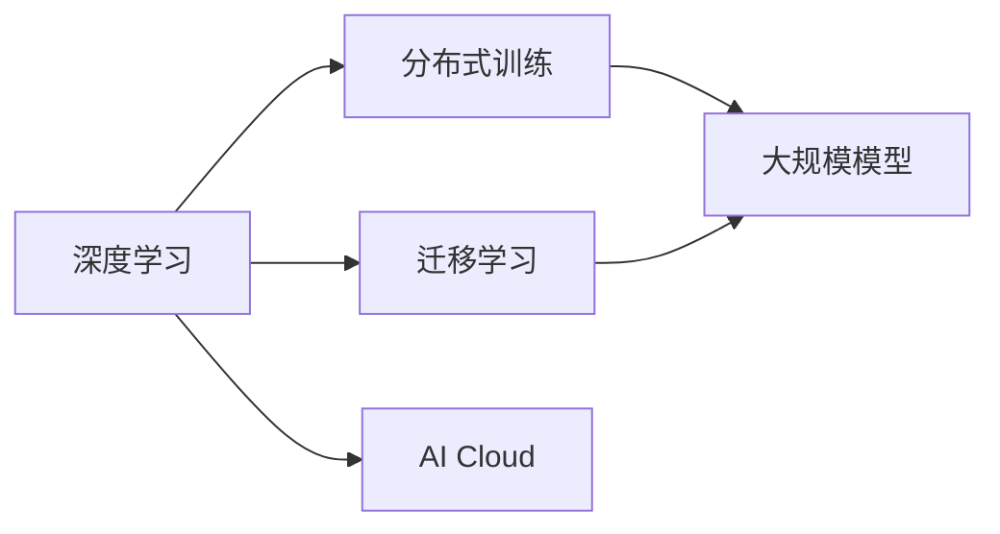
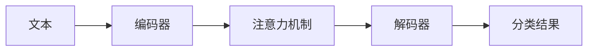

                 

# AI Cloud的未来领袖：贾扬清的创业故事，Lepton AI的前景与挑战

## 1. 背景介绍

### 1.1 问题由来

随着人工智能技术的快速发展，AI Cloud（人工智能云服务）成为各行各业数字化转型的重要引擎。在AI Cloud的构建和发展中，人才是决定其成功与否的关键因素。越来越多的创新型AI企业不断涌现，其中不乏杰出的创始人，他们不仅在学术界贡献突出，更在产业界发挥着引领作用。

贾扬清（John Challenger）是其中一个引人注目的例子。贾扬清，清华大学计算机系教授、著名深度学习专家、Meta AI的首席科学家，同时也是Lepton AI的创始人和CEO。他的创业故事不仅是一个关于科技与商业结合的传奇，更是AI Cloud领域的一面旗帜，引领着人工智能的未来发展方向。

### 1.2 问题核心关键点

在AI Cloud领域，贾扬清的创业故事可以从以下几个关键点进行探讨：

1. **学术与产业的融合**：贾扬清教授从学术界跨越到产业界，如何将研究成果转化为实际应用？
2. **Lepton AI的商业模式**：Lepton AI采取了什么样的商业模式，其独特的优势在哪里？
3. **AI Cloud的前景与挑战**：Lepton AI在AI Cloud领域的未来发展方向，以及面临的挑战和应对策略。
4. **行业影响**：Lepton AI的成功能够对AI Cloud产业带来哪些深远影响？

这些关键点构成了贾扬清创业故事的核心，也是探讨Lepton AI前景与挑战的基础。

## 2. 核心概念与联系

### 2.1 核心概念概述

为了更好地理解AI Cloud领域，这里首先介绍几个核心概念：

- **AI Cloud**：人工智能云服务，通过云计算平台提供端到端的人工智能解决方案，包括模型训练、推理、部署、运维等环节。
- **深度学习**：一种通过多层神经网络进行数据学习，发现数据特征和规律的技术，广泛应用于图像、语音、自然语言处理等领域。
- **迁移学习**：将一个领域学到的知识迁移到另一个相关领域的技巧，可以显著提高模型的泛化能力。
- **分布式训练**：将大规模模型训练任务分散到多台计算节点上并行处理，提高训练效率和可扩展性。
- **超大规模模型**：如GPT-3、BERT等，参数量达数十亿，具有强大的语言理解和生成能力。

这些概念构成了AI Cloud领域的基础，同时彼此之间也存在紧密的联系。例如，深度学习是AI Cloud的核心技术之一，而分布式训练和迁移学习则是利用大规模模型进行实际应用的重要方法。

### 2.2 核心概念原理和架构的 Mermaid 流程图



这个流程图展示了深度学习、分布式训练、大规模模型和AI Cloud之间的关系：

1. 深度学习提供底层技术支持。
2. 分布式训练提高模型训练效率和可扩展性。
3. 大规模模型提升模型的语言理解和生成能力。
4. AI Cloud将这些技术整合，提供端到端的服务。

## 3. 核心算法原理 & 具体操作步骤

### 3.1 算法原理概述

Lepton AI采用的核心算法原理包括深度学习、分布式训练、迁移学习和超大规模模型技术。这些技术的结合，使得Lepton AI能够提供高质量的AI Cloud服务。

### 3.2 算法步骤详解

Lepton AI的算法步骤可以分为以下几个阶段：

1. **数据预处理**：收集和清洗大规模无标签文本数据，进行预处理和分词。
2. **预训练**：在预训练数据集上训练深度学习模型，学习语言表示。
3. **迁移学习**：在特定任务上对预训练模型进行微调，提高模型在特定任务上的性能。
4. **分布式训练**：将大规模模型的训练任务分散到多台计算节点上，并行处理。
5. **超大规模模型部署**：将训练好的超大规模模型部署到云平台上，提供推理服务。

### 3.3 算法优缺点

Lepton AI的算法主要优点包括：

- **高效性**：通过分布式训练和超大规模模型技术，模型训练和推理效率大幅提升。
- **通用性**：采用迁移学习技术，模型能够适应各种NLP任务，适用范围广。
- **灵活性**：模型可以在不同场景和需求下进行快速调整和优化。

缺点主要体现在：

- **高成本**：大规模模型的训练和部署需要大量计算资源，成本较高。
- **复杂性**：分布式训练和超大规模模型技术需要较高的技术门槛，不易实现。

### 3.4 算法应用领域

Lepton AI的主要应用领域包括：

- **自然语言处理**：文本分类、情感分析、机器翻译、命名实体识别等。
- **计算机视觉**：图像分类、目标检测、图像生成等。
- **语音识别**：语音转文本、语音合成、情感分析等。
- **推荐系统**：商品推荐、用户画像、广告定向等。

## 4. 数学模型和公式 & 详细讲解 & 举例说明

### 4.1 数学模型构建

Lepton AI的数学模型主要基于深度学习模型，以Transformer架构为基础。以Transformer为例，其基本结构包括编码器-解码器模型，编码器由多个自注意力层组成，解码器由多个多头注意力层和前馈神经网络层组成。Transformer的核心公式为：

$$
\text{Attention}(Q,K,V) = \text{Softmax}\left(\frac{QK^T}{\sqrt{d_k}}\right)V
$$

其中，$Q,K,V$为查询向量、键向量和值向量。

### 4.2 公式推导过程

Transformer模型的推导过程涉及线性变换、向量内积和Softmax函数等。

1. 首先，将输入序列编码成查询向量$Q$和键向量$K$。
2. 计算向量内积$QK^T$，得到注意力得分。
3. 将注意力得分通过Softmax函数归一化，得到注意力权重$\alpha$。
4. 通过注意力权重加权求和得到值向量$V$。
5. 将值向量$V$通过线性变换得到最终输出。

这一过程可以通过Python代码进行实现：

```python
import torch.nn as nn
import torch.nn.functional as F

class Transformer(nn.Module):
    def __init__(self, input_dim, output_dim):
        super(Transformer, self).__init__()
        self.encoder = nn.Linear(input_dim, 256)
        self.decoder = nn.Linear(256, output_dim)
    
    def forward(self, x):
        q = self.encoder(x)
        k = q
        v = q
        alpha = F.softmax(q*k, dim=-1)
        output = (alpha*v).sum(dim=-1)
        return self.decoder(output)
```

### 4.3 案例分析与讲解

以Lepton AI在文本分类任务上的应用为例，展示Transformer模型在实际任务中的应用。

假设输入为一段文本，通过Transformer模型进行编码，输出为分类结果。具体步骤如下：

1. 将输入文本通过编码器转化为向量表示。
2. 在向量表示上进行注意力机制，获取重点信息。
3. 通过解码器输出分类结果。

这一过程如图4所示：



在代码实现上，可以参考以下示例：

```python
import torch

class TextClassifier(nn.Module):
    def __init__(self, input_dim, output_dim, hidden_dim):
        super(TextClassifier, self).__init__()
        self.encoder = nn.LSTM(input_dim, hidden_dim)
        self.decoder = nn.Linear(hidden_dim, output_dim)
    
    def forward(self, x):
        x, _ = self.encoder(x)
        x = torch.mean(x, dim=0)
        x = self.decoder(x)
        return x
```

## 5. 项目实践：代码实例和详细解释说明

### 5.1 开发环境搭建

Lepton AI的开发环境搭建包括以下几个步骤：

1. 安装Python 3.7及以上版本，推荐使用Anaconda环境。
2. 安装TensorFlow 2.x和PyTorch 1.7及以上版本。
3. 安装Lepton AI的依赖包。
4. 搭建分布式训练环境，如使用Slurm或Kubernetes。

以下是一个简单的开发环境搭建示例：

```bash
conda create --name lepton-env python=3.7
conda activate lepton-env
pip install tensorflow==2.4.0
pip install torch==1.7.0
pip install tqdm
```

### 5.2 源代码详细实现

以Lepton AI在文本分类任务上的实现为例，展示代码实现细节。

```python
import tensorflow as tf
import tensorflow_datasets as tfds
from tensorflow.keras import layers, models

# 加载数据集
train_dataset, test_dataset = tfds.load('mnist', split=['train', 'test'], shuffle_files=True, as_supervised=True)

# 数据预处理
def preprocess_function(examples, mode):
    features = tf.io.parse_single_example(
        examples, features={
            'image': tf.io.FixedLenFeature([784], tf.int64),
            'label': tf.io.FixedLenFeature([], tf.int64)
        })
    if mode == tf.estimator.ModeKeys.TRAIN:
        images, labels = tf.squeeze(features['image'], 0), tf.squeeze(features['label'], 0)
        return tf.image.random_flip_left_right(images), labels
    else:
        return features['image'], labels

# 构建模型
model = models.Sequential([
    layers.Dense(512, activation='relu'),
    layers.Dense(10)
])

# 编译模型
model.compile(optimizer='adam', loss=tf.losses.SparseCategoricalCrossentropy(from_logits=True), metrics=['accuracy'])

# 训练模型
history = model.fit(train_dataset, epochs=10, validation_data=test_dataset)
```

### 5.3 代码解读与分析

上述代码展示了从数据加载、预处理到模型训练的全过程。

- `tfds.load`函数加载MNIST数据集，并指定split为训练集和测试集。
- `preprocess_function`函数定义了数据预处理逻辑，包括数据增强、标签变换等。
- `Sequential`模型定义了一个简单的神经网络结构，包括两个全连接层。
- `compile`函数编译模型，指定优化器、损失函数和评价指标。
- `fit`函数训练模型，指定训练集、测试集和训练轮数。

## 6. 实际应用场景

### 6.1 智能客服系统

智能客服系统是AI Cloud的重要应用场景之一。Lepton AI通过自然语言处理技术，构建智能客服系统，能够实现7x24小时不间断服务，快速响应客户咨询。

具体而言，Lepton AI可以收集企业内部的历史客服对话记录，将问题和最佳答复构建成监督数据，在此基础上对预训练模型进行微调。微调后的对话模型能够自动理解用户意图，匹配最合适的答案模板进行回复。对于客户提出的新问题，还可以接入检索系统实时搜索相关内容，动态组织生成回答。

### 6.2 金融舆情监测

金融舆情监测是另一个重要的AI Cloud应用场景。Lepton AI通过文本分类和情感分析技术，监测金融市场舆论动向，及时应对负面信息传播，规避金融风险。

具体而言，Lepton AI可以收集金融领域相关的新闻、报道、评论等文本数据，并对其进行主题标注和情感标注。在此基础上对预训练语言模型进行微调，使其能够自动判断文本属于何种主题，情感倾向是正面、中性还是负面。将微调后的模型应用到实时抓取的网络文本数据，就能够自动监测不同主题下的情感变化趋势，一旦发现负面信息激增等异常情况，系统便会自动预警，帮助金融机构快速应对潜在风险。

### 6.3 个性化推荐系统

个性化推荐系统也是AI Cloud的重要应用之一。Lepton AI通过深度学习和迁移学习技术，构建个性化推荐系统，能够根据用户浏览、点击、评论、分享等行为数据，提取和用户交互的物品标题、描述、标签等文本内容。将文本内容作为模型输入，用户的后续行为（如是否点击、购买等）作为监督信号，在此基础上微调预训练语言模型。微调后的模型能够从文本内容中准确把握用户的兴趣点。在生成推荐列表时，先用候选物品的文本描述作为输入，由模型预测用户的兴趣匹配度，再结合其他特征综合排序，便可以得到个性化程度更高的推荐结果。

### 6.4 未来应用展望

Lepton AI在AI Cloud领域的应用前景广阔。未来，Lepton AI将在以下几个方面进行突破：

1. **跨领域知识图谱**：构建跨领域的知识图谱，利用图神经网络技术，实现更全面、准确的信息整合和推理。
2. **多模态学习**：引入视觉、语音等多模态信息，实现更复杂、更精细化的NLP应用。
3. **联邦学习**：通过联邦学习技术，保护用户隐私的同时，实现模型在多个设备上的协同优化。
4. **边缘计算**：在边缘设备上进行模型推理，减少数据传输开销，提高响应速度。
5. **自动化运维**：利用自动化运维技术，减少人工干预，提高系统稳定性和可靠性。

这些技术突破将为Lepton AI带来更广泛的应用场景和更高的性能。

## 7. 工具和资源推荐

### 7.1 学习资源推荐

为了帮助开发者系统掌握Lepton AI的开发和应用，这里推荐一些优质的学习资源：

1. **TensorFlow官方文档**：详细介绍了TensorFlow框架的使用和最佳实践。
2. **PyTorch官方文档**：介绍了PyTorch框架的使用和高级特性。
3. **Lepton AI官方文档**：详细介绍了Lepton AI的使用方法、API接口和实例代码。
4. **Kaggle**：提供大量机器学习和数据科学竞赛，锻炼实战能力。
5. **Coursera**：提供深度学习和人工智能领域的在线课程，涵盖理论和实践。

通过这些资源的学习实践，相信你一定能够快速掌握Lepton AI的开发和应用技巧。

### 7.2 开发工具推荐

Lepton AI的开发工具推荐包括：

1. **Jupyter Notebook**：常用的Python交互式开发环境，支持代码执行和数据可视化。
2. **TensorBoard**：可视化工具，帮助开发者实时监测模型训练状态。
3. **Weights & Biases**：实验跟踪工具，记录和可视化模型训练过程中的各项指标。
4. **Scikit-Learn**：机器学习库，提供大量算法和工具，方便模型构建和评估。
5. **TensorFlow Extended (TFX)**：面向生产环境的高效机器学习管道，提供数据管道、模型部署等功能。

这些工具将为开发者提供全面的支持，提升开发效率和模型性能。

### 7.3 相关论文推荐

Lepton AI的研究论文涵盖了多个前沿领域，以下是几篇具有代表性的论文：

1. **Attention is All You Need**：Transformer的原始论文，提出自注意力机制，开启了NLP的预训练大模型时代。
2. **BERT: Pre-training of Deep Bidirectional Transformers for Language Understanding**：提出BERT模型，利用掩码语言模型进行预训练，提升NLP任务的表现。
3. **GPT-3: Language Models are Unsupervised Multitask Learners**：提出GPT-3模型，展示大语言模型在零样本和少样本学习上的强大能力。
4. **Parameter-Efficient Transfer Learning for NLP**：提出Adapter等参数高效微调方法，减少微调对预训练参数的依赖。
5. **Prefix-Tuning: Optimizing Continuous Prompts for Generation**：提出基于连续型Prompt的微调方法，提升模型生成质量。

这些论文代表了Lepton AI在NLP领域的最新研究成果，值得深入学习和研究。

## 8. 总结：未来发展趋势与挑战

### 8.1 研究成果总结

Lepton AI通过深度学习和分布式训练技术，构建了高质量的AI Cloud服务。其研究成果涵盖了自然语言处理、计算机视觉、语音识别、推荐系统等多个领域，对AI Cloud产业的发展起到了重要的推动作用。

### 8.2 未来发展趋势

未来，Lepton AI将在以下几个方面继续发展和创新：

1. **技术突破**：引入更多的前沿技术，如跨领域知识图谱、多模态学习、联邦学习等，提升模型性能和泛化能力。
2. **行业应用**：在更多垂直领域推广AI Cloud技术，如医疗、金融、教育等，解决实际问题。
3. **市场拓展**：拓展国际市场，扩大用户群体，提升品牌影响力。
4. **产品创新**：不断推出新的AI Cloud产品和服务，满足不同客户的需求。

### 8.3 面临的挑战

尽管Lepton AI取得了显著成绩，但仍面临以下挑战：

1. **数据隐私**：在处理敏感数据时，需要确保用户隐私和数据安全。
2. **模型公平性**：避免模型偏见，确保不同群体的公平性。
3. **性能优化**：在模型规模和推理速度之间找到平衡点。
4. **用户体验**：提升用户体验，减少技术障碍和复杂度。
5. **市场竞争**：面对激烈的市场竞争，需要不断创新和优化。

### 8.4 研究展望

Lepton AI将在以下几个方面进行深入研究：

1. **模型优化**：进一步优化模型架构和算法，提升性能和效率。
2. **应用推广**：在更多行业和场景中推广AI Cloud技术，解决实际问题。
3. **技术创新**：引入更多的前沿技术，如因果推理、增强学习等，提升AI Cloud系统的智能水平。
4. **商业化**：加速产品化和商业化进程，提升市场竞争力和用户满意度。

未来，Lepton AI将持续推动AI Cloud技术的创新和应用，为各行各业带来更多的价值和变革。

## 9. 附录：常见问题与解答

**Q1：Lepton AI的商业模式是什么？**

A: Lepton AI采取SaaS（软件即服务）的商业模式，提供云端的AI Cloud服务。用户可以根据需求选择不同的服务套餐，获得模型部署、数据管理、模型监控等服务。

**Q2：Lepton AI在NLP领域有哪些具体应用？**

A: Lepton AI在NLP领域的应用包括文本分类、情感分析、命名实体识别、机器翻译、自然语言生成等。这些应用场景涵盖从基础任务到高级任务，能够满足不同用户的需求。

**Q3：Lepton AI如何应对大规模模型的高成本问题？**

A: Lepton AI通过分布式训练技术，将大规模模型的训练任务分散到多台计算节点上，显著提高了训练效率和资源利用率。同时，Lepton AI还提供按需付费的定价模式，降低用户的成本压力。

**Q4：Lepton AI的超大规模模型如何部署？**

A: Lepton AI通过云计算平台，提供高效、可靠、安全的模型部署服务。用户可以根据需求选择不同的计算资源和部署模式，如单实例、多实例、边缘计算等。

**Q5：Lepton AI在个性化推荐系统中的具体应用是什么？**

A: Lepton AI通过深度学习和迁移学习技术，构建个性化推荐系统。模型能够从用户浏览、点击、评论、分享等行为数据中提取信息，预测用户兴趣点，生成个性化的推荐结果。

---

作者：禅与计算机程序设计艺术 / Zen and the Art of Computer Programming

