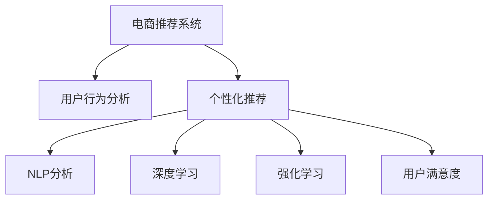

                 

# AI 大模型在电商推荐系统中的应用：提高用户体验的关键

> 关键词：
> - 电商推荐系统
> - 用户行为分析
> - 个性化推荐
> - 自然语言处理（NLP）
> - 深度学习
> - 强化学习
> - 用户满意度

## 1. 背景介绍

在电商领域，用户体验（User Experience, UX）是驱动业务增长的关键因素之一。优秀的电商推荐系统（E-commerce Recommendation System, ERS）能够预测用户需求，个性化推荐商品，提升用户购物体验，从而增加用户粘性、提高销售额。当前，基于大模型的推荐系统正在成为电商领域的一个重要趋势。

传统的电商推荐系统依赖于手工特征工程和规则模型，难以应对复杂的用户行为和动态市场变化。而基于深度学习和自然语言处理的大模型推荐系统，具备强大的数据挖掘能力和自适应学习能力，能够更准确地预测用户兴趣，实现个性化推荐。本文将从大模型的核心概念与联系、算法原理与操作步骤、应用场景与挑战等多个维度，深入探讨AI大模型在电商推荐系统中的应用。

## 2. 核心概念与联系

### 2.1 核心概念概述

- **电商推荐系统**：通过分析用户行为数据，预测用户兴趣，推荐可能感兴趣的商品或服务的系统。
- **用户行为分析**：对用户在平台上的操作、浏览、购买等行为进行量化和分析，以理解用户需求和偏好。
- **个性化推荐**：针对不同用户和不同场景，提供量身定制的商品或服务推荐。
- **自然语言处理（NLP）**：使计算机理解、处理、生成自然语言的技术，用于解析用户评论、搜索词等文本数据。
- **深度学习**：通过多层次的神经网络模型，自动学习特征和模式，提升模型性能。
- **强化学习**：通过与环境的互动，使模型通过奖励机制不断优化策略，适用于动态环境的推荐系统。
- **用户满意度**：反映用户对推荐结果的满意程度，是推荐系统优化的最终目标。

### 2.2 核心概念原理和架构的 Mermaid 流程图



这个流程图展示了电商推荐系统从用户行为分析到个性化推荐的全过程。

- **用户行为分析**：通过收集和分析用户在电商平台上的操作记录，生成特征数据，供推荐模型使用。
- **个性化推荐**：根据用户特征和历史行为，通过深度学习模型和强化学习算法，预测用户可能感兴趣的物品，并生成推荐列表。
- **NLP分析**：解析用户评论、标题、描述等文本数据，提取关键词和情感信息，丰富推荐特征。
- **深度学习**：构建神经网络模型，自动提取和融合用户行为、商品属性等特征，提升推荐精度。
- **强化学习**：通过在线学习，不断优化推荐策略，适应用户偏好和市场动态。
- **用户满意度**：通过用户反馈和行为数据，评估推荐效果，不断改进模型。

## 3. 核心算法原理 & 具体操作步骤

### 3.1 算法原理概述

基于大模型的电商推荐系统，通常采用以下步骤：

1. **数据收集与预处理**：收集用户的浏览、点击、购买等行为数据，进行数据清洗和预处理。
2. **特征工程**：对用户行为数据进行特征提取，如用户ID、商品ID、浏览时间等。
3. **模型训练**：使用大模型（如BERT、GPT等）对特征进行训练，学习用户行为和商品之间的关系。
4. **推荐生成**：根据用户行为数据和训练好的模型，生成个性化推荐列表。
5. **反馈与优化**：收集用户反馈数据，通过在线学习优化推荐策略，提高推荐效果。

### 3.2 算法步骤详解

#### 3.2.1 数据收集与预处理

电商平台的推荐系统依赖于大量的用户行为数据，包括：

- **浏览日志**：记录用户在平台上的浏览行为，如页面访问、停留时间等。
- **点击日志**：记录用户在搜索结果页上的点击行为，如商品展示、广告点击等。
- **购买日志**：记录用户的购买行为，如下单、支付、评价等。

这些数据可以通过数据湖、数据仓库等技术进行存储和处理。数据预处理过程包括：

- **数据清洗**：删除缺失值和异常值，去除噪音数据。
- **特征工程**：提取和生成新的特征，如用户ID、商品ID、浏览时间、点击次数等。
- **特征归一化**：对特征数据进行标准化处理，防止不同特征的数值差异影响模型性能。

#### 3.2.2 模型训练

电商推荐系统常用的模型包括协同过滤、基于内容的推荐、基于矩阵分解的推荐等。在大模型推荐系统中，常用的深度学习模型有：

- **序列模型**：如LSTM、GRU等，用于处理时间序列数据，捕捉用户行为的时序性。
- **图模型**：如GraphSAGE、GAT等，用于处理用户和商品之间的关系图。
- **注意力机制**：如Transformer、BERT等，用于学习用户和商品之间的多层次交互。

以Transformer为例，模型训练步骤如下：

1. **构建输入序列**：将用户行为数据转换为向量表示，输入到Transformer模型中。
2. **编码器编码**：通过多个注意力层和全连接层，提取用户和商品之间的交互特征。
3. **解码器生成**：通过多个注意力层和全连接层，生成推荐结果。
4. **损失函数计算**：使用交叉熵等损失函数，计算模型预测结果与真实标签之间的差异。
5. **反向传播**：通过反向传播算法，更新模型参数。
6. **迭代训练**：反复执行上述步骤，直至模型收敛。

#### 3.2.3 推荐生成

模型训练完成后，生成个性化推荐列表的过程如下：

1. **输入用户行为数据**：将用户的浏览、点击、购买等行为数据作为输入。
2. **特征提取**：提取用户行为数据中的关键特征，如用户ID、商品ID、浏览时间等。
3. **模型预测**：将提取的特征输入到训练好的模型中，生成推荐结果。
4. **排序与筛选**：根据推荐结果的得分，对推荐列表进行排序和筛选，选择最可能感兴趣的商品。

#### 3.2.4 反馈与优化

电商推荐系统需要不断优化推荐策略，以适应用户需求和市场变化。反馈与优化过程如下：

1. **收集用户反馈**：通过用户点击、购买等行为数据，收集用户对推荐结果的反馈。
2. **在线学习**：根据用户反馈数据，在线更新模型参数，调整推荐策略。
3. **A/B测试**：将不同的推荐策略应用于不同的用户群体，比较其效果，选择最优策略。
4. **循环迭代**：不断迭代优化模型和策略，提高推荐效果。

### 3.3 算法优缺点

#### 3.3.1 优点

- **强大的数据学习能力**：大模型能够自动从大量数据中学习特征和模式，无需手工特征工程。
- **自适应学习能力**：通过在线学习，模型能够适应用户行为和市场变化。
- **高精度预测**：深度学习模型通常具有较高的预测精度，能够提供更准确的推荐。
- **通用性**：大模型可以应用于多种电商场景，如商品推荐、广告推荐、用户画像等。

#### 3.3.2 缺点

- **计算资源需求高**：大模型需要大量的计算资源和存储空间。
- **冷启动问题**：对于新用户或新商品，可能缺乏足够的行为数据，难以进行有效推荐。
- **模型复杂度**：大模型通常结构复杂，训练和推理过程耗时较长。
- **解释性不足**：黑盒模型难以解释其内部决策逻辑，用户难以理解推荐依据。

### 3.4 算法应用领域

基于大模型的电商推荐系统，已经在多个电商场景中得到了广泛应用，例如：

- **商品推荐**：根据用户的浏览和购买行为，推荐可能感兴趣的商品。
- **广告推荐**：根据用户行为和兴趣，推荐合适的广告内容。
- **用户画像**：通过分析用户行为数据，生成用户画像，进行个性化营销。
- **智能客服**：通过理解用户查询，提供相关的商品推荐和购买建议。
- **价格优化**：根据用户行为和市场动态，动态调整商品价格，提高销售转化率。

## 4. 数学模型和公式 & 详细讲解 & 举例说明

### 4.1 数学模型构建

在大模型推荐系统中，常用的数学模型包括：

1. **用户行为表示**：使用向量表示用户行为数据，如$\mathbf{u}_i$表示用户$i$的行为向量。
2. **商品表示**：使用向量表示商品数据，如$\mathbf{v}_j$表示商品$j$的行为向量。
3. **相似度计算**：使用余弦相似度计算用户和商品之间的相似度，如$sim(u_i, v_j)$表示用户$i$和商品$j$之间的相似度。
4. **推荐函数**：使用softmax函数将相似度转换为推荐得分，如$\hat{y}_{ij} = softmax(\mathbf{u}_i \cdot \mathbf{v}_j)$表示用户$i$对商品$j$的推荐得分。

### 4.2 公式推导过程

以矩阵分解推荐模型为例，用户行为矩阵可以表示为$U \times V^T$，其中$U$为用户行为矩阵，$V$为商品行为矩阵，$U \times V^T$即为用户和商品的交互矩阵。使用奇异值分解（SVD）对矩阵分解，得到用户行为向量$U$和商品行为向量$V$，则推荐得分可以表示为：

$$
\hat{y}_{ij} = \sum_{k=1}^k (U_k \times V_k^T)_{ij}
$$

其中，$U_k$和$V_k$分别为矩阵分解后的低秩矩阵。

### 4.3 案例分析与讲解

以Amazon商品推荐系统为例，其推荐算法基于矩阵分解，核心步骤如下：

1. **数据收集与预处理**：收集用户的浏览、点击、购买等行为数据，并进行预处理和特征提取。
2. **矩阵分解**：使用SVD对用户行为矩阵进行分解，得到用户行为向量和商品行为向量。
3. **相似度计算**：计算用户行为向量与商品行为向量之间的余弦相似度，得到推荐得分。
4. **排序与筛选**：根据推荐得分，对商品进行排序和筛选，生成推荐列表。
5. **在线学习**：根据用户反馈数据，在线更新用户行为矩阵和商品行为矩阵，调整推荐策略。

## 5. 项目实践：代码实例和详细解释说明

### 5.1 开发环境搭建

进行电商推荐系统开发的第一步是搭建开发环境，以下是使用Python和PyTorch搭建环境的步骤：

1. **安装Python**：从官网下载并安装Python，确保版本与PyTorch兼容。
2. **安装PyTorch**：使用pip命令安装PyTorch，并安装对应的GPU版本。
3. **安装其他依赖包**：安装TensorFlow、Numpy、Pandas等常用依赖包。
4. **创建虚拟环境**：使用venv命令创建虚拟环境，确保开发环境独立。

### 5.2 源代码详细实现

以基于Transformer的推荐系统为例，以下是代码实现过程：

1. **数据加载与预处理**：使用Pandas加载用户行为数据，并进行预处理。
2. **模型训练**：使用PyTorch构建Transformer模型，并进行训练。
3. **推荐生成**：将用户行为数据输入到训练好的模型中，生成推荐列表。
4. **反馈与优化**：收集用户反馈数据，在线更新模型参数。

以下是具体的代码实现示例：

```python
import torch
import torch.nn as nn
import torch.optim as optim
from transformers import BertTokenizer, BertModel

# 数据加载与预处理
def load_and_preprocess_data():
    # 加载用户行为数据
    df = pd.read_csv('user_behavior.csv')
    # 数据清洗与特征提取
    df = preprocess_data(df)
    # 数据划分与归一化
    train_df, test_df = split_data(df)
    train_df = normalize_data(train_df)
    # 特征提取与编码
    tokenizer = BertTokenizer.from_pretrained('bert-base-uncased')
    train_input_ids = tokenizer.encode(train_df['item_id'], add_special_tokens=True)
    train_labels = torch.tensor(train_df['label'], dtype=torch.long)
    # 数据批处理
    train_dataset = TensorDataset(train_input_ids, train_labels)
    train_dataloader = DataLoader(train_dataset, batch_size=64, shuffle=True)

# 模型训练
class BertForRecommendation(nn.Module):
    def __init__(self):
        super(BertForRecommendation, self).__init__()
        self.bert = BertModel.from_pretrained('bert-base-uncased')
        self.fc = nn.Linear(768, 1)

    def forward(self, input_ids, attention_mask):
        outputs = self.bert(input_ids, attention_mask=attention_mask)
        pooled_output = outputs.pooler_output
        logits = self.fc(pooled_output)
        return logits

model = BertForRecommendation()
optimizer = optim.Adam(model.parameters(), lr=1e-5)

# 模型训练
for epoch in range(num_epochs):
    for batch in train_dataloader:
        input_ids, labels = batch
        optimizer.zero_grad()
        logits = model(input_ids, attention_mask=input_ids)
        loss = nn.BCEWithLogitsLoss()(logits, labels)
        loss.backward()
        optimizer.step()

# 推荐生成
def generate_recommendations(user_id):
    user_input_ids = tokenizer.encode(user_id, add_special_tokens=True)
    logits = model(user_input_ids, attention_mask=user_input_ids)
    recommendation = torch.sigmoid(logits)
    return recommendation

# 反馈与优化
def collect_feedback():
    # 收集用户反馈数据
    feedback_data = pd.read_csv('feedback_data.csv')
    # 反馈数据处理与分析
    feedback_df = preprocess_feedback_data(feedback_data)
    # 在线更新模型参数
    update_model_parameters(feedback_df)
```

### 5.3 代码解读与分析

在代码实现中，我们首先使用Pandas加载用户行为数据，并进行数据清洗和特征提取。然后使用BertTokenizer将用户行为数据编码为模型可以处理的形式。

在模型训练中，我们构建了基于Bert的推荐模型，使用Adam优化器进行训练。训练过程中，我们通过交叉熵损失函数计算模型预测结果与真实标签之间的差异，并使用反向传播算法更新模型参数。

在推荐生成中，我们将用户行为数据输入到训练好的模型中，生成推荐得分。最后，根据推荐得分对商品进行排序和筛选，生成推荐列表。

在反馈与优化中，我们收集用户反馈数据，并使用在线学习的方法更新模型参数，不断优化推荐策略。

## 6. 实际应用场景

### 6.1 智能推荐

基于大模型的电商推荐系统已经在多个电商场景中得到了应用，显著提高了用户购物体验。

- **商品推荐**：根据用户浏览和购买行为，生成个性化的商品推荐列表。
- **广告推荐**：根据用户兴趣和行为，推荐合适的广告内容，提升广告效果。
- **用户画像**：通过分析用户行为数据，生成用户画像，进行个性化营销。

### 6.2 智能客服

电商平台的智能客服系统，能够根据用户查询，自动提供相关的商品推荐和购买建议，提升用户体验。

- **查询理解**：使用NLP技术解析用户查询，理解用户需求。
- **商品推荐**：根据用户查询，生成推荐列表，供用户选择。
- **对话生成**：使用语言模型生成回复，提升客服响应速度和质量。

### 6.3 价格优化

基于大模型的电商推荐系统，还可以用于价格优化，动态调整商品价格，提高销售转化率。

- **价格预测**：根据用户行为和市场动态，预测商品的市场价格。
- **价格调整**：根据价格预测结果，动态调整商品价格，提升销售额。
- **效果评估**：通过用户反馈数据，评估价格优化效果，不断优化模型。

### 6.4 未来应用展望

未来，基于大模型的电商推荐系统将在以下几个方面得到进一步应用：

- **实时推荐**：通过在线学习，实时更新推荐策略，适应用户需求和市场变化。
- **多模态推荐**：结合图像、视频等多模态数据，提升推荐效果。
- **跨平台推荐**：通过跨平台数据融合，提供跨平台的用户体验。
- **社交推荐**：结合社交网络数据，推荐相关商品，提升用户粘性。

## 7. 工具和资源推荐

### 7.1 学习资源推荐

为了帮助开发者系统掌握大模型推荐系统，以下是一些优质的学习资源：

- **Deep Learning for Recommendation Systems**：斯坦福大学开设的推荐系统课程，详细讲解推荐系统的理论和算法。
- **Recommender Systems**：Coursera上的推荐系统课程，涵盖推荐系统的基础和高级算法。
- **Recommender Systems in Action**：Google开发的推荐系统框架Recommenders，提供了丰富的代码示例和文档。

### 7.2 开发工具推荐

在进行大模型推荐系统开发时，可以使用以下工具：

- **PyTorch**：基于Python的深度学习框架，提供了丰富的神经网络模块。
- **TensorFlow**：Google开发的深度学习框架，支持分布式计算和大规模数据处理。
- **Transformers**：HuggingFace开发的NLP工具库，提供了多种预训练模型和微调范式。
- **Keras**：基于TensorFlow和Theano的高级神经网络API，简化了模型构建和训练过程。

### 7.3 相关论文推荐

大模型推荐系统的发展源于学界的持续研究，以下是几篇奠基性的相关论文，推荐阅读：

- **Large-Scale Matrix Factorization**：SVD分解推荐模型的经典论文，详细介绍了矩阵分解方法。
- **Collaborative Filtering for Implicit Feedback Datasets**：推荐系统中的协同过滤方法，通过用户行为数据进行推荐。
- **Deep Neural Networks for Recommender Systems**：使用深度学习进行推荐系统的论文，介绍了多种神经网络架构。

## 8. 总结：未来发展趋势与挑战

### 8.1 研究成果总结

本文系统介绍了大模型在电商推荐系统中的应用，从算法原理到项目实践，详细讲解了大模型推荐系统的构建过程和优化方法。通过系统分析，我们发现大模型推荐系统在电商场景中具有强大的数据学习能力、自适应学习能力和高精度预测能力，能够显著提升用户体验。

### 8.2 未来发展趋势

未来，大模型推荐系统将在以下几个方面得到进一步发展：

- **实时推荐**：通过在线学习，实时更新推荐策略，适应用户需求和市场变化。
- **多模态推荐**：结合图像、视频等多模态数据，提升推荐效果。
- **跨平台推荐**：通过跨平台数据融合，提供跨平台的用户体验。
- **社交推荐**：结合社交网络数据，推荐相关商品，提升用户粘性。

### 8.3 面临的挑战

尽管大模型推荐系统在电商场景中取得了显著效果，但在实际应用中仍面临以下挑战：

- **计算资源需求高**：大模型需要大量的计算资源和存储空间。
- **冷启动问题**：对于新用户或新商品，可能缺乏足够的行为数据，难以进行有效推荐。
- **模型复杂度**：大模型通常结构复杂，训练和推理过程耗时较长。
- **解释性不足**：黑盒模型难以解释其内部决策逻辑，用户难以理解推荐依据。

### 8.4 研究展望

未来，大模型推荐系统需要在以下几个方面进行研究：

- **轻量级模型**：开发更轻量级的推荐模型，降低计算资源需求。
- **模型解释性**：增强模型的可解释性，提高用户信任度。
- **多模态融合**：结合图像、视频等多模态数据，提升推荐效果。
- **冷启动问题**：开发更好的冷启动方法，解决新用户和新商品推荐问题。

通过不断突破技术和算法的瓶颈，大模型推荐系统将在电商领域发挥更大的作用，为用户带来更好的购物体验。

## 9. 附录：常见问题与解答

**Q1：电商推荐系统在大模型中的应用场景有哪些？**

A: 电商推荐系统在大模型中的应用场景包括：
1. 商品推荐：根据用户行为数据，推荐可能感兴趣的商品。
2. 广告推荐：根据用户兴趣和行为，推荐合适的广告内容。
3. 用户画像：通过分析用户行为数据，生成用户画像，进行个性化营销。
4. 智能客服：根据用户查询，自动提供相关的商品推荐和购买建议。
5. 价格优化：动态调整商品价格，提高销售转化率。

**Q2：电商推荐系统中大模型的训练过程包括哪些步骤？**

A: 电商推荐系统中大模型的训练过程包括：
1. 数据收集与预处理：收集用户的浏览、点击、购买等行为数据，并进行数据清洗和特征提取。
2. 特征工程：提取和生成新的特征，如用户ID、商品ID、浏览时间等。
3. 模型训练：使用大模型（如BERT、Transformer等）对特征进行训练，学习用户行为和商品之间的关系。
4. 推荐生成：根据用户行为数据和训练好的模型，生成个性化推荐列表。
5. 反馈与优化：收集用户反馈数据，通过在线学习优化推荐策略。

**Q3：大模型推荐系统的优点和缺点是什么？**

A: 大模型推荐系统的优点包括：
1. 强大的数据学习能力：能够自动从大量数据中学习特征和模式。
2. 自适应学习能力：通过在线学习，适应用户行为和市场变化。
3. 高精度预测：深度学习模型通常具有较高的预测精度。
4. 通用性：适用于多种电商场景，如商品推荐、广告推荐、用户画像等。

大模型推荐系统的缺点包括：
1. 计算资源需求高：需要大量的计算资源和存储空间。
2. 冷启动问题：对于新用户或新商品，可能缺乏足够的行为数据。
3. 模型复杂度：通常结构复杂，训练和推理过程耗时较长。
4. 解释性不足：难以解释其内部决策逻辑，用户难以理解推荐依据。

**Q4：电商推荐系统如何处理冷启动问题？**

A: 电商推荐系统处理冷启动问题的方法包括：
1. 基于内容的推荐：使用商品属性和用户画像，生成推荐列表。
2. 基于协同过滤的推荐：利用用户和商品之间的关联关系，推荐相似的商品。
3. 基于知识图谱的推荐：结合商品之间的关联关系，进行推荐。
4. 基于混合推荐的方法：结合多种推荐方法，提升推荐效果。

**Q5：电商推荐系统的推荐效果如何评估？**

A: 电商推荐系统的推荐效果可以通过以下指标进行评估：
1. 点击率（CTR）：用户点击推荐商品的概率。
2. 转化率（CVR）：用户完成购买行为的概率。
3. 覆盖率（Coverage）：推荐系统中不同商品的比例。
4. 多样性（Diversity）：推荐列表中商品种类的丰富程度。
5. 相关性（Relevance）：推荐列表中商品与用户需求的相关性。

**Q6：电商推荐系统如何优化？**

A: 电商推荐系统的优化方法包括：
1. 数据收集与标注：收集更多的用户行为数据，并对其进行标注。
2. 特征工程：优化特征提取方法和特征组合方式。
3. 模型优化：调整模型结构、优化超参数等。
4. 在线学习：通过在线学习不断更新模型，适应用户行为和市场变化。
5. A/B测试：对不同的推荐策略进行对比，选择最优方案。

**Q7：电商推荐系统的推荐算法有哪些？**

A: 电商推荐系统的推荐算法包括：
1. 协同过滤：通过用户和商品之间的关联关系，推荐相似的商品。
2. 基于内容的推荐：使用商品属性和用户画像，生成推荐列表。
3. 矩阵分解：使用SVD分解用户行为矩阵，生成推荐列表。
4. 深度学习：使用神经网络模型，自动学习用户行为和商品之间的关系。
5. 强化学习：通过与环境的互动，不断优化推荐策略。

以上是电商推荐系统在大模型中的应用介绍和常见问题的详细解答，希望能为电商领域的开发者提供有益的参考和指导。

---

作者：禅与计算机程序设计艺术 / Zen and the Art of Computer Programming

