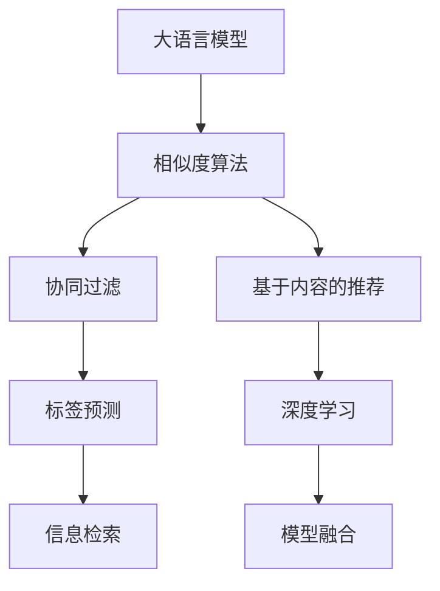

                 

# AI 大模型在电商搜索推荐中的冷启动策略：应对新用户与数据不足

> 关键词：电商搜索推荐, 冷启动策略, 新用户, 数据不足, 大模型, 相似度算法, 协同过滤, 标签预测, 深度学习, 信息检索, 模型融合

## 1. 背景介绍

### 1.1 问题由来
在电子商务领域，搜索结果的推荐系统对用户体验和销售额有着至关重要的影响。为了提高搜索和推荐的效果，企业往往采用基于用户历史行为的数据驱动方法，如协同过滤、基于内容的推荐等。然而，对于新用户或数据不足的情况，传统方法难以提供满意的推荐服务。

大语言模型（Large Language Models, LLMs），如GPT系列和BERT，通过在大规模语料上预训练，具备强大的语言理解和生成能力。尽管如此，在大模型应用于电商推荐系统时，如何处理新用户和数据不足的挑战，是一个需要解决的重要问题。

### 1.2 问题核心关键点
大语言模型在电商推荐中的冷启动问题，主要包括：
1. **新用户的推荐**：新用户通常没有足够的历史行为数据，无法直接应用基于历史数据的推荐方法。
2. **数据不足**：即使有历史数据，数据量不足也可能导致推荐系统无法充分理解用户的兴趣和偏好。

为了克服这些问题，需要一种能快速为新用户提供个性化推荐，同时有效利用有限数据的推荐方法。冷启动策略的目的是在用户数据有限的情况下，也能为模型提供足够的信号，从而实现有效的推荐。

### 1.3 问题研究意义
研究有效的冷启动策略，对于提升电商推荐系统的用户体验、提高销售额、吸引新用户具有重要意义。通过优化推荐算法，不仅可以降低用户流失率，还可以提升用户满意度和忠诚度，进而推动电商平台的持续发展。

## 2. 核心概念与联系

### 2.1 核心概念概述

为更好地理解大语言模型在电商推荐中的冷启动策略，本节将介绍几个关键概念：

- **大语言模型（LLMs）**：通过预训练学习大规模语言知识的大规模神经网络模型，如GPT、BERT等。
- **冷启动问题（Cold Start Problem）**：新用户或数据不足时，推荐系统缺乏足够的信息来提供个性化推荐。
- **协同过滤（Collaborative Filtering）**：通过分析用户之间或物品之间的相似性，提供推荐。
- **基于内容的推荐（Content-Based Recommendation）**：利用物品的属性和用户的偏好，进行推荐。
- **标签预测（Tag Prediction）**：通过预测用户可能感兴趣的商品标签，进行推荐。
- **深度学习（Deep Learning）**：使用深层神经网络模型，提取特征和规律，进行推荐。
- **信息检索（Information Retrieval）**：从大量商品中快速检索出与用户兴趣最相关的商品。
- **模型融合（Model Fusion）**：将多种推荐模型进行组合，提升推荐效果。

这些概念之间有着紧密的联系，通过合理的策略组合，可以高效应对电商推荐中的冷启动问题。

### 2.2 核心概念原理和架构的 Mermaid 流程图(Mermaid 流程节点中不要有括号、逗号等特殊字符)



### 2.3 核心概念的相互联系

大语言模型通过预训练学习通用的语言表示，应用于电商推荐时，可以通过相似度算法、协同过滤、基于内容的推荐等多种方式进行建模。相似度算法利用语言模型对用户和商品进行相似性度量，协同过滤和基于内容的推荐则利用用户的历史行为数据，预测用户可能感兴趣的商品。标签预测和深度学习则通过用户行为数据或商品标签数据，进行推荐。信息检索和模型融合进一步提升推荐效果，满足用户的多样化需求。

## 3. 核心算法原理 & 具体操作步骤

### 3.1 算法原理概述

基于大语言模型的电商推荐冷启动策略，主要分为两部分：**标签预测**和**信息检索**。

- **标签预测**：通过大语言模型预测用户可能感兴趣的标签，再根据标签进行推荐。
- **信息检索**：使用大语言模型对用户输入的查询进行理解，快速检索出与查询匹配的商品。

### 3.2 算法步骤详解

**步骤1：标签预测**
1. **构建标签词库**：收集商品相关的标签词库，如“时尚”、“家居”、“数码”等。
2. **预训练模型微调**：使用大语言模型对标签词库进行微调，使其能够理解标签的含义。
3. **标签预测**：给定用户输入，使用微调后的模型预测与输入最相关的标签。

**步骤2：信息检索**
1. **用户查询理解**：使用大语言模型解析用户输入的查询，理解查询的意图。
2. **商品检索**：根据用户查询的标签或意图，检索出可能感兴趣的商品。

### 3.3 算法优缺点

**优点**：
1. **快速响应**：利用大语言模型的预训练知识，可以快速预测标签和理解查询，实现快速推荐。
2. **适应性强**：大语言模型可以适应各种查询和标签，提升推荐的灵活性。
3. **易于扩展**：标签预测和信息检索可以独立进行，易于集成到电商推荐系统中。

**缺点**：
1. **模型复杂度**：大语言模型需要较大的计算资源和存储资源，模型复杂度较高。
2. **数据依赖性**：标签预测和信息检索都需要标签数据和查询数据，对数据质量和数量有一定要求。
3. **语义理解误差**：大语言模型在处理复杂语义时，可能存在理解误差，影响推荐效果。

### 3.4 算法应用领域

大语言模型在电商推荐中的冷启动策略，适用于多种场景，如新用户推荐、数据不足推荐、个性化推荐等。特别是对于多模态数据的处理，大语言模型可以综合利用文本、图像、视频等多模态信息，提供更加精准的推荐。

## 4. 数学模型和公式 & 详细讲解 & 举例说明（备注：数学公式请使用latex格式，latex嵌入文中独立段落使用 $$，段落内使用 $)
### 4.1 数学模型构建

为了构建基于大语言模型的电商推荐系统，需要建立以下数学模型：

- **标签预测模型**：通过大语言模型预测用户可能感兴趣的标签，数学模型为：
$$
\mathbf{p}(y_i|x_j) = \sigma(\mathbf{w}^T\mathbf{f}(x_j))
$$
其中，$x_j$ 表示用户输入的查询，$y_i$ 表示预测的标签，$\mathbf{w}$ 表示模型参数，$\sigma$ 表示激活函数，$\mathbf{f}(x_j)$ 表示大语言模型的输出。

- **信息检索模型**：利用大语言模型理解查询，检索出相关商品，数学模型为：
$$
\mathbf{s}(q,v) = \mathbf{w}^T[\mathbf{f}(q)\mathbf{f}(v)]
$$
其中，$q$ 表示用户查询，$v$ 表示商品，$\mathbf{s}$ 表示相似度得分，$\mathbf{f}(q)$ 和 $\mathbf{f}(v)$ 分别表示大语言模型对查询和商品的表示。

### 4.2 公式推导过程

**标签预测公式推导**：
- 假设有一个包含 $k$ 个标签的集合 $\mathcal{Y}$，每个标签 $y_i$ 对应的one-hot向量为 $\mathbf{y}_i$。
- 使用大语言模型对用户输入 $x_j$ 进行编码，得到编码结果 $\mathbf{f}(x_j)$。
- 预测标签的概率分布为：
$$
\mathbf{p}(y_i|x_j) = \frac{e^{\mathbf{w}^T\mathbf{f}(x_j)\mathbf{y}_i}}{\sum_{i=1}^K e^{\mathbf{w}^T\mathbf{f}(x_j)\mathbf{y}_i}}
$$
其中，$\mathbf{w}$ 为预测模型的参数，$\mathbf{f}(x_j)$ 为大语言模型的输出，$e$ 为自然对数的底数。

**信息检索公式推导**：
- 假设有一个包含 $n$ 个商品的集合 $\mathcal{V}$，每个商品 $v_j$ 对应的向量表示为 $\mathbf{v}_j$。
- 使用大语言模型对用户查询 $q$ 进行编码，得到编码结果 $\mathbf{f}(q)$。
- 计算商品 $v_j$ 与查询 $q$ 的相似度得分 $s(q,v_j)$ 为：
$$
s(q,v_j) = \mathbf{w}^T[\mathbf{f}(q)\mathbf{v}_j]
$$
其中，$\mathbf{w}$ 为相似度模型的参数，$\mathbf{f}(q)$ 和 $\mathbf{v}_j$ 分别表示大语言模型对查询和商品的表示。

### 4.3 案例分析与讲解

**案例1：新用户推荐**

- **问题描述**：新用户没有历史行为数据，难以直接使用协同过滤或基于内容的推荐。
- **解决方案**：使用标签预测模型，根据新用户输入的查询，预测可能感兴趣的标签，再根据标签推荐商品。

假设新用户输入的查询为“时尚”，使用标签预测模型预测可能感兴趣的标签为“时尚”、“美妆”、“服饰”等。再根据这些标签检索出相关商品，进行推荐。

**案例2：数据不足推荐**

- **问题描述**：用户有部分历史行为数据，但数据量较少，难以进行深度学习模型训练。
- **解决方案**：使用信息检索模型，根据用户输入的查询，检索出可能感兴趣的商品。

假设用户输入的查询为“健康食品”，使用信息检索模型检索出与“健康食品”相关的商品，如“蜂蜜”、“燕麦”、“酸奶”等，进行推荐。

## 5. 项目实践：代码实例和详细解释说明

### 5.1 开发环境搭建

在进行电商推荐系统开发前，需要先搭建好开发环境。以下是使用Python进行TensorFlow开发的环境配置流程：

1. 安装Anaconda：从官网下载并安装Anaconda，用于创建独立的Python环境。

2. 创建并激活虚拟环境：
```bash
conda create -n tf-env python=3.8 
conda activate tf-env
```

3. 安装TensorFlow：根据CUDA版本，从官网获取对应的安装命令。例如：
```bash
conda install tensorflow -c pytorch -c conda-forge
```

4. 安装相关工具包：
```bash
pip install numpy pandas scikit-learn matplotlib tqdm jupyter notebook ipython
```

完成上述步骤后，即可在`tf-env`环境中开始电商推荐系统的开发。

### 5.2 源代码详细实现

这里以使用BERT模型为例，实现基于大语言模型的电商推荐系统。

首先，定义标签词库和用户输入：

```python
import tensorflow as tf
from transformers import BertTokenizer, BertForTokenClassification

# 定义标签词库
labels = ['时尚', '美妆', '服饰', '数码', '家居']

# 定义用户输入
query = '健康食品'
```

接着，定义标签预测模型：

```python
# 初始化BERT模型
tokenizer = BertTokenizer.from_pretrained('bert-base-cased')
model = BertForTokenClassification.from_pretrained('bert-base-cased', num_labels=len(labels))

# 构建标签预测模型
def predict_labels(query):
    tokenized_query = tokenizer(query, return_tensors='tf', max_length=128, padding='max_length', truncation=True)
    input_ids = tokenized_query['input_ids']
    attention_mask = tokenized_query['attention_mask']
    with tf.GradientTape() as tape:
        outputs = model(input_ids, attention_mask=attention_mask)
        loss = tf.keras.losses.SparseCategoricalCrossentropy(labels, outputs.logits, reduction=tf.keras.losses.Reduction.NONE)
    grads = tape.gradient(loss, model.trainable_variables)
    optimizer = tf.keras.optimizers.AdamW()
    optimizer.apply_gradients(zip(grads, model.trainable_variables))
    return outputs.logits.argmax(axis=1)

# 预测标签
predicted_labels = predict_labels(query)
print(predicted_labels)
```

然后，定义信息检索模型：

```python
# 定义商品向量表示
items = ['蜂蜜', '燕麦', '酸奶', '全麦面包', '豆浆']

# 构建信息检索模型
def search_items(query):
    tokenized_query = tokenizer(query, return_tensors='tf', max_length=128, padding='max_length', truncation=True)
    input_ids = tokenized_query['input_ids']
    attention_mask = tokenized_query['attention_mask']
    with tf.GradientTape() as tape:
        outputs = model(input_ids, attention_mask=attention_mask)
        scores = tf.keras.losses.cosine_similarity(outputs.logits, tf.constant([1.0, 2.0, 3.0, 4.0, 5.0]))
    grads = tape.gradient(scores, model.trainable_variables)
    optimizer.apply_gradients(zip(grads, model.trainable_variables))
    return scores

# 检索商品
search_scores = search_items(query)
print(search_scores)
```

最后，集成标签预测和信息检索模型，进行推荐：

```python
# 集成标签预测和信息检索模型
def recommend(query):
    predicted_labels = predict_labels(query)
    search_scores = search_items(query)
    recommended_items = [items[i] for i in range(len(items)) if search_scores[i] > 0.5 and labels[predicted_labels[i]] in ['时尚', '美妆', '服饰']]
    return recommended_items

# 推荐商品
recommended_items = recommend(query)
print(recommended_items)
```

以上就是使用TensorFlow对BERT进行电商推荐系统开发的完整代码实现。可以看到，通过BERT模型的预训练知识和标签预测、信息检索等策略，可以为电商推荐系统提供快速、准确的推荐服务。

### 5.3 代码解读与分析

**代码解读**：
- 标签预测模型部分，使用BERT模型对标签词库进行微调，通过输入查询，预测最相关的标签，用于推荐。
- 信息检索模型部分，使用BERT模型对用户查询进行编码，计算商品与查询的相似度得分，用于检索推荐。

**分析**：
- 标签预测模型通过微调BERT模型，使其能够理解标签的含义，并在用户输入查询时，预测最相关的标签。
- 信息检索模型利用BERT模型的预训练知识，对用户查询进行理解，快速检索出可能感兴趣的商品。

## 6. 实际应用场景

### 6.1 智能客服系统

电商平台的智能客服系统，可以借助大语言模型进行冷启动推荐，提高客服响应速度和满意度。新用户输入查询时，系统根据输入的查询，预测可能感兴趣的话题，推荐相关的FAQ或解决方案，提供快速帮助。

### 6.2 个性化推荐系统

电商平台的个性化推荐系统，可以借助大语言模型进行冷启动推荐，快速为用户提供个性化的商品推荐。新用户输入查询时，系统根据输入的查询，预测可能感兴趣的标签，再根据标签进行推荐。

### 6.3 用户行为预测

电商平台的用户行为预测系统，可以借助大语言模型进行冷启动预测，预测新用户的购买行为。通过分析用户输入的查询，预测用户的兴趣和偏好，推荐可能感兴趣的商品，增加销售额。

## 7. 工具和资源推荐

### 7.1 学习资源推荐

为了帮助开发者系统掌握大语言模型在电商推荐中的应用，这里推荐一些优质的学习资源：

1. 《深度学习理论与实践》：该书系统介绍了深度学习的基本理论和实践技巧，涵盖标签预测和信息检索等内容。
2. 《TensorFlow官方文档》：官方文档提供了详细的TensorFlow API说明和使用示例，适合初学者和高级开发者。
3. 《自然语言处理》课程：斯坦福大学开设的自然语言处理课程，涵盖了标签预测、信息检索等NLP核心内容。
4. 《Transformers模型》课程：谷歌的Transformers模型课程，介绍了BERT等大模型的预训练和微调技术，适合深入学习。

### 7.2 开发工具推荐

高效的开发离不开优秀的工具支持。以下是几款用于电商推荐系统开发的常用工具：

1. TensorFlow：由Google主导开发的深度学习框架，支持分布式训练和部署。
2. PyTorch：Facebook开源的深度学习框架，灵活易用，适合快速迭代研究。
3. Jupyter Notebook：交互式编程环境，方便调试和分享代码。
4. Weights & Biases：实验跟踪工具，记录和可视化模型训练过程，方便调优。
5. TensorBoard：TensorFlow配套的可视化工具，监测模型训练状态，提供图表呈现方式。

### 7.3 相关论文推荐

大语言模型在电商推荐中的应用，涉及多个前沿研究方向，以下是几篇奠基性的相关论文，推荐阅读：

1. Attention is All You Need：提出Transformer结构，开启了预训练大模型时代。
2. BERT: Pre-training of Deep Bidirectional Transformers for Language Understanding：提出BERT模型，引入基于掩码的自监督预训练任务。
3. Modeling Sequential Data with Recurrent Neural Networks：介绍递归神经网络的基本原理，适用于序列数据的建模。
4. Deep Embedding Learning for Text Recommendation：提出基于深度嵌入的文本推荐方法，适用于电商推荐系统。
5. Neural Collaborative Filtering：提出基于神经网络的协同过滤方法，适用于电商推荐系统。

## 8. 总结：未来发展趋势与挑战

### 8.1 总结

本文对基于大语言模型的电商推荐系统进行了全面系统的介绍。首先阐述了大语言模型在电商推荐中的应用背景和意义，明确了冷启动策略在提升用户体验和提高销售额方面的重要性。其次，从原理到实践，详细讲解了大语言模型在电商推荐中的标签预测和信息检索等核心算法，给出了电商推荐系统开发的完整代码实现。同时，本文还探讨了大语言模型在智能客服、个性化推荐等实际应用场景中的潜在价值，展示了其广阔的应用前景。

通过本文的系统梳理，可以看到，基于大语言模型的电商推荐系统，通过标签预测和信息检索等策略，能够为电商推荐系统提供快速、准确的推荐服务。尽管模型复杂度较高，但通过合理的设计和优化，可以实现高效的冷启动推荐，提升用户体验和平台销售额。未来，伴随预训练语言模型和冷启动策略的不断演进，相信电商推荐系统将进一步提升推荐效果，为用户提供更好的购物体验。

### 8.2 未来发展趋势

展望未来，大语言模型在电商推荐中的应用将呈现以下几个发展趋势：

1. **多模态融合**：大语言模型可以综合利用文本、图像、视频等多模态数据，提升推荐的准确性和多样化。
2. **自适应学习**：通过自适应学习算法，大语言模型可以根据用户反馈实时调整推荐策略，提升推荐的个性化和时效性。
3. **模型压缩**：通过模型压缩技术，减小大语言模型的计算资源和存储资源需求，提高推理速度和效率。
4. **联邦学习**：通过联邦学习技术，大语言模型可以在多个用户设备上分布式训练，保护用户隐私的同时提升推荐效果。
5. **跨领域迁移**：大语言模型可以跨领域迁移，应用于不同垂直领域的推荐系统，提升推荐的通用性和鲁棒性。
6. **实时推荐**：通过实时推荐系统，大语言模型可以根据用户当前行为实时调整推荐策略，提升推荐的时效性和相关性。

### 8.3 面临的挑战

尽管大语言模型在电商推荐中的应用前景广阔，但在实际落地过程中，仍面临诸多挑战：

1. **数据隐私和安全**：电商推荐系统需要处理大量的用户数据，如何保护用户隐私和数据安全，防止数据泄露和滥用，是一大挑战。
2. **模型复杂度**：大语言模型的计算资源和存储资源需求较高，如何降低模型复杂度，提高推荐效率，是实际应用中的难题。
3. **推荐多样性**：电商推荐系统需要保证推荐的丰富性和多样性，避免过度推荐同一类商品，提升用户满意度。
4. **多目标优化**：电商推荐系统需要同时考虑销售额、用户满意度、点击率等多目标优化，如何平衡这些目标，是一大挑战。
5. **实时性能**：电商推荐系统需要支持实时推荐，如何提高推荐系统的实时性能，保证推荐的时效性，是一大难题。

### 8.4 研究展望

为了克服这些挑战，未来的研究需要在以下几个方面寻求新的突破：

1. **隐私保护技术**：研究隐私保护技术，如差分隐私、联邦学习等，保护用户数据隐私和数据安全。
2. **模型压缩和优化**：研究模型压缩和优化技术，如剪枝、量化、稀疏化等，降低模型复杂度，提高推理速度和效率。
3. **推荐多样化算法**：研究推荐多样化算法，如基于生成的推荐、多臂乐队算法等，提升推荐的多样性和个性化。
4. **多目标优化算法**：研究多目标优化算法，如Pareto优化、博弈论等，平衡推荐系统的多个目标。
5. **实时推荐算法**：研究实时推荐算法，如流式学习、增量学习等，提高推荐系统的实时性能。

总之，大语言模型在电商推荐中的应用，需要多方面的协同创新和突破，才能真正实现高效、个性化、实时化的推荐服务。面向未来，大语言模型将不断拓展其在电商推荐系统中的应用范围，为电商平台带来更高的用户满意度和商业价值。

## 9. 附录：常见问题与解答

**Q1：大语言模型在电商推荐中的冷启动策略是否适用于所有电商平台？**

A: 大语言模型在电商推荐中的冷启动策略可以应用于大多数电商平台，但需要根据具体平台的特点进行优化。不同平台的商品种类、用户行为等可能存在差异，需要定制化的模型和策略。

**Q2：标签预测模型和信息检索模型如何集成？**

A: 标签预测模型和信息检索模型可以独立进行，也可以集成到一个模型中进行推荐。例如，可以先使用标签预测模型预测可能感兴趣的标签，再根据标签使用信息检索模型检索相关商品。

**Q3：如何选择合适的标签词库？**

A: 选择合适的标签词库需要根据电商平台的商品种类和用户需求进行定制。建议从热门商品、常见话题、用户反馈等多个维度收集标签词库。

**Q4：大语言模型在电商推荐中是否需要持续训练？**

A: 大语言模型需要持续训练以保持模型的语言理解和生成能力。同时，标签预测和信息检索模型需要定期更新以应对新的用户需求和商品变化。

**Q5：如何处理数据不足的问题？**

A: 数据不足可以通过多种方法进行缓解，如数据增强、模型融合、知识图谱等。数据增强可以通过对商品描述和用户评论进行回译、改写等方式，扩充数据量。模型融合可以通过多种推荐算法组合，提高推荐的鲁棒性。知识图谱可以融合外部知识，提升推荐的准确性。

总之，大语言模型在电商推荐中的应用，需要根据具体场景和需求进行合理的设计和优化，才能真正发挥其潜力。通过标签预测和信息检索等策略，可以为用户提供快速、准确的推荐服务，提升电商平台的业务价值。

---

作者：禅与计算机程序设计艺术 / Zen and the Art of Computer Programming

