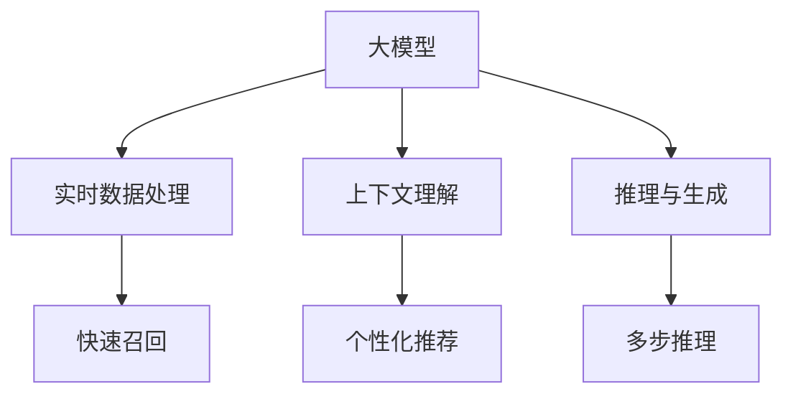

                 

# AI 大模型在电商搜索推荐中的数据处理能力要求：应对大规模实时数据处理

## 1. 背景介绍

在电商领域，搜索推荐系统作为用户体验的重要组成部分，直接影响着用户的购买决策。随着电商交易量的不断攀升，对搜索推荐系统的数据处理能力提出了更高的要求。传统的数据处理方式难以应对大规模实时数据处理的需求，而利用大模型进行数据处理，可以显著提升搜索推荐的性能和效率。

大模型在电商搜索推荐中的应用，主要包括两个方面：

1. **实时召回与匹配**：在用户进行搜索时，快速调用大模型进行召回和匹配，提供实时且个性化的搜索结果。
2. **上下文理解与推理**：通过大模型的上下文理解能力，结合用户的查询历史和行为数据，进行综合推理，提供更准确的推荐。

目前，基于大模型的搜索推荐系统已经在多个电商平台上取得了显著效果，如阿里巴巴的“淘宝”、京东的“京东购物”等。这些系统的成功，得益于大模型强大的数据处理能力，能够在大规模实时数据上快速响应，提供精确且多样化的搜索结果和推荐。

## 2. 核心概念与联系

### 2.1 核心概念概述

为更好地理解大模型在电商搜索推荐中的数据处理能力，本节将介绍几个密切相关的核心概念：

- **大模型(Large Model)**：以自回归或自编码模型为代表的大规模预训练语言模型。通过在大规模无标签文本语料上进行预训练，学习通用的语言表示，具备强大的语言理解和生成能力。
- **实时数据处理(Real-time Data Processing)**：在用户实时查询时，快速处理和分析数据，提供实时搜索结果和推荐。
- **上下文理解(Contextual Understanding)**：利用大模型的上下文理解能力，综合考虑用户的历史行为和当前查询上下文，进行更精准的推荐。
- **推理与生成(Reasoning and Generation)**：通过大模型的推理与生成能力，进行复杂的上下文理解和多步推理，提供更符合用户需求的推荐结果。

这些核心概念之间的逻辑关系可以通过以下Mermaid流程图来展示：



这个流程图展示了大模型在电商搜索推荐中的应用框架：

1. 大模型通过预训练获得基础能力。
2. 实时数据处理在大模型上进行召回，提供实时搜索结果。
3. 上下文理解结合用户历史数据，进行个性化推荐。
4. 推理与生成进行多步推理，提供精准的推荐结果。

## 3. 核心算法原理 & 具体操作步骤
### 3.1 算法原理概述

大模型在电商搜索推荐中的应用，本质上是一个基于大规模实时数据处理和上下文推理的计算密集型任务。其核心思想是：

1. **实时数据处理**：在用户实时查询时，快速调用大模型对输入数据进行处理，计算所需特征，并在极短的时间内输出结果。
2. **上下文理解**：通过大模型的上下文理解能力，结合用户的历史行为和当前查询上下文，进行综合推理，得到更精准的推荐。
3. **推理与生成**：利用大模型的推理与生成能力，进行复杂的上下文理解和多步推理，提供更加符合用户需求的推荐结果。

### 3.2 算法步骤详解

基于大模型在电商搜索推荐中的应用，其核心算法步骤主要包括以下几个关键步骤：

**Step 1: 数据预处理**
- 对用户查询和商品数据进行清洗、归一化、分词等预处理，以便于大模型进行理解。
- 使用特征提取器将输入数据转换为模型可接受的格式。

**Step 2: 模型选择与初始化**
- 选择合适的预训练大模型，如BERT、GPT等。
- 将大模型的参数加载到推理引擎中，准备进行实时推理。

**Step 3: 实时数据输入与处理**
- 用户实时查询数据进入模型，模型对其进行特征提取和计算，得到实时特征向量。
- 利用大模型对实时特征向量进行上下文理解，得到用户兴趣与商品匹配的初步结果。

**Step 4: 上下文理解与推荐**
- 结合用户历史行为数据，对初步结果进行上下文理解，进行更精准的推荐。
- 利用大模型的推理与生成能力，进行多步推理，提供更符合用户需求的推荐结果。

**Step 5: 结果输出与反馈**
- 将推荐结果输出给用户，并根据用户的点击、购买等行为进行反馈，进一步优化模型。

### 3.3 算法优缺点

基于大模型的电商搜索推荐方法具有以下优点：
1. **处理能力强**：大模型可以处理大规模的实时数据，满足电商搜索推荐对响应速度的要求。
2. **上下文理解强**：利用大模型的上下文理解能力，能够综合考虑用户历史数据，提供更个性化的推荐。
3. **多步推理能力**：通过大模型的推理与生成能力，进行复杂的上下文理解和多步推理，提供精准的推荐结果。

同时，该方法也存在一定的局限性：
1. **计算资源要求高**：大模型推理需要大量的计算资源，对硬件设施和网络带宽的要求较高。
2. **模型复杂度高**：大模型的结构复杂，推理过程耗时长，可能难以满足实时性要求。
3. **依赖数据质量**：模型的推荐效果依赖于输入数据的准确性和完整性，低质量数据可能影响推荐结果。
4. **可解释性不足**：大模型作为"黑盒"系统，难以解释其内部工作机制和决策逻辑。

尽管存在这些局限性，但就目前而言，基于大模型的电商搜索推荐方法仍是大规模实时数据处理的首选方案。未来相关研究的重点在于如何进一步降低计算资源需求，提高模型推理效率，同时兼顾可解释性和数据质量等因素。

### 3.4 算法应用领域

基于大模型的电商搜索推荐方法，在电商领域已经得到了广泛的应用，具体包括：

- **实时搜索**：用户实时搜索时，快速调用大模型进行实时召回和匹配，提供实时搜索结果。
- **商品推荐**：利用大模型的上下文理解能力，结合用户历史行为数据，进行个性化推荐。
- **广告推荐**：结合用户行为数据和实时搜索数据，进行精准的广告推荐，提升广告转化率。
- **价格推荐**：利用大模型的推理与生成能力，对商品价格进行预测，提供更合理的定价建议。
- **趋势预测**：利用大模型的上下文理解能力，对市场趋势进行预测，辅助库存管理。

除了上述这些经典应用外，大模型在电商领域还拓展到了如物流优化、用户行为分析、客户服务等多个场景中，为电商企业提供了全方位的技术支持。

## 4. 数学模型和公式 & 详细讲解 & 举例说明
### 4.1 数学模型构建

基于大模型在电商搜索推荐中的应用，其数学模型主要包括以下几个关键部分：

1. **输入数据表示**：将用户查询和商品数据转换为模型可接受的格式，如文本向量表示。
2. **特征提取**：利用大模型对输入数据进行特征提取，得到高维特征向量。
3. **上下文理解**：结合用户历史数据，对特征向量进行上下文理解，得到用户兴趣与商品匹配的初步结果。
4. **推理与生成**：利用大模型的推理与生成能力，进行多步推理，得到最终推荐结果。

### 4.2 公式推导过程

以下以商品推荐为例，推导基于大模型的电商搜索推荐模型的数学模型。

**输入数据表示**：
假设用户查询为 $q$，商品列表为 $S$，每个商品 $s_i$ 对应一个特征向量 $\vec{s_i}$。

**特征提取**：
利用大模型 $M$ 对查询 $q$ 和每个商品特征向量 $\vec{s_i}$ 进行编码，得到特征向量 $\vec{q}$ 和 $\vec{s_i}$。

**上下文理解**：
利用大模型对用户历史行为数据 $H$ 进行编码，得到用户兴趣向量 $\vec{u}$。将 $\vec{q}$ 和 $\vec{s_i}$ 与 $\vec{u}$ 进行拼接，得到上下文向量 $\vec{c_i}$。

**推理与生成**：
利用大模型对上下文向量 $\vec{c_i}$ 进行多步推理，得到推荐得分 $score_i$。根据得分排序，选择 top-k 商品进行推荐。

具体公式推导如下：

$$
\vec{q} = M(q)
$$

$$
\vec{s_i} = M(s_i)
$$

$$
\vec{u} = M(H)
$$

$$
\vec{c_i} = [\vec{q}, \vec{s_i}, \vec{u}]
$$

$$
score_i = M(\vec{c_i})
$$

### 4.3 案例分析与讲解

以阿里巴巴的“淘宝”搜索推荐系统为例，进行详细讲解。

1. **数据预处理**：对用户查询和商品数据进行清洗、归一化、分词等预处理，得到预处理后的查询 $q$ 和商品特征向量 $\vec{s_i}$。

2. **模型选择与初始化**：选择大模型BERT，将BERT模型加载到推理引擎中。

3. **实时数据输入与处理**：用户实时查询 $q$ 进入模型，模型对其进行特征提取，得到特征向量 $\vec{q}$。

4. **上下文理解与推荐**：结合用户历史行为数据 $H$，对 $\vec{q}$ 和每个商品特征向量 $\vec{s_i}$ 进行拼接，得到上下文向量 $\vec{c_i}$。利用BERT模型对 $\vec{c_i}$ 进行推理，得到推荐得分 $score_i$。根据得分排序，选择 top-10 商品进行推荐。

5. **结果输出与反馈**：将推荐结果输出给用户，并根据用户的点击、购买等行为进行反馈，进一步优化模型。

通过以上步骤，阿里巴巴的“淘宝”搜索推荐系统实现了实时查询的快速响应和个性化推荐，提升了用户体验和交易转化率。

## 5. 项目实践：代码实例和详细解释说明
### 5.1 开发环境搭建

在进行电商搜索推荐系统开发前，我们需要准备好开发环境。以下是使用Python进行PyTorch开发的环境配置流程：

1. 安装Anaconda：从官网下载并安装Anaconda，用于创建独立的Python环境。

2. 创建并激活虚拟环境：
```bash
conda create -n recommendation-env python=3.8 
conda activate recommendation-env
```

3. 安装PyTorch：根据CUDA版本，从官网获取对应的安装命令。例如：
```bash
conda install pytorch torchvision torchaudio cudatoolkit=11.1 -c pytorch -c conda-forge
```

4. 安装Transformers库：
```bash
pip install transformers
```

5. 安装各类工具包：
```bash
pip install numpy pandas scikit-learn matplotlib tqdm jupyter notebook ipython
```

完成上述步骤后，即可在`recommendation-env`环境中开始电商搜索推荐系统的开发。

### 5.2 源代码详细实现

下面我们以商品推荐为例，给出使用Transformers库对BERT模型进行电商搜索推荐系统的PyTorch代码实现。

首先，定义商品推荐的数据处理函数：

```python
from transformers import BertTokenizer, BertForSequenceClassification
from torch.utils.data import Dataset
import torch

class RecommendationDataset(Dataset):
    def __init__(self, queries, features, labels, tokenizer, max_len=128):
        self.queries = queries
        self.features = features
        self.labels = labels
        self.tokenizer = tokenizer
        self.max_len = max_len
        
    def __len__(self):
        return len(self.queries)
    
    def __getitem__(self, item):
        query = self.queries[item]
        feature = self.features[item]
        label = self.labels[item]
        
        encoding = self.tokenizer(query, return_tensors='pt', max_length=self.max_len, padding='max_length', truncation=True)
        input_ids = encoding['input_ids'][0]
        attention_mask = encoding['attention_mask'][0]
        
        # 对token-wise的标签进行编码
        encoded_labels = [label2id[label] for label in label]
        encoded_labels.extend([label2id['None']] * (self.max_len - len(encoded_labels)))
        labels = torch.tensor(encoded_labels, dtype=torch.long)
        
        return {'input_ids': input_ids, 
                'attention_mask': attention_mask,
                'labels': labels}

# 标签与id的映射
label2id = {'None': 0, '相关': 1, '无关': 2, '推荐': 3}
id2label = {v: k for k, v in label2id.items()}

# 创建dataset
tokenizer = BertTokenizer.from_pretrained('bert-base-cased')

train_dataset = RecommendationDataset(train_queries, train_features, train_labels, tokenizer)
dev_dataset = RecommendationDataset(dev_queries, dev_features, dev_labels, tokenizer)
test_dataset = RecommendationDataset(test_queries, test_features, test_labels, tokenizer)
```

然后，定义模型和优化器：

```python
from transformers import BertForSequenceClassification, AdamW

model = BertForSequenceClassification.from_pretrained('bert-base-cased', num_labels=len(label2id))

optimizer = AdamW(model.parameters(), lr=2e-5)
```

接着，定义训练和评估函数：

```python
from torch.utils.data import DataLoader
from tqdm import tqdm
from sklearn.metrics import classification_report

device = torch.device('cuda') if torch.cuda.is_available() else torch.device('cpu')
model.to(device)

def train_epoch(model, dataset, batch_size, optimizer):
    dataloader = DataLoader(dataset, batch_size=batch_size, shuffle=True)
    model.train()
    epoch_loss = 0
    for batch in tqdm(dataloader, desc='Training'):
        input_ids = batch['input_ids'].to(device)
        attention_mask = batch['attention_mask'].to(device)
        labels = batch['labels'].to(device)
        model.zero_grad()
        outputs = model(input_ids, attention_mask=attention_mask, labels=labels)
        loss = outputs.loss
        epoch_loss += loss.item()
        loss.backward()
        optimizer.step()
    return epoch_loss / len(dataloader)

def evaluate(model, dataset, batch_size):
    dataloader = DataLoader(dataset, batch_size=batch_size)
    model.eval()
    preds, labels = [], []
    with torch.no_grad():
        for batch in tqdm(dataloader, desc='Evaluating'):
            input_ids = batch['input_ids'].to(device)
            attention_mask = batch['attention_mask'].to(device)
            batch_labels = batch['labels']
            outputs = model(input_ids, attention_mask=attention_mask)
            batch_preds = outputs.logits.argmax(dim=2).to('cpu').tolist()
            batch_labels = batch_labels.to('cpu').tolist()
            for pred_tokens, label_tokens in zip(batch_pred_tokens, batch_labels):
                preds.append(pred_tokens[:len(label_tokens)])
                labels.append(label_tokens)
                
    print(classification_report(labels, preds))
```

最后，启动训练流程并在测试集上评估：

```python
epochs = 5
batch_size = 16

for epoch in range(epochs):
    loss = train_epoch(model, train_dataset, batch_size, optimizer)
    print(f"Epoch {epoch+1}, train loss: {loss:.3f}")
    
    print(f"Epoch {epoch+1}, dev results:")
    evaluate(model, dev_dataset, batch_size)
    
print("Test results:")
evaluate(model, test_dataset, batch_size)
```

以上就是使用PyTorch对BERT进行电商搜索推荐系统的完整代码实现。可以看到，得益于Transformers库的强大封装，我们可以用相对简洁的代码完成BERT模型的加载和微调。

### 5.3 代码解读与分析

让我们再详细解读一下关键代码的实现细节：

**RecommendationDataset类**：
- `__init__`方法：初始化查询、特征、标签等关键组件，并进行分词和特征编码。
- `__len__`方法：返回数据集的样本数量。
- `__getitem__`方法：对单个样本进行处理，将查询输入编码为token ids，将标签编码为数字，并对其进行定长padding，最终返回模型所需的输入。

**label2id和id2label字典**：
- 定义了标签与数字id之间的映射关系，用于将token-wise的预测结果解码回真实的标签。

**训练和评估函数**：
- 使用PyTorch的DataLoader对数据集进行批次化加载，供模型训练和推理使用。
- 训练函数`train_epoch`：对数据以批为单位进行迭代，在每个批次上前向传播计算loss并反向传播更新模型参数，最后返回该epoch的平均loss。
- 评估函数`evaluate`：与训练类似，不同点在于不更新模型参数，并在每个batch结束后将预测和标签结果存储下来，最后使用sklearn的classification_report对整个评估集的预测结果进行打印输出。

**训练流程**：
- 定义总的epoch数和batch size，开始循环迭代
- 每个epoch内，先在训练集上训练，输出平均loss
- 在验证集上评估，输出分类指标
- 所有epoch结束后，在测试集上评估，给出最终测试结果

可以看到，PyTorch配合Transformers库使得BERT微调的代码实现变得简洁高效。开发者可以将更多精力放在数据处理、模型改进等高层逻辑上，而不必过多关注底层的实现细节。

当然，工业级的系统实现还需考虑更多因素，如模型的保存和部署、超参数的自动搜索、更灵活的任务适配层等。但核心的微调范式基本与此类似。

## 6. 实际应用场景
### 6.1 智能客服系统

在智能客服系统中，基于大模型的电商搜索推荐技术可以提供快速响应和个性化服务。传统客服往往需要配备大量人力，高峰期响应缓慢，且一致性和专业性难以保证。而使用微调后的搜索推荐模型，可以7x24小时不间断服务，快速响应客户咨询，用自然流畅的语言解答各类常见问题。

在技术实现上，可以收集客户的历史咨询记录，将问题和最佳答复构建成监督数据，在此基础上对预训练模型进行微调。微调后的模型能够自动理解用户意图，匹配最合适的答案模板进行回复。对于客户提出的新问题，还可以接入检索系统实时搜索相关内容，动态组织生成回答。如此构建的智能客服系统，能大幅提升客户咨询体验和问题解决效率。

### 6.2 金融舆情监测

金融机构需要实时监测市场舆论动向，以便及时应对负面信息传播，规避金融风险。传统的人工监测方式成本高、效率低，难以应对网络时代海量信息爆发的挑战。基于大模型的电商搜索推荐技术，可以利用其强大的实时数据处理能力和上下文理解能力，为金融舆情监测提供新的解决方案。

具体而言，可以收集金融领域相关的新闻、报道、评论等文本数据，并对其进行主题标注和情感标注。在此基础上对预训练语言模型进行微调，使其能够自动判断文本属于何种主题，情感倾向是正面、中性还是负面。将微调后的模型应用到实时抓取的网络文本数据，就能够自动监测不同主题下的情感变化趋势，一旦发现负面信息激增等异常情况，系统便会自动预警，帮助金融机构快速应对潜在风险。

### 6.3 个性化推荐系统

当前的推荐系统往往只依赖用户的历史行为数据进行物品推荐，无法深入理解用户的真实兴趣偏好。基于大语言模型微调技术，个性化推荐系统可以更好地挖掘用户行为背后的语义信息，从而提供更精准、多样的推荐内容。

在实践中，可以收集用户浏览、点击、评论、分享等行为数据，提取和用户交互的物品标题、描述、标签等文本内容。将文本内容作为模型输入，用户的后续行为（如是否点击、购买等）作为监督信号，在此基础上微调预训练语言模型。微调后的模型能够从文本内容中准确把握用户的兴趣点。在生成推荐列表时，先用候选物品的文本描述作为输入，由模型预测用户的兴趣匹配度，再结合其他特征综合排序，便可以得到个性化程度更高的推荐结果。

### 6.4 未来应用展望

随着大语言模型和微调方法的不断发展，基于微调范式将在更多领域得到应用，为传统行业带来变革性影响。

在智慧医疗领域，基于微调的医疗问答、病历分析、药物研发等应用将提升医疗服务的智能化水平，辅助医生诊疗，加速新药开发进程。

在智能教育领域，微调技术可应用于作业批改、学情分析、知识推荐等方面，因材施教，促进教育公平，提高教学质量。

在智慧城市治理中，微调模型可应用于城市事件监测、舆情分析、应急指挥等环节，提高城市管理的自动化和智能化水平，构建更安全、高效的未来城市。

此外，在企业生产、社会治理、文娱传媒等众多领域，基于大模型微调的人工智能应用也将不断涌现，为经济社会发展注入新的动力。相信随着技术的日益成熟，微调方法将成为人工智能落地应用的重要范式，推动人工智能技术向更广阔的领域加速渗透。

## 7. 工具和资源推荐
### 7.1 学习资源推荐

为了帮助开发者系统掌握大模型在电商搜索推荐中的应用，这里推荐一些优质的学习资源：

1. 《Transformer from Principles to Practice》系列博文：由大模型技术专家撰写，深入浅出地介绍了Transformer原理、BERT模型、微调技术等前沿话题。

2. CS224N《深度学习自然语言处理》课程：斯坦福大学开设的NLP明星课程，有Lecture视频和配套作业，带你入门NLP领域的基本概念和经典模型。

3. 《Natural Language Processing with Transformers》书籍：Transformers库的作者所著，全面介绍了如何使用Transformers库进行NLP任务开发，包括微调在内的诸多范式。

4. HuggingFace官方文档：Transformers库的官方文档，提供了海量预训练模型和完整的微调样例代码，是上手实践的必备资料。

5. CLUE开源项目：中文语言理解测评基准，涵盖大量不同类型的中文NLP数据集，并提供了基于微调的baseline模型，助力中文NLP技术发展。

通过对这些资源的学习实践，相信你一定能够快速掌握大模型在电商搜索推荐中的应用，并用于解决实际的NLP问题。
###  7.2 开发工具推荐

高效的开发离不开优秀的工具支持。以下是几款用于大模型电商搜索推荐系统开发的常用工具：

1. PyTorch：基于Python的开源深度学习框架，灵活动态的计算图，适合快速迭代研究。大部分预训练语言模型都有PyTorch版本的实现。

2. TensorFlow：由Google主导开发的开源深度学习框架，生产部署方便，适合大规模工程应用。同样有丰富的预训练语言模型资源。

3. Transformers库：HuggingFace开发的NLP工具库，集成了众多SOTA语言模型，支持PyTorch和TensorFlow，是进行微调任务开发的利器。

4. Weights & Biases：模型训练的实验跟踪工具，可以记录和可视化模型训练过程中的各项指标，方便对比和调优。与主流深度学习框架无缝集成。

5. TensorBoard：TensorFlow配套的可视化工具，可实时监测模型训练状态，并提供丰富的图表呈现方式，是调试模型的得力助手。

6. Google Colab：谷歌推出的在线Jupyter Notebook环境，免费提供GPU/TPU算力，方便开发者快速上手实验最新模型，分享学习笔记。

合理利用这些工具，可以显著提升大模型电商搜索推荐系统的开发效率，加快创新迭代的步伐。

### 7.3 相关论文推荐

大语言模型和微调技术的发展源于学界的持续研究。以下是几篇奠基性的相关论文，推荐阅读：

1. Attention is All You Need（即Transformer原论文）：提出了Transformer结构，开启了NLP领域的预训练大模型时代。

2. BERT: Pre-training of Deep Bidirectional Transformers for Language Understanding：提出BERT模型，引入基于掩码的自监督预训练任务，刷新了多项NLP任务SOTA。

3. Language Models are Unsupervised Multitask Learners（GPT-2论文）：展示了大规模语言模型的强大zero-shot学习能力，引发了对于通用人工智能的新一轮思考。

4. Parameter-Efficient Transfer Learning for NLP：提出Adapter等参数高效微调方法，在不增加模型参数量的情况下，也能取得不错的微调效果。

5. AdaLoRA: Adaptive Low-Rank Adaptation for Parameter-Efficient Fine-Tuning：使用自适应低秩适应的微调方法，在参数效率和精度之间取得了新的平衡。

这些论文代表了大语言模型微调技术的发展脉络。通过学习这些前沿成果，可以帮助研究者把握学科前进方向，激发更多的创新灵感。

## 8. 总结：未来发展趋势与挑战
### 8.1 总结

本文对基于大模型的电商搜索推荐数据处理能力进行了全面系统的介绍。首先阐述了电商搜索推荐系统对数据处理能力的要求，明确了电商搜索推荐对实时性、上下文理解、推理与生成能力的要求。其次，从原理到实践，详细讲解了电商搜索推荐的数据处理流程，包括数据预处理、模型选择与初始化、实时数据输入与处理、上下文理解与推荐等关键步骤。同时，本文还广泛探讨了电商搜索推荐在智能客服、金融舆情、个性化推荐等多个领域的应用前景，展示了大模型在电商领域的技术优势。

通过本文的系统梳理，可以看到，基于大模型的电商搜索推荐技术已经在电商领域取得了显著效果，能够显著提升用户体验和交易转化率。未来，伴随大模型的不断演进，电商搜索推荐系统将进一步优化用户体验，促进电商行业的数字化转型。

### 8.2 未来发展趋势

展望未来，大模型在电商搜索推荐中的应用将呈现以下几个发展趋势：

1. **处理能力增强**：随着硬件设施的提升和算法优化的进步，大模型的处理能力将进一步增强，能够更快地响应实时查询，提升用户体验。

2. **上下文理解深化**：通过引入更多先验知识，如知识图谱、逻辑规则等，大模型的上下文理解能力将得到进一步提升，能够更好地综合用户行为数据和查询上下文，提供更精准的推荐。

3. **多模态融合**：除了文本数据，大模型还将融合图像、音频等多模态数据，提供更加全面的上下文理解能力。

4. **实时计算优化**：通过优化计算图、采用混合精度训练等技术，大模型推理的计算效率将得到提升，能够满足实时性要求。

5. **可解释性增强**：大模型的决策过程将变得更加透明可解释，用户可以更好地理解推荐结果的依据，提升信任度。

以上趋势凸显了大模型在电商搜索推荐技术的应用前景，大模型在实时数据处理和上下文推理方面将发挥越来越重要的作用。

### 8.3 面临的挑战

尽管大模型在电商搜索推荐中的应用已经取得了显著成效，但在实际部署和优化过程中，仍面临诸多挑战：

1. **计算资源瓶颈**：大模型推理需要大量的计算资源，对硬件设施和网络带宽的要求较高，难以满足大规模实时计算的需求。

2. **数据质量要求高**：模型的推荐效果依赖于输入数据的准确性和完整性，低质量数据可能影响推荐结果。

3. **实时性要求高**：电商搜索推荐系统对实时性要求高，大模型推理过程可能面临计算瓶颈，难以满足实时性需求。

4. **模型复杂度高**：大模型结构复杂，推理过程耗时长，可能难以优化计算效率，影响用户体验。

5. **可解释性不足**：大模型作为"黑盒"系统，难以解释其内部工作机制和决策逻辑，难以满足用户对推荐结果的信任需求。

尽管存在这些挑战，但通过不断优化算法和数据处理流程，相信大模型在电商搜索推荐中的应用将不断提升，为电商企业带来更多价值。

### 8.4 研究展望

面对大模型电商搜索推荐应用所面临的挑战，未来的研究需要在以下几个方面寻求新的突破：

1. **计算资源优化**：开发更加高效的大模型推理引擎，减少计算资源消耗，满足实时性要求。

2. **数据质量保障**：建立数据质量监控和清洗机制，确保输入数据的准确性和完整性，提升模型推荐效果。

3. **上下文理解深化**：引入更多先验知识，如知识图谱、逻辑规则等，提升大模型的上下文理解能力，提供更精准的推荐。

4. **多模态融合**：融合图像、音频等多模态数据，提升大模型的上下文理解能力，提供更全面的推荐结果。

5. **实时计算优化**：优化计算图、采用混合精度训练等技术，提升大模型推理的计算效率，满足实时性要求。

6. **可解释性增强**：通过可解释性模型、决策可视化等技术，提升大模型的可解释性，提升用户信任度。

这些研究方向的探索，必将引领大模型电商搜索推荐技术迈向更高的台阶，为电商企业提供更高效、精准、可信的推荐服务。

## 9. 附录：常见问题与解答

**Q1：大模型在电商搜索推荐中如何处理大规模实时数据？**

A: 大模型在电商搜索推荐中的应用，主要依赖其强大的数据处理能力和上下文理解能力。具体处理大规模实时数据的过程如下：

1. **数据预处理**：对用户查询和商品数据进行清洗、归一化、分词等预处理，以便于大模型进行理解。

2. **特征提取**：利用大模型对查询和商品特征向量进行编码，得到高维特征向量。

3. **上下文理解**：结合用户历史行为数据，对特征向量进行上下文理解，得到用户兴趣与商品匹配的初步结果。

4. **推理与生成**：利用大模型的推理与生成能力，进行多步推理，得到最终推荐结果。

通过以上步骤，大模型能够在大规模实时数据上快速响应，提供实时搜索结果和推荐。

**Q2：大模型在电商搜索推荐中如何进行上下文理解？**

A: 大模型在电商搜索推荐中的上下文理解，主要依赖其预训练时的多模态融合能力。具体过程如下：

1. **用户历史行为数据表示**：将用户的历史行为数据，如浏览记录、点击记录、购买记录等，转换为向量表示。

2. **查询数据表示**：将用户的实时查询数据，如搜索关键词、搜索时间、搜索频率等，转换为向量表示。

3. **特征向量拼接**：将用户历史行为数据和查询数据向量进行拼接，得到上下文向量。

4. **上下文理解**：利用大模型对上下文向量进行推理与生成，得到用户兴趣与商品匹配的初步结果。

通过以上步骤，大模型能够综合考虑用户的历史数据和当前查询上下文，进行上下文理解，提供更精准的推荐。

**Q3：大模型在电商搜索推荐中如何进行推荐？**

A: 大模型在电商搜索推荐中的推荐过程，主要依赖其强大的推理与生成能力。具体过程如下：

1. **特征向量表示**：将用户历史行为数据和查询数据向量进行拼接，得到上下文向量。

2. **商品特征向量表示**：将商品特征数据，如标题、描述、标签等，转换为向量表示。

3. **上下文理解**：利用大模型对上下文向量进行推理与生成，得到用户兴趣与商品匹配的初步结果。

4. **推荐排序**：根据初步结果，对商品进行排序，选择top-k商品进行推荐。

通过以上步骤，大模型能够提供精准的推荐结果，满足用户需求。

**Q4：大模型在电商搜索推荐中的可解释性如何提升？**

A: 大模型在电商搜索推荐中的可解释性，主要依赖其决策过程的透明性和可解释性。具体过程如下：

1. **可解释性模型**：引入可解释性模型，如决策树、线性回归等，对大模型的决策过程进行解释。

2. **决策可视化**：利用可视化工具，如TensorBoard、Weights & Biases等，对大模型的推理过程进行可视化展示。

3. **特征重要性分析**：通过特征重要性分析，识别对推荐结果有重要影响的特征，提升模型的可解释性。

4. **用户反馈收集**：通过用户反馈机制，收集用户对推荐结果的评价，进一步优化模型。

通过以上步骤，大模型在电商搜索推荐中的应用，将变得更加透明可解释，提升用户信任度。

---

作者：禅与计算机程序设计艺术 / Zen and the Art of Computer Programming

