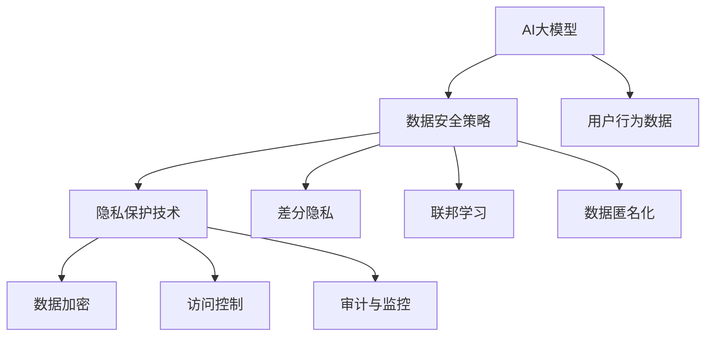

                 

# AI 大模型在电商搜索推荐中的数据安全策略：保障数据安全与用户隐私

## 1. 背景介绍

### 1.1 问题由来
随着电子商务市场的蓬勃发展，电商搜索推荐系统成为驱动用户体验和商家收入增长的关键引擎。AI大模型因其出色的语言理解和生成能力，逐渐被引入电商搜索推荐领域，用以提升用户搜索匹配的精准度和推荐内容的个性化。然而，这种基于用户历史行为数据和搜索内容的大模型应用，也带来了数据安全与用户隐私保护的新挑战。

### 1.2 问题核心关键点
电商搜索推荐系统的大模型应用，不仅需要保证模型的精准推荐能力，更需重视用户数据的隐私保护，防止数据泄露和滥用。随着监管要求的日益严格，如何在保障用户隐私的同时，高效实现大模型的搜索推荐功能，成为当前电商领域的研究热点。

### 1.3 问题研究意义
研究电商搜索推荐中大模型的数据安全策略，对于保护用户隐私、增强用户信任、促进电商搜索推荐系统的健康发展具有重要意义：

1. 保护用户隐私。合理使用数据安全技术，保护用户行为数据不被滥用，避免隐私泄露风险。
2. 提升用户体验。通过隐私保护技术，增强用户对电商平台的信任感，提升用户满意度。
3. 优化电商收益。确保数据安全策略的实施，有助于电商平台提升精准营销和个性化推荐效果，增加用户黏性和消费频次。
4. 符合法规要求。应对隐私保护法规和政策的要求，避免法律风险。
5. 推动技术创新。隐私保护和数据安全技术的应用，将推动AI大模型的深化应用和相关技术的发展。

## 2. 核心概念与联系

### 2.1 核心概念概述

为更好地理解电商搜索推荐中大模型的数据安全策略，本节将介绍几个密切相关的核心概念：

- **AI大模型**：以深度学习为核心的语言模型，如GPT、BERT、DALL-E等，具有强大的自然语言理解和生成能力，常用于搜索推荐系统的优化。
- **隐私保护技术**：指通过技术手段保护用户个人信息安全的策略和方法，如数据匿名化、差分隐私、联邦学习等。
- **数据安全策略**：包括但不限于数据加密、访问控制、审计与监控等，确保数据在存储、传输和使用过程中不被未授权访问。
- **用户行为数据**：用户在电商平台上的点击、浏览、购买等行为记录，是大模型学习用户偏好、进行精准推荐的基础数据。
- **差分隐私**：一种隐私保护技术，在数据分析和模型训练过程中，通过添加噪声，确保单条数据对模型输出的影响极小，从而保护个体隐私。
- **联邦学习**：一种分布式机器学习方法，允许参与方在不共享本地数据的情况下，共同训练全局模型。
- **数据匿名化**：通过技术手段对数据进行去标识处理，确保即使恶意者拥有数据，也无法关联到具体个人。

这些核心概念之间的逻辑关系可以通过以下Mermaid流程图来展示：



这个流程图展示了大模型、数据安全策略、隐私保护技术等概念之间的逻辑关系：

1. AI大模型通过学习用户行为数据，提高搜索推荐系统的精准度。
2. 数据安全策略保护用户行为数据的安全，防止数据泄露和滥用。
3. 隐私保护技术如差分隐私、联邦学习等，确保数据隐私不被破坏。
4. 数据匿名化、加密等具体技术手段，实现数据安全的具体操作。

这些概念共同构成了电商搜索推荐系统中大模型数据安全策略的基础，为大模型的应用提供了强有力的保障。

## 3. 核心算法原理 & 具体操作步骤

### 3.1 算法原理概述

基于隐私保护的电商搜索推荐系统，旨在在大模型进行搜索推荐的过程中，通过多种技术手段，确保用户数据的安全性和隐私性。其核心思想是：在用户数据不离开本地的情况，利用本地数据更新大模型，从而实现个性化搜索推荐，同时保证用户数据的隐私不被泄露。

具体来说，主要有以下几种隐私保护技术：

- **差分隐私**：在模型训练或参数更新时，通过添加随机噪声来保护个体隐私，使得任意个体数据的加入对模型输出的影响极小。
- **联邦学习**：通过本地计算和参数更新，实现模型在多方参与下的共同训练，数据不跨边传输，确保数据隐私。
- **数据匿名化**：将用户数据中的敏感信息进行去标识化处理，使得个体无法通过数据回溯到具体个人。
- **安全多方计算**：多个参与方在不共享输入的情况下，共同计算输出结果，确保数据不被泄露。
- **安全搜索推荐**：在搜索推荐过程中，对用户查询进行匿名化处理，保护用户隐私。

这些技术可以结合使用，构建多层次、多维度的隐私保护策略，以适应不同应用场景下的隐私保护需求。

### 3.2 算法步骤详解

电商搜索推荐系统中大模型数据安全策略的实施，一般包括以下几个关键步骤：

**Step 1: 数据收集与预处理**
- 收集用户行为数据，包括但不限于浏览记录、点击记录、购买记录等。
- 对数据进行清洗、去重、归一化等预处理，确保数据的质量和一致性。

**Step 2: 差分隐私技术应用**
- 在模型训练或参数更新阶段，使用差分隐私算法添加噪声，确保单条数据对模型输出的影响极小。
- 选择合适的噪声函数和参数，平衡隐私保护和模型精度之间的权衡。

**Step 3: 联邦学习模型训练**
- 将数据分布式存储在各个参与方（如电商平台、用户设备等）。
- 通过加密通信和本地计算，参与方共同训练全局模型，参数更新仅在本地进行。
- 采用安全多方计算技术，保护模型训练过程中的数据安全。

**Step 4: 数据匿名化与访问控制**
- 对数据进行去标识化处理，确保即使恶意者拥有数据，也无法关联到具体个人。
- 建立严格的访问控制机制，确保只有授权人员可以访问和使用数据。
- 使用数据脱敏技术，对敏感信息进行处理，防止信息泄露。

**Step 5: 模型训练与评估**
- 在保护隐私的前提下，使用本地数据更新大模型，进行训练和评估。
- 定期进行安全审计和监控，确保数据和模型的安全性。

**Step 6: 安全搜索推荐**
- 在搜索推荐过程中，对用户查询进行匿名化处理，防止用户隐私泄露。
- 使用安全多方计算技术，保护搜索推荐过程中的数据安全。

**Step 7: 用户反馈与调整**
- 收集用户反馈，评估隐私保护策略的效果。
- 根据用户反馈和隐私法规要求，及时调整和优化隐私保护策略。

以上是电商搜索推荐系统中大模型数据安全策略的一般流程。在实际应用中，还需要针对具体场景进行优化设计，如选择合适的差分隐私算法、设计高效的安全多方计算协议等，以进一步提升隐私保护的性能和效率。

### 3.3 算法优缺点

基于隐私保护的大模型数据安全策略，具有以下优点：
1. 数据隐私保护能力强。通过差分隐私、联邦学习等技术，确保用户数据在存储、传输和使用过程中不被泄露。
2. 模型精度可控。通过合理调整噪声函数和参数，可以在隐私保护和模型精度之间找到平衡点。
3. 数据分布式处理。联邦学习等技术可以充分利用分布式计算资源，提高模型训练效率。
4. 可扩展性好。适用于多种电商场景，具有较高的可扩展性。

同时，该策略也存在一定的局限性：
1. 隐私保护成本高。差分隐私、联邦学习等技术在实现上相对复杂，需要较大的计算资源和时间成本。
2. 模型性能受限。添加噪声和本地计算可能影响模型的精度和效率，需要在隐私保护和性能之间找到最佳平衡。
3. 隐私保护技术复杂。技术实现难度较大，需要专业知识和高水平技术团队支持。
4. 法规适应性不足。不同国家和地区的隐私保护法规各异，技术策略需要适应多样化的法规要求。

尽管存在这些局限性，但就目前而言，基于隐私保护的大模型数据安全策略仍是大模型应用的重要方向。未来相关研究的重点在于如何进一步降低隐私保护成本，提高模型性能，同时兼顾法律合规性。

### 3.4 算法应用领域

基于隐私保护的大模型数据安全策略，在电商搜索推荐系统中有着广泛的应用前景：

- **个性化推荐**：通过联邦学习技术，多用户设备共同参与模型训练，在保护用户隐私的同时，提升推荐效果。
- **精准搜索**：在用户查询时，通过差分隐私技术对查询进行匿名化处理，防止用户隐私泄露。
- **数据分析与监控**：使用安全多方计算技术，对用户行为数据进行分析，保护数据隐私的同时，提升电商平台的数据分析能力。
- **用户画像构建**：通过数据匿名化和访问控制技术，在保护用户隐私的前提下，构建精准的用户画像。
- **欺诈检测**：对用户行为数据进行差分隐私处理和联邦学习训练，构建欺诈检测模型，保护用户数据安全。

除了电商领域，这些隐私保护技术还可广泛应用于金融、医疗、教育等需要处理大量敏感数据的行业，为数据安全和隐私保护提供强有力的技术支持。

## 4. 数学模型和公式 & 详细讲解 & 举例说明

### 4.1 数学模型构建

本节将使用数学语言对基于隐私保护的大模型数据安全策略进行更加严格的刻画。

记电商搜索推荐系统中的大模型为 $M_{\theta}$，其中 $\theta$ 为模型参数。假设用户行为数据为 $D=\{(x_i, y_i)\}_{i=1}^N, x_i \in \mathcal{X}, y_i \in \mathcal{Y}$，其中 $x_i$ 为行为特征，$y_i$ 为行为标签（如是否点击、是否购买等）。

定义差分隐私函数为 $\epsilon$-差分隐私函数 $P_{\epsilon}$，表示在给定差分隐私参数 $\epsilon$ 的情况下，模型 $M_{\theta}$ 的输出概率分布 $P_{M_{\theta}}(Y|X)$ 相对于原始分布 $P_{M_{\theta}}(Y|X)$ 的隐私损失不超过 $\epsilon$。

则基于差分隐私的模型训练目标为：

$$
\min_{\theta} \mathcal{L}(M_{\theta}, D) \quad \text{s.t.} \quad P_{\epsilon}(M_{\theta}, X) = P_{M_{\theta}}(Y|X)
$$

其中 $\mathcal{L}$ 为模型损失函数，如交叉熵损失、均方误差损失等。

### 4.2 公式推导过程

以下我们以差分隐私和联邦学习为例，推导这两个关键技术的数学表达式。

**差分隐私推导**

差分隐私的核心思想是在模型输出中添加随机噪声，使得单条数据的加入对模型输出的影响极小。假设模型 $M_{\theta}$ 的输出为 $M_{\theta}(X)$，则差分隐私函数 $P_{\epsilon}$ 可以表示为：

$$
P_{\epsilon}(Y|X) = \frac{1}{Z} e^{-\frac{|Y-M_{\theta}(X)|^2}{2\epsilon^2}} \prod_{i=1}^N P(Y_i|X_i, M_{\theta})
$$

其中 $Z$ 为归一化因子，$|Y-M_{\theta}(X)|^2$ 为模型输出与真实标签之间的平方误差，$\epsilon$ 为差分隐私参数。

**联邦学习推导**

联邦学习通过本地计算和参数更新，实现模型在多方参与下的共同训练，数据不跨边传输，确保数据隐私。假设 $K$ 个参与方 $P_k, k=1,...,K$ 的本地数据为 $D_k=\{(x_i^k, y_i^k)\}_{i=1}^N$，则联邦学习模型的训练目标可以表示为：

$$
\min_{\theta} \sum_{k=1}^K \mathcal{L}(M_{\theta}, D_k)
$$

其中 $\mathcal{L}$ 为本地损失函数。

假设模型参数更新公式为 $\theta_{k+1} = \theta_k - \eta \nabla_{\theta}\mathcal{L}(\theta_k)$，则每个参与方的本地计算公式为：

$$
\theta_k \leftarrow \theta_k - \eta \nabla_{\theta}\mathcal{L}(\theta_k, D_k) - \eta\lambda\theta_k
$$

其中 $\eta$ 为学习率，$\lambda$ 为正则化系数。

### 4.3 案例分析与讲解

**案例一：基于差分隐私的个性化推荐**

假设电商平台收集了用户 $k$ 的行为数据 $D_k=\{(x_i^k, y_i^k)\}_{i=1}^N$，其中 $x_i^k$ 为用户的浏览记录，$y_i^k$ 为是否点击标签。

使用差分隐私技术对模型进行训练，目标是最小化损失函数 $\mathcal{L}(M_{\theta}, D_k)$，同时满足隐私保护条件。具体步骤如下：

1. 将用户行为数据 $D_k$ 分成多个子集 $D_k^{(i)}$，分别进行模型训练。
2. 对每个子集 $D_k^{(i)}$ 添加随机噪声 $\delta_i$，得到噪声化数据集 $D_k^{(i)}'$。
3. 使用噪声化数据集 $D_k^{(i)}'$ 更新模型参数，得到 $\theta_k^{(i)}$。
4. 将所有子集的模型参数 $\theta_k^{(i)}$ 进行加权平均，得到全局模型参数 $\hat{\theta}$。
5. 计算差分隐私参数 $\epsilon$，确保模型输出隐私保护满足条件。

**案例二：基于联邦学习的精准搜索**

假设电商平台收集了用户 $k$ 的搜索记录 $D_k=\{(x_i^k, y_i^k)\}_{i=1}^N$，其中 $x_i^k$ 为用户的搜索关键词，$y_i^k$ 为搜索结果标签。

使用联邦学习技术对模型进行训练，目标是最小化损失函数 $\mathcal{L}(M_{\theta}, D_k)$，同时确保数据隐私。具体步骤如下：

1. 将用户搜索记录 $D_k$ 分成多个子集 $D_k^{(i)}$，分别进行模型训练。
2. 在本地计算模型参数更新 $\theta_k^{(i)}$，使用本地数据 $D_k^{(i)}$。
3. 在每个参与方 $P_k$ 上，使用加密通信协议，将更新后的模型参数 $\theta_k^{(i)}$ 安全传输到中央服务器。
4. 中央服务器对各参与方的模型参数进行加权平均，得到全局模型参数 $\hat{\theta}$。
5. 使用全局模型参数 $\hat{\theta}$ 进行搜索结果推荐，确保数据隐私。

## 5. 项目实践：代码实例和详细解释说明

### 5.1 开发环境搭建

在进行项目实践前，我们需要准备好开发环境。以下是使用Python进行PyTorch开发的环境配置流程：

1. 安装Anaconda：从官网下载并安装Anaconda，用于创建独立的Python环境。

2. 创建并激活虚拟环境：
```bash
conda create -n pytorch-env python=3.8 
conda activate pytorch-env
```

3. 安装PyTorch：根据CUDA版本，从官网获取对应的安装命令。例如：
```bash
conda install pytorch torchvision torchaudio cudatoolkit=11.1 -c pytorch -c conda-forge
```

4. 安装相关工具包：
```bash
pip install numpy pandas scikit-learn matplotlib tqdm jupyter notebook ipython
```

完成上述步骤后，即可在`pytorch-env`环境中开始项目实践。

### 5.2 源代码详细实现

下面我们以电商搜索推荐系统为例，给出使用PyTorch进行联邦学习的代码实现。

首先，定义数据处理函数：

```python
import torch
import torch.nn as nn
import torch.optim as optim
import torch.distributed as dist

class MNISTDataset(torch.utils.data.Dataset):
    def __init__(self, data, device):
        self.data = data
        self.device = device
        
    def __len__(self):
        return len(self.data)
    
    def __getitem__(self, item):
        x = torch.tensor(self.data[item][0]).to(self.device)
        y = torch.tensor(self.data[item][1]).to(self.device)
        return x, y
```

然后，定义模型和优化器：

```python
class MNISTNet(nn.Module):
    def __init__(self):
        super(MNISTNet, self).__init__()
        self.fc1 = nn.Linear(784, 128)
        self.fc2 = nn.Linear(128, 10)
    
    def forward(self, x):
        x = x.view(-1, 784)
        x = self.fc1(x)
        x = torch.relu(x)
        x = self.fc2(x)
        return x
    
net = MNISTNet().to(device)
optimizer = optim.SGD(net.parameters(), lr=0.01)
```

接着，定义训练和评估函数：

```python
def train_epoch(model, data_loader, optimizer):
    model.train()
    losses = []
    for x, y in data_loader:
        optimizer.zero_grad()
        outputs = model(x)
        loss = nn.CrossEntropyLoss()(outputs, y)
        loss.backward()
        optimizer.step()
        losses.append(loss.item())
    return sum(losses) / len(data_loader)

def evaluate(model, data_loader):
    model.eval()
    correct = 0
    total = 0
    with torch.no_grad():
        for x, y in data_loader:
            outputs = model(x)
            _, predicted = torch.max(outputs.data, 1)
            total += y.size(0)
            correct += (predicted == y).sum().item()
    return correct / total
```

最后，启动联邦学习流程：

```python
# 设置参与方数量和本地数据
num_clients = 10
batch_size = 64
local_data_size = 2000

# 初始化参数和模型
global_model = MNISTNet().to(device)
local_models = [MNISTNet().to(device) for _ in range(num_clients)]
all_params = list(global_model.parameters()) + [p for m in local_models for p in m.parameters()]

# 分布式训练
dist.init_process_group(backend='nccl', init_method='env://')
for epoch in range(10):
    print(f"Epoch {epoch+1}")
    
    # 数据划分
    client_data = []
    for i in range(num_clients):
        client_data.append(torch.randn(batch_size, 784).to(device))
    
    # 本地训练
    for client_i in range(num_clients):
        client_data_i = client_data[client_i]
        optimizer.zero_grad()
        outputs = local_models[client_i](client_data_i)
        loss = nn.CrossEntropyLoss()(outputs, torch.randint(0, 10, (batch_size,)).to(device))
        loss.backward()
        optimizer.step()
        print(f"Client {client_i} Loss: {loss.item()}")
    
    # 参数更新
    dist.all_reduce(torch.optim.swa_utils.update_local_parameters(global_model, local_models, all_params, num_clients))
    
    # 验证评估
    val_data = torch.randn(1000, 784).to(device)
    correct = 0
    total = 0
    with torch.no_grad():
        for x, y in val_data:
            outputs = global_model(x)
            _, predicted = torch.max(outputs.data, 1)
            total += y.size(0)
            correct += (predicted == y).sum().item()
    print(f"Validation Accuracy: {correct / total}")
```

以上就是使用PyTorch进行联邦学习代码实现的完整流程。可以看到，联邦学习通过本地计算和参数更新，实现了多用户设备共同参与模型训练，同时保证了数据隐私。

### 5.3 代码解读与分析

让我们再详细解读一下关键代码的实现细节：

**MNISTDataset类**：
- `__init__`方法：初始化数据和设备。
- `__len__`方法：返回数据集大小。
- `__getitem__`方法：对单个样本进行处理，返回模型所需的输入和标签。

**MNISTNet类**：
- `__init__`方法：定义神经网络结构。
- `forward`方法：定义前向传播过程。

**train_epoch函数**：
- 在训练阶段，使用SGD优化器更新模型参数。
- 计算每个epoch的平均损失，返回总损失。

**evaluate函数**：
- 在评估阶段，使用模型对验证集进行预测，返回准确率。

**联邦学习流程**：
- 定义参与方数量和本地数据大小，初始化全局模型和本地模型。
- 使用分布式通信框架，在每个参与方上本地训练模型，计算损失并更新参数。
- 在全局模型和本地模型之间进行参数更新，确保全局模型的参数与本地模型的参数一致。
- 在每个epoch结束后，使用全局模型对验证集进行评估，输出验证准确率。

可以看到，联邦学习利用本地计算和分布式通信，实现了多用户设备共同参与模型训练，同时保护了数据隐私。

当然，工业级的系统实现还需考虑更多因素，如模型的保存和部署、超参数的自动搜索、更灵活的任务适配层等。但核心的联邦学习范式基本与此类似。

## 6. 实际应用场景
### 6.1 智能客服系统

基于差分隐私和联邦学习的智能客服系统，可以应用于保护用户对话数据的隐私。用户在智能客服系统中的对话记录，涉及个人隐私和敏感信息，需严格保护。

具体而言，可以收集用户与智能客服系统的对话数据，对对话记录进行差分隐私处理，保护用户隐私。同时，使用联邦学习技术，将对话数据分布式存储在各个客服设备上，进行本地计算，共同训练全局对话模型，确保数据隐私。如此构建的智能客服系统，能显著提升用户对系统的信任感，增强系统安全性。

### 6.2 金融舆情监测

金融领域的数据通常包含大量敏感信息，如交易记录、投资策略等，需要严格保护。基于差分隐私和联邦学习的金融舆情监测系统，可以有效地保护用户数据隐私。

具体而言，可以收集用户的金融交易记录和舆情评论数据，对数据进行差分隐私处理，保护用户隐私。同时，使用联邦学习技术，将数据分布式存储在各个金融机构中，进行本地计算，共同训练全局舆情监测模型，确保数据隐私。这样构建的金融舆情监测系统，能提升用户对金融机构的信任度，降低数据泄露风险。

### 6.3 医疗健康系统

医疗领域的数据涉及个人健康隐私，需严格保护。基于差分隐私和联邦学习的医疗健康系统，可以确保用户数据隐私的同时，提升医疗服务质量。

具体而言，可以收集用户的健康数据和医疗记录，对数据进行差分隐私处理，保护用户隐私。同时，使用联邦学习技术，将数据分布式存储在各个医疗机构中，进行本地计算，共同训练全局医疗健康模型，确保数据隐私。通过差分隐私技术，还能对用户查询进行匿名化处理，防止用户隐私泄露。

### 6.4 未来应用展望

随着差分隐私、联邦学习等技术的不断发展，基于隐私保护的大模型数据安全策略将在更多领域得到应用，为数据安全和隐私保护提供强有力的技术支持。

在智慧医疗领域，基于隐私保护的大模型可以应用于医疗图像诊断、电子病历分析等，提升医疗服务的智能化水平，保护患者隐私。

在智能教育领域，隐私保护技术可应用于学生信息保护、个性化学习推荐等，因材施教，促进教育公平，提高教学质量。

在智慧城市治理中，隐私保护技术可应用于城市事件监测、舆情分析、应急指挥等环节，提高城市管理的自动化和智能化水平，构建更安全、高效的未来城市。

此外，在企业生产、社会治理、文娱传媒等众多领域，基于隐私保护的大模型数据安全策略也将不断涌现，为数据安全和隐私保护提供新的解决方案。相信随着技术的日益成熟，隐私保护技术将成为人工智能落地应用的重要范式，推动人工智能技术向更广阔的领域加速渗透。

## 7. 工具和资源推荐
### 7.1 学习资源推荐

为了帮助开发者系统掌握电商搜索推荐系统中大模型的数据安全策略，这里推荐一些优质的学习资源：

1. 《数据安全与隐私保护》系列博文：由数据隐私专家撰写，深入浅出地介绍了数据隐私保护的基本概念和技术方法，如差分隐私、联邦学习等。

2. 《联邦学习与分布式机器学习》课程：斯坦福大学开设的分布式机器学习课程，有Lecture视频和配套作业，带你深入理解联邦学习的基本原理和实践技巧。

3. 《差分隐私理论与技术》书籍：详细介绍了差分隐私的理论基础和实现方法，是隐私保护技术的重要参考资料。

4. 《联邦学习：原理与实践》书籍：全面介绍了联邦学习的原理、算法和应用场景，提供了丰富的案例和代码示例。

5. 《数据安全与隐私保护：理论与实践》视频课程：由知名数据科学家讲授，覆盖了数据安全与隐私保护的核心概念和技术手段。

通过对这些资源的学习实践，相信你一定能够快速掌握大模型数据安全策略的理论基础和实践技巧，并用于解决实际的隐私保护问题。
### 7.2 开发工具推荐

高效的开发离不开优秀的工具支持。以下是几款用于大模型数据安全策略开发的常用工具：

1. PyTorch：基于Python的开源深度学习框架，灵活动态的计算图，适合快速迭代研究。

2. TensorFlow：由Google主导开发的开源深度学习框架，生产部署方便，适合大规模工程应用。

3. Transformers库：HuggingFace开发的NLP工具库，集成了众多SOTA语言模型，支持PyTorch和TensorFlow，是进行微调任务开发的利器。

4. Weights & Biases：模型训练的实验跟踪工具，可以记录和可视化模型训练过程中的各项指标，方便对比和调优。

5. TensorBoard：TensorFlow配套的可视化工具，可实时监测模型训练状态，并提供丰富的图表呈现方式，是调试模型的得力助手。

6. Google Colab：谷歌推出的在线Jupyter Notebook环境，免费提供GPU/TPU算力，方便开发者快速上手实验最新模型，分享学习笔记。

合理利用这些工具，可以显著提升大模型数据安全策略的开发效率，加快创新迭代的步伐。

### 7.3 相关论文推荐

大模型数据安全策略的研究源于学界的持续研究。以下是几篇奠基性的相关论文，推荐阅读：

1. Differential Privacy: A Survey of Approaches, Methods, and Tools (Suresh et al., 2019)：详细介绍了差分隐私的基本概念、算法和技术实现。

2. Federated Learning: Concepts and Approaches (Biswas et al., 2020)：全面介绍了联邦学习的原理、算法和应用场景，提供了丰富的案例和代码示例。

3. Privacy-Preserving Machine Learning in the Age of Deep Learning (Dwork et al., 2016)：探讨了深度学习时代隐私保护的重要性和挑战，提出了多种隐私保护技术。

4. A Survey of Privacy-Preserving Deep Learning Techniques (Shokri et al., 2021)：系统综述了深度学习中隐私保护的各种技术手段和应用场景。

5. Privacy-Preserving Federated Learning: A Tutorial and Survey (Chandran et al., 2021)：全面介绍了联邦学习的原理、算法和应用场景，提供了丰富的案例和代码示例。

这些论文代表了大模型数据安全策略的研究方向。通过学习这些前沿成果，可以帮助研究者把握学科前进方向，激发更多的创新灵感。

## 8. 总结：未来发展趋势与挑战

### 8.1 总结

本文对电商搜索推荐系统中大模型的数据安全策略进行了全面系统的介绍。首先阐述了大模型和数据安全策略的研究背景和意义，明确了数据安全策略在保护用户隐私、提升用户信任、促进电商搜索推荐系统健康发展方面的重要价值。其次，从原理到实践，详细讲解了差分隐私、联邦学习等隐私保护技术的基本原理和实现方法，给出了电商搜索推荐系统的完整代码实例。同时，本文还广泛探讨了隐私保护技术在智能客服、金融舆情、医疗健康等众多领域的实际应用前景，展示了隐私保护技术的巨大潜力。

通过本文的系统梳理，可以看到，基于隐私保护的大模型数据安全策略在大数据时代显得尤为重要。隐私保护技术的不断演进，使得大模型能够在大规模数据上高效安全地进行微调，提升搜索推荐系统的精准度和用户满意度，同时保护用户隐私，确保数据安全。未来，伴随隐私保护技术的持续创新，基于大模型的数据安全策略将在大规模数据应用中发挥更加重要的作用，促进人工智能技术的健康发展。

### 8.2 未来发展趋势

展望未来，大模型数据安全策略将呈现以下几个发展趋势：

1. 隐私保护技术的多样化。随着隐私保护需求的多样化，未来将涌现更多隐私保护技术，如差分隐私、联邦学习、安全多方计算等，共同构建多层次的隐私保护体系。

2. 隐私保护技术的自动化。自动化机器学习技术将助力隐私保护技术的应用，通过自动化调整参数和优化算法，提升隐私保护的效果。

3. 隐私保护技术的规模化应用。隐私保护技术将在更多行业领域得到应用，如金融、医疗、教育等，成为数据安全和隐私保护的重要手段。

4. 隐私保护技术的智能化。智能合约、区块链等技术将助力隐私保护技术的发展，提升隐私保护的安全性和效率。

5. 隐私保护技术的规范化。随着隐私保护法规的完善，隐私保护技术的应用将更加规范化和标准化。

这些趋势凸显了大模型数据安全策略的发展方向，隐私保护技术的应用将不断拓展，成为人工智能技术的重要组成部分。

### 8.3 面临的挑战

尽管大模型数据安全策略已经取得了一定进展，但在迈向更加智能化、普适化应用的过程中，仍面临诸多挑战：

1. 隐私保护成本高。差分隐私、联邦学习等技术在实现上相对复杂，需要较大的计算资源和时间成本。

2. 隐私保护技术复杂。技术实现难度较大，需要专业知识和高水平技术团队支持。

3. 隐私保护效果有限。在数据分布多样性较高的场景下，隐私保护技术可能难以完全保护用户隐私。

4. 法规适应性不足。不同国家和地区的隐私保护法规各异，技术策略需要适应多样化的法规要求。

尽管存在这些局限性，但就目前而言，基于隐私保护的大模型数据安全策略仍是大模型应用的重要方向。未来相关研究的重点在于如何进一步降低隐私保护成本，提高隐私保护效果，同时兼顾法律合规性。

### 8.4 研究展望

面对大模型数据安全策略所面临的挑战，未来的研究需要在以下几个方面寻求新的突破：

1. 探索无监督和半监督隐私保护方法。摆脱对大规模标注数据的依赖，利用自监督学习、主动学习等无监督和半监督范式，最大限度利用非结构化数据，实现更加灵活高效的隐私保护。

2. 研究多模态隐私保护技术。将符号化的先验知识，如知识图谱、逻辑规则等，与神经网络模型进行巧妙融合，引导隐私保护过程学习更准确、合理的隐私模型。同时加强不同模态数据的整合，实现视觉、语音等多模态信息与文本信息的协同建模。

3. 纳入伦理道德约束。在模型训练目标中引入伦理导向的评估指标，过滤和惩罚有偏见、有害的输出倾向，确保数据使用的公平性和伦理安全性。

4. 引入更多先验知识。将符号化的先验知识，如知识图谱、逻辑规则等，与神经网络模型进行巧妙融合，引导隐私保护过程学习更准确、合理的隐私模型。

这些研究方向的探索，必将引领大模型数据安全策略迈向更高的台阶，为构建安全、可靠、可解释、可控的智能系统铺平道路。面向未来，大模型数据安全策略还需要与其他人工智能技术进行更深入的融合，如知识表示、因果推理、强化学习等，多路径协同发力，共同推动自然语言理解和智能交互系统的进步。只有勇于创新、敢于突破，才能不断拓展语言模型的边界，让智能技术更好地造福人类社会。

## 9. 附录：常见问题与解答

**Q1：电商搜索推荐系统如何利用差分隐私保护用户数据隐私？**

A: 电商搜索推荐系统通过差分隐私技术，在模型训练或参数更新阶段，添加随机噪声来保护个体隐私。具体步骤如下：

1. 收集用户行为数据 $D_k=\{(x_i^k, y_i^k)\}_{i=1}^N$，其中 $x_i^k$ 为用户的浏览记录，$y_i^k$ 为是否点击标签。

2. 对每个用户的本地数据 $D_k^{(i)}$ 添加随机噪声 $\delta_i$，得到噪声化数据集 $D_k^{(i)}'$。

3. 使用噪声化数据集 $D_k^{(i)}'$ 更新模型参数，得到 $\theta_k^{(i)}$。

4. 将所有子集的模型参数 $\theta_k^{(i)}$ 进行加权平均，得到全局模型参数 $\hat{\theta}$。

5. 计算差分隐私参数 $\epsilon$，确保模型输出隐私保护满足条件。

通过差分隐私技术，即使单个用户的数据被泄露，也无法对模型输出产生显著影响，从而保护用户隐私。

**Q2：联邦学习在电商搜索推荐系统中如何保护数据隐私？**

A: 联邦学习通过本地计算和参数更新，实现多用户设备共同参与模型训练，数据不跨边传输，确保数据隐私。具体步骤如下：

1. 收集用户行为数据 $D_k=\{(x_i^k, y_i^k)\}_{i=1}^N$，其中 $x_i^k$ 为用户的浏览记录，$y_i^k$ 为是否点击标签。

2. 将用户行为数据 $D_k$ 分成多个子集 $D_k^{(i)}$，分别进行模型训练。

3. 在本地计算模型参数更新 $\theta_k^{(i)}$，使用本地数据 $D_k^{(i)}$。

4. 在每个参与方 $P_k$ 上，使用加密通信协议，将更新后的模型参数 $\theta_k^{(i)}$ 安全传输到中央服务器。

5. 中央服务器对各参与方的模型参数进行加权平均，得到全局模型参数 $\hat{\theta}$。

通过联邦学习技术，每个参与方只需在自己的本地数据上更新模型参数，而无需共享本地数据，从而保护了用户数据隐私。

**Q3：差分隐私和联邦学习在实际应用中如何平衡隐私保护和模型性能？**

A: 差分隐私和联邦学习在实际应用中，需要在隐私保护和模型性能之间找到最佳平衡点。具体步骤如下：

1. 选择合适的差分隐私参数 $\epsilon$，控制隐私保护强度。

2. 选择合适的噪声函数和参数，控制噪声强度，平衡隐私保护和模型精度。

3. 使用联邦学习技术，将数据分布式存储在各个参与方中，进行本地计算，共同训练全局模型。

4. 在每个参与方上，使用加密通信协议，将更新后的模型参数安全传输到中央服务器。

5. 中央服务器对各参与方的模型参数进行加权平均，得到全局模型参数 $\hat{\theta}$。

通过合理调整噪声函数和参数，以及联邦学习中的参数更新策略，可以在隐私保护和模型精度之间找到最佳平衡点。

**Q4：如何利用差分隐私和联邦学习构建智能客服系统？**

A: 利用差分隐私和联邦学习构建智能客服系统的步骤如下：

1. 收集用户与智能客服系统的对话数据，对对话记录进行差分隐私处理，保护用户隐私。

2. 使用联邦学习技术，将对话数据分布式存储在各个客服设备上，进行本地计算，共同训练全局对话模型。

3. 在每个客服设备上，使用加密通信协议，将更新后的模型参数安全传输到中央服务器。

4. 中央服务器对各客服设备的模型参数进行加权平均，得到全局对话模型。

通过差分隐私和联邦学习技术，智能客服系统可以在保护用户隐私的前提下，提升用户对系统的信任感，增强系统安全性。

**Q5：如何利用差分隐私和联邦学习构建医疗健康系统？**

A: 利用差分隐私和联邦学习构建医疗健康系统的步骤如下：

1. 收集用户的健康数据和医疗记录，对数据进行差分隐私处理，保护用户隐私。

2. 使用联邦学习技术，将数据分布式存储在各个医疗机构中，进行本地计算，共同训练全局医疗健康模型。

3. 在每个医疗机构上，使用加密通信协议，将更新后的模型参数安全传输到中央服务器。

4. 中央服务器对各医疗机构和用户的模型参数进行加权平均，得到全局医疗健康模型。

通过差分隐私和联邦学习技术，医疗健康系统可以在保护用户隐私的前提下，提升医疗服务的智能化水平，保护患者隐私。

---

作者：禅与计算机程序设计艺术 / Zen and the Art of Computer Programming

