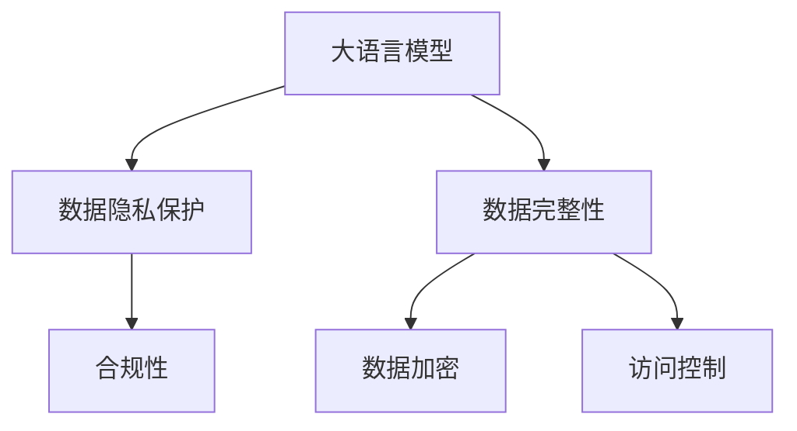

                 

# AI 大模型在电商搜索推荐中的数据安全策略：保障用户隐私与数据完整性

## 1. 背景介绍

### 1.1 问题由来
在电商搜索推荐系统中，大语言模型正被广泛应用于构建自然语言理解与生成引擎，以提升用户体验和销售转化率。然而，这种基于大模型的推荐系统在数据安全和隐私保护方面也面临着诸多挑战。用户数据的安全与隐私问题不仅是法规要求，更是用户信任的基础。如何在保障用户隐私的前提下，利用大模型优化推荐系统性能，是一个亟待解决的现实问题。

### 1.2 问题核心关键点
针对电商搜索推荐中大模型的数据安全问题，我们需要关注以下核心关键点：

1. 用户隐私保护：如何确保用户搜索记录、点击行为等敏感数据不被滥用，避免信息泄露风险。
2. 数据完整性：如何防止数据在传输和存储过程中被篡改或丢失，确保模型的训练数据可靠。
3. 合规性：如何在不同国家和地区的法律法规下，合规使用用户数据，避免侵犯用户隐私。

## 2. 核心概念与联系

### 2.1 核心概念概述

为了更好地理解在电商搜索推荐中大模型的数据安全策略，本节将介绍几个关键概念：

1. **大语言模型(Large Language Model, LLM)**：如BERT、GPT等预训练语言模型，具备强大的自然语言理解和生成能力。
2. **数据隐私保护**：指在数据处理和分析过程中，保护用户个人信息的安全，避免数据滥用和泄露。
3. **数据完整性**：确保数据在存储和传输过程中保持原始性和未被篡改的状态。
4. **合规性**：在数据使用过程中，遵守相关的法律法规，包括但不限于GDPR、CCPA等。
5. **数据加密**：对数据进行加密处理，使得未授权人员无法读取或篡改数据。
6. **访问控制**：对数据访问进行严格管理，确保只有授权人员可以访问特定数据。

这些概念之间的逻辑关系可以通过以下Mermaid流程图来展示：



这个流程图展示了在大模型推荐系统中，数据隐私保护、数据完整性和合规性是相互关联、相辅相成的核心概念。

## 3. 核心算法原理 & 具体操作步骤
### 3.1 算法原理概述

在电商搜索推荐中，大模型的数据安全策略主要涉及以下几个关键点：

1. **用户隐私保护**：通过差分隐私、联邦学习等技术，确保用户数据不被泄露。
2. **数据完整性**：通过数据校验和加密传输等手段，确保数据传输过程中未被篡改。
3. **合规性**：通过数据最小化原则、匿名化处理等技术，确保在法律法规的框架下使用数据。

### 3.2 算法步骤详解

#### 3.2.1 用户隐私保护

差分隐私（Differential Privacy）是一种隐私保护技术，通过添加噪声来保护个体数据隐私，使得攻击者无法从数据中推断出具体的个人信息。具体步骤如下：

1. **噪声注入**：在训练模型前，将随机噪声注入到用户数据中，确保无法单独识别出任何个体。
2. **隐私预算管理**：根据数据敏感度和隐私需求，设置隐私预算，控制噪声的添加量。
3. **模型训练**：在噪声化后的数据上进行模型训练，确保模型学习的是基于整体数据分布的统计特性，而非个体数据。

#### 3.2.2 数据完整性

数据完整性保护主要通过以下步骤实现：

1. **数据校验码**：在数据存储和传输过程中，添加数据校验码，确保数据未被篡改。
2. **加密传输**：使用SSL/TLS等加密协议，对数据在网络传输过程中进行加密处理，防止中间人攻击。
3. **数据备份与恢复**：定期备份数据，并设计恢复机制，确保数据在发生丢失或损坏时能够快速恢复。

#### 3.2.3 合规性

1. **数据最小化原则**：仅收集和使用必要的数据，避免过度收集，减少隐私泄露风险。
2. **匿名化处理**：对用户数据进行去标识化处理，确保无法与特定个体关联，保护用户隐私。
3. **访问控制与审计**：设计严格的访问控制机制，确保只有授权人员可以访问特定数据，并定期审计访问日志，防止数据滥用。

### 3.3 算法优缺点

#### 3.3.1 用户隐私保护

- **优点**：有效保护用户隐私，符合现代数据隐私法规的要求。
- **缺点**：可能影响模型的训练效果，增加计算复杂度。

#### 3.3.2 数据完整性

- **优点**：确保数据未被篡改，提高模型训练数据的可靠性。
- **缺点**：可能增加系统的复杂度和成本，尤其在数据校验和加密传输方面。

#### 3.3.3 合规性

- **优点**：符合法律法规要求，降低法律风险。
- **缺点**：可能会增加数据处理的复杂度和成本，尤其在数据最小化和匿名化方面。

### 3.4 算法应用领域

大模型的数据安全策略广泛应用于电商搜索推荐系统中，具体包括：

- **个性化推荐**：通过差分隐私保护用户行为数据，构建个性化的推荐模型。
- **智能客服**：保护用户查询信息，确保客服对话数据的安全性。
- **广告投放**：在广告投放过程中，确保用户行为数据的隐私和安全。

## 4. 数学模型和公式 & 详细讲解  
### 4.1 数学模型构建

在大模型推荐系统中，隐私保护和数据完整性的数学模型构建如下：

- **差分隐私模型**：通过添加拉普拉斯噪声，实现隐私保护。噪声量 $\epsilon$ 控制隐私预算，公式如下：
  $$
  \mathcal{L}(\theta) = \frac{1}{N} \sum_{i=1}^N \ell(M_{\theta}(x_i),y_i) + \frac{\epsilon}{\Delta} \sum_{i=1}^N \log\left(\frac{\Delta}{\epsilon}\right)
  $$

- **数据完整性模型**：通过添加数据校验码，确保数据未被篡改。校验码计算公式如下：
  $$
  \text{Checksum} = \sum_{i=1}^N x_i \mod M
  $$
  其中 $M$ 为质数。

### 4.2 公式推导过程

1. **差分隐私公式推导**：
  $$
  \mathcal{L}(\theta) = \frac{1}{N} \sum_{i=1}^N \ell(M_{\theta}(x_i),y_i) + \frac{\epsilon}{\Delta} \sum_{i=1}^N \log\left(\frac{\Delta}{\epsilon}\right)
  $$
  其中 $\ell$ 为损失函数，$\Delta$ 为隐私预算，$\epsilon$ 为隐私参数。

2. **数据完整性公式推导**：
  $$
  \text{Checksum} = \sum_{i=1}^N x_i \mod M
  $$
  其中 $x_i$ 为数据元素，$M$ 为质数。

### 4.3 案例分析与讲解

**案例1：差分隐私在电商推荐中的实现**

某电商网站希望构建基于大模型的个性化推荐系统，但需确保用户隐私。使用差分隐私技术，通过添加拉普拉斯噪声，确保用户数据的安全性。

**案例2：数据完整性在电商推荐中的实现**

某电商平台需要从用户历史数据中提取特征，进行模型训练。为确保数据未被篡改，对数据进行加密传输，并在接收端验证数据完整性。

## 5. 项目实践：代码实例和详细解释说明
### 5.1 开发环境搭建

在进行数据安全策略的开发实践前，我们需要准备好开发环境。以下是使用Python进行TensorFlow开发的环境配置流程：

1. 安装Anaconda：从官网下载并安装Anaconda，用于创建独立的Python环境。

2. 创建并激活虚拟环境：
```bash
conda create -n tf-env python=3.8 
conda activate tf-env
```

3. 安装TensorFlow：根据CUDA版本，从官网获取对应的安装命令。例如：
```bash
conda install tensorflow==2.7 -c pytorch -c conda-forge
```

4. 安装各类工具包：
```bash
pip install numpy pandas scikit-learn matplotlib tqdm jupyter notebook ipython
```

完成上述步骤后，即可在`tf-env`环境中开始实践。

### 5.2 源代码详细实现

接下来，我们将以差分隐私和数据完整性为例，给出使用TensorFlow实现隐私保护和数据完整性的代码示例。

#### 5.2.1 差分隐私实现

```python
import tensorflow as tf
import numpy as np

# 构造假数据集
N = 1000
x = np.random.randn(N)
y = np.random.randint(2, size=N)

# 差分隐私保护
epsilon = 0.1
delta = 0.1
privacy_budget = epsilon + delta
clipping_norm = 1.0

# 构造拉普拉斯分布的噪声
noise = tf.random.uniform(shape=[N], minval=-1.0, maxval=1.0, dtype=tf.float32)
noise /= np.linalg.norm(noise)
noise *= clipping_norm * np.sqrt(2.0 / np.exp(-epsilon))

# 添加噪声到数据
x_noise = x + noise

# 训练模型
model = tf.keras.Sequential([
    tf.keras.layers.Dense(64, activation='relu', input_shape=(N,)),
    tf.keras.layers.Dense(1, activation='sigmoid')
])

model.compile(optimizer='adam', loss='binary_crossentropy', metrics=['accuracy'])

model.fit(x_noise, y, epochs=10, batch_size=32)
```

#### 5.2.2 数据完整性实现

```python
import tensorflow as tf

# 构造假数据集
N = 1000
x = np.random.randn(N)
y = np.random.randint(2, size=N)

# 数据完整性校验
M = 11

# 计算校验和
checksum = np.sum(x % M)

# 传输过程中加密
encrypted_checksum = checksum.to_bytes(4, byteorder='big')

# 接收端验证
decrypted_checksum = encrypted_checksum.astype(np.uint32)
correct_checksum = np.sum(x % M)

if decrypted_checksum == correct_checksum:
    print("数据完整性验证通过")
else:
    print("数据完整性验证失败")
```

### 5.3 代码解读与分析

让我们再详细解读一下关键代码的实现细节：

**差分隐私实现**：
- 通过构造拉普拉斯噪声，将原始数据 $x$ 转化为 $x+\text{noise}$。
- 通过设置隐私预算 $\epsilon$ 和 $\delta$，计算出模型损失函数 $\mathcal{L}$，最小化损失函数进行模型训练。

**数据完整性实现**：
- 通过计算数据校验和 $\text{Checksum}$，确保数据未被篡改。
- 对校验和进行加密传输，接收端解密后验证数据完整性。

## 6. 实际应用场景
### 6.1 智能客服系统

在智能客服系统中，大模型需处理大量用户查询信息。为保护用户隐私，系统通过差分隐私技术，保护用户查询记录。同时，使用数据完整性校验技术，确保客服对话数据的完整性和可靠性。

### 6.2 广告投放系统

广告投放系统需要精准分析用户行为数据，进行个性化广告推荐。通过差分隐私保护用户行为数据，同时使用数据完整性技术，确保广告投放数据的安全性和准确性。

### 6.3 个性化推荐系统

个性化推荐系统需从用户历史数据中提取特征，构建推荐模型。系统通过差分隐私保护用户数据，同时使用数据完整性校验技术，确保特征数据的完整性和安全性。

### 6.4 未来应用展望

随着差分隐私和数据完整性技术的不断发展，大模型在电商搜索推荐中的应用前景将更加广阔。未来，这些技术将与区块链、分布式计算等前沿技术深度融合，为电商推荐系统带来更强的隐私保护和数据完整性保障。

## 7. 工具和资源推荐
### 7.1 学习资源推荐

为了帮助开发者系统掌握差分隐私和数据完整性在大模型推荐系统中的应用，这里推荐一些优质的学习资源：

1. TensorFlow差分隐私文档：详细介绍了如何使用TensorFlow实现差分隐私技术。
2. TensorFlow数据完整性文档：介绍了如何实现数据校验和加密传输等数据完整性技术。
3. 《深度学习基础》课程：斯坦福大学开设的深度学习课程，讲解了差分隐私的基本原理和实现方法。
4. 《数据完整性保护》书籍：介绍了数据完整性保护的各种技术和算法，适用于深入学习。

通过学习这些资源，相信你一定能够快速掌握差分隐私和数据完整性在大模型推荐系统中的应用，并用于解决实际的问题。

### 7.2 开发工具推荐

高效的开发离不开优秀的工具支持。以下是几款用于差分隐私和数据完整性开发的工具：

1. TensorFlow：基于Python的开源深度学习框架，提供了丰富的隐私保护和数据完整性技术。
2. PyTorch：开源深度学习框架，适合快速迭代研究，提供了多种隐私保护和数据完整性技术。
3. HuggingFace Transformers库：提供了多种预训练语言模型，支持差分隐私和数据完整性技术。
4. OpenSSL：开源加密库，支持多种加密算法和协议，确保数据传输安全。
5. Bouncy Castle：开源加密库，支持多种数据加密和校验算法，确保数据存储安全。

合理利用这些工具，可以显著提升差分隐私和数据完整性技术的开发效率，加快创新迭代的步伐。

### 7.3 相关论文推荐

差分隐私和数据完整性技术的发展源于学界的持续研究。以下是几篇奠基性的相关论文，推荐阅读：

1. Differential Privacy：差分隐私技术的提出者之一，发表了多篇差分隐私的重要论文。
2. Secure Multi-party Computation：多方安全计算技术的先驱者，介绍了如何在多党之间安全计算。
3. Data Anonymization Techniques：介绍了多种数据匿名化技术，适用于数据完整性保护。

这些论文代表了大模型推荐系统在差分隐私和数据完整性技术的发展脉络。通过学习这些前沿成果，可以帮助研究者把握学科前进方向，激发更多的创新灵感。

## 8. 总结：未来发展趋势与挑战
### 8.1 总结

本文对大模型在电商搜索推荐中的数据安全策略进行了全面系统的介绍。首先阐述了差分隐私、数据完整性和合规性的研究背景和意义，明确了这些技术在大模型推荐系统中的关键作用。其次，从原理到实践，详细讲解了差分隐私和数据完整性的数学模型和实现步骤，给出了代码实例和详细解释。同时，本文还探讨了这些技术在智能客服、广告投放、个性化推荐等电商推荐场景中的应用，展示了其广阔的应用前景。此外，本文精选了差分隐私和数据完整性技术的各类学习资源，力求为读者提供全方位的技术指引。

通过本文的系统梳理，可以看到，差分隐私和数据完整性技术正在成为电商推荐系统中的重要保障，极大地提升了用户数据的安全性和可靠性。未来，伴随差分隐私和数据完整性技术的持续演进，大模型推荐系统必将在更广泛的应用领域发挥重要作用，为电商推荐带来革命性变革。

### 8.2 未来发展趋势

展望未来，差分隐私和数据完整性技术将呈现以下几个发展趋势：

1. **技术成熟度提升**：随着差分隐私和数据完整性算法的优化，这些技术在大模型推荐系统中的应用将更加高效和可靠。
2. **跨平台协作**：差分隐私和数据完整性技术将与区块链、分布式计算等前沿技术深度融合，提升系统的可扩展性和鲁棒性。
3. **模型推理优化**：通过优化差分隐私和数据完整性技术的模型推理过程，提升大模型推荐系统的实时性和性能。
4. **隐私计算框架**：构建隐私计算框架，提供多种隐私保护和数据完整性技术，方便开发者快速应用。
5. **多模态数据整合**：将差分隐私和数据完整性技术应用于多模态数据的整合，提升推荐系统的丰富性和多样性。

以上趋势凸显了差分隐私和数据完整性技术的广阔前景。这些方向的探索发展，必将进一步提升大模型推荐系统的性能和应用范围，为电商推荐带来新的突破。

### 8.3 面临的挑战

尽管差分隐私和数据完整性技术已经取得了显著成果，但在迈向更加智能化、普适化应用的过程中，仍面临诸多挑战：

1. **计算资源消耗**：差分隐私和数据完整性技术通常会增加计算复杂度，对硬件资源有较高要求。
2. **模型性能影响**：差分隐私和数据完整性技术可能影响模型的训练效果和推理性能。
3. **合规性复杂性**：不同国家和地区的法律法规各不相同，实现合规性仍需深入研究。
4. **用户信任建立**：用户对隐私保护技术的理解和信任度仍需提高，需加强用户教育和技术普及。

### 8.4 研究展望

面对差分隐私和数据完整性技术面临的挑战，未来的研究需要在以下几个方面寻求新的突破：

1. **算法优化**：开发更加高效的差分隐私和数据完整性算法，减小计算资源消耗，提升模型性能。
2. **跨领域应用**：将差分隐私和数据完整性技术应用于更多领域，如医疗、金融等，提升数据安全保护水平。
3. **用户教育**：通过技术普及和用户教育，提升用户对隐私保护技术的理解和信任度，建立良性互动。
4. **法规完善**：参与制定和完善隐私保护法律法规，推动数据安全保护的规范化发展。
5. **技术融合**：探索差分隐私和数据完整性技术与区块链、分布式计算等前沿技术的深度融合，提升系统安全性和可靠性。

这些研究方向的探索，必将引领差分隐私和数据完整性技术迈向更高的台阶，为构建安全、可靠、可解释、可控的智能系统铺平道路。面向未来，差分隐私和数据完整性技术还需要与其他人工智能技术进行更深入的融合，共同推动自然语言理解和智能交互系统的进步。只有勇于创新、敢于突破，才能不断拓展语言模型的边界，让智能技术更好地造福人类社会。

## 9. 附录：常见问题与解答

**Q1：差分隐私如何影响模型训练效果？**

A: 差分隐私通过添加噪声来保护个体隐私，但噪声的加入会降低模型训练数据的质量，从而可能影响模型训练效果。建议根据隐私预算和模型敏感度，合理设置噪声强度，平衡隐私保护和模型性能。

**Q2：数据完整性如何确保数据未被篡改？**

A: 数据完整性通过计算数据校验和，确保数据在传输和存储过程中未被篡改。接收端验证数据校验和，确保数据的完整性。

**Q3：如何确保差分隐私和数据完整性技术在合规性方面的应用？**

A: 差分隐私和数据完整性技术的应用需遵守不同国家和地区的法律法规。建议定期更新法律法规，确保技术应用合规。

**Q4：差分隐私和数据完整性技术在大模型推荐系统中的具体应用场景有哪些？**

A: 差分隐私和数据完整性技术在大模型推荐系统中的应用场景包括智能客服、广告投放、个性化推荐等，确保用户数据的安全性和可靠性。

**Q5：差分隐私和数据完整性技术未来发展趋势如何？**

A: 差分隐私和数据完整性技术未来将更加成熟和高效，与区块链、分布式计算等前沿技术深度融合，提升系统的可扩展性和鲁棒性。

作者：禅与计算机程序设计艺术 / Zen and the Art of Computer Programming

