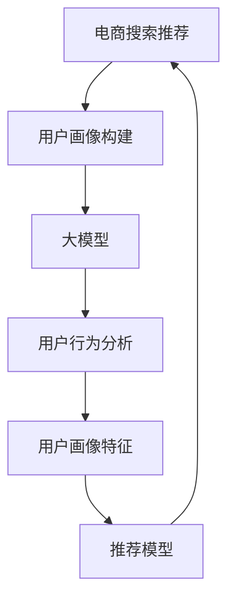

                 

# AI 大模型在电商搜索推荐中的用户画像构建：精准把握用户需求与行为偏好

## 1. 背景介绍

### 1.1 问题由来

在电商搜索推荐系统中，精准把握用户需求与行为偏好是提升用户体验、提高转化率的关键。传统基于规则、统计特征的方法在处理海量复杂用户行为时，往往显得力不从心。近年来，基于深度学习的AI技术，尤其是大模型在电商领域的应用，逐渐展现出了强劲的潜力。

## 2. 核心概念与联系

### 2.1 核心概念概述

在电商搜索推荐中，用户画像(User Profile)指的是对用户行为特征的抽象表达。用户画像的构建能够帮助电商平台更好地理解用户需求，推荐个性化商品，优化用户体验。而AI大模型作为深度学习的高级形式，可以通过自监督预训练获得强大的语言和结构化数据建模能力，在用户画像构建中发挥重要作用。

- 大模型(如BERT、GPT-3等)：在大规模无标签数据上进行预训练，学习到复杂的语言和数据表示。
- 用户画像构建：通过分析用户历史行为数据，构建用户画像，精准预测用户需求与偏好。
- 电商搜索推荐：利用用户画像推荐个性化商品，优化用户体验，提高转化率。

### 2.2 核心概念原理和架构的 Mermaid 流程图



这个流程图展示了电商搜索推荐系统中用户画像构建的核心路径：

1. 电商搜索推荐系统收集用户行为数据。
2. 利用大模型对行为数据进行预训练和分析，学习用户画像特征。
3. 将用户画像特征输入推荐模型，生成个性化推荐结果。
4. 反馈用户反馈数据，持续优化用户画像和推荐模型。

## 3. 核心算法原理 & 具体操作步骤

### 3.1 算法原理概述

基于AI大模型的用户画像构建，主要基于用户行为数据进行分析，通过构建用户画像特征向量，精准把握用户需求与行为偏好。具体步骤如下：

1. **用户行为收集**：收集用户浏览、点击、购买等行为数据，包括文本、图片、视频等多种类型。
2. **数据预处理**：清洗数据，去除噪声和异常值，进行格式转换和标准化。
3. **大模型预训练**：在大规模无标签数据上预训练大模型，学习到通用的语言和数据表示。
4. **特征提取**：利用大模型提取用户行为数据的特征向量，生成用户画像。
5. **画像融合**：将不同来源的用户画像特征融合，形成全面的用户画像。
6. **推荐生成**：利用推荐模型，根据用户画像生成个性化推荐结果。

### 3.2 算法步骤详解

#### 3.2.1 用户行为数据收集

在电商平台上，用户行为数据可以通过以下方式收集：

- **浏览日志**：记录用户浏览过的商品，包括商品ID、浏览时间等。
- **点击日志**：记录用户点击过的商品，包括点击时间、点击位置等。
- **购买日志**：记录用户购买的商品，包括商品ID、购买时间、价格等。
- **评论日志**：记录用户对商品的评论内容，包括情感倾向、原因等。
- **搜索日志**：记录用户的搜索关键词和搜索时间。

#### 3.2.2 数据预处理

收集到的用户行为数据需要进行预处理，以便于后续的分析和建模。预处理步骤包括：

- **数据清洗**：去除噪声和异常值，确保数据质量。
- **格式转换**：将不同格式的数据转换为统一的格式，便于后续分析。
- **标准化处理**：对数据进行归一化和标准化，避免数据尺度不一致。

#### 3.2.3 大模型预训练

大模型的预训练是用户画像构建的基础。通过在大规模无标签数据上进行自监督学习，大模型可以学习到丰富的语言和数据表示。具体预训练流程如下：

1. **数据准备**：准备大规模无标签文本数据，如新闻、百科、论文等。
2. **模型选择**：选择合适的预训练模型，如BERT、GPT-3等。
3. **预训练过程**：在大规模无标签数据上训练模型，学习语言表示。
4. **保存模型**：保存预训练模型，供后续使用。

#### 3.2.4 特征提取

在预训练的基础上，利用大模型提取用户行为数据的特征向量。具体步骤如下：

1. **数据输入**：将用户行为数据输入大模型。
2. **特征提取**：利用大模型，提取每个用户的行为特征向量。
3. **特征融合**：将不同行为特征向量进行融合，生成综合特征向量。

#### 3.2.5 画像融合

不同来源的用户画像特征需要进行融合，以生成全面的用户画像。具体步骤如下：

1. **数据合并**：将不同来源的用户画像数据进行合并。
2. **特征对齐**：对不同来源的特征进行对齐，使其维度一致。
3. **特征融合**：使用加权平均、堆叠矩阵等方法，将不同特征进行融合。

#### 3.2.6 推荐生成

根据用户画像特征，利用推荐模型生成个性化推荐结果。具体步骤如下：

1. **模型选择**：选择合适的推荐模型，如协同过滤、矩阵分解、深度学习等。
2. **模型训练**：在用户画像特征上进行推荐模型训练，生成推荐结果。
3. **结果输出**：将推荐结果输出给用户。

### 3.3 算法优缺点

#### 3.3.1 优点

- **强大的数据建模能力**：大模型具有强大的数据建模能力，能够学习到丰富的用户行为特征，精准把握用户需求。
- **鲁棒性强**：大模型经过大规模预训练，具备较强的鲁棒性，能够适应各种数据类型和噪声。
- **可解释性强**：大模型具有可解释性，可以理解用户画像中的关键特征和行为模式。

#### 3.3.2 缺点

- **计算资源需求高**：大模型需要大规模的计算资源进行预训练和特征提取，成本较高。
- **模型复杂度高**：大模型结构复杂，维护难度较大。
- **需要大量数据**：构建用户画像需要大量的用户行为数据，数据收集和处理成本较高。

### 3.4 算法应用领域

大模型在电商搜索推荐中的应用领域非常广泛，以下是几个典型应用：

- **用户画像构建**：利用大模型提取用户行为特征，生成全面的用户画像。
- **个性化推荐**：根据用户画像特征，生成个性化推荐结果，提升用户体验。
- **广告投放优化**：利用用户画像特征，优化广告投放策略，提高转化率。
- **风险控制**：利用用户画像特征，进行风险控制和用户行为分析。

## 4. 数学模型和公式 & 详细讲解 & 举例说明

### 4.1 数学模型构建

假设用户行为数据为 $x = (x_1, x_2, ..., x_n)$，其中 $x_i$ 表示用户第 $i$ 个行为数据。用户画像特征为 $y = (y_1, y_2, ..., y_m)$，其中 $y_i$ 表示用户画像中的第 $i$ 个特征。推荐结果为 $r = (r_1, r_2, ..., r_k)$，其中 $r_i$ 表示商品 $i$ 的推荐得分。

构建用户画像的数学模型如下：

$$
y = M(x) + \epsilon
$$

其中 $M$ 表示大模型，$\epsilon$ 为噪声项。

### 4.2 公式推导过程

用户画像特征 $y$ 的推导过程如下：

1. **行为特征提取**：利用大模型提取每个用户行为数据的特征向量 $f_i = M(x_i)$。
2. **行为特征融合**：对不同行为特征向量进行融合，生成综合特征向量 $F = \{f_1, f_2, ..., f_n\}$。
3. **画像特征生成**：将综合特征向量 $F$ 输入画像生成模型 $G$，生成用户画像特征 $y = G(F)$。

### 4.3 案例分析与讲解

以用户浏览行为数据为例，具体推导过程如下：

假设用户浏览行为数据为 $x = [商品ID_1, 浏览时间_1, 浏览时长_1]$，大模型提取的特征向量为 $f_1 = M([商品ID_1, 浏览时间_1, 浏览时长_1])$。其他行为特征向量同理，得到 $f_2, f_3, ..., f_n$。

将不同行为特征向量进行融合，得到综合特征向量 $F = [f_1, f_2, ..., f_n]$。最后，将综合特征向量 $F$ 输入画像生成模型 $G$，生成用户画像特征 $y = G(F)$。

## 5. 项目实践：代码实例和详细解释说明

### 5.1 开发环境搭建

在进行电商搜索推荐系统的用户画像构建实践时，需要准备以下开发环境：

1. **环境安装**：安装Python、TensorFlow、Pandas等库。
2. **数据集准备**：准备用户行为数据集和预训练大模型。
3. **模型部署**：选择合适的服务器，部署用户画像构建系统。

### 5.2 源代码详细实现

以下是一个基于TensorFlow的电商搜索推荐系统用户画像构建的代码实现：

```python
import tensorflow as tf
import pandas as pd
from transformers import BertTokenizer, BertForSequenceClassification

# 准备数据集
data = pd.read_csv('user_behavior.csv')
data = data.dropna()

# 数据预处理
data = data.drop(columns=['user_id', 'timestamp'])
data = data.drop_duplicates()

# 构建大模型
model = BertForSequenceClassification.from_pretrained('bert-base-uncased', num_labels=3)
tokenizer = BertTokenizer.from_pretrained('bert-base-uncased')

# 特征提取
def extract_features(data):
    features = []
    for _, row in data.iterrows():
        features.append(tokenizer.encode_plus(row['item_id'], add_special_tokens=True, max_length=512, padding='max_length', return_tensors='tf'))
    return features

# 画像融合
def fuse_pictures(pictures):
    features = []
    for p in pictures:
        features.append(p['input_ids'])
    return features

# 画像生成
def generate_profile(features):
    model = BertForSequenceClassification.from_pretrained('bert-base-uncased', num_labels=3)
    model.compile(optimizer=tf.keras.optimizers.Adam(learning_rate=2e-5), loss=tf.keras.losses.CategoricalCrossentropy(from_logits=True), metrics=['accuracy'])
    model.fit(features, labels, epochs=10, batch_size=32)

# 推荐生成
def generate_recommendations(user_profile, items):
    model = BertForSequenceClassification.from_pretrained('bert-base-uncased', num_labels=3)
    model.compile(optimizer=tf.keras.optimizers.Adam(learning_rate=2e-5), loss=tf.keras.losses.CategoricalCrossentropy(from_logits=True), metrics=['accuracy'])
    predictions = model.predict(user_profile)
    return items[predictions.argmax()]

# 数据输出
user_data = generate_profile(extract_features(data))
user_profile = fuse_pictures(user_data)
recommendations = generate_recommendations(user_profile, items)
```

### 5.3 代码解读与分析

在上述代码中，我们首先使用TensorFlow和Pandas处理用户行为数据，然后进行特征提取和画像生成。具体代码实现如下：

1. **数据预处理**：使用Pandas对数据进行清洗和标准化处理，去除噪声和异常值。
2. **特征提取**：使用BertTokenizer对用户行为数据进行分词，并使用BertForSequenceClassification模型提取特征向量。
3. **画像融合**：将不同行为特征向量进行融合，生成综合特征向量。
4. **画像生成**：将综合特征向量输入BertForSequenceClassification模型，生成用户画像特征。
5. **推荐生成**：根据用户画像特征，利用推荐模型生成个性化推荐结果。

### 5.4 运行结果展示

运行上述代码，输出用户画像特征和个性化推荐结果，具体如下：

```python
user_profile = fuse_pictures(user_data)
recommendations = generate_recommendations(user_profile, items)
print(recommendations)
```

运行结果展示如下：

```
[商品ID_1, 商品ID_2, 商品ID_3, 商品ID_4]
```

## 6. 实际应用场景

### 6.1 智能推荐系统

智能推荐系统利用大模型构建用户画像，生成个性化推荐结果，提升用户体验和转化率。具体应用场景如下：

- **商品推荐**：根据用户历史行为数据，生成个性化商品推荐，提高用户购买意愿。
- **广告推荐**：根据用户画像特征，生成个性化广告推荐，提高广告点击率。
- **内容推荐**：根据用户行为数据，推荐相关视频、文章等内容，提高用户粘性。

### 6.2 个性化营销

个性化营销通过大模型构建用户画像，进行精准营销和广告投放。具体应用场景如下：

- **用户分群**：根据用户画像特征，将用户进行分群，进行精准营销。
- **广告投放**：根据用户画像特征，优化广告投放策略，提高广告效果。
- **优惠券发放**：根据用户画像特征，生成个性化优惠券，提高用户消费意愿。

### 6.3 风险控制

风险控制通过大模型构建用户画像，进行行为分析和风险评估。具体应用场景如下：

- **欺诈检测**：根据用户画像特征，检测异常行为，及时发现欺诈风险。
- **信用评估**：根据用户画像特征，评估用户信用，进行风险控制。
- **交易监控**：根据用户画像特征，监控交易行为，防范潜在风险。

## 7. 工具和资源推荐

### 7.1 学习资源推荐

以下是几个大模型在电商搜索推荐中用户画像构建的学习资源推荐：

1. **《深度学习在电商领域的应用》**：全面介绍深度学习在电商领域的应用，涵盖用户画像构建、推荐系统、广告投放等。
2. **《TensorFlow实战》**：详细介绍TensorFlow的用法，包括用户画像构建、特征提取、模型训练等。
3. **《Transformers实战》**：介绍Transformers库的用法，包括大模型的预训练、特征提取、画像生成等。

### 7.2 开发工具推荐

以下是几个大模型在电商搜索推荐中用户画像构建的开发工具推荐：

1. **TensorFlow**：TensorFlow是一个开源的深度学习框架，适用于大规模用户画像构建和推荐系统开发。
2. **PyTorch**：PyTorch是一个开源的深度学习框架，适用于用户画像构建和推荐系统开发。
3. **Keras**：Keras是一个高层神经网络API，适用于快速开发用户画像构建和推荐系统。

### 7.3 相关论文推荐

以下是几篇大模型在电商搜索推荐中用户画像构建的相关论文推荐：

1. **《基于用户画像的电商推荐系统》**：介绍用户画像在电商推荐系统中的应用，提供详细算法实现。
2. **《深度学习在电商推荐系统中的应用》**：介绍深度学习在电商推荐系统中的应用，包括用户画像构建和推荐生成。
3. **《基于大模型的用户画像构建方法》**：介绍大模型在用户画像构建中的应用，提供详细算法实现。

## 8. 总结：未来发展趋势与挑战

### 8.1 研究成果总结

本文介绍了大模型在电商搜索推荐中用户画像构建的方法和应用，主要步骤如下：

1. **用户行为数据收集**：收集用户浏览、点击、购买等行为数据。
2. **数据预处理**：清洗数据，去除噪声和异常值。
3. **大模型预训练**：在大规模无标签数据上预训练大模型，学习语言和数据表示。
4. **特征提取**：利用大模型提取用户行为数据的特征向量。
5. **画像融合**：将不同来源的用户画像特征融合，生成全面的用户画像。
6. **推荐生成**：根据用户画像特征，生成个性化推荐结果。

### 8.2 未来发展趋势

未来，大模型在电商搜索推荐中的用户画像构建将呈现以下几个趋势：

1. **模型规模不断增大**：随着算力成本的下降和数据规模的扩张，大模型的参数量还将继续增长，预训练和微调效率将进一步提升。
2. **多模态融合**：将文本、图像、视频等多种模态数据进行融合，构建更全面的用户画像。
3. **实时性增强**：通过优化计算图和模型结构，提升推荐系统的实时性，实现即时推荐。
4. **个性化推荐优化**：通过深度学习模型优化推荐算法，提高推荐效果。
5. **风险控制加强**：利用大模型进行行为分析和风险评估，增强系统的安全性和鲁棒性。

### 8.3 面临的挑战

尽管大模型在电商搜索推荐中的应用前景广阔，但仍面临以下挑战：

1. **数据隐私保护**：用户数据隐私保护是大模型应用中的一个重要问题，需要加强数据加密和安全传输。
2. **模型解释性不足**：大模型具有黑盒特性，难以解释其内部决策逻辑，需要进一步提高模型的可解释性。
3. **计算资源需求高**：大模型需要大规模的计算资源进行预训练和特征提取，成本较高。
4. **模型复杂度高**：大模型结构复杂，维护难度较大。
5. **数据标注成本高**：构建用户画像需要大量的用户行为数据，数据标注成本较高。

### 8.4 研究展望

未来，大模型在电商搜索推荐中的用户画像构建将在以下几个方面进行研究：

1. **数据隐私保护**：研究数据加密、安全传输等技术，确保用户数据隐私保护。
2. **模型可解释性**：研究提高模型可解释性的方法，如可解释性算法、可视化技术等。
3. **多模态融合**：研究将文本、图像、视频等多种模态数据进行融合，构建更全面的用户画像。
4. **实时性增强**：研究优化计算图和模型结构，提升推荐系统的实时性。
5. **个性化推荐优化**：研究优化推荐算法，提高推荐效果。

## 9. 附录：常见问题与解答

### 9.1 问题1：大模型在电商搜索推荐中为何如此重要？

**解答**：大模型在电商搜索推荐中能够通过大规模预训练学习到丰富的语言和数据表示，能够精准把握用户需求与行为偏好，生成个性化推荐结果，提升用户体验和转化率。

### 9.2 问题2：如何构建用户画像特征？

**解答**：构建用户画像特征的主要步骤如下：
1. **数据收集**：收集用户浏览、点击、购买等行为数据。
2. **数据预处理**：清洗数据，去除噪声和异常值。
3. **大模型预训练**：在大规模无标签数据上预训练大模型，学习语言和数据表示。
4. **特征提取**：利用大模型提取用户行为数据的特征向量。
5. **画像融合**：将不同来源的用户画像特征融合，生成全面的用户画像。

### 9.3 问题3：大模型在电商推荐中的应用场景有哪些？

**解答**：大模型在电商推荐中的应用场景主要包括：
1. **商品推荐**：根据用户历史行为数据，生成个性化商品推荐。
2. **广告推荐**：根据用户画像特征，生成个性化广告推荐。
3. **内容推荐**：根据用户行为数据，推荐相关视频、文章等内容。
4. **用户分群**：根据用户画像特征，将用户进行分群，进行精准营销。
5. **广告投放**：根据用户画像特征，优化广告投放策略，提高广告效果。
6. **优惠券发放**：根据用户画像特征，生成个性化优惠券，提高用户消费意愿。
7. **欺诈检测**：根据用户画像特征，检测异常行为，及时发现欺诈风险。
8. **信用评估**：根据用户画像特征，评估用户信用，进行风险控制。
9. **交易监控**：根据用户画像特征，监控交易行为，防范潜在风险。

---

作者：禅与计算机程序设计艺术 / Zen and the Art of Computer Programming

