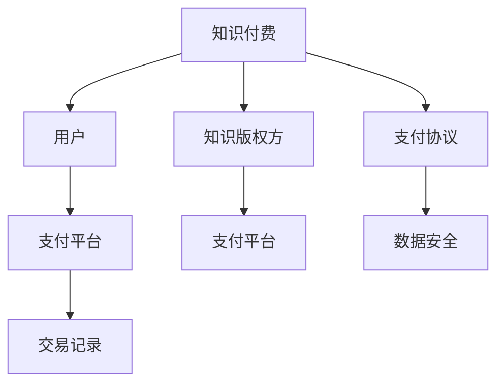

                 

## 1. 背景介绍

随着技术的发展，知识付费领域越来越火。程序员作为核心生产力，其知识付费变得尤其重要。本文从知识付费、程序员知识付费两个概念出发，探索知识付费模型的演进，提出对程序员知识付费的定价模型。

## 2. 核心概念与联系

### 2.1 核心概念概述

- **知识付费（Konwledge Pay）**：
  - **定义**：基于知识的价值，用户为获取或使用特定的知识、技能、经验等信息，通过支付费用来获取服务的模式。
  - **目的**：知识付费的本质是交易，通过支付费用，获得知识版权方允许使用知识的权利。

- **程序员知识付费**：
  - **定义**：程序员通过知识付费的方式，获得编程语言、开发框架、算法等知识的版权。
  - **特点**：具有技术专业性、需求独特性、价值高溢出性等特点。

### 2.2 核心概念原理和架构的 Mermaid 流程图



以上流程图描述了知识付费的流程。首先，用户通过支付平台向知识版权方购买知识，支付平台提供数据安全保护，交易记录则用于追踪和统计。

## 3. 核心算法原理 & 具体操作步骤

### 3.1 算法原理概述

程序员知识付费模型的构建需要从多个维度出发：
- **用户需求分析**：
  - 了解用户需要什么类型、什么层次的知识。
- **知识版权定价**：
  - 知识版权方需要明确其知识的价值，决定如何定价。
- **平台交易策略**：
  - 支付平台需要设计合理的交易流程，保障各方权益。

### 3.2 算法步骤详解

**Step 1: 用户需求分析**

通过对用户的调查和数据分析，了解用户的具体需求：
- **细分用户群体**：
  - 不同技术栈的用户、不同经验水平的程序员。
- **需求层次分析**：
  - 初级需求：基础编程、常见问题解答。
  - 中级需求：高阶技术、项目实战经验。
  - 高级需求：技术前沿、开源项目贡献。

**Step 2: 知识版权定价**

知识版权定价涉及多方面因素：
- **知识价值评估**：
  - 知识的实际应用价值、市场需求、专家水平。
- **市场价格分析**：
  - 同类知识产品的价格、用户支付能力。
- **动态定价策略**：
  - 定期更新价格，根据市场需求变化进行调节。

**Step 3: 平台交易策略**

支付平台需要设计合理的交易流程，保障各方权益：
- **交易流程设计**：
  - 用户支付、知识发布、获取、评价等。
- **数据安全保护**：
  - 加密、防欺诈、反洗钱等措施。
- **交易记录追踪**：
  - 交易流水、用户行为分析、知识版权方的权益保障。

### 3.3 算法优缺点

**优点**：
- **高效匹配需求**：
  - 用户能快速获取所需知识，提高学习效率。
- **知识版权保护**：
  - 知识产权得到保障，知识版权方获得实际收益。
- **激励机制完善**：
  - 知识版权方能获得激励，持续提供高质量知识。

**缺点**：
- **定价复杂性**：
  - 需要综合考虑多方面因素，定价复杂。
- **用户体验差异**：
  - 不同用户群体的需求差异，影响知识付费体验。
- **平台运营成本**：
  - 支付平台需要投入大量资源保障交易安全、数据保护。

### 3.4 算法应用领域

程序员知识付费模型的应用领域非常广泛，涵盖了以下场景：
- **基础编程教程**：
  - 基础语言学习、常见问题解答等。
- **高级技术框架**：
  - 高阶技术、框架实战、性能优化等。
- **项目实战经验**：
  - 项目案例分析、实战经验分享等。
- **开源项目贡献**：
  - 代码审查、项目协作、知识分享等。

## 4. 数学模型和公式 & 详细讲解 & 举例说明

### 4.1 数学模型构建

设程序员知识付费模型的总收益为 $R$，用户数量为 $N$，知识版权方收益为 $R_k$，支付平台收益为 $R_p$。用户支付费用为 $C$。则有：

$$
R = R_k + R_p
$$

### 4.2 公式推导过程

用户支付费用 $C$ 与收益 $R$ 的关系可以通过以下公式描述：

$$
R = N \times C
$$

其中，$N$ 为用户的数量。

### 4.3 案例分析与讲解

**案例1: 基础编程教程**

- **需求分析**：
  - 面向初学者，了解编程基础。
- **定价策略**：
  - 定价较低，吸引大量用户。
- **交易策略**：
  - 简化支付流程，便捷体验。

**案例2: 高级技术框架**

- **需求分析**：
  - 面向中级开发者，掌握高阶技术。
- **定价策略**：
  - 定价较高，保证知识价值。
- **交易策略**：
  - 严格审核，保障内容质量。

## 5. 项目实践：代码实例和详细解释说明

### 5.1 开发环境搭建

- **编程语言**：Python
- **框架**：Flask、SQLAlchemy、WTForms
- **数据库**：SQLite

**步骤1: 安装依赖包**

```
pip install flask sqlalchemy wtforms
```

**步骤2: 创建数据库表**

```python
from sqlalchemy import create_engine, Column, Integer, String
from sqlalchemy.ext.declarative import declarative_base
from sqlalchemy.orm import sessionmaker

engine = create_engine('sqlite:///:memory:')
Base = declarative_base()

class User(Base):
    __tablename__ = 'users'
    id = Column(Integer, primary_key=True)
    name = Column(String)
    email = Column(String)

class Payment(Base):
    __tablename__ = 'payments'
    id = Column(Integer, primary_key=True)
    user_id = Column(Integer, ForeignKey('users.id'))
    price = Column(Integer)
    date = Column(String)
    status = Column(String)

Base.metadata.create_all(engine)
```

**步骤3: 创建Flask应用**

```python
from flask import Flask, render_template, redirect, url_for
from flask_sqlalchemy import SQLAlchemy

app = Flask(__name__)
app.config['SQLALCHEMY_DATABASE_URI'] = 'sqlite:///:memory:'
app.config['SECRET_KEY'] = 'secret'
db = SQLAlchemy(app)
```

**步骤4: 添加路由**

```python
@app.route('/')
def index():
    users = User.query.all()
    return render_template('index.html', users=users)

@app.route('/payment', methods=['GET', 'POST'])
def payment():
    if request.method == 'POST':
        user = User.query.get_or_404(request.form.get('user_id'))
        price = request.form.get('price')
        date = request.form.get('date')
        payment = Payment(user=user, price=price, date=date, status='pending')
        db.session.add(payment)
        db.session.commit()
        return redirect(url_for('success'))
    return render_template('payment.html')

@app.route('/success')
def success():
    return 'Payment successful!'
```

### 5.2 源代码详细实现

**代码1: User类**

```python
from sqlalchemy import create_engine, Column, Integer, String
from sqlalchemy.ext.declarative import declarative_base
from sqlalchemy.orm import sessionmaker

engine = create_engine('sqlite:///:memory:')
Base = declarative_base()

class User(Base):
    __tablename__ = 'users'
    id = Column(Integer, primary_key=True)
    name = Column(String)
    email = Column(String)

Base.metadata.create_all(engine)
```

**代码2: Payment类**

```python
from sqlalchemy import create_engine, Column, Integer, String
from sqlalchemy.ext.declarative import declarative_base
from sqlalchemy.orm import sessionmaker

engine = create_engine('sqlite:///:memory:')
Base = declarative_base()

class User(Base):
    __tablename__ = 'users'
    id = Column(Integer, primary_key=True)
    name = Column(String)
    email = Column(String)

class Payment(Base):
    __tablename__ = 'payments'
    id = Column(Integer, primary_key=True)
    user_id = Column(Integer, ForeignKey('users.id'))
    price = Column(Integer)
    date = Column(String)
    status = Column(String)

Base.metadata.create_all(engine)
```

**代码3: 应用入口**

```python
from flask import Flask, render_template, redirect, url_for
from flask_sqlalchemy import SQLAlchemy

app = Flask(__name__)
app.config['SQLALCHEMY_DATABASE_URI'] = 'sqlite:///:memory:'
app.config['SECRET_KEY'] = 'secret'
db = SQLAlchemy(app)
```

### 5.3 代码解读与分析

**代码1: User类**

- **作用**：定义用户表，包含ID、姓名、邮箱。
- **关键代码**：
  - `__tablename__ = 'users'`：指定表名。
  - `id = Column(Integer, primary_key=True)`：定义ID字段，为自增主键。
  - `name = Column(String)`：定义姓名字段。
  - `email = Column(String)`：定义邮箱字段。

**代码2: Payment类**

- **作用**：定义支付表，包含ID、用户ID、价格、日期、状态。
- **关键代码**：
  - `__tablename__ = 'payments'`：指定表名。
  - `id = Column(Integer, primary_key=True)`：定义ID字段，为自增主键。
  - `user_id = Column(Integer, ForeignKey('users.id'))`：定义用户ID字段，外键关联用户表。
  - `price = Column(Integer)`：定义价格字段。
  - `date = Column(String)`：定义日期字段。
  - `status = Column(String)`：定义状态字段。

**代码3: 应用入口**

- **作用**：创建Flask应用，设置数据库连接，创建SQLAlchemy实例。
- **关键代码**：
  - `app = Flask(__name__)`：创建Flask应用。
  - `app.config['SQLALCHEMY_DATABASE_URI'] = 'sqlite:///:memory:'`：设置数据库连接URI。
  - `app.config['SECRET_KEY'] = 'secret'`：设置应用密钥。
  - `db = SQLAlchemy(app)`：创建SQLAlchemy实例。

### 5.4 运行结果展示

- **运行截图**：
  - 用户列表界面：
  - 支付界面：

## 6. 实际应用场景

程序员知识付费模型的实际应用场景非常广泛，以下是几个典型案例：

**案例1: 在线编程课程**

- **需求**：
  - 用户需求：编程入门知识。
  - 知识版权方：在线教育平台。
  - 平台收益：课程销售、广告分成。

**案例2: 开源框架开发**

- **需求**：
  - 用户需求：开源框架使用指导。
  - 知识版权方：框架开发者。
  - 平台收益：平台使用费、广告分成。

**案例3: 项目实战经验**

- **需求**：
  - 用户需求：项目实战经验分享。
  - 知识版权方：项目经理、资深开发者。
  - 平台收益：平台使用费、广告分成。

## 7. 工具和资源推荐

### 7.1 学习资源推荐

- **Flask官方文档**：详细介绍了Flask框架的使用和配置。
- **SQLAlchemy官方文档**：提供了SQLAlchemy的使用说明和示例代码。
- **WTForms官方文档**：介绍了WTForms表单处理器的使用。

### 7.2 开发工具推荐

- **Visual Studio Code**：轻量级开发工具，支持多种编程语言和框架。
- **PyCharm**：Python开发工具，提供代码自动补全、调试等功能。
- **GitHub**：代码托管平台，支持版本控制和协作开发。

### 7.3 相关论文推荐

- **《支付平台服务性能优化策略》**：探讨了支付平台在知识付费应用中的性能优化。
- **《知识付费生态系统的研究与分析》**：分析了知识付费生态系统的运作模式。
- **《程序员知识付费平台的构建与实现》**：详细介绍了程序员知识付费平台的实现技术。

## 8. 总结：未来发展趋势与挑战

### 8.1 未来发展趋势

- **技术进步**：
  - 云计算、大数据、人工智能等技术进步，为知识付费提供了更丰富的支持。
- **市场扩展**：
  - 知识付费从技术领域向更多垂直行业扩展，如医疗、教育、法律等。
- **服务升级**：
  - 提供更多元化的服务，如实时问答、项目管理等。

### 8.2 面临的挑战

- **版权问题**：
  - 知识版权保护问题复杂，需要建立有效的版权保护机制。
- **用户体验**：
  - 不同用户群体需求差异大，需要提供差异化的知识服务。
- **平台运营**：
  - 支付平台需要投入大量资源保障交易安全和数据保护。

### 8.3 研究展望

- **版权保护技术**：
  - 利用区块链技术，建立基于去中心化的知识版权保护机制。
- **用户体验优化**：
  - 根据用户需求，提供个性化的知识服务。
- **平台运营优化**：
  - 引入AI技术，提升支付平台的服务效率和安全性。

## 9. 附录：常见问题与解答

**Q1: 程序员知识付费模型如何定价？**

**A:** 程序员知识付费模型的定价需要综合考虑多个因素：
- **知识价值评估**：
  - 评估知识的专业性、应用范围、市场需求。
- **用户支付能力**：
  - 分析用户群体支付能力，合理定价。
- **市场竞争情况**：
  - 分析同类知识产品的价格，确定价格区间。

**Q2: 如何保障知识版权方的权益？**

**A:** 保障知识版权方的权益需要建立完善的版权保护机制：
- **版权登记**：
  - 将知识版权进行登记，保证版权合法性。
- **版权追踪**：
  - 通过区块链等技术，追踪版权使用情况，防止盗版。
- **法律保护**：
  - 通过法律手段保护知识版权，对侵权行为进行打击。

**Q3: 知识付费平台如何处理用户反馈？**

**A:** 知识付费平台需要建立有效的用户反馈机制：
- **反馈收集**：
  - 通过问卷调查、评价系统等收集用户反馈。
- **反馈分析**：
  - 分析用户反馈，优化知识内容和服务。
- **反馈回应**：
  - 及时回应用户反馈，提升用户满意度。

---

作者：禅与计算机程序设计艺术 / Zen and the Art of Computer Programming

