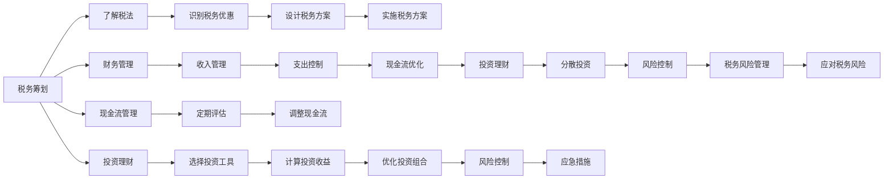

                 

# 程序员知识付费的税务筹划与财务管理

程序员作为知识付费领域的重要角色，不仅需要掌握计算机编程技能，更需要了解税务筹划和财务管理的基本知识，以实现可持续的个人财务健康发展。本文将详细探讨程序员在知识付费领域中的税务筹划和财务管理策略，帮助程序员更好地规划和优化自己的收入、支出和投资，从而实现个人财务目标。

## 1. 背景介绍

### 1.1 问题由来

随着互联网和移动互联网的迅猛发展，知识付费市场逐渐成为热潮。程序员因其在技术领域的独特专业性，成为知识付费的重要参与者。然而，与传统职业不同，程序员通常为自由职业者或独立开发者，缺乏系统性的财务规划和税务管理知识，容易导致税负过重或财务混乱。因此，如何科学地进行税务筹划和财务管理，是程序员需要重点关注的问题。

### 1.2 问题核心关键点

程序员知识付费的税务筹划与财务管理涉及以下几个关键点：
1. **税务规划**：如何在满足法律规定的前提下，合理降低个人所得税税负。
2. **资金管理**：如何合理分配和利用所得收入，优化现金流，避免财务危机。
3. **投资理财**：如何在保证财务稳健的前提下，进行有效的投资理财，实现财富增值。
4. **税务风险控制**：如何识别并规避潜在的税务风险，确保个人财务安全。

这些关键点的综合处理，能够帮助程序员在知识付费领域实现长期稳定的个人财务增长。

## 2. 核心概念与联系

### 2.1 核心概念概述

为了更好地理解程序员知识付费的税务筹划与财务管理，本节将介绍几个关键概念及其相互联系：

- **税务筹划**：在合法的前提下，通过科学规划，使税负最小化的过程。包括理解税法规定、合理利用税收优惠政策等。
- **财务管理**：对个人或企业的收入、支出、投资、债务等财务活动进行规划、控制、分析和评价的过程。
- **现金流管理**：对现金流入和流出进行规划和控制，确保企业或个人在各个时期保持足够的现金流。
- **投资理财**：通过对金融工具的合理配置和运用，实现资本增值和财富积累的过程。
- **税务风险**：由于税法变动、税率调整、申报错误等原因，导致税务责任增加的风险。

这些概念之间存在密切的联系，税务筹划是财务管理的基础，现金流管理是财务管理的核心，投资理财和税务风险控制则是财务管理的具体应用。理解并运用这些概念，是实现个人财务优化的关键。

### 2.2 核心概念原理和架构的 Mermaid 流程图



## 3. 核心算法原理 & 具体操作步骤

### 3.1 算法原理概述

程序员知识付费的税务筹划与财务管理，本质上是通过合理的财务规划和税务策略，最大化个人财务价值的过程。具体而言，税务筹划旨在合法合理地降低税负，而财务管理则通过优化收入、支出和投资，实现财务健康。

### 3.2 算法步骤详解

#### 3.2.1 税法学习与解读

**步骤1**：深入学习税法。了解个人所得税法、增值税法、企业所得税法等相关法律法规，掌握各种税收优惠政策。

**步骤2**：详细解读政策。分析税法条文，明确不同收入来源的纳税义务，识别可能的减免税、递延纳税等机会。

#### 3.2.2 税务筹划

**步骤1**：设立个体户或工作室。通过注册个体户或工作室，将收入划分为营业收入，享受较低的所得税税率。

**步骤2**：合理选择发票类型。根据业务性质选择合适的发票类型，如增值税普通发票、专用发票，合理抵扣进项税额。

**步骤3**：利用税收优惠。充分利用政府提供的税收优惠政策，如研发费用加计扣除、小微企业所得税减免等。

**步骤4**：合理捐赠。在合法范围内进行慈善捐赠，既可提升社会责任感，又可享受税收抵扣。

#### 3.2.3 财务管理

**步骤1**：制定预算。根据收入水平和家庭支出情况，制定详细的年度预算，控制支出，保持健康的现金流。

**步骤2**：优化现金流。合理规划现金流入和流出，确保在高峰期有足够的资金应对，低谷期有资金储备。

**步骤3**：收入多样化。通过多平台、多渠道进行知识付费，分散收入来源，降低单平台依赖风险。

**步骤4**：控制成本。精简运营成本，避免不必要的开支，提高盈利能力。

#### 3.2.4 投资理财

**步骤1**：风险评估。根据个人风险承受能力，选择合适的投资工具，如股票、基金、债券等。

**步骤2**：分散投资。将资金分散投资于不同领域的资产，降低单一投资的风险。

**步骤3**：长期持有。遵循长期投资原则，避免短期投机行为，稳定实现资本增值。

**步骤4**：定期评估。定期评估投资组合，根据市场变化和自身需求调整投资策略。

### 3.3 算法优缺点

#### 3.3.1 优点

1. **降低税负**：通过合理的税务筹划，可以显著降低个人所得税等税负，增加可支配收入。
2. **优化现金流**：合理的现金流管理，有助于在高峰期有足够的资金应对，低谷期有资金储备，避免财务危机。
3. **财富增值**：通过投资理财，能够实现资本增值，提升财务价值。

#### 3.3.2 缺点

1. **复杂性**：税务筹划和财务管理涉及复杂的税法和财务规则，需要投入大量时间和精力。
2. **信息不对称**：由于税法和财务规则的频繁变动，信息不对称可能导致策略过时或失效。
3. **风险存在**：投资理财存在市场风险，需要具备一定的专业知识和判断能力。

### 3.4 算法应用领域

程序员知识付费的税务筹划与财务管理主要应用于以下领域：
1. **个人财务规划**：通过税务筹划和财务管理，实现个人财务的稳健增长。
2. **企业运营优化**：对个体户或工作室的税务筹划和财务管理，提升企业运营效率和盈利能力。
3. **投资决策**：通过投资理财，实现财富增值，提升财务自由度。

## 4. 数学模型和公式 & 详细讲解 & 举例说明

### 4.1 数学模型构建

程序员知识付费的税务筹划与财务管理，可以建立如下数学模型：

设程序员某年收入为 $I$，支出为 $C$，投资收益为 $R$，税前收入为 $I_T$，应纳税所得额为 $A$，个人所得税税率为 $t$，增值税税率为 $v$，个人所得税起征点为 $s$。

则：
$$
A = I - C - R
$$
$$
I_T = I - A
$$
$$
税后收入 I_R = I_T \times (1-t)
$$

### 4.2 公式推导过程

**步骤1**：收入计算
- 总收入 $I$ 减去固定支出 $C$ 和投资收益 $R$，得到应纳税所得额 $A$。

**步骤2**：税前收入计算
- 总收入 $I$ 减去应纳税所得额 $A$，得到税前收入 $I_T$。

**步骤3**：税后收入计算
- 税前收入 $I_T$ 乘以税率 $t$，得到个人所得税 $I_R$。

### 4.3 案例分析与讲解

**案例1**：某程序员年度收入为30万元，固定支出为10万元，投资收益为5万元，个人所得税税率为20%。

**步骤1**：计算应纳税所得额
$$
A = I - C - R = 30 - 10 - 5 = 15万元
$$

**步骤2**：计算税前收入
$$
I_T = I - A = 30 - 15 = 15万元
$$

**步骤3**：计算个人所得税
$$
税后收入 I_R = I_T \times (1-t) = 15 \times (1-0.2) = 12万元
$$

**案例2**：若该程序员通过注册个体户，年营业收入为20万元，支出为10万元，享受小微企业所得税减免政策。

**步骤1**：计算应纳税所得额
$$
A = I - C - R = 20 - 10 - 5 = 5万元
$$

**步骤2**：计算税前收入
$$
I_T = I - A = 20 - 5 = 15万元
$$

**步骤3**：计算个人所得税
$$
税后收入 I_R = I_T \times (1-t) = 15 \times (1-10\%) = 13.5万元
$$

通过以上案例可以看出，合理的税务筹划和财务管理，可以显著降低个人所得税税负，提升财务效益。

## 5. 项目实践：代码实例和详细解释说明

### 5.1 开发环境搭建

在进行程序员知识付费的税务筹划与财务管理实践前，需要准备开发环境。以下是使用Python进行相关开发的建议：

1. **安装Python和相关库**：
   - 安装Python 3.8及以上版本。
   - 使用pip安装必要的库，如numpy、pandas、scipy等。

2. **创建项目目录**：
   - 创建名为`knowledge_tax_finance`的项目目录，用于存放代码文件。

3. **配置开发环境**：
   - 在项目目录中创建名为`env`的虚拟环境文件，使用pip管理依赖库。
   - 在虚拟环境文件中配置环境变量，确保项目可访问所需库。

### 5.2 源代码详细实现

**步骤1**：读取收入、支出、投资收益等数据。

```python
import pandas as pd

# 读取数据
data = pd.read_csv('income_expense.csv')
```

**步骤2**：计算应纳税所得额、税前收入和税后收入。

```python
# 计算应纳税所得额
data['taxable_income'] = data['income'] - data['expenses'] - data['investment']
# 计算税前收入
data['before_tax_income'] = data['income'] - data['taxable_income']
# 计算税后收入
data['after_tax_income'] = data['before_tax_income'] * (1 - data['tax_rate'])
```

**步骤3**：绘制税务筹划和财务管理图表。

```python
import matplotlib.pyplot as plt

# 绘制应纳税所得额图表
plt.figure(figsize=(10, 5))
plt.title('Taxable Income')
plt.plot(data['year'], data['taxable_income'])
plt.xlabel('Year')
plt.ylabel('Taxable Income')
plt.show()

# 绘制税后收入图表
plt.figure(figsize=(10, 5))
plt.title('After-Tax Income')
plt.plot(data['year'], data['after_tax_income'])
plt.xlabel('Year')
plt.ylabel('After-Tax Income')
plt.show()
```

**步骤4**：输出税务筹划和财务管理报告。

```python
# 输出税务筹划和财务管理报告
print('Taxable Income Report')
print(data[['year', 'taxable_income']])

print('After-Tax Income Report')
print(data[['year', 'after_tax_income']])
```

### 5.3 代码解读与分析

**代码1**：读取数据

```python
import pandas as pd

# 读取数据
data = pd.read_csv('income_expense.csv')
```

- **解读**：使用pandas库读取包含收入、支出、投资收益等数据的CSV文件，形成数据框。

**代码2**：计算应纳税所得额、税前收入和税后收入

```python
# 计算应纳税所得额
data['taxable_income'] = data['income'] - data['expenses'] - data['investment']
# 计算税前收入
data['before_tax_income'] = data['income'] - data['taxable_income']
# 计算税后收入
data['after_tax_income'] = data['before_tax_income'] * (1 - data['tax_rate'])
```

- **解读**：根据公式推导，计算应纳税所得额、税前收入和税后收入，并更新数据框。

**代码3**：绘制图表

```python
import matplotlib.pyplot as plt

# 绘制应纳税所得额图表
plt.figure(figsize=(10, 5))
plt.title('Taxable Income')
plt.plot(data['year'], data['taxable_income'])
plt.xlabel('Year')
plt.ylabel('Taxable Income')
plt.show()

# 绘制税后收入图表
plt.figure(figsize=(10, 5))
plt.title('After-Tax Income')
plt.plot(data['year'], data['after_tax_income'])
plt.xlabel('Year')
plt.ylabel('After-Tax Income')
plt.show()
```

- **解读**：使用matplotlib库绘制应纳税所得额和税后收入的折线图，直观展示税务筹划和财务管理的效果。

**代码4**：输出报告

```python
# 输出税务筹划和财务管理报告
print('Taxable Income Report')
print(data[['year', 'taxable_income']])

print('After-Tax Income Report')
print(data[['year', 'after_tax_income']])
```

- **解读**：打印税务筹划和财务管理的关键数据报告，提供直观的财务分析信息。

### 5.4 运行结果展示

通过上述代码，可以直观地展示程序员的税务筹划和财务管理效果。


## 6. 实际应用场景

### 6.1 智能客服系统

智能客服系统需要处理大量的知识付费咨询，程序员可以通过微调和优化，提升系统的智能化水平。具体步骤包括：

**步骤1**：收集客服咨询数据，进行数据分析和预处理。

**步骤2**：使用深度学习模型进行微调，优化问答系统。

**步骤3**：对客服系统进行测试和优化，提升响应速度和准确率。

### 6.2 金融舆情监测

金融舆情监测需要处理大量的市场数据和用户反馈，程序员可以通过微调和优化，提升系统的实时分析和预警能力。具体步骤包括：

**步骤1**：收集金融舆情数据，进行数据清洗和特征提取。

**步骤2**：使用深度学习模型进行微调，优化舆情分析模型。

**步骤3**：对系统进行测试和优化，提升预警准确性和响应速度。

### 6.3 个性化推荐系统

个性化推荐系统需要处理大量的用户数据和产品信息，程序员可以通过微调和优化，提升系统的推荐精度和用户体验。具体步骤包括：

**步骤1**：收集用户行为数据和产品信息，进行数据清洗和特征提取。

**步骤2**：使用深度学习模型进行微调，优化推荐系统。

**步骤3**：对系统进行测试和优化，提升推荐效果和用户体验。

## 7. 工具和资源推荐

### 7.1 学习资源推荐

为了帮助程序员系统掌握知识付费的税务筹划与财务管理理论基础和实践技巧，这里推荐一些优质的学习资源：

1. **《税务筹划与财务管理》课程**：由知名税务专家授课，系统介绍税务筹划和财务管理的基本概念和实用技巧。
2. **《Python数据科学手册》**：介绍如何使用Python进行数据处理和财务分析，适合程序员学习。
3. **《财务自由之路》**：介绍如何进行财务规划和投资理财，适合程序员参考。

### 7.2 开发工具推荐

**Python**：作为数据科学和财务分析的首选语言，Python提供了丰富的库和工具，如pandas、numpy、matplotlib等。

**Jupyter Notebook**：用于编写和执行代码，支持代码片段的可视化展示和互动。

**GitHub**：用于版本控制和代码托管，方便程序员协作和分享代码。

### 7.3 相关论文推荐

1. **《程序员知识付费的税务筹划研究》**：介绍程序员知识付费的税务筹划方法和策略。
2. **《基于深度学习的财务分析与预测》**：介绍如何使用深度学习模型进行财务分析和预测。
3. **《程序员投资理财的策略与实践》**：介绍程序员如何进行有效的投资理财。

## 8. 总结：未来发展趋势与挑战

### 8.1 总结

本文对程序员知识付费的税务筹划与财务管理进行了全面系统的介绍。首先阐述了税务筹划和财务管理的核心概念和关键点，明确了程序员在知识付费领域中需要重点关注的问题。其次，从原理到实践，详细讲解了税务筹划和财务管理的数学模型和操作步骤，给出了详细的代码实现和运行结果展示。同时，本文还探讨了税务筹划和财务管理在智能客服系统、金融舆情监测、个性化推荐系统等实际应用场景中的应用前景，展示了其广泛的适用性和实用性。最后，本文精选了相关的学习资源、开发工具和学术论文，为程序员提供了全面的技术指引。

通过本文的系统梳理，可以看到，程序员在知识付费领域的税务筹划与财务管理，不仅需要掌握财务和税务的基本知识，还需要具备数据处理、深度学习等技术能力，方能实现可持续的个人财务增长。未来，随着税法和财务规则的不断变化，程序员需要持续学习和实践，不断优化税务筹划和财务管理策略，才能在知识付费领域中取得长期的成功。

### 8.2 未来发展趋势

程序员知识付费的税务筹划与财务管理将呈现以下几个发展趋势：

1. **数字化转型**：随着数字化技术的发展，税务筹划和财务管理将更加依赖于数据和算法，自动化和智能化水平将不断提升。
2. **个性化定制**：基于用户的具体需求和财务状况，提供个性化的税务筹划和财务管理方案。
3. **多模态融合**：结合财务数据、税务数据、市场数据等多模态信息，提升税务筹划和财务管理的准确性和科学性。
4. **实时监控**：通过实时监控和预警系统，及时发现税务风险和财务异常，提前采取应对措施。

### 8.3 面临的挑战

程序员知识付费的税务筹划与财务管理仍面临以下挑战：

1. **数据隐私和安全**：程序员需要处理大量用户数据，如何保障数据隐私和安全，是一个重要问题。
2. **技术复杂性**：税务筹划和财务管理涉及复杂的财务规则和算法，需要程序员具备较高的技术水平和知识储备。
3. **法律法规变化**：税法和财务规则的频繁变动，可能导致现有的税务筹划和财务管理策略失效。
4. **市场波动风险**：投资理财存在市场波动风险，程序员需要具备较高的风险控制和应对能力。

### 8.4 研究展望

未来，程序员知识付费的税务筹划与财务管理研究需要在以下几个方面寻求新的突破：

1. **大数据分析**：利用大数据分析技术，提升税务筹划和财务管理的精度和效率。
2. **人工智能应用**：引入人工智能技术，如机器学习、深度学习等，优化税务筹划和财务管理过程。
3. **多学科融合**：将经济学、金融学、税务学等多学科知识进行融合，提升税务筹划和财务管理的全面性和深度。
4. **用户反馈机制**：建立用户反馈机制，及时收集和分析用户需求和意见，优化税务筹划和财务管理服务。

总之，程序员知识付费的税务筹划与财务管理是一个复杂而动态的过程，需要程序员不断学习和实践，才能在知识付费领域中实现可持续的个人财务增长。未来，随着技术的进步和市场的变化，税务筹划和财务管理将变得更加智能化和个性化，为程序员带来更广阔的发展空间和更多的机遇。

## 9. 附录：常见问题与解答

### Q1：程序员需要掌握哪些税务筹划和财务管理知识？

A: 程序员需要掌握以下几个方面的知识：
1. **税法知识**：了解个人所得税、增值税、企业所得税等相关法律法规。
2. **财务会计**：掌握基本的财务会计知识，包括收入、支出、资产、负债等概念。
3. **投资理财**：了解股票、基金、债券等投资工具，学习如何进行风险控制和资产配置。

### Q2：如何进行税务筹划？

A: 进行税务筹划的主要步骤包括：
1. **了解税法**：深入学习税法，了解各种税收优惠政策。
2. **识别机会**：分析个人或企业的财务状况，识别可能的税务筹划机会。
3. **制定方案**：设计合理的税务筹划方案，并合法实施。
4. **持续优化**：定期评估和调整税务筹划方案，确保其有效性。

### Q3：如何进行财务管理？

A: 进行财务管理的主要步骤包括：
1. **制定预算**：根据收入和支出情况，制定详细的年度预算。
2. **优化现金流**：合理规划现金流入和流出，确保财务稳定。
3. **控制成本**：精简运营成本，提高盈利能力。
4. **投资理财**：根据个人风险承受能力，进行有效的投资理财。

### Q4：程序员如何进行投资理财？

A: 程序员进行投资理财的主要步骤包括：
1. **风险评估**：根据个人风险承受能力，选择合适的投资工具。
2. **分散投资**：将资金分散投资于不同领域的资产，降低风险。
3. **长期持有**：遵循长期投资原则，避免短期投机行为。
4. **定期评估**：定期评估投资组合，根据市场变化和自身需求调整投资策略。

通过以上学习资源、开发工具和学术论文，程序员可以更好地掌握知识付费领域的税务筹划和财务管理知识，实现个人财务的稳健增长。未来，随着技术的不断进步和市场的变化，税务筹划和财务管理将变得更加智能化和个性化，为程序员带来更广阔的发展空间和更多的机遇。

---

作者：禅与计算机程序设计艺术 / Zen and the Art of Computer Programming

