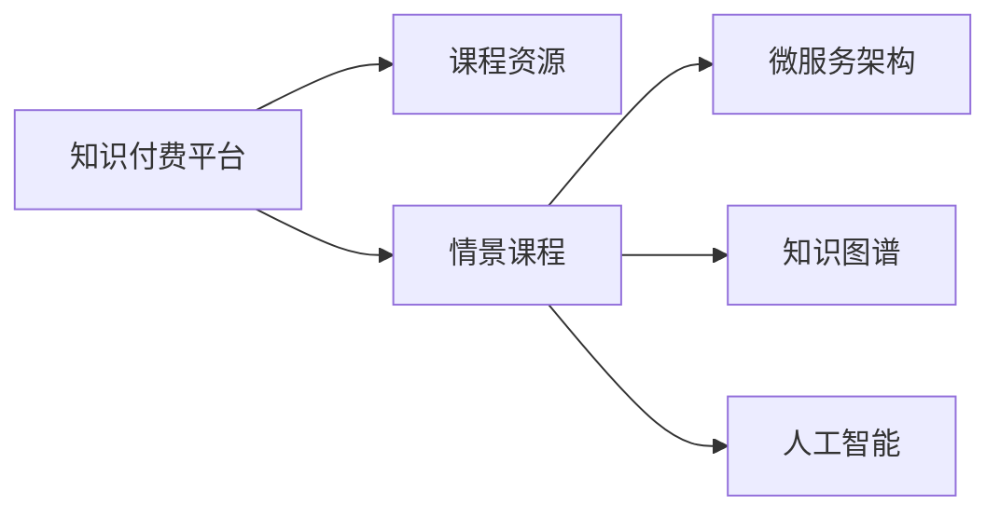

                 

# 程序员知识付费：打造情景课程

## 1. 背景介绍

在快速变化的互联网时代，技术更新迭代不断，程序员需要不断学习新技能以保持竞争力。传统的一对多、一对一的教学方式无法满足个性化、场景化的学习需求。知识付费平台应运而生，以其形式多样、内容专业、学习灵活等优点，成为新时代程序员的重要学习渠道。

为了适应不同学员的学习节奏和兴趣，知识付费平台纷纷推出情景课程，模拟真实工作场景，让学员在实践中学习、在场景中成长。情景课程在知识付费领域的应用，正成为行业发展的重要趋势。

## 2. 核心概念与联系

### 2.1 核心概念概述

- **知识付费平台(Knowledge-based Platforms)**：基于互联网提供专业知识的平台，提供课程、文章、视频等学习资源，为学员提供针对性、高效的学习服务。
- **情景课程(Contextual Courses)**：结合具体工作场景设计课程内容，引导学员在特定情景下进行学习和实践，实现技能提升和职业发展。
- **微服务架构(Microservices Architecture)**：将复杂的应用系统拆分成多个小的、独立的服务模块，提高系统的可扩展性和灵活性。
- **知识图谱(Knowledge Graphs)**：用于存储和管理大量结构化知识信息的数据模型，支持智能查询和推理。
- **人工智能(Artificial Intelligence)**：使计算机具备人类智能的技术，包括机器学习、自然语言处理、计算机视觉等。

### 2.2 核心概念原理和架构的 Mermaid 流程图



这个流程图展示了知识付费平台、情景课程、微服务架构、知识图谱和人工智能之间的关系：

1. **知识付费平台**：作为知识传播的渠道，提供多样化的学习资源。
2. **情景课程**：基于微服务架构和人工智能技术，设计针对特定场景的课程内容。
3. **微服务架构**：拆分服务模块，提高系统可扩展性和灵活性。
4. **知识图谱**：存储和管理知识，支持智能查询和推理。
5. **人工智能**：提供智能化的教学支持，增强学习效果。

## 3. 核心算法原理 & 具体操作步骤

### 3.1 算法原理概述

情景课程的构建基于微服务架构和人工智能技术，通过以下步骤实现：

1. **需求分析**：根据学员的行业背景、职位需求和学习目标，确定课程需要涵盖的知识点和技能。
2. **情景设计**：将课程内容与实际工作场景结合，设计具体的案例和任务。
3. **微服务拆分**：将课程内容拆分成多个微服务模块，每个模块负责完成特定任务。
4. **智能推荐**：利用知识图谱和人工智能技术，推荐适合的课程内容和学习路径。
5. **进度跟踪**：记录学员的学习进度和表现，提供个性化的学习建议。

### 3.2 算法步骤详解

**Step 1: 需求分析**
- 调研目标学员的背景、需求和兴趣。
- 确定课程的总体目标和知识点。
- 制定课程大纲和教学计划。

**Step 2: 情景设计**
- 结合学员的工作场景，设计具体的案例和任务。
- 将课程内容划分为多个子任务，每个子任务聚焦特定知识点。
- 设计评估标准，确保任务目标明确、可评估。

**Step 3: 微服务拆分**
- 根据子任务的不同，拆分课程内容为多个微服务模块。
- 每个微服务模块负责一个子任务，包含必要的教学资源和练习。
- 使用容器化和微服务框架（如Docker、Kubernetes）部署微服务。

**Step 4: 智能推荐**
- 利用知识图谱存储学员的学习历史和偏好。
- 使用推荐算法（如协同过滤、深度学习等）推荐适合的学习内容和路径。
- 根据学员的学习进度和表现，动态调整推荐算法参数。

**Step 5: 进度跟踪**
- 记录学员的学习时间、练习成绩和课程进度。
- 定期发送学习报告，提供个性化反馈和建议。
- 跟踪学员的学习成果，评估课程效果。

### 3.3 算法优缺点

**优点**：
1. **个性化学习**：根据学员需求和兴趣，提供定制化的学习路径和内容。
2. **场景化教学**：通过情景课程，模拟真实工作场景，提高学员的实战能力。
3. **微服务灵活性**：采用微服务架构，提高系统的可扩展性和灵活性。
4. **智能化推荐**：利用人工智能技术，推荐合适的学习内容和路径。

**缺点**：
1. **开发成本高**：设计情景课程和微服务架构需要耗费大量时间和资源。
2. **数据质量要求高**：知识图谱和推荐算法依赖高质量的数据支持，数据质量直接影响推荐效果。
3. **学习动机管理**：保持学员的学习兴趣和动力，需要不断创新和优化课程设计。
4. **技术门槛高**：需要具备较强的编程和系统设计能力，才能有效实施情景课程。

### 3.4 算法应用领域

情景课程的应用领域非常广泛，以下是几个典型的应用场景：

- **软件开发**：提供具体的项目案例和编程练习，帮助学员掌握软件开发技能。
- **数据科学**：设计数据清洗、数据可视化、机器学习等任务，培养数据科学家的技能。
- **网络安全**：模拟黑客攻击和防御任务，提高网络安全从业人员的实战能力。
- **项目管理**：通过具体项目案例，教授敏捷开发、项目管理等知识。
- **人工智能**：设计模型训练、数据预处理等任务，帮助学员掌握AI技能。

## 4. 数学模型和公式 & 详细讲解

### 4.1 数学模型构建

情景课程的数学模型主要包括以下几个部分：

1. **学员特征模型**：描述学员的背景、需求和兴趣。
2. **课程内容模型**：描述课程的知识点、技能和任务。
3. **学习进度模型**：记录学员的学习时间、成绩和进度。
4. **推荐算法模型**：根据学员特征和课程内容，推荐适合的学习路径和内容。

### 4.2 公式推导过程

以推荐算法模型为例，假设学员特征为 $F$，课程内容为 $C$，推荐算法为 $A$，推荐结果为 $R$。推荐算法可以表示为：

$$
R = A(F, C)
$$

其中，$A$ 是推荐算法函数，$F$ 是学员特征向量，$C$ 是课程内容向量。推荐算法函数 $A$ 可以根据协同过滤、深度学习等方法设计。

### 4.3 案例分析与讲解

假设某情景课程的推荐算法模型为协同过滤算法，其数学公式为：

$$
R_{u,i} = \frac{\sum_{v \in \mathcal{U}}\alpha_{u,v}R_{v,i}}{\sum_{v \in \mathcal{U}}\alpha_{u,v}}
$$

其中，$R_{u,i}$ 是学员 $u$ 对课程 $i$ 的评分，$\alpha_{u,v}$ 是学员 $u$ 和课程 $v$ 之间的相似度，$\mathcal{U}$ 是所有学员的集合。

在实际应用中，我们需要通过数据收集和预处理，构建学员特征模型和课程内容模型，然后利用协同过滤算法计算推荐结果。

## 5. 项目实践：代码实例和详细解释说明

### 5.1 开发环境搭建

情景课程的开发需要以下环境：

1. **编程语言**：Python，推荐使用PyTorch或TensorFlow。
2. **框架和库**：Django、Flask、Keras、TensorFlow、Scikit-learn等。
3. **开发工具**：Visual Studio Code、PyCharm、Jupyter Notebook等。
4. **数据管理**：MongoDB、MySQL等关系型数据库，Elasticsearch等搜索引擎。
5. **容器化工具**：Docker、Kubernetes等。

### 5.2 源代码详细实现

以下是基于Python和Flask框架的情景课程开发示例：

**学员特征模型**

```python
class Member:
    def __init__(self, name, background, skills):
        self.name = name
        self.background = background
        self.skills = skills
```

**课程内容模型**

```python
class Course:
    def __init__(self, title, description, modules):
        self.title = title
        self.description = description
        self.modules = modules
```

**推荐算法模型**

```python
class RecommendationEngine:
    def __init__(self, members, courses):
        self.members = members
        self.courses = courses
        
    def recommend(self, member):
        # 计算相似度并推荐课程
        pass
```

### 5.3 代码解读与分析

**Member类**：
- 描述学员的基本信息，包括姓名、背景和技能。

**Course类**：
- 描述课程的基本信息，包括课程标题、描述和模块列表。

**RecommendationEngine类**：
- 负责根据学员特征推荐课程内容，方法`recommend`需要根据学员和课程的数据，计算相似度并推荐课程。

### 5.4 运行结果展示

可以使用Jupyter Notebook进行开发和测试，以下是一个简单的示例：

```python
# 创建学员和课程数据
members = [Member(name='Alice', background='Backend Developer', skills=['Python', 'Django'])]
courses = [Course(title='Web Development', description='Learn web development skills', modules=['HTML', 'CSS', 'JavaScript'])]

# 创建推荐引擎实例
recommender = RecommendationEngine(members, courses)

# 推荐课程给学员
recommendations = recommender.recommend(members[0])

print(recommendations)
```

## 6. 实际应用场景

### 6.1 软件开发

情景课程在软件开发中的应用，可以模拟真实项目开发流程，提供具体的项目案例和编程练习，帮助学员掌握软件开发技能。例如，可以设置一个电商系统的开发课程，从需求分析、设计、实现到测试，全面覆盖软件开发各个环节。

### 6.2 数据科学

数据科学课程可以设计数据清洗、数据可视化、机器学习等任务，培养数据科学家的技能。例如，可以设计一个数据挖掘项目，引导学员从数据收集、数据预处理、特征工程到模型训练，全流程学习数据科学知识。

### 6.3 网络安全

网络安全情景课程可以模拟黑客攻击和防御任务，提高网络安全从业人员的实战能力。例如，可以设置一个网络安全课程，从攻击手法、防御策略、安全审计等多个角度，全面提升学员的实战能力。

### 6.4 项目管理

项目管理课程通过具体项目案例，教授敏捷开发、项目管理等知识。例如，可以设置一个项目管理课程，从项目规划、团队管理、风险控制等多个方面，帮助学员掌握项目管理技能。

### 6.5 人工智能

人工智能课程设计模型训练、数据预处理等任务，帮助学员掌握AI技能。例如，可以设计一个自然语言处理项目，从文本清洗、特征提取到模型训练，全面学习NLP技术。

## 7. 工具和资源推荐

### 7.1 学习资源推荐

1. **《Python数据科学手册》**：详细介绍了Python在数据科学中的应用，包括NumPy、Pandas、Scikit-learn等库的使用。
2. **Coursera、Udacity、edX**：提供大量在线课程和实战项目，涵盖软件开发、数据科学、人工智能等多个领域。
3. **Kaggle**：提供数据科学竞赛和开源数据集，帮助学员通过实战提升技能。
4. **GitHub**：存储和分享开源项目，提供丰富的学习资源和代码示例。
5. **GitLab**：提供在线协作和代码管理工具，支持团队开发和项目管理。

### 7.2 开发工具推荐

1. **Visual Studio Code**：轻量级、功能强大的代码编辑器，支持多语言和扩展插件。
2. **PyCharm**：功能丰富的Python开发工具，提供调试、测试、代码分析等功能。
3. **Jupyter Notebook**：交互式编程环境，支持数学公式和代码块的混合使用。
4. **Django、Flask**：流行的Web开发框架，提供快速搭建API和Web应用的工具。
5. **Docker、Kubernetes**：容器化和微服务框架，提高系统的可扩展性和灵活性。

### 7.3 相关论文推荐

1. **《深度学习基础》**：由深度学习领域的权威学者撰写，涵盖深度学习的基本概念和算法。
2. **《计算机视觉与模式识别》**：详细介绍了计算机视觉的基本原理和应用。
3. **《机器学习实战》**：提供大量实用的机器学习算法和代码实现，适合实战学习。
4. **《人工智能基础》**：介绍了人工智能的基本原理和应用场景，涵盖知识图谱、推荐系统等领域。
5. **《NLP实战》**：详细介绍了自然语言处理的基本技术，包括语言模型、文本分类、机器翻译等。

## 8. 总结：未来发展趋势与挑战

### 8.1 研究成果总结

情景课程作为知识付费的重要形式，已经取得了显著的成效。通过微服务架构和人工智能技术，情景课程能够提供个性化、场景化的学习服务，帮助学员快速提升技能，实现职业发展。

### 8.2 未来发展趋势

1. **智能化学习路径**：利用人工智能技术，实时调整学员的学习路径，提高学习效果。
2. **多模态教学**：结合图像、视频等多模态数据，提升教学的互动性和趣味性。
3. **元学习**：利用元学习技术，快速迁移已有知识，提升新任务的学习效率。
4. **个性化推荐**：利用深度学习等技术，提供更加精准的推荐服务。
5. **跨领域融合**：将情景课程与其他学科和领域进行融合，拓展应用场景。

### 8.3 面临的挑战

1. **技术门槛高**：需要具备较强的编程和系统设计能力，才能有效实施情景课程。
2. **数据质量要求高**：知识图谱和推荐算法依赖高质量的数据支持，数据质量直接影响推荐效果。
3. **学习动机管理**：保持学员的学习兴趣和动力，需要不断创新和优化课程设计。
4. **技术更新快**：技术发展迅速，需要持续更新和优化课程内容，保持课程的先进性和实用性。

### 8.4 研究展望

未来，情景课程需要从以下几个方向进行研究：

1. **教育心理学研究**：结合教育心理学原理，设计更科学、有效的课程内容和教学方法。
2. **数据治理和隐私保护**：构建数据治理体系，保护学员的隐私和数据安全。
3. **人工智能伦理**：研究人工智能伦理问题，确保技术的公平性和透明性。
4. **技术融合创新**：将情景课程与其他学科和领域进行融合，拓展应用场景。
5. **跨文化教育**：结合跨文化教育的理念，提供国际化、多语言的学习服务。

情景课程作为知识付费的新范式，具备广阔的发展前景。通过不断创新和优化，情景课程必将成为程序员学习的重要渠道，推动技术进步和社会发展。

## 9. 附录：常见问题与解答

**Q1: 如何设计有效的情景课程？**

A: 设计情景课程需要考虑以下要素：
1. **需求分析**：明确目标学员的背景、需求和兴趣。
2. **情景设计**：结合实际工作场景，设计具体的案例和任务。
3. **微服务拆分**：将课程内容拆分成多个微服务模块，每个模块负责完成特定任务。
4. **智能推荐**：利用知识图谱和人工智能技术，推荐适合的学习内容和路径。

**Q2: 如何提高情景课程的互动性？**

A: 提高情景课程的互动性可以从以下几个方面入手：
1. **增加互动环节**：设计互动问答、编程练习、小组讨论等环节，增强学员的参与感。
2. **实时反馈**：通过在线答疑、编程工具等，提供实时反馈，帮助学员及时解决问题。
3. **社群建设**：建立学习社群，促进学员之间的交流和合作，增强学习效果。

**Q3: 如何保证情景课程的质量？**

A: 保证情景课程的质量可以从以下几个方面入手：
1. **内容审核**：定期审核课程内容，确保教学质量和实际应用性。
2. **学员反馈**：收集学员的反馈意见，不断改进课程设计和教学方法。
3. **师资培训**：提供师资培训和认证，提升讲师的教学能力和服务质量。

**Q4: 如何设计跨领域的场景课程？**

A: 设计跨领域的场景课程可以从以下几个方面入手：
1. **跨学科融合**：将不同学科的知识和技能进行融合，设计跨领域的案例和任务。
2. **多模态数据**：结合图像、视频等多模态数据，提升教学的互动性和趣味性。
3. **国际化设计**：设计国际化、多语言的学习服务，满足全球化需求。

**Q5: 如何评估情景课程的效果？**

A: 评估情景课程的效果可以从以下几个方面入手：
1. **学习成果**：通过测试、作业等形式，评估学员的学习成果。
2. **学员反馈**：收集学员的反馈意见，了解课程的优缺点。
3. **项目实践**：通过实际项目和案例，评估学员的实战能力。

通过不断优化和改进，情景课程必将成为知识付费领域的重要形式，为程序员提供更高效、更灵活的学习途径，推动技术进步和社会发展。

---

作者：禅与计算机程序设计艺术 / Zen and the Art of Computer Programming

