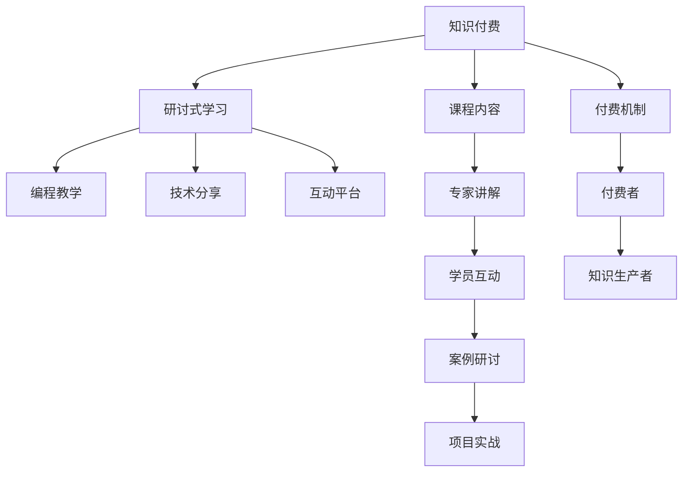

                 

# 程序员知识付费：打造研讨式学习模式

> 关键词：知识付费,研讨式学习,编程教学,技术分享,互动平台

## 1. 背景介绍

### 1.1 问题由来
随着信息时代的到来，知识付费正成为越来越多人的选择。程序员作为知识和技能的直接创造者，其经验分享和知识付费的需求尤为强烈。然而，传统的知识传播方式，如博客、书籍等，难以实现知识的高效交流和深度互动。如何创新知识传播模式，提升程序员的知识付费体验和学习效果，成为了当前亟待解决的问题。

### 1.2 问题核心关键点
基于这种背景，本文将探讨一种新的知识付费模式——研讨式学习模式，旨在通过高质量的课程内容、互动性强的研讨环节和用户社区支持，打造一个知识传播与学习的有效平台。本文将从研讨式学习模式的理论基础、核心算法、操作步骤等方面进行深入探讨，并通过具体的项目实践和案例分析，展现该模式在程序员知识付费领域的实际应用效果。

### 1.3 问题研究意义
研讨式学习模式为程序员提供了一个更为高效、互动性强的学习环境，促进了知识的高效传播和深度交流。通过研讨式学习，程序员不仅能够获得前沿的技术知识和行业洞察，还能在互动中提升问题解决能力和团队协作精神。此外，该模式也为知识付费平台提供了新的商业模式，推动了技术知识的商业化应用。

## 2. 核心概念与联系

### 2.1 核心概念概述

为了更好地理解研讨式学习模式的原理和结构，本节将介绍几个关键概念：

- **知识付费**：指通过支付费用获取知识产品和服务，包括课程、书籍、技术咨询等。知识付费模式帮助知识的传播者和受众建立起互惠互利的关系，为高质量的知识生产和消费提供了保障。

- **研讨式学习**：指通过专家讲解、学员互动和案例研讨等环节，将知识传授与问题解决相结合，实现知识的深度内化与实践应用。研讨式学习强调知识的深度理解和实际应用能力的提升。

- **编程教学**：指基于编程实践和项目实战的教学模式，强调理论与实践的结合，帮助学员掌握实际编程技能。

- **技术分享**：指通过专家讲座、文章分享、开源代码等形式，将最新的技术进展和实践经验分享给广大开发者，推动技术知识在社区内的传播和应用。

- **互动平台**：指提供一个交流互动的虚拟环境，支持学员之间的交流讨论、课程评价、导师反馈等，促进知识传播和深度学习。

### 2.2 核心概念原理和架构的 Mermaid 流程图



此流程图展示了知识付费到研讨式学习的整个流程，以及各环节之间的关系：

1. **知识付费**为知识生产者提供经济激励。
2. **研讨式学习**通过专家讲解、学员互动和案例研讨等环节，提升学员的知识掌握和实践能力。
3. **编程教学**和**技术分享**作为研讨式学习的具体形式，强调理论与实践的结合。
4. **互动平台**提供交流互动的环境，促进知识的深度学习。

这些核心概念共同构成了研讨式学习模式的理论基础，为其在程序员知识付费领域的实施提供了理论支持。

## 3. 核心算法原理 & 具体操作步骤
### 3.1 算法原理概述

研讨式学习模式的核心算法原理可以概括为以下几个步骤：

1. **知识生产与传播**：知识生产者通过撰写高质量的课程内容和技术分享文章，将知识传递给学员。
2. **专家讲解与案例研讨**：专家通过在线直播或视频课程的形式，对课程内容进行详细讲解，并通过案例研讨环节，与学员进行互动交流，解答问题。
3. **学员互动与项目实战**：学员在互动平台上参与讨论，提出问题，并与知识生产者进行互动交流。同时，通过项目实战环节，将所学知识应用于实际编程项目中，巩固知识掌握。
4. **课程评价与反馈**：学员对课程内容进行评价，知识生产者根据评价反馈不断优化课程内容和教学方法。

### 3.2 算法步骤详解

以下是研讨式学习模式的详细步骤：

1. **课程设计与制作**：知识生产者设计课程大纲，制作高质量的教学视频、讲义等学习材料，确保课程内容的深度和广度。

2. **专家讲解与互动**：通过视频直播或录播形式，专家对课程内容进行详细讲解。在讲解过程中，设置问答环节，与学员进行实时互动，解答学员的疑问。

3. **案例研讨与实践**：选择典型案例，组织学员进行案例研讨，探讨问题解决思路。同时，知识生产者设计编程任务，要求学员完成实际编程项目，检验所学知识的掌握情况。

4. **学员互动与交流**：在互动平台上，学员之间可以进行讨论、交流，分享心得体会。知识生产者定期收集学员反馈，进行课程优化和改进。

5. **课程评价与反馈**：设置课程评价机制，学员对课程内容、专家讲解和互动环节进行评价。知识生产者根据评价结果，调整教学策略，提升课程质量。

### 3.3 算法优缺点

研讨式学习模式具有以下优点：

- **互动性强**：通过专家讲解和学员互动，实现知识的深度内化和实际应用。
- **教学质量高**：知识生产者通过高质量的课程设计和讲解，保证教学效果。
- **实践导向**：案例研讨和项目实战环节，帮助学员将理论知识应用于实践。
- **持续优化**：学员反馈和课程评价机制，促进课程内容和教学方法的不断优化。

同时，该模式也存在以下缺点：

- **时间成本高**：专家讲解和案例研讨需要大量时间，增加了学习负担。
- **资源投入大**：课程制作和互动平台维护需要较多的人力和物力投入。
- **知识传播有限**：互动平台上的知识传播范围可能受限于学员的参与度。

尽管存在这些局限性，但研讨式学习模式通过高互动性和高质量的教学内容，为程序员知识付费领域带来了新的发展方向。

### 3.4 算法应用领域

研讨式学习模式在程序员知识付费领域有广泛的应用场景，包括但不限于：

- **在线编程课程**：通过视频讲解、编程任务和案例研讨，帮助学员掌握编程技能。
- **技术分享与讲座**：邀请专家进行技术分享和技术讲座，讲解最新的技术进展和实践经验。
- **问题解答与咨询**：在互动平台上，专家解答学员的技术问题，提供个性化指导。
- **项目实战与合作**：组织学员参与实际项目开发，提升项目实践能力。
- **学习社区与交流**：建立学习社区，支持学员之间的交流讨论，形成知识共享的网络。

## 4. 数学模型和公式 & 详细讲解 & 举例说明

### 4.1 数学模型构建

为了更好地理解研讨式学习模式，我们将其抽象为一个数学模型。假设知识生产者数量为 $N$，课程数量为 $M$，每个课程的讲解时长为 $T$，学员数量为 $S$。

- **知识传播模型**：知识生产者制作课程内容，并通过互动平台传播。知识传播的效果可以用课程评分 $\mathcal{R}$ 来衡量，其中 $R_{i,j}$ 表示第 $i$ 个学员对第 $j$ 门课程的评分。
- **专家讲解模型**：专家通过在线直播或视频课程对课程内容进行讲解。专家讲解的效果可以用讲解评分 $\mathcal{L}$ 来衡量，其中 $L_{i,j}$ 表示第 $i$ 个学员对第 $j$ 门课程的讲解评分。
- **案例研讨模型**：专家组织学员进行案例研讨，并解答学员的问题。案例研讨的效果可以用研讨评分 $\mathcal{D}$ 来衡量，其中 $D_{i,j}$ 表示第 $i$ 个学员对第 $j$ 门课程的研讨评分。
- **学员互动模型**：学员在互动平台上进行讨论和交流。学员互动的效果可以用互动评分 $\mathcal{I}$ 来衡量，其中 $I_{i,j}$ 表示第 $i$ 个学员对第 $j$ 门课程的互动评分。
- **课程评价模型**：学员对课程内容、专家讲解和互动环节进行评价，知识生产者根据评价结果进行课程优化。课程评价的效果可以用评价评分 $\mathcal{E}$ 来衡量，其中 $E_{i,j}$ 表示第 $i$ 个学员对第 $j$ 门课程的评价评分。

### 4.2 公式推导过程

基于上述模型，我们可以推导出一些关键的公式和指标，用于衡量和优化研讨式学习模式：

1. **课程评分计算公式**：
   $$
   \mathcal{R} = \frac{\sum_{i=1}^S \sum_{j=1}^M R_{i,j}}{S \times M}
   $$

2. **讲解评分计算公式**：
   $$
   \mathcal{L} = \frac{\sum_{i=1}^S \sum_{j=1}^M L_{i,j}}{S \times M}
   $$

3. **研讨评分计算公式**：
   $$
   \mathcal{D} = \frac{\sum_{i=1}^S \sum_{j=1}^M D_{i,j}}{S \times M}
   $$

4. **互动评分计算公式**：
   $$
   \mathcal{I} = \frac{\sum_{i=1}^S \sum_{j=1}^M I_{i,j}}{S \times M}
   $$

5. **评价评分计算公式**：
   $$
   \mathcal{E} = \frac{\sum_{i=1}^S \sum_{j=1}^M E_{i,j}}{S \times M}
   $$

通过这些评分指标，我们可以全面衡量研讨式学习模式的效果，并根据评价结果进行优化和改进。

### 4.3 案例分析与讲解

假设某在线编程课程有 $100$ 个学员参与，共开设了 $5$ 门课程，每门课程的讲解时长为 $2$ 小时，知识生产者有 $10$ 人参与课程制作。

1. **课程评分计算**：
   - 若第 $1$ 门课程的所有学员评分均为 $4$ 分，则课程评分为 $4$。
   - 若第 $2$ 门课程有 $30$ 个学员评分均为 $3$ 分，其余 $70$ 个学员评分均为 $5$ 分，则课程评分为 $\frac{30 \times 3 + 70 \times 5}{100} = 4.3$。

2. **讲解评分计算**：
   - 若第 $1$ 门课程的所有学员对讲解的评分均为 $5$，则讲解评分为 $5$。
   - 若第 $2$ 门课程有 $20$ 个学员对讲解的评分均为 $4$，其余 $80$ 个学员对讲解的评分均为 $3$，则讲解评分为 $\frac{20 \times 4 + 80 \times 3}{100} = 3.6$。

3. **研讨评分计算**：
   - 若第 $1$ 门课程的所有学员对研讨的评分均为 $5$，则研讨评分为 $5$。
   - 若第 $2$ 门课程有 $40$ 个学员对研讨的评分均为 $4$，其余 $60$ 个学员对研讨的评分均为 $3$，则研讨评分为 $\frac{40 \times 4 + 60 \times 3}{100} = 3.8$。

4. **互动评分计算**：
   - 若第 $1$ 门课程的所有学员对互动的评分均为 $5$，则互动评分为 $5$。
   - 若第 $2$ 门课程有 $50$ 个学员对互动的评分均为 $4$，其余 $50$ 个学员对互动的评分均为 $3$，则互动评分为 $\frac{50 \times 4 + 50 \times 3}{100} = 3.5$。

5. **评价评分计算**：
   - 若第 $1$ 门课程的所有学员对课程的整体评价均为 $5$，则评价评分为 $5$。
   - 若第 $2$ 门课程有 $60$ 个学员对课程的评价均为 $4$，其余 $40$ 个学员对课程的评价均为 $3$，则评价评分为 $\frac{60 \times 4 + 40 \times 3}{100} = 3.8$。

通过这些评分指标，我们可以对课程效果进行全面评估，并根据评分结果进行优化和改进。例如，若某门课程的讲解评分较低，知识生产者可以通过增加讲解时长或调整讲解方式，提升讲解效果。若某门课程的互动评分较低，知识生产者可以优化互动平台的体验设计，提升学员的互动积极性。

## 5. 项目实践：代码实例和详细解释说明

### 5.1 开发环境搭建

为了进行研讨式学习模式的项目实践，我们需要搭建一个完整的开发环境。以下是详细的步骤：

1. **选择合适的编程语言和框架**：Python 是当前最流行的编程语言之一，其丰富的库和框架，如 Flask、Django、PyTorch 等，可以满足研讨式学习模式的需求。

2. **安装相关依赖包**：安装 Flask、PyTorch、TensorBoard 等依赖包，用于构建和运行在线课程、数据模型和可视化分析。

3. **设计数据库模型**：使用 SQLAlchemy 等库设计课程、学员、专家等实体及其关联关系，构建完整的数据模型。

4. **搭建在线课程平台**：使用 Flask 等框架搭建在线课程平台，支持课程录制、直播、互动等功能。

5. **实现课程评价系统**：开发课程评分和评价系统，支持学员对课程内容、专家讲解和互动环节进行评价。

### 5.2 源代码详细实现

下面以在线编程课程为例，给出使用 Flask 和 PyTorch 进行研讨式学习模式的代码实现。

首先，定义课程实体和课程评价实体：

```python
from sqlalchemy import Column, Integer, String, Float, ForeignKey, create_engine
from sqlalchemy.orm import relationship
from sqlalchemy.ext.declarative import declarative_base

Base = declarative_base()

class Course(Base):
    __tablename__ = 'courses'
    id = Column(Integer, primary_key=True)
    name = Column(String)
    duration = Column(Float)
    lecturer_id = Column(Integer, ForeignKey('lecturers.id'))
    lecturers = relationship("Lecturer", back_populates="courses")

class CourseReview(Base):
    __tablename__ = 'course_reviews'
    id = Column(Integer, primary_key=True)
    course_id = Column(Integer, ForeignKey('courses.id'))
    student_id = Column(Integer, ForeignKey('students.id'))
    score = Column(Float)
    review = Column(String)
    students = relationship("Student", back_populates="reviews")
```

然后，定义学员实体和专家实体：

```python
class Student(Base):
    __tablename__ = 'students'
    id = Column(Integer, primary_key=True)
    name = Column(String)
    email = Column(String)

class Lecturer(Base):
    __tablename__ = 'lecturers'
    id = Column(Integer, primary_key=True)
    name = Column(String)
    courses = relationship("Course", back_populates="lecturers")
```

接着，定义 Flask 应用程序：

```python
from flask import Flask, render_template, request, redirect, url_for

app = Flask(__name__)

@app.route('/')
def index():
    courses = Course.query.all()
    return render_template('index.html', courses=courses)

@app.route('/review', methods=['POST'])
def add_review():
    course_id = request.form.get('course_id')
    student_id = request.form.get('student_id')
    score = request.form.get('score')
    review = request.form.get('review')
    
    course = Course.query.get(course_id)
    student = Student.query.get(student_id)
    review = CourseReview(course=course, student=student, score=score, review=review)
    db.session.add(review)
    db.session.commit()
    
    return redirect(url_for('index'))
```

最后，运行应用程序：

```python
if __name__ == '__main__':
    app.run(debug=True)
```

通过上述代码，我们实现了一个简单的在线课程平台，学员可以在平台上对课程内容进行评价，知识生产者可以实时查看课程评分和评价，根据评价结果进行课程优化。

### 5.3 代码解读与分析

让我们再详细解读一下关键代码的实现细节：

**Course类和CourseReview类**：
- `Course` 类表示课程实体，包括课程名称、时长、讲授专家等属性。`CourseReview` 类表示课程评价实体，包括学员对课程的评分和评价内容。

**Student类和Lecturer类**：
- `Student` 类表示学员实体，包括学员姓名和邮箱。`Lecturer` 类表示专家实体，包括专家姓名和所讲授的课程。

**Flask应用程序**：
- 使用 Flask 框架搭建应用程序，定义了 `index` 和 `add_review` 两个路由函数。`index` 函数用于展示所有课程，`add_review` 函数用于处理学员的课程评价请求。

通过这些代码，我们实现了一个基础的在线课程平台，可以支持学员对课程进行评价和反馈，知识生产者可以实时查看课程评分和评价，并根据评价结果进行课程优化。

## 6. 实际应用场景

### 6.1 智能教育

在智能教育领域，研讨式学习模式可以应用于在线编程课程、技术讲座等形式，帮助学员掌握实际编程技能和最新技术进展。通过专家讲解、案例研讨和项目实战环节，学员可以深入理解课程内容，并在实际项目中应用所学知识，提升问题解决能力和实际应用能力。

### 6.2 企业培训

在企业培训领域，研讨式学习模式可以用于培训员工掌握新技能，提升其技术水平和业务能力。通过定制化的课程设计和互动环节，知识生产者可以针对企业的实际需求，设计和实施有效的培训计划，帮助员工快速掌握新技术和新知识。

### 6.3 技术交流与合作

在技术交流与合作领域，研讨式学习模式可以用于组织技术分享会、研讨会等活动，促进技术知识的传播和交流。通过专家讲解、案例研讨和互动环节，参与者可以深入理解新技术和新方法，并在实际项目中应用所学知识，推动技术进步和应用创新。

### 6.4 未来应用展望

随着技术的发展，研讨式学习模式将在更多领域得到应用。例如，在医疗领域，可以用于医学知识传播和在线诊疗；在金融领域，可以用于金融产品推荐和技术分享；在政府和企业中，可以用于政策解读和业务培训等。

## 7. 工具和资源推荐

### 7.1 学习资源推荐

为了帮助开发者系统掌握研讨式学习模式的理论基础和实践技巧，这里推荐一些优质的学习资源：

1. **《深入浅出研讨式学习模式》系列博文**：由大模型技术专家撰写，深入浅出地介绍了研讨式学习模式的理论基础和实际应用，提供了丰富的案例和代码实现。

2. **Coursera《编程与计算》课程**：斯坦福大学开设的编程入门课程，涵盖了编程基础、算法设计、数据结构等内容，适合初学者系统学习。

3. **GitHub《Python编程学习》仓库**：包含大量Python编程实例和项目，适合开发者通过实际项目学习Python编程技巧。

4. **Kaggle《数据科学竞赛》**：数据科学竞赛平台，提供了大量实际应用场景下的数据集和问题，适合开发者进行实战练习。

5. **edX《人工智能基础》课程**：哈佛大学开设的人工智能课程，涵盖了机器学习、深度学习、自然语言处理等内容，适合深入学习人工智能技术。

通过这些学习资源，开发者可以全面掌握研讨式学习模式的理论基础和实践技巧，提升自身的技术能力和应用水平。

### 7.2 开发工具推荐

高效的开发离不开优秀的工具支持。以下是几款用于研讨式学习模式开发的常用工具：

1. **Flask**：轻量级的Web开发框架，易于上手，支持动态页面生成和表单处理，适合搭建在线课程平台。

2. **PyTorch**：基于Python的深度学习框架，支持动态图和静态图计算，适合构建在线课程的模型和算法。

3. **TensorBoard**：TensorFlow配套的可视化工具，用于实时监测模型训练状态，提供丰富的图表呈现方式，适合调试和优化模型。

4. **Jupyter Notebook**：交互式的编程环境，支持代码编写、数据处理和可视化分析，适合进行在线编程课程的开发和调试。

5. **SQLAlchemy**：Python ORM库，用于设计和管理数据库，适合存储和查询课程、学员和专家等实体数据。

这些工具可以帮助开发者更加高效地进行研讨式学习模式的开发和实践，提升开发效率和应用效果。

### 7.3 相关论文推荐

研讨式学习模式的发展源于学界的持续研究。以下是几篇奠基性的相关论文，推荐阅读：

1. **《知识传播与学习模式》**：探讨了知识传播与学习的理论基础和实践应用，提出了研讨式学习模式的基本框架和实施方法。

2. **《在线教育模式与效果评估》**：研究了在线教育模式的效果评估方法，提出了基于课程评分和学员反馈的评估指标，为课程优化提供了依据。

3. **《程序设计与编程教育》**：探讨了程序设计与编程教育的理论基础和实践方法，提出了研讨式学习模式在编程教育中的应用。

4. **《智能教育技术发展趋势》**：分析了智能教育技术的发展趋势，探讨了研讨式学习模式在智能教育中的应用前景和挑战。

5. **《技术分享与知识传播》**：探讨了技术分享与知识传播的理论基础和实践应用，提出了基于研讨式学习模式的技术分享方法。

这些论文代表了大模型微调技术的发展脉络。通过学习这些前沿成果，可以帮助研究者把握学科前进方向，激发更多的创新灵感。

## 8. 总结：未来发展趋势与挑战

### 8.1 总结

本文对研讨式学习模式进行了全面系统的介绍。首先阐述了研讨式学习模式的背景和意义，明确了其在高互动性、高质量教学和实践导向等方面的独特价值。其次，从原理到实践，详细讲解了研讨式学习模式的数学模型、关键步骤和具体实现，并通过具体的项目实践和案例分析，展现其在工作中的应用效果。最后，介绍了研讨式学习模式的实际应用场景和推荐的学习资源，为开发者提供了全面的技术指引。

通过本文的系统梳理，可以看到，研讨式学习模式为程序员知识付费领域带来了新的发展方向，通过高互动性和高质量的教学内容，帮助学员深入理解知识，提升问题解决能力和实际应用能力。

### 8.2 未来发展趋势

展望未来，研讨式学习模式将呈现以下几个发展趋势：

1. **智能推荐系统**：通过分析学员的学习行为和兴趣偏好，智能推荐适合学员的课程和专家，提升学习效果。
2. **多模态学习**：结合视觉、听觉、文本等多种模态数据，提升课程的多样性和互动性，增强学习体验。
3. **个性化学习路径**：根据学员的学习进度和效果，动态调整课程内容和进度，提升学习效率和个性化水平。
4. **跨领域协作**：推动不同领域的专家和学员进行协作，促进知识交叉和创新。
5. **持续学习与反馈**：建立持续学习机制，定期更新课程内容和专家讲解，进行学员反馈收集和课程优化。

这些趋势将推动研讨式学习模式向更加智能化、个性化和协作化方向发展，为程序员知识付费领域带来更多的创新和突破。

### 8.3 面临的挑战

尽管研讨式学习模式在许多领域已经展现出了显著的优势，但在实施过程中也面临着一些挑战：

1. **资源投入大**：课程制作和互动平台维护需要较多的人力和物力投入，增加了实施难度。
2. **课程内容更新快**：课程内容需要根据最新的技术和应用需求进行快速更新，增加了知识生产者的工作负担。
3. **学员学习积极性**：部分学员可能缺乏学习积极性和互动意愿，影响课程效果。
4. **课程评价机制**：需要建立完善的课程评价机制，确保评价结果的真实性和代表性。

尽管存在这些挑战，但通过优化课程设计、提升互动体验和引入智能推荐等手段，可以逐步克服这些困难，实现研讨式学习模式的高效实施。

### 8.4 研究展望

面对研讨式学习模式所面临的挑战，未来的研究需要在以下几个方面寻求新的突破：

1. **智能推荐系统优化**：通过机器学习算法优化推荐算法，提升推荐的准确性和个性化水平。
2. **多模态学习融合**：研究如何更好地融合视觉、听觉、文本等多种模态数据，提升课程的多样性和互动性。
3. **个性化学习路径设计**：基于学员的学习行为和效果，设计个性化学习路径，提升学习效率和效果。
4. **跨领域协作机制**：探索跨领域协作的机制和方式，促进不同领域的知识交流和创新。
5. **持续学习与反馈优化**：建立持续学习机制，定期更新课程内容和专家讲解，进行学员反馈收集和课程优化。

这些研究方向将进一步推动研讨式学习模式的发展，为程序员知识付费领域带来更多的创新和突破。相信随着学界和产业界的共同努力，研讨式学习模式必将在未来的技术发展中发挥重要作用，为程序员知识付费带来新的方向和机遇。

## 9. 附录：常见问题与解答

**Q1：如何评估研讨式学习模式的效果？**

A: 可以通过以下几个指标来评估研讨式学习模式的效果：

1. **课程评分**：通过学员对课程内容、专家讲解和互动环节的评分，评估课程的整体效果。

2. **讲解评分**：通过学员对专家讲解的评分，评估专家讲解的深度和效果。

3. **研讨评分**：通过学员对案例研讨的评分，评估研讨环节的互动性和实用性。

4. **互动评分**：通过学员对互动平台的评分，评估互动环节的便捷性和体验。

5. **评价评分**：通过学员对课程的整体评价，评估课程的实用性和持续改进潜力。

通过这些评分指标，可以全面衡量研讨式学习模式的效果，并根据评价结果进行优化和改进。

**Q2：研讨式学习模式是否适用于所有类型的课程？**

A: 研讨式学习模式适用于大多数类型的课程，特别是那些注重实践和互动的课程。对于理论性较强的课程，可以通过增加案例分析和项目实战环节，增强学员的理解和应用能力。但对于一些需要高度自律和自主学习的课程，研讨式学习模式可能不是最佳选择。

**Q3：如何平衡学员学习与专家讲解的时间？**

A: 可以通过以下方式平衡学员学习与专家讲解的时间：

1. **模块化课程设计**：将课程内容模块化，按需选择讲解和研讨环节，提升学习效率。

2. **灵活的互动安排**：在互动平台设置实时问答环节，随时解答学员问题，增强互动性。

3. **多专家协作**：邀请多位专家共同参与课程，分散讲解时间，提升讲解效果。

通过这些方式，可以更好地平衡学员学习与专家讲解的时间，提升研讨式学习模式的效果。

**Q4：如何保障研讨式学习模式的安全性？**

A: 可以通过以下方式保障研讨式学习模式的安全性：

1. **数据加密**：对学员和专家数据进行加密存储，防止数据泄露。

2. **身份认证**：对学员和专家进行身份认证，确保只有授权人员才能参与课程。

3. **权限控制**：对课程内容和互动环节进行权限控制，防止不当访问。

4. **异常监测**：实时监测课程互动和数据访问行为，及时发现异常情况。

通过这些措施，可以保障研讨式学习模式的安全性，确保学员和专家的数据安全和课程正常进行。

**Q5：研讨式学习模式在实施过程中需要注意哪些问题？**

A: 在实施研讨式学习模式时，需要注意以下问题：

1. **课程设计和制作**：知识生产者需要设计高质量的课程内容和互动环节，确保课程的深度和广度。

2. **技术平台建设**：需要搭建稳定、高效的在线课程平台，支持课程录制、直播、互动等功能。

3. **学员管理和服务**：需要建立完善的学员管理系统，提供及时的技术支持和课程服务。

4. **专家和讲师管理**：需要建立专家和讲师管理机制，确保课程质量和互动效果。

5. **课程评价和反馈**：需要建立完善的课程评价机制，确保课程效果的真实性和代表性。

通过优化这些环节，可以更好地实施研讨式学习模式，提升程序员知识付费的效果和质量。

---

作者：禅与计算机程序设计艺术 / Zen and the Art of Computer Programming

