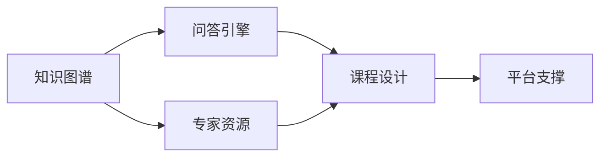

                 

# 程序员知识付费：打造问答式课程

## 1. 背景介绍

随着在线教育和知识付费行业的兴起，越来越多的专业人士选择通过知识付费平台分享自己的专业知识和技能。在诸多知识付费方式中，问答式课程因其独特的教学模式和高效的互动体验，受到越来越多用户的青睐。

**1.1 问题由来**

程序员作为知识付费领域的重要角色，以其在软件开发、技术架构、算法优化等方面的丰富经验，成为问答式课程的重要供给者。然而，传统的在线课程往往以单向的知识传递为主，难以满足用户个性化和互动化的学习需求。问答式课程的出现，恰好弥补了这一缺陷，通过模拟真实问答场景，让用户能够更直观地理解和掌握技术知识。

**1.2 问题核心关键点**

问答式课程的核心在于构建高效、互动的问答系统，让用户在提出问题的同时，获取专家的即时解答。与传统的教学方式相比，问答式课程具有以下优势：
1. **实时互动**：用户随时可以提出问题，专家即时回答，极大地提高了学习效率。
2. **个性化学习**：针对用户的具体问题，专家提供定制化的解决方案，帮助用户快速突破学习瓶颈。
3. **深度讨论**：通过问答互动，用户与专家之间可以深入交流技术细节，增强对知识的理解和应用能力。

问答式课程的成功实施，依赖于高效的知识图谱构建、智能的问答引擎设计、优质的专家资源整合等多个关键环节。本文将从这些方面入手，系统介绍问答式课程的构建方法。

## 2. 核心概念与联系

### 2.1 核心概念概述

为了更好地理解问答式课程的构建过程，本节将介绍几个关键概念及其相互联系：

- **知识图谱(Knowledge Graph)**：用于描述实体、属性和实体间关系的结构化知识库。在问答式课程中，知识图谱是构建智能问答引擎的基础。
- **问答引擎(QA Engine)**：基于知识图谱构建的智能系统，能够自动理解用户问题，并从知识库中提取相关知识进行回答。
- **课程设计(Course Design)**：根据学习目标和用户需求，设计课程内容、问题库和知识图谱，是问答式课程的灵魂。
- **专家资源(Expert Resources)**：聚集并整合各行各业的专家，提供高质量的课程内容和即时解答，是问答式课程的核心竞争力。
- **平台支撑(Platform Support)**：开发和维护问答式课程平台，包括用户管理、问题提交、答案反馈等功能，提供完整的互动环境。

这些概念之间的逻辑关系可以通过以下Mermaid流程图来展示：



这个流程图展示了问答式课程构建的关键步骤和概念之间的联系。知识图谱作为问答引擎的基础，通过专家资源进行填充和更新，与课程设计相结合，最后通过平台支撑实现互动学习。

## 3. 核心算法原理 & 具体操作步骤

### 3.1 算法原理概述

问答式课程的核心在于构建高效的问答引擎，实现对用户问题的智能理解和回答。该过程通常包括以下几个关键步骤：

1. **问题理解**：将用户输入的自然语言问题转换为结构化表示，提取关键实体和关系。
2. **知识匹配**：在知识图谱中搜索与问题相关的实体和关系，找到匹配的知识片段。
3. **答案生成**：结合匹配的知识片段，生成简洁、准确的回答。

### 3.2 算法步骤详解

**Step 1: 知识图谱构建**

知识图谱是问答式课程的基石，需要系统构建和管理。主要包括以下步骤：

1. **实体抽取**：使用自然语言处理技术，从文本中抽取实体（如人名、地名、机构名等）。
2. **关系抽取**：识别实体间的关系，如“出生于”、“工作于”等。
3. **知识表示**：将抽取的实体和关系表示成三元组（实体-关系-实体），形成知识图谱。

**Step 2: 问答引擎设计**

问答引擎的设计需要综合考虑多方面的因素，以确保高效和准确的回答。主要包括以下步骤：

1. **问题理解模型**：使用NLP技术，将自然语言问题转换为结构化表示，如实体关系图（ERG）。
2. **知识匹配算法**：设计高效的匹配算法，在知识图谱中查找匹配的知识片段。
3. **答案生成策略**：根据匹配的知识片段，生成简洁、准确的回答。

**Step 3: 课程设计**

课程设计是问答式课程的关键环节，需要综合考虑学习目标、用户需求和知识图谱内容。主要包括以下步骤：

1. **内容规划**：根据学习目标，规划课程内容，包括理论知识和实践技能。
2. **问题库构建**：设计问题库，包含常见问题和疑难问题，确保课程的覆盖面和深度。
3. **知识图谱更新**：定期更新知识图谱，引入新的实体和关系，丰富课程内容。

**Step 4: 专家资源整合**

专家资源是问答式课程的核心竞争力，需要精心挑选和管理。主要包括以下步骤：

1. **专家招募**：通过线上线下的渠道，招募各行各业的专家。
2. **知识贡献**：鼓励专家参与知识图谱的填充和更新，提供高质量的内容。
3. **在线互动**：设计高效的在线互动机制，如在线直播、即时问答等，增加专家的参与度。

**Step 5: 平台支撑**

平台支撑是问答式课程的实现保障，需要提供完整的互动环境和功能支持。主要包括以下步骤：

1. **用户管理**：设计用户注册、登录和权限管理功能，确保课程的私密性和安全性。
2. **问题提交**：设计问题提交和显示功能，方便用户提出问题。
3. **答案反馈**：设计答案反馈机制，收集用户对答案的评价和建议，不断优化问答系统。

### 3.3 算法优缺点

问答式课程的构建方法具有以下优点：

1. **高效互动**：用户随时可以提出问题，专家即时回答，极大地提高了学习效率。
2. **个性化学习**：针对用户的具体问题，专家提供定制化的解决方案，帮助用户快速突破学习瓶颈。
3. **深度讨论**：通过问答互动，用户与专家之间可以深入交流技术细节，增强对知识的理解和应用能力。

同时，该方法也存在以下局限性：

1. **资源依赖**：高质量专家资源的获取和维护成本较高，且需要持续投入。
2. **知识图谱构建复杂**：知识图谱的构建和管理需要大量的时间和精力，且质量难以保证。
3. **答案一致性**：不同专家对同一问题可能有不同的理解，答案的一致性难以保证。

尽管存在这些局限性，但问答式课程在教育领域的应用前景广阔，能够满足用户个性化和互动化的学习需求，是一种值得探索和推广的教学模式。

### 3.4 算法应用领域

问答式课程主要应用于以下几个领域：

1. **技术培训**：如编程开发、系统架构、算法优化等。通过专家解答，帮助学员快速掌握技术难点，提高编程技能。
2. **项目管理**：如敏捷开发、需求分析、项目规划等。通过专家指导，提升项目管理能力，优化项目流程。
3. **职业发展**：如职业规划、简历撰写、面试技巧等。通过专家建议，提高求职成功率，实现职业目标。
4. **学术研究**：如文献阅读、数据处理、论文撰写等。通过专家指导，加速学术研究进程，提升研究水平。

## 4. 数学模型和公式 & 详细讲解 & 举例说明

### 4.1 数学模型构建

在问答式课程中，知识图谱的构建和问答引擎的设计涉及大量数学模型和算法。以下是几种常见的数学模型：

- **实体关系图（ERG）**：用于表示实体间的关系，可以表示为有向图（G=(V,E)），其中V为实体节点集合，E为关系边集合。
- **图嵌入（Graph Embedding）**：将实体关系图转换为向量表示，方便计算和存储。常见的图嵌入方法包括DeepWalk、GraphSAGE等。
- **问答系统评估指标**：用于衡量问答系统的效果，包括精确度、召回率、F1分数等。

### 4.2 公式推导过程

以图嵌入为例，以下是图嵌入的数学推导过程：

1. **节点表示**：将每个实体节点表示为向量，记为$\vec{v}_i$。
2. **关系表示**：将每条关系边表示为向量，记为$\vec{e}_{ij}$。
3. **邻接矩阵**：构建邻接矩阵$A$，表示实体节点之间的关系。
4. **嵌入矩阵**：设计嵌入矩阵$H$，其中$H_i = \vec{v}_i + \sum_j A_{ij}\vec{e}_{ij}$，用于表示实体的向量表示。

### 4.3 案例分析与讲解

以编程面试题为例，以下是如何用问答式课程解答问题：

1. **问题理解**：将问题“如何高效实现快速排序”转换为结构化表示，抽取实体“快速排序”和关系“高效实现”。
2. **知识匹配**：在知识图谱中搜索与“快速排序”相关的实体和关系，找到匹配的知识片段。
3. **答案生成**：根据匹配的知识片段，生成简洁、准确的回答，如“快速排序可以使用双路快排、三路快排等算法实现，具有时间复杂度O(nlogn)，空间复杂度O(1)。”

## 5. 项目实践：代码实例和详细解释说明

### 5.1 开发环境搭建

在进行问答式课程开发前，我们需要准备好开发环境。以下是使用Python进行PyTorch开发的环境配置流程：

1. 安装Anaconda：从官网下载并安装Anaconda，用于创建独立的Python环境。
2. 创建并激活虚拟环境：
```bash
conda create -n pytorch-env python=3.8 
conda activate pytorch-env
```
3. 安装PyTorch：根据CUDA版本，从官网获取对应的安装命令。例如：
```bash
conda install pytorch torchvision torchaudio cudatoolkit=11.1 -c pytorch -c conda-forge
```
4. 安装Transformers库：
```bash
pip install transformers
```
5. 安装各类工具包：
```bash
pip install numpy pandas scikit-learn matplotlib tqdm jupyter notebook ipython
```

完成上述步骤后，即可在`pytorch-env`环境中开始问答式课程的开发。

### 5.2 源代码详细实现

这里我们以技术培训课程为例，给出使用Transformers库进行知识图谱构建和问答引擎开发的PyTorch代码实现。

首先，定义知识图谱的实体和关系：

```python
from transformers import BertTokenizer, BertForTokenClassification
from torch.utils.data import Dataset, DataLoader
from transformers import AdamW

# 定义实体和关系
entities = ["编程语言", "编程框架", "数据结构", "算法优化"]
relations = ["使用", "开发", "应用", "优化"]
```

然后，构建知识图谱的ERG表示：

```python
class ERG:
    def __init__(self, entities, relations):
        self.entities = entities
        self.relations = relations
        self.graph = self.build_graph()
    
    def build_graph(self):
        graph = {}
        for entity in self.entities:
            graph[entity] = []
        for relation in self.relations:
            for i in range(len(self.entities)-1):
                for j in range(i+1, len(self.entities)):
                    graph[self.entities[i]].append((relation, self.entities[j]))
                    graph[self.entities[j]].append((relation, self.entities[i]))
        return graph
```

接着，定义问答引擎的问题理解模型：

```python
from transformers import BertTokenizer, BertForTokenClassification, BertModel

class QuestionUnderstanding:
    def __init__(self, tokenizer, model):
        self.tokenizer = tokenizer
        self.model = model
    
    def forward(self, text):
        tokens = self.tokenizer.encode(text)
        embeddings = self.model(tokens).last_hidden_state[:, 0]
        return embeddings
```

最后，编写问答引擎的知识匹配和答案生成部分：

```python
class QAEngine:
    def __init__(self, entities, relations):
        self.entities = entities
        self.relations = relations
    
    def match(self, question, embeddings):
        # 使用匹配算法在知识图谱中查找匹配的知识片段
        # 返回匹配的实体和关系
        pass
    
    def generate_answer(self, match_results):
        # 根据匹配的实体和关系，生成简洁、准确的回答
        pass
```

### 5.3 代码解读与分析

让我们再详细解读一下关键代码的实现细节：

**ERG类**：
- `__init__`方法：初始化实体、关系和图谱。
- `build_graph`方法：根据实体和关系，构建ERG图谱。

**QuestionUnderstanding类**：
- `__init__`方法：初始化分词器和模型。
- `forward`方法：对输入文本进行编码，生成向量表示。

**QAEngine类**：
- `__init__`方法：初始化实体和关系。
- `match`方法：设计高效的匹配算法，在知识图谱中查找匹配的知识片段。
- `generate_answer`方法：根据匹配的知识片段，生成简洁、准确的回答。

这些代码展示了问答式课程的构建过程，通过知识图谱、问题理解和问答引擎的有机结合，实现了高效的知识传递和学习互动。

## 6. 实际应用场景

### 6.1 技术培训

问答式课程在技术培训中有着广泛的应用，特别是在编程开发、系统架构、算法优化等领域。通过专家解答，帮助学员快速掌握技术难点，提高编程技能。

在技术培训中，问答式课程可以包括以下几个步骤：

1. **内容规划**：根据学习目标，规划课程内容，包括理论知识和实践技能。
2. **问题库构建**：设计问题库，包含常见问题和疑难问题，确保课程的覆盖面和深度。
3. **专家互动**：设计高效的在线互动机制，如在线直播、即时问答等，增加专家的参与度。

### 6.2 项目管理

问答式课程在项目管理中也具有重要的应用价值，如敏捷开发、需求分析、项目规划等。通过专家指导，提升项目管理能力，优化项目流程。

在项目管理中，问答式课程可以包括以下几个步骤：

1. **内容规划**：根据项目管理目标，规划课程内容，包括项目管理理论、工具和技术。
2. **问题库构建**：设计问题库，包含项目管理中的常见问题和疑难问题，确保课程的覆盖面和深度。
3. **专家互动**：设计高效的在线互动机制，如在线直播、即时问答等，增加专家的参与度。

### 6.3 职业发展

问答式课程在职业发展中也具有重要应用价值，如职业规划、简历撰写、面试技巧等。通过专家建议，提高求职成功率，实现职业目标。

在职业发展中，问答式课程可以包括以下几个步骤：

1. **内容规划**：根据职业发展目标，规划课程内容，包括职业规划、求职技巧和面试技巧。
2. **问题库构建**：设计问题库，包含职业发展中的常见问题和疑难问题，确保课程的覆盖面和深度。
3. **专家互动**：设计高效的在线互动机制，如在线直播、即时问答等，增加专家的参与度。

### 6.4 未来应用展望

随着问答式课程的不断发展，未来将会有更多的应用场景出现，为教育、企业培训等领域带来新的变革。

在教育领域，问答式课程将更加普及，帮助学生解决学习中的疑难问题，提升学习效果。在企业培训领域，问答式课程将更加深入，结合企业的实际需求，提供定制化的培训服务。

## 7. 工具和资源推荐

### 7.1 学习资源推荐

为了帮助开发者系统掌握问答式课程的理论基础和实践技巧，这里推荐一些优质的学习资源：

1. **《自然语言处理综论》**：这是一本经典教材，全面介绍了NLP的基本概念和常用技术。
2. **《问答系统设计与实现》**：这是一本专业书籍，详细介绍了问答系统构建的各个环节和关键技术。
3. **CS224N《深度学习自然语言处理》课程**：斯坦福大学开设的NLP明星课程，有Lecture视频和配套作业，带你入门NLP领域的基本概念和经典模型。
4. **HuggingFace官方文档**：提供了大量预训练语言模型和相关的微调样例代码，是上手实践的必备资料。
5. **Coursera在线课程**：提供了多门高质量的NLP课程，涵盖基础知识和应用实践，适合初学者和进阶学习者。

通过对这些资源的学习实践，相信你一定能够快速掌握问答式课程的构建方法，并用于解决实际的NLP问题。

### 7.2 开发工具推荐

高效的开发离不开优秀的工具支持。以下是几款用于问答式课程开发的常用工具：

1. **PyTorch**：基于Python的开源深度学习框架，灵活动态的计算图，适合快速迭代研究。
2. **TensorFlow**：由Google主导开发的开源深度学习框架，生产部署方便，适合大规模工程应用。
3. **Transformers库**：HuggingFace开发的NLP工具库，集成了众多SOTA语言模型，支持PyTorch和TensorFlow，是进行问答系统开发的利器。
4. **Jupyter Notebook**：免费的交互式开发环境，支持Python、R等编程语言，适合快速原型开发和数据分析。
5. **GitHub**：代码托管平台，提供版本控制和协作功能，适合团队协作开发。

合理利用这些工具，可以显著提升问答式课程的开发效率，加快创新迭代的步伐。

### 7.3 相关论文推荐

问答式课程的发展离不开学界的持续研究。以下是几篇奠基性的相关论文，推荐阅读：

1. **《问答系统的历史与发展》**：详细回顾了问答系统的研究历程和关键技术，为问答式课程的设计提供了理论基础。
2. **《深度学习在问答系统中的应用》**：介绍了深度学习在问答系统中的重要应用，展示了深度学习技术带来的突破。
3. **《基于知识图谱的问答系统》**：探讨了知识图谱在问答系统中的构建和应用，展示了知识图谱对问答系统的提升作用。
4. **《问答系统中的多模态融合》**：介绍了多模态信息在问答系统中的融合方法，展示了多模态技术带来的新思路。

这些论文代表了大语言模型微调技术的发展脉络。通过学习这些前沿成果，可以帮助研究者把握学科前进方向，激发更多的创新灵感。

## 8. 总结：未来发展趋势与挑战

### 8.1 总结

本文对问答式课程的构建方法进行了全面系统的介绍。首先阐述了问答式课程的研究背景和意义，明确了问答式课程在教育和职业发展中的重要价值。其次，从原理到实践，详细讲解了问答式课程的构建过程，包括知识图谱构建、问答引擎设计、课程设计、专家资源整合等多个关键环节。最后，本文还广泛探讨了问答式课程在多个领域的应用前景，展示了问答式课程的巨大潜力。

通过本文的系统梳理，可以看到，问答式课程通过高效互动、个性化学习和深度讨论，极大地提高了学习的效率和效果，是一种值得推广的教学模式。未来，问答式课程必将在更多领域得到应用，为教育、企业培训等领域带来新的变革。

### 8.2 未来发展趋势

展望未来，问答式课程将呈现以下几个发展趋势：

1. **技术升级**：结合最新的深度学习技术和算法，提升问答系统的准确性和效率。
2. **多模态融合**：引入语音、视频等多模态信息，提升问答系统的智能化和互动性。
3. **个性化推荐**：结合用户历史数据，提供个性化的课程推荐和学习路径，提升学习效果。
4. **实时互动**：引入实时聊天和语音交互技术，提升用户的互动体验。
5. **跨平台支持**：支持PC、手机、平板等多个平台，方便用户随时随地学习。

### 8.3 面临的挑战

尽管问答式课程已经取得了显著成效，但在迈向更加智能化、普适化应用的过程中，它仍面临着诸多挑战：

1. **资源依赖**：高质量专家资源的获取和维护成本较高，且需要持续投入。
2. **知识图谱构建复杂**：知识图谱的构建和管理需要大量的时间和精力，且质量难以保证。
3. **答案一致性**：不同专家对同一问题可能有不同的理解，答案的一致性难以保证。
4. **平台兼容性**：跨平台支持和兼容性问题需要解决，确保用户能够无缝体验课程。

尽管存在这些挑战，但问答式课程在教育、职业发展等领域的应用前景广阔，能够满足用户个性化和互动化的学习需求，是一种值得探索和推广的教学模式。相信随着技术的不断进步和优化，问答式课程必将在教育领域大放异彩，成为提升学习效果的重要手段。

### 8.4 研究展望

未来，问答式课程的研究方向可能包括以下几个方面：

1. **知识图谱自动化构建**：开发自动化的知识图谱构建工具，提高知识图谱构建的效率和质量。
2. **多模态知识融合**：结合语音、视频等多模态信息，提升问答系统的智能化和互动性。
3. **个性化学习推荐**：结合用户历史数据，提供个性化的课程推荐和学习路径，提升学习效果。
4. **实时互动技术**：引入实时聊天和语音交互技术，提升用户的互动体验。
5. **跨平台支持**：支持PC、手机、平板等多个平台，方便用户随时随地学习。

这些研究方向将推动问答式课程技术的不断进步和优化，为教育、企业培训等领域带来新的变革，提升学习效果和用户体验。

## 9. 附录：常见问题与解答

**Q1：问答式课程是否适用于所有NLP任务？**

A: 问答式课程适用于多种NLP任务，特别是那些需要深度理解和分析的任务。例如，编程面试、技术咨询、项目管理等。但对于一些简单任务，如文本分类、情感分析等，问答式课程可能不是最优选择。

**Q2：如何构建高效的知识图谱？**

A: 构建高效的知识图谱需要以下步骤：
1. 收集和整理知识源，如百科全书、专业文献、数据报告等。
2. 使用NLP技术，从知识源中抽取实体和关系，构建初步的知识图谱。
3. 进行实体和关系验证，去除冗余和错误信息，提高知识图谱的质量。
4. 引入外部专家和用户反馈，不断更新和优化知识图谱。

**Q3：问答系统如何提高准确性和效率？**

A: 提高问答系统的准确性和效率需要以下措施：
1. 设计高效的实体关系图（ERG）表示方法，提高知识匹配的准确性。
2. 引入深度学习技术，提高问题理解的准确性和上下文推理能力。
3. 优化匹配算法，提高知识匹配的效率和覆盖面。
4. 设计简洁、准确的回答生成策略，提高回答的质量和可读性。

**Q4：问答系统在实际应用中需要注意哪些问题？**

A: 问答系统在实际应用中需要注意以下问题：
1. 知识图谱的质量和更新频率，确保知识图谱的时效性和准确性。
2. 专家资源的管理和激励机制，确保高质量专家的持续参与。
3. 系统的可扩展性和性能优化，确保系统的稳定性和高效性。
4. 用户的隐私和数据安全，确保用户数据的安全性和隐私保护。

**Q5：问答式课程如何融入企业培训？**

A: 问答式课程可以融入企业培训中，帮助员工解决工作中的疑难问题，提升技术能力。具体步骤如下：
1. 根据培训目标，设计课程内容和学习路径。
2. 设计问题库，涵盖常见问题和疑难问题，确保课程的覆盖面和深度。
3. 设计在线互动机制，如在线直播、即时问答等，增加专家的参与度。

**Q6：问答式课程如何引入多模态信息？**

A: 引入多模态信息可以提升问答系统的智能化和互动性，具体步骤如下：
1. 收集多模态数据，如语音、视频、文本等。
2. 设计多模态融合算法，将多模态信息进行融合和处理。
3. 设计多模态问答系统，能够同时处理不同类型的数据和信息。

通过引入多模态信息，问答式课程可以更好地模拟真实世界的复杂场景，提升系统的智能化水平和用户体验。

---

作者：禅与计算机程序设计艺术 / Zen and the Art of Computer Programming

