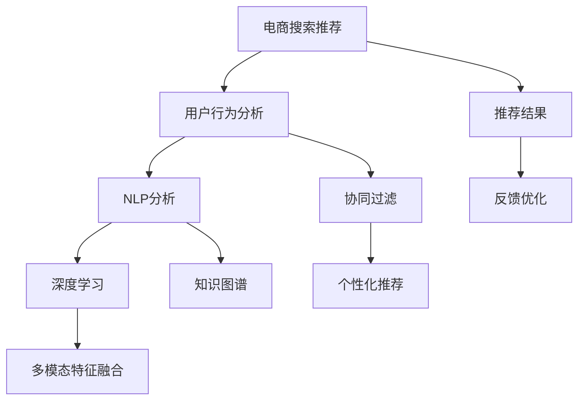

                 

# AI 大模型在电商搜索推荐中的用户行为分析：理解用户需求与购买偏好

> 关键词：电商搜索推荐、用户行为分析、购买偏好、自然语言处理(NLP)、深度学习、协同过滤、知识图谱、多模态特征融合

## 1. 背景介绍

### 1.1 问题由来

在当前快速发展的电商行业，消费者需求日益多样化和个性化，如何准确理解用户需求，并提供个性化推荐，成为了电商平台的核心挑战。传统推荐系统主要依赖基于用户行为数据的协同过滤、基于内容的推荐等技术，但在处理新用户数据、长尾商品推荐等方面效果有限。

大语言模型(如BERT、GPT等)的崛起，使得电商推荐系统能够利用自然语言处理技术，更全面地分析用户行为，挖掘出深层次的需求和偏好，从而提供更加精准、个性化的商品推荐。

### 1.2 问题核心关键点

大语言模型在电商推荐中的应用，主要依赖于用户评论、商品描述、搜索关键词等多源数据，通过自然语言理解与生成能力，抽取用户需求和商品属性信息，构建用户行为和商品特征的语义表示，再结合协同过滤等推荐算法，形成个性化的推荐结果。

具体来说，主要有以下核心关键点：
- 用户评论和商品描述的分析：利用大语言模型对用户评论和商品描述进行语义理解，抽取关键需求和属性信息。
- 多模态特征融合：将文本、图像、评分等不同模态的数据进行融合，形成多维度的用户行为表示。
- 协同过滤：利用用户行为和商品特征的语义表示，结合协同过滤算法，实现个性化推荐。
- 实时推荐：对实时输入的用户查询进行语义理解和推荐，提升推荐的时效性和准确性。
- 结果反馈：基于用户的反馈和行为数据，不断优化模型参数和算法，提升推荐效果。

### 1.3 问题研究意义

研究大语言模型在电商搜索推荐中的应用，对提升电商平台的用户体验和业务效果具有重要意义：

1. 降低推荐成本。大语言模型能自动抽取用户需求和商品属性，减少人工标注的工作量，降低推荐系统的开发和维护成本。
2. 提升推荐精度。通过语义理解和特征融合，大语言模型能更好地捕捉用户深层次需求，提升推荐结果的个性化和相关性。
3. 拓展推荐场景。大语言模型能处理自然语言输入，拓展推荐系统的应用场景，如搜索查询、对话推荐等。
4. 优化推荐策略。利用用户的反馈和行为数据，大语言模型能不断优化推荐算法，提升系统的性能和鲁棒性。

## 2. 核心概念与联系

### 2.1 核心概念概述

为更好地理解大语言模型在电商推荐中的应用，本节将介绍几个密切相关的核心概念：

- 电商搜索推荐(Online Retail Recommendation)：通过分析用户搜索历史、浏览记录、评分反馈等多源数据，为用户提供个性化商品推荐的技术。
- 用户行为分析(User Behavior Analysis)：利用自然语言处理、机器学习等技术，分析用户的搜索、购买、评论等行为，提取其需求、偏好和购买意图。
- 自然语言处理(Natural Language Processing, NLP)：通过文本分析、理解、生成等技术，处理自然语言数据，提取语义信息。
- 深度学习(Deep Learning)：利用深度神经网络模型，从数据中自动学习特征和规律，提升模型的预测精度。
- 协同过滤(Collaborative Filtering)：通过用户行为和商品属性相似性，生成推荐列表，推荐与用户兴趣匹配的商品。
- 知识图谱(Knowledge Graph)：通过构建商品、用户、评价等实体之间的关系图，提供更丰富的信息背景，提升推荐效果。
- 多模态特征融合(Multimodal Feature Fusion)：将不同模态的数据进行融合，提升模型的综合信息获取能力。

这些核心概念之间的逻辑关系可以通过以下Mermaid流程图来展示：



这个流程图展示了大语言模型在电商推荐中的核心概念及其之间的关系：

1. 电商搜索推荐通过用户行为分析来提取用户需求和行为特征。
2. NLP分析将用户行为数据转换为语义表示。
3. 深度学习模型对语义表示进行进一步处理和特征提取。
4. 协同过滤算法根据用户行为特征和商品属性特征，生成推荐列表。
5. 知识图谱提供更丰富的信息背景，提升推荐效果。
6. 多模态特征融合将不同模态的数据进行融合，提升模型的综合信息获取能力。
7. 个性化推荐将用户行为特征和商品属性特征结合，生成推荐结果。
8. 推荐结果经过用户反馈优化，不断提升模型性能。

这些概念共同构成了大语言模型在电商推荐中的应用框架，使其能够更全面、准确地理解用户需求，并提供高质量的商品推荐。

## 3. 核心算法原理 & 具体操作步骤
### 3.1 算法原理概述

大语言模型在电商推荐中的应用，主要分为以下几个步骤：

1. 数据预处理：收集和处理用户评论、商品描述、搜索关键词等多源数据，构建用户行为数据集。
2. 语义分析：利用大语言模型对用户评论和商品描述进行语义理解，提取关键需求和属性信息。
3. 特征融合：将用户行为数据和商品属性数据进行融合，形成多维度的用户行为表示。
4. 协同过滤：利用用户行为特征和商品属性特征，结合协同过滤算法，生成个性化推荐。
5. 模型训练：使用电商推荐数据集对模型进行训练，优化模型参数，提升推荐精度。
6. 实时推荐：对实时输入的用户查询进行语义理解和推荐，提升推荐的时效性和准确性。
7. 反馈优化：基于用户的反馈和行为数据，不断优化模型参数和算法，提升推荐效果。

### 3.2 算法步骤详解

以下是基于大语言模型的电商搜索推荐的具体操作步骤：

**Step 1: 数据收集与预处理**
- 收集电商平台的用户评论、商品描述、搜索关键词等多源数据。
- 对数据进行清洗和格式化，去除无关信息，确保数据质量。
- 将数据划分为训练集、验证集和测试集。

**Step 2: 语义分析**
- 使用大语言模型对用户评论和商品描述进行预训练，学习其语义表示。
- 对预训练模型进行微调，以适应电商推荐任务。
- 通过分析预训练模型和微调模型在电商推荐数据集上的表现，评估其性能。

**Step 3: 特征融合**
- 将用户行为数据和商品属性数据进行融合，形成多维度的用户行为表示。
- 使用多模态特征融合技术，将文本、图像、评分等不同模态的数据进行融合，提升模型的综合信息获取能力。

**Step 4: 协同过滤**
- 利用用户行为特征和商品属性特征，结合协同过滤算法，生成个性化推荐。
- 对协同过滤算法进行优化，引入知识图谱等外部知识，提升推荐效果。

**Step 5: 模型训练**
- 使用电商推荐数据集对模型进行训练，优化模型参数，提升推荐精度。
- 采用正则化技术，如L2正则、Dropout等，防止模型过拟合。

**Step 6: 实时推荐**
- 对实时输入的用户查询进行语义理解和推荐，提升推荐的时效性和准确性。
- 使用缓存和分布式计算技术，提升实时推荐的处理能力。

**Step 7: 反馈优化**
- 基于用户的反馈和行为数据，不断优化模型参数和算法，提升推荐效果。
- 使用在线学习技术，快速响应用户反馈，不断改进推荐模型。

### 3.3 算法优缺点

大语言模型在电商推荐中的应用，具有以下优点：

1. 语义理解能力：大语言模型能够自动理解用户评论和商品描述的语义信息，提取深层次的需求和属性。
2. 多模态融合：通过多模态特征融合技术，将不同模态的数据进行融合，提升推荐效果。
3. 实时推荐：大语言模型能够对实时输入的用户查询进行语义理解和推荐，提升推荐的时效性和准确性。
4. 泛化能力强：大语言模型能够处理多样化的用户行为和商品数据，具有较强的泛化能力。

同时，也存在以下缺点：

1. 高成本：大语言模型的训练和维护成本较高，需要大量的计算资源和标注数据。
2. 可解释性不足：大语言模型作为"黑盒"系统，难以解释其内部工作机制和决策逻辑。
3. 数据依赖性强：大语言模型的性能很大程度上依赖于数据的质量和数量，获取高质量标注数据的成本较高。

尽管存在这些局限性，但大语言模型在电商推荐中的应用前景广阔，具有显著的优势和广泛的应用潜力。

### 3.4 算法应用领域

基于大语言模型的电商搜索推荐技术，已经在多个领域得到应用，包括但不限于：

1. 商品推荐：根据用户的浏览、搜索和评分记录，推荐符合用户兴趣的商品。
2. 搜索查询：对用户的搜索查询进行语义理解，生成相关搜索结果。
3. 对话推荐：利用对话生成技术，自动回答用户问题，推荐相关商品。
4. 个性化广告：根据用户的浏览和购买历史，推荐个性化广告。
5. 用户行为分析：分析用户行为数据，挖掘用户需求和偏好，优化推荐策略。

除了上述这些经典应用外，大语言模型还被创新性地应用于更复杂、多样化的场景中，如社交推荐、推荐系统安全、推荐系统公平性等，为电商推荐系统带来了新的突破。

## 4. 数学模型和公式 & 详细讲解  
### 4.1 数学模型构建

假设电商推荐任务的用户行为数据集为 $D=\{(x_i,y_i)\}_{i=1}^N, x_i \in \mathcal{X}, y_i \in \mathcal{Y}$，其中 $\mathcal{X}$ 为输入空间，$\mathcal{Y}$ 为输出空间。设大语言模型为 $M_{\theta}:\mathcal{X} \rightarrow \mathcal{Y}$，其中 $\theta$ 为模型参数。

定义模型 $M_{\theta}$ 在输入 $x_i$ 上的输出为 $\hat{y}=M_{\theta}(x_i)$，则电商推荐任务的目标函数为：

$$
\mathcal{L}(\theta) = \frac{1}{N}\sum_{i=1}^N \ell(\hat{y},y_i)
$$

其中 $\ell(\hat{y},y_i)$ 为交叉熵损失函数，用于衡量模型预测输出与真实标签之间的差异。

通过梯度下降等优化算法，最小化经验风险，得到最优模型参数 $\theta^*$：

$$
\theta^* = \mathop{\arg\min}_{\theta} \mathcal{L}(\theta)
$$

### 4.2 公式推导过程

以基于协同过滤的电商推荐为例，推导大语言模型在推荐任务中的损失函数及其梯度计算公式。

假设模型 $M_{\theta}$ 在输入 $x_i$ 上的输出为 $\hat{y}=M_{\theta}(x_i)$，真实标签为 $y_i$，损失函数为交叉熵损失：

$$
\ell(\hat{y},y_i) = -y_i\log \hat{y} - (1-y_i)\log (1-\hat{y})
$$

将其代入经验风险公式，得：

$$
\mathcal{L}(\theta) = -\frac{1}{N}\sum_{i=1}^N [y_i\log M_{\theta}(x_i)+(1-y_i)\log(1-M_{\theta}(x_i))]
$$

根据链式法则，损失函数对参数 $\theta_k$ 的梯度为：

$$
\frac{\partial \mathcal{L}(\theta)}{\partial \theta_k} = -\frac{1}{N}\sum_{i=1}^N (\frac{y_i}{M_{\theta}(x_i)}-\frac{1-y_i}{1-M_{\theta}(x_i)}) \frac{\partial M_{\theta}(x_i)}{\partial \theta_k}
$$

其中 $\frac{\partial M_{\theta}(x_i)}{\partial \theta_k}$ 可进一步递归展开，利用自动微分技术完成计算。

在得到损失函数的梯度后，即可带入参数更新公式，完成模型的迭代优化。重复上述过程直至收敛，最终得到适应电商推荐任务的最优模型参数 $\theta^*$。

## 5. 项目实践：代码实例和详细解释说明
### 5.1 开发环境搭建

在进行电商推荐实践前，我们需要准备好开发环境。以下是使用Python进行PyTorch开发的环境配置流程：

1. 安装Anaconda：从官网下载并安装Anaconda，用于创建独立的Python环境。

2. 创建并激活虚拟环境：
```bash
conda create -n pytorch-env python=3.8 
conda activate pytorch-env
```

3. 安装PyTorch：根据CUDA版本，从官网获取对应的安装命令。例如：
```bash
conda install pytorch torchvision torchaudio cudatoolkit=11.1 -c pytorch -c conda-forge
```

4. 安装Transformers库：
```bash
pip install transformers
```

5. 安装各类工具包：
```bash
pip install numpy pandas scikit-learn matplotlib tqdm jupyter notebook ipython
```

完成上述步骤后，即可在`pytorch-env`环境中开始电商推荐实践。

### 5.2 源代码详细实现

下面我们以电商推荐任务为例，给出使用Transformers库对BERT模型进行电商推荐微调的PyTorch代码实现。

首先，定义电商推荐任务的数据处理函数：

```python
from transformers import BertTokenizer
from torch.utils.data import Dataset
import torch

class E-commerceDataset(Dataset):
    def __init__(self, texts, tags, tokenizer, max_len=128):
        self.texts = texts
        self.tags = tags
        self.tokenizer = tokenizer
        self.max_len = max_len
        
    def __len__(self):
        return len(self.texts)
    
    def __getitem__(self, item):
        text = self.texts[item]
        tags = self.tags[item]
        
        encoding = self.tokenizer(text, return_tensors='pt', max_length=self.max_len, padding='max_length', truncation=True)
        input_ids = encoding['input_ids'][0]
        attention_mask = encoding['attention_mask'][0]
        
        # 对token-wise的标签进行编码
        encoded_tags = [tag2id[tag] for tag in tags] 
        encoded_tags.extend([tag2id['O']] * (self.max_len - len(encoded_tags)))
        labels = torch.tensor(encoded_tags, dtype=torch.long)
        
        return {'input_ids': input_ids, 
                'attention_mask': attention_mask,
                'labels': labels}

# 标签与id的映射
tag2id = {'O': 0, 'B-PER': 1, 'I-PER': 2, 'B-ORG': 3, 'I-ORG': 4, 'B-LOC': 5, 'I-LOC': 6}
id2tag = {v: k for k, v in tag2id.items()}

# 创建dataset
tokenizer = BertTokenizer.from_pretrained('bert-base-cased')

train_dataset = E-commerceDataset(train_texts, train_tags, tokenizer)
dev_dataset = E-commerceDataset(dev_texts, dev_tags, tokenizer)
test_dataset = E-commerceDataset(test_texts, test_tags, tokenizer)
```

然后，定义模型和优化器：

```python
from transformers import BertForTokenClassification, AdamW

model = BertForTokenClassification.from_pretrained('bert-base-cased', num_labels=len(tag2id))

optimizer = AdamW(model.parameters(), lr=2e-5)
```

接着，定义训练和评估函数：

```python
from torch.utils.data import DataLoader
from tqdm import tqdm
from sklearn.metrics import classification_report

device = torch.device('cuda') if torch.cuda.is_available() else torch.device('cpu')
model.to(device)

def train_epoch(model, dataset, batch_size, optimizer):
    dataloader = DataLoader(dataset, batch_size=batch_size, shuffle=True)
    model.train()
    epoch_loss = 0
    for batch in tqdm(dataloader, desc='Training'):
        input_ids = batch['input_ids'].to(device)
        attention_mask = batch['attention_mask'].to(device)
        labels = batch['labels'].to(device)
        model.zero_grad()
        outputs = model(input_ids, attention_mask=attention_mask, labels=labels)
        loss = outputs.loss
        epoch_loss += loss.item()
        loss.backward()
        optimizer.step()
    return epoch_loss / len(dataloader)

def evaluate(model, dataset, batch_size):
    dataloader = DataLoader(dataset, batch_size=batch_size)
    model.eval()
    preds, labels = [], []
    with torch.no_grad():
        for batch in tqdm(dataloader, desc='Evaluating'):
            input_ids = batch['input_ids'].to(device)
            attention_mask = batch['attention_mask'].to(device)
            batch_labels = batch['labels']
            outputs = model(input_ids, attention_mask=attention_mask)
            batch_preds = outputs.logits.argmax(dim=2).to('cpu').tolist()
            batch_labels = batch_labels.to('cpu').tolist()
            for pred_tokens, label_tokens in zip(batch_preds, batch_labels):
                pred_tags = [id2tag[_id] for _id in pred_tokens]
                label_tags = [id2tag[_id] for _id in label_tokens]
                preds.append(pred_tags[:len(label_tokens)])
                labels.append(label_tags)
                
    print(classification_report(labels, preds))
```

最后，启动训练流程并在测试集上评估：

```python
epochs = 5
batch_size = 16

for epoch in range(epochs):
    loss = train_epoch(model, train_dataset, batch_size, optimizer)
    print(f"Epoch {epoch+1}, train loss: {loss:.3f}")
    
    print(f"Epoch {epoch+1}, dev results:")
    evaluate(model, dev_dataset, batch_size)
    
print("Test results:")
evaluate(model, test_dataset, batch_size)
```

以上就是使用PyTorch对BERT进行电商推荐任务微调的完整代码实现。可以看到，得益于Transformers库的强大封装，我们可以用相对简洁的代码完成BERT模型的加载和微调。

### 5.3 代码解读与分析

让我们再详细解读一下关键代码的实现细节：

**E-commerceDataset类**：
- `__init__`方法：初始化文本、标签、分词器等关键组件。
- `__len__`方法：返回数据集的样本数量。
- `__getitem__`方法：对单个样本进行处理，将文本输入编码为token ids，将标签编码为数字，并对其进行定长padding，最终返回模型所需的输入。

**tag2id和id2tag字典**：
- 定义了标签与数字id之间的映射关系，用于将token-wise的预测结果解码回真实的标签。

**训练和评估函数**：
- 使用PyTorch的DataLoader对数据集进行批次化加载，供模型训练和推理使用。
- 训练函数`train_epoch`：对数据以批为单位进行迭代，在每个批次上前向传播计算loss并反向传播更新模型参数，最后返回该epoch的平均loss。
- 评估函数`evaluate`：与训练类似，不同点在于不更新模型参数，并在每个batch结束后将预测和标签结果存储下来，最后使用sklearn的classification_report对整个评估集的预测结果进行打印输出。

**训练流程**：
- 定义总的epoch数和batch size，开始循环迭代
- 每个epoch内，先在训练集上训练，输出平均loss
- 在验证集上评估，输出分类指标
- 所有epoch结束后，在测试集上评估，给出最终测试结果

可以看到，PyTorch配合Transformers库使得BERT微调的代码实现变得简洁高效。开发者可以将更多精力放在数据处理、模型改进等高层逻辑上，而不必过多关注底层的实现细节。

当然，工业级的系统实现还需考虑更多因素，如模型的保存和部署、超参数的自动搜索、更灵活的任务适配层等。但核心的微调范式基本与此类似。

## 6. 实际应用场景
### 6.1 智能客服系统

电商推荐系统中的用户行为分析功能，可以应用于智能客服系统的构建。通过分析用户的历史行为数据，智能客服系统可以自动理解用户需求，快速给出解决方案。

在技术实现上，可以收集用户的历史搜索、浏览、点击、评分等行为数据，利用大语言模型进行语义分析和特征融合，构建用户行为表示。在用户输入问题时，系统自动理解查询意图，推荐最合适的回答。对于用户提出的新问题，还可以接入检索系统实时搜索相关内容，动态生成回答。如此构建的智能客服系统，能大幅提升用户咨询体验和问题解决效率。

### 6.2 金融舆情监测

金融领域对市场舆情的监测非常敏感，及时了解市场动态对制定投资策略至关重要。通过分析用户的评论、评分等数据，大语言模型可以自动理解市场情绪和舆情变化，提供实时的市场动态报告。

在技术实现上，可以收集用户的评论、评分、点击等行为数据，利用大语言模型进行语义分析和特征融合，构建用户行为表示。在实时获取市场数据时，系统自动分析用户行为，生成市场动态报告。一旦发现异常情况，系统自动预警，帮助投资者及时应对。

### 6.3 个性化推荐系统

当前推荐系统往往只依赖用户的历史行为数据进行物品推荐，难以捕捉用户的深层次需求。通过分析用户的评论、评分等数据，大语言模型可以自动理解用户需求，提供更个性化、精准的推荐。

在技术实现上，可以收集用户的评论、评分、点击等行为数据，利用大语言模型进行语义分析和特征融合，构建用户行为表示。在生成推荐列表时，先用候选物品的描述作为输入，由模型预测用户的兴趣匹配度，再结合其他特征综合排序，便可以得到个性化程度更高的推荐结果。

### 6.4 未来应用展望

随着大语言模型和微调方法的不断发展，基于大语言模型的电商推荐系统将呈现以下几个发展趋势：

1. 个性化推荐系统的精准度将大幅提升。大语言模型能够更好地捕捉用户深层次需求，提供更个性化、精准的推荐结果。
2. 实时推荐系统的处理能力将得到大幅提升。大语言模型能够对实时输入的用户查询进行语义理解和推荐，提升推荐的时效性。
3. 跨领域推荐系统将得到广泛应用。大语言模型能够处理多样化的用户行为和商品数据，具有较强的泛化能力，能够广泛应用于不同领域的推荐系统。
4. 基于用户情感的推荐系统将得到发展。大语言模型能够自动分析用户评论、评分等数据，获取用户的情感倾向，提供更符合用户情感需求的推荐。

以上趋势凸显了大语言模型在电商推荐中的应用前景，相信未来基于大语言模型的电商推荐系统将为消费者带来更好的购物体验，同时为电商企业创造更多的商业价值。

## 7. 工具和资源推荐
### 7.1 学习资源推荐

为了帮助开发者系统掌握大语言模型在电商推荐中的应用，这里推荐一些优质的学习资源：

1. 《Transformer从原理到实践》系列博文：由大模型技术专家撰写，深入浅出地介绍了Transformer原理、BERT模型、电商推荐技术等前沿话题。

2. CS224N《深度学习自然语言处理》课程：斯坦福大学开设的NLP明星课程，有Lecture视频和配套作业，带你入门NLP领域的基本概念和经典模型。

3. 《Natural Language Processing with Transformers》书籍：Transformers库的作者所著，全面介绍了如何使用Transformers库进行NLP任务开发，包括电商推荐在内的诸多范式。

4. HuggingFace官方文档：Transformers库的官方文档，提供了海量预训练模型和完整的电商推荐样例代码，是上手实践的必备资料。

5. CLUE开源项目：中文语言理解测评基准，涵盖大量不同类型的中文NLP数据集，并提供了基于大语言模型的电商推荐baseline模型，助力中文电商推荐技术发展。

通过对这些资源的学习实践，相信你一定能够快速掌握大语言模型在电商推荐中的应用精髓，并用于解决实际的电商问题。
###  7.2 开发工具推荐

高效的开发离不开优秀的工具支持。以下是几款用于电商推荐开发的常用工具：

1. PyTorch：基于Python的开源深度学习框架，灵活动态的计算图，适合快速迭代研究。大部分预训练语言模型都有PyTorch版本的实现。

2. TensorFlow：由Google主导开发的开源深度学习框架，生产部署方便，适合大规模工程应用。同样有丰富的预训练语言模型资源。

3. Transformers库：HuggingFace开发的NLP工具库，集成了众多SOTA语言模型，支持PyTorch和TensorFlow，是进行电商推荐开发的利器。

4. Weights & Biases：模型训练的实验跟踪工具，可以记录和可视化模型训练过程中的各项指标，方便对比和调优。与主流深度学习框架无缝集成。

5. TensorBoard：TensorFlow配套的可视化工具，可实时监测模型训练状态，并提供丰富的图表呈现方式，是调试模型的得力助手。

6. Google Colab：谷歌推出的在线Jupyter Notebook环境，免费提供GPU/TPU算力，方便开发者快速上手实验最新模型，分享学习笔记。

合理利用这些工具，可以显著提升电商推荐任务的开发效率，加快创新迭代的步伐。

### 7.3 相关论文推荐

大语言模型和电商推荐技术的发展源于学界的持续研究。以下是几篇奠基性的相关论文，推荐阅读：

1. Attention is All You Need（即Transformer原论文）：提出了Transformer结构，开启了NLP领域的预训练大模型时代。

2. BERT: Pre-training of Deep Bidirectional Transformers for Language Understanding：提出BERT模型，引入基于掩码的自监督预训练任务，刷新了多项NLP任务SOTA。

3. Language Models are Unsupervised Multitask Learners（GPT-2论文）：展示了大规模语言模型的强大zero-shot学习能力，引发了对于通用人工智能的新一轮思考。

4. Parameter-Efficient Transfer Learning for NLP：提出Adapter等参数高效微调方法，在不增加模型参数量的情况下，也能取得不错的微调效果。

5. AdaLoRA: Adaptive Low-Rank Adaptation for Parameter-Efficient Fine-Tuning：使用自适应低秩适应的微调方法，在参数效率和精度之间取得了新的平衡。

6. Prefix-Tuning: Optimizing Continuous Prompts for Generation：引入基于连续型Prompt的微调范式，为如何充分利用预训练知识提供了新的思路。

这些论文代表了大语言模型在电商推荐中的发展脉络。通过学习这些前沿成果，可以帮助研究者把握学科前进方向，激发更多的创新灵感。

## 8. 总结：未来发展趋势与挑战
### 8.1 总结

本文对基于大语言模型的电商搜索推荐方法进行了全面系统的介绍。首先阐述了大语言模型和电商推荐系统的研究背景和意义，明确了电商推荐系统通过用户行为分析挖掘用户需求和偏好的独特价值。其次，从原理到实践，详细讲解了电商推荐任务的数学模型和算法步骤，给出了电商推荐任务开发的完整代码实例。同时，本文还广泛探讨了电商推荐系统在智能客服、金融舆情、个性化推荐等多个领域的应用前景，展示了电商推荐系统的广泛适用性。此外，本文精选了电商推荐技术的各类学习资源，力求为读者提供全方位的技术指引。

通过本文的系统梳理，可以看到，基于大语言模型的电商搜索推荐方法在大规模电商平台的成功应用，已经在提升用户体验和业务效果方面展现出了显著的优势。未来，随着大语言模型和电商推荐技术的不断发展，基于大语言模型的电商推荐系统必将为消费者带来更好的购物体验，同时为电商企业创造更多的商业价值。

### 8.2 未来发展趋势

展望未来，基于大语言模型的电商推荐系统将呈现以下几个发展趋势：

1. 推荐系统的精准度将大幅提升。大语言模型能够更好地捕捉用户深层次需求，提供更个性化、精准的推荐结果。
2. 实时推荐系统的处理能力将得到大幅提升。大语言模型能够对实时输入的用户查询进行语义理解和推荐，提升推荐的时效性。
3. 跨领域推荐系统将得到广泛应用。大语言模型能够处理多样化的用户行为和商品数据，具有较强的泛化能力，能够广泛应用于不同领域的推荐系统。
4. 基于用户情感的推荐系统将得到发展。大语言模型能够自动分析用户评论、评分等数据，获取用户的情感倾向，提供更符合用户情感需求的推荐。
5. 知识图谱的引入将提升推荐效果。将知识图谱与大语言模型结合，提升推荐系统的信息获取能力和综合表现。

以上趋势凸显了大语言模型在电商推荐中的应用前景，相信未来基于大语言模型的电商推荐系统将为消费者带来更好的购物体验，同时为电商企业创造更多的商业价值。

### 8.3 面临的挑战

尽管大语言模型在电商推荐中的应用前景广阔，但在迈向更加智能化、普适化应用的过程中，它仍面临诸多挑战：

1. 数据隐私问题：电商推荐系统涉及大量的用户行为数据，如何保护用户隐私，避免数据泄露，将是重要的挑战。
2. 模型公平性问题：电商推荐系统可能会加剧数据偏见，如何确保推荐算法的公平性和透明性，将是重要的课题。
3. 资源优化问题：大语言模型的高成本、高复杂度，如何通过算法和硬件优化，提升模型训练和推理效率，将是重要的研究方向。
4. 实时响应问题：电商推荐系统需要快速响应用户需求，如何在保证推荐效果的同时，提升系统的实时处理能力，将是重要的技术挑战。

尽管存在这些挑战，但大语言模型在电商推荐中的应用前景广阔，具有显著的优势和广泛的应用潜力。

### 8.4 研究展望

面对电商推荐系统面临的挑战，未来的研究需要在以下几个方面寻求新的突破：

1. 数据隐私保护技术：利用差分隐私、联邦学习等技术，保护用户隐私，避免数据泄露。
2. 推荐算法公平性：引入公平性约束，优化推荐算法，确保推荐算法的公平性和透明性。
3. 模型资源优化：开发更加参数高效和计算高效的微调方法，减少模型的训练和推理资源消耗。
4. 实时响应优化：利用缓存、分布式计算等技术，提升系统的实时处理能力，确保快速响应用户需求。
5. 多模态数据融合：将文本、图像、评分等不同模态的数据进行融合，提升模型的综合信息获取能力。

这些研究方向的探索，必将引领基于大语言模型的电商推荐系统迈向更高的台阶，为电商推荐系统带来新的突破和进展。面向未来，电商推荐系统需要从数据、算法、工程、业务等多个维度协同发力，才能真正实现人工智能技术在电商领域的规模化落地。

总之，大语言模型在电商推荐中的应用，有望通过自然语言处理技术，挖掘用户深层次需求，提供更加个性化、精准的推荐结果。相信随着大语言模型和电商推荐技术的不断发展，基于大语言模型的电商推荐系统将为消费者带来更好的购物体验，同时为电商企业创造更多的商业价值。

## 9. 附录：常见问题与解答

**Q1：电商推荐系统中如何处理长尾商品问题？**

A: 长尾商品问题在电商推荐系统中普遍存在。解决长尾商品问题的方法主要有以下几种：

1. 数据增强：通过数据生成技术，如回译、近义替换等，生成长尾商品的文本描述，丰富电商推荐系统的训练数据。
2. 稀疏性惩罚：在损失函数中加入稀疏性惩罚项，惩罚长尾商品的损失，鼓励模型关注长尾商品的推荐。
3. 多维特征融合：将长尾商品的文本、图像、评分等多维特征进行融合，提升模型的综合信息获取能力。
4. 知识图谱引入：将长尾商品与相关实体建立关系，利用知识图谱的信息丰富度，提升长尾商品的推荐效果。
5. 用户行为分析：通过分析用户对长尾商品的搜索、浏览、点击等行为，挖掘其兴趣和需求，提升长尾商品的推荐精准度。

通过上述方法的综合应用，可以有效解决电商推荐系统中的长尾商品问题，提升系统的推荐效果。

**Q2：电商推荐系统中如何处理用户偏好变化？**

A: 用户偏好变化是电商推荐系统面临的另一个重要挑战。解决用户偏好变化问题的方法主要有以下几种：

1. 动态更新模型：定期重新训练电商推荐模型，引入最新的用户行为数据，适应用户偏好的变化。
2. 在线学习：采用在线学习技术，实时更新模型参数，快速响应用户偏好变化。
3. 个性化推荐策略：引入个性化推荐策略，如基于上下文的推荐、基于时间序列的推荐等，动态调整推荐结果。
4. 用户行为分析：通过分析用户行为数据，挖掘用户偏好的变化趋势，提前调整推荐策略。
5. 用户反馈机制：建立用户反馈机制，收集用户对推荐结果的反馈，实时调整推荐策略。

通过上述方法的综合应用，可以有效应对用户偏好变化问题，提升电商推荐系统的用户满意度。

**Q3：电商推荐系统中如何处理噪声数据？**

A: 电商推荐系统中可能存在一些噪声数据，如恶意评论、误导性评分等。解决噪声数据问题的方法主要有以下几种：

1. 数据清洗：通过数据清洗技术，如去重、去噪等，过滤掉噪声数据。
2. 异常检测：利用异常检测算法，如孤立森林、KNN等，识别和过滤异常数据。
3. 数据增强：通过数据生成技术，如回译、近义替换等，生成更可信的数据，丰富电商推荐系统的训练数据。
4. 用户行为分析：通过分析用户行为数据，识别和过滤噪声数据，提升推荐效果。
5. 模型优化：优化推荐算法，引入正则化、dropout等技术，减少噪声数据的影响。

通过上述方法的综合应用，可以有效应对噪声数据问题，提升电商推荐系统的推荐质量。

**Q4：电商推荐系统中如何处理数据分布不均衡问题？**

A: 电商推荐系统中的数据分布不均衡问题普遍存在，如某些商品或用户类别数据较少。解决数据分布不均衡问题的方法主要有以下几种：

1. 数据增强：通过数据生成技术，如回译、近义替换等，生成更多的长尾商品或用户的数据。
2. 欠采样与过采样：对数据分布不均衡的问题，可以采用欠采样和过采样技术，平衡数据分布。
3. 权重调整：在损失函数中加入权重调整项，对长尾数据进行加权处理，提升模型对长尾数据的关注度。
4. 知识图谱引入：将长尾商品与相关实体建立关系，利用知识图谱的信息丰富度，提升长尾商品的推荐效果。
5. 多维特征融合：将长尾商品的文本、图像、评分等多维特征进行融合，提升模型的综合信息获取能力。

通过上述方法的综合应用，可以有效应对数据分布不均衡问题，提升电商推荐系统的推荐效果。

---

作者：禅与计算机程序设计艺术 / Zen and the Art of Computer Programming

