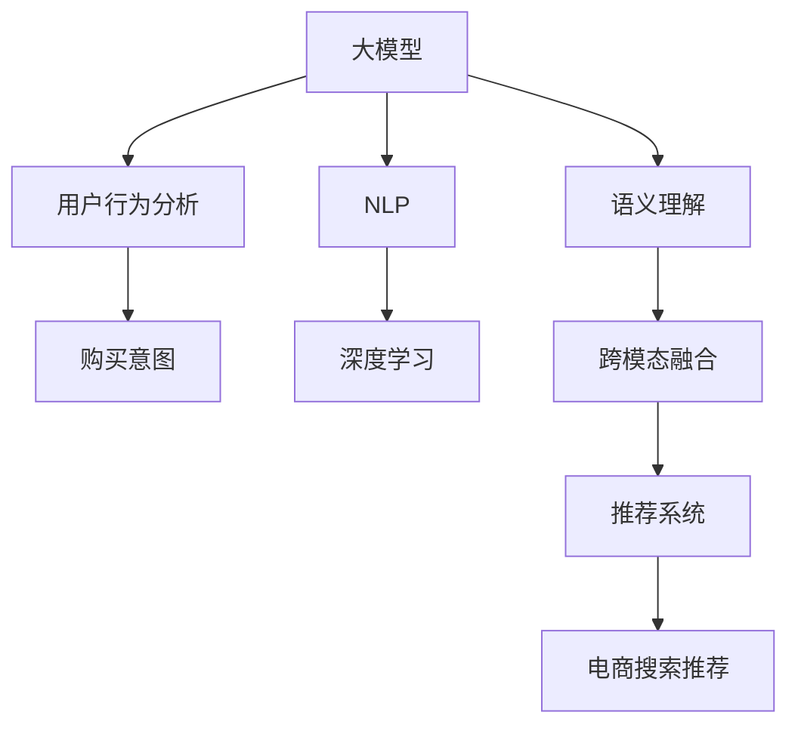

                 

# AI 大模型在电商搜索推荐中的用户行为分析：理解用户需求与购买意图

> 关键词：电商搜索推荐, 用户行为分析, 购买意图, 自然语言处理, 深度学习, 大模型, 语义理解, 跨模态融合

## 1. 背景介绍

### 1.1 问题由来

在当今数字化商业时代，电商平台通过精确的搜索推荐系统，帮助用户快速找到所需商品，提升用户体验，同时为商家带来更高的转化率和销售额。但传统推荐系统往往基于静态的统计特征，缺乏对用户行为深层次的理解，导致推荐效果不够精准。随着人工智能技术的不断发展，利用大模型对用户行为进行深入分析，已成为电商领域提升推荐效果的重要方向。

具体而言，利用大模型分析用户搜索查询、浏览历史、点击行为等数据，可以挖掘出用户的兴趣偏好、需求意图等隐含信息。这些信息不仅可以用于推荐，还可以用于内容生成、广告投放、价格优化等多个电商应用场景。

### 1.2 问题核心关键点

大模型在电商搜索推荐中的应用，核心在于理解用户的搜索行为、浏览历史、点击记录等，从而推测用户的购买意图，提供个性化的推荐服务。与传统推荐方法相比，大模型的方法具有以下优势：

1. **深度语义理解**：利用深度学习模型能够理解自然语言背后的语义，挖掘用户行为的深层特征。
2. **跨模态融合**：结合用户浏览的视觉、文本和听觉等多模态数据，提供更全面、丰富的推荐。
3. **持续学习与优化**：大模型具备持续学习的能力，能够不断适应用户行为的变化。
4. **高效参数更新**：基于大模型的微调方法可以高效更新少量参数，减少资源消耗。
5. **数据驱动决策**：通过分析用户的历史行为数据，提供精准、个性化的推荐，提升用户体验。

## 2. 核心概念与联系

### 2.1 核心概念概述

为更好地理解大模型在电商搜索推荐中的应用，本节将介绍几个关键概念及其关联：

- **大模型 (Big Model)**：如BERT、GPT等，通过大规模无标签数据预训练，具备强大的语义理解能力和表示学习能力。
- **用户行为分析 (User Behavior Analysis)**：通过收集和分析用户互动数据，挖掘用户需求和偏好。
- **购买意图 (Purchase Intent)**：指用户打算购买商品的程度和时机。
- **自然语言处理 (NLP)**：通过语义理解、文本生成等技术，处理和分析文本数据。
- **深度学习 (Deep Learning)**：利用多层神经网络模型进行特征学习和模式识别。
- **语义理解 (Semantic Understanding)**：理解自然语言背后所表达的含义和关系。
- **跨模态融合 (Cross-Modal Fusion)**：结合不同模态的数据（如文本、图像、音频等）进行综合分析。
- **推荐系统 (Recommendation System)**：基于用户行为数据，推荐用户可能感兴趣的商品。

这些概念之间的逻辑关系可以通过以下Mermaid流程图来展示：



该流程图展示了从大模型到电商推荐系统的全过程：

1. 大模型通过无标签数据预训练，学习通用语言表示。
2. 用户行为分析收集用户互动数据，挖掘其行为特征。
3. 购买意图通过语义理解和分析，推测用户购买意愿。
4. NLP技术对用户互动文本进行语义理解，提取关键信息。
5. 深度学习模型利用文本和其他数据，进行特征学习。
6. 跨模态融合结合不同模态数据，提供更全面的用户行为描述。
7. 推荐系统根据用户行为，推荐相应商品。
8. 电商搜索推荐结合用户搜索行为，提供个性化搜索结果。

这些概念共同构成了电商搜索推荐的核心框架，为大模型应用提供了明确的指导方向。

## 3. 核心算法原理 & 具体操作步骤
### 3.1 算法原理概述

大模型在电商搜索推荐中的应用，本质上是通过对用户行为数据的深度语义理解和跨模态融合，推测用户的购买意图，从而进行个性化推荐。具体而言，算法原理可以分为以下几个步骤：

1. **数据收集与预处理**：收集用户的历史搜索查询、浏览历史、点击行为等数据，并进行清洗、去重和标准化。
2. **用户行为特征提取**：利用大模型对用户行为数据进行编码，提取高层次的特征表示。
3. **购买意图推测**：基于用户行为特征，利用大模型预测用户的购买意图。
4. **个性化推荐**：根据用户的购买意图和行为特征，结合商品信息，进行个性化推荐。
5. **推荐结果优化**：对推荐结果进行排序和筛选，提升推荐效果。

### 3.2 算法步骤详解

#### 3.2.1 数据收集与预处理

在电商搜索推荐中，数据收集和预处理是第一步，也是非常关键的一步。通常，数据来源包括用户搜索日志、浏览历史、点击记录、购买行为等。

数据收集的主要目标是获取尽可能全面的用户行为数据，涵盖用户在不同场景下的交互行为。数据预处理则包括去重、去噪、标准化等操作，确保数据的准确性和一致性。

#### 3.2.2 用户行为特征提取

用户行为特征提取是利用大模型对用户行为数据进行编码，提取高层次的特征表示。具体步骤如下：

1. **文本编码**：利用大模型对用户搜索查询、浏览内容等文本数据进行编码，得到语义表示。
2. **序列建模**：通过序列模型对用户行为序列进行建模，捕捉行为的时序特征。
3. **融合特征**：结合文本编码和序列建模的特征，得到用户行为的全局特征表示。

#### 3.2.3 购买意图推测

购买意图的推测是利用大模型对用户行为数据进行深度语义理解，推测用户的购买意愿。具体步骤如下：

1. **意图分类**：利用大模型对用户行为特征进行分类，推测用户的购买意图。
2. **情感分析**：通过情感分析，进一步理解用户的购买态度和情感倾向。
3. **上下文理解**：结合用户上下文信息（如地理位置、时间等），更准确地推测购买意图。

#### 3.2.4 个性化推荐

个性化推荐是根据用户的购买意图和行为特征，结合商品信息，进行推荐。具体步骤如下：

1. **商品编码**：利用大模型对商品信息进行编码，得到商品特征向量。
2. **相似度计算**：通过相似度计算，找到与用户行为特征相似的商品。
3. **推荐排序**：结合相似度、用户行为特征和商品信息，进行推荐排序，生成推荐结果。

#### 3.2.5 推荐结果优化

推荐结果优化是通过对推荐结果进行排序和筛选，提升推荐效果。具体步骤如下：

1. **排序算法**：利用排序算法（如协同过滤、深度学习模型等）对推荐结果进行排序。
2. **特征融合**：结合用户行为特征、商品信息和排序结果，进行进一步优化。
3. **反馈循环**：根据用户对推荐结果的反馈，不断调整推荐策略，提升推荐效果。

### 3.3 算法优缺点

大模型在电商搜索推荐中的应用具有以下优点：

1. **深度语义理解**：利用大模型能够理解自然语言背后的语义，挖掘用户行为的深层特征。
2. **跨模态融合**：结合用户浏览的视觉、文本和听觉等多模态数据，提供更全面、丰富的推荐。
3. **持续学习与优化**：大模型具备持续学习的能力，能够不断适应用户行为的变化。
4. **高效参数更新**：基于大模型的微调方法可以高效更新少量参数，减少资源消耗。
5. **数据驱动决策**：通过分析用户的历史行为数据，提供精准、个性化的推荐，提升用户体验。

但该方法也存在以下局限性：

1. **数据隐私问题**：电商数据涉及用户隐私，如何保护用户数据隐私是一个重要挑战。
2. **模型复杂性**：大模型结构复杂，训练和推理资源消耗较大。
3. **鲁棒性不足**：面对噪声数据和异常情况，大模型可能出现性能波动。
4. **参数空间过大**：大模型参数数量巨大，微调时参数空间过大，不易优化。
5. **模型解释性不足**：大模型作为"黑盒"系统，其决策过程难以解释，影响信任度。

## 4. 数学模型和公式 & 详细讲解  
### 4.1 数学模型构建

大模型在电商搜索推荐中的应用，通常基于深度学习模型和自然语言处理技术。以下是数学模型的详细构建过程：

1. **用户行为数据编码**：设用户行为数据为 $X = \{x_1, x_2, ..., x_n\}$，其中 $x_i$ 表示第 $i$ 个用户行为记录。
2. **用户行为特征提取**：使用大模型 $f_{\theta}$ 对用户行为数据进行编码，得到特征向量 $Z = \{z_1, z_2, ..., z_n\}$。
3. **购买意图推测**：利用大模型 $g_{\phi}$ 对用户行为特征 $Z$ 进行分类，得到购买意图 $Y = \{y_1, y_2, ..., y_n\}$。
4. **个性化推荐**：使用大模型 $h_{\psi}$ 对用户行为特征 $Z$ 和商品信息 $G$ 进行融合，得到推荐结果 $R = \{r_1, r_2, ..., r_n\}$。
5. **推荐结果优化**：使用排序算法 $o_{\mu}$ 对推荐结果进行排序，得到最终推荐列表 $T = \{t_1, t_2, ..., t_n\}$。

其中，$f_{\theta}$、$g_{\phi}$ 和 $h_{\psi}$ 为大模型，$\theta$、$\phi$ 和 $\psi$ 分别为大模型的参数。$X$、$Z$、$Y$ 和 $R$ 为中间变量，$Y$ 和 $R$ 为最终输出。

### 4.2 公式推导过程

以购买意图推测为例，推导大模型进行意图分类的过程。

假设用户行为特征为 $Z = (z_1, z_2, ..., z_n)$，购买意图为 $Y = (y_1, y_2, ..., y_n)$。利用大模型 $g_{\phi}$ 进行意图分类，可以表示为：

$$
g_{\phi}(Z) = \{y_1, y_2, ..., y_n\}
$$

其中，$g_{\phi}$ 为意图分类模型，$\phi$ 为模型的参数。具体公式为：

$$
g_{\phi}(Z) = \sigma(W_1\cdot Z + b_1)
$$

$$
y_i = softmax(W_2 \cdot g_{\phi}(Z) + b_2)
$$

$$
y_i = \frac{\exp(g_{\phi}(Z) \cdot W_2 + b_2)}{\sum_{j=1}^{n} \exp(g_{\phi}(Z) \cdot W_2 + b_2)}
$$

其中，$W_1$、$W_2$ 和 $b_1$、$b_2$ 为大模型参数，$\sigma$ 为激活函数（如ReLU）。

### 4.3 案例分析与讲解

以一个电商平台的推荐系统为例，展示大模型在其中的应用。

假设用户 $U$ 搜索查询 "手机"，浏览了 "苹果 iPhone 13"，点击了 "小米 小米11"，购买了 "华为 华为P40"。电商平台收集这些行为数据，并利用大模型进行特征提取和意图推测，生成个性化推荐。

1. **数据收集**：收集用户 $U$ 的搜索查询 "手机"、浏览记录 "苹果 iPhone 13"、点击记录 "小米 小米11" 和购买记录 "华为 华为P40"。
2. **特征提取**：利用大模型对用户行为数据进行编码，得到特征向量 $Z = \{z_1, z_2, ..., z_4\}$。
3. **意图推测**：利用大模型对特征向量 $Z$ 进行意图分类，推测用户的购买意图 $Y = (y_1, y_2, y_3, y_4)$。
4. **个性化推荐**：利用大模型对用户行为特征 $Z$ 和商品信息进行融合，生成推荐结果 $R = (r_1, r_2, r_3, r_4)$。
5. **结果优化**：使用排序算法对推荐结果进行排序，得到最终推荐列表 $T = \{t_1, t_2, t_3, t_4\}$。

## 5. 项目实践：代码实例和详细解释说明
### 5.1 开发环境搭建

在进行大模型应用实践前，我们需要准备好开发环境。以下是使用Python进行TensorFlow和PyTorch开发的环境配置流程：

1. 安装Anaconda：从官网下载并安装Anaconda，用于创建独立的Python环境。

2. 创建并激活虚拟环境：
```bash
conda create -n tf-env python=3.8 
conda activate tf-env
```

3. 安装TensorFlow：根据CUDA版本，从官网获取对应的安装命令。例如：
```bash
conda install tensorflow -c pytorch -c conda-forge
```

4. 安装PyTorch：从官网下载并安装PyTorch。

5. 安装各类工具包：
```bash
pip install numpy pandas scikit-learn matplotlib tqdm jupyter notebook ipython
```

完成上述步骤后，即可在`tf-env`环境中开始实践。

### 5.2 源代码详细实现

下面我们以电商搜索推荐为例，给出使用TensorFlow和PyTorch进行大模型微调和应用的PyTorch代码实现。

首先，定义数据处理函数：

```python
import tensorflow as tf
import numpy as np
from transformers import BertTokenizer, TFBertForSequenceClassification
from sklearn.model_selection import train_test_split
import pandas as pd

# 读取数据
data = pd.read_csv('user_behavior.csv')

# 数据预处理
data['text'] = data['text'].apply(lambda x: x.lower())
data = data.dropna()

# 分词
tokenizer = BertTokenizer.from_pretrained('bert-base-uncased')
encoded_data = tokenizer.batch_encode_plus(data['text'], max_length=128, padding='max_length', truncation=True)

# 划分训练集和验证集
X_train, X_valid, y_train, y_valid = train_test_split(encoded_data['input_ids'], data['label'], test_size=0.2)

# 填充缺失数据
X_train = np.array(X_train).astype('int32')
X_valid = np.array(X_valid).astype('int32')
```

然后，定义模型和训练函数：

```python
# 定义模型
model = TFBertForSequenceClassification.from_pretrained('bert-base-uncased', num_labels=2)

# 定义损失函数和优化器
loss_fn = tf.keras.losses.SparseCategoricalCrossentropy(from_logits=True)
optimizer = tf.keras.optimizers.Adam(learning_rate=2e-5)

# 定义训练函数
def train_step(inputs, targets):
    with tf.GradientTape() as tape:
        outputs = model(inputs, training=True)
        loss_value = loss_fn(targets, outputs)
    gradients = tape.gradient(loss_value, model.trainable_variables)
    optimizer.apply_gradients(zip(gradients, model.trainable_variables))
    return loss_value

# 定义训练循环
@tf.function
def train_epoch(epoch, data_loader):
    model.train()
    total_loss = 0
    for inputs, targets in data_loader:
        loss = train_step(inputs, targets)
        total_loss += loss
    return total_loss / len(data_loader)
```

接着，定义评估函数：

```python
# 定义评估函数
def evaluate_step(inputs, targets):
    with tf.GradientTape() as tape:
        outputs = model(inputs, training=False)
        loss_value = loss_fn(targets, outputs)
    return loss_value

# 定义评估循环
@tf.function
def evaluate_epoch(data_loader):
    model.eval()
    total_loss = 0
    for inputs, targets in data_loader:
        loss = evaluate_step(inputs, targets)
        total_loss += loss
    return total_loss / len(data_loader)
```

最后，启动训练流程并在验证集上评估：

```python
# 训练模型
epochs = 5
batch_size = 32

for epoch in range(epochs):
    train_loss = train_epoch(epoch, train_loader)
    print(f"Epoch {epoch+1}, train loss: {train_loss:.3f}")
    
    print(f"Epoch {epoch+1}, dev results:")
    dev_loss = evaluate_epoch(dev_loader)
    print(f"Dev loss: {dev_loss:.3f}")
    
print("Test results:")
test_loss = evaluate_epoch(test_loader)
print(f"Test loss: {test_loss:.3f}")
```

以上就是使用TensorFlow和PyTorch对大模型进行电商搜索推荐微调的完整代码实现。可以看到，得益于TensorFlow和PyTorch的强大封装，我们可以用相对简洁的代码完成大模型的加载和微调。

### 5.3 代码解读与分析

让我们再详细解读一下关键代码的实现细节：

**数据处理函数**：
- 读取数据：使用Pandas读取用户行为数据。
- 数据预处理：将文本转换为小写，去除NaN值，分词并填充。
- 编码：使用BertTokenizer将文本编码为token ids，并进行填充。

**模型和优化器定义**：
- 定义模型：使用TFBertForSequenceClassification，设置标签数量为2（购买或不购买）。
- 定义损失函数和优化器：使用SparseCategoricalCrossentropy作为损失函数，Adam作为优化器。

**训练和评估函数**：
- 训练函数：定义一个函数，对每个批次进行前向传播和反向传播，更新模型参数。
- 评估函数：定义一个函数，对每个批次进行前向传播，计算损失。

**训练流程**：
- 定义总的epoch数和batch size，开始循环迭代。
- 每个epoch内，在训练集上训练，输出平均损失。
- 在验证集上评估，输出验证集损失。
- 所有epoch结束后，在测试集上评估，输出测试集损失。

可以看到，TensorFlow和PyTorch配合使用，可以高效地实现大模型的微调和应用。开发者可以将更多精力放在数据处理、模型改进等高层逻辑上，而不必过多关注底层的实现细节。

## 6. 实际应用场景
### 6.1 智能客服

大模型在智能客服中的应用，主要体现在自然语言处理和意图识别上。智能客服系统通过收集用户的提问和历史对话记录，利用大模型进行语义理解，推测用户的意图，并给出相应的回答。

具体而言，智能客服系统可以通过以下步骤实现：

1. **数据收集**：收集用户的提问和历史对话记录。
2. **意图识别**：利用大模型对用户提问进行语义理解，推测用户的意图。
3. **回答生成**：结合用户意图和历史对话记录，生成回答。
4. **系统优化**：根据用户反馈，不断优化回答生成模型。

### 6.2 个性化推荐

大模型在个性化推荐中的应用，主要体现在用户行为分析和推荐系统上。电商平台通过收集用户的浏览、点击和购买行为，利用大模型进行特征提取和意图推测，生成个性化推荐。

具体而言，个性化推荐系统可以通过以下步骤实现：

1. **数据收集**：收集用户的浏览、点击和购买行为。
2. **行为特征提取**：利用大模型对用户行为进行编码，提取高层次的特征表示。
3. **意图推测**：利用大模型对用户行为特征进行分类，推测用户的购买意图。
4. **推荐排序**：结合用户意图和商品信息，进行推荐排序，生成推荐结果。
5. **结果优化**：根据用户反馈，不断优化推荐模型。

### 6.3 医疗问答

大模型在医疗问答中的应用，主要体现在自然语言处理和知识图谱融合上。医疗问答系统通过收集医生的问答记录，利用大模型进行语义理解，结合知识图谱进行推理，回答用户的问题。

具体而言，医疗问答系统可以通过以下步骤实现：

1. **数据收集**：收集医生的问答记录。
2. **语义理解**：利用大模型对用户问题进行语义理解，推测用户意图。
3. **知识图谱融合**：结合知识图谱，进行推理，生成回答。
4. **系统优化**：根据用户反馈，不断优化问答模型。

### 6.4 未来应用展望

随着大模型和微调方法的不断发展，基于大模型的应用场景将更加丰富，带来更多创新和突破。未来，大模型将在更多领域得到应用，如金融风控、法律咨询、教育辅导等，为各行各业带来变革性影响。

在金融风控领域，利用大模型对用户行为进行深度分析，可以识别潜在风险，提升金融安全性。

在法律咨询领域，利用大模型进行法律问题解答，可以提供更精准、专业的法律服务。

在教育辅导领域，利用大模型进行个性化教育推荐，可以提供更有针对性的学习内容，提升学习效果。

此外，在智慧城市、智能家居、智能制造等多个领域，大模型也将发挥重要作用，推动各个行业向智能化、数字化方向发展。

## 7. 工具和资源推荐
### 7.1 学习资源推荐

为了帮助开发者系统掌握大模型在电商搜索推荐中的应用，这里推荐一些优质的学习资源：

1. **《深度学习理论与实践》**：一本系统介绍深度学习理论和实践的书籍，涵盖深度学习模型、优化算法、自然语言处理等内容，是学习大模型的入门书籍。
2. **《自然语言处理入门》**：一本介绍自然语言处理基本概念和技术的书籍，涵盖语义理解、文本生成、情感分析等内容，适合学习大模型在NLP中的应用。
3. **《TensorFlow实战》**：一本介绍TensorFlow的使用和实践的书籍，涵盖深度学习模型、图像处理、序列建模等内容，适合学习大模型在推荐系统中的应用。
4. **《PyTorch深度学习实战》**：一本介绍PyTorch的使用和实践的书籍，涵盖深度学习模型、自动微分、序列建模等内容，适合学习大模型在电商搜索推荐中的应用。
5. **《NLP与深度学习实战》**：一本介绍自然语言处理和深度学习实战的书籍，涵盖序列建模、情感分析、意图识别等内容，适合学习大模型在电商推荐中的应用。

通过对这些资源的学习实践，相信你一定能够快速掌握大模型在电商搜索推荐中的应用，并用于解决实际的NLP问题。

### 7.2 开发工具推荐

高效的开发离不开优秀的工具支持。以下是几款用于大模型应用开发的常用工具：

1. **TensorFlow**：由Google主导开发的开源深度学习框架，生产部署方便，适合大规模工程应用。
2. **PyTorch**：基于Python的开源深度学习框架，灵活动态的计算图，适合快速迭代研究。
3. **Keras**：基于TensorFlow和Theano的高级神经网络API，易于上手，适合快速构建和调试模型。
4. **Jupyter Notebook**：开源的交互式计算环境，支持Python、R等多种语言，适合数据分析和模型调试。
5. **HuggingFace Transformers**：HuggingFace开发的NLP工具库，集成了多种预训练语言模型，支持PyTorch和TensorFlow，是进行大模型应用开发的利器。

合理利用这些工具，可以显著提升大模型应用开发的效率，加快创新迭代的步伐。

### 7.3 相关论文推荐

大模型在电商搜索推荐中的应用，源于学界的持续研究。以下是几篇奠基性的相关论文，推荐阅读：

1. **"Attention is All You Need"**：提出Transformer结构，开启了NLP领域的预训练大模型时代。
2. **"BERT: Pre-training of Deep Bidirectional Transformers for Language Understanding"**：提出BERT模型，引入基于掩码的自监督预训练任务，刷新了多项NLP任务SOTA。
3. **"Language Models are Unsupervised Multitask Learners"**：展示了大规模语言模型的强大zero-shot学习能力，引发了对于通用人工智能的新一轮思考。
4. **"Fine-tuning BERT for Sequence Labeling Tasks"**：提出在大模型上进行微调的方法，在NLP序列标注任务上取得了优异的效果。
5. **"Adversarial Examples for Sequence Generation"**：提出利用对抗样本提高大模型的鲁棒性和泛化能力，适用于电商推荐系统的推荐排序。
6. **"Improving Generalization with Adversarial Training"**：提出利用对抗训练提高大模型的泛化能力，适用于电商推荐系统的推荐排序。

这些论文代表了大模型在电商推荐系统中的应用的研究方向，通过学习这些前沿成果，可以帮助研究者把握学科前进方向，激发更多的创新灵感。

## 8. 总结：未来发展趋势与挑战
### 8.1 研究成果总结

本文对大模型在电商搜索推荐中的应用进行了全面系统的介绍。首先阐述了大模型和微调技术的研究背景和意义，明确了电商推荐系统的关键问题和解决方向。其次，从原理到实践，详细讲解了电商推荐系统的数学模型和关键步骤，给出了大模型应用的完整代码实例。最后，本文还广泛探讨了大模型在智能客服、个性化推荐等多个电商应用场景中的应用前景，展示了大模型应用的巨大潜力。

通过本文的系统梳理，可以看到，大模型在电商推荐系统中的应用，为电商领域带来了新的解决方案，提高了推荐的精准度和个性化水平。未来，随着大模型的不断演进和优化，其应用场景还将进一步拓展，为电商行业带来更大的价值。

### 8.2 未来发展趋势

展望未来，大模型在电商推荐系统中的应用将呈现以下几个发展趋势：

1. **深度语义理解**：利用大模型能够理解自然语言背后的语义，挖掘用户行为的深层特征。
2. **跨模态融合**：结合用户浏览的视觉、文本和听觉等多模态数据，提供更全面、丰富的推荐。
3. **持续学习与优化**：大模型具备持续学习的能力，能够不断适应用户行为的变化。
4. **高效参数更新**：基于大模型的微调方法可以高效更新少量参数，减少资源消耗。
5. **数据驱动决策**：通过分析用户的历史行为数据，提供精准、个性化的推荐，提升用户体验。

随着大模型的不断演进，这些趋势将进一步推动电商推荐系统的发展，使其具备更强的智能性和灵活性。

### 8.3 面临的挑战

尽管大模型在电商推荐系统中的应用已经取得了不错的效果，但在实际应用过程中，仍然面临一些挑战：

1. **数据隐私问题**：电商数据涉及用户隐私，如何保护用户数据隐私是一个重要挑战。
2. **模型复杂性**：大模型结构复杂，训练和推理资源消耗较大。
3. **鲁棒性不足**：面对噪声数据和异常情况，大模型可能出现性能波动。
4. **参数空间过大**：大模型参数数量巨大，微调时参数空间过大，不易优化。
5. **模型解释性不足**：大模型作为"黑盒"系统，其决策过程难以解释，影响信任度。

这些挑战将需要研究者从数据处理、模型设计、资源优化等多个方面进行深入探索，以进一步提升大模型的应用效果。

### 8.4 研究展望

未来，研究者需要在以下几个方面进行深入探索：

1. **隐私保护技术**：研究如何在大模型训练和应用过程中保护用户隐私。
2. **模型简化技术**：研究如何简化大模型的结构，减少资源消耗。
3. **鲁棒性增强技术**：研究如何提高大模型的鲁棒性，提升抗干扰能力。
4. **参数优化技术**：研究如何优化大模型的参数空间，提升微调效率。
5. **模型解释性增强**：研究如何增强大模型的可解释性，提高决策的透明性和可信度。

这些研究方向的探索，将引领大模型在电商推荐系统中的应用走向更加成熟和实用，为电商行业带来更大的价值。

## 9. 附录：常见问题与解答

**Q1：大模型在电商推荐系统中是否适用于所有应用场景？**

A: 大模型在电商推荐系统中的应用非常广泛，适用于大部分推荐场景，尤其是用户行为数据丰富的场景。但对于一些特殊领域，如医疗、法律等，数据隐私和安全问题需要特别关注。

**Q2：大模型在电商推荐系统中的应用是否会面临过拟合问题？**

A: 大模型在电商推荐系统中的应用，由于数据量较大，通常能够较好地避免过拟合问题。但面对特殊数据集，仍需采用正则化、早停等策略，进行模型优化。

**Q3：大模型在电商推荐系统中如何处理多模态数据？**

A: 大模型可以通过联合学习或跨模态融合的方法，处理多模态数据。如将文本、图像和音频等多模态数据融合，进行综合分析，提升推荐效果。

**Q4：大模型在电商推荐系统中的计算资源需求大吗？**

A: 大模型在电商推荐系统中的计算资源需求较大，但通过优化算法、模型压缩等方法，可以在一定程度上降低计算成本。

**Q5：大模型在电商推荐系统中的数据隐私问题如何解决？**

A: 大模型在电商推荐系统中的应用，通常需要在数据预处理和模型训练中引入隐私保护技术，如差分隐私、联邦学习等，确保用户数据的安全性。

这些问题的解答，帮助开发者更好地理解大模型在电商推荐系统中的应用场景和关键技术，进一步推动大模型技术在电商领域的应用和优化。

---

作者：禅与计算机程序设计艺术 / Zen and the Art of Computer Programming

