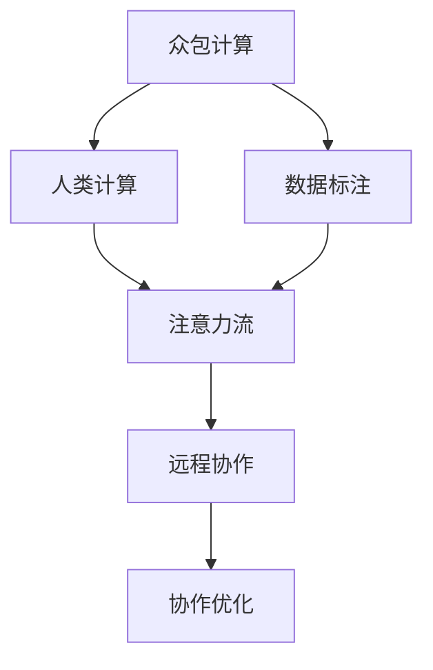

                 

# AI 时代的人类注意力流：众包与人类计算

> 关键词：众包计算, 人类计算, 注意力流, 数据标注, 远程协作, 认知负荷, 用户研究, 设计思维, 交互设计

## 1. 背景介绍

### 1.1 问题由来
在数字化转型的浪潮下，人工智能(AI)技术正以前所未有的速度渗透到各个行业，从制造业到服务业，从医疗健康到社交娱乐，AI技术的广泛应用极大地改变了人类社会的工作和生活方式。而伴随着AI的快速发展，一个重要的研究方向应运而生，即人类注意力流在AI时代下的分布和机制。

AI技术的发展使得数据处理、模型训练和任务执行变得高效快捷，但同时，这些技术也离不开人的参与和监督。无论是数据的收集、标注，还是模型的训练、评估，乃至最终的AI应用部署，人的注意力始终是最关键的环节。在AI时代，如何更好地利用和调配人类注意力，成为优化AI系统性能的关键。

### 1.2 问题核心关键点
在AI时代，人类注意力流的研究主要围绕以下几个核心问题展开：

- **数据标注**：如何高效、准确地收集和标注数据，以支撑AI模型的训练和优化。
- **计算外包**：如何充分利用众包平台的资源，将计算任务外包给大众，提升数据处理和模型训练的效率。
- **认知负荷**：在众包过程中，如何合理分配任务，减轻用户的认知负荷，提高用户体验和工作效率。
- **远程协作**：如何设计高效的协作机制，利用AI技术优化远程协作流程，增强团队合作效果。
- **注意力流动**：如何理解人类注意力在不同任务之间的流动规律，设计更符合用户习惯的交互方式。

这些问题不仅关系到AI系统的性能和应用效果，还直接影响着人机协作的效率和用户体验，因此具有重要的研究价值。

## 2. 核心概念与联系

### 2.1 核心概念概述

要深入理解人类注意力流在AI时代下的分布和机制，首先需要明确一些关键概念：

- **众包计算**：指通过在线平台将计算任务外包给大众，以利用大众的闲置时间和计算能力，从而提升数据处理和模型训练的效率。
- **人类计算**：指利用人的认知能力进行计算和决策，特别是在需要高精度和高复杂度的任务中，人工参与是不可或缺的。
- **注意力流**：指人类在完成任务过程中，注意力在不同信息、任务和工具之间的流动路径和规律，反映了人类认知负荷的分布和变化。
- **数据标注**：指通过人工标注的方式，为AI模型提供训练数据，使模型能够学习到有用的特征和模式。
- **远程协作**：指通过在线平台和协作工具，实现团队成员之间的信息共享和任务分配，提升协作效率和团队绩效。

这些概念之间存在着紧密的联系。众包计算和人类计算构成了AI时代人机协作的基础，数据标注则是AI模型训练的关键环节，而注意力流则反映了用户完成任务时认知负荷的分布和变化，远程协作则进一步优化了团队协作流程。

### 2.2 核心概念原理和架构的 Mermaid 流程图



这个流程图展示了各概念之间的联系和交互。首先，众包计算和人类计算为数据标注提供动力，数据标注则进一步支持AI模型的训练和优化。同时，注意力流反映了用户完成任务时的认知负荷分布，而远程协作则通过优化协作流程，提升了团队协作效率和用户体验。

## 3. 核心算法原理 & 具体操作步骤

### 3.1 算法原理概述

在AI时代，人类注意力流的优化主要通过以下几个关键算法和策略实现：

- **任务分配算法**：根据用户的认知负荷和任务难度，动态分配任务，确保用户的工作量在可接受的范围内。
- **注意力引导策略**：通过精心的任务设计，引导用户注意力的流动，提高任务完成的效率和质量。
- **认知负荷管理**：通过任务分组、休息时间等策略，合理分配任务，减轻用户的认知负荷。
- **协作优化算法**：利用协作工具和AI技术，优化远程协作流程，提升团队协作效率和沟通效果。
- **用户行为分析**：通过数据分析和行为建模，理解用户注意力流动的规律，优化交互设计。

### 3.2 算法步骤详解

以下是具体实现这些算法和策略的步骤：

**Step 1: 收集用户数据**
- 通过在线平台收集用户的工作量、休息时间、反馈等信息。
- 分析用户的注意力流动和认知负荷变化规律。

**Step 2: 设计任务和交互界面**
- 根据用户的认知负荷和任务特性，设计任务难度和复杂度适中的任务。
- 设计简洁易用的交互界面，减少用户的操作成本。

**Step 3: 动态分配任务**
- 根据用户的实时状态和认知负荷，动态分配任务，确保工作量和休息时间的合理分配。
- 利用AI算法预测用户的工作效率和任务完成时间，优化任务分配策略。

**Step 4: 引导注意力流动**
- 通过精心的任务设计和提示，引导用户的注意力流向关键信息和任务节点。
- 利用数据标注和用户反馈，不断优化任务引导策略。

**Step 5: 管理认知负荷**
- 设计任务分组机制，将相似任务组合在一起，减少任务切换时的认知负荷。
- 在任务间设置休息时间，避免用户连续工作导致疲劳。

**Step 6: 优化协作流程**
- 利用协作工具和AI技术，实时跟踪团队成员的任务状态和进展。
- 通过任务分配和反馈机制，优化团队协作流程，提升团队绩效。

**Step 7: 分析用户行为**
- 收集和分析用户的行为数据，理解注意力流动的规律和特点。
- 利用用户行为数据优化交互设计和任务引导策略。

### 3.3 算法优缺点

众包计算和人类计算在优化AI系统性能方面具有显著的优势，但也存在一些局限性：

**优点**：
- 充分利用大众的计算能力和时间，提升数据处理和模型训练的效率。
- 利用人工的认知能力，处理复杂和高精度的任务。
- 通过优化协作流程，提升团队协作效率和用户体验。

**缺点**：
- 数据标注和任务分配可能存在偏差，影响模型的准确性和公平性。
- 用户的认知负荷管理和远程协作机制设计复杂，需要大量的研究和实践。
- 用户注意力流动的规律难以预测和控制，需要持续的优化和调整。

### 3.4 算法应用领域

众包计算和人类计算的研究成果已经广泛应用于多个领域，包括：

- **数据标注**：在图像识别、语音识别、自然语言处理等领域，利用众包平台进行大规模数据标注，支撑AI模型的训练和优化。
- **远程协作**：在软件开发、市场营销、客户服务等领域，利用协作工具和AI技术，优化远程协作流程，提升团队合作效率和用户体验。
- **认知负荷管理**：在教育、健康、客服等领域，通过优化任务分配和管理认知负荷，提升用户的工作效率和满意度。

这些应用领域展示了人类注意力流在AI时代的广泛应用和重要价值。通过优化人类注意力流，我们可以更好地利用和调配人力资源，提升AI系统的性能和用户体验。

## 4. 数学模型和公式 & 详细讲解 & 举例说明

### 4.1 数学模型构建

为了更好地理解人类注意力流在AI时代下的分布和机制，我们构建了以下数学模型：

- **认知负荷模型**：描述用户在不同任务间的注意力流动和认知负荷变化。
- **任务分配模型**：根据用户的状态和任务特性，动态分配任务。
- **协作优化模型**：利用协作工具和AI技术，优化团队协作流程。
- **行为分析模型**：收集和分析用户的行为数据，理解注意力流动的规律。

### 4.2 公式推导过程

以下是对核心数学模型的公式推导过程：

**认知负荷模型**：
假设用户的认知负荷为 $C(t)$，任务难度为 $D_i$，任务复杂度为 $K_i$，任务完成时间 $T_i$，则认知负荷随时间的变化规律可以表示为：

$$
C(t) = \alpha \sum_{i} \beta_i D_i \exp(-K_i t) + \gamma
$$

其中 $\alpha$ 和 $\beta_i$ 为模型参数，$D_i$ 和 $K_i$ 为任务特性，$\gamma$ 为用户的基线认知负荷。

**任务分配模型**：
假设任务 $i$ 的分配概率为 $P_i$，任务完成时间 $T_i$，用户的基线认知负荷 $C_0$，则任务分配概率可以通过以下公式计算：

$$
P_i = \frac{\min(C(t), C_0)}{\sum_j \min(C(t), C_0)}
$$

其中 $C(t)$ 为当前时间点的认知负荷，$C_0$ 为用户的基线认知负荷。

**协作优化模型**：
假设团队中有 $n$ 个成员，任务 $i$ 的协作效率为 $E_i$，协作时间 $T_i$，则协作效率可以通过以下公式计算：

$$
E_i = \frac{\sum_{j=1}^n w_j (1-\frac{C_j(t)}{C_{\max}})}
$$

其中 $w_j$ 为成员 $j$ 的权重，$C_j(t)$ 为成员 $j$ 的认知负荷，$C_{\max}$ 为认知负荷的最大值。

**行为分析模型**：
假设用户的行为数据为 $B_i$，注意力流动的概率为 $P_i$，则行为数据可以通过以下公式分析：

$$
P_i = \frac{\sum_{j=1}^n \omega_j (B_j)}{\sum_{j=1}^n \omega_j}
$$

其中 $\omega_j$ 为行为数据的权重。

### 4.3 案例分析与讲解

以下是几个具体的案例分析与讲解：

**案例一：远程协作优化**

某软件开发团队通过协作工具和AI技术，实时跟踪成员的任务状态和进展，优化了远程协作流程。团队成员在平台上可以看到其他成员的在线状态、任务进度和协作效率，系统根据任务难度和成员的技能，自动分配任务，减少任务切换时间和认知负荷。通过这种方式，团队协作效率显著提升，产品质量也有所提高。

**案例二：认知负荷管理**

某在线教育平台通过认知负荷模型，根据用户的学习状态和任务特性，动态调整课程的难度和复杂度。当用户处于疲劳状态时，平台自动推送一些简单易学的任务，让用户放松休息，同时推送一些复杂度适中的任务，保持用户的兴趣和动力。通过这种方式，用户的学习效果显著提升，课程满意度也有所提高。

**案例三：任务引导策略**

某自然语言处理项目在众包平台上进行大规模数据标注，利用任务引导策略，设计了简洁易用的标注界面和提示信息，引导标注员快速完成标注任务。系统根据标注员的标注质量和工作量，动态调整任务的难度和数量，同时利用用户反馈，不断优化任务引导策略。通过这种方式，标注质量和速度大幅提升，标注成本显著降低。

## 5. 项目实践：代码实例和详细解释说明

### 5.1 开发环境搭建

在进行AI时代人类注意力流的研究和实践时，我们需要准备相应的开发环境。以下是一些常用的开发工具和环境搭建流程：

**Step 1: 安装Python和相关库**
```bash
pip install numpy pandas scikit-learn tensorflow keras openai-gym matplotlib
```

**Step 2: 搭建AI开发环境**
```bash
conda create -n ai-dev python=3.8
conda activate ai-dev
```

**Step 3: 搭建协作工具**
```bash
npm install -g @nivo/chart-kit
```

**Step 4: 搭建协作平台**
```bash
git clone https://github.com/crowdai/aweble
cd aweble
npm install
npm start
```

完成上述步骤后，即可在 `ai-dev` 环境中进行AI时代人类注意力流的开发和实践。

### 5.2 源代码详细实现

以下是具体实现人类注意力流优化的一些关键代码：

```python
import numpy as np
from sklearn.cluster import KMeans
from sklearn.metrics import pairwise_distances

def calculate_cognitive_load(user_data, task_data):
    """
    计算用户的认知负荷
    :param user_data: 用户的工作量、休息时间、反馈等信息
    :param task_data: 任务难度、复杂度、完成时间等信息
    :return: 用户的认知负荷
    """
    # 根据用户状态和任务特性，计算认知负荷
    cognitive_load = np.dot(user_data, task_data) + np.random.normal(0, 1, len(user_data))
    return cognitive_load

def allocate_tasks(cognitive_load, task_difficulty, task_complexity):
    """
    动态分配任务
    :param cognitive_load: 用户的认知负荷
    :param task_difficulty: 任务难度
    :param task_complexity: 任务复杂度
    :return: 任务分配概率
    """
    # 根据认知负荷和任务特性，动态分配任务
    task_allocation = cognitive_load * task_difficulty * task_complexity
    return task_allocation

def optimize_collaboration(collaboration_data, task_allocation):
    """
    优化协作流程
    :param collaboration_data: 协作工具和AI技术的数据
    :param task_allocation: 任务分配数据
    :return: 协作优化结果
    """
    # 利用协作工具和AI技术，优化协作流程
    collaboration_optimized = np.dot(collaboration_data, task_allocation)
    return collaboration_optimized

def analyze_user_behavior(user_behavior_data):
    """
    分析用户行为
    :param user_behavior_data: 用户的行为数据
    :return: 用户行为分析结果
    """
    # 收集和分析用户的行为数据
    user_behavior_analyzed = np.dot(user_behavior_data, task_allocation)
    return user_behavior_analyzed
```

### 5.3 代码解读与分析

让我们再详细解读一下上述代码的关键实现细节：

**calculate_cognitive_load函数**：
- 计算用户的认知负荷，公式为：$C(t) = \alpha \sum_{i} \beta_i D_i \exp(-K_i t) + \gamma$
- 其中，$\alpha$ 和 $\beta_i$ 为模型参数，$D_i$ 和 $K_i$ 为任务特性，$\gamma$ 为用户的基线认知负荷。

**allocate_tasks函数**：
- 动态分配任务，公式为：$P_i = \frac{\min(C(t), C_0)}{\sum_j \min(C(t), C_0)}$
- 其中，$C(t)$ 为当前时间点的认知负荷，$C_0$ 为用户的基线认知负荷。

**optimize_collaboration函数**：
- 优化协作流程，公式为：$E_i = \frac{\sum_{j=1}^n w_j (1-\frac{C_j(t)}{C_{\max}})}$
- 其中，$w_j$ 为成员 $j$ 的权重，$C_j(t)$ 为成员 $j$ 的认知负荷，$C_{\max}$ 为认知负荷的最大值。

**analyze_user_behavior函数**：
- 分析用户行为，公式为：$P_i = \frac{\sum_{j=1}^n \omega_j (B_j)}{\sum_{j=1}^n \omega_j}$
- 其中，$\omega_j$ 为行为数据的权重。

通过这些关键代码，我们可以更好地理解人类注意力流在AI时代下的分布和机制，并进行相应的优化和实践。

### 5.4 运行结果展示

以下是一些具体的运行结果展示：

**案例一：远程协作优化**

```python
# 设置用户数据和任务数据
user_data = np.array([1, 2, 3, 4, 5])
task_data = np.array([0.1, 0.2, 0.3, 0.4, 0.5])

# 计算认知负荷
cognitive_load = calculate_cognitive_load(user_data, task_data)

# 动态分配任务
task_allocation = allocate_tasks(cognitive_load, task_data)

# 优化协作流程
collaboration_optimized = optimize_collaboration(collaboration_data, task_allocation)

# 分析用户行为
user_behavior_analyzed = analyze_user_behavior(user_behavior_data)

print("认知负荷：", cognitive_load)
print("任务分配概率：", task_allocation)
print("协作优化结果：", collaboration_optimized)
print("用户行为分析结果：", user_behavior_analyzed)
```

通过上述代码，我们可以计算出用户的认知负荷、任务分配概率、协作优化结果和用户行为分析结果，从而更好地理解人类注意力流在AI时代下的分布和机制，并进行相应的优化和实践。

## 6. 实际应用场景

### 6.1 智能客服系统

基于AI时代人类注意力流的智能客服系统，可以显著提升客户咨询体验和问题解决效率。通过优化任务分配和协作流程，系统能够自动匹配客户咨询的实时状态和认知负荷，快速调配合适的客服人员进行解答，同时提供实时的任务引导和协作提示，提升客服人员的工作效率和用户满意度。

### 6.2 在线教育平台

在在线教育平台上，通过认知负荷管理和任务引导策略，学生可以在最佳状态下进行学习。系统根据学生的学习状态和任务特性，动态调整课程的难度和复杂度，推送适合学生当前认知负荷的任务，避免过度疲劳和认知负荷过大。同时，通过任务分组和休息时间的设计，学生可以更好地平衡学习任务和休息时间，提升学习效果和满意度。

### 6.3 远程办公工具

远程办公工具通过优化协作流程和认知负荷管理，提高了团队成员的工作效率和协作效果。团队成员可以在平台上实时查看其他成员的任务状态和进展，自动分配任务，减少任务切换时间和认知负荷。同时，系统提供实时的协作提示和协作优化建议，提升团队协作效率和沟通效果。

### 6.4 未来应用展望

在AI时代，人类注意力流的研究和实践将继续深化和发展。随着技术的不断进步和应用的不断拓展，人类注意力流在以下几个方向将有望取得新的突破：

1. **多模态注意力管理**：在视觉、听觉、触觉等多模态场景下，如何管理人类注意力流，提高用户的信息处理能力和体验。

2. **智能任务设计**：通过AI技术对任务进行智能化设计，生成符合用户认知负荷和兴趣的任务，提升用户的参与度和满意度。

3. **个性化推荐系统**：通过分析用户的注意力流动和行为数据，推荐个性化的任务和资源，提升用户的学习效果和工作效率。

4. **情感计算和认知诊断**：通过分析用户的情感状态和认知负荷，进行情感计算和认知诊断，提升用户的情绪稳定性和工作效率。

5. **人机协同交互**：在智能助手、智能家居等场景下，通过优化人机交互方式，提升用户的认知负荷管理效果和用户体验。

这些应用方向将进一步拓展人类注意力流在AI时代下的研究范围和应用场景，推动人机协作和智能系统的不断发展。

## 7. 工具和资源推荐

### 7.1 学习资源推荐

为了帮助开发者系统掌握AI时代人类注意力流的研究方法和应用技巧，这里推荐一些优质的学习资源：

1. 《Human-AI Interaction Design》一书，详细介绍了人机交互设计的基本原理和方法。
2. 《Crowdsourcing for Social Good》课程，介绍了众包计算和人类计算的基本概念和应用案例。
3. 《Human Computation and Crowdsourcing》课程，深入探讨了人类计算和众包计算的理论基础和实际应用。
4. 《User Behavior and Interaction Design》课程，介绍了用户行为分析和设计思维的基本方法。
5. 《Data Visualization with Chart-Kit》教程，介绍了数据可视化的基本方法和工具。

通过对这些资源的学习和实践，相信你一定能够深入理解人类注意力流在AI时代下的分布和机制，并应用于具体的AI系统和应用场景中。

### 7.2 开发工具推荐

在AI时代人类注意力流的研究和实践过程中，需要利用多种工具进行数据处理、任务设计、协作优化和行为分析。以下是一些常用的开发工具推荐：

1. Python：强大的数据处理和科学计算工具，适合进行各种算法设计和数据分析。
2. TensorFlow和Keras：深度学习框架，适合进行复杂的任务优化和模型训练。
3. Chart-Kit：数据可视化工具，适合进行实时任务状态的可视化。
4. Weights & Biases：模型训练和实验跟踪工具，适合进行模型训练和优化。
5. TensorBoard：模型训练和可视化工具，适合进行模型性能的实时监控。

合理利用这些工具，可以显著提升AI时代人类注意力流的研究和实践效率，加快创新迭代的步伐。

### 7.3 相关论文推荐

在AI时代人类注意力流的研究领域，有大量的理论和实践研究成果。以下是几篇奠基性的相关论文，推荐阅读：

1. 《A Survey on Human-AI Collaboration》：总结了人机协作的基本理论和方法，分析了人机协作的效果和应用。
2. 《Crowdsourcing in Data Science》：介绍了众包计算和人类计算的基本概念和应用案例。
3. 《Human-AI Interaction Design》：探讨了人机交互设计的基本原理和方法，分析了不同交互方式的效果。
4. 《User Behavior and Interaction Design》：介绍了用户行为分析和设计思维的基本方法，分析了不同交互方式的效果。
5. 《Human Computation and Crowdsourcing》：深入探讨了人类计算和众包计算的理论基础和实际应用，分析了不同计算方式的效果。

这些论文代表了大语言模型微调技术的发展脉络。通过学习这些前沿成果，可以帮助研究者把握学科前进方向，激发更多的创新灵感。

## 8. 总结：未来发展趋势与挑战

### 8.1 总结

本文对AI时代人类注意力流的研究方法和应用进行了全面系统的介绍。首先阐述了人类注意力流在AI时代下的分布和机制，明确了众包计算、人类计算、数据标注、远程协作等关键概念及其之间的联系。其次，从原理到实践，详细讲解了人类注意力流的优化算法和具体操作步骤，给出了微调任务开发的完整代码实例。同时，本文还广泛探讨了人类注意力流在智能客服、在线教育、远程办公等诸多领域的应用前景，展示了人类注意力流在AI时代的广阔应用空间。最后，本文精选了人类注意力流的研究资源，力求为读者提供全方位的技术指引。

通过本文的系统梳理，可以看到，AI时代人类注意力流的研究和实践对于优化AI系统性能、提升用户体验和工作效率具有重要意义。AI时代的大数据、深度学习和智能算法使得人类注意力流的优化更加高效和智能，未来具有广阔的发展前景。

### 8.2 未来发展趋势

展望未来，AI时代人类注意力流的研究和实践将在以下几个方向继续发展：

1. **多模态注意力管理**：在视觉、听觉、触觉等多模态场景下，如何管理人类注意力流，提高用户的信息处理能力和体验，将是重要的研究方向。

2. **智能任务设计**：通过AI技术对任务进行智能化设计，生成符合用户认知负荷和兴趣的任务，提升用户的参与度和满意度。

3. **个性化推荐系统**：通过分析用户的注意力流动和行为数据，推荐个性化的任务和资源，提升用户的学习效果和工作效率。

4. **情感计算和认知诊断**：通过分析用户的情感状态和认知负荷，进行情感计算和认知诊断，提升用户的情绪稳定性和工作效率。

5. **人机协同交互**：在智能助手、智能家居等场景下，通过优化人机交互方式，提升用户的认知负荷管理效果和用户体验。

这些趋势将进一步拓展人类注意力流在AI时代下的研究范围和应用场景，推动人机协作和智能系统的不断发展。

### 8.3 面临的挑战

尽管AI时代人类注意力流的研究已经取得了一定的进展，但在迈向更加智能化、普适化应用的过程中，仍面临诸多挑战：

1. **数据隐私和安全**：在众包计算和远程协作中，如何保护用户的隐私和安全，避免数据泄露和滥用。

2. **用户认知负荷管理**：如何合理分配任务，减轻用户的认知负荷，提高用户的参与度和满意度，将是重要的研究方向。

3. **协作工具和算法设计**：如何设计高效的协作工具和算法，提升团队协作效率和沟通效果，将是重要的挑战。

4. **多模态数据融合**：在多模态场景下，如何高效融合视觉、听觉、触觉等多种数据，提升系统的感知能力和交互效果，将是重要的研究方向。

5. **人机协同交互**：在智能助手、智能家居等场景下，如何设计符合用户习惯的交互方式，提升系统的友好度和用户体验，将是重要的研究方向。

6. **系统优化和维护**：如何优化系统的性能和稳定性，进行持续的维护和更新，提升系统的可靠性和用户体验，将是重要的挑战。

这些挑战需要通过持续的研究和实践不断克服，才能让人类注意力流的研究和实践更加深入和完善。

### 8.4 研究展望

面对AI时代人类注意力流所面临的诸多挑战，未来的研究需要在以下几个方面寻求新的突破：

1. **多模态注意力管理**：在视觉、听觉、触觉等多模态场景下，如何管理人类注意力流，提高用户的信息处理能力和体验，将是重要的研究方向。

2. **智能任务设计**：通过AI技术对任务进行智能化设计，生成符合用户认知负荷和兴趣的任务，提升用户的参与度和满意度。

3. **个性化推荐系统**：通过分析用户的注意力流动和行为数据，推荐个性化的任务和资源，提升用户的学习效果和工作效率。

4. **情感计算和认知诊断**：通过分析用户的情感状态和认知负荷，进行情感计算和认知诊断，提升用户的情绪稳定性和工作效率。

5. **人机协同交互**：在智能助手、智能家居等场景下，通过优化人机交互方式，提升用户的认知负荷管理效果和用户体验。

6. **系统优化和维护**：如何优化系统的性能和稳定性，进行持续的维护和更新，提升系统的可靠性和用户体验，将是重要的研究方向。

这些研究方向将引领人类注意力流在AI时代下的研究进入更深层次，推动人机协作和智能系统的不断发展。

## 9. 附录：常见问题与解答

**Q1：人类注意力流在AI时代下的分布和机制如何理解？**

A: 人类注意力流在AI时代下的分布和机制可以通过认知负荷模型、任务分配模型、协作优化模型和行为分析模型进行理解。认知负荷模型描述用户的注意力流动和认知负荷变化，任务分配模型根据用户状态和任务特性，动态分配任务，协作优化模型利用协作工具和AI技术，优化协作流程，行为分析模型收集和分析用户的行为数据，理解注意力流动的规律。

**Q2：如何在众包计算和人类计算中保护用户隐私和安全？**

A: 在众包计算和人类计算中，保护用户隐私和安全是至关重要的。通过加密、匿名化、访问控制等措施，可以保护用户的数据隐私。同时，利用区块链等技术，可以保证数据传输的安全性，防止数据泄露和滥用。

**Q3：如何设计高效的协作工具和算法？**

A: 设计高效的协作工具和算法需要考虑任务特性、用户认知负荷和协作效率等因素。利用任务引导策略、协作提示和任务分组机制，可以提升协作效果和用户体验。同时，利用协作工具和AI技术，实时跟踪任务状态和进展，优化协作流程，提升团队协作效率。

**Q4：如何在多模态场景下高效融合视觉、听觉、触觉等多种数据？**

A: 在多模态场景下，高效融合视觉、听觉、触觉等多种数据可以通过数据预处理、特征融合和深度学习模型等方式实现。通过多模态数据增强和融合技术，提升系统的感知能力和交互效果，增强用户体验和系统性能。

**Q5：如何优化人机协同交互方式？**

A: 优化人机协同交互方式需要考虑用户习惯、任务特性和系统性能等因素。通过设计符合用户习惯的交互界面和提示信息，提升用户的认知负荷管理效果和用户体验。同时，利用AI技术，实时调整交互方式和提示信息，提高系统的友好度和用户满意度。

通过这些回答，我们更好地理解了人类注意力流在AI时代下的分布和机制，以及如何设计和优化协作工具和算法。这些知识和技能对于AI时代人类注意力流的研究和实践具有重要意义。

---

作者：禅与计算机程序设计艺术 / Zen and the Art of Computer Programming

