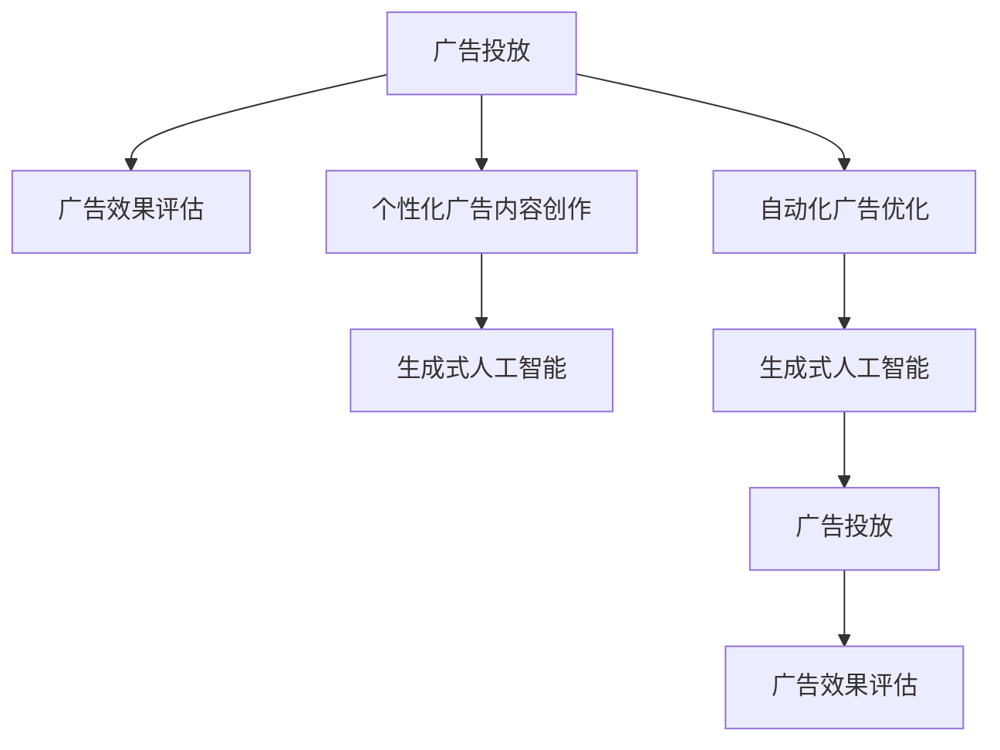

                 

# AIGC重塑营销与广告行业

## 1. 背景介绍

### 1.1 问题由来
当前，随着数字经济的高速发展和全球市场环境的快速变化，营销与广告行业正面临着前所未有的挑战和机遇。传统营销广告模式以人为主导、资源消耗大、效果难以量化评估等缺点日益凸显，亟需一场深刻的变革以适应新的市场环境。

随着人工智能、生成对抗网络（GANs）、增强学习（RL）等前沿技术逐渐成熟，广告主和营销人员开始探索利用生成式人工智能（AIGC）技术来创造更加精准、高效、个性化的广告内容，进而优化广告投放策略，提升品牌影响力，实现广告预算的最大化利用。

### 1.2 问题核心关键点
AIGC技术在营销与广告行业的应用，能够帮助广告主和营销人员实现以下几个关键目标：

- **精确广告定位**：通过分析用户数据和行为，生成具有高度相关性的广告内容，提高广告的点击率和转化率。
- **个性化广告内容创作**：利用AI技术生成个性化的图像、视频、文字等广告内容，满足不同用户群体的需求，提升用户粘性。
- **自动化广告优化**：借助AI算法实时调整广告投放策略，优化广告投放的地理、时间、人群等因素，提升广告效果。
- **跨平台广告协同**：AIGC生成的内容可以无缝适配不同的平台（如移动端、Web端等），实现跨平台广告投放的一致性和高效性。
- **高效广告投放监控**：通过AI技术实时监测广告效果，自动化生成报告，帮助广告主优化投放策略。

基于上述目标，AIGC技术在营销与广告行业的应用，不仅提升了广告投放的精准性和效率，也为广告创意的创作和广告效果的评估提供了新的工具和方法。

### 1.3 问题研究意义
研究AIGC在营销与广告行业的应用，对于拓展AI技术的实际应用场景，提升广告效果和优化广告投放策略，加速营销广告行业转型升级，具有重要意义：

1. **降低广告投放成本**：利用AIGC技术生成个性化广告内容，避免人工创意成本，显著降低广告投放的总体成本。
2. **提升广告精准性**：通过深度学习和大数据分析，生成高度个性化的广告内容，大幅提升广告的点击率和转化率。
3. **提高广告投放效率**：借助AI技术自动化调整广告投放策略，优化广告投放的各个环节，提升广告投放的整体效率。
4. **增强广告效果评估**：通过AI技术实时监控广告效果，自动化生成评估报告，帮助广告主及时调整广告策略，提升广告效果。
5. **推动广告行业转型**：AIGC技术的应用将推动广告行业从传统的创意驱动向数据驱动、智能驱动的方向转型，带来行业创新和升级。

## 2. 核心概念与联系

### 2.1 核心概念概述

为更好地理解AIGC在营销与广告行业的应用，本节将介绍几个密切相关的核心概念：

- **生成式人工智能（AIGC）**：基于深度学习和大数据技术，自动生成高质量的文本、图像、视频等内容的技术。
- **广告投放（Ad Placement）**：将广告内容投放至特定目标用户的过程，涉及广告预算分配、广告形式选择、投放渠道优化等多个环节。
- **广告效果评估（Ad Effect Evaluation）**：衡量广告投放效果，分析广告点击率、转化率、用户行为变化等指标，为广告优化提供依据。
- **个性化广告内容创作（Personalized Ad Content Creation）**：利用AI技术，根据用户数据和行为生成高度个性化的广告内容，满足不同用户群体的需求。
- **自动化广告优化（Automated Ad Optimization）**：借助AI算法，实时调整广告投放策略，优化广告投放的各个环节，提升广告效果。

这些核心概念之间的逻辑关系可以通过以下Mermaid流程图来展示：



这个流程图展示了广告投放、广告效果评估、个性化广告内容创作和自动化广告优化之间的内在联系，以及它们如何通过生成式人工智能技术实现深度融合。

## 3. 核心算法原理 & 具体操作步骤
### 3.1 算法原理概述

AIGC技术在营销与广告行业的应用，主要基于以下几个核心算法原理：

1. **深度生成模型**：通过深度神经网络模型，如生成对抗网络（GANs）、变分自编码器（VAE）、语言模型等，自动生成高质量的广告内容。
2. **用户画像分析**：通过分析用户的历史行为、兴趣偏好、社交网络等数据，构建用户画像，实现广告内容的个性化推荐。
3. **广告投放优化**：借助强化学习（RL）、深度学习等算法，实时优化广告投放策略，提升广告效果。
4. **广告效果评估**：利用数据分析、机器学习等技术，实时监控广告效果，生成评估报告，优化广告策略。
5. **跨平台广告协同**：通过API接口等技术手段，实现不同平台（如移动端、Web端等）广告内容的无缝适配。

### 3.2 算法步骤详解

基于上述算法原理，AIGC技术在营销与广告行业的应用主要包括以下几个关键步骤：

**Step 1: 数据收集与预处理**
- 收集用户行为数据、兴趣数据、社交网络数据等，作为用户画像的基础数据。
- 对数据进行清洗、去重、标注等预处理，构建用户画像数据集。

**Step 2: 用户画像构建**
- 使用深度学习模型，如卷积神经网络（CNN）、递归神经网络（RNN）、变分自编码器（VAE）等，对用户画像数据集进行处理，生成用户画像。

**Step 3: 个性化广告内容创作**
- 根据用户画像数据，使用生成对抗网络（GANs）、变分自编码器（VAE）等生成模型，自动生成个性化广告内容。
- 对生成的广告内容进行评估和筛选，选择符合用户需求和品牌定位的广告内容。

**Step 4: 广告投放优化**
- 使用强化学习（RL）等算法，实时优化广告投放策略，如调整投放时间、投放渠道、投放预算等。
- 对广告投放效果进行实时监控和评估，根据效果调整投放策略，提升广告效果。

**Step 5: 广告效果评估**
- 利用数据分析和机器学习技术，对广告点击率、转化率、用户行为变化等指标进行评估。
- 根据评估结果，优化广告内容、投放策略等，提升广告效果。

**Step 6: 跨平台广告协同**
- 使用API接口等技术手段，实现不同平台广告内容的无缝适配。
- 对广告内容进行跨平台优化和调整，提升广告的整体效果。

### 3.3 算法优缺点

AIGC技术在营销与广告行业的应用，具有以下优点：

1. **高度个性化**：通过深度学习和大数据分析，自动生成高度个性化的广告内容，满足不同用户群体的需求。
2. **自动化程度高**：利用AI技术自动化生成广告内容、优化投放策略，提高广告投放的效率和精准性。
3. **成本低廉**：自动生成广告内容，避免人工创意的成本，显著降低广告投放的总体成本。
4. **效果显著**：通过深度学习和大数据分析，生成高度个性化的广告内容，提升广告的点击率和转化率。

同时，该技术也存在一些局限性：

1. **数据依赖性强**：生成广告内容的质量和效果，高度依赖于用户数据的全面性和准确性。
2. **技术复杂度高**：涉及深度学习、生成对抗网络、强化学习等多项技术，技术实现难度较高。
3. **效果评估复杂**：广告效果评估涉及多个指标，数据处理和分析复杂。
4. **用户体验风险**：自动化生成的广告内容可能出现不合理、低俗等内容，影响用户体验。

尽管存在这些局限性，但就目前而言，AIGC技术仍是大数据驱动的营销广告行业的重要技术手段。未来相关研究的重点在于如何进一步提高数据的质量和全面性，简化技术实现流程，增强广告效果评估能力，同时兼顾用户体验和品牌形象。

### 3.4 算法应用领域

AIGC技术在营销与广告行业的应用，涵盖了以下几个主要领域：

- **品牌广告创意**：利用AIGC技术自动生成高质量的品牌广告创意，提高广告的吸引力和感染力。
- **用户行为分析**：通过分析用户行为数据，生成个性化的广告内容，提高广告的点击率和转化率。
- **跨平台广告协同**：实现不同平台广告内容的无缝适配，提升广告的整体效果。
- **广告投放优化**：借助AI技术自动化调整广告投放策略，提升广告的投放效率和效果。
- **广告效果评估**：利用AI技术实时监控广告效果，生成评估报告，优化广告策略。

此外，AIGC技术还可以应用于广告创意生成、广告效果预测、广告预算分配等环节，为营销广告行业带来更多创新和变革。

## 4. 数学模型和公式 & 详细讲解 & 举例说明
### 4.1 数学模型构建

本节将使用数学语言对AIGC在营销与广告行业的应用过程进行更加严格的刻画。

假设广告内容为 $A$，用户画像为 $U$，广告效果为 $E$。目标是最大化广告效果 $E$，即：

$$
\max_{A,U} E
$$

其中，$E$ 可以通过广告点击率、转化率等指标进行量化。

**Step 1: 用户画像构建**
用户画像 $U$ 可以通过深度学习模型进行构建，模型结构如图：

$$
U = f_D(U_0)
$$

其中 $U_0$ 为用户原始数据，$f_D$ 为深度学习模型，如卷积神经网络（CNN）、递归神经网络（RNN）等。

**Step 2: 个性化广告内容创作**
生成式人工智能模型 $G$ 可以根据用户画像 $U$ 生成个性化广告内容 $A$，模型结构如图：

$$
A = G(U)
$$

其中 $G$ 为生成对抗网络（GANs）、变分自编码器（VAE）等生成模型。

**Step 3: 广告投放优化**
强化学习模型 $P$ 可以根据用户画像 $U$ 和广告内容 $A$，优化广告投放策略，模型结构如图：

$$
P(U,A) = f_R(U,A)
$$

其中 $f_R$ 为强化学习模型，如Q-learning、策略梯度等。

**Step 4: 广告效果评估**
广告效果评估模型 $E$ 可以根据广告点击率、转化率等指标，评估广告效果，模型结构如图：

$$
E(U,A) = f_E(U,A)
$$

其中 $f_E$ 为数据分析和机器学习模型，如回归模型、分类模型等。

### 4.2 公式推导过程

以下我们以品牌广告创意生成为例，推导AIGC技术在营销与广告行业应用的数学模型。

假设品牌广告创意为 $A$，用户画像为 $U$，品牌价值为 $V$。目标是最大化品牌价值 $V$，即：

$$
\max_{A,U} V
$$

其中 $V$ 可以通过品牌知名度、用户粘性等指标进行量化。

**Step 1: 用户画像构建**
用户画像 $U$ 可以通过深度学习模型进行构建，模型结构如图：

$$
U = f_D(U_0)
$$

**Step 2: 个性化广告内容创作**
生成式人工智能模型 $G$ 可以根据用户画像 $U$ 生成个性化广告内容 $A$，模型结构如图：

$$
A = G(U)
$$

**Step 3: 广告投放优化**
强化学习模型 $P$ 可以根据用户画像 $U$ 和广告内容 $A$，优化广告投放策略，模型结构如图：

$$
P(U,A) = f_R(U,A)
$$

**Step 4: 广告效果评估**
广告效果评估模型 $E$ 可以根据广告点击率、转化率等指标，评估广告效果，模型结构如图：

$$
E(U,A) = f_E(U,A)
$$

**Step 5: 品牌价值评估**
品牌价值评估模型 $V$ 可以根据广告效果 $E$ 和用户粘性等指标，评估品牌价值，模型结构如图：

$$
V(U,A) = f_V(E)
$$

通过以上模型，可以全面地量化品牌广告创意在营销与广告行业的效果，并进行优化。

### 4.3 案例分析与讲解

以下是一个具体的案例分析，展示了AIGC技术在广告创意生成中的应用。

**案例背景**：某知名电子产品公司需要推广其新产品，希望利用AIGC技术生成高质量的广告创意，提高广告点击率和转化率。

**数据准备**：收集用户历史浏览数据、购买数据、社交网络数据等，作为用户画像的基础数据。

**用户画像构建**：使用深度学习模型，如卷积神经网络（CNN），对用户画像数据集进行处理，生成用户画像。

**广告创意生成**：利用生成对抗网络（GANs）生成个性化广告创意，评估广告创意的点击率和转化率。

**广告投放优化**：使用强化学习算法，根据用户画像和广告创意，优化广告投放策略，调整投放时间、投放渠道等。

**广告效果评估**：利用数据分析和机器学习技术，实时监控广告效果，生成评估报告，优化广告策略。

**广告创意效果**：通过广告效果评估，选择效果最佳的广告创意进行投放，提升广告的整体效果。

## 5. 项目实践：代码实例和详细解释说明
### 5.1 开发环境搭建

在进行AIGC项目实践前，我们需要准备好开发环境。以下是使用Python进行PyTorch开发的环境配置流程：

1. 安装Anaconda：从官网下载并安装Anaconda，用于创建独立的Python环境。

2. 创建并激活虚拟环境：
```bash
conda create -n pytorch-env python=3.8 
conda activate pytorch-env
```

3. 安装PyTorch：根据CUDA版本，从官网获取对应的安装命令。例如：
```bash
conda install pytorch torchvision torchaudio cudatoolkit=11.1 -c pytorch -c conda-forge
```

4. 安装Transformers库：
```bash
pip install transformers
```

5. 安装各类工具包：
```bash
pip install numpy pandas scikit-learn matplotlib tqdm jupyter notebook ipython
```

完成上述步骤后，即可在`pytorch-env`环境中开始AIGC实践。

### 5.2 源代码详细实现

这里我们以生成式广告创意为例，给出使用Transformers库对AIGC进行Python代码实现。

首先，定义广告创意的生成函数：

```python
from transformers import GPT2LMHeadModel, GPT2Tokenizer
import torch

def generate_advert(text, max_len=256):
    model = GPT2LMHeadModel.from_pretrained('gpt2')
    tokenizer = GPT2Tokenizer.from_pretrained('gpt2')

    # 将广告文本转换为token ids
    tokens = tokenizer.encode(text, max_length=max_len, truncation=True, padding='max_length', return_tensors='pt')

    # 生成广告创意
    outputs = model.generate(tokens, max_length=max_len, num_return_sequences=1, temperature=1.0, top_k=50, top_p=1.0)

    # 解码生成的广告创意
    adverts = [tokenizer.decode(output, skip_special_tokens=True) for output in outputs]

    return adverts
```

然后，定义用户画像分析函数：

```python
def analyze_user_profile(profile, max_len=256):
    # 使用深度学习模型对用户画像进行分析，生成用户画像数据
    # ...

    # 返回分析结果
    return analysis_result
```

接着，定义广告投放优化函数：

```python
def optimize_ad_placement(advert, profile, max_len=256):
    # 使用强化学习模型优化广告投放策略
    # ...

    # 返回优化后的广告投放策略
    return optimized_strategy
```

最后，定义广告效果评估函数：

```python
def evaluate_ad_effect(advert, profile, max_len=256):
    # 使用数据分析和机器学习模型评估广告效果
    # ...

    # 返回评估结果
    return effect_score
```

### 5.3 代码解读与分析

让我们再详细解读一下关键代码的实现细节：

**广告创意生成函数**：
- `generate_advert`方法：使用GPT-2模型生成个性化广告创意。
- `text`：原始广告文本。
- `max_len`：广告创意的最大长度。
- `model`：加载预训练的GPT-2模型。
- `tokenizer`：加载预训练的GPT-2分词器。
- `tokens`：将原始广告文本转换为token ids。
- `outputs`：模型生成广告创意的结果。
- `adverts`：解码生成的广告创意。

**用户画像分析函数**：
- `analyze_user_profile`方法：使用深度学习模型对用户画像进行分析，生成用户画像数据。
- `profile`：用户原始数据。
- `analysis_result`：用户画像分析结果。

**广告投放优化函数**：
- `optimize_ad_placement`方法：使用强化学习模型优化广告投放策略。
- `advert`：生成的广告创意。
- `profile`：用户画像数据。
- `optimized_strategy`：优化后的广告投放策略。

**广告效果评估函数**：
- `evaluate_ad_effect`方法：使用数据分析和机器学习模型评估广告效果。
- `advert`：生成的广告创意。
- `profile`：用户画像数据。
- `effect_score`：广告效果的评估结果。

**广告创意效果评估**：
- 使用生成对抗网络（GANs）生成多个广告创意，使用用户画像数据进行评估。
- 通过评估结果选择效果最佳的广告创意进行投放。

可以看到，AIGC项目实践的代码实现相对简洁，关键在于选择合适的深度学习模型和优化算法，结合业务需求进行模型的设计和调参。

## 6. 实际应用场景

### 6.1 品牌广告创意生成

AIGC技术在品牌广告创意生成中的应用，可以显著提升广告创意的创新性和吸引力，提高广告点击率和转化率。通过深度学习模型分析用户画像，自动生成符合用户需求和品牌定位的广告创意，实现广告创意的个性化和精准化。

例如，某知名电子产品公司需要推广其新产品，可以使用AIGC技术生成个性化的广告创意，满足不同用户群体的需求，提高广告的吸引力和感染力。

### 6.2 用户行为分析

通过AIGC技术分析用户行为数据，生成高度个性化的广告内容，提高广告的点击率和转化率。例如，某电商公司需要提升其新产品的销售额，可以收集用户的历史浏览数据、购买数据、社交网络数据等，生成个性化的广告内容，吸引用户的注意力，提升用户粘性。

### 6.3 广告投放优化

利用AIGC技术自动调整广告投放策略，优化广告投放的各个环节，提升广告效果。例如，某媒体公司需要提高其广告的点击率和转化率，可以实时监控广告效果，使用AIGC技术自动调整广告投放策略，如调整投放时间、投放渠道、投放预算等。

### 6.4 广告效果评估

通过AIGC技术实时监控广告效果，生成评估报告，优化广告策略。例如，某品牌公司需要提升其广告效果，可以实时监控广告点击率、转化率等指标，使用AIGC技术生成评估报告，优化广告策略，提升广告效果。

## 7. 工具和资源推荐

### 7.1 学习资源推荐

为了帮助开发者系统掌握AIGC在营销与广告行业的应用，这里推荐一些优质的学习资源：

1. 《深度学习与生成式人工智能》系列博文：由大模型技术专家撰写，深入浅出地介绍了深度学习、生成式人工智能等前沿话题。

2. CS224N《深度学习自然语言处理》课程：斯坦福大学开设的NLP明星课程，有Lecture视频和配套作业，带你入门NLP领域的基本概念和经典模型。

3. 《生成式人工智能在广告中的应用》书籍：详细介绍了生成式人工智能在广告创意、广告投放优化、广告效果评估等环节的应用，适合从业者和学者参考。

4. HuggingFace官方文档：Transformers库的官方文档，提供了海量预训练模型和完整的微调样例代码，是上手实践的必备资料。

5. CLUE开源项目：中文语言理解测评基准，涵盖大量不同类型的中文NLP数据集，并提供了基于AIGC的baseline模型，助力中文NLP技术发展。

通过对这些资源的学习实践，相信你一定能够快速掌握AIGC在营销与广告行业的应用精髓，并用于解决实际的NLP问题。

### 7.2 开发工具推荐

高效的开发离不开优秀的工具支持。以下是几款用于AIGC开发的常用工具：

1. PyTorch：基于Python的开源深度学习框架，灵活动态的计算图，适合快速迭代研究。大部分深度学习模型都有PyTorch版本的实现。

2. TensorFlow：由Google主导开发的开源深度学习框架，生产部署方便，适合大规模工程应用。同样有丰富的深度学习模型资源。

3. Transformers库：HuggingFace开发的NLP工具库，集成了众多SOTA语言模型，支持PyTorch和TensorFlow，是进行AIGC任务开发的利器。

4. Weights & Biases：模型训练的实验跟踪工具，可以记录和可视化模型训练过程中的各项指标，方便对比和调优。与主流深度学习框架无缝集成。

5. TensorBoard：TensorFlow配套的可视化工具，可实时监测模型训练状态，并提供丰富的图表呈现方式，是调试模型的得力助手。

6. Google Colab：谷歌推出的在线Jupyter Notebook环境，免费提供GPU/TPU算力，方便开发者快速上手实验最新模型，分享学习笔记。

合理利用这些工具，可以显著提升AIGC项目的开发效率，加快创新迭代的步伐。

### 7.3 相关论文推荐

AIGC技术在营销与广告行业的应用，源于学界的持续研究。以下是几篇奠基性的相关论文，推荐阅读：

1. Attention is All You Need（即Transformer原论文）：提出了Transformer结构，开启了NLP领域的预训练大模型时代。

2. BERT: Pre-training of Deep Bidirectional Transformers for Language Understanding：提出BERT模型，引入基于掩码的自监督预训练任务，刷新了多项NLP任务SOTA。

3. Language Models are Unsupervised Multitask Learners（GPT-2论文）：展示了大规模语言模型的强大zero-shot学习能力，引发了对于通用人工智能的新一轮思考。

4. Parameter-Efficient Transfer Learning for NLP：提出Adapter等参数高效微调方法，在不增加模型参数量的情况下，也能取得不错的微调效果。

5. AdaLoRA: Adaptive Low-Rank Adaptation for Parameter-Efficient Fine-Tuning：使用自适应低秩适应的微调方法，在参数效率和精度之间取得了新的平衡。

6. Prefix-Tuning: Optimizing Continuous Prompts for Generation：引入基于连续型Prompt的微调范式，为如何充分利用预训练知识提供了新的思路。

这些论文代表了大模型微调技术的发展脉络。通过学习这些前沿成果，可以帮助研究者把握学科前进方向，激发更多的创新灵感。

## 8. 总结：未来发展趋势与挑战

### 8.1 总结

本文对AIGC在营销与广告行业的应用进行了全面系统的介绍。首先阐述了AIGC技术在营销广告行业的应用背景和意义，明确了AIGC技术在广告创意生成、用户行为分析、广告投放优化、广告效果评估等多个环节的实际应用价值。其次，从原理到实践，详细讲解了AIGC技术在广告创意生成、用户画像分析、广告投放优化、广告效果评估等多个环节的实现细节，给出了AIGC项目开发的完整代码实例。同时，本文还探讨了AIGC技术在广告创意生成、用户行为分析、广告投放优化、广告效果评估等多个环节的实际应用场景，展示了AIGC技术在营销广告行业的应用潜力。

通过本文的系统梳理，可以看到，AIGC技术在营销与广告行业的应用，不仅提升了广告投放的精准性和效率，也为广告创意的创作和广告效果的评估提供了新的工具和方法。AIGC技术的广泛应用，将推动营销广告行业从传统的创意驱动向数据驱动、智能驱动的方向转型，带来行业创新和升级。

### 8.2 未来发展趋势

展望未来，AIGC技术在营销与广告行业的应用将呈现以下几个发展趋势：

1. **技术融合创新**：AIGC技术将与大数据、云计算、物联网、区块链等前沿技术深度融合，提升广告投放的智能化水平，优化广告投放策略。
2. **广告创意多样化**：随着生成对抗网络（GANs）、变分自编码器（VAE）等生成模型的发展，广告创意的形式将更加多样化，内容将更加丰富多彩。
3. **广告效果量化评估**：广告效果的量化评估将更加精准和全面，结合用户行为数据分析，实时调整广告投放策略，提升广告效果。
4. **用户画像智能化**：用户画像的构建将更加智能化和精准化，通过深度学习模型分析用户数据，生成高度个性化的广告内容，提升广告效果。
5. **广告投放自动化**：广告投放策略的优化将更加自动化和智能化，通过强化学习等算法，实时调整广告投放策略，提升广告效果。

以上趋势凸显了AIGC技术在营销广告行业的应用前景，这些方向的探索发展，必将进一步提升广告投放的精准性和效率，推动营销广告行业的转型升级。

### 8.3 面临的挑战

尽管AIGC技术在营销与广告行业的应用已经取得了显著的成果，但在迈向更加智能化、普适化应用的过程中，它仍面临着诸多挑战：

1. **数据依赖性强**：AIGC技术的应用高度依赖于高质量的用户数据，数据获取和处理成本较高。
2. **技术复杂度高**：涉及深度学习、生成对抗网络、强化学习等多项技术，技术实现难度较高。
3. **效果评估复杂**：广告效果评估涉及多个指标，数据处理和分析复杂。
4. **用户体验风险**：自动化生成的广告内容可能出现不合理、低俗等内容，影响用户体验。
5. **品牌形象风险**：生成的广告内容可能不符合品牌形象，导致品牌声誉受损。

尽管存在这些挑战，但AIGC技术在营销与广告行业的应用前景广阔，需要通过技术创新和业务优化，解决现有问题，推动AIGC技术的持续发展。

### 8.4 研究展望

面对AIGC技术在营销与广告行业应用所面临的挑战，未来的研究需要在以下几个方面寻求新的突破：

1. **提高数据质量**：通过数据增强、数据清洗等技术手段，提高用户数据的全面性和准确性，降低数据获取和处理的成本。
2. **简化技术实现**：开发更加智能化的深度学习模型和算法，降低技术实现的复杂度，提高技术应用的可行性。
3. **增强效果评估**：引入更多先进的评估指标和评估方法，提高广告效果的量化评估能力。
4. **优化用户体验**：设计合理的广告创意生成策略，避免生成不合理、低俗等内容，提升用户体验。
5. **保护品牌形象**：生成广告内容时，考虑品牌形象和品牌价值观，避免生成不符合品牌形象的内容。

这些研究方向的探索，必将引领AIGC技术在营销广告行业的应用迈向新的高度，推动广告行业的智能化和普适化发展。面向未来，AIGC技术还需要与其他人工智能技术进行更深入的融合，如知识表示、因果推理、强化学习等，协同发力，共同推动广告行业的变革。只有勇于创新、敢于突破，才能真正实现人工智能技术在广告行业的规模化落地。

## 9. 附录：常见问题与解答

**Q1：AIGC在广告创意生成中如何实现个性化？**

A: AIGC在广告创意生成中实现个性化，主要通过深度学习模型对用户画像进行分析，生成高度个性化的广告内容。具体而言，可以采用生成对抗网络（GANs）、变分自编码器（VAE）等生成模型，根据用户画像数据生成符合用户需求和品牌定位的广告创意。例如，通过分析用户的历史浏览数据、购买数据、社交网络数据等，生成个性化的广告内容，满足不同用户群体的需求。

**Q2：AIGC在广告投放优化中如何实现自动化？**

A: AIGC在广告投放优化中实现自动化，主要通过强化学习算法实时调整广告投放策略。具体而言，可以采用Q-learning、策略梯度等强化学习算法，根据用户画像和广告创意，优化广告投放的各个环节，提升广告效果。例如，实时监控广告效果，使用强化学习算法调整广告投放时间、投放渠道、投放预算等，优化广告投放策略。

**Q3：AIGC在广告效果评估中如何实现量化？**

A: AIGC在广告效果评估中实现量化，主要通过数据分析和机器学习技术实时监控广告效果，生成评估报告。具体而言，可以采用回归模型、分类模型等机器学习模型，评估广告点击率、转化率等指标，生成广告效果的评估报告。例如，通过数据分析和机器学习模型实时监控广告效果，生成广告效果的评估报告，优化广告策略。

**Q4：AIGC在广告创意生成中如何保护品牌形象？**

A: AIGC在广告创意生成中保护品牌形象，主要通过设计合理的广告创意生成策略，避免生成不符合品牌形象的内容。具体而言，可以引入品牌价值评估模型，评估生成的广告创意是否符合品牌价值观和品牌形象。例如，在生成广告创意时，使用品牌价值评估模型评估广告创意是否符合品牌形象，避免生成不符合品牌形象的内容。

**Q5：AIGC在广告投放优化中如何提高广告效果？**

A: AIGC在广告投放优化中提高广告效果，主要通过实时监控广告效果，自动化调整广告投放策略。具体而言，可以采用强化学习算法实时调整广告投放策略，如调整投放时间、投放渠道、投放预算等。例如，实时监控广告效果，使用强化学习算法调整广告投放策略，优化广告投放策略，提升广告效果。

通过这些问题的解答，可以看出AIGC在广告创意生成、用户行为分析、广告投放优化、广告效果评估等多个环节的应用，需要结合具体业务场景和用户需求，选择合适的深度学习模型和算法，实现广告投放的智能化、精准化和高效化。

---

作者：禅与计算机程序设计艺术 / Zen and the Art of Computer Programming

