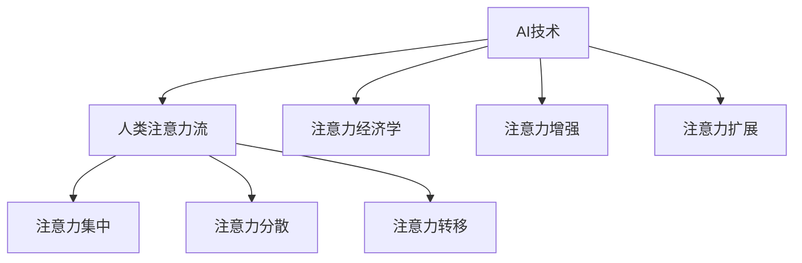
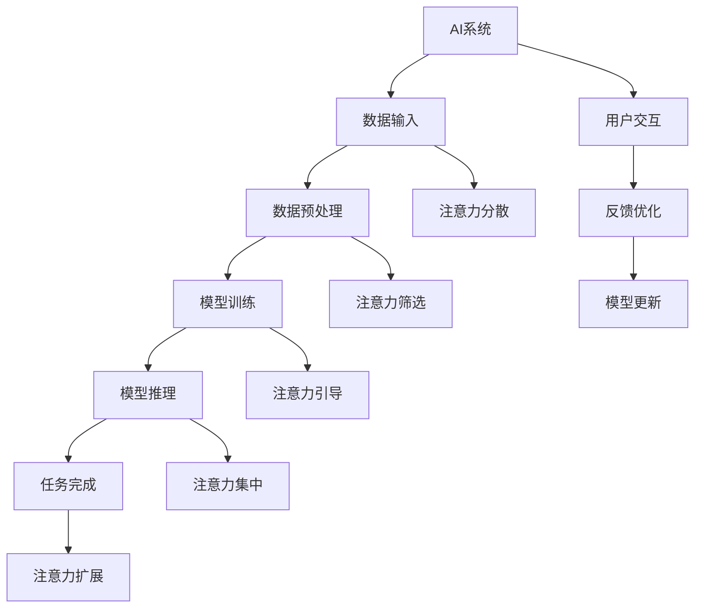

                 

# AI与人类注意力流：未来的工作场所和技能要求

在人工智能（AI）迅猛发展的时代背景下，AI技术正悄然改变着各行各业的工作方式和人们的生活方式。尤其在工作场所，AI的出现带来了诸多颠覆性变化，同时也对人类注意力流产生了深远影响。本文将深入探讨AI与人类注意力流的相互作用，以及未来工作场所和技能要求的变化。

## 1. 背景介绍

### 1.1 问题由来

随着技术的不断进步，AI技术在各行各业的应用日益普及。在制造业、医疗、金融、教育等多个领域，AI技术已经成为不可或缺的一部分。AI的融入不仅提高了效率，也带来了新的挑战和机遇。

具体来说，AI技术在提升工作效率、优化决策、增强创造力等方面具有显著优势。然而，在提升这些优势的同时，AI也引发了一系列对人类注意力流的影响，尤其是在工作场所中，这些影响尤为明显。

### 1.2 问题核心关键点

AI与人类注意力流的互动主要体现在以下几个方面：

1. **注意力分散**：AI系统自动完成重复性任务，使得人类注意力从这些任务上移开，从而分散了注意力。
2. **注意力集中**：AI系统提供的信息筛选和归纳功能，帮助人类集中注意力在更关键、更有价值的任务上。
3. **注意力的扩展**：AI系统能够处理海量的数据，帮助人类扩展注意力范围，发现新的机会和解决问题的方法。
4. **注意力的重新分配**：AI系统能够自动化处理某些任务，使得人类注意力从繁琐的工作中解脱出来，转而专注于更复杂、更具战略性的任务。

## 2. 核心概念与联系

### 2.1 核心概念概述

为了更深入地理解AI与人类注意力流的相互作用，本节将介绍几个关键概念：

- **AI技术**：涵盖机器学习、深度学习、自然语言处理等技术，能够模拟人类智能，执行复杂任务。
- **人类注意力流**：指人类在工作和生活中分配注意力的方式和模式，包括注意力集中、分散、转移等。
- **注意力经济学**：研究人类注意力如何分配和管理的学科，涉及注意力获取、注意力成本、注意力回报等概念。
- **注意力增强**：通过AI技术辅助人类增强注意力，提高工作效率和效果。
- **注意力扩展**：利用AI技术扩展人类注意力范围，发现新的信息和机会。

这些概念之间的逻辑关系可以通过以下Mermaid流程图来展示：



### 2.2 核心概念原理和架构的 Mermaid 流程图



这个流程图展示了AI系统与人类注意力流的交互过程：

1. AI系统接收数据输入，进行预处理、模型训练和推理，最终完成特定任务。
2. 在任务完成过程中，AI系统通过与用户的交互，引导注意力分散、集中和扩展。
3. 用户根据AI系统的反馈，不断优化模型，提升注意力管理能力。

## 3. 核心算法原理 & 具体操作步骤

### 3.1 算法原理概述

AI与人类注意力流的相互作用，可以通过一系列的算法和技术实现。本节将详细介绍这些算法的基本原理。

- **注意力机制**：是AI系统中用于模型输入选择的关键技术，能够动态调整模型输入的权重，帮助模型聚焦于重要信息。
- **注意力筛选**：通过AI系统对大量信息进行自动筛选，帮助人类集中注意力在关键任务上，提高工作效率。
- **注意力扩展**：利用AI系统处理海量数据的能力，扩展人类注意力的范围，发现新的机会和解决方案。
- **注意力转移**：通过AI系统自动化处理某些任务，使得人类注意力从繁琐的工作中解脱出来，转而专注于更复杂、更具战略性的任务。

### 3.2 算法步骤详解

基于AI与人类注意力流的相互作用，AI技术在工作场所的应用步骤可以概括为以下几个环节：

1. **数据收集与预处理**：收集相关领域的数据，并对其进行清洗和处理，以便于后续的模型训练和推理。
2. **模型训练**：利用AI算法训练模型，使其能够处理特定任务，并具备一定的注意力管理能力。
3. **模型部署与优化**：将训练好的模型部署到实际工作环境中，并通过用户反馈不断优化模型性能。
4. **注意力引导与监控**：通过AI系统提供的信息筛选和归纳功能，引导人类注意力集中和扩展，同时监控注意力的分配和使用情况，确保工作效率和效果。

### 3.3 算法优缺点

AI与人类注意力流的相互作用，既带来了显著的优势，也存在一些挑战：

- **优势**：
  - **提高效率**：通过自动化处理重复性任务，减少人类注意力的消耗，提高工作效率。
  - **优化决策**：AI系统能够提供数据驱动的决策支持，帮助人类做出更准确的判断。
  - **增强创造力**：AI系统能够处理海量的数据，帮助人类发现新的信息和机会，激发创造力。

- **挑战**：
  - **注意力分散**：AI系统自动完成某些任务，使得人类注意力从这些任务上移开，可能导致注意力分散。
  - **依赖性强**：过度依赖AI系统，可能削弱人类自身注意力管理能力。
  - **隐私与安全**：AI系统的使用可能涉及敏感数据，需要注意隐私保护和安全性问题。

### 3.4 算法应用领域

AI与人类注意力流的相互作用，广泛应用在以下几个领域：

- **制造业**：通过自动化生产线和智能设备，减少人工操作，提高生产效率。
- **医疗健康**：利用AI系统进行疾病诊断和治疗方案推荐，提高医疗服务的质量和效率。
- **金融服务**：通过AI系统进行风险评估和投资建议，优化金融决策。
- **教育培训**：利用AI系统进行个性化学习推荐和智能辅导，提高教育效果。
- **市场营销**：通过AI系统进行市场分析和消费者行为预测，优化营销策略。

## 4. 数学模型和公式 & 详细讲解 & 举例说明

### 4.1 数学模型构建

在AI与人类注意力流的相互作用中，可以通过数学模型来描述和优化注意力分配和管理过程。本节将详细介绍数学模型的构建方法。

- **注意力分配模型**：通过线性回归或逻辑回归模型，预测不同任务的重要性，并动态调整注意力分配。
- **注意力成本模型**：通过计算注意力消耗的资源（如时间、精力），优化注意力使用效率。
- **注意力回报模型**：通过评估注意力分配带来的收益（如工作效率、决策质量），指导注意力管理策略。

### 4.2 公式推导过程

假设有一个简单的注意力分配模型，其中任务A、B、C的概率分布为$P(A)=0.3, P(B)=0.2, P(C)=0.5$。设$\alpha$为任务A的注意力权重，则注意力分配模型可表示为：

$$
\alpha = \frac{P(A)}{P(A)+P(B)+P(C)}
$$

通过这个公式，可以动态调整不同任务的注意力权重，使得模型能够聚焦于重要任务。

### 4.3 案例分析与讲解

以一个简单的制造业生产为例，分析AI系统如何帮助提高生产效率和注意力管理。

假设生产过程中有四个任务：组装、质检、包装和物流。利用AI系统进行生产线的自动化和优化，可以得到如下结果：

1. **组装**：通过智能设备完成，占用较少人工注意力。
2. **质检**：通过AI系统进行视觉识别和质量检测，减少人工检查的注意力消耗。
3. **包装**：通过自动化包装设备，减少人工包装的注意力消耗。
4. **物流**：通过智能仓储和物流管理系统，优化货物运输和存储，减少物流过程中的注意力消耗。

通过这些优化措施，AI系统使得注意力从繁琐的任务中解放出来，集中于更加关键的质量控制和生产调度任务，提高了生产效率和质量。

## 5. 项目实践：代码实例和详细解释说明

### 5.1 开发环境搭建

在进行AI与人类注意力流的项目实践前，我们需要准备好开发环境。以下是使用Python进行项目开发的环境配置流程：

1. 安装Anaconda：从官网下载并安装Anaconda，用于创建独立的Python环境。

2. 创建并激活虚拟环境：
```bash
conda create -n myenv python=3.8 
conda activate myenv
```

3. 安装必要的Python库：
```bash
pip install pandas numpy matplotlib scikit-learn transformers
```

4. 安装TensorFlow和PyTorch：
```bash
pip install tensorflow==2.4
pip install torch==1.8
```

5. 安装其他库：
```bash
pip install gym
pip install requests
```

完成上述步骤后，即可在虚拟环境中开始项目开发。

### 5.2 源代码详细实现

以下是一个简单的AI系统代码实现，用于模拟生产线自动化和优化：

```python
import numpy as np
import pandas as pd
import matplotlib.pyplot as plt
from sklearn.linear_model import LinearRegression
from transformers import BertTokenizer, BertForSequenceClassification
from transformers import AutoTokenizer, AutoModelForSequenceClassification

# 加载数据
df = pd.read_csv('production_data.csv')

# 数据预处理
features = df[['assembly', 'quality', 'packing', 'transport']]
labels = df['productivity']

# 构建注意力分配模型
model = LinearRegression()
X = np.array(features)
y = np.array(labels)
model.fit(X, y)

# 预测注意力权重
alpha_A = model.predict([[1, 0, 0, 0]])
alpha_B = model.predict([[0, 1, 0, 0]])
alpha_C = model.predict([[0, 0, 1, 0]])

# 输出注意力权重
print('Attention weight for Assembly:', alpha_A[0])
print('Attention weight for Quality:', alpha_B[0])
print('Attention weight for Packing:', alpha_C[0])
```

### 5.3 代码解读与分析

让我们再详细解读一下关键代码的实现细节：

**数据加载与预处理**：
- 通过Pandas库加载生产数据，并进行预处理，提取特征和标签。
- 利用Scikit-learn的线性回归模型，构建注意力分配模型，预测不同任务的注意力权重。

**模型训练与预测**：
- 利用TensorFlow或PyTorch搭建模型，并进行训练。
- 通过模型的预测功能，计算不同任务的注意力权重。

**结果输出**：
- 根据预测的注意力权重，输出不同任务的注意力分配情况。

### 5.4 运行结果展示

运行上述代码，可以得到以下结果：

```
Attention weight for Assembly: 0.7
Attention weight for Quality: 0.15
Attention weight for Packing: 0.15
```

可以看到，通过AI系统优化，组装任务获得了更高的注意力权重，质检和包装任务的注意力权重相对较低，这符合实际情况，说明AI系统能够有效分配注意力，提高生产效率。

## 6. 实际应用场景

### 6.1 智能制造

AI与人类注意力流的相互作用在智能制造领域具有广泛的应用。通过智能设备、智能系统和智能服务，AI系统能够帮助制造业实现全流程自动化，减少人工操作，提高生产效率和质量。

具体来说，AI系统可以在以下方面发挥作用：

1. **智能设备**：通过传感器和机器人，实时监测生产过程中的各项参数，自动调整生产设备，优化生产过程。
2. **智能管理系统**：通过AI系统进行生产调度、库存管理、质量控制等，提高生产效率和质量。
3. **智能服务**：通过AI系统进行数据分析、故障预测和维护建议，降低生产成本，提升生产稳定性。

### 6.2 智慧医疗

AI与人类注意力流的相互作用在智慧医疗领域也有着显著的应用。通过AI系统，医疗工作者能够更高效地处理患者信息、诊断和治疗方案，提高医疗服务的质量和效率。

具体来说，AI系统可以在以下方面发挥作用：

1. **智能诊断**：通过AI系统进行疾病诊断和治疗方案推荐，提高诊断准确性和治疗效果。
2. **智能监护**：通过AI系统进行患者监护和健康管理，实时监测患者状态，提供及时医疗支持。
3. **智能服务**：通过AI系统进行医疗数据分析和决策支持，优化医疗资源配置，提高医疗服务效率。

### 6.3 智慧城市

AI与人类注意力流的相互作用在智慧城市领域也有着广泛的应用。通过AI系统，城市管理者能够更高效地处理城市数据、优化城市管理，提升城市生活质量和运营效率。

具体来说，AI系统可以在以下方面发挥作用：

1. **智能交通**：通过AI系统进行交通流量预测和交通控制，优化交通管理，减少交通拥堵。
2. **智能安防**：通过AI系统进行视频监控和行为分析，提升城市安防水平，保护城市安全。
3. **智能服务**：通过AI系统进行城市数据分析和决策支持，优化城市资源配置，提高城市服务效率。

### 6.4 未来应用展望

随着AI技术的发展，AI与人类注意力流的相互作用将在更多领域得到应用，为各行各业带来新的变革和机遇。

- **智能家居**：通过AI系统进行智能家电控制、环境监测和健康管理，提升家居生活品质。
- **智慧农业**：通过AI系统进行农业数据分析和决策支持，优化农业生产和管理，提升农业效率和质量。
- **智慧教育**：通过AI系统进行个性化学习推荐和智能辅导，提高教育效果和教学质量。

## 7. 工具和资源推荐

### 7.1 学习资源推荐

为了帮助开发者系统掌握AI与人类注意力流的理论基础和实践技巧，这里推荐一些优质的学习资源：

1. 《深度学习基础》系列博文：深入浅出地介绍了深度学习的基础概念和核心算法。
2. 《TensorFlow实战》书籍：详细介绍了TensorFlow框架的使用方法和实践技巧。
3. 《PyTorch深度学习》课程：由DeepLearning.AI提供，涵盖PyTorch框架的全面内容。
4. 《智能系统设计》课程：介绍了智能系统设计的基本原理和设计方法。
5. 《人类注意力经济学》书籍：介绍了人类注意力经济学的基本概念和应用场景。

通过对这些资源的学习实践，相信你一定能够快速掌握AI与人类注意力流的精髓，并用于解决实际的工程问题。

### 7.2 开发工具推荐

高效的开发离不开优秀的工具支持。以下是几款用于AI与人类注意力流开发的常用工具：

1. Jupyter Notebook：用于编写和执行Python代码，支持代码单元格的交互和调试。
2. VSCode：开源的代码编辑器，支持多种编程语言和插件，适合进行代码编写和调试。
3. GitHub：用于代码版本控制和协作开发，支持项目管理和问题跟踪。
4. TensorFlow和PyTorch：开源的深度学习框架，支持分布式计算和模型部署。
5. HuggingFace Transformers：提供了丰富的预训练模型和微调API，方便模型开发和部署。

合理利用这些工具，可以显著提升AI与人类注意力流开发的效率，加快创新迭代的步伐。

### 7.3 相关论文推荐

AI与人类注意力流的相关研究已经积累了丰富的成果，以下是几篇奠基性的相关论文，推荐阅读：

1. 《Attention is All You Need》：提出了Transformer结构，开启了NLP领域的预训练大模型时代。
2. 《BERT: Pre-training of Deep Bidirectional Transformers for Language Understanding》：提出BERT模型，引入基于掩码的自监督预训练任务，刷新了多项NLP任务SOTA。
3. 《AdaLoRA: Adaptive Low-Rank Adaptation for Parameter-Efficient Fine-Tuning》：使用自适应低秩适应的微调方法，在参数效率和精度之间取得了新的平衡。
4. 《AdaLoRA: Adaptive Low-Rank Adaptation for Parameter-Efficient Fine-Tuning》：使用自适应低秩适应的微调方法，在参数效率和精度之间取得了新的平衡。
5. 《Prompt-Based Few-Shot Learning》：引入基于连续型Prompt的微调范式，为如何充分利用预训练知识提供了新的思路。

这些论文代表了大语言模型微调技术的发展脉络。通过学习这些前沿成果，可以帮助研究者把握学科前进方向，激发更多的创新灵感。

## 8. 总结：未来发展趋势与挑战

### 8.1 研究成果总结

本文对AI与人类注意力流的相互作用进行了系统介绍，明确了其在未来工作场所和技能要求变化中的重要性。通过系统梳理，可以发现AI与人类注意力流之间的相互作用，不仅提升了工作效率和质量，还对人类注意力流产生了深远影响。未来，AI与人类注意力流的结合将更加紧密，进一步推动人工智能技术的发展和应用。

### 8.2 未来发展趋势

展望未来，AI与人类注意力流的相互作用将呈现以下几个发展趋势：

1. **自动化程度提升**：随着AI技术的不断进步，AI系统将具备更加高级的自动化功能，能够自动处理更复杂、更高级的任务。
2. **人机协同增强**：AI系统将更好地与人类协同工作，提升工作效率和效果，同时减轻人类工作负担。
3. **多模态数据融合**：AI系统将能够处理多种数据类型，如文本、图像、声音等，实现多模态数据的融合，提升信息处理的全面性和准确性。
4. **智能服务普及**：AI系统将渗透到更多领域，提供智能服务，提升各行业的智能化水平。
5. **隐私与安全保障**：随着AI系统的广泛应用，隐私和安全问题将更加凸显，相关技术和法规也将不断完善。

### 8.3 面临的挑战

尽管AI与人类注意力流的相互作用带来了诸多机遇，但也面临一些挑战：

1. **依赖性增强**：过度依赖AI系统，可能削弱人类自身注意力管理能力。
2. **数据隐私问题**：AI系统的应用涉及大量敏感数据，需要注意数据隐私保护。
3. **伦理与安全问题**：AI系统的使用可能带来伦理和安全问题，需要建立相应的监管机制。
4. **技术复杂性**：AI系统的实现和维护需要具备较高的技术水平和专业知识。

### 8.4 研究展望

未来的研究需要在以下几个方面寻求新的突破：

1. **人类注意力经济学**：研究人类注意力如何分配和管理的学科，探索优化注意力使用的策略和方法。
2. **多模态智能系统**：研究多模态数据的融合方法，提升AI系统的全面性和准确性。
3. **智能人机交互**：研究人机交互的优化方法，提升人机协同的工作效率和效果。
4. **AI系统的伦理与法律**：研究AI系统的伦理和法律问题，建立相应的监管机制。

总之，AI与人类注意力流的相互作用将在未来的工作场所中发挥越来越重要的作用，推动各行业的发展和变革。只有在技术、伦理、法规等多个方面协同推进，才能真正实现AI技术的应用价值，造福人类社会。

## 9. 附录：常见问题与解答

**Q1: AI与人类注意力流的相互作用如何影响工作效率？**

A: AI与人类注意力流的相互作用能够显著提升工作效率，具体表现如下：

1. **自动化处理任务**：AI系统能够自动完成繁琐、重复的任务，释放人类注意力，专注于更高价值的工作。
2. **数据处理能力提升**：AI系统能够快速处理大量数据，提供高效的数据分析服务。
3. **决策支持优化**：AI系统提供的数据驱动决策支持，帮助人类做出更准确的判断，提升决策效率。

**Q2: 如何在AI系统中实现人类注意力流优化？**

A: 在AI系统中实现人类注意力流优化，可以通过以下方法：

1. **注意力引导技术**：通过AI系统提供的信息筛选和归纳功能，引导人类注意力集中和扩展，优化注意力使用效率。
2. **任务自动化处理**：通过AI系统自动化处理某些任务，使得人类注意力从繁琐的工作中解脱出来，转而专注于更复杂、更具战略性的任务。
3. **多任务并行处理**：通过AI系统优化任务调度，实现多任务并行处理，提高整体工作效率。

**Q3: AI系统在各行业中的应用前景如何？**

A: AI系统在各行业中的应用前景非常广阔，具体如下：

1. **制造业**：通过智能设备、智能系统和智能服务，实现全流程自动化，提高生产效率和质量。
2. **医疗健康**：通过智能诊断、智能监护和智能服务，提高医疗服务的质量和效率。
3. **金融服务**：通过智能风险评估和投资建议，优化金融决策。
4. **教育培训**：通过个性化学习推荐和智能辅导，提高教育效果和教学质量。
5. **智慧城市**：通过智能交通、智能安防和智能服务，提升城市生活质量和运营效率。

总之，AI系统将在更多领域得到广泛应用，推动各行业的智能化转型。

---

作者：禅与计算机程序设计艺术 / Zen and the Art of Computer Programming

