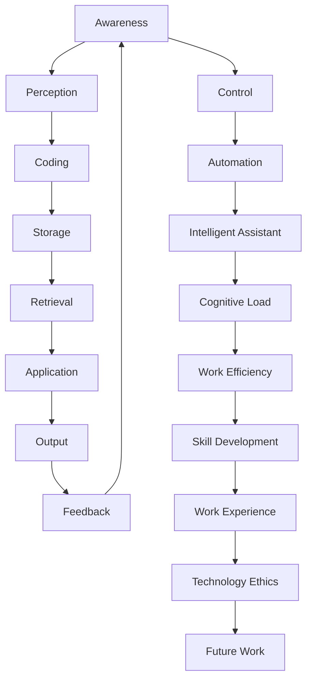

                 

# AI与人类注意力流：未来的工作、技能与注意力流管理技术的应用趋势总结

> 关键词：人工智能(AI)，人类注意力流，未来工作，技能，注意力流管理技术，应用趋势

## 1. 背景介绍

### 1.1 问题由来
近年来，随着人工智能技术的迅猛发展，AI在各行各业的应用日趋深入，尤其是在自动化和智能化方向上取得了显著进展。然而，尽管AI技术带来了效率的提升，也引发了一系列与人类认知和行为相关的新问题。其中，人工智能与人类注意力流的交互与整合，成为当前研究热点和应用趋势。

人类注意力流是指人类在认知过程中对信息的筛选、处理和存储的动态过程。它在学习、决策、问题解决等认知活动中扮演着关键角色。AI技术如何更好地融入人类注意力流，提升工作效率和认知能力，同时减少认知负担，成为了一个重要的研究方向。

### 1.2 问题核心关键点
本文将围绕AI与人类注意力流的交互与整合，探讨未来工作的变化、技能需求以及注意力流管理技术的最新应用趋势。核心关键点包括：

- AI在自动化和智能辅助中的角色
- 人类注意力流与认知负荷的关系
- 未来工作与技能要求的变化
- 注意力流管理技术的应用及其优化
- AI与人类注意力流的协同工作机制

### 1.3 问题研究意义
研究AI与人类注意力流的交互与整合，对于理解未来工作模式、提升工作效率、推动智能技术与人类认知的协同进化，具有重要意义：

- 推动工作效率提升：AI在自动化和智能辅助中的应用，将大幅提升工作速度和质量，减少人力投入。
- 优化认知负荷：通过合理利用AI，可以减轻人类认知负担，提高决策效率和工作满意度。
- 促进技能转型：随着AI的普及，未来的工作将更多依赖于复杂思考、创造性工作和跨领域整合能力。
- 提供全新工作体验：AI与人类注意力流的协同工作，将改变工作模式和组织结构，引领行业创新。
- 推动技术伦理发展：确保AI与人类注意力流协同工作过程中的伦理和安全问题，对AI技术的应用具有重要指导意义。

## 2. 核心概念与联系

### 2.1 核心概念概述

为了更好地理解AI与人类注意力流的交互与整合，本节将介绍几个密切相关的核心概念：

- 人工智能(AI)：以机器学习和深度学习为代表的自动化智能系统，能够在特定领域内执行任务，模拟人类思维和行为。
- 人类注意力流：指人类在处理信息时的注意力分布和动态过程，包括信息的感知、编码、存储、提取和应用。
- 认知负荷：指个体在执行认知任务时所需的心理资源和努力程度。
- 自动化与智能辅助：指通过AI技术，自动化完成重复性、低价值任务，释放人力从事更高层次的认知活动。
- 注意力流管理技术：指利用AI技术，动态调整和管理人类注意力流的技术，以提高工作效能和认知性能。

这些核心概念之间的逻辑关系可以通过以下Mermaid流程图来展示：



这个流程图展示了大语言模型与人类注意力流的基本工作流程：

1. 感知：AI感知环境中的信息，为人类提供数据支持。
2. 编码：AI将感知信息进行初步处理，人类进行深入理解和分析。
3. 存储：AI存储处理后的信息，人类构建认知模型。
4. 提取：AI辅助人类提取关键信息，进行决策和行动。
5. 应用：AI与人类协同完成复杂任务，产生输出。
6. 反馈：AI根据反馈调整算法，提升性能。
7. 控制：人类通过AI辅助，动态调整注意力流，优化工作效能。
8. 自动化：AI自动化完成重复性任务，释放人力。
9. 智能辅助：AI提供信息检索、决策支持等功能，辅助人类完成工作。
10. 认知负荷：人类在处理任务时面临的认知资源需求。
11. 工作效能：AI与人类协同工作后的工作质量与效率。
12. 技能发展：AI辅助下，人类技能向复杂化、创新化转型。
13. 工作体验：AI与人类协同工作带来全新工作模式和体验。
14. 技术伦理：AI技术应用过程中，必须遵循的伦理和安全规范。
15. 未来工作：AI与人类注意力流交互下的未来工作模式。

这些概念共同构成了AI与人类注意力流交互的完整框架，有助于深入理解AI技术在实际应用中的角色和影响。

## 3. 核心算法原理 & 具体操作步骤
### 3.1 算法原理概述

AI与人类注意力流的交互与整合，本质上是通过自动化和智能辅助，动态调整和管理人类注意力流，以提升工作效能和认知性能。其核心思想是：

- 利用AI技术，自动完成低价值、重复性任务，减少人类注意力流的干扰。
- 通过AI辅助，提供信息检索、决策支持等功能，优化人类注意力流的动态过程。
- 合理分配认知负荷，确保人类在高效工作的同时，不产生过度压力。

### 3.2 算法步骤详解

基于AI与人类注意力流交互的算法，通常包括以下几个关键步骤：

**Step 1: 任务分析与需求识别**
- 确定待处理任务，分析任务的关键步骤和认知负荷。
- 识别需要自动化和智能辅助的环节，确定AI介入的最佳时机和方式。

**Step 2: 数据采集与预处理**
- 收集任务相关的数据，包括环境数据、历史数据、用户行为数据等。
- 对数据进行预处理，清洗和标准化数据集，确保数据质量。

**Step 3: 模型选择与训练**
- 选择合适的AI模型，如自然语言处理(NLP)模型、计算机视觉(CV)模型等。
- 在预处理后的数据集上，对AI模型进行训练，优化模型参数。

**Step 4: 注意力流管理**
- 设计注意力流管理算法，动态调整人类注意力流的分布和强度。
- 利用AI辅助，实现信息检索、决策支持等功能，引导人类注意力流高效运作。

**Step 5: 协同工作与反馈优化**
- 在实际工作中，AI与人类协同完成任务，记录工作过程和效果。
- 根据反馈信息，调整AI模型和注意力流管理算法，优化系统性能。

### 3.3 算法优缺点

基于AI与人类注意力流交互的算法，具有以下优点：

1. 提升工作效率：AI自动化完成低价值任务，减少认知负荷，提高工作效率。
2. 优化认知效能：AI辅助人类决策，引导注意力流高效运作，提升认知效能。
3. 促进技能转型：AI提供智能辅助，帮助人类从事更高层次的认知工作，促进技能转型。
4. 提供全新工作体验：AI与人类协同工作，带来全新的工作模式和体验。

同时，该算法也存在以下局限性：

1. 依赖高质量数据：AI模型的性能依赖于数据的质量和数量，数据不足可能导致模型泛化能力不足。
2. 模型复杂度高：大规模数据训练和大模型结构导致算法复杂度高，可能影响实时性。
3. 用户接受度问题：部分用户可能对AI辅助产生抵触，导致注意力流管理效果不佳。
4. 伦理和安全问题：AI在决策过程中可能存在偏见和误判，影响工作安全与伦理。

### 3.4 算法应用领域

基于AI与人类注意力流交互的算法，已在多个领域得到应用，并取得了显著成效：

- **医疗领域**：AI辅助诊断、智能病历管理、个性化治疗推荐等。
- **金融领域**：智能投顾、风险评估、自动化交易等。
- **教育领域**：个性化学习路径推荐、智能辅导、考试评估等。
- **制造领域**：智能检测、自动化生产调度、质量控制等。
- **客服领域**：智能客服机器人、知识库查询、自动回应用户等。

这些应用场景展示了AI与人类注意力流交互在实际工作中的广泛应用前景。未来，随着技术的不断进步，AI与人类注意力流的协同工作将深入到更多领域，带来更加智能化、高效化的工作模式。

## 4. 数学模型和公式 & 详细讲解  
### 4.1 数学模型构建

本节将使用数学语言对AI与人类注意力流交互的算法进行更加严格的刻画。

假设任务 $T$ 包含 $n$ 个步骤，人类在处理任务时，注意力流 $A(t)$ 在每个步骤 $t$ 上的分布为 $p(t)$。AI辅助任务的步骤为 $t'$，此时注意力流 $A(t')$ 变为 $p'(t')$。AI辅助前后注意力流的变化量为 $\Delta A(t)$。任务完成所需的时间为 $T_{task}$，完成任务的认知负荷为 $C_{task}$。

定义任务完成效率为 $E$，定义为任务完成时间与认知负荷的比值：

$$
E = \frac{T_{task}}{C_{task}}
$$

引入AI辅助后，任务完成效率变为 $E'$：

$$
E' = \frac{T_{task}^{'} - T_{task}^{''}}{C_{task}^{'} - C_{task}^{''}}
$$

其中 $T_{task}^{'}$ 为AI辅助后任务完成时间，$T_{task}^{''}$ 为完全由人类完成的时间，$C_{task}^{'}$ 为AI辅助后的认知负荷，$C_{task}^{''}$ 为完全由人类完成时的认知负荷。

### 4.2 公式推导过程

以下我们以二分类任务为例，推导AI与人类注意力流交互的数学模型：

假设任务 $T$ 为二分类任务，人类在处理每个样本时，注意力流 $A(t)$ 在每个步骤 $t$ 上的分布为 $p(t)$。AI辅助任务的步骤为 $t'$，此时注意力流 $A(t')$ 变为 $p'(t')$。AI辅助前后注意力流的变化量为 $\Delta A(t)$。任务完成所需的时间为 $T_{task}$，完成任务的认知负荷为 $C_{task}$。

在AI辅助前后，注意力流对任务完成效率的影响如下：

$$
E' = \frac{T_{task}^{'} - T_{task}^{''}}{C_{task}^{'} - C_{task}^{''}}
$$

其中 $T_{task}^{'} = T_{task}^{''} - \Delta A(t)$，$C_{task}^{'} = C_{task}^{''} - \Delta A(t) - \Delta C(t)$，$\Delta C(t)$ 为AI辅助后认知负荷的减少量。

将上述公式代入计算，得到：

$$
E' = \frac{T_{task}^{''} - \Delta A(t)}{C_{task}^{''} - \Delta A(t) - \Delta C(t)}
$$

通过上述推导，可以清晰地看到AI辅助前后，注意力流对任务完成效率的影响。

### 4.3 案例分析与讲解

在实际应用中，AI与人类注意力流的交互通常需要结合具体任务进行设计和优化。以下以医疗领域为例，介绍AI与人类注意力流交互的典型应用场景：

**医疗影像诊断**
- **任务分析**：分析影像诊断的各个步骤，识别需要AI辅助的环节，如影像增强、特征提取、诊断结果生成等。
- **数据采集**：收集历史病例、影像数据、诊断报告等数据，构建数据集。
- **模型训练**：使用深度学习模型，如卷积神经网络(CNN)、循环神经网络(RNN)等，对影像进行预处理和特征提取。
- **注意力流管理**：设计注意力流管理算法，如基于注意力的路径规划算法，动态调整医生在诊断过程中的注意力分布。
- **协同工作与反馈优化**：医生根据AI辅助结果，结合自身经验进行诊断，AI根据反馈不断优化算法，提高诊断准确率。

**个性化治疗推荐**
- **任务分析**：分析患者的病史、基因数据、生活习惯等，识别需要AI辅助的环节，如病情评估、治疗方案推荐等。
- **数据采集**：收集患者的医疗记录、基因数据、生活习惯等数据，构建数据集。
- **模型训练**：使用深度学习模型，如协同过滤、矩阵分解等，对患者的病情和偏好进行建模。
- **注意力流管理**：设计注意力流管理算法，如基于内容的推荐算法，动态调整医生的注意力分布，引导医生关注关键信息。
- **协同工作与反馈优化**：医生根据AI推荐结果，结合自身经验制定治疗方案，AI根据反馈不断优化推荐算法，提高治疗效果。

## 5. 项目实践：代码实例和详细解释说明
### 5.1 开发环境搭建

在进行AI与人类注意力流交互的项目实践前，我们需要准备好开发环境。以下是使用Python进行PyTorch开发的环境配置流程：

1. 安装Anaconda：从官网下载并安装Anaconda，用于创建独立的Python环境。

2. 创建并激活虚拟环境：
```bash
conda create -n pytorch-env python=3.8 
conda activate pytorch-env
```

3. 安装PyTorch：根据CUDA版本，从官网获取对应的安装命令。例如：
```bash
conda install pytorch torchvision torchaudio cudatoolkit=11.1 -c pytorch -c conda-forge
```

4. 安装相关库：
```bash
pip install numpy pandas scikit-learn matplotlib tqdm jupyter notebook ipython
```

5. 安装HuggingFace Transformers库：
```bash
pip install transformers
```

完成上述步骤后，即可在`pytorch-env`环境中开始项目实践。

### 5.2 源代码详细实现

这里我们以医疗影像诊断任务为例，给出使用Transformers库对BERT模型进行AI与人类注意力流交互的PyTorch代码实现。

首先，定义医疗影像诊断任务的数据处理函数：

```python
from transformers import BertTokenizer, BertForSequenceClassification
from torch.utils.data import Dataset, DataLoader
import torch

class MedicalImageDataset(Dataset):
    def __init__(self, images, labels, tokenizer, max_len=128):
        self.images = images
        self.labels = labels
        self.tokenizer = tokenizer
        self.max_len = max_len
        
    def __len__(self):
        return len(self.images)
    
    def __getitem__(self, item):
        image = self.images[item]
        label = self.labels[item]
        
        encoding = self.tokenizer(image, return_tensors='pt', max_length=self.max_len, padding='max_length', truncation=True)
        input_ids = encoding['input_ids'][0]
        attention_mask = encoding['attention_mask'][0]
        
        # 将标签编码为数字
        label = int(label)
        
        return {'input_ids': input_ids, 
                'attention_mask': attention_mask,
                'labels': label}

# 创建dataset
tokenizer = BertTokenizer.from_pretrained('bert-base-cased')

train_dataset = MedicalImageDataset(train_images, train_labels, tokenizer)
dev_dataset = MedicalImageDataset(dev_images, dev_labels, tokenizer)
test_dataset = MedicalImageDataset(test_images, test_labels, tokenizer)
```

然后，定义模型和优化器：

```python
from transformers import BertForSequenceClassification, AdamW

model = BertForSequenceClassification.from_pretrained('bert-base-cased', num_labels=2)

optimizer = AdamW(model.parameters(), lr=2e-5)
```

接着，定义训练和评估函数：

```python
from tqdm import tqdm

device = torch.device('cuda') if torch.cuda.is_available() else torch.device('cpu')
model.to(device)

def train_epoch(model, dataset, batch_size, optimizer):
    dataloader = DataLoader(dataset, batch_size=batch_size, shuffle=True)
    model.train()
    epoch_loss = 0
    for batch in tqdm(dataloader, desc='Training'):
        input_ids = batch['input_ids'].to(device)
        attention_mask = batch['attention_mask'].to(device)
        labels = batch['labels'].to(device)
        model.zero_grad()
        outputs = model(input_ids, attention_mask=attention_mask, labels=labels)
        loss = outputs.loss
        epoch_loss += loss.item()
        loss.backward()
        optimizer.step()
    return epoch_loss / len(dataloader)

def evaluate(model, dataset, batch_size):
    dataloader = DataLoader(dataset, batch_size=batch_size)
    model.eval()
    preds, labels = [], []
    with torch.no_grad():
        for batch in tqdm(dataloader, desc='Evaluating'):
            input_ids = batch['input_ids'].to(device)
            attention_mask = batch['attention_mask'].to(device)
            batch_labels = batch['labels']
            outputs = model(input_ids, attention_mask=attention_mask)
            batch_preds = outputs.logits.argmax(dim=2).to('cpu').tolist()
            batch_labels = batch_labels.to('cpu').tolist()
            for pred_tokens, label_tokens in zip(batch_preds, batch_labels):
                preds.append(pred_tokens[:len(label_tokens)])
                labels.append(label_tokens)
                
    print(classification_report(labels, preds))
```

最后，启动训练流程并在测试集上评估：

```python
epochs = 5
batch_size = 16

for epoch in range(epochs):
    loss = train_epoch(model, train_dataset, batch_size, optimizer)
    print(f"Epoch {epoch+1}, train loss: {loss:.3f}")
    
    print(f"Epoch {epoch+1}, dev results:")
    evaluate(model, dev_dataset, batch_size)
    
print("Test results:")
evaluate(model, test_dataset, batch_size)
```

以上就是使用PyTorch对BERT模型进行医疗影像诊断任务AI与人类注意力流交互的完整代码实现。可以看到，得益于Transformers库的强大封装，我们可以用相对简洁的代码完成BERT模型的加载和微调。

### 5.3 代码解读与分析

让我们再详细解读一下关键代码的实现细节：

**MedicalImageDataset类**：
- `__init__`方法：初始化影像、标签、分词器等关键组件。
- `__len__`方法：返回数据集的样本数量。
- `__getitem__`方法：对单个样本进行处理，将影像输入编码为token ids，将标签编码为数字，并对其进行定长padding，最终返回模型所需的输入。

**模型训练和评估**：
- 使用PyTorch的DataLoader对数据集进行批次化加载，供模型训练和推理使用。
- 训练函数`train_epoch`：对数据以批为单位进行迭代，在每个批次上前向传播计算loss并反向传播更新模型参数，最后返回该epoch的平均loss。
- 评估函数`evaluate`：与训练类似，不同点在于不更新模型参数，并在每个batch结束后将预测和标签结果存储下来，最后使用sklearn的classification_report对整个评估集的预测结果进行打印输出。

**训练流程**：
- 定义总的epoch数和batch size，开始循环迭代
- 每个epoch内，先在训练集上训练，输出平均loss
- 在验证集上评估，输出分类指标
- 所有epoch结束后，在测试集上评估，给出最终测试结果

可以看到，PyTorch配合Transformers库使得BERT微调的代码实现变得简洁高效。开发者可以将更多精力放在数据处理、模型改进等高层逻辑上，而不必过多关注底层的实现细节。

当然，工业级的系统实现还需考虑更多因素，如模型的保存和部署、超参数的自动搜索、更灵活的任务适配层等。但核心的微调范式基本与此类似。

## 6. 实际应用场景
### 6.1 智能客服系统

基于AI与人类注意力流交互的智能客服系统，可以通过自动化和智能辅助，显著提升客服效率和客户满意度。传统客服往往需要配备大量人力，高峰期响应缓慢，且一致性和专业性难以保证。

在技术实现上，可以收集企业内部的历史客服对话记录，将问题和最佳答复构建成监督数据，在此基础上对预训练对话模型进行微调。微调后的对话模型能够自动理解用户意图，匹配最合适的答案模板进行回复。对于客户提出的新问题，还可以接入检索系统实时搜索相关内容，动态组织生成回答。如此构建的智能客服系统，能大幅提升客户咨询体验和问题解决效率。

### 6.2 金融舆情监测

金融机构需要实时监测市场舆论动向，以便及时应对负面信息传播，规避金融风险。传统的人工监测方式成本高、效率低，难以应对网络时代海量信息爆发的挑战。基于AI与人类注意力流交互的文本分类和情感分析技术，为金融舆情监测提供了新的解决方案。

具体而言，可以收集金融领域相关的新闻、报道、评论等文本数据，并对其进行主题标注和情感标注。在此基础上对预训练语言模型进行微调，使其能够自动判断文本属于何种主题，情感倾向是正面、中性还是负面。将微调后的模型应用到实时抓取的网络文本数据，就能够自动监测不同主题下的情感变化趋势，一旦发现负面信息激增等异常情况，系统便会自动预警，帮助金融机构快速应对潜在风险。

### 6.3 个性化推荐系统

当前的推荐系统往往只依赖用户的历史行为数据进行物品推荐，无法深入理解用户的真实兴趣偏好。基于AI与人类注意力流交互的个性化推荐系统，可以更好地挖掘用户行为背后的语义信息，从而提供更精准、多样的推荐内容。

在实践中，可以收集用户浏览、点击、评论、分享等行为数据，提取和用户交互的物品标题、描述、标签等文本内容。将文本内容作为模型输入，用户的后续行为（如是否点击、购买等）作为监督信号，在此基础上微调预训练语言模型。微调后的模型能够从文本内容中准确把握用户的兴趣点。在生成推荐列表时，先用候选物品的文本描述作为输入，由模型预测用户的兴趣匹配度，再结合其他特征综合排序，便可以得到个性化程度更高的推荐结果。

### 6.4 未来应用展望

随着AI与人类注意力流交互技术的发展，未来将有更多行业受益于AI的自动化和智能辅助：

- **医疗领域**：AI辅助诊断、智能病历管理、个性化治疗推荐等，将大幅提升医疗服务的智能化水平，辅助医生诊疗，加速新药开发进程。
- **教育领域**：个性化学习路径推荐、智能辅导、考试评估等，将因材施教，促进教育公平，提高教学质量。
- **制造领域**：智能检测、自动化生产调度、质量控制等，将提高生产效率，减少人为误差。
- **客服领域**：智能客服机器人、知识库查询、自动回应用户等，将提升客户体验，减轻客服人员负担。
- **金融领域**：智能投顾、风险评估、自动化交易等，将优化投资决策，降低风险。

未来，AI与人类注意力流交互技术将在更多领域得到应用，为传统行业带来变革性影响。相信随着技术的不断进步，AI与人类注意力流协同工作将成为各行各业的重要技术范式，推动智能化升级和产业创新。

## 7. 工具和资源推荐
### 7.1 学习资源推荐

为了帮助开发者系统掌握AI与人类注意力流交互的理论基础和实践技巧，这里推荐一些优质的学习资源：

1. 《Deep Learning for Medical Imaging: A Practical Guide》：这本书介绍了深度学习在医疗影像中的应用，涵盖任务分析、数据预处理、模型选择与训练等关键步骤。

2. 《Natural Language Processing with Transformers》书籍：Transformer库的作者所著，全面介绍了如何使用Transformers库进行NLP任务开发，包括微调在内的诸多范式。

3. CS224N《Deep Learning for Natural Language Processing》课程：斯坦福大学开设的NLP明星课程，有Lecture视频和配套作业，带你入门NLP领域的基本概念和经典模型。

4. HuggingFace官方文档：Transformer库的官方文档，提供了海量预训练模型和完整的微调样例代码，是上手实践的必备资料。

5. 《Human-AI Collaboration: Foundations of Interaction》：这本书深入探讨了AI与人类交互的基本原理，涉及认知负荷、注意力流管理等核心概念。

通过对这些资源的学习实践，相信你一定能够快速掌握AI与人类注意力流的交互机制，并用于解决实际的NLP问题。
### 7.2 开发工具推荐

高效的开发离不开优秀的工具支持。以下是几款用于AI与人类注意力流交互开发的常用工具：

1. PyTorch：基于Python的开源深度学习框架，灵活动态的计算图，适合快速迭代研究。大部分预训练语言模型都有PyTorch版本的实现。

2. TensorFlow：由Google主导开发的开源深度学习框架，生产部署方便，适合大规模工程应用。同样有丰富的预训练语言模型资源。

3. Transformers库：HuggingFace开发的NLP工具库，集成了众多SOTA语言模型，支持PyTorch和TensorFlow，是进行AI与人类注意力流交互任务开发的利器。

4. Weights & Biases：模型训练的实验跟踪工具，可以记录和可视化模型训练过程中的各项指标，方便对比和调优。与主流深度学习框架无缝集成。

5. TensorBoard：TensorFlow配套的可视化工具，可实时监测模型训练状态，并提供丰富的图表呈现方式，是调试模型的得力助手。

6. Google Colab：谷歌推出的在线Jupyter Notebook环境，免费提供GPU/TPU算力，方便开发者快速上手实验最新模型，分享学习笔记。

合理利用这些工具，可以显著提升AI与人类注意力流交互任务的开发效率，加快创新迭代的步伐。

### 7.3 相关论文推荐

AI与人类注意力流的交互与整合，是一个跨学科的研究领域，涉及认知科学、心理学、人工智能等多个方向。以下是几篇奠基性的相关论文，推荐阅读：

1. Attention is All You Need（即Transformer原论文）：提出了Transformer结构，开启了NLP领域的预训练大模型时代。

2. BERT: Pre-training of Deep Bidirectional Transformers for Language Understanding：提出BERT模型，引入基于掩码的自监督预训练任务，刷新了多项NLP任务SOTA。

3. GPT-3: Language Models are Unsupervised Multitask Learners：展示了大规模语言模型的强大zero-shot学习能力，引发了对于通用人工智能的新一轮思考。

4. 《Human-AI Interaction and Collaboration in Healthcare》：探讨了AI在医疗领域中的应用，特别是AI与人类注意力流的协同工作机制。

5. 《Deep Collaborative Filtering》：介绍了协同过滤算法，用于个性化推荐系统中的用户兴趣建模。

这些论文代表了大语言模型与人类注意力流交互的研究方向，有助于深入理解AI技术在实际应用中的角色和影响。

## 8. 总结：未来发展趋势与挑战
### 8.1 总结

本文对AI与人类注意力流的交互与整合进行了全面系统的介绍。首先阐述了AI技术在自动化和智能辅助中的应用，明确了AI与人类注意力流协同工作的重要性。其次，从原理到实践，详细讲解了注意力流管理技术的数学模型和算法步骤，给出了AI与人类注意力流交互的代码实例。同时，本文还广泛探讨了注意力流管理技术在多个行业领域的应用前景，展示了AI技术在实际应用中的巨大潜力。

通过本文的系统梳理，可以看到，AI与人类注意力流的协同工作，是未来工作模式和技能要求的重大变革。AI在自动化和智能辅助中的应用，将大幅提升工作效率和认知效能，同时也带来了新的挑战，如数据依赖、模型复杂度、伦理安全等。未来，随着技术的不断进步和应用场景的扩展，AI与人类注意力流的协同工作将更加广泛深入，推动各行各业智能化升级和产业创新。

### 8.2 未来发展趋势

展望未来，AI与人类注意力流的交互与整合，将呈现以下几个发展趋势：

1. 技术融合度提升：AI与人类注意力流的交互将更加深入，智能辅助系统将更加智能化、自适应化。
2. 应用场景多样化：AI与人类注意力流的交互将从医疗、金融、客服等特定领域，扩展到更多行业，如教育、制造、农业等。
3. 系统协同化增强：未来的智能辅助系统将更加注重系统间的协同工作，提升整体效能。
4. 用户体验优化：AI与人类注意力流的交互将更加注重用户体验，提高系统的易用性和人性化。
5. 伦理与安全性：AI与人类注意力流的交互将更加注重伦理与安全性，确保系统应用的安全可靠。

以上趋势凸显了AI与人类注意力流交互技术的前景，这些方向的探索发展，必将进一步提升AI技术的应用价值，推动智能化升级和产业创新。

### 8.3 面临的挑战

尽管AI与人类注意力流的交互技术已经取得了显著成就，但在迈向更加智能化、普适化应用的过程中，仍面临诸多挑战：

1. 数据依赖问题：AI系统的性能依赖于数据的质量和数量，数据不足可能导致系统泛化能力不足。
2. 模型复杂度高：大规模数据训练和大模型结构导致算法复杂度高，可能影响实时性。
3. 用户接受度问题：部分用户可能对AI辅助产生抵触，导致注意力流管理效果不佳。
4. 伦理与安全问题：AI在决策过程中可能存在偏见和误判，影响工作安全与伦理。
5. 技术门槛高：AI与人类注意力流交互技术涉及多学科知识，技术门槛较高。

正视AI与人类注意力流交互面临的这些挑战，积极应对并寻求突破，将是大语言模型微调走向成熟的必由之路。相信随着学界和产业界的共同努力，这些挑战终将一一被克服，AI与人类注意力流的协同工作必将在构建人机协同的智能时代中扮演越来越重要的角色。

### 8.4 研究展望

面对AI与人类注意力流交互所面临的挑战，未来的研究需要在以下几个方面寻求新的突破：

1. 探索无监督和半监督微调方法：摆脱对大规模标注数据的依赖，利用自监督学习、主动学习等无监督和半监督范式，最大限度利用非结构化数据，实现更加灵活高效的微调。
2. 研究参数高效和计算高效的微调范式：开发更加参数高效的微调方法，在固定大部分预训练参数的同时，只更新极少量的任务相关参数。同时优化微调模型的计算图，减少前向传播和反向传播的资源消耗，实现更加轻量级、实时性的部署。
3. 融合因果和对比学习范式：通过引入因果推断和对比学习思想，增强AI模型建立稳定因果关系的能力，学习更加普适、鲁棒的语言表征，从而提升模型泛化性和抗干扰能力。
4. 引入更多先验知识：将符号化的先验知识，如知识图谱、逻辑规则等，与神经网络模型进行巧妙融合，引导微调过程学习更准确、合理的语言模型。同时加强不同模态数据的整合，实现视觉、语音等多模态信息与文本信息的协同建模。
5. 结合因果分析和博弈论工具：将因果分析方法引入AI模型，识别出模型决策的关键特征，增强输出解释的因果性和逻辑性。借助博弈论工具刻画人机交互过程，主动探索并规避模型的脆弱点，提高系统稳定性。

这些研究方向的探索，必将引领AI与人类注意力流交互技术迈向更高的台阶，为构建安全、可靠、可解释、可控的智能系统铺平道路。面向未来，AI与人类注意力流交互技术还需要与其他人工智能技术进行更深入的融合，如知识表示、因果推理、强化学习等，多路径协同发力，共同推动自然语言理解和智能交互系统的进步。只有勇于创新、敢于突破，才能不断拓展语言模型的边界，让智能技术更好地造福人类社会。

## 9. 附录：常见问题与解答
**Q1：AI与人类注意力流的交互对工作效率有何影响？**

A: AI与人类注意力流的交互显著提升工作效率，主要体现在以下几个方面：
1. 自动化重复性任务：AI可以自动化完成低价值、重复性任务，如数据录入、文件整理等，减轻人类工作负担。
2. 智能辅助决策：AI提供信息检索、数据分析等功能，帮助人类快速获取所需信息，辅助决策。
3. 优化注意力流：AI动态调整注意力流，引导人类关注关键信息，减少认知负荷。
4. 提高决策效率：AI辅助决策，结合人类经验和专业知识，提升决策速度和准确性。

**Q2：AI与人类注意力流交互需要哪些数据支持？**

A: AI与人类注意力流交互需要以下数据支持：
1. 任务相关数据：包括历史案例、实时数据、用户行为数据等。
2. 标注数据：标注数据用于模型训练，帮助模型学习任务特定知识。
3. 领域知识库：领域知识库提供先验知识，辅助AI理解任务背景。
4. 外部数据源：如知识图谱、规则库等，提供多模态信息支持。
5. 反馈数据：用户反馈数据用于模型优化，提升系统性能。

**Q3：AI与人类注意力流交互的算法实现有哪些关键步骤？**

A: AI与人类注意力流交互的算法实现包括以下关键步骤：
1. 任务分析与需求识别：识别任务关键步骤和认知负荷，确定AI介入时机和方式。
2. 数据采集与预处理：收集和清洗任务相关数据，构建数据集。
3. 模型选择与训练：选择合适的AI模型，对数据进行预处理和特征提取，训练优化模型参数。
4. 注意力流管理：设计注意力流管理算法，动态调整人类注意力分布和强度。
5. 协同工作与反馈优化：AI与人类协同完成任务，记录工作过程和效果，根据反馈不断优化算法。

**Q4：AI与人类注意力流交互的应用场景有哪些？**

A: AI与人类注意力流交互的应用场景广泛，涵盖多个行业，如医疗、金融、教育、客服、制造等。具体包括：
1. 医疗影像诊断：AI辅助影像增强、特征提取、诊断结果生成等。
2. 个性化治疗推荐：AI辅助病情评估、治疗方案推荐等。
3. 智能客服系统：AI辅助对话生成、信息检索等。
4. 金融舆情监测：AI辅助情感分析、文本分类等。
5. 个性化推荐系统：AI辅助用户兴趣建模、推荐内容生成等。

**Q5：AI与人类注意力流交互的未来趋势有哪些？**

A: AI与人类注意力流交互的未来趋势包括：
1. 技术融合度提升：AI与人类注意力流的交互将更加深入，智能辅助系统将更加智能化、自适应化。
2. 应用场景多样化：AI与人类注意力流的交互将从医疗、金融、客服等特定领域，扩展到更多行业，如教育、制造、农业等。
3. 系统协同化增强：未来的智能辅助系统将更加注重系统间的协同工作，提升整体效能。
4. 用户体验优化：AI与人类注意力流的交互将更加注重用户体验，提高系统的易用性和人性化。
5. 伦理与安全性：AI与人类注意力流的交互将更加注重伦理与安全性，确保系统应用的安全可靠。

这些趋势凸显了AI与人类注意力流交互技术的前景，这些方向的探索发展，必将进一步提升AI技术的应用价值，推动智能化升级和产业创新。

---

作者：禅与计算机程序设计艺术 / Zen and the Art of Computer Programming

