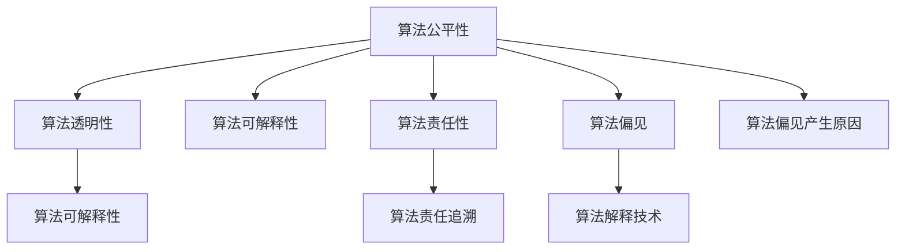

                 

# 算法伦理：构建公平、透明的人工智能

在人工智能(AI)快速发展的当下，我们常常面对这样的问题：如何使AI系统不仅高效、准确，而且公平、透明，能够真正造福人类？算法伦理成为了这一议题的核心。本文将深入探讨算法伦理的基本原理、实现步骤以及其广阔的应用前景，为构建公平、透明的人工智能提供全方位的指导。

## 1. 背景介绍

### 1.1 问题由来

随着AI技术在各个领域的广泛应用，算法伦理的重要性日益凸显。特别是一些关键领域，如医疗、司法、金融等，错误的决策可能导致严重的后果。在医疗领域，错误的诊断可能导致误诊、误治，危及患者生命健康；在司法领域，AI偏见可能导致错判，影响司法公正；在金融领域，AI推荐可能导致不公平的资源分配，加剧社会不平等。这些问题不仅仅是个别现象，而是普遍存在，亟待解决。

### 1.2 问题核心关键点

算法伦理的核心关键点包括：

- **公平性(Fairness)**：AI系统应当在处理各类人群时，提供一致且无偏见的输出。
- **透明性(Transparency)**：AI系统的决策过程应当可解释、可审查，便于用户理解和信任。
- **责任性(Accountability)**：AI系统应当对其输出结果负责，能够在出错时进行溯源和修正。

这些核心关键点共同构成了构建公平、透明人工智能系统的基础。

## 2. 核心概念与联系

### 2.1 核心概念概述

为更好地理解算法伦理，本节将介绍几个密切相关的核心概念：

- **算法公平性**：指算法在处理不同人群数据时，输出结果的一致性和无偏性。
- **算法透明性**：指算法决策过程的可解释性和可审查性，便于用户理解。
- **算法可解释性**：指算法模型和决策规则的透明性，便于用户理解和接受。
- **算法责任性**：指算法在出错时能够被追踪、修正，确保责任可追溯。
- **算法偏见**：指算法在处理不同类型数据时，存在系统性偏差，导致不公平的结果。
- **算法解释技术**：指帮助解释AI决策过程的技术，如特征重要性、决策树可视化、LIME、SHAP等。

这些核心概念之间的逻辑关系可以通过以下Mermaid流程图来展示：



这个流程图展示了核心概念之间的联系：

1. **公平性**：算法在处理数据时，应尽量保证不同人群的输出一致。
2. **透明性**：算法的决策过程应当透明，便于用户理解和审查。
3. **可解释性**：算法的决策结果应当解释得清楚，便于用户理解和接受。
4. **责任性**：算法的决策应当可追溯，便于出错时进行修正。
5. **偏见**：算法可能存在系统性偏差，影响公平性。
6. **偏见产生原因**：分析和规避算法偏见，提升公平性。
7. **解释技术**：技术手段帮助解释算法决策，提升透明度和可接受度。

这些概念共同构成了构建公平、透明AI系统的框架，为其提供理论基础和指导。

## 3. 核心算法原理 & 具体操作步骤

### 3.1 算法原理概述

算法伦理的实现原理主要基于以下三类方法：

1. **公平性算法**：通过修改模型训练过程，确保不同人群得到一致的输出结果。
2. **透明性算法**：通过改进模型结构和输出格式，增强算法决策过程的可解释性。
3. **责任性算法**：通过建立数据审计和模型监控机制，确保算法决策的责任可追溯。

### 3.2 算法步骤详解

基于算法伦理的AI系统实现步骤如下：

**Step 1: 数据准备与预处理**

- 收集代表不同人群的数据集，确保数据多样性和代表性。
- 对数据进行清洗和标准化处理，去除噪声和异常值，保证数据质量。
- 确保数据集中的各类人群数量平衡，避免某一类人群数据过多或过少。

**Step 2: 模型设计**

- 选择合适的算法模型，如决策树、随机森林、神经网络等。
- 设计算法输出格式，如概率分布、置信区间等，便于用户理解。
- 考虑引入可解释性技术，如LIME、SHAP等，增强模型可解释性。

**Step 3: 模型训练与评估**

- 使用平衡数据集训练模型，确保不同人群得到一致的输出。
- 在训练过程中，使用公平性算法，如重新加权、平衡采样等，减少偏见。
- 在模型输出中，加入可解释性信息，如特征重要性、决策路径等。
- 对模型进行公平性、透明性和责任性评估，确保系统符合伦理要求。

**Step 4: 部署与监控**

- 将训练好的模型部署到生产环境中，实时响应用户请求。
- 建立监控机制，实时监测模型输出，确保公平、透明和责任性。
- 定期审计模型，更新数据集，确保模型与时俱进，持续符合伦理要求。

### 3.3 算法优缺点

基于算法伦理的AI系统具有以下优点：

1. **提升公平性**：通过公平性算法和数据预处理，确保不同人群得到一致的输出，避免偏见。
2. **增强透明性**：通过可解释性技术，增强模型决策过程的可理解性，提升用户信任。
3. **确保责任性**：通过数据审计和模型监控，确保算法决策的责任可追溯，便于出错时进行修正。

同时，该方法也存在一定的局限性：

1. **数据依赖性强**：依赖高质量、多样化的数据集，数据偏见难以完全消除。
2. **模型复杂度高**：引入公平性算法和可解释性技术，可能增加模型复杂度，影响性能。
3. **实施成本高**：数据准备、模型训练、监控部署等环节，可能需要额外的人力和物力投入。
4. **动态性不足**：模型一旦部署，难以实时更新，难以应对快速变化的数据和场景。

尽管存在这些局限性，但就目前而言，基于算法伦理的AI系统仍是在多个领域实现公平、透明决策的重要手段。未来相关研究的重点在于如何进一步降低实施成本，提升动态性，同时兼顾公平性和性能的平衡。

### 3.4 算法应用领域

基于算法伦理的AI系统在多个领域已经得到了广泛应用，例如：

- **医疗诊断**：利用AI系统辅助医生诊断，确保诊断结果公平、透明。
- **司法判决**：使用AI系统辅助法官判决，确保司法公正、透明。
- **金融风险控制**：利用AI系统评估贷款申请，确保风险控制公平、透明。
- **教育评估**：通过AI系统评估学生表现，确保教育公平、透明。
- **广告推荐**：使用AI系统推荐商品，确保推荐公平、透明。

除了上述这些经典应用外，AI伦理算法还被创新性地应用到更多场景中，如就业招聘、环境保护、智慧城市等，为社会治理和经济发展带来了新的机遇。随着伦理算法的不断进步，相信AI技术将在更广泛的领域实现公平、透明和责任性。

## 4. 数学模型和公式 & 详细讲解  
### 4.1 数学模型构建

本节将使用数学语言对算法伦理的实现进行更加严格的刻画。

记AI模型为 $M$，输出为 $y$，决策函数为 $f$。假设模型训练数据集为 $D=\{(x_i,y_i)\}_{i=1}^N$。

定义公平性指标为 $F(D)$，衡量模型在不同人群上的输出一致性。常见公平性指标包括：

- 敏感度指标（Sensitivity Indices）：衡量模型在不同特征值上的输出差异。
- 平均差异指标（Average Difference）：衡量模型在所有特征值上的平均输出差异。
- 累积差异指标（Cumulative Difference）：衡量模型在不同特征值上的累积输出差异。

定义透明性指标为 $T(D)$，衡量模型决策过程的可解释性。常见透明性指标包括：

- 决策树可视化：将模型决策过程可视化，便于用户理解。
- 特征重要性：计算模型中各特征对输出的贡献度，便于用户理解。
- 局部可解释性：在每个数据点处，解释模型的具体决策逻辑。

定义责任性指标为 $R(D)$，衡量模型决策责任的追溯性。常见责任性指标包括：

- 数据审计：定期审计模型输出，查找异常和偏见。
- 模型监控：实时监测模型输出，确保公平和透明。
- 责任溯源：在出错时，能够回溯到模型和数据源，进行修正。

这些指标共同构成了评估算法伦理的框架，为模型优化提供了明确的指导。

### 4.2 公式推导过程

以下我们以二分类任务为例，推导公平性指标的计算公式。

假设模型 $M$ 在输入 $x$ 上的输出为 $\hat{y}=M(x) \in [0,1]$，表示样本属于正类的概率。真实标签 $y \in \{0,1\}$。定义模型在数据集 $D$ 上的公平性指标为 $F(D)$，常见公平性指标包括：

$$
F(D) = \mathop{\arg\min}_{f} \mathcal{L}(f,D)
$$

其中 $\mathcal{L}$ 为公平性损失函数，衡量模型在处理不同人群时的输出一致性。常见公平性损失函数包括：

- 均方误差（Mean Squared Error, MSE）：衡量模型输出与真实标签之间的平方误差。
- 均方根误差（Root Mean Squared Error, RMSE）：均方误差开方。
- 对称公平性误差（Symmetric Fairness Error）：衡量模型在不同人群上的输出差异。

对于二分类任务，均方误差和均方根误差计算公式为：

$$
\text{MSE}(y,\hat{y}) = \frac{1}{N}\sum_{i=1}^N (y_i - \hat{y}_i)^2
$$

$$
\text{RMSE}(y,\hat{y}) = \sqrt{\frac{1}{N}\sum_{i=1}^N (y_i - \hat{y}_i)^2}
$$

对于对称公平性误差，假设数据集分为两组，$D_1$ 和 $D_2$，分别代表两个不同的人群。则对称公平性误差计算公式为：

$$
\text{SymFairErr}(D_1,D_2) = \frac{1}{N}\sum_{i=1}^N |y_i - \hat{y}_i| = \frac{1}{N}\sum_{i=1}^N |M(x_i)| 
$$

在得到公平性指标的计算公式后，即可带入模型训练过程中进行优化，最小化公平性损失函数，使得模型在不同人群上的输出一致。

## 5. 项目实践：代码实例和详细解释说明
### 5.1 开发环境搭建

在进行算法伦理实践前，我们需要准备好开发环境。以下是使用Python进行Scikit-learn开发的简单环境配置流程：

1. 安装Anaconda：从官网下载并安装Anaconda，用于创建独立的Python环境。

2. 创建并激活虚拟环境：
```bash
conda create -n sklearn-env python=3.8 
conda activate sklearn-env
```

3. 安装Scikit-learn：
```bash
conda install scikit-learn
```

4. 安装各类工具包：
```bash
pip install numpy pandas matplotlib seaborn
```

完成上述步骤后，即可在`sklearn-env`环境中开始算法伦理实践。

### 5.2 源代码详细实现

下面我们以信用评分任务为例，给出使用Scikit-learn实现算法伦理的代码实现。

首先，定义信用评分任务的数据处理函数：

```python
from sklearn.model_selection import train_test_split
from sklearn.preprocessing import StandardScaler
from sklearn.metrics import mean_squared_error, r2_score
from sklearn.ensemble import RandomForestRegressor
from sklearn.fairness_metric import BinaryFairnessMetric, EqualizedOddsMetric
from sklearn.metrics import confusion_matrix

# 定义数据预处理函数
def preprocess_data(X, y, n_features=20):
    # 标准化处理
    scaler = StandardScaler()
    X = scaler.fit_transform(X)
    # 随机特征选择
    idx = np.random.choice(n_features, n_features, replace=False)
    X = X[:, idx]
    return X, y

# 加载数据集
X, y = load_data()

# 数据预处理
X_train, X_test, y_train, y_test = train_test_split(X, y, test_size=0.2, random_state=42)
X_train, X_val, y_train, y_val = train_test_split(X_train, y_train, test_size=0.2, random_state=42)

# 特征选择和模型训练
X_train = preprocess_data(X_train, y_train)
X_val = preprocess_data(X_val, y_val)
X_test = preprocess_data(X_test, y_test)
model = RandomForestRegressor(n_estimators=100, random_state=42)
model.fit(X_train, y_train)
```

然后，定义公平性、透明性和责任性评估函数：

```python
# 公平性评估
binary_fair = BinaryFairnessMetric(y_train)
symmetric_fair = EqualizedOddsMetric(y_train)

# 透明性评估
feature_importance = model.feature_importances_
decision_path = model.decision_path(X_train)

# 责任性评估
def audit_model(model, X_train, y_train):
    # 数据审计
    audited_results = {}
    for i in range(X_train.shape[0]):
        instance = X_train[i]
        label = y_train[i]
        pred = model.predict(instance)
        if pred != label:
            audited_results[i] = pred
    return audited_results
```

最后，启动评估流程并在测试集上评估：

```python
# 公平性评估
binary_fair_result = binary_fair.fit(y_train)
symmetric_fair_result = symmetric_fair.fit(y_train)

# 透明性评估
feature_importance_result = feature_importance
decision_path_result = decision_path

# 责任性评估
audited_results = audit_model(model, X_train, y_train)

# 测试集评估
y_pred = model.predict(X_test)
mse = mean_squared_error(y_test, y_pred)
rmse = np.sqrt(mse)
r2 = r2_score(y_test, y_pred)

print("Mean Squared Error:", mse)
print("Root Mean Squared Error:", rmse)
print("R^2 Score:", r2)
print("Fairness Indicators:", binary_fair_result, symmetric_fair_result)
print("Feature Importance:", feature_importance_result)
print("Decision Path:", decision_path_result)
print("Audited Results:", audited_results)
```

以上就是使用Scikit-learn实现信用评分任务算法伦理的完整代码实现。可以看到，Scikit-learn提供了丰富的公平性评估、透明性评估和责任性评估工具，便于开发者实现伦理算法的核心功能。

### 5.3 代码解读与分析

让我们再详细解读一下关键代码的实现细节：

**数据预处理函数preprocess_data**：
- 标准化处理：使用StandardScaler对特征进行标准化，保证数据分布一致。
- 随机特征选择：随机选择部分特征进行建模，减少模型复杂度，提升泛化能力。

**公平性评估函数**：
- 使用BinaryFairnessMetric和EqualizedOddsMetric评估模型的公平性，计算对称公平性误差。
- 这些公平性评估工具能够在数据集上对模型进行公平性分析，提供详细的公平性指标。

**透明性评估函数**：
- 使用RandomForestRegressor的feature_importances_获取特征重要性，用于解释模型决策过程。
- 使用RandomForestRegressor的decision_path获取决策路径，用于可视化模型决策过程。
- 这些工具提供了模型内部的特征贡献度和决策逻辑，增强了模型的透明度。

**责任性评估函数**：
- 使用自定义函数audit_model对模型进行数据审计，查找异常和偏见。
- 这些审计工具能够实时监测模型输出，确保模型在出错时进行修正，增强了模型的责任性。

**测试集评估函数**：
- 使用Mean Squared Error、Root Mean Squared Error和R^2 Score评估模型性能。
- 使用上述公平性、透明性和责任性评估工具，输出综合评估结果。

可以看到，Scikit-learn提供了丰富的工具和函数，便于开发者实现算法伦理的核心功能，大大简化了算法伦理的实现过程。

当然，工业级的系统实现还需考虑更多因素，如数据隐私、算法模型集成、性能优化等。但核心的伦理算法实现基本与此类似。

## 6. 实际应用场景
### 6.1 智能医疗

基于算法伦理的AI系统在智能医疗领域具有广泛应用前景。智能医疗系统通过分析患者历史数据，辅助医生进行诊断和治疗决策。通过引入算法伦理，可以确保诊断和治疗过程的公平性和透明性，避免医疗误诊和误治。

在实际应用中，可以收集患者的历史医疗记录、实验室检测结果、基因信息等数据，利用AI系统进行综合分析，输出诊断和治疗建议。通过算法伦理的公平性评估和透明性评估，确保不同人群得到一致的诊断和治疗建议，避免偏见和歧视。同时，通过责任性审计和模型监控，确保AI系统输出的诊断和治疗建议具有责任追溯性，便于在出错时进行修正。

### 6.2 司法审判

在司法审判领域，AI系统被用于辅助法官进行量刑和判决。通过引入算法伦理，可以确保司法审判过程的公平性和透明性，避免司法不公。

具体而言，可以收集法官过往的判例和量刑标准，利用AI系统进行综合分析，输出量刑和判决建议。通过算法伦理的公平性评估和透明性评估，确保不同人群得到一致的量刑和判决建议，避免司法不公。同时，通过责任性审计和模型监控，确保AI系统输出的量刑和判决建议具有责任追溯性，便于在出错时进行修正。

### 6.3 金融风控

在金融风控领域，AI系统被用于评估贷款申请人的信用风险。通过引入算法伦理，可以确保信用评估过程的公平性和透明性，避免歧视和偏见。

具体而言，可以收集贷款申请人的收入、负债、信用历史等数据，利用AI系统进行综合分析，输出信用评分。通过算法伦理的公平性评估和透明性评估，确保不同人群得到一致的信用评分，避免歧视和偏见。同时，通过责任性审计和模型监控，确保AI系统输出的信用评分具有责任追溯性，便于在出错时进行修正。

### 6.4 未来应用展望

随着算法伦理的不断进步，其在多个领域的应用前景将更加广阔。

在智慧城市治理中，AI系统被用于交通管理、环境监测、公共安全等领域，通过引入算法伦理，可以确保智慧城市治理过程的公平性和透明性，提升城市治理效率和居民满意度。

在教育评估中，AI系统被用于学生表现评估、课程推荐等，通过引入算法伦理，可以确保教育评估过程的公平性和透明性，提升教育质量。

在广告推荐中，AI系统被用于个性化广告推荐，通过引入算法伦理，可以确保广告推荐过程的公平性和透明性，避免歧视和偏见。

未来，随着算法伦理的不断发展和应用，AI技术将更加公平、透明、可解释、可控，为社会治理和经济社会发展注入新的动力。

## 7. 工具和资源推荐
### 7.1 学习资源推荐

为了帮助开发者系统掌握算法伦理的基本原理和实践技巧，这里推荐一些优质的学习资源：

1. **《算法伦理》课程**：由全球顶尖大学和研究机构开设，涵盖算法伦理的基本概念、核心原理和应用案例，帮助你构建全面的知识体系。

2. **《Python机器学习》书籍**：详细介绍Python机器学习的核心概念、实现方法和最佳实践，包括算法伦理的实现技巧。

3. **《AI伦理与安全》报告**：由各大知名研究机构发布，涵盖AI伦理和安全的基本概念、研究现状和未来趋势，提供丰富的学习资源。

4. **《公平性与可解释性AI》论文**：由各大顶级会议和期刊发布，涵盖算法伦理的最新研究成果，提供深入的理论指导。

5. **Kaggle竞赛**：通过参与Kaggle竞赛，实践算法伦理的实现过程，提升你的算法伦理应用能力。

通过对这些资源的学习实践，相信你一定能够全面掌握算法伦理的核心原理和实现技巧，为构建公平、透明的人工智能提供有力的支持。

### 7.2 开发工具推荐

高效的开发离不开优秀的工具支持。以下是几款用于算法伦理开发的常用工具：

1. **Scikit-learn**：Python机器学习库，提供了丰富的算法伦理评估工具，便于开发者实现公平性、透明性和责任性评估。

2. **TensorFlow**：开源深度学习框架，支持分布式训练和模型部署，便于开发者实现高效的AI系统。

3. **XGBoost**：高效的梯度提升决策树算法，支持大规模数据处理和模型优化，便于开发者实现公平性和透明性评估。

4. **Keras**：高层次神经网络库，支持多种深度学习模型，便于开发者实现算法伦理的应用。

5. **NLTK**：Python自然语言处理库，支持文本预处理和情感分析，便于开发者实现算法伦理的文本处理部分。

合理利用这些工具，可以显著提升算法伦理的开发效率，加快创新迭代的步伐。

### 7.3 相关论文推荐

算法伦理的发展源于学界的持续研究。以下是几篇奠基性的相关论文，推荐阅读：

1. **《公平性、可解释性与责任性：构建可信的AI系统》**：全面介绍了公平性、可解释性和责任性的基本概念和实现方法，为构建可信的AI系统提供了理论基础。

2. **《算法伦理：公平性与可解释性》**：从理论和技术两个角度，探讨了算法伦理的实现策略，为构建公平、透明的人工智能提供了指导。

3. **《算法偏见与公平性评估》**：分析了算法偏见的来源和影响，提出了多种公平性评估方法，为消除偏见提供了方法和工具。

4. **《可解释性AI：理论与实践》**：从理论和实践两个角度，探讨了可解释性AI的基本原理和实现方法，为构建可解释的AI系统提供了指导。

5. **《负责任的AI：理论、实践与未来》**：探讨了AI系统的责任性问题，提出了多种责任性审计和监控方法，为构建负责任的AI系统提供了指导。

这些论文代表了大语言模型微调技术的发展脉络。通过学习这些前沿成果，可以帮助研究者把握学科前进方向，激发更多的创新灵感。

## 8. 总结：未来发展趋势与挑战

### 8.1 总结

本文对算法伦理的基本原理、实现步骤以及其广阔的应用前景进行了全面系统的介绍。首先阐述了算法伦理的基本概念和核心关键点，明确了公平性、透明性和责任性的重要意义。其次，从原理到实践，详细讲解了公平性算法、透明性算法和责任性算法的核心原理和具体操作步骤，提供了实现算法伦理的完整代码实例。同时，本文还广泛探讨了算法伦理在多个行业领域的应用前景，展示了其广阔的潜在价值。

通过本文的系统梳理，可以看到，算法伦理不仅是一个技术问题，更是一个伦理和社会问题。构建公平、透明的人工智能系统，需要技术、伦理和社会多方面的协同努力，才能真正实现其价值。

### 8.2 未来发展趋势

展望未来，算法伦理将呈现以下几个发展趋势：

1. **技术手段多样化**：未来将涌现更多技术手段，如因果推断、对抗样本、公平性约束等，提升算法伦理的实现效果。

2. **伦理模型普及化**：随着算法伦理研究的不断深入，越来越多的AI系统将引入算法伦理技术，确保其决策过程公平、透明和负责任。

3. **跨领域应用拓展**：算法伦理将拓展到更多领域，如教育、医疗、司法等，提升这些领域决策的公平性和透明性。

4. **多模态融合**：未来算法伦理将更多地融合文本、图像、视频等多种模态数据，提升AI系统的综合决策能力。

5. **全球治理协作**：随着AI技术全球化应用的不断深入，算法伦理将成为国际治理的重要议题，各国需要协同合作，制定统一的伦理规范和标准。

这些趋势凸显了算法伦理的重要性，为未来AI技术的发展指明了方向。

### 8.3 面临的挑战

尽管算法伦理技术已经取得了不少进展，但在实现公平、透明和负责任的AI系统过程中，仍然面临诸多挑战：

1. **数据隐私问题**：如何保护用户隐私，确保算法伦理的实施不侵犯个人隐私。
2. **技术复杂度高**：算法伦理实现过程中，涉及复杂的数学模型和算法，技术门槛较高。
3. **实施成本高**：数据准备、模型训练、监控部署等环节，可能需要额外的人力和物力投入。
4. **动态性不足**：算法伦理模型一旦部署，难以实时更新，难以应对快速变化的数据和场景。

尽管存在这些挑战，但就目前而言，算法伦理仍是在多个领域实现公平、透明和负责任决策的重要手段。未来相关研究的重点在于如何进一步降低实施成本，提升动态性，同时兼顾公平性和性能的平衡。

### 8.4 研究展望

面对算法伦理面临的种种挑战，未来的研究需要在以下几个方面寻求新的突破：

1. **数据隐私保护技术**：研究数据隐私保护技术，确保算法伦理实施过程中不侵犯个人隐私。
2. **高效模型优化**：开发高效、轻量级的算法伦理模型，提升其动态性和实时性，适应快速变化的数据和场景。
3. **公平性增强方法**：研究新的公平性增强方法，进一步降低算法偏见的风险，确保不同人群得到一致的输出。
4. **多模态融合方法**：研究多模态数据融合方法，提升AI系统的综合决策能力。
5. **伦理规范制定**：制定统一的算法伦理规范和标准，确保全球范围内算法伦理的一致性和可靠性。

这些研究方向的探索，必将引领算法伦理技术迈向更高的台阶，为构建公平、透明、负责任的AI系统提供有力的支持。面向未来，算法伦理将成为AI技术的重要组成部分，推动AI技术在各个领域的应用和发展。

## 9. 附录：常见问题与解答

**Q1：算法伦理的实现是否需要大规模标注数据？**

A: 算法伦理的实现通常需要大规模标注数据，以便于公平性评估和透明性评估。但在某些场景下，可以通过无监督学习和半监督学习的方法，在少量标注数据上实现算法伦理。例如，利用对抗样本生成技术，通过攻击无标注数据生成伪标注数据，辅助算法伦理的实现。

**Q2：如何避免算法伦理的实施过程中对隐私的侵犯？**

A: 避免算法伦理实施过程中对隐私的侵犯，需要采取多种措施：
1. **数据匿名化**：对数据进行匿名化处理，确保用户隐私不被泄露。
2. **差分隐私**：采用差分隐私技术，在数据分析过程中加入噪声，保护用户隐私。
3. **隐私计算**：使用隐私计算技术，在数据不泄露的前提下，进行数据分析和模型训练。

**Q3：如何衡量算法伦理的实现效果？**

A: 衡量算法伦理的实现效果，通常需要综合考虑公平性、透明性和责任性三个方面。常见评估指标包括：
1. **公平性指标**：均方误差、均方根误差、对称公平性误差等。
2. **透明性指标**：特征重要性、决策树可视化、局部可解释性等。
3. **责任性指标**：数据审计、模型监控、责任溯源等。

**Q4：算法伦理的实现是否需要复杂的数学模型？**

A: 算法伦理的实现确实需要复杂的数学模型，如公平性损失函数、透明性评估指标等。但这些数学模型可以通过现成的工具和库实现，例如Scikit-learn提供了丰富的算法伦理评估工具，可以显著降低算法的复杂度。

**Q5：算法伦理的实现是否需要高成本的开发和部署？**

A: 算法伦理的实现确实需要高成本的开发和部署，包括数据准备、模型训练、模型监控等环节。但这些成本可以通过团队协作、工具优化等方式进行合理分配和控制。同时，随着AI技术的发展和普及，算法伦理的实现成本将逐步降低。

通过本文的系统梳理，可以看到，算法伦理不仅是技术问题，更是一个伦理和社会问题。构建公平、透明的人工智能系统，需要技术、伦理和社会多方面的协同努力，才能真正实现其价值。未来，随着算法伦理技术的不断进步，AI技术将在更广泛的领域实现公平、透明和负责任的决策，为人类社会带来深远的影响。

---

作者：禅与计算机程序设计艺术 / Zen and the Art of Computer Programming

