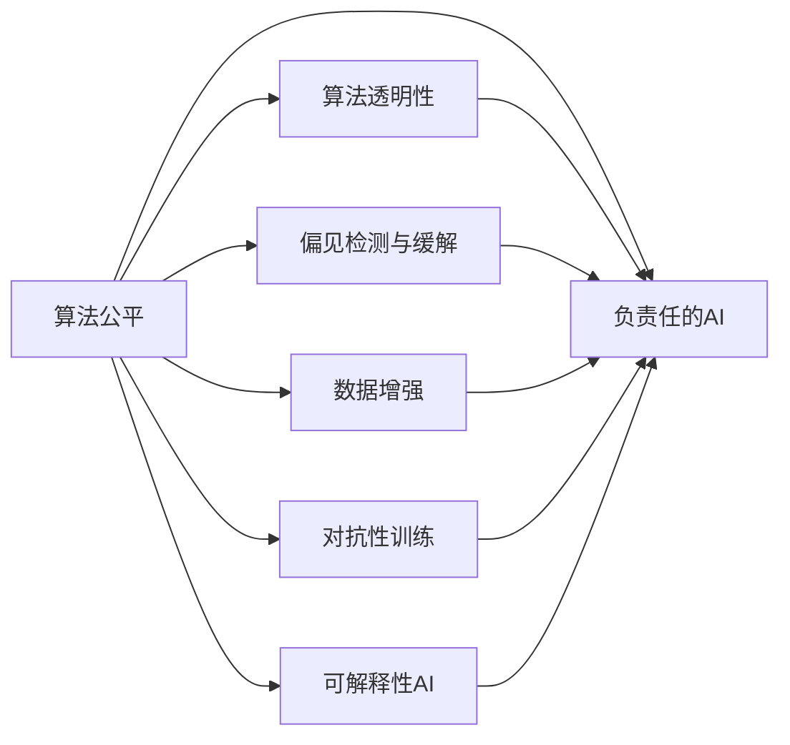

                 

# 算法公平：构建负责任的人工智能

> 关键词：算法公平, 负责任的AI, 算法透明性, 偏见检测与缓解, 数据增强, 对抗性训练, 可解释性AI

## 1. 背景介绍

### 1.1 问题由来

在人工智能(AI)技术迅猛发展的背景下，越来越多的AI系统被应用于社会生活的各个方面，从医疗诊断到金融风控，从智能客服到内容推荐，AI已经成为了不可分割的一部分。然而，尽管AI在技术层面取得了显著进展，但其应用过程中出现的一系列公平性和透明性问题，依然引起了广泛关注和热议。

例如，2020年一项针对亚马逊AI招聘系统的研究表明，尽管模型的招聘结果在某些指标上优于人工，但模型在性别、种族等方面的偏见表现得非常明显，导致对女性和少数族裔的排斥。又如，一些银行和保险公司使用AI进行信用评估和风险控制，导致部分群体因数据偏差而受到不公正对待，增加了社会不平等。这些问题揭示了现有AI系统在公平性、透明性和负责任性方面存在诸多不足，亟需引起重视和改进。

### 1.2 问题核心关键点

为更好地理解AI系统的公平性问题，本节将介绍几个核心概念，并阐述它们之间的联系：

- **算法公平(Algorithmic Fairness)**：指的是AI模型在预测结果上不因种族、性别、年龄、收入等敏感属性而产生歧视性偏见。
- **负责任的AI(Responsible AI)**：强调AI系统的伦理和社会责任，要求模型在决策过程中公正、透明、可解释，并符合法律和伦理规范。
- **算法透明性(Algorithmic Transparency)**：指的是AI模型应能被解释、被理解，其内部决策机制应能通过可理解的规则和步骤来呈现。
- **偏见检测与缓解(Bias Detection and Mitigation)**：指对模型中的潜在偏见进行检测，并采取相应措施缓解或消除其影响。
- **数据增强(Data Augmentation)**：指通过增加训练样本多样性，提升模型泛化能力，减少模型对训练数据的依赖。
- **对抗性训练(Adversarial Training)**：指通过引入对抗样本，提高模型对输入数据的鲁棒性，防止模型对特定输入类型产生偏见。
- **可解释性AI(Explainable AI)**：强调AI系统的输出应能被解释，其决策过程应能被理解和验证，以提高用户信任。

这些核心概念共同构成了当前AI系统公平性和负责任性的基本框架，为改善现有AI系统的公平性和透明性提供了理论基础和方法指导。

## 2. 核心概念与联系

### 2.1 核心概念概述

为更好地理解AI系统的公平性和透明性问题，本节将介绍几个密切相关的核心概念，并给出其原理和架构的Mermaid流程图。



这个流程图展示了算法公平与负责任AI之间的关系，以及相关核心概念之间的联系：

1. **算法公平**：是负责任AI的核心要求之一，旨在消除模型输出中的歧视性偏见。
2. **算法透明性**：有助于理解模型决策过程，从而进行公平性和偏见检测。
3. **偏见检测与缓解**：是实现算法公平的重要步骤，通过检测和纠正模型中的偏见，提升模型公正性。
4. **数据增强**：通过增加训练数据多样性，提升模型泛化能力，减少数据偏差。
5. **对抗性训练**：通过引入对抗样本，提升模型鲁棒性，防止模型产生偏见。
6. **可解释性AI**：提高模型决策过程的透明度，增强用户信任。

这些概念共同作用，使得AI系统在公平性和负责任性方面不断提升，更好地服务于社会。

## 3. 核心算法原理 & 具体操作步骤
### 3.1 算法原理概述

算法公平和负责任AI的核心在于确保AI模型在决策过程中不因敏感属性而产生歧视性偏见。其基本原理可以概括为以下三点：

1. **统计公平**：要求模型在各类群体上的预测结果具有相同的期望值，即不因群体而产生系统性偏差。
2. **机会公平**：要求模型在各类群体上的机会是均等的，即各类群体在模型中被利用的机会相同。
3. **个体公平**：要求模型对每个个体的预测结果与其真实情况相匹配，即模型的预测结果不因个体敏感属性而改变。

基于这些原理，研究人员提出了多种算法，用于检测和缓解模型中的偏见，提升模型的公平性和透明性。

### 3.2 算法步骤详解

基于统计公平和机会公平的算法步骤大致如下：

1. **数据预处理**：对原始数据进行清洗和预处理，去除噪声和异常值。
2. **特征选择**：选择合适的特征，以提升模型预测能力，同时减少对敏感属性的依赖。
3. **模型训练**：选择合适的机器学习模型，并进行训练，优化模型参数。
4. **偏见检测**：通过统计分析或模型检测技术，发现模型中的偏见。
5. **偏见缓解**：采取数据重采样、算法调整等措施，缓解或消除模型中的偏见。
6. **模型评估**：在公平性指标上评估模型性能，确保模型公平性和透明性。

以机会公平为例，其操作步骤包括：

1. **数据分解**：将数据按照敏感属性进行分组，以便进行公平性分析。
2. **公平性评估**：计算各类群体在模型中的机会，评估模型是否在各群体之间提供均等机会。
3. **公平性优化**：调整模型参数，以提升在各类群体中的机会公平性。

### 3.3 算法优缺点

算法公平和负责任AI在提升AI系统公平性和透明性方面具有显著优势，但也存在一些局限性：

**优点**：
1. **提升公平性**：通过检测和缓解偏见，提升模型公正性，减少社会不平等。
2. **增强透明度**：通过可解释性AI技术，提高模型透明度，增加用户信任。
3. **降低风险**：通过数据增强和对抗性训练，提升模型鲁棒性，降低误判风险。

**缺点**：
1. **复杂度高**：公平性和透明性分析需要大量计算资源，且不同领域的应用场景可能存在差异。
2. **数据依赖**：模型的公平性和透明性高度依赖于训练数据的质量和多样性。
3. **技术复杂**：需要综合运用多种技术手段，才能有效地检测和缓解模型中的偏见。

尽管存在这些局限性，但基于公平性和透明性的AI系统仍然是大数据和AI技术的重要发展方向。未来研究需要在资源消耗、数据质量、技术复杂度等方面进行进一步优化，以便更好地服务于社会。

### 3.4 算法应用领域

算法公平和负责任AI在多个领域都有广泛应用，例如：

- **金融风控**：在信用评估和风险控制中，确保模型对各类群体的评估机会均等。
- **医疗诊断**：在病患诊断和治疗方案推荐中，确保模型不因种族、性别等因素产生偏见。
- **招聘和雇佣**：在招聘和雇佣过程中，确保模型对各类群体的评价公正、透明。
- **内容推荐**：在个性化推荐中，确保推荐内容不因用户性别、年龄等敏感属性产生歧视。
- **司法判决**：在司法判决过程中，确保判决结果不因种族、性别等因素产生偏见。

除了上述这些经典领域，算法公平和负责任AI还在更多领域得到应用，为解决社会问题提供了新的工具和方法。

## 4. 数学模型和公式 & 详细讲解  
### 4.1 数学模型构建

在正式探讨算法公平的数学模型之前，我们先定义一些关键概念：

- **敏感属性**：指影响模型预测结果的属性，如性别、种族、年龄等。
- **预测结果**：指模型对特定输入的输出结果，如分类标签、预测概率等。

定义公平性指标 $\mathcal{F}$，表示模型在各类群体上的公平性，常见的公平性指标包括：

- **总体偏差**：指模型在不同群体上的预测误差差异。
- **机会公平**：指模型在各类群体上的预测机会是否均等。
- **个体公平**：指模型对每个个体的预测结果是否与其真实情况相匹配。

根据公平性指标，可以构建如下数学模型：

$$
\mathcal{F} = \min_{\theta} \sum_{g \in \mathcal{G}} \mathcal{L}_g(\theta)
$$

其中 $\mathcal{G}$ 表示敏感属性集合，$\mathcal{L}_g(\theta)$ 表示在群体 $g$ 上的损失函数。

### 4.2 公式推导过程

以统计公平为例，假设模型对 $k$ 个敏感属性的预测结果分别为 $y_i$，每个属性的权重为 $\lambda_i$，则统计公平的损失函数 $\mathcal{L}_g(\theta)$ 定义为：

$$
\mathcal{L}_g(\theta) = \frac{1}{N_g} \sum_{i=1}^{N_g} \lambda_i (y_i - \hat{y}_i)^2
$$

其中 $N_g$ 为群体 $g$ 中的样本数量，$\hat{y}_i$ 为模型对样本 $x_i$ 的预测结果。

将上述损失函数代入总体公平性指标，得到：

$$
\mathcal{F} = \min_{\theta} \sum_{g \in \mathcal{G}} \frac{1}{N_g} \sum_{i=1}^{N_g} \lambda_i (y_i - \hat{y}_i)^2
$$

进一步简化，可以得到如下形式：

$$
\mathcal{F} = \min_{\theta} \frac{1}{N} \sum_{i=1}^{N} \sum_{g \in \mathcal{G}} \lambda_i (y_i - \hat{y}_i)^2
$$

其中 $N$ 为样本总数，$y_i$ 为样本 $x_i$ 的真实标签。

在得到公平性指标的数学模型后，可以通过梯度下降等优化算法，最小化损失函数，获得公平的模型参数 $\theta$。

### 4.3 案例分析与讲解

以一个简单的公平性检测案例来说明上述数学模型的应用。假设我们有一个贷款信用评估模型，训练数据包括不同性别的借款人信息，我们希望检测模型是否存在性别歧视。

首先，将数据按照性别进行分组，计算每个群体的平均损失：

$$
\mathcal{L}_m(\theta) = \frac{1}{N_m} \sum_{i=1}^{N_m} \lambda_m (y_i - \hat{y}_i)^2
$$

其中 $N_m$ 为男性群体的样本数量，$\lambda_m$ 为性别歧视的权重。

然后，计算总体公平性指标：

$$
\mathcal{F} = \min_{\theta} \mathcal{L}_m(\theta) + \mathcal{L}_f(\theta)
$$

其中 $\mathcal{L}_f(\theta)$ 为女性群体的平均损失。

通过上述方法，我们可以检测并缓解模型中的性别歧视，提升贷款信用评估模型的公平性。

## 5. 项目实践：代码实例和详细解释说明
### 5.1 开发环境搭建

在进行公平性检测和缓解实践前，我们需要准备好开发环境。以下是使用Python进行Scikit-Learn开发的环境配置流程：

1. 安装Anaconda：从官网下载并安装Anaconda，用于创建独立的Python环境。

2. 创建并激活虚拟环境：
```bash
conda create -n fair-model python=3.8 
conda activate fair-model
```

3. 安装Scikit-Learn：从官网获取对应的安装命令。例如：
```bash
conda install scikit-learn==0.24.2
```

4. 安装相关依赖库：
```bash
pip install pandas numpy matplotlib
```

5. 安装公平性检测库：
```bash
pip install fairlearn
```

完成上述步骤后，即可在`fair-model`环境中开始公平性检测实践。

### 5.2 源代码详细实现

下面以统计公平检测为例，给出使用Scikit-Learn进行公平性检测的Python代码实现。

```python
from fairlearn.fairness_definitions import BinaryClassificationFairness
from sklearn.linear_model import LogisticRegression
from sklearn.model_selection import train_test_split
import numpy as np

# 加载数据
X, y = np.loadtxt('loan_data.csv', delimiter=',', usecols=[0, 1], dtype=float, delimiter=',')
y = np.round(y)

# 拆分数据集
X_train, X_test, y_train, y_test = train_test_split(X, y, test_size=0.2, random_state=42)

# 构建模型
model = LogisticRegression()

# 训练模型
model.fit(X_train, y_train)

# 检测公平性
fairness = BinaryClassificationFairness(model)
results = fairness.fit(X_train, y_train)

# 输出结果
print(results.df)
```

上述代码实现了对贷款信用评估模型进行统计公平性检测的过程。首先加载训练数据，并将其拆分为训练集和测试集。然后构建逻辑回归模型，并进行训练。最后使用`BinaryClassificationFairness`类检测模型的统计公平性，并输出结果。

### 5.3 代码解读与分析

让我们再详细解读一下关键代码的实现细节：

**数据加载**：使用`np.loadtxt`函数加载训练数据，并进行格式转换。

**数据拆分**：使用`train_test_split`函数将数据拆分为训练集和测试集，确保模型的泛化能力。

**模型构建**：使用`LogisticRegression`类构建逻辑回归模型，这是一个常用的公平性检测模型。

**公平性检测**：使用`BinaryClassificationFairness`类检测模型的统计公平性，其中`fit`方法用于训练模型并检测公平性，`df`属性用于输出结果。

**结果输出**：通过`print`函数输出公平性检测结果，其中`df`属性包含了模型在各类群体上的预测误差和偏差情况。

可以看到，Scikit-Learn提供的公平性检测工具可以大大简化公平性检测的实现过程，开发者只需关注模型构建和参数调优，而不必过多关注公平性检测的底层实现。

## 6. 实际应用场景

### 6.1 金融风控

在金融风控领域，算法公平和负责任AI的应用尤为关键。银行和保险公司使用AI进行信用评估和风险控制，需要确保模型对各类群体的评估机会均等，避免因数据偏差导致的不公正对待。

具体而言，可以通过对历史数据进行统计分析，检测模型中的性别、种族等偏见，并通过数据增强、参数调整等手段，缓解或消除这些偏见，确保模型的公平性和透明性。

### 6.2 医疗诊断

在医疗诊断领域，AI系统的公平性和透明性对于公正性和可信度至关重要。AI诊断模型需要确保对各类病人的诊断结果一致，不因种族、性别等因素产生歧视。

通过数据增强、对抗性训练等技术，可以有效提升模型泛化能力和鲁棒性，减少因数据偏差导致的误诊和漏诊。同时，可解释性AI技术可以帮助医生理解模型的决策过程，增加对模型的信任。

### 6.3 招聘和雇佣

在招聘和雇佣过程中，AI系统需要确保对各类候选人的评估机会均等，避免因性别、年龄等因素导致的不公平现象。

通过公平性检测和缓解技术，可以检测并消除模型中的偏见，确保招聘和雇佣过程的公平性和透明性。同时，可解释性AI技术可以帮助HR人员理解模型的评估依据，提高招聘质量。

### 6.4 内容推荐

在内容推荐系统中，AI模型需要确保对各类用户的推荐内容一致，不因性别、年龄等因素产生歧视。

通过公平性检测和缓解技术，可以检测并消除模型中的偏见，确保推荐内容的公正性和透明性。同时，可解释性AI技术可以帮助用户理解推荐算法的工作机制，增加用户信任。

## 7. 工具和资源推荐
### 7.1 学习资源推荐

为了帮助开发者系统掌握AI系统的公平性和透明性问题，这里推荐一些优质的学习资源：

1. **《AI算法公平性》系列博文**：由AI伦理专家撰写，深入浅出地介绍了算法公平、负责任AI、偏见检测与缓解等前沿话题。

2. **CS370《机器学习伦理》课程**：斯坦福大学开设的伦理类课程，涵盖AI伦理、数据隐私、算法公平等多个方面，提供丰富的案例和思考。

3. **《公平性与负责任AI》书籍**：该书全面介绍了AI系统中的公平性和透明性问题，并提供了实用的公平性检测和缓解方法。

4. **HuggingFace官方文档**：提供大量公平性检测和缓解工具，包括公平性检测库`fairlearn`、公平性评估库`fairness_evaluation`等。

5. **CLUE开源项目**：提供大量公平性检测和缓解数据集，帮助开发者验证和优化模型。

通过对这些资源的学习实践，相信你一定能够快速掌握AI系统的公平性和透明性问题，并用于解决实际的AI应用问题。

### 7.2 开发工具推荐

高效的开发离不开优秀的工具支持。以下是几款用于公平性检测和缓解开发的常用工具：

1. **Scikit-Learn**：基于Python的开源机器学习库，提供了丰富的公平性检测和缓解工具，简单易用。

2. **TensorFlow**：由Google主导开发的深度学习框架，提供了公平性检测和缓解工具，支持多种算法实现。

3. **Fairlearn**：HuggingFace开发的公平性检测和缓解工具，提供了多种公平性指标和检测方法。

4. **XGBoost**：开源机器学习库，提供了公平性检测和缓解工具，支持多种算法实现。

5. **OpenML**：开源机器学习平台，提供了公平性检测和缓解工具，支持多种算法实现。

合理利用这些工具，可以显著提升AI系统公平性和透明性的开发效率，加快创新迭代的步伐。

### 7.3 相关论文推荐

AI系统公平性和透明性的发展源于学界的持续研究。以下是几篇奠基性的相关论文，推荐阅读：

1. **《公平性与负责任AI》**：该文综述了AI系统中的公平性和透明性问题，并提供了实用的公平性检测和缓解方法。

2. **《对抗性机器学习》**：该文探讨了对抗性机器学习的概念和方法，提出了对抗性训练等技术。

3. **《可解释性AI》**：该文介绍了可解释性AI的概念和应用，提供了多种可解释性方法。

4. **《数据增强与公平性检测》**：该文研究了数据增强在公平性检测中的应用，提出了多种数据增强技术。

5. **《偏见检测与缓解》**：该文综述了偏见检测和缓解方法，提出了多种算法和工具。

这些论文代表了大数据和AI技术在公平性和透明性方面的最新进展。通过学习这些前沿成果，可以帮助研究者把握学科前进方向，激发更多的创新灵感。

## 8. 总结：未来发展趋势与挑战

### 8.1 总结

本文对AI系统的公平性和透明性问题进行了全面系统的介绍。首先阐述了算法公平和负责任AI的研究背景和意义，明确了公平性和透明性在AI系统中的应用价值。其次，从原理到实践，详细讲解了公平性检测和缓解的数学模型和操作步骤，给出了公平性检测任务开发的完整代码实例。同时，本文还广泛探讨了公平性检测和缓解方法在多个行业领域的应用前景，展示了公平性检测和缓解范式的巨大潜力。最后，本文精选了公平性检测和缓解技术的各类学习资源，力求为读者提供全方位的技术指引。

通过本文的系统梳理，可以看到，公平性和透明性是当前AI系统的重要研究课题，其核心在于确保AI模型在决策过程中不因敏感属性而产生歧视性偏见。未来，伴随公平性和透明性技术的发展，AI系统必将在各个领域发挥更大的作用，为人类带来更多的便利和福祉。

### 8.2 未来发展趋势

展望未来，公平性和透明性技术将呈现以下几个发展趋势：

1. **数据质量不断提升**：未来，随着数据收集和处理技术的进步，数据质量将不断提升，数据偏差和噪声问题将得到有效控制。

2. **算法不断优化**：研究人员将继续探索新的公平性和透明性算法，提升模型公平性和透明性，降低计算资源消耗。

3. **技术普及应用**：公平性和透明性技术将不断普及，广泛应用于各个行业，提升AI系统的公平性和透明性水平。

4. **社会伦理规范**：随着AI技术的发展，社会对AI系统的伦理规范要求将越来越高，公平性和透明性将成为AI系统的重要评估指标。

5. **法律和政策支持**：政府和法律机构将制定和实施相关政策，确保AI系统的公平性和透明性符合法律和伦理规范。

以上趋势凸显了公平性和透明性技术的广阔前景。这些方向的探索发展，必将进一步提升AI系统的公平性和透明性，更好地服务于社会。

### 8.3 面临的挑战

尽管公平性和透明性技术已经取得了显著进展，但在迈向更加智能化、普适化应用的过程中，仍然面临诸多挑战：

1. **数据偏差问题**：由于数据收集和处理技术的限制，数据偏差问题难以完全消除，成为制约公平性检测和缓解的主要瓶颈。

2. **计算资源消耗**：公平性和透明性技术需要大量计算资源，这对硬件设备和算法优化提出了较高要求。

3. **技术复杂度**：公平性和透明性技术需要综合运用多种技术和方法，增加了应用的复杂度和难度。

4. **社会伦理问题**：公平性和透明性技术在提升AI系统公平时，如何处理伦理和社会问题，如数据隐私、算法歧视等，仍然是一个重要的挑战。

5. **用户信任问题**：尽管可解释性AI技术可以提升用户对模型的信任，但如何构建透明的决策过程，增加用户信任，仍需进一步探索。

6. **技术落地问题**：如何将公平性和透明性技术有效应用于实际应用场景，解决具体问题，仍需更多的工程实践和经验积累。

正视公平性和透明性面临的这些挑战，积极应对并寻求突破，将是大数据和AI技术发展的必然选择。相信随着学界和产业界的共同努力，这些挑战终将一一被克服，公平性和透明性技术必将在构建负责任AI系统中发挥越来越重要的作用。

### 8.4 研究展望

面对公平性和透明性面临的诸多挑战，未来的研究需要在以下几个方面寻求新的突破：

1. **多模态数据融合**：将文本、图像、语音等多模态数据进行融合，提升模型对复杂场景的理解能力。

2. **跨领域公平性检测**：将公平性检测技术应用于不同领域，如金融、医疗、司法等，提升模型泛化能力。

3. **数据增强与对抗性训练结合**：结合数据增强和对抗性训练技术，提升模型鲁棒性和泛化能力。

4. **自适应公平性检测**：开发自适应公平性检测方法，实时检测并缓解模型中的偏见。

5. **可解释性AI与模型融合**：将可解释性AI技术与AI模型融合，提升模型的透明度和用户信任度。

6. **法律与伦理规范结合**：将法律和伦理规范与AI系统结合，确保模型在决策过程中符合法律和伦理要求。

这些研究方向将为公平性和透明性技术的发展提供新的思路和方法，推动AI系统更好地服务于社会。总之，公平性和透明性技术需要在理论和实践两个层面不断探索和突破，才能实现AI系统的负责任应用。

## 9. 附录：常见问题与解答

**Q1：公平性检测和缓解的准确性如何保证？**

A: 公平性检测和缓解的准确性主要依赖于以下因素：

1. **数据质量**：数据质量越高，公平性检测和缓解的准确性越高。
2. **算法选择**：选择合适的公平性检测和缓解算法，可以提升检测和缓解的准确性。
3. **模型评估**：通过多种公平性指标和评估方法，综合评估模型的公平性和透明性。
4. **跨领域应用**：将公平性检测和缓解技术应用于不同领域，提升模型的泛化能力。

只有综合考虑这些因素，才能确保公平性检测和缓解的准确性。

**Q2：如何提升公平性检测和缓解的效率？**

A: 提升公平性检测和缓解的效率需要从多个方面入手：

1. **数据预处理**：对数据进行清洗和预处理，去除噪声和异常值，提升数据质量。
2. **算法优化**：优化公平性检测和缓解算法，减少计算资源消耗。
3. **分布式计算**：利用分布式计算技术，提升公平性检测和缓解的效率。
4. **并行化处理**：采用并行化技术，提升公平性检测和缓解的计算速度。
5. **模型压缩**：通过模型压缩技术，减少模型参数量，提升计算效率。

只有通过这些技术手段，才能有效提升公平性检测和缓解的效率，满足实际应用的需求。

**Q3：公平性检测和缓解在实际应用中需要注意哪些问题？**

A: 公平性检测和缓解在实际应用中需要注意以下问题：

1. **数据隐私**：公平性检测和缓解需要大量数据支持，但数据隐私问题不容忽视。
2. **模型复杂度**：公平性检测和缓解技术需要综合运用多种技术和方法，增加了应用的复杂度和难度。
3. **技术落地**：如何将公平性检测和缓解技术有效应用于实际应用场景，解决具体问题，仍需更多的工程实践和经验积累。
4. **用户信任**：尽管可解释性AI技术可以提升用户对模型的信任，但如何构建透明的决策过程，增加用户信任，仍需进一步探索。
5. **伦理和社会问题**：公平性和透明性技术在提升AI系统公平时，如何处理伦理和社会问题，如数据隐私、算法歧视等，仍然是一个重要的挑战。

只有综合考虑这些问题，才能确保公平性检测和缓解技术在实际应用中取得良好的效果。

---

作者：禅与计算机程序设计艺术 / Zen and the Art of Computer Programming

