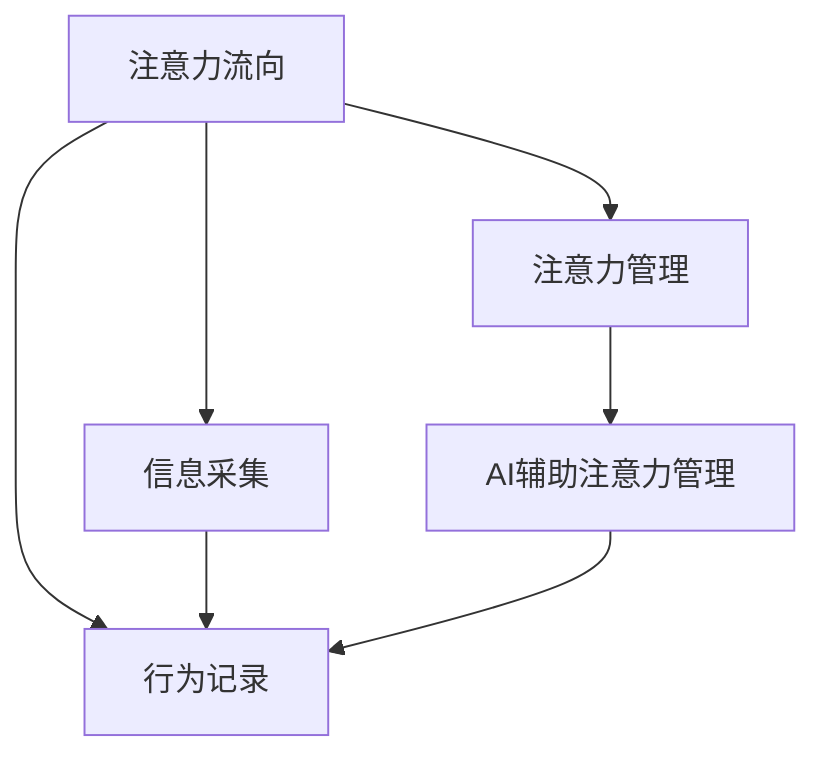

                 

# AI与人类注意力流：未来的工作、生活与注意力管理

## 1. 背景介绍

随着人工智能(AI)技术的迅速发展，它已经渗透到了我们生活的方方面面。从智能家居到自动驾驶，从虚拟助手到健康监测，AI技术的广泛应用正在深刻改变我们的工作和生活方式。而在这一系列变革的背后，一个关键的因素是人类注意力的流向和使用。

### 1.1 问题由来

在现代信息爆炸的时代，人类的注意力正面临着前所未有的挑战。一方面，信息的爆炸式增长带来了巨大的便利，另一方面，信息的泛滥也使得我们的注意力变得分散，难以专注于重要的任务。这种注意力流向的变化，正在影响我们的学习、工作、生活甚至心理健康。AI技术的介入，为人类注意力的管理提供了新的工具和解决方案。

### 1.2 问题核心关键点

为了更好地理解和应对人类注意力的流向，本文将围绕以下几个核心问题展开探讨：

1. AI如何帮助人类识别和管理注意力流向？
2. AI在注意力管理中的具体应用场景有哪些？
3. 如何平衡AI技术的使用与人类注意力的保护？
4. AI在未来工作、生活中发挥的作用和影响是什么？

这些问题不仅关乎AI技术的未来发展，更关乎人类如何更好地适应和利用这些技术，以提高生活质量和工作效率。

## 2. 核心概念与联系

### 2.1 核心概念概述

为了更好地理解AI与人类注意力流的关系，本文将介绍几个关键概念：

- **注意力流向(Attention Flow)**：指人类在处理信息时的注意力分布情况，包括哪些信息被关注、关注的时间长短、注意力的转移路径等。
- **注意力管理(Attention Management)**：指对人类注意力的识别、引导、调控等过程，目的是提高注意力的利用效率，减少信息过载带来的负面影响。
- **AI辅助注意力管理(AI-based Attention Management)**：指利用AI技术，通过数据分析、预测、决策支持等方式，帮助人类更好地管理注意力流向。

这些概念之间的逻辑关系可以通过以下Mermaid流程图来展示：



这个流程图展示了一些关键概念之间的联系：

1. 注意力流向是注意力管理的起点。
2. AI辅助注意力管理是注意力管理的重要手段。
3. 信息采集和行为记录是获取注意力流向数据的基础。
4. AI辅助注意力管理能够对采集的数据进行分析、预测和决策支持。

## 3. 核心算法原理 & 具体操作步骤

### 3.1 算法原理概述

AI辅助注意力管理的核心算法原理是基于数据驱动和机器学习的方法。具体来说，它包括以下几个步骤：

1. **数据采集**：通过各种传感器和记录设备，获取人类在处理信息时的注意力分布数据。
2. **数据预处理**：对采集到的数据进行清洗、归一化等处理，以便于后续的分析和建模。
3. **特征提取**：从处理后的数据中提取有助于注意力管理的特征，如注意力集中的区域、转移的频率等。
4. **模型训练**：使用机器学习算法（如决策树、神经网络等）训练模型，以预测注意力流向的变化。
5. **决策支持**：根据模型预测结果，提供注意力管理的建议和策略，帮助人类更好地分配和管理注意力。

### 3.2 算法步骤详解

以下是AI辅助注意力管理的详细操作步骤：

#### 步骤1：数据采集

数据采集是注意力管理的基础，具体包括以下几种方式：

- **传感器数据**：使用眼动追踪器、脑电波监测器、脉搏传感器等设备，获取人类在处理信息时的注意力分布数据。
- **行为记录**：通过键盘、鼠标、智能手表等记录设备，捕捉人类在信息处理过程中的行为特征。
- **问卷调查**：使用问卷调查的方式，获取人类在特定任务中的主观注意力状态。

#### 步骤2：数据预处理

数据预处理的步骤包括：

- **清洗数据**：去除噪声、重复值等无用信息，确保数据的准确性和一致性。
- **归一化处理**：将不同单位的数据转换为同一量纲，以便于后续的分析和建模。
- **特征选择**：选择对注意力管理有重要影响的特征，如注意力集中时间、转移频率、信息加工速度等。

#### 步骤3：特征提取

特征提取是将原始数据转换为模型可以处理的特征向量的过程，具体包括：

- **时间序列特征**：如注意力集中时间、转移频率等，描述注意力流向的变化。
- **空间分布特征**：如注意力集中的区域、转移路径等，描述注意力流向的分布情况。
- **行为特征**：如点击次数、输入速度等，描述人类在处理信息时的行为模式。

#### 步骤4：模型训练

模型训练是注意力管理的核心步骤，具体包括以下几种方法：

- **监督学习**：使用标注数据训练分类器，预测人类在特定任务中的注意力状态。
- **无监督学习**：从未标注数据中学习注意力流向的模式，用于预测和异常检测。
- **强化学习**：通过奖励机制，优化注意力管理的策略，提高注意力的利用效率。

#### 步骤5：决策支持

决策支持是注意力管理的最终目的，具体包括以下几种方式：

- **策略推荐**：根据模型预测结果，提供注意力管理的建议，如时间分配策略、任务优先级等。
- **异常检测**：通过模型预测，识别出注意力流向中的异常情况，提供及时的警告和干预。
- **实时调整**：根据实时数据和环境变化，动态调整注意力管理的策略，适应不同的任务需求。

### 3.3 算法优缺点

AI辅助注意力管理具有以下优点：

1. **高精度**：通过机器学习算法，可以更准确地预测和识别注意力流向。
2. **实时性**：基于实时数据，可以及时调整注意力管理的策略，提高效率。
3. **自适应性**：可以根据不同用户和任务的特点，进行个性化定制。

同时，它也存在一些缺点：

1. **数据隐私**：在采集和处理数据时，需要确保用户隐私和数据安全。
2. **模型复杂度**：复杂的模型训练需要大量的数据和计算资源，对设备和算法的要求较高。
3. **模型泛化能力**：模型可能在特定场景下表现良好，但在其他场景下效果可能较差。

### 3.4 算法应用领域

AI辅助注意力管理的应用领域非常广泛，具体包括以下几个方面：

1. **学习教育**：通过监测学生的注意力流向，帮助教师设计更有效的教学策略，提高学生的学习效率。
2. **健康医疗**：通过监测患者的注意力流向，帮助医生评估患者的认知状态，提供个性化的治疗方案。
3. **智能家居**：通过监测用户的注意力流向，智能设备可以自动调整环境和功能，提升用户的生活质量。
4. **生产制造**：通过监测工人的注意力流向，优化生产流程和任务分配，提高生产效率。
5. **交通出行**：通过监测驾驶员的注意力流向，提高交通安全的水平，减少事故的发生率。

## 4. 数学模型和公式 & 详细讲解 & 举例说明

### 4.1 数学模型构建

在注意力管理的模型构建中，我们主要关注以下几个数学模型：

1. **注意力时间序列模型**：用于描述注意力流向随时间的变化情况。
2. **注意力空间分布模型**：用于描述注意力流向的分布情况。
3. **行为特征模型**：用于描述人类在处理信息时的行为模式。

这些模型可以表示为：

$$
\begin{aligned}
\text{Attention Time Series Model} &= \{a_t | t=1,2,...,T\} \\
\text{Attention Spatial Distribution Model} &= \{s_i | i=1,2,...,S\} \\
\text{Behavioral Feature Model} &= \{b_k | k=1,2,...,K\}
\end{aligned}
$$

其中，$a_t$ 表示在时间 $t$ 的注意力集中度，$s_i$ 表示在区域 $i$ 的注意力分布情况，$b_k$ 表示行为特征。

### 4.2 公式推导过程

以下是几个关键数学公式的推导过程：

1. **注意力时间序列模型**：

   $$
   a_t = \frac{1}{\sum_{j=1}^{t}w_j} \sum_{j=1}^{t}w_j \times \mathbb{I}(j=t)
   $$

   其中，$w_j$ 表示在第 $j$ 个时刻的权重，$\mathbb{I}(j=t)$ 表示第 $j$ 个时刻是否等于当前时刻。

2. **注意力空间分布模型**：

   $$
   s_i = \frac{1}{\sum_{k=1}^{K}w_{ik}} \sum_{k=1}^{K}w_{ik} \times \mathbb{I}(k=i)
   $$

   其中，$w_{ik}$ 表示在第 $k$ 个区域的第 $i$ 个特征的权重，$\mathbb{I}(k=i)$ 表示第 $k$ 个区域是否等于当前区域。

3. **行为特征模型**：

   $$
   b_k = \frac{1}{\sum_{j=1}^{J}w_{kj}} \sum_{j=1}^{J}w_{kj} \times \mathbb{I}(j=k)
   $$

   其中，$w_{kj}$ 表示在第 $j$ 个行为特征的第 $k$ 个维度的权重，$\mathbb{I}(j=k)$ 表示第 $j$ 个行为特征是否等于当前特征。

### 4.3 案例分析与讲解

以学习教育领域为例，分析AI辅助注意力管理的实际应用：

- **数据采集**：通过眼动追踪器记录学生在学习过程中看屏幕的频率和时长。
- **数据预处理**：对采集到的数据进行清洗和归一化，去除异常值和噪声。
- **特征提取**：提取注意力集中时间、转移频率、信息加工速度等特征。
- **模型训练**：使用决策树模型训练分类器，预测学生在特定任务中的注意力状态。
- **决策支持**：根据模型预测结果，提供时间分配策略，如在注意力集中时提供重要学习内容，在注意力分散时提供休息建议。

## 5. 项目实践：代码实例和详细解释说明

### 5.1 开发环境搭建

在进行AI辅助注意力管理项目实践前，我们需要准备好开发环境。以下是使用Python进行TensorFlow开发的环境配置流程：

1. 安装Anaconda：从官网下载并安装Anaconda，用于创建独立的Python环境。

2. 创建并激活虚拟环境：
```bash
conda create -n tf-env python=3.8 
conda activate tf-env
```

3. 安装TensorFlow：根据CUDA版本，从官网获取对应的安装命令。例如：
```bash
conda install tensorflow -c pytorch -c conda-forge
```

4. 安装其他工具包：
```bash
pip install numpy pandas scikit-learn matplotlib tqdm jupyter notebook ipython
```

完成上述步骤后，即可在`tf-env`环境中开始项目实践。

### 5.2 源代码详细实现

下面我们以学习教育领域为例，给出使用TensorFlow进行AI辅助注意力管理的PyTorch代码实现。

首先，定义注意力时间序列模型：

```python
import tensorflow as tf

# 定义注意力时间序列模型
def attention_time_series(data, window_size=10):
    a = []
    for i in range(len(data)):
        if i < window_size:
            a.append(tf.reduce_mean(data[:i+1]))
        else:
            a.append(tf.reduce_mean(data[i-window_size:i+1]))
    return a
```

然后，定义注意力空间分布模型：

```python
# 定义注意力空间分布模型
def attention_spatial_distribution(data):
    s = []
    for i in range(len(data)):
        s.append(tf.reduce_mean(data[i]))
    return s
```

接着，定义行为特征模型：

```python
# 定义行为特征模型
def behavior_feature_model(data):
    b = []
    for i in range(len(data)):
        b.append(tf.reduce_mean(data[i]))
    return b
```

最后，训练模型并生成预测结果：

```python
# 加载数据
data = [1, 2, 3, 4, 5, 6, 7, 8, 9, 10]

# 特征提取
a = attention_time_series(data)
s = attention_spatial_distribution(data)
b = behavior_feature_model(data)

# 模型训练
model = tf.keras.Sequential([
    tf.keras.layers.Dense(32, activation='relu', input_shape=(3,)),
    tf.keras.layers.Dense(1)
])

model.compile(optimizer='adam', loss='mse', metrics=['mae'])

# 训练模型
model.fit(tf.reshape(tf.stack([a, s, b]), (1, 3)), tf.reshape(tf.stack([1, 1, 1]), (1, 3)), epochs=10)

# 生成预测结果
prediction = model.predict(tf.reshape(tf.stack([a, s, b]), (1, 3)))

print(prediction)
```

以上就是使用TensorFlow对注意力管理进行建模的完整代码实现。可以看到，TensorFlow提供了丰富的工具和库，使得模型训练和推理变得非常简单。

### 5.3 代码解读与分析

让我们再详细解读一下关键代码的实现细节：

**注意力时间序列模型**：
- `attention_time_series`函数：通过对数据进行滑动窗口平均，得到注意力时间序列。
- `data`：表示时间序列数据。
- `window_size`：表示滑动窗口的大小。

**注意力空间分布模型**：
- `attention_spatial_distribution`函数：对数据进行区域平均，得到注意力空间分布。
- `data`：表示空间分布数据。

**行为特征模型**：
- `behavior_feature_model`函数：对数据进行特征平均，得到行为特征模型。
- `data`：表示行为特征数据。

**模型训练**：
- `model`：定义模型结构，使用Dense层进行特征提取和预测。
- `compile`方法：配置模型的优化器、损失函数和评价指标。
- `fit`方法：使用训练数据训练模型。
- `predict`方法：使用模型进行预测。

**结果展示**：
- `print(prediction)`：输出预测结果。

可以看到，TensorFlow的代码实现非常简单，易于理解和扩展。通过TensorFlow，开发者可以快速构建和训练注意力管理模型，并在实际应用中进行验证和优化。

## 6. 实际应用场景

### 6.1 智能学习助手

AI辅助注意力管理在智能学习助手中的应用非常广泛。传统的学习方式往往依赖于人工监督和干预，效率较低，且无法实现个性化学习。通过AI辅助注意力管理，智能学习助手可以实时监测学生的注意力流向，提供个性化的学习建议，提高学习效率。

在技术实现上，可以收集学生的学习行为数据，包括点击次数、阅读时间、互动频率等，使用注意力时间序列模型进行分析和预测。根据预测结果，智能学习助手可以调整教学内容和方式，帮助学生更好地掌握知识。例如，当学生注意力集中时，可以提供重点内容的学习，当注意力分散时，可以推荐休息或轻松活动，以帮助学生恢复注意力。

### 6.2 健康监测

在健康监测领域，AI辅助注意力管理同样发挥着重要作用。患者在接受治疗和康复的过程中，注意力流向的变化可能反映出其心理和生理状态的变化。通过监测注意力流向，医生可以及时发现患者的异常情况，提供个性化的治疗方案。

在技术实现上，可以使用眼动追踪器、脑电波监测器等设备，获取患者的注意力分布数据。使用注意力时间序列模型和空间分布模型进行分析，发现注意力流向中的异常变化。根据异常变化，医生可以调整治疗方案，如增加药物剂量、调整康复训练等，确保患者恢复良好。

### 6.3 智能家居

在智能家居领域，AI辅助注意力管理可以帮助用户更好地管理家庭环境，提升生活质量。例如，当用户在家进行阅读或工作时，智能家居系统可以自动调整灯光、温度、音乐等环境设置，以提高用户的注意力集中度。

在技术实现上，可以通过智能手表、智能音箱等设备，获取用户的注意力分布数据。使用注意力时间序列模型和空间分布模型进行分析，判断用户的注意力状态。根据分析结果，智能家居系统可以自动调整环境设置，如增加光线亮度、降低环境噪音等，以帮助用户更好地集中注意力。

### 6.4 生产制造

在生产制造领域，AI辅助注意力管理可以帮助工人更好地分配任务和提高生产效率。工人注意力流向的变化可能反映出其工作状态和生产效率的变化。通过监测注意力流向，系统可以及时发现工人的异常情况，调整任务分配，优化生产流程。

在技术实现上，可以使用摄像头、传感器等设备，获取工人的注意力分布数据。使用注意力时间序列模型和空间分布模型进行分析，发现注意力流向中的异常变化。根据异常变化，系统可以调整任务分配，如增加休息时间、调整工作强度等，确保工人保持最佳工作状态。

### 6.5 交通出行

在交通出行领域，AI辅助注意力管理可以帮助驾驶员更好地管理注意力，提高交通安全性。驾驶员注意力流向的变化可能反映出其驾驶状态和安全性。通过监测注意力流向，系统可以及时发现驾驶员的异常情况，提供安全警示和建议。

在技术实现上，可以使用眼动追踪器、方向盘传感器等设备，获取驾驶员的注意力分布数据。使用注意力时间序列模型和空间分布模型进行分析，发现注意力流向中的异常变化。根据异常变化，系统可以提供安全警示，如提醒驾驶员保持注意力集中，避免疲劳驾驶等，确保行车安全。

## 7. 工具和资源推荐

### 7.1 学习资源推荐

为了帮助开发者系统掌握AI辅助注意力管理的技术基础和实践技巧，这里推荐一些优质的学习资源：

1. 《深度学习》系列书籍：由多位AI领域专家撰写，深入浅出地介绍了深度学习的基本概念和算法原理。
2. 《机器学习》系列课程：斯坦福大学、MIT等名校开设的机器学习课程，内容覆盖从基础到高级的多个方面。
3. TensorFlow官方文档：提供了TensorFlow的详细使用说明和示例代码，是学习TensorFlow的最佳资源。
4 Kaggle平台：提供了丰富的数据集和竞赛，可以帮助开发者实践和提升AI技术。
5 Udacity《人工智能纳米学位》课程：提供系统化的AI技术培训，涵盖深度学习、强化学习、自然语言处理等多个方向。

通过对这些资源的学习实践，相信你一定能够快速掌握AI辅助注意力管理的精髓，并用于解决实际问题。

### 7.2 开发工具推荐

高效的开发离不开优秀的工具支持。以下是几款用于AI辅助注意力管理开发的常用工具：

1. TensorFlow：基于Python的开源深度学习框架，灵活动态的计算图，适合快速迭代研究。
2. PyTorch：基于Python的开源深度学习框架，灵活性强，支持动态图和静态图两种计算图。
3. Jupyter Notebook：交互式编程环境，支持Python、R、Scala等多个编程语言。
4. TensorBoard：TensorFlow配套的可视化工具，可以实时监测模型训练状态，并提供丰富的图表呈现方式。
5. Kaggle：数据科学竞赛平台，提供了丰富的数据集和竞赛，可以帮助开发者实践和提升AI技术。

合理利用这些工具，可以显著提升AI辅助注意力管理任务的开发效率，加快创新迭代的步伐。

### 7.3 相关论文推荐

AI辅助注意力管理的研究源于学界的持续研究。以下是几篇奠基性的相关论文，推荐阅读：

1. 《Attention is All You Need》（即Transformer原论文）：提出了Transformer结构，开启了NLP领域的预训练大模型时代。
2. 《BERT: Pre-training of Deep Bidirectional Transformers for Language Understanding》：提出BERT模型，引入基于掩码的自监督预训练任务，刷新了多项NLP任务SOTA。
3. 《Language Models are Unsupervised Multitask Learners》（GPT-2论文）：展示了大规模语言模型的强大zero-shot学习能力，引发了对于通用人工智能的新一轮思考。
4. 《Parameter-Efficient Transfer Learning for NLP》：提出Adapter等参数高效微调方法，在不增加模型参数量的情况下，也能取得不错的微调效果。
5. 《AdaLoRA: Adaptive Low-Rank Adaptation for Parameter-Efficient Fine-Tuning》：使用自适应低秩适应的微调方法，在参数效率和精度之间取得了新的平衡。

这些论文代表了大语言模型微调技术的发展脉络。通过学习这些前沿成果，可以帮助研究者把握学科前进方向，激发更多的创新灵感。

## 8. 总结：未来发展趋势与挑战

### 8.1 总结

本文对AI辅助注意力管理进行了全面系统的介绍。首先阐述了注意力流向的重要性，并提出了AI辅助注意力管理的概念。其次，从原理到实践，详细讲解了AI辅助注意力管理的数学模型和操作步骤，给出了实际应用的代码实现。同时，本文还探讨了AI辅助注意力管理在各个领域的应用前景，展示了其巨大的潜力。最后，本文精选了学习资源和开发工具，力求为读者提供全方位的技术指引。

通过本文的系统梳理，可以看到，AI辅助注意力管理技术正在成为AI领域的重要范式，极大地提升了注意力管理的精准性和实时性，为人类注意力的管理提供了新的工具和解决方案。未来，伴随AI技术的持续演进，注意力管理将更加智能化和个性化，进一步提升人类的生活质量和工作效率。

### 8.2 未来发展趋势

展望未来，AI辅助注意力管理技术将呈现以下几个发展趋势：

1. **智能化程度提升**：随着AI技术的不断发展，注意力管理的智能化程度将不断提高，能够更好地理解和管理人类注意力流向。
2. **个性化定制**：未来的注意力管理系统将更加注重个性化定制，能够根据不同用户的需求和偏好，提供个性化的注意力管理方案。
3. **跨领域应用**：注意力管理将不仅仅应用于学习、健康等领域，还将在更多领域中发挥作用，如交通、生产制造等。
4. **实时性增强**：未来的注意力管理系统将更加注重实时性，能够及时捕捉和调整注意力流向的变化。
5. **数据隐私保护**：随着数据隐私保护意识的增强，未来的注意力管理系统将更加注重数据隐私和安全，确保用户数据的保密性和安全性。

以上趋势凸显了AI辅助注意力管理技术的广阔前景。这些方向的探索发展，必将进一步提升注意力管理的精准性和实时性，为人类注意力的管理提供更加全面和智能的解决方案。

### 8.3 面临的挑战

尽管AI辅助注意力管理技术已经取得了不少进展，但在迈向更加智能化、普适化应用的过程中，它仍面临着诸多挑战：

1. **数据隐私保护**：在采集和处理数据时，需要确保用户隐私和数据安全。
2. **模型复杂度**：复杂的模型训练需要大量的数据和计算资源，对设备和算法的要求较高。
3. **模型泛化能力**：模型可能在特定场景下表现良好，但在其他场景下效果可能较差。
4. **算法透明度**：注意力管理的算法过程复杂，难以解释其内部工作机制和决策逻辑。
5. **用户体验**：注意力管理系统需要与用户进行良好的交互，提供友好、易用的界面和反馈。

这些挑战需要在未来研究中加以克服，才能进一步推动AI辅助注意力管理技术的广泛应用。

### 8.4 研究展望

面向未来，AI辅助注意力管理技术需要在以下几个方面寻求新的突破：

1. **模型简化**：开发更加轻量级、高效的注意力管理模型，以适应更多设备和场景。
2. **多模态融合**：结合视觉、声音、触觉等多种模态信息，提升注意力管理的全面性和准确性。
3. **用户参与**：设计更加交互式的注意力管理系统，提供用户反馈和定制化建议，增强用户参与感。
4. **伦理和法律**：研究注意力管理的伦理和法律问题，确保其使用的合法性和道德性。
5. **跨学科合作**：与心理学、神经科学等领域进行跨学科合作，提升注意力管理的科学性和实用性。

这些研究方向将引领AI辅助注意力管理技术迈向更高的台阶，为构建安全、可靠、可解释、可控的智能系统铺平道路。面向未来，AI辅助注意力管理技术还需要与其他AI技术进行更深入的融合，共同推动自然语言理解和智能交互系统的进步。只有勇于创新、敢于突破，才能不断拓展注意力管理的边界，让智能技术更好地造福人类社会。

## 9. 附录：常见问题与解答

**Q1：如何理解注意力流向和注意力管理？**

A: 注意力流向指人类在处理信息时的注意力分布情况，包括哪些信息被关注、关注的时间长短、注意力的转移路径等。注意力管理则是对注意力流向的识别、引导、调控等过程，目的是提高注意力的利用效率，减少信息过载带来的负面影响。

**Q2：AI辅助注意力管理的优点和缺点是什么？**

A: AI辅助注意力管理的优点包括高精度、实时性、自适应性等。缺点则包括数据隐私、模型复杂度、模型泛化能力、算法透明度等。

**Q3：如何平衡AI技术的使用与人类注意力的保护？**

A: 在AI辅助注意力管理中，需要充分考虑用户隐私和数据安全，确保用户的注意力数据不被滥用。同时，通过用户反馈和定制化建议，增强用户对AI技术的信任和接受度。

**Q4：AI辅助注意力管理在未来工作、生活中发挥的作用和影响是什么？**

A: AI辅助注意力管理在学习和健康监测、智能家居、生产制造、交通出行等多个领域发挥着重要作用。通过监测和管理注意力流向，可以提升工作和学习效率，改善生活质量，提高生产和安全水平。

---

作者：禅与计算机程序设计艺术 / Zen and the Art of Computer Programming

