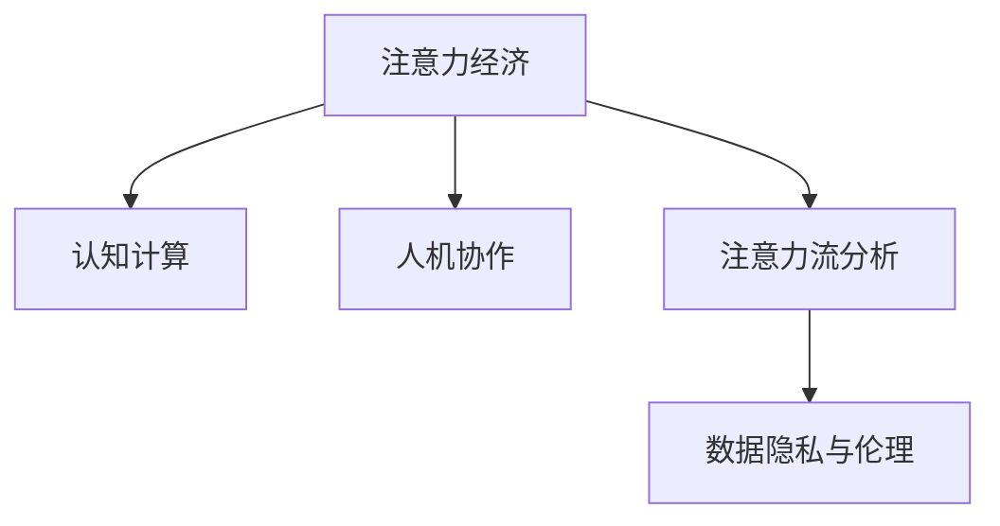

                 

# AI与人类注意力流：未来的工作、生活与注意力经济

> 关键词：AI，人类注意力流，未来工作，生活，注意力经济

## 1. 背景介绍

### 1.1 问题由来

当前，人类社会的注意力正被前所未有地吸引到数字世界中。从社交媒体、在线视频、电子游戏到在线购物，人们几乎时时刻刻都在与数字产品进行互动。然而，这种互动背后所隐含的注意力流向，却在逐渐脱离人类的控制，引发了诸多社会问题和挑战。

- **数字成瘾**：过度依赖数字产品，使得个体在现实世界中的社交和心理健康受到威胁。
- **信息过载**：海量信息的持续涌入，使得人们难以集中注意力，生活效率降低。
- **隐私风险**：数字产品的背后，数据隐私和安全问题日益突出。

与此同时，人工智能技术的飞速发展，正在深刻改变着人类工作、生活的方方面面。AI不仅仅是一种工具，更是一种全新的社会力量。它正在塑造新的经济模式，并悄然改变着人类的注意力流向。因此，理解AI与人类注意力流的关系，对于未来工作、生活的设计和优化，具有重要的理论和实际意义。

### 1.2 问题核心关键点

理解AI与人类注意力流的关键在于以下几个方面：

- **注意力经济**：AI技术如何影响人类注意力资源的分配和使用，进而影响经济模式和产业结构。
- **AI系统设计的伦理考量**：如何设计AI系统，使其符合人类的价值观和社会道德标准。
- **注意力的认知机制**：人类注意力如何在AI系统中被建模和模拟，以及如何通过AI技术提升人类注意力资源的使用效率。
- **未来工作与生活的重塑**：AI如何改变人类的工作流程、生活方式以及个体与社会的交互方式。

这些关键点共同构成了理解AI与人类注意力流关系的框架，帮助我们把握AI技术在现实世界中的深远影响。

## 2. 核心概念与联系

### 2.1 核心概念概述

为了更好地理解AI与人类注意力流的关系，本节将介绍几个密切相关的核心概念：

- **注意力经济**：以人类注意力为核心的新型经济模式，通过吸引和利用注意力资源来创造价值。
- **认知计算**：模拟和增强人类认知过程的计算模型，特别是对注意力的模拟。
- **人机协作**：人类与AI系统之间的协同工作模式，旨在提升个体和组织的效率和创造力。
- **注意力流分析**：通过分析人类注意力的流动，揭示其背后的行为模式和需求，以指导产品设计和社会管理。
- **数据隐私与伦理**：在AI系统中，如何保护数据隐私，确保系统的透明度和公平性。

这些核心概念之间的逻辑关系可以通过以下Mermaid流程图来展示：



这个流程图展示了几大核心概念之间的联系：

1. 注意力经济是基于认知计算和数据隐私与伦理的产物。
2. 认知计算旨在模拟和增强人类的注意力机制。
3. 人机协作利用注意力经济和认知计算，提升工作效率和创造力。
4. 注意力流分析揭示了人类注意力流动的规律，为优化设计提供了依据。
5. 数据隐私与伦理是认知计算和注意力经济的基础，确保系统安全可靠。

## 3. 核心算法原理 & 具体操作步骤
### 3.1 算法原理概述

AI与人类注意力流的互动，本质上是认知计算和数据处理的过程。在这一过程中，人类注意力作为输入，通过AI系统的计算和模拟，转化为决策、推荐、优化等输出，进而影响人类行为和环境。这一过程可以分为以下几个步骤：

1. **注意力数据采集**：通过传感器、日志等手段，采集人类注意力的数据。
2. **注意力模型训练**：使用深度学习等方法，训练AI系统对人类注意力进行建模和预测。
3. **注意力流引导**：利用AI系统对注意力的理解和控制，引导人类注意力流向，优化任务完成。
4. **注意力的反馈与调整**：根据任务完成情况，反馈和调整AI系统的注意力策略，提升系统性能。

### 3.2 算法步骤详解

以下是对AI与人类注意力流互动过程的详细描述：

**Step 1: 注意力数据采集**

注意力数据的采集是整个AI与人类注意力流互动的基础。通过各类传感器（如鼠标、键盘、眼动追踪器、脑波传感器等），可以实时监控人类在数字产品上的注意力集中程度。这些数据可以进一步通过日志分析、行为追踪等手段，综合反映人类注意力的流动。

**Step 2: 注意力模型训练**

使用深度学习模型（如RNN、LSTM、注意力机制），对采集到的注意力数据进行建模和预测。模型的训练数据通常包括注意力焦点、任务完成时间、认知负荷等变量。模型需要学习如何从这些数据中提取有用的特征，并预测人类注意力的分布和变化趋势。

**Step 3: 注意力流引导**

根据训练好的注意力模型，设计智能系统，引导人类注意力流向。例如，在电子商务平台上，系统可以根据用户的注意力数据，推荐相关商品，调整商品布局，提升用户体验。在教育领域，系统可以根据学生的注意力数据，调整教学内容，优化教学效果。

**Step 4: 注意力的反馈与调整**

系统根据用户反馈和注意力流动的结果，对注意力策略进行调整和优化。例如，在发现用户注意力下降时，系统可以提醒用户休息或调整任务难度。在识别出用户注意力集中时，系统可以提供更复杂和挑战性的任务，以充分利用用户的注意力资源。

### 3.3 算法优缺点

AI与人类注意力流的互动过程，具有以下优点：

1. **效率提升**：AI系统能够自动分析注意力数据，优化任务设计，提升工作效率。
2. **个性化定制**：通过精准的注意力预测，系统可以为不同个体提供个性化服务。
3. **用户体验改善**：系统能够根据用户的注意力状态，动态调整界面和交互方式，提升用户体验。

同时，该过程也存在一定的局限性：

1. **隐私风险**：注意力数据的采集和使用，涉及隐私保护问题，可能引发用户对数据隐私的担忧。
2. **模型泛化性不足**：当前的注意力模型往往基于特定场景，泛化到其他领域可能效果不佳。
3. **系统复杂性**：注意力流引导和反馈调整，需要复杂的算法和系统设计，存在实施难度。
4. **伦理争议**：AI系统对人类注意力的操控，可能引发对个体自主性和社会公正性的质疑。

尽管存在这些局限性，但AI与人类注意力流的互动过程，已经在多个领域得到了应用，并展现出巨大的潜力。未来，随着技术的发展和伦理的进步，该过程将进一步优化，为人类社会带来更多便利和创新。

### 3.4 算法应用领域

AI与人类注意力流的互动过程，已经在多个领域得到应用，具体如下：

- **智能推荐系统**：如电商平台的商品推荐、视频网站的广告推荐等，通过分析用户注意力，优化推荐内容，提升用户满意度。
- **智能教育系统**：如在线课程的个性化推荐、智能批改系统等，通过关注学生的注意力状态，提升教学效果。
- **健康管理**：如智能健身设备、睡眠监测系统等，通过监控用户的注意力状态，提供健康建议和生活指导。
- **智能交通**：如无人驾驶汽车、智能交通管理等，通过分析驾驶者的注意力状态，提高交通安全性。
- **虚拟现实与增强现实**：如虚拟课堂、虚拟旅游等，通过模拟注意力的流动，提升虚拟体验的真实感。

这些领域的应用，展示了AI与人类注意力流互动的广泛前景和深远影响。随着技术的发展和应用场景的拓展，AI在人类注意力流中的应用将越来越深入，带来更多创新和便利。

## 4. 数学模型和公式 & 详细讲解  
### 4.1 数学模型构建

在AI与人类注意力流互动的过程中，我们可以构建一个简单的数学模型来描述这一过程。假设人类注意力状态由向量 $A$ 表示，系统的注意力策略由向量 $S$ 表示。系统的输出 $Y$ 可以表示为：

$$ Y = f(A, S) $$

其中 $f$ 是一个函数，表示系统的注意力流引导策略。$A$ 和 $S$ 可以通过深度学习模型进行训练和优化。模型的训练目标是最小化预测误差 $L$，即：

$$ \min_{A, S} L(f(A, S), Y^*) $$

其中 $Y^*$ 表示系统的理想输出。

### 4.2 公式推导过程

以推荐系统为例，我们可以使用协同过滤（Collaborative Filtering）模型来描述系统的注意力流引导策略。假设系统有一个用户注意力向量 $A$ 和物品注意力向量 $B$，系统的输出 $Y$ 可以表示为用户对物品的评分。系统的训练目标是最小化预测误差：

$$ L = \frac{1}{N}\sum_{i=1}^N \sum_{j=1}^M (r_{ij} - \hat{r}_{ij})^2 $$

其中 $r_{ij}$ 表示用户 $i$ 对物品 $j$ 的真实评分，$\hat{r}_{ij}$ 表示预测评分。模型的训练过程可以使用梯度下降等优化算法，不断调整用户注意力向量 $A$ 和物品注意力向量 $B$，使得预测评分与真实评分尽可能接近。

### 4.3 案例分析与讲解

假设我们有一个电商平台的推荐系统，其训练数据包括用户的点击行为和物品的属性特征。通过注意力模型，系统能够预测用户对物品的评分，进而优化推荐策略。我们可以使用以下Python代码，构建一个简单的协同过滤模型：

```python
import pandas as pd
from sklearn.model_selection import train_test_split
from sklearn.metrics import mean_squared_error
from lightgbm import LGBMRegressor

# 数据准备
data = pd.read_csv('data.csv')
X = data[['feature1', 'feature2', 'feature3']]
y = data['score']

# 划分训练集和测试集
X_train, X_test, y_train, y_test = train_test_split(X, y, test_size=0.2, random_state=42)

# 训练模型
model = LGBMRegressor()
model.fit(X_train, y_train)

# 预测评分
y_pred = model.predict(X_test)

# 评估模型
mse = mean_squared_error(y_test, y_pred)
print('Mean Squared Error:', mse)
```

在上述代码中，我们使用LightGBM模型对用户物品评分进行预测。通过不断的模型训练和优化，可以逐步提升预测精度，从而优化推荐策略。

## 5. 项目实践：代码实例和详细解释说明
### 5.1 开发环境搭建

在进行AI与人类注意力流互动的开发时，我们需要准备好开发环境。以下是使用Python进行深度学习开发的环境配置流程：

1. 安装Anaconda：从官网下载并安装Anaconda，用于创建独立的Python环境。

2. 创建并激活虚拟环境：
```bash
conda create -n ai_env python=3.8 
conda activate ai_env
```

3. 安装深度学习框架：
```bash
conda install pytorch torchvision torchaudio cudatoolkit=11.1 -c pytorch -c conda-forge
```

4. 安装TensorBoard：
```bash
pip install tensorboard
```

5. 安装PyTorch Lightning：
```bash
pip install pytorch-lightning
```

完成上述步骤后，即可在`ai_env`环境中开始项目实践。

### 5.2 源代码详细实现

以下是使用PyTorch和PyTorch Lightning构建一个简单的注意力模型，用于推荐系统：

```python
import torch
import torch.nn as nn
from torchmetrics import MeanSquaredError
from pytorch_lightning import Trainer, LightningModule

# 定义注意力模型
class AttentionModel(nn.Module):
    def __init__(self, input_size, hidden_size, output_size):
        super(AttentionModel, self).__init__()
        self.linear1 = nn.Linear(input_size, hidden_size)
        self.linear2 = nn.Linear(hidden_size, output_size)
        self.relu = nn.ReLU()

    def forward(self, x):
        hidden = self.linear1(x)
        hidden = self.relu(hidden)
        output = self.linear2(hidden)
        return output

# 定义推荐系统
class RecommendationSystem(LightningModule):
    def __init__(self, input_size, hidden_size, output_size):
        super(RecommendationSystem, self).__init__()
        self.attention = AttentionModel(input_size, hidden_size, output_size)

    def forward(self, x):
        return self.attention(x)

    def training_step(self, batch, batch_idx):
        x, y = batch
        y_pred = self(x)
        loss = nn.MSELoss()(y_pred, y)
        self.log('train_loss', loss)
        return loss

    def configure_optimizers(self):
        return torch.optim.Adam(self.parameters(), lr=0.001)

# 数据准备
data = pd.read_csv('data.csv')
X = data[['feature1', 'feature2', 'feature3']]
y = data['score']
model = RecommendationSystem(input_size=3, hidden_size=10, output_size=1)
trainer = Trainer(max_epochs=10, gpus=1)
trainer.fit(model, train_loader, val_loader)

# 测试模型
test_loader = DataLoader(test_data, batch_size=1)
model.eval()
with torch.no_grad():
    mse = torch.tensor(0.)
    for batch in test_loader:
        x, y = batch
        y_pred = model(x)
        mse += torch.square(y_pred - y).mean()
    print('Test Mean Squared Error:', mse.item())
```

在上述代码中，我们定义了一个简单的注意力模型，用于预测用户物品评分。通过PyTorch Lightning框架，可以方便地进行模型的训练和优化。模型的训练过程使用Adam优化器，并在每个epoch记录训练损失。

### 5.3 代码解读与分析

让我们再详细解读一下关键代码的实现细节：

**AttentionModel类**：
- `__init__`方法：初始化线性层和激活函数。
- `forward`方法：前向传播，计算注意力输出。

**RecommendationSystem类**：
- `__init__`方法：初始化注意力模型。
- `forward`方法：前向传播，调用注意力模型。
- `training_step`方法：定义训练过程，计算损失并记录日志。
- `configure_optimizers`方法：定义优化器。

**Trainer类**：
- `fit`方法：定义训练过程，传入模型、数据集和优化器。
- `eval`方法：定义模型评估过程，传入测试数据集。

通过上述代码的实现，我们可以构建一个简单的注意力模型，用于推荐系统。代码中使用的深度学习框架和工具，确保了模型的高效训练和优化。

## 6. 实际应用场景
### 6.1 智能推荐系统

智能推荐系统是AI与人类注意力流互动的典型应用场景。推荐系统通过分析用户的注意力状态，优化推荐内容，提升用户体验。例如，在电商平台、视频网站、新闻聚合平台等，通过分析用户的点击、浏览、停留时间等数据，推荐用户可能感兴趣的商品、视频、新闻等。

**案例**：YouTube推荐系统

YouTube推荐系统通过分析用户的观看行为，推荐用户可能感兴趣的视频。系统利用用户的注意力数据，计算视频之间的相似度，生成推荐列表。通过不断的训练和优化，系统可以动态调整推荐策略，提升用户满意度。

### 6.2 智能教育系统

智能教育系统通过分析学生的注意力状态，优化教学内容，提升教学效果。例如，在在线课程、虚拟课堂、智能批改系统等，通过监控学生的注意力数据，调整教学节奏和难度，提供个性化的学习建议。

**案例**：Khan Academy

Khan Academy利用智能教育系统，分析学生的注意力数据，调整课程内容和难度，提供个性化的学习建议。通过智能化的教学设计，Khan Academy在数学、科学等学科上取得了显著的成果。

### 6.3 健康管理

健康管理通过监控用户的注意力状态，提供健康建议和生活指导。例如，智能健身设备、睡眠监测系统、饮食推荐系统等，通过分析用户的注意力数据，提供个性化的健康建议。

**案例**：Fitbit

Fitbit利用智能健康管理系统，监控用户的注意力状态，提供个性化的健身建议和生活指导。通过智能化的健康管理，Fitbit帮助用户建立健康的生活习惯，提升生活质量。

### 6.4 未来应用展望

随着AI技术的发展，AI与人类注意力流的互动将在更多领域得到应用，带来更多创新和便利。未来，AI将在以下几个方面发挥更大的作用：

- **增强现实与虚拟现实**：通过模拟注意力的流动，增强现实和虚拟现实系统可以提供更加真实和沉浸式的体验。
- **智能家居**：通过监控用户的注意力状态，智能家居系统可以优化生活场景，提升生活质量。
- **个性化医疗**：通过分析患者的注意力状态，智能医疗系统可以提供个性化的治疗方案和健康建议。
- **智能交通**：通过监控司机的注意力状态，智能交通系统可以提高交通安全性，减少交通事故。

AI与人类注意力流的互动，将深刻改变人类的工作、生活和社会结构。未来的社会，将是一个更加智能化、个性化、高效化的社会。

## 7. 工具和资源推荐
### 7.1 学习资源推荐

为了帮助开发者系统掌握AI与人类注意力流的理论基础和实践技巧，这里推荐一些优质的学习资源：

1. 《深度学习》系列课程：由斯坦福大学、Coursera等机构开设的深度学习课程，涵盖了深度学习的基本概念和实践技巧。
2. 《认知计算》课程：由MIT、Coursera等机构开设的认知计算课程，介绍认知计算的基本原理和应用场景。
3. 《注意力机制》书籍：由DeepMind、Google等机构撰写，详细介绍注意力机制在深度学习中的应用。
4. 《智能推荐系统》书籍：由Amazon、KDD等机构撰写，详细介绍智能推荐系统的设计和优化。
5. 《注意力流分析》论文：由KDD、SIGIR等会议发表的论文，介绍注意力流分析的方法和应用。

通过对这些资源的学习实践，相信你一定能够快速掌握AI与人类注意力流的精髓，并用于解决实际的AI问题。

### 7.2 开发工具推荐

高效的开发离不开优秀的工具支持。以下是几款用于AI与人类注意力流互动开发的常用工具：

1. PyTorch：基于Python的开源深度学习框架，灵活动态的计算图，适合快速迭代研究。
2. TensorFlow：由Google主导开发的开源深度学习框架，生产部署方便，适合大规模工程应用。
3. TensorBoard：TensorFlow配套的可视化工具，可实时监测模型训练状态，并提供丰富的图表呈现方式。
4. PyTorch Lightning：PyTorch的轻量级训练框架，支持快速训练和模型优化。
5. Jupyter Notebook：交互式编程环境，方便开发者进行代码测试和数据可视化。
6. GitHub：代码托管平台，方便开发者协作开发和管理项目。

合理利用这些工具，可以显著提升AI与人类注意力流互动任务的开发效率，加快创新迭代的步伐。

### 7.3 相关论文推荐

AI与人类注意力流互动的研究源于学界的持续研究。以下是几篇奠基性的相关论文，推荐阅读：

1. Attention is All You Need（即Transformer原论文）：提出了Transformer结构，开启了AI与注意力流互动的时代。
2. The Anatomy of Cognitive Computing：介绍认知计算的基本原理和应用场景。
3. Computational Attention Mechanisms in Neural Systems：介绍注意力机制在深度学习中的应用。
4. Attention-based Recommendation Systems：介绍注意力机制在推荐系统中的应用。
5. Attention Flow Analysis in Social Media：介绍注意力流分析的方法和应用。

这些论文代表了大语言模型微调技术的发展脉络。通过学习这些前沿成果，可以帮助研究者把握学科前进方向，激发更多的创新灵感。

## 8. 总结：未来发展趋势与挑战
### 8.1 总结

本文对AI与人类注意力流的互动过程进行了全面系统的介绍。首先阐述了AI技术如何影响人类注意力资源的分配和使用，明确了注意力经济、认知计算、人机协作等核心概念的原理和应用。其次，从原理到实践，详细讲解了注意力模型训练、注意力流引导、注意力的反馈与调整等具体操作步骤，给出了具体的代码实现和分析。同时，本文还广泛探讨了AI与人类注意力流的互动在智能推荐系统、智能教育系统、健康管理等多个领域的应用前景，展示了其巨大的潜力。

通过本文的系统梳理，可以看到，AI与人类注意力流的互动正在深刻改变人类的工作、生活和社会结构。AI技术的应用，正在提升个体和组织的效率，改善用户体验，推动社会进步。未来，随着技术的不断发展，AI与人类注意力流的互动将更加广泛和深入，带来更多创新和便利。

### 8.2 未来发展趋势

展望未来，AI与人类注意力流的互动将呈现以下几个发展趋势：

1. **认知计算的进步**：认知计算技术将不断进步，模拟人类注意力的机制将更加精确，能够更好地适应不同领域的应用场景。
2. **多模态交互的普及**：未来将涌现更多多模态（如视觉、语音、触觉等）的注意力系统，提升用户体验。
3. **个性化服务的深化**：通过更加精准的注意力建模，AI系统能够提供更加个性化的服务，满足个体需求。
4. **智能决策的提升**：AI系统将更加智能，能够根据注意力的变化动态调整决策策略，提升系统性能。
5. **伦理和社会问题的解决**：AI系统将更加注重伦理和社会问题，确保数据隐私、公平性和透明性。

以上趋势凸显了AI与人类注意力流互动的广阔前景。这些方向的探索发展，将进一步提升AI系统的性能和应用范围，为人类社会带来更多便利和创新。

### 8.3 面临的挑战

尽管AI与人类注意力流的互动技术已经取得了瞩目成就，但在迈向更加智能化、普适化应用的过程中，它仍面临着诸多挑战：

1. **隐私保护**：注意力数据的采集和使用，涉及隐私保护问题，可能引发用户对数据隐私的担忧。
2. **模型泛化性不足**：当前的注意力模型往往基于特定场景，泛化到其他领域可能效果不佳。
3. **系统复杂性**：注意力流引导和反馈调整，需要复杂的算法和系统设计，存在实施难度。
4. **伦理争议**：AI系统对人类注意力的操控，可能引发对个体自主性和社会公正性的质疑。

尽管存在这些挑战，但通过不断优化技术，提升模型性能，加强伦理研究，AI与人类注意力流的互动技术将逐步走向成熟，为人类社会带来更多便利和创新。

### 8.4 研究展望

面对AI与人类注意力流互动所面临的种种挑战，未来的研究需要在以下几个方面寻求新的突破：

1. **隐私保护技术的创新**：开发更加高效和安全的隐私保护技术，确保注意力数据的安全和匿名性。
2. **多模态交互系统的设计**：设计更多多模态的注意力系统，提升用户互动的真实感和沉浸感。
3. **注意力机制的普适性提升**：探索更普适的注意力建模方法，提升注意力机制在不同领域的应用效果。
4. **伦理和社会问题的解决**：加强AI系统的伦理和社会问题研究，确保系统的公平性和透明性。
5. **跨领域应用的探索**：探索AI与人类注意力流互动在更多领域的应用，推动技术广泛落地。

这些研究方向的探索，必将引领AI与人类注意力流互动技术迈向更高的台阶，为构建安全、可靠、可解释、可控的智能系统铺平道路。面向未来，AI与人类注意力流的互动技术还需要与其他人工智能技术进行更深入的融合，如知识表示、因果推理、强化学习等，多路径协同发力，共同推动自然语言理解和智能交互系统的进步。只有勇于创新、敢于突破，才能不断拓展AI系统的边界，让智能技术更好地造福人类社会。

## 9. 附录：常见问题与解答

**Q1：AI与人类注意力流互动的优势和劣势是什么？**

A: AI与人类注意力流互动的优势在于：
1. 提升效率：通过优化注意力资源分配，AI系统能够显著提升个体和组织的工作效率。
2. 个性化服务：AI系统能够根据用户的注意力状态，提供个性化的服务和推荐。
3. 优化体验：AI系统能够改善用户体验，提供更加真实和沉浸式的互动体验。

劣势在于：
1. 隐私风险：注意力数据的采集和使用，涉及隐私保护问题，可能引发用户对数据隐私的担忧。
2. 模型泛化性不足：当前的注意力模型往往基于特定场景，泛化到其他领域可能效果不佳。
3. 系统复杂性：注意力流引导和反馈调整，需要复杂的算法和系统设计，存在实施难度。
4. 伦理争议：AI系统对人类注意力的操控，可能引发对个体自主性和社会公正性的质疑。

**Q2：如何设计AI系统，使其符合人类的价值观和社会道德标准？**

A: 设计AI系统时，需要遵循以下伦理原则：
1. 透明性：系统需要具有透明性，用户可以了解系统的决策过程和数据来源。
2. 公平性：系统需要确保不同用户之间的公平性，避免偏见和歧视。
3. 可解释性：系统需要具备可解释性，用户可以理解系统的决策依据。
4. 隐私保护：系统需要确保数据隐私，避免泄露敏感信息。
5. 安全性：系统需要具备安全性，避免被恶意攻击和篡改。

**Q3：AI系统如何在不损害用户隐私的情况下，获取人类注意力数据？**

A: 获取人类注意力数据时，需要遵循以下隐私保护原则：
1. 最小化原则：只收集必要的数据，避免过度收集。
2. 匿名化处理：对数据进行匿名化处理，确保用户隐私。
3. 用户同意：在数据收集前，获得用户的明确同意。
4. 数据加密：对数据进行加密处理，确保数据安全。
5. 合规性：遵循相关法律法规，如GDPR、CCPA等。

**Q4：如何评估AI与人类注意力流互动的效果？**

A: 评估AI与人类注意力流互动的效果，通常从以下几个方面进行：
1. 准确率：评估系统推荐的准确性，如推荐系统的召回率和精确率。
2. 用户满意度：通过用户反馈调查，评估用户对系统的满意度。
3. 认知负荷：评估系统的认知负荷，如用户在使用系统时的注意力集中度和疲劳程度。
4. 任务完成效率：评估系统对任务完成效率的提升效果，如推荐系统的点击转化率、学习效率等。
5. 系统安全性：评估系统的安全性，如数据隐私保护、系统稳定性等。

通过这些指标的评估，可以全面了解AI与人类注意力流互动的效果，指导系统优化和改进。

**Q5：未来AI与人类注意力流互动的主要应用场景有哪些？**

A: 未来AI与人类注意力流互动的主要应用场景包括：
1. 智能推荐系统：如电商平台的商品推荐、视频网站的广告推荐等。
2. 智能教育系统：如在线课程的个性化推荐、智能批改系统等。
3. 健康管理：如智能健身设备、睡眠监测系统等。
4. 智能交通：如无人驾驶汽车、智能交通管理等。
5. 增强现实与虚拟现实：如虚拟课堂、虚拟旅游等。
6. 智能家居：通过监控用户的注意力状态，优化生活场景，提升生活质量。
7. 个性化医疗：通过分析患者的注意力状态，提供个性化的治疗方案和健康建议。
8. 社会管理：如智能城市管理、智能安全监控等。

这些应用场景展示了AI与人类注意力流互动的广泛前景，未来将有更多创新和便利。

---

作者：禅与计算机程序设计艺术 / Zen and the Art of Computer Programming

