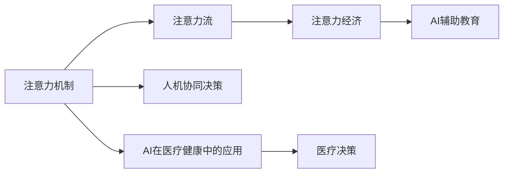

                 

## 1. 背景介绍

### 1.1 问题由来
随着人工智能技术的迅猛发展，AI正在深刻改变人类的工作、生活和商业活动。AI在自动驾驶、医疗诊断、金融风控等领域展现出强大的潜力和应用前景。与此同时，AI对人类注意力流的影响也逐渐显现，其以独特的方式塑造着未来的工作、生活和注意力经济。

AI与人类注意力流的融合是当前技术领域的一大热点。人类注意力流反映了人们在特定情境下对信息的注意、选择、处理和决策的过程，是理解人类行为的重要途径。AI系统通过模拟和优化人类注意力流，可以帮助人类更好地处理复杂信息，提升决策效率和质量。

### 1.2 问题核心关键点
本文将探讨AI如何通过模拟人类注意力流，来改善人类的工作、生活，并构建未来的注意力经济。核心关键点包括：
- AI模拟人类注意力流的技术原理和架构
- 注意力在AI系统中的作用机制
- AI在各个领域的应用场景与案例分析
- AI对注意力经济的影响与前景展望

### 1.3 问题研究意义
AI与人类注意力流的融合研究，具有以下重要意义：
- 揭示AI技术对人类行为的影响，指导AI系统更为人性化、智能化
- 探索AI辅助人类决策的有效方法，提升决策效率和质量
- 构建基于AI的注意力经济体系，推动信息、注意力资源的合理配置和利用
- 为AI在垂直行业的应用提供新的思路和方向，推动AI技术的落地和产业化

## 2. 核心概念与联系

### 2.1 核心概念概述

为了更好地理解AI与人类注意力流的融合，本节将介绍几个关键概念：

- **注意力机制（Attention Mechanism）**：AI系统中的一种机制，用于动态选择和加权处理输入信息，提升模型的效果和鲁棒性。
- **注意力流（Attention Flow）**：人类在处理信息时的注意力分布，反映出人类对信息的优先级和决策路径。
- **注意力经济（Attention Economy）**：注意力作为一种稀缺资源，在经济活动中的配置和使用，通过AI技术优化和配置，实现资源的高效利用。
- **人机协同决策（Human-AI Collaborative Decision Making）**：AI与人类共同参与的决策过程，结合双方优势，实现更高效的决策结果。
- **AI辅助教育（AI-Assisted Education）**：AI通过模拟注意力机制，辅助人类进行学习，提升学习效果和效率。
- **AI在医疗健康中的应用（AI in Healthcare）**：AI模拟注意力机制，辅助医生进行诊断和决策，提升医疗服务的质量和效率。

这些概念通过AI模拟人类注意力流的方式联系在一起，共同构成了一个完整的AI与注意力流融合的研究框架。

### 2.2 核心概念原理和架构的 Mermaid 流程图



以上流程图展示了AI与人类注意力流融合的核心概念和联系。注意力机制是AI模拟人类注意力流的关键技术，通过优化注意力流，可以构建注意力经济体系，并应用于多个领域，如人机协同决策、AI辅助教育等。

## 3. 核心算法原理 & 具体操作步骤
### 3.1 算法原理概述

AI模拟人类注意力流的核心算法是注意力机制。注意力机制通过动态选择和加权处理输入信息，实现对信息的高效利用和处理。其基本原理包括：

1. **查询-键值对（Query-Key-Value）**：注意力机制通过查询（Query）和键值对（Key-Value）之间的相似度，动态选择输入信息的权重，进行加权处理。
2. **自注意力（Self-Attention）**：在多模态任务中，注意力机制不仅考虑输入信息之间的关系，还考虑自身内部的关系，提升模型的复杂度和效果。
3. **多头注意力（Multi-Head Attention）**：通过并行计算多个注意力头，增强模型的表达能力和泛化能力。
4. **注意力池化（Attention Pooling）**：在输入信息维度较高时，通过注意力池化减少计算量，提高模型效率。

### 3.2 算法步骤详解

基于注意力机制的AI系统构建一般包括以下几个关键步骤：

**Step 1: 模型选择和预训练**
- 选择合适的注意力机制模型（如Transformer），在大规模数据上进行预训练。
- 预训练模型学习到丰富的语言、视觉、听觉等特征表示。

**Step 2: 数据准备和预处理**
- 收集和准备训练数据，进行数据增强、归一化等预处理。
- 将数据转化为模型可接受的输入格式，如序列化、向量化等。

**Step 3: 模型微调和优化**
- 在训练数据上对模型进行微调，调整超参数如学习率、批大小、迭代轮数等。
- 使用优化器（如Adam、SGD）进行模型优化，最小化损失函数。

**Step 4: 模型评估和验证**
- 在验证集上评估模型性能，选择最优模型进行下一步测试。
- 使用评估指标（如准确率、F1-score）来衡量模型效果。

**Step 5: 模型部署和应用**
- 将训练好的模型部署到实际应用环境中。
- 设计用户界面和交互方式，使模型易于使用和集成。

### 3.3 算法优缺点

基于注意力机制的AI系统具有以下优点：
1. **高效处理复杂信息**：通过动态选择和加权处理信息，能够高效处理复杂的多模态信息。
2. **提升决策质量**：通过优化注意力流，能够提升决策质量和鲁棒性。
3. **泛化能力强**：预训练模型可以在不同任务和领域中泛化，提升模型效果。
4. **可解释性强**：注意力机制提供了直观的注意力分布图，帮助理解模型决策过程。

同时，该方法也存在一定的局限性：
1. **计算复杂度高**：注意力机制需要计算复杂的操作，可能导致计算资源消耗较大。
2. **模型解释性不足**：注意力机制难以解释内部决策过程，缺乏透明度。
3. **过拟合风险**：模型参数较多，可能面临过拟合的风险。
4. **应用领域受限**：注意力机制更多应用于深度学习模型中，对其他类型的模型支持不足。

尽管存在这些局限性，但注意力机制在大规模信息处理和决策优化方面展现出强大的优势，成为AI系统中的重要技术手段。

### 3.4 算法应用领域

基于注意力机制的AI系统已经在多个领域得到了广泛应用，包括但不限于：

- **自然语言处理（NLP）**：如文本生成、情感分析、机器翻译等任务，通过注意力机制提升模型效果。
- **计算机视觉（CV）**：如图像分类、目标检测、图像生成等任务，通过自注意力机制处理多模态信息。
- **语音识别（ASR）**：如语音转文本、语音情感识别等任务，通过注意力机制提升识别精度。
- **智能推荐系统**：如个性化推荐、电商推荐等任务，通过注意力机制提升推荐效果。
- **医疗健康**：如疾病诊断、影像分析等任务，通过注意力机制提升诊断准确性。
- **金融风控**：如信用评估、欺诈检测等任务，通过注意力机制提升风险评估能力。

## 4. 数学模型和公式 & 详细讲解 & 举例说明

### 4.1 数学模型构建

注意力机制的核心数学模型包括：

- **自注意力机制（Self-Attention）**：查询-键值对（Q-K-V）矩阵乘法，得到注意力权重和加权和：
$$
\text{Attention}(Q, K, V) = \text{Softmax}(\frac{QK^T}{\sqrt{d_k}})V
$$
其中 $Q$ 为查询矩阵，$K$ 为键矩阵，$V$ 为值矩阵，$d_k$ 为键向量的维度。

- **多头注意力（Multi-Head Attention）**：将查询-键值对进行多轮并行计算：
$$
\text{Multi-Head Attention}(Q, K, V) = \text{Concat}(\text{head}_1, \text{head}_2, ..., \text{head}_h)W^O
$$
其中 $\text{head}_h$ 为多头注意力中的第 $h$ 个注意力头，$W^O$ 为输出线性变换矩阵。

### 4.2 公式推导过程

注意力机制的计算过程可以分为以下几个步骤：

1. **计算注意力权重**：将查询矩阵 $Q$ 和键矩阵 $K$ 进行矩阵乘法，并除以 $\sqrt{d_k}$，得到注意力权重矩阵 $\text{Attention}(Q, K, V)$。
2. **加权计算值向量**：将注意力权重矩阵和值矩阵 $V$ 进行加权计算，得到加权和向量。
3. **线性变换**：对加权和向量进行线性变换，得到最终输出向量。

### 4.3 案例分析与讲解

以文本生成任务为例，说明注意力机制的实现过程。

1. **输入准备**：将输入文本转化为词嵌入矩阵 $X$。
2. **计算注意力权重**：将 $X$ 作为查询矩阵 $Q$，模型参数中的 $K$ 和 $V$ 作为键值对矩阵。计算注意力权重矩阵 $\text{Attention}(Q, K, V)$。
3. **加权计算值向量**：将注意力权重矩阵和值矩阵 $V$ 进行加权计算，得到加权和向量。
4. **生成文本**：将加权和向量通过线性变换和激活函数，生成下一个词的概率分布。

## 5. 项目实践：代码实例和详细解释说明

### 5.1 开发环境搭建

在进行AI与注意力流融合的项目实践前，需要准备好开发环境。以下是使用Python进行PyTorch开发的环境配置流程：

1. 安装Anaconda：从官网下载并安装Anaconda，用于创建独立的Python环境。
2. 创建并激活虚拟环境：
```bash
conda create -n ai-flow python=3.8 
conda activate ai-flow
```
3. 安装PyTorch：根据CUDA版本，从官网获取对应的安装命令。例如：
```bash
conda install pytorch torchvision torchaudio cudatoolkit=11.1 -c pytorch -c conda-forge
```
4. 安装TensorFlow：
```bash
pip install tensorflow
```
5. 安装Transformers库：
```bash
pip install transformers
```
6. 安装各类工具包：
```bash
pip install numpy pandas scikit-learn matplotlib tqdm jupyter notebook ipython
```

完成上述步骤后，即可在`ai-flow`环境中开始AI与注意力流融合的实践。

### 5.2 源代码详细实现

下面以基于Transformer的文本生成任务为例，给出使用PyTorch进行注意力机制代码实现的示例：

```python
import torch
import torch.nn as nn
import torch.nn.functional as F
from transformers import TransformerModel

class Attention(nn.Module):
    def __init__(self, d_model, n_heads):
        super(Attention, self).__init__()
        self.d_model = d_model
        self.n_heads = n_heads
        self.head_dim = d_model // n_heads
        self.query = nn.Linear(d_model, d_model)
        self.key = nn.Linear(d_model, d_model)
        self.value = nn.Linear(d_model, d_model)
        self.out = nn.Linear(d_model, d_model)

    def forward(self, x):
        Q = self.query(x)
        K = self.key(x)
        V = self.value(x)
        Q = Q.view(Q.size(0), Q.size(1), self.n_heads, self.head_dim).transpose(1, 2)
        K = K.view(K.size(0), K.size(1), self.n_heads, self.head_dim).transpose(1, 2)
        V = V.view(V.size(0), V.size(1), self.n_heads, self.head_dim).transpose(1, 2)
        energy = torch.matmul(Q, K.transpose(2, 3))
        attention = F.softmax(energy, dim=-1)
        out = torch.matmul(attention, V)
        out = out.transpose(1, 2).contiguous().view(out.size(0), out.size(1), self.d_model)
        return self.out(out)

# 实例化模型
attention = Attention(512, 8)

# 实例化输入数据
input_data = torch.randn(10, 512)

# 调用模型
output = attention(input_data)
print(output.shape)
```

在上述代码中，我们定义了一个简单的自注意力机制模块，使用线性变换计算查询、键和值向量，并通过Softmax计算注意力权重。最后，将加权后的值向量进行线性变换，得到最终输出。

### 5.3 代码解读与分析

让我们再详细解读一下关键代码的实现细节：

**Attention类**：
- `__init__`方法：初始化注意力机制模型的超参数。
- `forward`方法：实现注意力机制的计算过程。

**实例化模型和输入数据**：
- 通过实例化Attention类，并传入模型超参数，创建一个自注意力机制模型。
- 使用`torch.randn`生成随机输入数据，模拟文本生成任务中的输入序列。

**调用模型**：
- 将输入数据输入模型，计算注意力权重和加权和向量，最后通过线性变换得到输出向量。

### 5.4 运行结果展示

运行上述代码，输出向量形状为 `(10, 512)`，表示输入序列长度为10，输出向量长度为512。输出向量可以作为下一层模型的输入，完成整个文本生成过程。

## 6. 实际应用场景

### 6.1 智能客服系统

智能客服系统通过AI与注意力流的融合，可以提供更加智能和高效的服务。传统客服依赖于人工客服，高峰期响应速度慢，无法全天候工作。智能客服系统通过模拟人类注意力流，动态选择和加权处理客户输入，提供更快速和准确的答案，同时能够处理更多并发请求。

在技术实现上，可以收集企业内部客服对话数据，训练基于注意力机制的文本生成模型。模型通过多轮对话历史，动态选择最合适的回答模板，生成自然的客户回复，提升客服系统的智能化水平。

### 6.2 金融舆情监测

金融舆情监测系统通过AI与注意力流的融合，能够实时监测市场舆论动向，规避金融风险。传统的舆情监测依赖人工监测，耗时耗力且容易错过重要信息。通过AI模型，系统可以动态选择和加权处理大量新闻、报道和评论，自动识别市场趋势和舆情变化，及时预警风险。

在具体应用中，可以训练基于自注意力机制的情感分析模型，对舆情数据进行实时分析，识别市场情绪和投资者情绪，提供投资建议和风险预警。

### 6.3 个性化推荐系统

个性化推荐系统通过AI与注意力流的融合，能够提升推荐效果和用户满意度。传统推荐系统只考虑用户的历史行为数据，难以理解用户的真实兴趣。通过注意力机制，系统可以动态选择和加权处理用户的多模态数据，包括浏览记录、评分、评论等，更全面地理解用户兴趣，提供个性化的推荐内容。

在具体实现中，可以训练基于多头注意力的推荐模型，通过用户的多轮互动数据，动态选择和加权处理不同模态的信息，生成更加精准的推荐结果。

### 6.4 未来应用展望

随着AI与注意力流融合技术的发展，未来将会有更多的应用场景被探索和挖掘。以下是几个未来应用展望：

- **智慧医疗**：AI与注意力流融合，可以辅助医生进行疾病诊断和治疗方案选择，提升医疗服务的质量和效率。
- **智能教育**：通过模拟人类注意力流，AI可以辅助学生进行学习，提供个性化的学习路径和反馈，提升学习效果。
- **智能家居**：AI与注意力流融合，可以实时监测用户行为和环境变化，提供个性化的家庭服务和建议。
- **智能交通**：通过AI与注意力流融合，可以实现智能交通管理和优化，提升交通安全和效率。

## 7. 工具和资源推荐

### 7.1 学习资源推荐

为了帮助开发者系统掌握AI与注意力流的融合技术，这里推荐一些优质的学习资源：

1. 《深度学习与神经网络》系列书籍：涵盖了深度学习的基本概念和原理，适合初学者入门。
2. CS231n《卷积神经网络》课程：斯坦福大学开设的计算机视觉课程，详细讲解了注意力机制在图像处理中的应用。
3. CS224n《自然语言处理》课程：斯坦福大学开设的自然语言处理课程，深入讲解了注意力机制在NLP中的应用。
4. HuggingFace官方文档：提供了大量基于Transformer的预训练模型和代码示例，适合实践学习。
5. Weights & Biases：模型训练的实验跟踪工具，可以记录和可视化模型训练过程，方便调试和优化。
6. TensorBoard：TensorFlow配套的可视化工具，可以实时监测模型训练状态，提供丰富的图表呈现方式。

### 7.2 开发工具推荐

高效的开发离不开优秀的工具支持。以下是几款用于AI与注意力流融合开发的常用工具：

1. PyTorch：基于Python的开源深度学习框架，灵活的动态计算图，适合快速迭代研究。
2. TensorFlow：由Google主导开发的开源深度学习框架，生产部署方便，适合大规模工程应用。
3. TensorFlow Hub：提供了丰富的预训练模型和组件，方便快速开发和部署。
4. Weights & Biases：模型训练的实验跟踪工具，可以记录和可视化模型训练过程，方便调试和优化。
5. TensorBoard：TensorFlow配套的可视化工具，可以实时监测模型训练状态，提供丰富的图表呈现方式。
6. HuggingFace Transformers：提供了丰富的预训练语言模型和代码示例，方便快速开发和部署。

合理利用这些工具，可以显著提升AI与注意力流融合任务的开发效率，加快创新迭代的步伐。

### 7.3 相关论文推荐

AI与注意力流融合技术的发展源于学界的持续研究。以下是几篇奠基性的相关论文，推荐阅读：

1. Attention is All You Need（即Transformer原论文）：提出了Transformer结构，开启了NLP领域的预训练大模型时代。
2. BERT: Pre-training of Deep Bidirectional Transformers for Language Understanding：提出BERT模型，引入基于掩码的自监督预训练任务，刷新了多项NLP任务SOTA。
3. GPT-3: Language Models are Unsupervised Multitask Learners：展示了大语言模型的强大zero-shot学习能力，引发了对于通用人工智能的新一轮思考。
4. Transformer-XL: Attentive Language Models：提出Transformer-XL模型，解决了长序列训练中的梯度消失问题。
5. SENet: Squeeze-and-Excitation Networks：提出SENet模型，通过自注意力机制提升卷积神经网络性能。
6. Neural Architecture Search with Reinforcement Learning：提出神经网络架构搜索算法，通过注意力机制优化模型设计。

这些论文代表了大语言模型和注意力机制的发展脉络。通过学习这些前沿成果，可以帮助研究者把握学科前进方向，激发更多的创新灵感。

## 8. 总结：未来发展趋势与挑战

### 8.1 总结

本文对AI与人类注意力流的融合技术进行了全面系统的介绍。首先阐述了AI技术对人类注意力流的影响，明确了AI系统通过模拟人类注意力流，可以改善人类的工作、生活，并构建未来的注意力经济。其次，从原理到实践，详细讲解了注意力机制的数学模型和计算过程，给出了AI与注意力流融合的代码实现示例。同时，本文还广泛探讨了AI在智能客服、金融舆情、个性化推荐等多个领域的应用前景，展示了AI与注意力流融合的巨大潜力。

通过本文的系统梳理，可以看到，AI与人类注意力流的融合技术正在成为AI系统的重要组成部分，极大地提升了系统的智能化和普适性。未来，伴随AI技术的持续演进，AI与注意力流的融合技术必将在更多领域得到应用，为人类认知智能的进化带来深远影响。

### 8.2 未来发展趋势

展望未来，AI与注意力流的融合技术将呈现以下几个发展趋势：

1. **更智能的决策支持**：AI与人类注意力流的融合，将进一步提升决策质量和效率，辅助人类进行更加智能的决策。
2. **多模态融合**：未来的AI系统将越来越多地融合视觉、听觉、触觉等多模态信息，提升系统的感知能力和表现。
3. **分布式计算**：随着数据量的增加，AI系统将更多地采用分布式计算，提升计算效率和系统稳定性。
4. **个性化服务**：通过模拟人类注意力流，AI系统将能够提供更加个性化的服务，提升用户体验和满意度。
5. **跨领域应用**：AI与注意力流的融合技术将越来越多地应用于金融、医疗、教育等多个垂直领域，推动各行业的数字化转型。

以上趋势凸显了AI与注意力流融合技术的广阔前景。这些方向的探索发展，必将进一步提升AI系统的性能和应用范围，为人类认知智能的进化带来深远影响。

### 8.3 面临的挑战

尽管AI与注意力流融合技术已经取得了瞩目成就，但在迈向更加智能化、普适化应用的过程中，它仍面临着诸多挑战：

1. **计算资源消耗大**：注意力机制计算复杂，需要大量的计算资源，特别是在多模态数据融合时。
2. **模型复杂度高**：注意力机制模型参数较多，容易过拟合，需要更多的数据和更复杂的优化算法。
3. **可解释性不足**：注意力机制的内部决策过程难以解释，缺乏透明度，可能导致信任度下降。
4. **数据隐私和安全**：在数据驱动的AI系统中，数据隐私和安全问题难以避免，需要更多的技术手段进行保护。
5. **跨领域适配性差**：注意力机制在特定领域应用时，需要针对具体任务进行调整和优化，适配性差。

尽管存在这些挑战，但AI与注意力流融合技术的持续演进，必将推动AI系统向更加智能化、普适化的方向发展，为人类认知智能的进化带来深远影响。

### 8.4 研究展望

未来的研究需要在以下几个方面寻求新的突破：

1. **参数高效注意机制**：开发更加参数高效的注意力机制，在固定大部分预训练参数的情况下，只更新极少量的任务相关参数，提升模型的泛化能力和计算效率。
2. **多模态融合注意机制**：开发能够融合视觉、听觉、触觉等多模态信息的注意力机制，提升系统的感知能力和表现。
3. **分布式计算注意机制**：开发适合分布式计算的注意力机制，提升系统的计算效率和系统稳定性。
4. **可解释性注意机制**：开发具有更好可解释性的注意力机制，提升系统的透明度和可信度。
5. **隐私保护注意机制**：开发能够保护数据隐私和安全的注意力机制，提升系统的安全性和可靠性。
6. **跨领域注意机制**：开发适合不同领域应用的注意力机制，提升系统的适配性和泛化能力。

这些研究方向的探索，必将引领AI与注意力流融合技术迈向更高的台阶，为构建安全、可靠、可解释、可控的智能系统铺平道路。面向未来，AI与注意力流的融合技术还需要与其他人工智能技术进行更深入的融合，如知识表示、因果推理、强化学习等，多路径协同发力，共同推动自然语言理解和智能交互系统的进步。只有勇于创新、敢于突破，才能不断拓展AI系统的边界，让智能技术更好地造福人类社会。

## 9. 附录：常见问题与解答

**Q1：AI与注意力流的融合是否适用于所有NLP任务？**

A: AI与注意力流的融合技术在大多数NLP任务上都能取得不错的效果，特别是对于数据量较小的任务。但对于一些特定领域的任务，如医学、法律等，仅仅依靠通用语料预训练的模型可能难以很好地适应。此时需要在特定领域语料上进一步预训练，再进行微调，才能获得理想效果。此外，对于一些需要时效性、个性化很强的任务，如对话、推荐等，AI与注意力流的融合方法也需要针对性的改进优化。

**Q2：注意力机制在大规模信息处理中的优势是什么？**

A: 注意力机制在大规模信息处理中的优势主要体现在以下几个方面：

1. **高效处理复杂信息**：通过动态选择和加权处理输入信息，能够高效处理复杂的多模态信息。
2. **提升决策质量**：通过优化注意力流，能够提升决策质量和鲁棒性。
3. **泛化能力强**：预训练模型可以在不同任务和领域中泛化，提升模型效果。
4. **可解释性强**：注意力机制提供了直观的注意力分布图，帮助理解模型决策过程。

**Q3：如何在实际应用中提高AI与注意力流的融合效率？**

A: 在实际应用中，可以通过以下几个方法提高AI与注意力流的融合效率：

1. **数据增强**：通过回译、近义替换等方式扩充训练集，减少数据不均衡带来的问题。
2. **模型压缩**：使用知识蒸馏、剪枝等方法对模型进行压缩，减少计算量。
3. **分布式计算**：采用分布式训练和推理，提升计算效率。
4. **硬件加速**：使用GPU/TPU等高性能设备，加速计算过程。
5. **多任务学习**：将多个任务联合训练，提升模型的泛化能力。

这些方法可以结合使用，最大化提高AI与注意力流融合的效率。

**Q4：AI与注意力流的融合在实际应用中需要注意哪些问题？**

A: 在实际应用中，AI与注意力流的融合技术需要注意以下几个问题：

1. **模型适配性**：不同领域的任务需要适配性强的AI系统，需要针对具体任务进行调整和优化。
2. **计算资源消耗**：注意力机制计算复杂，需要大量的计算资源，需要合理的资源分配和管理。
3. **模型可解释性**：注意力机制的内部决策过程难以解释，需要提高模型的透明度和可信度。
4. **数据隐私和安全**：在数据驱动的AI系统中，数据隐私和安全问题难以避免，需要更多的技术手段进行保护。
5. **用户体验**：AI系统的交互设计需要关注用户体验，提供简洁直观的操作界面。

合理解决这些问题，可以最大化发挥AI与注意力流融合技术的优势，提升系统的性能和可用性。

**Q5：AI与注意力流的融合技术在未来的发展方向是什么？**

A: AI与注意力流的融合技术未来的发展方向主要包括以下几个方面：

1. **跨领域应用**：AI与注意力流的融合技术将越来越多地应用于金融、医疗、教育等多个垂直领域，推动各行业的数字化转型。
2. **多模态融合**：未来的AI系统将越来越多地融合视觉、听觉、触觉等多模态信息，提升系统的感知能力和表现。
3. **分布式计算**：随着数据量的增加，AI系统将更多地采用分布式计算，提升计算效率和系统稳定性。
4. **个性化服务**：通过模拟人类注意力流，AI系统将能够提供更加个性化的服务，提升用户体验和满意度。
5. **智能决策**：AI与注意力流的融合，将进一步提升决策质量和效率，辅助人类进行更加智能的决策。

这些方向的探索发展，必将引领AI与注意力流融合技术迈向更高的台阶，为人类认知智能的进化带来深远影响。

---

作者：禅与计算机程序设计艺术 / Zen and the Art of Computer Programming

