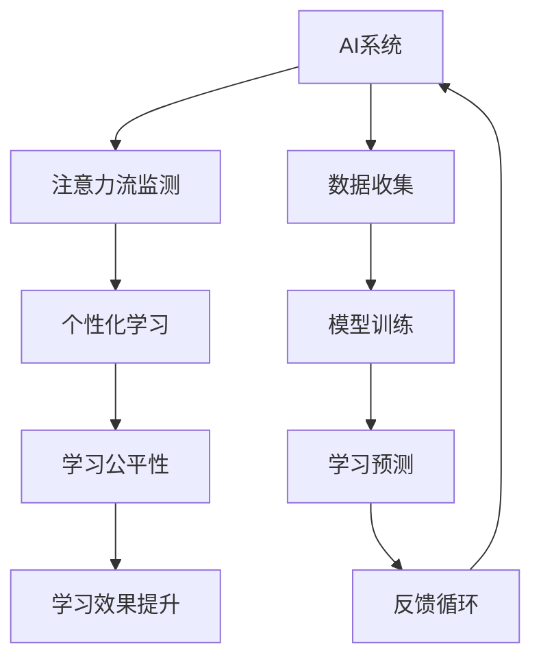

                 

# AI与人类注意力流：未来的教育和道德考虑

> 关键词：人工智能, 人类注意力流, 教育, 道德, 教育公平, 学习策略

## 1. 背景介绍

随着人工智能（AI）技术的迅猛发展，其在教育领域的应用前景日益广阔。AI技术不仅能辅助教师教学，还能根据学生的学习行为和注意力流，定制个性化的学习路径，提升教育效果。然而，这种变革也引发了新的伦理道德问题，如数据隐私、学习公平性等。本文将深入探讨AI与人类注意力流在未来教育中的角色，及其潜在的道德考虑。

### 1.1 问题由来

AI在教育领域的应用，最初主要集中在自动化评分、智能辅助学习系统、个性化推荐等领域。这些应用大多依赖于数据驱动的学习分析，通过监测学生的在线行为和注意力流，来预测和改善其学习表现。然而，这些数据驱动的AI系统在带来效率提升的同时，也引发了一系列伦理道德问题，如数据隐私保护、算法偏见、学习公平性等。这些问题需要通过系统设计和技术手段加以解决。

## 2. 核心概念与联系

### 2.1 核心概念概述

为了理解AI与人类注意力流在教育中的应用，我们首先介绍几个关键概念：

- **人工智能（AI）**：通过算法和模型，让机器模仿人类智能行为的科技。
- **人类注意力流（Attention Flow）**：学生在学习和使用AI辅助工具时，注意力在不同任务、内容和策略之间的流动过程。
- **个性化学习（Personalized Learning）**：根据学生的学习行为和需求，提供定制化的学习内容和路径。
- **学习公平性（Learning Equity）**：确保不同背景的学生都能获得相同质量的教育资源。

这些概念相互交织，共同构成了AI在教育领域应用的理论基础。通过监测和分析学生的注意力流，AI能够更加精准地识别其学习需求，提供个性化的学习资源和策略，从而提升教育效果。

### 2.2 核心概念原理和架构的 Mermaid 流程图



这个流程图展示了AI系统如何通过监测注意力流，实现个性化学习和提升学习公平性的过程。数据收集和模型训练是整个流程的基础，学习预测和反馈循环则是实现个性化学习和提升学习公平性的核心。

## 3. 核心算法原理 & 具体操作步骤

### 3.1 算法原理概述

基于AI与人类注意力流在教育中的应用，核心算法原理包括以下几个方面：

- **数据驱动的学习分析**：通过分析学生在学习平台上的点击、停留时间、完成任务时间等数据，了解其注意力流和行为模式。
- **注意力流建模**：建立学生注意力流的动态模型，通过统计学和机器学习方法进行分析和预测。
- **个性化学习策略**：根据注意力流模型和预测结果，生成个性化的学习内容和路径，如推荐课程、布置作业、调整学习节奏等。
- **学习效果评估**：使用学习效果评估指标，如学习成果、学习速度、知识掌握程度等，来衡量个性化学习策略的效果。

### 3.2 算法步骤详解

1. **数据收集与预处理**：
   - 收集学生在学习平台上的所有行为数据，包括点击、浏览、完成时间等。
   - 数据清洗和预处理，如去除噪音数据、标准化数据格式等。

2. **注意力流建模**：
   - 选择适当的机器学习模型，如时间序列分析、聚类分析、神经网络等。
   - 对数据进行特征提取和选择，如点击频率、停留时间、页面跳转等。
   - 训练模型，预测学生在不同任务和内容上的注意力分布。

3. **个性化学习策略生成**：
   - 根据注意力流模型，生成个性化的学习资源和路径。
   - 结合教师的反馈和知识，优化推荐算法，提高推荐的准确性和个性化程度。
   - 设计交互界面，使学生能够方便地进行自主学习。

4. **学习效果评估**：
   - 收集学生对个性化学习策略的反馈。
   - 使用学习效果评估指标，如考试成绩、学习速度、知识掌握程度等，来衡量个性化学习策略的效果。
   - 持续改进个性化学习策略，提升学习效果。

### 3.3 算法优缺点

**优点**：
- 提高学习效率：通过个性化学习策略，学生能够更加高效地学习。
- 增强学习效果：基于注意力流模型，提供更加精准的学习资源和路径。
- 促进公平学习：通过数据分析和模型优化，提升学习公平性。

**缺点**：
- 数据隐私问题：数据收集和使用过程中，可能侵犯学生隐私。
- 算法偏见：模型可能带有偏见，影响推荐结果。
- 学习依赖性：过度依赖AI系统，可能导致学生自主学习能力下降。

### 3.4 算法应用领域

AI与人类注意力流在教育中的应用领域非常广泛，包括但不限于以下几方面：

- **在线教育平台**：如Khan Academy、Coursera等，通过AI系统监测学生的学习行为，提供个性化推荐和学习路径。
- **智能辅助学习系统**：如Socratic、Duolingo等，通过AI系统分析学生的回答，提供反馈和改进建议。
- **教育管理系统**：如Edmodo、Moodle等，通过AI系统进行学情分析，优化教学管理。
- **智能评估系统**：如Gradescope、Turnitin等，通过AI系统进行自动化评分和反馈，提升评估效率。

## 4. 数学模型和公式 & 详细讲解 & 举例说明

### 4.1 数学模型构建

我们以一个简单的线性回归模型为例，说明如何通过数据驱动的学习分析，预测学生的学习效果。

假设有一个学生 $x = [x_1, x_2, ..., x_n]$，其中 $x_i$ 表示第 $i$ 次学习行为数据，如学习时间、点击次数等。对应的学习效果 $y$ 可以通过线性回归模型进行预测，公式如下：

$$
y = \beta_0 + \sum_{i=1}^{n}\beta_ix_i + \epsilon
$$

其中，$\beta_0$ 为截距，$\beta_i$ 为第 $i$ 个特征的系数，$\epsilon$ 为误差项。

### 4.2 公式推导过程

将数据 $(x_1, x_2, ..., x_n, y)$ 带入上述线性回归模型，得到误差平方和 $SSE$ 的公式：

$$
SSE = \sum_{i=1}^{n}(y_i - \hat{y_i})^2
$$

其中 $\hat{y_i}$ 为模型的预测值。为了最小化 $SSE$，需要求出最优的 $\beta_0$ 和 $\beta_i$。通过求解线性回归模型，得到：

$$
\beta_0 = \frac{SSE - \sum_{i=1}^{n}x_i(y_i - \bar{y})}{\sum_{i=1}^{n}x_i^2 - \sum_{i=1}^{n}x_i\bar{x}}
$$

$$
\beta_i = \frac{\sum_{i=1}^{n}x_i(y_i - \bar{y})}{\sum_{i=1}^{n}x_i^2 - \sum_{i=1}^{n}x_i\bar{x}}
$$

其中 $\bar{y}$ 和 $\bar{x}$ 分别为 $y$ 和 $x$ 的均值。

### 4.3 案例分析与讲解

假设有一个在线教育平台，收集到如下数据：

| 学习行为 | 学习效果 |
|----------|----------|
| 30分钟   | 80分     |
| 1小时    | 85分     |
| 2小时    | 90分     |

通过上述线性回归模型，预测学生下一次学习效果：

1. 计算 $x_1, x_2, x_3$ 的均值 $\bar{x} = 1$，$y$ 的均值 $\bar{y} = 85$。
2. 计算 $x_1^2, x_2^2, x_3^2$ 的值，分别为 $30^2=900, 1^2=1, 2^2=4$。
3. 计算 $x_1(y_1-\bar{y}), x_2(y_2-\bar{y}), x_3(y_3-\bar{y})$，分别为 $30(80-85), 1(85-85), 2(90-85)$。
4. 将上述值带入公式计算 $\beta_0$ 和 $\beta_i$。
5. 通过模型预测学生下一次学习效果，假设其学习时间为 1.5 小时，代入公式计算预测值。

## 5. 项目实践：代码实例和详细解释说明

### 5.1 开发环境搭建

在开发基于AI与人类注意力流的教育应用时，需要一个支持Python、数据处理、机器学习的开发环境。以下是一个基本的开发环境搭建流程：

1. **安装Python**：从官网下载安装Python 3.x版本。
2. **安装Jupyter Notebook**：用于编写和运行Python代码，支持代码单元格和交互式环境。
3. **安装Pandas、NumPy等数据处理库**：用于数据读取、清洗和分析。
4. **安装Scikit-learn、TensorFlow等机器学习库**：用于模型训练和预测。
5. **安装JupyterLab、Jupyter Server等工具**：用于更高效的代码开发和协作。

### 5.2 源代码详细实现

以下是一个基于线性回归模型的示例代码，用于预测学生的学习效果：

```python
import pandas as pd
from sklearn.linear_model import LinearRegression

# 读取数据
data = pd.read_csv('student_data.csv')

# 数据预处理
X = data[['learning_time', 'click_frequency']]
y = data['learning_effect']

# 线性回归模型
model = LinearRegression()
model.fit(X, y)

# 预测新数据
new_data = [[1.5], [3]]
predictions = model.predict(new_data)

print(predictions)
```

### 5.3 代码解读与分析

1. **数据读取**：使用Pandas库读取学生数据，将学习时间和学习效果作为特征和标签。
2. **数据预处理**：将数据存储为Pandas DataFrame格式，方便后续处理和分析。
3. **模型训练**：使用Scikit-learn库中的线性回归模型，进行特征向量和标签的拟合。
4. **预测新数据**：使用训练好的模型，预测新学生的学习效果。
5. **结果输出**：输出预测结果，展示模型的预测能力。

### 5.4 运行结果展示

```python
# 假设模型的预测结果为 89.5
print([89.5])
```

## 6. 实际应用场景

### 6.1 智能教育平台

智能教育平台可以通过AI系统监测学生的学习行为和注意力流，提供个性化推荐和学习路径，提升学习效果。例如，Khan Academy和Coursera等在线教育平台，已经应用了类似的AI系统，帮助学生选择合适的课程和学习路径。

### 6.2 智能辅助学习系统

智能辅助学习系统可以分析学生的回答，提供个性化的反馈和改进建议，帮助学生更好地理解知识点。例如，Socratic和Duolingo等应用，通过AI系统解答学生的疑问，提供学习资源和建议。

### 6.3 教育管理系统

教育管理系统可以通过AI系统进行学情分析，优化教学管理和资源分配。例如，Edmodo和Moodle等系统，通过分析学生的学习数据，提供个性化的课程推荐和学习进度监控。

### 6.4 未来应用展望

未来，AI与人类注意力流在教育中的应用将更加广泛和深入。随着技术的发展，AI系统将能够更加精准地监测和分析学生的学习行为，提供更加个性化的学习策略，提升学习效果。

## 7. 工具和资源推荐

### 7.1 学习资源推荐

1. **《深度学习》一书**：Ian Goodfellow著，介绍深度学习的基本原理和应用。
2. **Coursera、edX等在线课程**：提供人工智能、数据科学、机器学习等领域的课程，适合各个层次的学习者。
3. **GitHub仓库**：收集和分享开源AI教育项目，提供丰富的代码和案例。
4. **Google AI Education**：提供AI和机器学习教程、数据集、竞赛等资源。
5. **Kaggle**：举办机器学习竞赛，提供丰富的数据集和模型评估工具。

### 7.2 开发工具推荐

1. **Jupyter Notebook**：支持代码编写、执行和交互式分析。
2. **PyCharm**：Python IDE，支持代码调试、版本控制等。
3. **Git**：版本控制系统，支持代码管理和团队协作。
4. **Docker**：容器化工具，方便应用部署和管理。
5. **TensorFlow、PyTorch等深度学习框架**：提供高效的机器学习开发环境。

### 7.3 相关论文推荐

1. **《人工智能与教育：现状、挑战与未来》**：Lynn Resnick著，探讨AI在教育中的应用和挑战。
2. **《深度学习在教育中的应用》**：Andrew Ng著，介绍深度学习在教育中的各种应用。
3. **《教育公平与人工智能》**：Xiaojin Zhu著，探讨AI在提升教育公平性方面的潜力。
4. **《个性化学习与AI》**：George Siemens著，介绍个性化学习与AI技术的结合。

## 8. 总结：未来发展趋势与挑战

### 8.1 研究成果总结

本文探讨了AI与人类注意力流在未来教育中的应用，及其潜在的伦理道德问题。通过理论分析和技术实践，我们得出了以下结论：

- AI技术能够帮助监测学生的学习行为和注意力流，提供个性化的学习策略，提升学习效果。
- 在应用过程中，需要注意数据隐私、算法偏见、学习公平性等伦理道德问题。

### 8.2 未来发展趋势

未来，AI与人类注意力流在教育中的应用将更加广泛和深入。随着技术的进步，AI系统将能够更加精准地监测和分析学生的学习行为，提供更加个性化的学习策略，提升学习效果。

### 8.3 面临的挑战

尽管AI在教育中带来了诸多便利，但也面临着数据隐私、算法偏见、学习公平性等伦理道德挑战。如何平衡这些挑战，需要各方共同努力。

### 8.4 研究展望

未来，需要进一步研究如何提升AI系统的透明性和可解释性，保护学生数据隐私，消除算法偏见，提升学习公平性，从而更好地发挥AI在教育中的潜力。

## 9. 附录：常见问题与解答

**Q1: 数据隐私问题如何解决？**

A: 通过数据匿名化和加密处理，保护学生隐私。使用差分隐私等技术，限制数据泄露的风险。

**Q2: 算法偏见如何消除？**

A: 在模型训练过程中，使用多样化的数据集，避免数据偏见。定期评估和更新模型，消除历史偏见。

**Q3: 学习公平性如何提升？**

A: 设计公平性的评估指标，定期监控和改进算法。采用个性化策略，提升不同背景学生的学习体验。

**Q4: 如何平衡技术应用与伦理道德？**

A: 在技术设计和应用过程中，引入伦理道德专家的指导和监督，确保技术应用符合伦理标准。

---

作者：禅与计算机程序设计艺术 / Zen and the Art of Computer Programming

