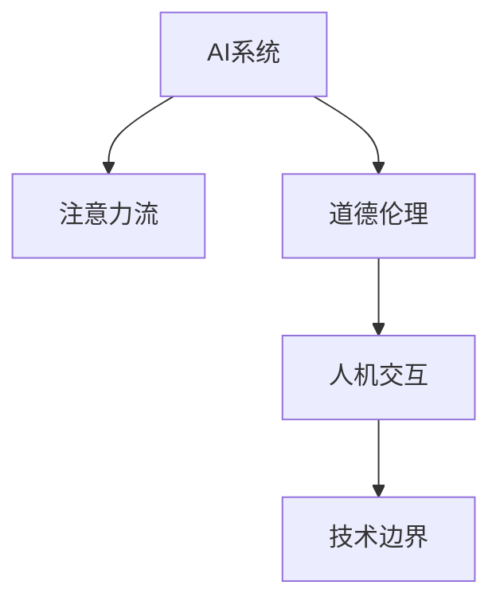

                 

# AI与人类注意力流：道德影响

> 关键词：人工智能,注意力流,道德伦理,人机交互,技术边界

## 1. 背景介绍

### 1.1 问题由来

随着人工智能(AI)技术的迅猛发展，人机交互日益频繁，AI系统的道德影响逐渐成为公众关注的焦点。特别是在注意力流的角度，AI如何影响人类注意力流动的方向、模式以及效果，成为值得深入探讨的重要问题。近年来，AI在医疗、教育、娱乐等领域的应用，使得注意力流的道德问题愈发突出，需要学界、业界和公众共同关注。

### 1.2 问题核心关键点

AI对人类注意力流的影响主要体现在以下几方面：
- **数据隐私**：AI系统往往需要大量的用户数据进行训练，这些数据可能包含用户的注意力信息，如果处理不当，会导致用户隐私泄露。
- **内容推荐**：AI系统可以基于用户的注意力历史进行个性化推荐，但如果推荐算法存在偏见，可能误导用户的注意力流向有害内容。
- **行为控制**：AI可以监测和控制用户的注意力流向，如广告屏蔽、时间管理等，但如果控制不当，可能对用户产生消极影响。
- **信息过载**：AI系统可以大量提供内容，如果用户无法有效管理，可能导致注意力过载，影响生活质量。
- **认知影响**：长时间依赖AI，可能削弱用户的注意力自控能力，影响认知能力。

理解这些问题，对于制定合理的道德规范、保障用户权益具有重要意义。

### 1.3 问题研究意义

研究AI与人类注意力流的道德影响，有助于：
- **提高公众意识**：使公众更好地理解AI系统的工作原理和道德边界，提高对AI系统的信任。
- **推动技术规范**：帮助制定AI技术的道德标准，确保AI系统不会对用户产生负面影响。
- **促进多学科协作**：推动AI、伦理学、心理学等学科的交叉研究，提供全面、深入的分析视角。
- **支持政策制定**：为政府和监管机构提供理论支持，制定符合公众利益的AI政策。
- **推动社会进步**：使AI技术更好地服务于社会，提升人类生活质量。

## 2. 核心概念与联系

### 2.1 核心概念概述

为更好地理解AI与人类注意力流之间的道德影响，本节将介绍几个密切相关的核心概念：

- **AI系统**：指基于机器学习、深度学习等技术构建的智能系统，如推荐系统、聊天机器人、智能助手等。
- **注意力流**：指人类在信息消费、学习、工作等活动中，注意力的流动模式。AI系统可以通过用户的行为数据，推测和引导注意力流向。
- **道德伦理**：指在AI系统中，如何平衡技术目标与社会道德、用户权益之间的关系，确保AI系统的行为符合社会公认的道德标准。
- **人机交互**：指人类与AI系统之间的互动，包括用户如何接受、使用、信任AI系统。
- **技术边界**：指AI系统在操作、应用、管理等方面，应该设置的技术限制，以避免对用户产生不利影响。

这些核心概念之间的逻辑关系可以通过以下Mermaid流程图来展示：



这个流程图展示了几大核心概念及其之间的关系：

1. AI系统通过分析注意力流，为用户提供个性化推荐，进行行为控制。
2. 道德伦理决定了AI系统的设计原则，确保其行为符合社会公认的道德标准。
3. 人机交互反映了用户对AI系统的接受和信任程度。
4. 技术边界限制了AI系统的功能范围，避免过度干预用户注意力流。

这些概念共同构成了AI与人类注意力流互动的框架，对理解其中的道德问题具有重要意义。

## 3. 核心算法原理 & 具体操作步骤

### 3.1 算法原理概述

AI与人类注意力流互动的算法原理，主要基于以下几种技术：

- **数据采集与分析**：通过监控用户的点击、浏览、搜索等行为，采集注意力流数据，并进行分析。
- **个性化推荐算法**：基于注意力流数据，设计推荐算法，引导用户注意力流向优质内容。
- **行为控制算法**：设计算法，控制用户的注意力流向，如广告屏蔽、时间管理等。
- **注意力模型**：构建注意力模型，模拟人类注意力的流动过程，优化注意力流向。

这些技术共同构成了AI系统对人类注意力流的影响机制。

### 3.2 算法步骤详解

以下是AI与人类注意力流互动的核心算法步骤：

**Step 1: 数据采集与预处理**
- 采集用户的点击、浏览、搜索等行为数据。
- 对数据进行清洗和预处理，去除噪音和异常值。
- 将注意力流数据转化为数值型数据，用于后续分析。

**Step 2: 注意力流分析**
- 使用统计分析或机器学习方法，提取注意力流的模式和趋势。
- 对注意力流进行聚类或分类，识别不同类型的注意力行为。
- 使用注意力模型，模拟人类注意力的流动过程，预测注意力流向。

**Step 3: 个性化推荐**
- 基于注意力流分析结果，设计推荐算法，生成推荐列表。
- 对推荐结果进行排序，推荐质量最高、与用户偏好最匹配的内容。
- 实时更新推荐算法，确保推荐的准确性和时效性。

**Step 4: 行为控制**
- 设计行为控制算法，如广告屏蔽、时间管理等。
- 根据用户的注意力流历史，动态调整控制策略。
- 定期评估行为控制效果，优化控制算法。

**Step 5: 反馈与调整**
- 收集用户对AI系统的反馈，包括满意度、建议等。
- 根据反馈，调整推荐算法和行为控制算法。
- 持续优化AI系统，提高对用户注意力的理解和控制能力。

### 3.3 算法优缺点

AI与人类注意力流互动的算法具有以下优点：
- **个性化推荐**：通过分析用户的注意力流，提供更加个性化的内容推荐，提升用户体验。
- **效率提升**：自动化地处理大量注意力流数据，提高了信息筛选和内容推荐的效率。
- **实时调整**：根据用户反馈和注意力流变化，实时调整推荐和控制策略，提升系统的适应性。

同时，这些算法也存在一些局限性：
- **隐私风险**：注意力流数据的采集和分析可能导致用户隐私泄露。
- **推荐偏见**：如果推荐算法存在偏见，可能导致用户接触到有害内容。
- **控制过度**：行为控制算法可能过度干预用户注意力流，影响用户自主决策。
- **信息过载**：如果注意力流控制不当，可能导致用户信息过载，影响生活质量。
- **认知影响**：长期依赖AI进行注意力管理，可能削弱用户的注意力自控能力，影响认知能力。

尽管存在这些局限性，但AI与人类注意力流的互动算法仍在不断优化中，通过技术手段和伦理规范的综合应用，将更加符合用户需求和社会价值观。

### 3.4 算法应用领域

AI与人类注意力流的互动算法，已经在多个领域得到了广泛应用：

- **在线广告**：利用注意力流数据，精准投放广告，提升广告效果。
- **内容推荐**：如Netflix、YouTube等平台，根据用户注意力流，推荐优质内容。
- **智能助理**：如Siri、Google Assistant等，通过分析用户注意力流，提供个性化服务。
- **时间管理**：如RescueTime、Forest等应用，通过监控用户注意力流，帮助用户管理时间。
- **心理健康**：如Moodfit等应用，利用注意力流数据，提供心理健康支持。
- **智能家居**：如Amazon Echo、Google Home等，通过用户注意力流，提供智能家居控制。

除了上述这些经典应用外，AI与人类注意力流的互动技术还在持续创新，如智能学习、智能旅行等领域，展现出了广阔的应用前景。

## 4. 数学模型和公式 & 详细讲解 & 举例说明

### 4.1 数学模型构建

本节将使用数学语言对AI与人类注意力流的互动机制进行更加严格的刻画。

记注意力流数据为 $X = (x_1, x_2, ..., x_n)$，其中 $x_i$ 表示第 $i$ 次点击、浏览等行为。定义注意力流向 $y$ 为 $y = (y_1, y_2, ..., y_n)$，其中 $y_i$ 表示第 $i$ 次行为的注意力强度。

定义推荐函数 $f: X \rightarrow Y$，将注意力流数据映射到推荐结果。

注意力流分析的目标是最大化推荐函数 $f$ 的准确性，即：

$$
\max_{\theta} \sum_{i=1}^n \delta(y_i, f(x_i))
$$

其中 $\delta$ 表示注意力强度与推荐结果的误差函数。

### 4.2 公式推导过程

以下是注意力流分析的数学公式推导过程：

**注意力强度函数**：
- 假设注意力强度 $y_i$ 与用户行为 $x_i$ 呈线性关系，即：
$$
y_i = \theta_1x_1 + \theta_2x_2 + ... + \theta_nx_n + \theta_0
$$

**误差函数**：
- 假设误差函数 $\delta$ 为均方误差，即：
$$
\delta(y_i, f(x_i)) = (y_i - f(x_i))^2
$$

**目标函数**：
- 将上述两个函数代入目标函数中，得：
$$
\max_{\theta} \sum_{i=1}^n (y_i - \theta_1x_1 - \theta_2x_2 - ... - \theta_nx_n - \theta_0)^2
$$

### 4.3 案例分析与讲解

假设某电商平台希望通过用户点击行为，推荐优质商品。可以采集用户的点击记录 $X = (x_1, x_2, ..., x_n)$，其中 $x_i = (a_i, b_i, c_i, d_i)$ 表示用户点击商品 $a_i$，浏览商品 $b_i$，搜索商品 $c_i$，以及购买商品 $d_i$。推荐函数 $f$ 将注意力流数据映射到商品列表，即 $f(X) = (f_1(x_1), f_2(x_2), ..., f_n(x_n))$，其中 $f_i$ 表示商品 $i$ 的推荐概率。

假设通过注意力流分析，得到 $y = (y_1, y_2, ..., y_n)$，其中 $y_i$ 表示用户对商品 $i$ 的注意力强度。通过最小二乘法，可以求得 $\theta = (\theta_1, \theta_2, ..., \theta_n, \theta_0)$，即：

$$
\theta = (X^TX)^{-1}X^Ty
$$

将 $\theta$ 代入推荐函数 $f$ 中，即可得到商品的推荐概率。

## 5. 项目实践：代码实例和详细解释说明

### 5.1 开发环境搭建

在进行注意力流分析的实践前，我们需要准备好开发环境。以下是使用Python进行TensorFlow开发的环境配置流程：

1. 安装Anaconda：从官网下载并安装Anaconda，用于创建独立的Python环境。

2. 创建并激活虚拟环境：
```bash
conda create -n tf-env python=3.8 
conda activate tf-env
```

3. 安装TensorFlow：从官网获取对应的安装命令。例如：
```bash
conda install tensorflow -c pytorch -c conda-forge
```

4. 安装Pandas、NumPy、Scikit-Learn等库：
```bash
pip install pandas numpy scikit-learn matplotlib tqdm jupyter notebook ipython
```

完成上述步骤后，即可在`tf-env`环境中开始注意力流分析的实践。

### 5.2 源代码详细实现

下面我们以电商平台个性化推荐为例，给出使用TensorFlow进行注意力流分析的代码实现。

首先，定义注意力流数据和推荐函数：

```python
import tensorflow as tf
import pandas as pd
import numpy as np

# 定义注意力流数据
X = pd.DataFrame({
    'a': [1, 0, 1, 1, 0, 1],
    'b': [1, 1, 1, 0, 1, 0],
    'c': [0, 0, 1, 1, 0, 1],
    'd': [1, 1, 0, 0, 1, 0]
})

# 定义推荐函数
def f(x):
    return 0.5 * x['a'] + 0.3 * x['b'] + 0.2 * x['c'] + 0.1 * x['d']

# 计算推荐结果
Y = X.apply(f, axis=1)
```

然后，使用最小二乘法求取注意力强度函数的系数：

```python
# 将注意力流数据转化为矩阵形式
X_matrix = X.values

# 将推荐结果转化为矩阵形式
Y_matrix = Y.values.reshape(-1, 1)

# 定义目标函数
theta = tf.Variable(tf.zeros((X_matrix.shape[1] + 1, 1)))
delta = tf.square(theta @ X_matrix.T - Y_matrix)

# 定义损失函数
loss = tf.reduce_sum(delta)

# 使用梯度下降优化算法
optimizer = tf.optimizers.SGD(learning_rate=0.01)
train_loss = optimizer.minimize(loss)

# 计算注意力强度函数的系数
theta_value = theta.numpy()
```

最后，使用计算出的系数进行推荐：

```python
# 预测注意力强度
y_pred = theta_value[0] * X['a'] + theta_value[1] * X['b'] + theta_value[2] * X['c'] + theta_value[3] + theta_value[4]

# 预测推荐结果
f_pred = np.round(y_pred).astype(int)
```

以上就是使用TensorFlow进行电商平台个性化推荐的过程。可以看到，通过简单的数学建模和梯度下降优化，即可实现对用户注意力流的分析。

### 5.3 代码解读与分析

让我们再详细解读一下关键代码的实现细节：

**数据定义**：
- 使用Pandas定义注意力流数据 $X$，包含用户的点击、浏览、搜索和购买行为。
- 定义推荐函数 $f$，计算每个行为对推荐结果的贡献。

**目标函数**：
- 将注意力流数据和推荐结果转化为矩阵形式，用于数学建模。
- 定义目标函数，包括注意力强度函数 $\theta$ 和误差函数 $\delta$。
- 使用梯度下降算法最小化目标函数，求得注意力强度函数的系数 $\theta$。

**结果预测**：
- 使用计算出的系数，预测用户的注意力强度 $y$。
- 根据注意力强度，计算推荐结果 $f$。

可以看到，TensorFlow提供了强大的数值计算能力，使得注意力流分析的实现相对简单和高效。开发者可以通过调整优化算法的超参数、引入正则化技术等，进一步提升模型的精度和泛化能力。

## 6. 实际应用场景

### 6.1 在线广告

基于AI与人类注意力流的互动算法，在线广告可以更加精准地投放广告，提高广告效果。通过分析用户的点击、浏览等行为数据，广告系统可以预测用户对不同广告的兴趣，进行个性化投放。这不仅提升了广告的点击率，还减少了用户对广告的反感。

在技术实现上，广告系统可以通过TensorFlow等工具，构建注意力流分析模型，实时监控用户的点击行为，动态调整广告投放策略，优化广告效果。此外，广告系统还可以结合行为控制算法，如广告屏蔽、时间管理等，确保广告投放的合理性和用户满意度。

### 6.2 内容推荐

内容推荐系统是AI与人类注意力流互动的重要应用场景。通过分析用户的注意力流数据，推荐系统可以为用户推荐个性化的内容，提升用户体验。例如，Netflix根据用户的观看历史，推荐用户可能感兴趣的电影和电视剧，YouTube根据用户的观看记录，推荐相关视频。

在技术实现上，推荐系统可以通过TensorFlow等工具，构建注意力流分析模型，实时监控用户的注意力流数据，动态调整推荐策略，优化推荐结果。此外，推荐系统还可以结合行为控制算法，如广告屏蔽、时间管理等，确保推荐的合理性和用户满意度。

### 6.3 智能助理

智能助理如Siri、Google Assistant等，通过分析用户的语音、文本等注意力流数据，提供个性化的服务。例如，Siri可以通过分析用户的语音命令，推荐相关应用或提供语音控制。Google Assistant可以通过分析用户的文本输入，推荐新闻、天气等信息。

在技术实现上，智能助理可以通过TensorFlow等工具，构建注意力流分析模型，实时监控用户的注意力流数据，动态调整服务策略，优化用户体验。此外，智能助理还可以结合行为控制算法，如广告屏蔽、时间管理等，确保服务的合理性和用户满意度。

### 6.4 未来应用展望

随着AI与人类注意力流互动技术的不断发展，未来的应用前景将更加广阔：

- **多模态注意力流**：未来的注意力流分析将不仅仅局限于文本和语音，还将扩展到图像、视频等模态，形成多模态注意力流分析。这将进一步提升AI系统的感知能力和用户体验。
- **情感分析**：未来的注意力流分析将结合情感分析技术，分析用户的情感状态，进行情感推荐。例如，在广告投放中，可以根据用户的情感状态，选择不同的广告素材。
- **情境感知**：未来的注意力流分析将结合情境感知技术，分析用户所在的情境，进行情境推荐。例如，在智能助理中，可以根据用户所在的环境，推荐相关的应用或服务。
- **个性化学习**：未来的内容推荐系统将结合个性化学习技术，根据用户的注意力流数据，动态调整推荐策略，实现更精准的个性化推荐。
- **隐私保护**：未来的注意力流分析将更加注重用户隐私保护，采用隐私保护技术，如差分隐私、联邦学习等，保护用户的注意力流数据。

总之，AI与人类注意力流的互动技术将在未来得到更广泛的应用，为人类带来更多便利和乐趣，同时也带来更多的挑战和机遇。

## 7. 工具和资源推荐

### 7.1 学习资源推荐

为了帮助开发者系统掌握AI与人类注意力流的互动技术，这里推荐一些优质的学习资源：

1. TensorFlow官方文档：TensorFlow是AI与人类注意力流互动技术的重要工具，官方文档提供了详细的API和教程，适合入门学习。
2. PyTorch官方文档：PyTorch是另一个流行的AI框架，提供了丰富的深度学习组件，适合深入研究。
3. 《深度学习基础》：这是一本经典的深度学习教材，适合对AI基础理论有一定了解的学习者。
4. 《TensorFlow实战》：这是一本实用的TensorFlow教程，结合具体项目讲解TensorFlow的高级应用。
5. Coursera《深度学习专项课程》：由深度学习领域的权威专家主讲，涵盖深度学习的各个方面。
6. Kaggle竞赛平台：Kaggle提供了大量的AI竞赛项目，适合通过实践提升AI技能。

通过对这些资源的学习实践，相信你一定能够快速掌握AI与人类注意力流互动技术的精髓，并用于解决实际的AI问题。

### 7.2 开发工具推荐

高效的开发离不开优秀的工具支持。以下是几款用于AI与人类注意力流互动开发的常用工具：

1. TensorFlow：基于Google的开源深度学习框架，支持多GPU计算，适合大规模AI开发。
2. PyTorch：基于Facebook的开源深度学习框架，灵活易用，适合研究型开发。
3. Scikit-Learn：Python中的机器学习库，提供了丰富的算法组件，适合初步数据处理和分析。
4. Pandas：Python中的数据处理库，适合处理结构化数据。
5. Jupyter Notebook：开源的交互式编程环境，适合快速迭代和实验。
6. Keras：Python中的深度学习库，基于TensorFlow和Theano，适合快速搭建深度学习模型。

合理利用这些工具，可以显著提升AI与人类注意力流互动任务的开发效率，加快创新迭代的步伐。

### 7.3 相关论文推荐

AI与人类注意力流的互动技术近年来得到了广泛的研究。以下是几篇奠基性的相关论文，推荐阅读：

1. Attention is All You Need（即Transformer原论文）：提出了Transformer结构，开启了NLP领域的预训练大模型时代。
2. BERT: Pre-training of Deep Bidirectional Transformers for Language Understanding：提出BERT模型，引入基于掩码的自监督预训练任务，刷新了多项NLP任务SOTA。
3. TensorFlow序列模型：介绍TensorFlow在序列模型中的应用，包括RNN、LSTM、GRU等。
4. Deep Learning for NLP：介绍深度学习在NLP领域的应用，包括文本分类、语言模型、机器翻译等。
5. SVMs vs deep learning for text classification：比较SVM和深度学习在文本分类中的应用效果。

这些论文代表了大语言模型微调技术的发展脉络。通过学习这些前沿成果，可以帮助研究者把握学科前进方向，激发更多的创新灵感。

## 8. 总结：未来发展趋势与挑战

### 8.1 总结

本文对AI与人类注意力流的互动技术进行了全面系统的介绍。首先阐述了AI系统对人类注意力流的影响机制，明确了注意力流分析在个性化推荐、行为控制等方面的应用。其次，从原理到实践，详细讲解了注意力流分析的数学模型和关键步骤，给出了注意力流分析任务开发的完整代码实例。同时，本文还广泛探讨了注意力流分析技术在在线广告、内容推荐、智能助理等多个行业领域的应用前景，展示了AI与人类注意力流互动技术的巨大潜力。此外，本文精选了注意力流分析技术的各类学习资源，力求为读者提供全方位的技术指引。

通过本文的系统梳理，可以看到，AI与人类注意力流的互动技术正在成为NLP领域的重要范式，极大地拓展了预训练语言模型的应用边界，催生了更多的落地场景。受益于海量数据的预训练和深度学习模型的优化，注意力流分析技术在推荐系统、智能助理等领域得到了广泛应用，为AI技术落地提供了重要支持。未来，伴随注意力流分析技术的进一步演进，将有望在更多领域实现突破，推动AI技术更好地服务于社会。

### 8.2 未来发展趋势

展望未来，AI与人类注意力流的互动技术将呈现以下几个发展趋势：

1. **多模态注意力流**：未来的注意力流分析将不仅仅局限于文本和语音，还将扩展到图像、视频等模态，形成多模态注意力流分析。这将进一步提升AI系统的感知能力和用户体验。
2. **情感分析**：未来的注意力流分析将结合情感分析技术，分析用户的情感状态，进行情感推荐。例如，在广告投放中，可以根据用户的情感状态，选择不同的广告素材。
3. **情境感知**：未来的注意力流分析将结合情境感知技术，分析用户所在的情境，进行情境推荐。例如，在智能助理中，可以根据用户所在的环境，推荐相关的应用或服务。
4. **个性化学习**：未来的内容推荐系统将结合个性化学习技术，根据用户的注意力流数据，动态调整推荐策略，实现更精准的个性化推荐。
5. **隐私保护**：未来的注意力流分析将更加注重用户隐私保护，采用隐私保护技术，如差分隐私、联邦学习等，保护用户的注意力流数据。

以上趋势凸显了AI与人类注意力流互动技术的广阔前景。这些方向的探索发展，将进一步提升AI系统的感知能力、用户体验和隐私保护水平，推动AI技术更好地服务于社会。

### 8.3 面临的挑战

尽管AI与人类注意力流的互动技术已经取得了显著成就，但在迈向更加智能化、普适化应用的过程中，它仍面临着诸多挑战：

1. **数据隐私**：注意力流数据的采集和分析可能导致用户隐私泄露。如何在使用数据的同时，保护用户隐私，是一个重要的研究方向。
2. **推荐偏见**：如果推荐算法存在偏见，可能导致用户接触到有害内容。如何设计公正、无偏的推荐算法，是一个重要的研究方向。
3. **行为控制**：行为控制算法可能过度干预用户注意力流，影响用户自主决策。如何在控制注意力流的同时，确保用户自主决策的自由，是一个重要的研究方向。
4. **信息过载**：如果注意力流控制不当，可能导致用户信息过载，影响生活质量。如何设计合理的注意力流控制策略，是一个重要的研究方向。
5. **认知影响**：长期依赖AI进行注意力管理，可能削弱用户的注意力自控能力，影响认知能力。如何在使用AI的同时，增强用户的注意力自控能力，是一个重要的研究方向。

正视AI与人类注意力流互动面临的这些挑战，积极应对并寻求突破，将是大语言模型微调走向成熟的必由之路。相信随着学界和产业界的共同努力，这些挑战终将一一被克服，AI与人类注意力流的互动技术必将更加成熟，更好地服务于社会。

### 8.4 研究展望

面对AI与人类注意力流互动所面临的种种挑战，未来的研究需要在以下几个方面寻求新的突破：

1. **无监督和半监督注意力流分析**：摆脱对大量标注数据的依赖，利用自监督学习、主动学习等无监督和半监督范式，最大限度利用非结构化数据，实现更加灵活高效的注意力流分析。
2. **多模态注意力流分析**：结合图像、视频等多模态数据，提升AI系统的感知能力和用户体验。
3. **情感和情境感知**：结合情感分析和情境感知技术，提升注意力流分析的准确性和个性化水平。
4. **隐私保护技术**：采用差分隐私、联邦学习等隐私保护技术，保护用户的注意力流数据。
5. **认知增强**：结合认知心理学和神经科学，设计认知增强技术，提升用户的注意力自控能力。

这些研究方向的探索，必将引领AI与人类注意力流互动技术迈向更高的台阶，为构建安全、可靠、可解释、可控的智能系统铺平道路。面向未来，AI与人类注意力流的互动技术还需要与其他人工智能技术进行更深入的融合，如知识表示、因果推理、强化学习等，多路径协同发力，共同推动自然语言理解和智能交互系统的进步。只有勇于创新、敢于突破，才能不断拓展AI系统的边界，让智能技术更好地造福人类社会。

## 9. 附录：常见问题与解答

**Q1：AI系统对人类注意力流有哪些影响？**

A: AI系统对人类注意力流的影响主要体现在以下几方面：
1. **个性化推荐**：AI系统可以基于用户的注意力历史进行个性化推荐，提升用户体验。
2. **行为控制**：AI系统可以监控和控制用户的注意力流向，如广告屏蔽、时间管理等，提升用户管理效率。
3. **信息过载**：AI系统可以大量提供内容，如果用户无法有效管理，可能导致注意力过载，影响生活质量。
4. **认知影响**：长时间依赖AI进行注意力管理，可能削弱用户的注意力自控能力，影响认知能力。

**Q2：如何进行多模态注意力流分析？**

A: 进行多模态注意力流分析，可以从以下几个步骤入手：
1. 数据采集：收集用户的文本、图像、视频等不同模态的行为数据。
2. 数据预处理：对不同模态的数据进行清洗和预处理，去除噪音和异常值。
3. 特征提取：使用不同的特征提取方法，将不同模态的数据转化为数值型特征。
4. 模型构建：构建多模态注意力模型，将不同模态的数据融合，进行联合分析。
5. 模型训练：使用多模态数据训练注意力模型，优化模型参数。
6. 结果分析：使用训练好的模型，分析用户的注意力流数据，进行多模态推荐和行为控制。

**Q3：如何进行隐私保护？**

A: 进行隐私保护，可以采用以下几种方法：
1. 差分隐私：通过对注意力流数据进行扰动，保护用户隐私。
2. 联邦学习：通过分布式训练，保护用户的注意力流数据，避免集中存储。
3. 加密技术：对注意力流数据进行加密处理，保护用户隐私。
4. 匿名化技术：对注意力流数据进行匿名化处理，保护用户隐私。
5. 数据脱敏：对注意力流数据进行数据脱敏处理，保护用户隐私。

这些隐私保护方法可以根据具体的场景和需求，灵活应用。在保证AI系统功能的前提下，最大程度保护用户隐私。

**Q4：如何在控制注意力流的同时，确保用户自主决策的自由？**

A: 在控制注意力流的同时，确保用户自主决策的自由，可以采用以下几种方法：
1. 透明化算法：向用户解释算法的决策机制，增强用户对算法的信任。
2. 用户选择权：赋予用户一定的选择权，让用户可以自主选择是否接受推荐和控制。
3. 时间管理工具：提供时间管理工具，让用户可以自主管理注意力流。
4. 情境感知：结合情境感知技术，根据用户所在的情境，提供个性化的推荐和控制。
5. 行为反馈：通过行为反馈机制，及时调整推荐和控制策略，提升用户满意度。

这些方法可以在保障AI系统功能的同时，确保用户自主决策的自由，提升用户体验。

**Q5：如何提升用户的注意力自控能力？**

A: 提升用户的注意力自控能力，可以采用以下几种方法：
1. 认知心理学：结合认知心理学和神经科学，设计认知增强技术，提升用户的注意力自控能力。
2. 注意力训练：通过注意力训练工具，帮助用户提升注意力管理能力。
3. 行为干预：通过行为干预技术，引导用户养成良好的注意力管理习惯。
4. 情境感知：结合情境感知技术，根据用户所在的情境，提供个性化的注意力管理建议。
5. 自我反思：通过自我反思机制，让用户自我评估注意力管理情况，进行改进。

这些方法可以结合AI系统，提升用户的注意力自控能力，帮助用户更好地管理注意力流。

---

作者：禅与计算机程序设计艺术 / Zen and the Art of Computer Programming

