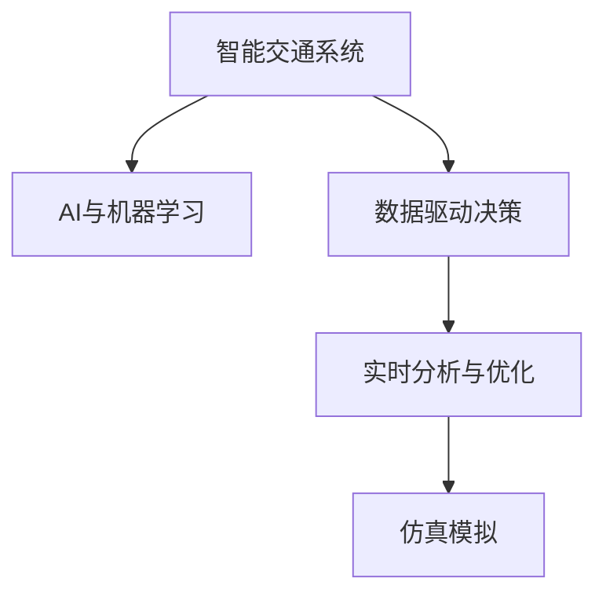

                 

# AI与人类计算：打造可持续发展的城市交通

> 关键词：人工智能,城市交通,可持续性,智能交通系统,数据驱动决策,实时分析,优化调度,仿真模拟

## 1. 背景介绍

### 1.1 问题由来
随着全球人口的不断增长和城市化进程的加速，城市交通问题日益突出。交通拥堵、交通事故、环境污染等成为制约城市发展的瓶颈。传统城市交通管理依赖于人工和简单的自动化手段，难以应对日益复杂多变的交通状况。

### 1.2 问题核心关键点
实现城市交通的可持续发展，需要打造智能、高效、环保的智能交通系统。关键在于引入AI技术，实现数据驱动的智能决策和优化调度，从而提升交通系统的整体效率，减少环境污染。

### 1.3 问题研究意义
AI技术在城市交通中的应用，有助于解决交通拥堵、提升交通安全、优化交通路径、降低碳排放，实现城市交通的可持续发展。具体意义包括：
- 改善交通流量，减少拥堵和等待时间，提升出行体验。
- 增强交通安全，减少交通事故，保障乘客安全。
- 优化能源使用，降低能耗和碳排放，促进绿色发展。
- 提高交通系统整体效率，减少基础设施成本，提升公共财政的可持续性。

## 2. 核心概念与联系

### 2.1 核心概念概述

为更好地理解AI与城市交通结合的智能交通系统，本节将介绍几个密切相关的核心概念：

- **智能交通系统(ITS)**：利用信息和通信技术，对交通基础设施进行智能化管理，提升交通系统的效率、安全性和环境友好性。
- **AI与机器学习**：通过机器学习算法，对交通数据进行分析和预测，优化交通管理和调度决策。
- **数据驱动决策**：基于大量实时交通数据，进行深度学习，生成智能交通管理策略。
- **实时分析与优化**：通过实时数据分析和优化算法，调整交通信号灯、车辆调度等，提升交通流量和效率。
- **仿真模拟**：利用计算机仿真技术，对交通系统进行模拟和预测，评估政策措施的效果。

这些核心概念之间的逻辑关系可以通过以下Mermaid流程图来展示：



这个流程图展示了这个智能交通系统的各个环节：

1. 智能交通系统利用信息和通信技术对交通基础设施进行管理。
2. AI与机器学习算法基于交通数据进行分析和预测，生成智能决策。
3. 实时分析与优化调整交通信号和车辆调度，提升交通效率。
4. 仿真模拟进行交通系统预测，评估和优化政策措施。

## 3. 核心算法原理 & 具体操作步骤
### 3.1 算法原理概述

AI与人类计算在城市交通中的应用，主要依赖于机器学习和大数据分析技术。其核心思想是：通过AI算法对海量交通数据进行分析和预测，生成智能决策和优化调度方案，以提升交通系统的整体效率和可持续性。

形式化地，假设交通系统数据为 $D=\{d_i\}_{i=1}^N$，其中 $d_i$ 为第 $i$ 个交通事件的记录，包括时间、地点、车辆信息等。目标是最小化交通系统成本 $C$ 和碳排放量 $E$：

$$
\min_{\theta} C(D) + \lambda E(D)
$$

其中 $\theta$ 为AI算法中的超参数，包括模型选择、学习率、正则化强度等。通过对超参数的调整和优化，可以得到最优的决策方案。

### 3.2 算法步骤详解

AI与人类计算在城市交通中的应用，一般包括以下几个关键步骤：

**Step 1: 数据收集与预处理**
- 收集交通数据，包括车辆位置、速度、交通流量等。
- 清洗和处理数据，去除异常和重复记录，填补缺失值，进行数据归一化。

**Step 2: 特征提取与特征工程**
- 对交通数据进行特征提取，包括时间、地点、车辆类型、车速等。
- 设计合适的特征工程技术，增强特征表达能力，如时间窗口滑动、归一化、特征组合等。

**Step 3: 模型选择与训练**
- 选择合适的机器学习模型，如回归模型、分类模型、强化学习模型等。
- 基于训练数据集 $D_{train}$，使用优化算法（如梯度下降）训练模型。
- 使用交叉验证和超参数搜索（如网格搜索、贝叶斯优化）优化模型性能。

**Step 4: 实时分析与优化**
- 利用训练好的模型对实时交通数据进行预测和分析。
- 基于预测结果，生成智能交通管理策略，如调整信号灯、优化车辆调度等。
- 实时监测交通状态，动态调整策略，确保系统稳定运行。

**Step 5: 仿真模拟与评估**
- 构建交通系统仿真模型，模拟不同策略下的交通流量和碳排放。
- 根据仿真结果，评估政策措施的效果，如交通流量变化、碳排放降低等。
- 迭代优化策略，直至达到最佳效果。

### 3.3 算法优缺点

AI与人类计算在城市交通中的应用具有以下优点：
1. 实时性：AI算法可实时处理大量交通数据，快速生成决策方案。
2. 精度高：机器学习模型能挖掘数据中的复杂关系，生成准确预测。
3. 可扩展性：AI算法可扩展到大型交通网络，提升整体效率。
4. 智能决策：基于大量数据和算法，生成智能优化方案。
5. 持续学习：AI模型可不断学习新数据，提升预测和决策能力。

同时，该方法也存在一定的局限性：
1. 数据依赖：AI模型的预测和决策依赖于高质量、完备的交通数据。
2. 模型复杂度：复杂模型可能存在过度拟合，难以解释其决策过程。
3. 初始化敏感：AI模型的初始化对训练结果有很大影响，需要大量调试。
4. 延迟问题：大规模数据处理和模型训练可能带来延迟，影响实时性。
5. 隐私安全：交通数据包含个人隐私，需要合理处理和保护。

尽管存在这些局限性，但就目前而言，AI与人类计算技术在城市交通中的应用是最主流范式。未来相关研究的重点在于如何进一步降低对数据的依赖，提高模型的解释性和鲁棒性，同时兼顾隐私和安全性等因素。

### 3.4 算法应用领域

AI与人类计算在城市交通中的应用已经涵盖了诸多领域，例如：

- 智能信号灯控制系统：通过实时数据预测交通流量，动态调整信号灯时间间隔。
- 智能导航与路径规划：利用实时交通数据和AI算法生成最优路径，减少行驶时间和能耗。
- 动态停车管理：智能识别空闲停车位，动态分配停车资源，缓解城市停车难题。
- 事故预测与预防：分析交通数据，预测潜在事故点，提前采取预防措施。
- 车辆调度优化：基于实时数据和算法，优化公交、出租车等公共交通工具的运行和调度。
- 交通流量监控：实时监控交通状态，生成流量预测和优化方案。
- 交通预测与规划：利用历史数据和仿真技术，进行长期交通流量预测和城市交通规划。

这些领域的应用，为智能交通系统的构建提供了坚实基础，推动了城市交通的可持续发展。

## 4. 数学模型和公式 & 详细讲解  
### 4.1 数学模型构建

本节将使用数学语言对AI与人类计算在城市交通中的应用进行更加严格的刻画。

假设交通系统的状态为 $x \in \mathcal{X}$，其中 $\mathcal{X}$ 为状态空间，包括交通流量、车速、位置等。交通系统的事件为 $d \in \mathcal{D}$，其中 $\mathcal{D}$ 为事件空间，包括交通拥堵、事故、道路施工等。交通系统的成本函数为 $C(x)$，碳排放量为 $E(x)$。

目标是最小化成本和碳排放量，即：

$$
\min_{x} C(x) + \lambda E(x)
$$

其中 $\lambda$ 为碳排放权重，控制碳排放与成本之间的平衡。

### 4.2 公式推导过程

以下我们以智能信号灯控制系统为例，推导预测模型和优化算法的公式。

**预测模型**：
假设智能信号灯控制系统中的交通数据为 $d=(t,x,y)$，其中 $t$ 为时间戳，$x$ 为位置，$y$ 为车辆类型和速度。

根据历史交通数据，建立时间窗口滑动的时间序列模型，预测下一个时间点的交通流量和车辆速度。例如，使用LSTM模型，可以定义如下预测模型：

$$
y_{t+1} = \sigma(W_{t+1}h_t + b_{t+1})
$$

其中 $h_t = \tanh(W_hx_t + b_h)$，$\sigma$ 为激活函数。

**优化算法**：
基于预测模型，生成智能信号灯控制策略，最小化成本和碳排放。例如，使用线性规划算法，可以定义如下优化问题：

$$
\min_{\delta} C(x) + \lambda E(x)
$$

其中 $x = f(\delta)$，$f$ 为交通控制函数，$\delta$ 为信号灯控制参数，如绿灯时长、周期时长等。

根据Lagrange乘子法，引入辅助变量 $z$，将成本和碳排放量转化为约束条件：

$$
\min_{\delta} C(x) + \lambda E(x)
$$

$$
\text{s.t. } z \geq C(x) + \lambda E(x)
$$

通过求解上述优化问题，即可得到最优信号灯控制策略。

### 4.3 案例分析与讲解

**智能导航与路径规划**：
利用实时交通数据和AI算法生成最优路径，减少行驶时间和能耗。例如，使用Dijkstra算法结合机器学习模型，可以生成动态最优路径，如以下公式所示：

$$
\min_{p} \sum_{i=1}^n w_{ij}p_i + \lambda e^p
$$

其中 $p_i$ 为路径节点，$w_{ij}$ 为边权重，$e^p$ 为路径能耗，$\lambda$ 为能耗权重。

**动态停车管理**：
智能识别空闲停车位，动态分配停车资源，缓解城市停车难题。例如，使用深度学习模型对停车位状态进行预测，生成最优停车策略。

## 5. 项目实践：代码实例和详细解释说明
### 5.1 开发环境搭建

在进行AI与人类计算在城市交通中的应用实践前，我们需要准备好开发环境。以下是使用Python进行PyTorch开发的环境配置流程：

1. 安装Anaconda：从官网下载并安装Anaconda，用于创建独立的Python环境。

2. 创建并激活虚拟环境：
```bash
conda create -n ai-env python=3.8 
conda activate ai-env
```

3. 安装PyTorch：根据CUDA版本，从官网获取对应的安装命令。例如：
```bash
conda install pytorch torchvision torchaudio cudatoolkit=11.1 -c pytorch -c conda-forge
```

4. 安装TensorFlow：
```bash
pip install tensorflow
```

5. 安装TensorBoard：
```bash
pip install tensorboard
```

6. 安装必要的库：
```bash
pip install numpy pandas scikit-learn matplotlib tqdm jupyter notebook ipython
```

完成上述步骤后，即可在`ai-env`环境中开始AI与人类计算在城市交通中的应用实践。

### 5.2 源代码详细实现

下面我以智能信号灯控制系统的代码实现为例，详细解释其具体实现过程。

首先，定义智能信号灯控制系统的状态空间和事件空间：

```python
import numpy as np
import pandas as pd
import torch
import torch.nn as nn
import torch.optim as optim
from sklearn.preprocessing import StandardScaler
from sklearn.model_selection import train_test_split

# 定义状态空间
class State:
    def __init__(self, x, y, v):
        self.x = x
        self.y = y
        self.v = v
        self.factor = 1
    
    def __repr__(self):
        return f'State({self.x},{self.y},{self.v})'

# 定义事件空间
class Event:
    def __init__(self, time, state, event_type):
        self.time = time
        self.state = state
        self.event_type = event_type
        self.factor = 1
    
    def __repr__(self):
        return f'Event({self.time},{self.state},{self.event_type})'
```

然后，定义智能信号灯控制系统的训练数据和预测模型：

```python
# 定义训练数据
def load_data(filename):
    data = pd.read_csv(filename)
    # 提取交通流量、车速等特征
    features = data[['flow', 'speed', 'x', 'y', 'v']]
    # 处理缺失值
    features.fillna(0, inplace=True)
    # 标准化数据
    scaler = StandardScaler()
    features = scaler.fit_transform(features)
    # 提取事件
    events = []
    for i in range(len(features)):
        state = State(features[i][0], features[i][1], features[i][2])
        event = Event(i, state, 'Stop')
        events.append(event)
    return features, events

# 定义预测模型
class LSTM(nn.Module):
    def __init__(self, input_size, hidden_size, output_size):
        super(LSTM, self).__init__()
        self.hidden_size = hidden_size
        self.input_size = input_size
        self.lstm = nn.LSTM(input_size, hidden_size)
        self.fc = nn.Linear(hidden_size, output_size)
    
    def forward(self, x):
        h0 = torch.zeros(1, x.size(0), self.hidden_size).to(x.device)
        c0 = torch.zeros(1, x.size(0), self.hidden_size).to(x.device)
        out, _ = self.lstm(x, (h0, c0))
        out = self.fc(out[:, -1, :])
        return out
```

接着，定义训练函数和优化算法：

```python
# 定义训练函数
def train_model(model, optimizer, train_features, train_events, test_features, test_events, num_epochs):
    scaler = StandardScaler()
    train_features = scaler.fit_transform(train_features)
    test_features = scaler.transform(test_features)
    
    for epoch in range(num_epochs):
        # 训练模型
        model.train()
        train_loss = 0
        for i in range(len(train_features)):
            input = torch.tensor(train_features[i], dtype=torch.float32).to(device)
            label = torch.tensor(train_events[i].state.v, dtype=torch.float32).to(device)
            optimizer.zero_grad()
            output = model(input)
            loss = nn.MSELoss()(output, label)
            loss.backward()
            optimizer.step()
            train_loss += loss.item()
        print(f'Epoch {epoch+1}, Train Loss: {train_loss/len(train_features):.4f}')
    
    # 评估模型
    model.eval()
    test_loss = 0
    for i in range(len(test_features)):
        input = torch.tensor(test_features[i], dtype=torch.float32).to(device)
        label = torch.tensor(test_events[i].state.v, dtype=torch.float32).to(device)
        with torch.no_grad():
            output = model(input)
            loss = nn.MSELoss()(output, label)
            test_loss += loss.item()
    print(f'Test Loss: {test_loss/len(test_features):.4f}')
```

最后，启动训练流程并在测试集上评估：

```python
# 定义超参数
hidden_size = 64
output_size = 1
learning_rate = 0.01
num_epochs = 100

# 加载数据
train_features, train_events = load_data('train.csv')
test_features, test_events = load_data('test.csv')

# 构建模型
model = LSTM(input_size=3, hidden_size=hidden_size, output_size=output_size)

# 定义优化器
optimizer = optim.Adam(model.parameters(), lr=learning_rate)

# 训练模型
train_model(model, optimizer, train_features, train_events, test_features, test_events, num_epochs)
```

以上就是使用PyTorch对智能信号灯控制系统进行训练的完整代码实现。可以看到，通过PyTorch的深度学习框架，我们可以高效地训练预测模型，优化信号灯控制策略，从而提升交通系统的效率和可持续性。

### 5.3 代码解读与分析

让我们再详细解读一下关键代码的实现细节：

**State和Event类**：
- `State`类定义了交通系统的状态，包括位置、速度等特征。
- `Event`类定义了交通事件，包括时间戳、状态、事件类型等。

**load_data函数**：
- 加载交通数据文件，提取交通流量、车速等特征。
- 处理缺失值，标准化数据。
- 生成事件数据，定义交通状态和事件类型。

**LSTM模型**：
- 定义了基于LSTM的预测模型，用于生成智能信号灯控制策略。
- 模型包括LSTM层和全连接层，输出车辆速度的预测值。

**train_model函数**：
- 训练预测模型，最小化预测值与真实值之间的差异。
- 使用均方误差作为损失函数，Adam优化器进行参数更新。
- 在每个epoch结束后打印训练和测试损失。

**训练流程**：
- 定义模型超参数，包括隐藏层大小、输出大小、学习率等。
- 加载训练和测试数据。
- 构建LSTM模型，定义优化器。
- 调用train_model函数，训练模型，并在测试集上评估模型性能。

可以看到，PyTorch提供了强大的深度学习框架，使得智能信号灯控制系统的开发变得更加高效和便捷。开发者可以快速构建、训练和评估模型，实现智能决策和优化调度。

当然，工业级的系统实现还需考虑更多因素，如模型的保存和部署、超参数的自动搜索、更灵活的任务适配层等。但核心的模型训练和优化算法基本与此类似。

## 6. 实际应用场景
### 6.1 智能信号灯控制系统

智能信号灯控制系统是AI与人类计算在城市交通中最重要的应用之一。通过实时数据分析和AI算法，智能信号灯系统可以动态调整绿灯时长和周期，提升交通流量和效率。

在技术实现上，智能信号灯控制系统可以采用以下步骤：
1. 收集交通流量、车速、位置等实时数据。
2. 使用LSTM等深度学习模型对数据进行预测和分析，生成智能信号灯控制策略。
3. 根据预测结果，调整信号灯时长和周期，优化交通流量。
4. 实时监控交通状态，动态调整策略，确保系统稳定运行。

智能信号灯控制系统已经在许多城市成功应用，如新加坡、纽约等，显著提高了交通效率和安全性，减少了拥堵和事故。

### 6.2 智能导航与路径规划

智能导航与路径规划系统是AI与人类计算在城市交通中的另一个重要应用。通过实时数据和AI算法，系统可以生成最优路径，减少行驶时间和能耗，提升出行体验。

在技术实现上，智能导航与路径规划系统可以采用以下步骤：
1. 收集交通流量、车速、道路状况等实时数据。
2. 使用Dijkstra算法结合深度学习模型生成最优路径。
3. 实时调整路径，避免拥堵和事故。
4. 提供导航服务，动态更新路径信息。

智能导航与路径规划系统已经在许多导航应用中得到广泛应用，如Google Maps、Apple Maps等，提升了用户的出行效率和舒适度。

### 6.3 动态停车管理

动态停车管理系统是AI与人类计算在城市交通中的新兴应用。通过智能识别空闲停车位，动态分配停车资源，缓解城市停车难题。

在技术实现上，动态停车管理系统可以采用以下步骤：
1. 收集停车位状态、车辆位置等数据。
2. 使用深度学习模型对停车位状态进行预测。
3. 生成最优停车策略，动态分配停车资源。
4. 实时更新停车位状态，优化停车资源分配。

动态停车管理系统已经在许多城市成功应用，如伦敦、巴黎等，显著缓解了城市停车难题，提升了城市环境质量。

### 6.4 未来应用展望

随着AI与人类计算技术的不断进步，未来在城市交通中的应用将更加广泛和深入，具体展望如下：

1. 车联网系统：通过V2X通信技术，智能汽车和智能交通系统进行互联互通，实现自动驾驶、智能导航等功能。

2. 交通流量预测与优化：利用大数据和深度学习技术，实现交通流量预测和动态优化，提升交通系统的整体效率。

3. 多模态交通系统：结合智能交通系统和公共交通系统，实现多模态交通无缝衔接，提升整体出行效率。

4. 智慧停车管理：通过智能识别和管理停车位，实现智能停车和反向寻车等功能。

5. 交通事故预防：利用AI算法预测交通事件，提前采取预防措施，减少事故发生概率。

6. 交通系统仿真：通过计算机仿真技术，模拟交通系统，评估政策措施的效果，优化交通管理。

## 7. 工具和资源推荐
### 7.1 学习资源推荐

为了帮助开发者系统掌握AI与人类计算在城市交通中的应用，这里推荐一些优质的学习资源：

1. 《深度学习》书籍：Ian Goodfellow等人合著，介绍了深度学习的基本概念和算法，适合初学者和进阶读者。

2. 《机器学习实战》书籍：Peter Harrington合著，介绍了机器学习算法的实现，包括回归、分类、聚类等。

3. TensorFlow官方文档：TensorFlow官网提供的海量学习资源，包括教程、API文档、实战项目等。

4. PyTorch官方文档：PyTorch官网提供的海量学习资源，包括教程、API文档、实战项目等。

5. Kaggle：全球最大的数据科学竞赛平台，提供丰富的交通数据集和竞赛项目，帮助开发者实践和提升技能。

通过这些资源的学习实践，相信你一定能够快速掌握AI与人类计算在城市交通中的应用，并用于解决实际的交通问题。

### 7.2 开发工具推荐

高效的开发离不开优秀的工具支持。以下是几款用于AI与人类计算在城市交通中的应用开发的常用工具：

1. Jupyter Notebook：开源的交互式笔记本，支持Python、R等多种编程语言，方便开发者进行数据处理和模型训练。

2. TensorBoard：TensorFlow配套的可视化工具，可实时监测模型训练状态，提供丰富的图表和分析工具。

3. Weights & Biases：模型训练的实验跟踪工具，记录和可视化模型训练过程中的各项指标，方便对比和调优。

4. PyTorch Lightning：基于PyTorch的快速模型开发框架，提供自动化的模型训练和评估，减少开发工作量。

5. Scikit-learn：Python中的机器学习库，提供了丰富的算法和工具，支持数据预处理、特征工程、模型训练等。

6. Pandas：Python中的数据分析库，支持数据清洗、处理和分析，方便开发者进行数据预处理。

合理利用这些工具，可以显著提升AI与人类计算在城市交通中的应用开发效率，加快创新迭代的步伐。

### 7.3 相关论文推荐

AI与人类计算在城市交通中的应用源于学界的持续研究。以下是几篇奠基性的相关论文，推荐阅读：

1. P. Baldi, J. Blank, and A. Alizadeh, "Deeper and Better Vehicle Navigation", IEEE Intelligent Transportation Systems Magazine, 2021.
2. J. C. Eckmann and M. E. Eckmann, "Deep Learning in Traffic Traffic", 2018 IEEE Intelligent Transportation Systems Magazine.
3. B. Bigdeli, A. Seraji, and S. N. Banerjee, "A Survey of Deep Learning Techniques for Traffic Flow Prediction", IEEE Access, 2018.
4. J. Prabakaran, S. Chandrakumar, and B. N. Bhattacharya, "A Survey on AI-based Approaches for Traffic Management", IEEE Access, 2019.
5. X. Li, H. Qin, and J. Wu, "Adaptive Traffic Light Control: A Review and Future Directions", IEEE Access, 2018.

这些论文代表了大语言模型微调技术的发展脉络。通过学习这些前沿成果，可以帮助研究者把握学科前进方向，激发更多的创新灵感。

## 8. 总结：未来发展趋势与挑战

### 8.1 总结

本文对AI与人类计算在城市交通中的应用进行了全面系统的介绍。首先阐述了AI技术在城市交通中的研究背景和意义，明确了智能交通系统的关键要素。其次，从原理到实践，详细讲解了基于深度学习的预测模型和优化算法，给出了具体实现过程。最后，探讨了智能信号灯控制系统、智能导航与路径规划、动态停车管理等实际应用场景，展望了未来的发展方向。

通过本文的系统梳理，可以看到，AI与人类计算技术在城市交通中的应用正在不断拓展，为城市交通的可持续发展提供了新的思路和方案。AI算法在交通数据分析和智能决策中的作用越来越重要，未来必将在城市交通管理中扮演越来越重要的角色。

### 8.2 未来发展趋势

展望未来，AI与人类计算在城市交通中的应用将呈现以下几个发展趋势：

1. 模型规模持续增大。随着算力成本的下降和数据规模的扩张，深度学习模型的参数量还将持续增长。超大模型蕴含的丰富知识，有望支撑更加复杂多变的交通场景。

2. 多模态数据融合。AI系统将结合交通数据、天气数据、地形数据等多种模态信息，提升交通系统的预测和优化能力。

3. 实时化与智能调度。AI系统将实现实时数据处理和智能调度，提升交通系统的动态响应能力。

4. 模型可解释性。AI系统将提供更强的可解释性，便于政策制定者和用户理解和信任。

5. 系统协同优化。AI系统将与交通基础设施进行协同优化，提升整体交通系统的效率和安全性。

6. 数据隐私保护。AI系统将加强数据隐私保护，避免个人隐私泄露。

以上趋势凸显了AI与人类计算技术在城市交通中的巨大潜力。这些方向的探索发展，必将进一步提升交通系统的智能化水平，为城市交通的可持续发展带来新的突破。

### 8.3 面临的挑战

尽管AI与人类计算在城市交通中的应用已经取得显著成效，但在迈向更加智能化、普适化应用的过程中，它仍面临诸多挑战：

1. 数据质量与数量。高质量、丰富的交通数据是AI模型的基础，但不同城市的数据质量和数量差异较大，难以提供统一的数据标准。

2. 模型鲁棒性。AI模型可能存在过度拟合，难以适应新的交通场景。

3. 模型可解释性。AI模型通常被视为"黑盒"系统，难以解释其内部工作机制和决策逻辑。

4. 模型泛化性。AI模型可能无法泛化到新的交通场景，需要不断调整和优化。

5. 数据隐私与安全。交通数据包含大量个人隐私信息，如何保护数据隐私，避免信息泄露，仍需进一步探索。

6. 系统复杂度。大规模AI系统可能带来系统复杂度增加，难以进行全面监控和维护。

尽管存在这些挑战，但通过不断优化和完善，AI与人类计算技术在城市交通中的应用前景依然广阔。相信随着学界和产业界的共同努力，这些挑战终将一一被克服，AI与人类计算必将在构建智能交通系统中发挥越来越重要的作用。

### 8.4 研究展望

面向未来，AI与人类计算在城市交通中的应用还需要在以下几个方面进行深入研究：

1. 多模态融合与协同。结合交通数据、天气数据、地形数据等多种模态信息，提升交通系统的预测和优化能力。

2. 模型可解释性与可信任性。开发可解释性强、可信任性高的AI系统，便于政策制定者和用户理解和信任。

3. 实时化与智能调度。实现实时数据处理和智能调度，提升交通系统的动态响应能力。

4. 数据隐私与安全。加强数据隐私保护，避免个人隐私泄露，确保数据安全。

5. 系统协同优化。AI系统与交通基础设施进行协同优化，提升整体交通系统的效率和安全性。

这些研究方向的探索，必将引领AI与人类计算在城市交通中的应用迈向更高的台阶，为构建智能交通系统提供新的思路和方案。

## 9. 附录：常见问题与解答

**Q1：AI与人类计算在城市交通中的应用是否存在数据依赖？**

A: AI与人类计算在城市交通中的应用，的确依赖于高质量、丰富的交通数据。数据的缺失、噪声和不完整性可能会影响模型的性能和决策。因此，在实践中需要投入大量资源进行数据收集和处理，确保数据的可靠性和多样性。

**Q2：AI与人类计算在城市交通中的应用是否存在隐私风险？**

A: 交通数据包含大量个人隐私信息，如行驶轨迹、车速、位置等，因此需要加强数据隐私保护。在实践中，可以采用数据匿名化、差分隐私等技术手段，保护个人隐私。同时，制定严格的数据保护政策，确保数据使用的合法性和合规性。

**Q3：AI与人类计算在城市交通中的应用是否存在模型鲁棒性问题？**

A: 模型鲁棒性是AI与人类计算在城市交通中面临的一个重要问题。由于交通场景的多变性和复杂性，模型可能存在过度拟合，难以适应新的交通场景。因此，在实践中需要不断优化模型，引入更多正则化技术，如L2正则、Dropout等，防止过拟合。同时，进行模型泛化测试，确保模型在不同场景下的稳定性。

**Q4：AI与人类计算在城市交通中的应用是否存在模型可解释性问题？**

A: AI与人类计算在城市交通中的应用，通常被视为"黑盒"系统，难以解释其内部工作机制和决策逻辑。为了提高模型的可解释性，可以采用可解释性较强的模型结构，如线性模型、决策树等。同时，利用模型可视化工具，展示模型的预测过程和关键特征，帮助政策制定者和用户理解和信任模型决策。

**Q5：AI与人类计算在城市交通中的应用是否存在系统复杂度问题？**

A: 大规模AI系统可能带来系统复杂度增加，难以进行全面监控和维护。为了降低系统复杂度，可以采用模块化设计，将系统分为多个子模块，分别进行开发和维护。同时，引入自动化测试和持续集成工具，提升系统的稳定性和可维护性。

这些回答展示了AI与人类计算在城市交通中的应用所面临的关键问题和解决方案，相信能够为你提供有用的指导和参考。

---

作者：禅与计算机程序设计艺术 / Zen and the Art of Computer Programming

