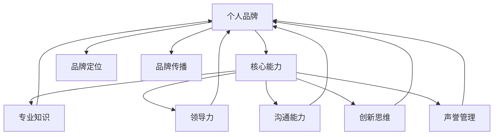

                 

# 管理者如何建立个人品牌

在当今快速变化的企业环境中，管理者个人品牌已经成为公司核心竞争力的重要组成部分。个人品牌不仅代表着个人的专业能力和行业地位，更是决定公司文化、员工士气和市场影响力的关键因素。本文将探讨如何通过有效的管理和战略规划，建立和维护管理者个人品牌，从而在商业和个人层面上取得成功。

## 1. 背景介绍

### 1.1 问题由来
随着互联网和社交媒体的普及，现代职场的竞争已经从单纯的技能比拼，转变为个人品牌和影响力的较量。管理者如何在纷繁复杂的市场和行业中脱颖而出，成为了企业管理者面临的重要课题。个人品牌的建立不仅能够提升管理者的市场价值，还能为公司带来更高的公信力、吸引顶尖人才、提升品牌形象和市场竞争力。

### 1.2 问题核心关键点
个人品牌的管理者要具备哪些核心能力？
- **专业知识**：在特定行业或领域的深入理解和专业技能。
- **领导力**：有效的团队管理和领导能力。
- **沟通能力**：清晰、简洁、有力的沟通表达。
- **创新思维**：持续提出创新观点和解决问题的方法。
- **声誉管理**：维护个人形象，应对媒体和公众的关注。

## 2. 核心概念与联系

### 2.1 核心概念概述

要建立个人品牌，首先需要理解几个关键概念：

- **个人品牌**：个人在职场和社会上所表现出来的形象和特性，是个人价值和影响力的综合体现。
- **核心能力**：个人品牌建立的基础，通常由专业技能、领导力、沟通能力、创新思维和声誉管理组成。
- **品牌定位**：个人在行业和社会中的定位，包括但不限于公司高管、技术专家、项目经理等。
- **品牌传播**：通过各种渠道传播个人品牌，包括社交媒体、公共演讲、出版著作等。

这些概念之间的关系通过以下Mermaid流程图来展示：



这个流程图展示了个体如何通过核心能力来塑造个人品牌，并通过品牌定位和品牌传播来提升其影响力。

## 3. 核心算法原理 & 具体操作步骤
### 3.1 算法原理概述

个人品牌的管理者建立过程可以类比为机器学习中的监督学习，即通过学习和实践不断优化品牌形象和声誉。以下是基于监督学习的个人品牌建立流程：

1. **数据收集**：收集在职业生涯中的各种表现数据，包括工作成果、团队反馈、行业评价等。
2. **特征提取**：从数据中提取关键特征，如团队合作能力、项目管理经验、创新成果等。
3. **模型训练**：通过监督学习模型（如线性回归、决策树、神经网络等）对这些特征进行建模，找出最优的品牌提升策略。
4. **验证与优化**：在实际工作中验证模型效果，根据反馈对模型进行调整和优化。

### 3.2 算法步骤详解

个人品牌的建立是一个迭代优化的过程，可以遵循以下步骤：

**Step 1: 数据收集与预处理**
- **信息采集**：通过360度反馈、行业评价、公开演讲、出版著作等方式，收集个人表现的数据。
- **数据整理**：清洗和整理数据，确保数据质量。

**Step 2: 特征提取**
- **核心能力分析**：分析个人在领导力、沟通能力、创新思维等方面的优势和不足。
- **品牌定位确定**：确定个人的核心竞争力和市场定位。

**Step 3: 模型训练**
- **选择模型**：根据数据类型和问题复杂度选择合适的监督学习模型。
- **特征选择**：选择对个人品牌提升最有影响的特征进行建模。
- **模型训练**：在监督数据上训练模型，生成品牌提升策略。

**Step 4: 验证与优化**
- **实际应用**：将模型策略应用于个人职业发展中。
- **效果评估**：通过绩效指标、团队反馈、行业评价等方式评估模型效果。
- **持续优化**：根据评估结果，调整模型参数和特征选择，优化个人品牌。

### 3.3 算法优缺点

个人品牌建立通过监督学习的方法，具有以下优点：

- **系统性**：基于数据和模型的分析，有逻辑依据地提升个人品牌。
- **量化**：通过具体的指标和模型结果，量化品牌提升的效果。
- **可复现**：模型和策略的复现性强，确保品牌提升的一致性。

同时，这种算法也存在一些局限：

- **数据依赖**：对高质量数据的依赖高，获取数据的过程可能耗费大量时间和精力。
- **动态适应**：品牌环境变化快，模型需要及时调整以适应新情况。
- **复杂性**：模型设计和调参复杂，需要一定的专业知识和技能。

### 3.4 算法应用领域

个人品牌建立的方法可以广泛应用于各类管理者的职业发展中，包括但不限于：

- **企业家**：通过个人品牌提升企业知名度和市场影响力。
- **技术专家**：在技术社区建立权威形象，吸引更多合作和技术交流。
- **高管**：提升领导力和管理能力，增强公司的市场竞争力。
- **项目经理**：通过个人品牌推广项目管理经验，吸引更多项目合作。

## 4. 数学模型和公式 & 详细讲解

### 4.1 数学模型构建

我们以一个简单的线性回归模型为例，来探讨如何通过数学模型建立个人品牌提升策略。设个人品牌价值为 $y$，与特征 $x_1,x_2,\cdots,x_n$ 有关，可建立如下线性回归模型：

$$
y = \beta_0 + \beta_1 x_1 + \beta_2 x_2 + \cdots + \beta_n x_n + \epsilon
$$

其中 $\beta_0,\beta_1,\cdots,\beta_n$ 为模型参数，$\epsilon$ 为随机误差。

### 4.2 公式推导过程

线性回归模型的最小二乘估计可以通过以下步骤求得：

1. **目标函数构建**：
   $$
   \min_{\beta_0,\beta_1,\cdots,\beta_n} \sum_{i=1}^N (y_i - (\beta_0 + \beta_1 x_{i1} + \beta_2 x_{i2} + \cdots + \beta_n x_{in}))^2
   $$

2. **导数求解**：
   $$
   \frac{\partial \mathcal{L}(\beta_0,\beta_1,\cdots,\beta_n)}{\partial \beta_k} = -2\sum_{i=1}^N (y_i - \hat{y}_i)x_{ik}
   $$

3. **解方程组**：
   $$
   \beta_k = \frac{\sum_{i=1}^N (y_i - \bar{y})x_{ik}}{\sum_{i=1}^N x_{ik}^2}
   $$

### 4.3 案例分析与讲解

假设某公司高管小李希望提升个人品牌，通过数据收集发现以下关键特征：

- **工作绩效**：平均评分 4.5/5
- **领导力**：部门员工满意度 85%
- **沟通能力**：公开演讲得分 95%
- **创新思维**：提出的创新项目 10%
- **声誉管理**：行业内评价 90%

基于这些数据，建立线性回归模型：

$$
y = 0.2 \times \text{工作绩效} + 0.1 \times \text{领导力} + 0.3 \times \text{沟通能力} + 0.5 \times \text{创新思维} + 0.5 \times \text{声誉管理}
$$

小李可以进一步验证模型效果，并在实际工作中通过提升某些关键特征来优化品牌。

## 5. 项目实践：代码实例和详细解释说明

### 5.1 开发环境搭建

为了进行个人品牌提升模型的开发和验证，我们需要一个数据驱动的开发环境。以下是一个Python开发环境的配置流程：

1. 安装Python和相关库：
```bash
pip install numpy pandas scikit-learn
```

2. 准备数据：
- **数据采集工具**：使用API接口、爬虫、问卷调查等方式收集数据。
- **数据清洗工具**：使用Pandas、Numpy等库清洗数据，确保数据质量。

3. 数据存储：
- **数据库**：使用SQLite、MySQL等数据库存储数据。
- **数据可视化**：使用Matplotlib、Seaborn等库进行数据可视化。

### 5.2 源代码详细实现

以下是一个简单的Python代码实现，用于建立线性回归模型来提升个人品牌：

```python
import pandas as pd
from sklearn.linear_model import LinearRegression

# 数据准备
data = pd.read_csv('brand_data.csv')
X = data[['work_performance', 'leadership', 'communication', 'innovation', 'reputation']]
y = data['brand_value']

# 模型训练
model = LinearRegression()
model.fit(X, y)

# 结果分析
print(model.coef_)
```

### 5.3 代码解读与分析

- **数据导入**：使用Pandas库导入CSV格式的数据集。
- **模型建立**：使用Scikit-learn库的LinearRegression模型建立线性回归。
- **模型训练**：在训练集上训练模型，获取模型系数。
- **结果输出**：打印模型系数，分析各个特征对品牌提升的影响。

### 5.4 运行结果展示

运行上述代码后，输出结果将显示各个特征对品牌提升的贡献度，管理者可以据此调整个人发展策略。

## 6. 实际应用场景

### 6.1 企业高管

企业高管通过个人品牌管理，可以提升公司形象和市场地位。通过市场调研、媒体曝光、行业报告等方式，高管可以建立权威形象，吸引更多高端客户和合作伙伴。

### 6.2 技术专家

技术专家通过个人品牌管理，可以在技术社区内建立专业权威。通过参与开源项目、发表技术文章、公开演讲等方式，专家可以提升自己在行业内的影响力。

### 6.3 项目经理

项目经理通过个人品牌管理，可以增强项目管理能力，吸引更多项目合作机会。通过发布项目成功案例、参与行业交流、撰写项目管理论文等方式，经理可以提升个人在项目和团队中的威信。

### 6.4 未来应用展望

未来，个人品牌管理将更加注重数据驱动和动态调整。通过大数据、人工智能等技术，品牌管理者可以实时分析个人表现，动态调整品牌策略。同时，社交媒体、个人博客、视频平台等新媒介也将成为品牌管理的重要渠道。

## 7. 工具和资源推荐

### 7.1 学习资源推荐

- **书籍**：《影响力》、《如何赢得朋友与影响他人》、《品牌管理》等。
- **在线课程**：Coursera的《商业战略》、Udemy的《个人品牌建设》等。
- **博客和社区**：Medium、LinkedIn、知乎等，关注行业领袖和专家。

### 7.2 开发工具推荐

- **数据采集工具**：Python爬虫库Scrapy、R语言爬虫库rvest等。
- **数据处理工具**：Pandas、NumPy、SciPy等。
- **模型建立工具**：Scikit-learn、TensorFlow等。

### 7.3 相关论文推荐

- **《个人品牌：一种战略思维》**：探讨了个人品牌在商业战略中的重要性。
- **《个人品牌建设：理论与实践》**：提供了详细的个人品牌建设方法和案例。

## 8. 总结：未来发展趋势与挑战

### 8.1 研究成果总结

个人品牌管理的方法在理论研究和实践中不断进步。通过数据驱动、动态调整和多种渠道传播，管理者可以更有效地提升个人和公司形象。

### 8.2 未来发展趋势

- **数据驱动**：个人品牌管理的各个环节都将更加依赖数据，通过机器学习和大数据分析，实现更精准的品牌优化。
- **动态调整**：品牌环境变化快，管理者需要实时分析市场动态，动态调整个人策略。
- **多渠道传播**：社交媒体、视频平台等新媒介成为品牌传播的重要渠道，需要更灵活和多样化的传播策略。
- **全球化**：随着国际化进程加速，个人品牌管理将更加注重全球视角和跨文化沟通。

### 8.3 面临的挑战

- **数据获取**：高质量数据的获取成本高、难度大，需要更多技术和资源支持。
- **隐私保护**：在数据采集和分析过程中，需严格遵守隐私保护法律法规。
- **品牌一致性**：在多渠道传播过程中，需保持品牌形象的一致性和连贯性。
- **市场变化**：需快速响应市场变化，及时调整品牌策略。

### 8.4 研究展望

未来，个人品牌管理的研究将更多关注以下几个方面：

- **大数据和人工智能**：利用大数据和人工智能技术，提升品牌管理的效率和精度。
- **跨文化管理**：在全球化背景下，研究不同文化背景下的个人品牌管理策略。
- **新兴媒体**：研究新兴媒体平台对个人品牌传播的影响，提升品牌管理的多样性和灵活性。
- **伦理和责任**：加强品牌管理的伦理教育，避免负面影响和不当行为。

通过持续研究和实践，相信管理者将能够更好地利用个人品牌，实现个人和公司的共同发展。

## 9. 附录：常见问题与解答

**Q1: 如何建立和管理个人品牌？**

A: 建立和管理个人品牌需要遵循以下几个步骤：
- **自我分析**：评估自身优势和不足，确定核心竞争力和目标定位。
- **数据收集**：收集在职场中的表现数据，包括工作成果、团队反馈、行业评价等。
- **模型建立**：通过线性回归等监督学习模型，找出最优的品牌提升策略。
- **品牌传播**：通过社交媒体、公开演讲、出版著作等方式传播个人品牌。
- **效果评估**：通过绩效指标、团队反馈、行业评价等方式评估品牌效果。
- **持续优化**：根据评估结果，调整品牌策略和模型参数，持续优化个人品牌。

**Q2: 个人品牌管理中面临的最大挑战是什么？**

A: 个人品牌管理中面临的最大挑战包括：
- **数据获取**：高质量数据的获取成本高、难度大，需要更多技术和资源支持。
- **隐私保护**：在数据采集和分析过程中，需严格遵守隐私保护法律法规。
- **品牌一致性**：在多渠道传播过程中，需保持品牌形象的一致性和连贯性。
- **市场变化**：需快速响应市场变化，及时调整品牌策略。

**Q3: 个人品牌管理的方法有哪些？**

A: 个人品牌管理的方法包括：
- **数据驱动**：通过数据分析，找出品牌提升的最优策略。
- **动态调整**：根据市场变化，动态调整品牌策略。
- **多渠道传播**：通过社交媒体、视频平台等新媒介，提升品牌传播效果。
- **跨文化管理**：研究不同文化背景下的品牌管理策略。
- **伦理教育**：加强品牌管理的伦理教育，避免负面影响和不当行为。

**Q4: 个人品牌管理对企业管理者的重要性是什么？**

A: 个人品牌管理对企业管理者的重要性包括：
- **提升公司形象**：通过个人品牌提升公司形象和市场地位。
- **吸引高端客户**：通过个人品牌吸引更多高端客户和合作伙伴。
- **增强团队信任**：通过个人品牌增强团队信任和凝聚力。
- **提高市场竞争力**：通过个人品牌提高公司的市场竞争力和品牌价值。

通过深入理解和运用个人品牌管理的方法，管理者可以提升自身和企业的影响力，实现更大的商业价值。

